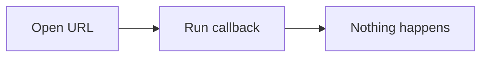

# BUG-015: Mermaid の `click` で URL を定義したノードを押すと、WebView の中でページが遷移する

| 項目 | 内容 |
| --- | --- |
| 不具合番号 | **BUG-015** |
| 報告日 | 2026-09-17 |
| 対象 | `v1.0.0`（`73778a9`）と、v1.1.0 の作業ツリー。**同梱の Mermaid はどちらも 11.17.2** |
| 検出 | **v1.1.0 の実装（T19-2）で、E2E-234 の検証用データ `testdata/e2e/mermaid.md` を作り、本物の変換（`internal/document`）・本物のフロントエンド（`index.html` と `main.js`）・同梱の Mermaid をヘッドレスの Microsoft Edge で動かして見つけた**（使い捨ての DOM 検査 `workspace/tmp/_datacheck`）。**手動テストでは出ていない**（下の 4 章） |
| 環境 | **OS に依存しない見込み**（同梱の Mermaid の出力と `frontend/js/viewer.js` だけで決まる）。**v1.0.0 の実機で再現した**（6 章）。L1 の修正前の再現は記録が無い |
| 関連要求 | MD-081, AR-060, NFR-030, FR-023, FR-050, FR-063, FR-122, UI-104, IMP-223, IMP-231, IMP-249, IMP-253, E2E-234 |
| 分類 | **仕様の不足**（実装仕様が、`click` のリンクジャンプを `securityLevel: 'strict'` だけで止められると見ていた。本文のリンクの捕捉は `href` 属性だけを見ると定めていた）。**実装は仕様どおりである** |
| 状態 | **修正済み（仕様 4.59.0。T19-7）**。**利用者が v1.0.0 の実機で再現を確かめた**（「リンクジャンプが発動してアプリケーションがリンク先になって戻れなくなる」。2026-09-17。環境の記載なし）。修正の後の実機での確認は T20-5（E2E-234 を W1 / L1） |

---

## 1. 症状

`testdata/e2e/mermaid.md` の 1 節の図（次の定義）を描いて、`Open URL` のノードをクリックする。



| # | 見たもの（ヘッドレスの Edge） | 見つけた時点の期待（4.58.0 の E2E-234 の確認内容 4、MD-081、AR-060。**4.59.0 で改めた**——5 章） |
| --- | --- | --- |
| 1 | **同梱の Mermaid 11.17.2 は、`securityLevel: 'strict'` でも `A` のノード（`g.node.clickable`）を SVG の `<a xlink:href="https://example.com/mermaid-click">` で包む** | `click` によるリンクジャンプは無効（MD-081） |
| 2 | **ノードをクリックすると、`click` イベントの既定の動作が止められず、ページが `https://example.com/mermaid-click` へ遷移する。** 検査のページが失われ、結果が 1 行も取り出せなかった | **何も起こらない。** ブラウザも開かず、ページも遷移しない（E2E-234 の確認内容 4）。WebView 内でのページ遷移は一切発生させない（AR-060） |
| 3 | コールバックの `B` のノードは `clickable` のクラスを持つが、`<a>` にもハンドラにもならず、何も起きない | 同上（こちらは期待どおり） |

- **MarkView のウィンドウで起きれば、本文・ツールバー・ペインを含む画面全体が外部のページに置き換わる**（アプリケーションは 1 つのウィンドウに 1 つのページだけを持つ。AR-060）。戻る操作は MarkView の履歴（FR-051）であり、WebView の履歴ではないため、**利用者は起動し直すしかない**見込みである。
- **文書は第三者から受け取りうる**（NFR-030）。書き手は、利用者が図のノードを押したときに MarkView のウィンドウへ任意のページを出させられる。
- **拡大画面（FR-122）へ移した図でも、クリックの既定の動作が止まらない**（下の 2.3）。

---

## 2. 原因

### 2.1 `strict` は URL へのリンクを止めない

MD-081 は「`click` によるリンクジャンプは無効とする」と定め、IMP-231 はその手段を `securityLevel: 'strict'` とした。**同梱の Mermaid 11.17.2 では、`strict` でも URL を指定した `click` はリンク（`<a xlink:href>`）として出力される。** 止まるのはコールバック（`click B callback`）だけだった（1 章の表）。

### 2.2 本文のリンクの捕捉は `href` 属性だけを見る

`frontend/js/viewer.js:49-56`（v1.0.0 は同じファイルの `onLinkClick`。`viewer.js:32-39`）:

```js
const anchor = event.target.closest("a");   // SVG の <a> も見つかる
if (!anchor) return;
const href = anchor.getAttribute("href");   // xlink:href は読まない → null
if (!href) return;                           // ← preventDefault の前に戻る
event.preventDefault();
```

IMP-223 は「`href` が存在すれば常に `preventDefault()` を呼ぶ」と定めており、**`href` を持たない `<a>`（SVG の `xlink:href`）を考えていない。** 既定の動作が残り、SVG のリンクとして遷移する。

### 2.3 拡大画面には本文のリンクの捕捉が無い

拡大画面（IMP-253）は図の SVG を `#markdown` の外（`#expand-view`）へ移す。`#markdown` の `click` のリスナは届かず、`#expand-view` にはリンクを止める処理が無い。**2.2 を直しても、拡大画面で同じノードを押すと遷移しうる。** T19-7 の DOM 検査で、拡大画面の 2 つのリンクのクリックの既定の動作が止まらないことを確かめた（ヘッドレスの Edge。実機では、ドラッグの `setPointerCapture` によりクリックが舞台へ届き、遷移しない場合もありうる）。

---

## 3. 原因の分類 — 仕様か、実装か

- **一次原因は仕様の不足である。** 要求（MD-081, AR-060）は正しいが、実装仕様（IMP-231）は処理系の設定だけで要求を満たせると見ており、IMP-223 は SVG のリンクを想定していなかった。CLAUDE.md の「描画エンジンの既定の振る舞いに、要求の充足を委ねない」（NFR-061）と同じ形の見落としであり、**同梱資産の設定に要求の充足を委ねていた。**
- **実装は仕様どおりである**（`lazy.js` の `securityLevel: "strict"`、`viewer.js` の `href` の判定）。

---

## 4. なぜ見つからなかったのか

| 層 | 見つからなかった理由 |
| --- | --- |
| 単体テスト | フロントエンドは対象外（UT-002） |
| 描画スモーク（BR-054） | 図が描けること・目印の照合を見る。**図の中のリンクを押す操作は無い** |
| 自動 E2E | ウィンドウを操作しない（E2E-020） |
| 手動テスト（v1.0.0 の rc.4） | **E2E-234 は OK だった。** ただし前提条件は「複数種類の Mermaid 図を含む文書を開いている」であり、**使った文書に URL を指定した `click` が含まれていたかの記録が無い**（検証用データが無かった）。v1.1.0 で `mermaid.md` を E2E-012 に足し、1 節に URL とコールバックの両方を置いた |

> [!IMPORTANT]
> **手動テストの手順が「〇〇を含む文書」だけを指定していると、確かめたいものが文書に入っていたかを後から検証できない。**
> v1.1.0 で検証用データを足したのは、この種の取りこぼしを防ぐためであり、**データを作った段階で実際に開いて確かめたことで見つかった。**

---

## 5. 修正（仕様 4.59.0。利用者の判断を含む）

### 5.1 決めた振る舞い

| 場所 | リンクの種類 | 押したとき |
| --- | --- | --- |
| 本文 | `click` で URL を指定したノード（SVG の `<a xlink:href>`） | **本文中のリンクと同じく Go へ渡す**（FR-050。`http://` / `https://` は既定のブラウザで開く）。**利用者の判断**——図の中のリンクは既定のブラウザで開きたい |
| 本文 | ノードのラベルに書いた HTML の `<a href>`（`strict` でも残る） | 同上（v1.0.0 と同じ） |
| 本文 | `click` のコールバック | 何もしない（`strict` が止める） |
| 拡大画面 | 上の 2 種のリンク | **何もしない**（遷移もせず、ブラウザも開かない。**利用者の判断**。拡大画面は図をドラッグして見る画面で、背後の操作を受け付けない。UI-104） |

- **PlantUML の `[[URL]]` は、同梱の版（1.2026.7）ではリンクにならなかった**（参加者・メッセージ・注釈の 3 通りの書き方で、SVG に `<a>` が無い）。PlantUML の図の中にリンクが出た場合も、同じ規則で扱う。
- この報告の初版（T19-2）の 5 章は、図の中のリンクを「何もしない」とする案を推していたが、**利用者は Go へ渡して既定のブラウザで開くことを選んだ。** MD-081 の「`click` によるリンクジャンプは無効とする」は、「WebView の中では遷移させず、本文のリンクと同じく扱う」に改めた。

### 5.2 実装

| ファイル | 変更 |
| --- | --- |
| `frontend/js/util.js` | **`linkHref(anchor)` を足した**——`href` 属性、無ければ `xlink:href` を返す。`a.href`（解決済みの URL）は使わない |
| `frontend/js/viewer.js` | 本文のリンクの捕捉（`onLinkClick`）のリンク先を `linkHref` で求める。**`#expand-view` にもリスナを置き、リンクの既定の動作だけを止める**（`onExpandLinkClick`。何もしない）。`expand.js` には置かない（止める規則を 1 か所にまとめる。`expand.js` は 400 行ちょうど） |
| `frontend/js/contextmenu.js` | `Copy link address` のリンク先も `linkHref` で求める（図の `click` の URL のノードでも行が出る。IMP-249） |
| `testdata/e2e/mermaid.md` | 1 節にラベルのリンクのノード（`label link`）を足し、押したときの振る舞いの説明を改めた |

### 5.3 確かめたこと（使い捨ての DOM 検査。ヘッドレスの Edge）

- `workspace/tmp/_linkcheck`: 本文の普通のリンク・図の `click` の URL・ラベルのリンクはどれも既定の動作を止めて書かれたリンク先で `FollowLink` を呼ぶ、コールバックのノードは何も呼ばない、`Copy link address` は `xlink:href` の値をコピーする、拡大画面の 2 つのリンクは既定の動作を止めて何も呼ばず拡大画面は開いたまま、拡大画面のリンクでない所のクリックは止めない。**実装を 7 通り壊すとすべて FAIL**。
- `workspace/tmp/_datacheck`（`mermaid.md`）: 1 節の 3 つのノードを押したときの振る舞いが 5.1 の表どおり。

---

## 6. 実機での再現（利用者。2026-09-17）

**v1.0.0 で NG を確かめた**——「リンクジャンプが発動してアプリケーションがリンク先になって戻れなくなる」。**環境（W1 / L1）の記載は無い。** 修正の後の確認は T20-5 で、E2E-234（4.59.0 で手順 3〜5 と確認内容 4〜6 に改めた）を W1 と L1 の両方で行う。

---

## 7. 関連して見つけたもの

**BUG-016**（リンクをマウスの中ボタンで押したとき、既定の動作を止めていない）。BUG-015 の調査の DOM 検査で見つけた。**実機で確かめてから直す**（利用者の判断）。[調査報告](2026-09-17-bug-016-link-middle-click.md)。
