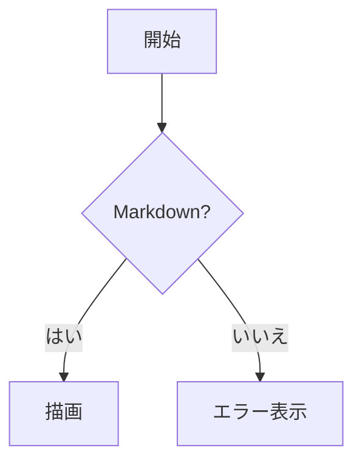

# 対応する Markdown 記法

MarkView は **GitHub Flavored Markdown（GFM）** に沿って描画します。
見た目の基準は「同じファイルを GitHub のファイルビューで開いたときの表示」です。

変換は Go 側で行い、ブラウザ用の Markdown パーサやハイライタは持ちません。
フロントエンドで動くのは Mermaid と KaTeX だけです。

- [見出しとアンカー](#見出しとアンカー)
- [リストとタスクリスト](#リストとタスクリスト)
- [表](#表)
- [段落・改行・水平線](#段落・改行・水平線)
- [引用と折りたたみ](#引用と折りたたみ)
- [コードブロック](#コードブロック)
- [GitHub Alerts](#github-alerts)
- [脚注と絵文字](#脚注と絵文字)
- [数式](#数式)
- [Mermaid 図](#mermaid-図)
- [リンクと画像](#リンクと画像)
- [生 HTML](#生-html)
- [Front Matter](#front-matter)
- [文字コードと改行](#文字コードと改行)

## 見出しとアンカー

`#` 6 段階と、`===` / `---` による Setext 形式の両方に対応します。
`#` と `##` の下端には、GitHub と同じく境界線が入ります。

見出しには GitHub と互換のアンカーが自動で付きます。生成規則は次のとおりです。

1. 見出しからインライン記法を取り除き、プレーンテキストにする
2. 英大文字を小文字にする
3. 空白をハイフン `-` にする
4. 英数字・ハイフン・アンダースコア・**非 ASCII 文字（日本語など）以外**の記号を取り除く
5. 同じ文書内で重複したら、2 つ目以降に `-1` `-2` … を付ける

```markdown
## What's New?          →  #whats-new
## 1. はじめに           →  #1-はじめに
## foo_bar-baz          →  #foo_bar-baz
```

このため、**GitHub の README に書いた `#見出し` 形式のリンクがそのまま動きます**。

## リストとタスクリスト

- 順序なし・順序付き・入れ子のいずれにも対応します。
- タスクリスト `- [ ]` / `- [x]` はチェックボックスとして描画します。
  **読み取り専用**で、クリックしても状態は変わりません（MarkView は編集しません）。

## 表

GFM のパイプ記法に対応し、`:---` `:---:` `---:` による桁揃えを反映します。
幅が本文を超える場合は、**表の内部で横スクロール**します。ページ全体は横に伸びません。

## 段落・改行・水平線

- `---` `***` `___` を水平線として描画します。
- 行末の半角スペース 2 個、およびバックスラッシュ `\` による強制改行に対応します。
- **段落の途中の単純な改行は、改行になりません**（空白として扱います）。GFM と同じです。

## 引用と折りたたみ

`>` による引用のほか、`<details>` / `<summary>` による折りたたみが開閉できます。

```markdown
<details>
<summary>詳細を見る</summary>

折りたたまれている内容。

</details>
```

## コードブロック

フェンス（``` または `~~~`）の言語指定に従ってハイライトします。

- **ハイライトは Go 側で行い、HTML として出力します。** テーマを切り替えても再変換は起きません。
- 言語指定がない場合はハイライトせず、等幅フォントで表示します。**言語の自動判定はしません。**
- 知らない言語名を指定してもエラーにならず、ハイライトなしで表示します。
- 行番号は表示しません（GitHub のファイルビューと同じ）。
- 幅を超える場合は**ブロック内で横スクロール**します。折り返しません。
- 右上にコピーボタンが出ます。

### ハイライトできる言語

Go, C, C++, C#, Java, Kotlin, Swift, Rust, Python, Ruby, PHP, JavaScript, TypeScript,
JSX/TSX, HTML, CSS, SCSS, SQL, Shell / Bash, PowerShell, Batch, Dockerfile, Makefile,
YAML, TOML, JSON, XML, INI, Diff / Patch, Markdown, Lua, Perl, R, Scala, Haskell,
Elixir, Zig, Terraform (HCL), Protobuf, GraphQL, Vim script, AWK

`sh` / `bash` / `zsh`、`py` / `python`、`yml` / `yaml`、`ps1` / `powershell` のような
別名も解決します。

インラインコード `` `code` `` は、淡い背景の付いた等幅テキストになります。

## GitHub Alerts

引用の先頭行が次の形式のとき、専用の装飾になります。

| 記法 | 表示 | 色 |
| --- | --- | --- |
| `> [!NOTE]` | Note | 青 |
| `> [!TIP]` | Tip | 緑 |
| `> [!IMPORTANT]` | Important | 紫 |
| `> [!WARNING]` | Warning | 黄 |
| `> [!CAUTION]` | Caution | 赤 |

```markdown
> [!WARNING]
> 元に戻せない操作です。
```

- 大文字小文字は区別しません（`[!note]` も有効）。
- 種別として認識できないもの（`> [!FOO]` など）は、**通常の引用**として描画します。

## 脚注と絵文字

脚注は GFM の記法に対応します。

```markdown
本文に脚注を付けます[^1]。

[^1]: 脚注の内容。
```

本文中は `[1]` の形で表示され、文書末尾の一覧から `↩` で元の位置に戻れます。
**参照番号は出現順に振り直します**（GitHub と同じ）。`[^note]` のような名前を付けても、
表示は `[1]` `[2]` … になります。

`:sparkles:` のような GitHub の絵文字ショートコードは、対応する絵文字に変換します。
**テキストとして出力する**ため、コピーすると絵文字そのものが得られます。
知らないショートコードはそのまま文字として表示します。

## 数式

GitHub と同じ 3 つの記法に対応します。描画は KaTeX で行い、**外部通信はありません**。

| 記法 | 種別 |
| --- | --- |
| `$...$` | インライン数式 |
| `$$...$$` | ブロック数式（独立行・中央揃え） |
| ` ```math ` コードブロック | ブロック数式 |

```markdown
インライン数式は $E = mc^2$ のように書きます。

$$\int_{0}^{\infty} e^{-x^2} dx = \frac{\sqrt{\pi}}{2}$$
```

- **通貨表記は数式になりません。** `$100 と $200` はそのまま表示されます。
  GitHub と同じ判定規則（`$` の前後の空白の扱い）に従います。
- コードブロックとインラインコードの中の `$` は数式として解釈しません。
- 構文に誤りがある場合、その箇所だけが赤く表示されます。**文書全体の描画は止まりません。**

数式を含む文書を開いたときにだけ KaTeX を読み込みます。含まない文書では読み込みません。

## Mermaid 図

言語指定が `mermaid` のコードブロックを図として描画します。

````markdown

````

- **同梱している Mermaid が対応する図種別はすべて使えます。** フローチャート、シーケンス図、
  クラス図、状態遷移図、ER 図、ガント、円グラフ、Git グラフなど。同梱バージョンは
  `F1`（アプリケーション情報）で確認できます。
- 図は本文幅に収まるよう縮小し、縦横比を保ちます。
- テーマに追従します。Light では明るい配色、Dark では暗い配色になります。
- 定義に誤りがある場合、そのブロックだけエラー内容を表示し、**元のソースはコードブロックの
  まま残ります**。他の図の描画は止まりません。
- 図を含む文書を開いたときにだけ Mermaid を読み込みます。

> [!IMPORTANT]
> Mermaid は `securityLevel: strict` で動かしています。**図の定義からスクリプトや
> クリックハンドラが実行されることはありません。** `click` によるリンクジャンプも無効です。

## リンクと画像

インラインリンク・参照リンク・自動リンク（URL の裸書き）に対応します。
**リンクには常に下線が引かれます。** 色だけで区別すると、色覚によっては見分けられないためです。

遷移先ごとの動作は [使い方](./usage.md#リンクをたどる) を参照してください。

画像は次のように扱います。

- 相対パスは**表示中の Markdown ファイルがあるディレクトリ**を基準に解決します。
- 対応形式は PNG、JPEG、GIF（アニメーション含む）、SVG、WebP、AVIF、BMP、ICO です。
- `http://` `https://` のリモート画像も表示します（このときだけ WebView が外部へ接続します）。
- 画像が見つからない・読めない場合は、代替テキスト（alt）とプレースホルダを表示します。
  **文書全体の描画は止まりません。**
- 本文幅を超える画像は、縦横比を保って縮小します。

## 生 HTML

Markdown 中に直接書かれた HTML は、**サニタイズしたうえで**描画します。

許可するのは、文章の構造と装飾に関わる要素だけです（`a` `strong` `em` `code` `pre`
`table` 系、`details` / `summary`、`img`、`kbd`、`sub` / `sup`、`ruby` など）。

次のものは黙って取り除きます。エラーにはなりません。

- `script` `style` `iframe` `object` `embed` `form` `input` `button` `link` `meta` `base`
- インライン `svg` と `math`
- `on` で始まるすべてのイベントハンドラ属性（`onclick` `onerror` など）
- `javascript:` `vbscript:` で始まる URL、および `data:image/svg+xml`
- `style` 属性

> [!IMPORTANT]
> これは**任意の第三者から受け取った Markdown を開く**という使い方を前提にした安全対策です。
> 許可リストは実行ファイルに固定されており、設定で緩めることはできません。

例外はタスクリストのチェックボックスで、`type="checkbox"` と `checked` / `disabled` に
限って通します。読み取り専用でスクリプトを伴いません。

## Front Matter

文書の先頭にある `---` で囲まれた YAML、`+++` で囲まれた TOML は Front Matter として
認識し、**本文には表示しません**。

```markdown
---
title: 設計メモ
description: 検証用
---

# 設計メモ
```

- 1 行目から始まる場合だけ認識します。
- 内容を表として表示する機能はありません。
- `title` があってもウィンドウタイトルには使いません。**タイトルは常にファイル名**です。

## 文字コードと改行

- UTF-8（BOM の有無を問わず）を読みます。BOM は本文に出ません。
- 改行は CRLF / LF / CR のいずれも正しく解釈します。
- UTF-8 として不正なバイト列は `U+FFFD`（`�`）に置き換えて読み進め、ステータスに警告を出します。
  **読み込み自体は失敗しません。**

> [!NOTE]
> Shift_JIS などの自動判別は行いません。開発者向けの Markdown は UTF-8 が事実上の標準であり、
> 判別ロジックはサイズと誤判定のリスクに見合わないためです。

---

- 操作方法は [使い方](./usage.md) を参照してください。
- 表示がおかしい場合は [困ったときは](./troubleshooting.md) を参照してください。
