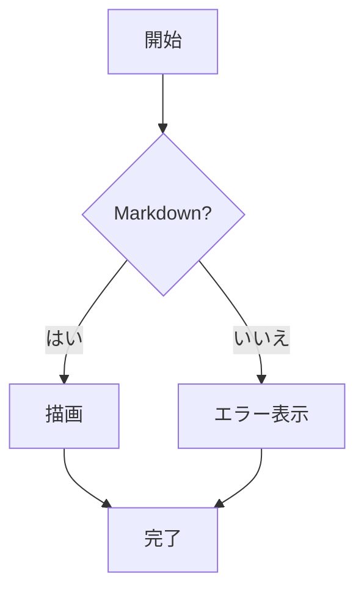
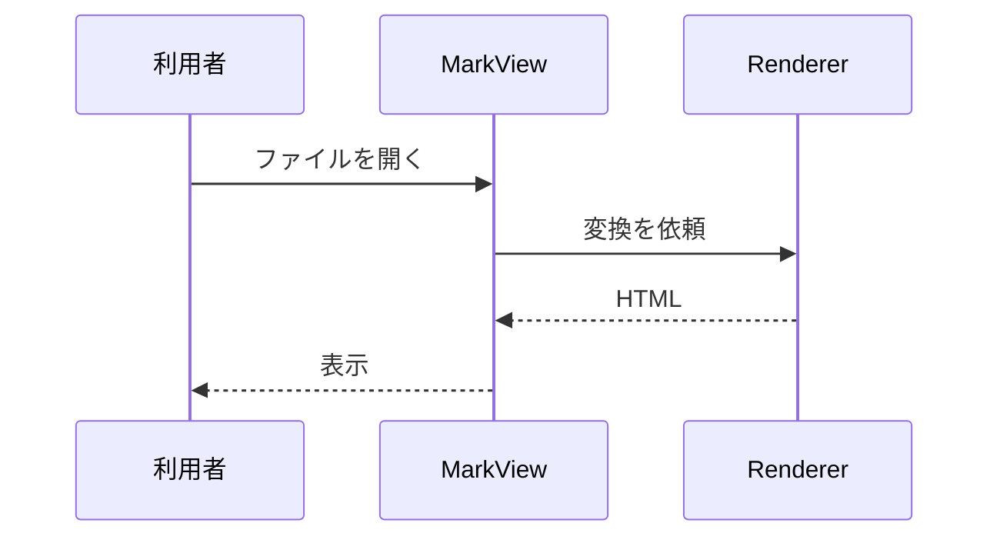
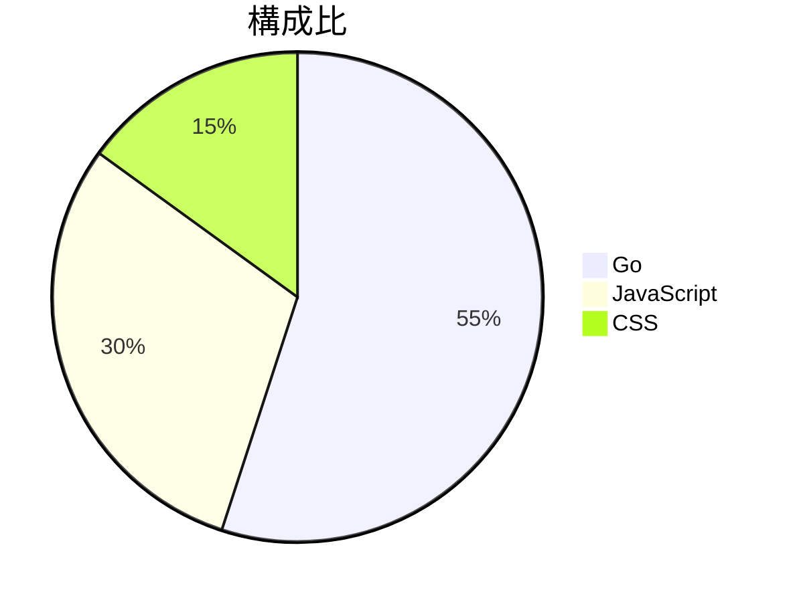
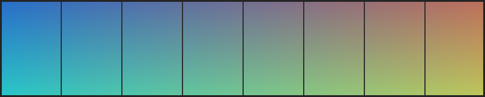

# 記法の見本

[対応する Markdown 記法](./markdown.md) が「どう扱うか」を説明するのに対して、
この文書は「**こう書くと、こう出る**」を実物で並べたものです。

**MarkView でこのファイルを開いて確かめてください。** GitHub 上でも同じように表示されます。
違って見える箇所があれば、それは MarkView の不具合です。

> [!NOTE]
> この文書の 1 行目には Front Matter があります。MarkView では**本文に出ません**
> （[Front Matter](#front-matter)）。GitHub では表として表示されるため、そこだけ見え方が違います。

- [見出しとアンカー](#見出しとアンカー)
- [リストとタスクリスト](#リストとタスクリスト)
- [表](#表)
- [段落・改行・水平線](#段落・改行・水平線)
- [引用と折りたたみ](#引用と折りたたみ)
- [コードブロック](#コードブロック)
- [GitHub Alerts](#github-alerts)
- [脚注と絵文字](#脚注と絵文字)
- [数式](#数式)
- [Mermaid 図](#mermaid-図)
- [リンクと画像](#リンクと画像)
- [生 HTML](#生-html)
- [Front Matter](#front-matter)
- [段落中の改行](#段落中の改行)

## 見出しとアンカー

こう書くと

```markdown
### レベル 3 の見出し
#### レベル 4 の見出し
##### レベル 5 の見出し
###### レベル 6 の見出し
```

こう出ます。**`#` と `##` の下端には境界線が入ります**（このページの `##` を見てください）。

### レベル 3 の見出し

#### レベル 4 の見出し

##### レベル 5 の見出し

###### レベル 6 の見出し

### アンカーは自動で付きます

こう書くと

```markdown
- [「表」の節へ](#表)
- [「Mermaid 図」の節へ](#mermaid-図)
- [「生 HTML」の節へ](#生-html)
```

こう出ます。**押すとその位置までスクロールします。**

- [「表」の節へ](#表)
- [「Mermaid 図」の節へ](#mermaid-図)
- [「生 HTML」の節へ](#生-html)

日本語の見出しはそのままアンカーになり、英字は小文字化されて空白がハイフンになります。

→ [対応する Markdown 記法](./markdown.md#見出しとアンカー)

## リストとタスクリスト

こう書くと

```markdown
- 順序なしリスト
  - 入れ子
    - さらに入れ子
- 2 つ目の項目

1. 順序付きリスト
2. 2 つ目
   1. 入れ子の順序付き

- [x] 済んだこと
- [ ] これからやること
```

こう出ます

- 順序なしリスト
  - 入れ子
    - さらに入れ子
- 2 つ目の項目

1. 順序付きリスト
2. 2 つ目
   1. 入れ子の順序付き

- [x] 済んだこと
- [ ] これからやること

チェックボックスは**読み取り専用**です。押しても状態は変わりません。

→ [対応する Markdown 記法](./markdown.md#リストとタスクリスト)

## 表

こう書くと

```markdown
| 左寄せ | 中央 | 右寄せ |
| :--- | :---: | ---: |
| Windows | WebView2 | 標準搭載 |
| Ubuntu | WebKitGTK 4.1 | 要インストール |
```

こう出ます

| 左寄せ | 中央 | 右寄せ |
| :--- | :---: | ---: |
| Windows | WebView2 | 標準搭載 |
| Ubuntu | WebKitGTK 4.1 | 要インストール |

幅が本文を超える表は、**表の内部で横スクロール**します。ページ全体は横に伸びません。

| # | 項目 A | 項目 B | 項目 C | 項目 D | 項目 E | 項目 F | 項目 G | 項目 H | 項目 I | 項目 J |
| --- | --- | --- | --- | --- | --- | --- | --- | --- | --- | --- |
| 1 | 値 1-A | 値 1-B | 値 1-C | 値 1-D | 値 1-E | 値 1-F | 値 1-G | 値 1-H | 値 1-I | 値 1-J |
| 2 | 値 2-A | 値 2-B | 値 2-C | 値 2-D | 値 2-E | 値 2-F | 値 2-G | 値 2-H | 値 2-I | 値 2-J |

→ [対応する Markdown 記法](./markdown.md#表)

## 段落・改行・水平線

こう書くと

```markdown
`---` `***` `___` のいずれも水平線になります。

---
```

こう出ます

---

→ [対応する Markdown 記法](./markdown.md#段落・改行・水平線)

## 引用と折りたたみ

こう書くと

```markdown
> 引用です。
> 複数行にわたって書けます。
>
> > 入れ子の引用。
```

こう出ます

> 引用です。
> 複数行にわたって書けます。
>
> > 入れ子の引用。

折りたたみはこう書くと

```markdown
<details>
<summary>詳細を見る</summary>

折りたたまれている中身。**Markdown も書けます。**

</details>
```

こう出ます。**三角を押すと開きます。**

<details>
<summary>詳細を見る</summary>

折りたたまれている中身。**Markdown も書けます。**

</details>

→ [対応する Markdown 記法](./markdown.md#引用と折りたたみ)

## コードブロック

こう書くと

````markdown
```go
// 見出しアンカーは GitHub 互換のスラッグを自前で作る。
func slug(text string) string {
	return strings.ToLower(strings.ReplaceAll(text, " ", "-"))
}
```
````

こう出ます。**右上にコピーボタンがあります**（半透明で常に置かれています）。

```go
// 見出しアンカーは GitHub 互換のスラッグを自前で作る。
func slug(text string) string {
	return strings.ToLower(strings.ReplaceAll(text, " ", "-"))
}
```

言語を変えると配色も変わります。

```python
def slug(text: str) -> str:
    return text.lower().replace(" ", "-")
```

```json
{
  "theme": "dark",
  "zoom": 110,
  "outlineVisible": true
}
```

```diff
-wails build -platform linux/amd64 -o MarkView
+wails build -platform linux/amd64 -tags webkit2_41 -o MarkView
```

言語指定がないとハイライトしません。**自動判定はしません。**

```
言語を指定していないコードブロック。
等幅フォントで、そのまま表示されます。
```

長い行は折り返さず、**ブロックの中で横スクロール**します。

```sh
wails build -platform linux/amd64 -tags webkit2_41 -ldflags "-s -w -X github.com/kznagamori/go_MarkView/internal/buildinfo.Version=v1.0.0" -o MarkView
```

インラインコードは `` `code` `` と書くと `code` になります。

→ [対応する Markdown 記法](./markdown.md#コードブロック)

## GitHub Alerts

こう書くと

```markdown
> [!NOTE]
> 補足です。

> [!WARNING]
> 元に戻せない操作です。
```

こう出ます

> [!NOTE]
> 補足です。読み飛ばしても困りません。

> [!TIP]
> 知っていると楽になることです。

> [!IMPORTANT]
> 見落とすと困ることです。

> [!WARNING]
> 元に戻せない操作です。

> [!CAUTION]
> 危険が伴います。

種別として認識できないものは、**通常の引用**になります。

> [!SOMETHING]
> これは Alerts ではなく、ただの引用として表示されます。

→ [対応する Markdown 記法](./markdown.md#github-alerts)

## 脚注と絵文字

こう書くと

```markdown
本文に脚注を付けます[^1]。名前を付けることもできます[^note]。

[^1]: 1 つ目の脚注。
[^note]: 2 つ目の脚注。表示は `[2]` になります。
```

こう出ます。**脚注の一覧はこの文書の末尾にあります。**

本文に脚注を付けます[^1]。名前を付けることもできます[^note]。

絵文字はこう書くと

```markdown
:sparkles: :rocket: :warning: :nosuchemoji:
```

こう出ます。**知らないショートコードはそのまま文字として残ります。**

:sparkles: :rocket: :warning: :nosuchemoji:

→ [対応する Markdown 記法](./markdown.md#脚注と絵文字)

## 数式

こう書くと

```markdown
インライン数式は $E = mc^2$ と $x_1 + x_2 = y$ のように書きます。

$$\int_{0}^{\infty} e^{-x^2} dx = \frac{\sqrt{\pi}}{2}$$
```

こう出ます

インライン数式は $E = mc^2$ と $x_1 + x_2 = y$ のように書きます。

$$\int_{0}^{\infty} e^{-x^2} dx = \frac{\sqrt{\pi}}{2}$$

コードブロック形式でも書けます。

````markdown
```math
\sum_{i=1}^{n} i = \frac{n(n+1)}{2}
```
````

```math
\sum_{i=1}^{n} i = \frac{n(n+1)}{2}
```

**通貨表記は数式になりません。** 次の行の `$100` と `$200` はそのまま出ます。

商品 A は $100 で、商品 B は $200 です。

下付き文字を含む $x_1 + x_2 = y$ も、`_` が強調として解釈されることはありません。

→ [対応する Markdown 記法](./markdown.md#数式)

## Mermaid 図

こう書くと

````markdown

````

こう出ます


同梱している Mermaid が対応する図種別はすべて使えます。





**図はテーマに追従します。** `Ctrl+Shift+T` で切り替えて確かめてください。
コピーボタンを押すと、描画された図ではなく**元の Mermaid ソース**がコピーされます。

→ [対応する Markdown 記法](./markdown.md#mermaid-図)

## リンクと画像

こう書くと

```markdown
- [同じフォルダの文書へ](./usage.md)（同じウィンドウで開く）
- [外部サイトへ](https://commonmark.org/)（既定のブラウザで開く）
- [画像をビューアで開く](./img/sample.png)（OS の既定アプリで開く）
- <https://github.com/kznagamori/go_MarkView>（自動リンク）
```

こう出ます。**リンクには常に下線が引かれます。**

- [同じフォルダの文書へ](./usage.md)（同じウィンドウで開く）
- [外部サイトへ](https://commonmark.org/)（既定のブラウザで開く）
- [画像をビューアで開く](./img/sample.png)（OS の既定アプリで開く）
- <https://github.com/kznagamori/go_MarkView>（自動リンク）

画像はこう書くと

```markdown

```

こう出ます。**本文幅を超える画像は縦横比を保って縮小されます**（原寸は 800 × 160）。


存在しない画像は、代替テキストとプレースホルダになります。
**これ以降の描画は止まりません。**


→ [対応する Markdown 記法](./markdown.md#リンクと画像)

## 生 HTML

許可された要素はそのまま使えます。こう書くと

```markdown
<kbd>Ctrl</kbd> + <kbd>F</kbd> で検索します。

H<sub>2</sub>O と E = mc<sup>2</sup>、<mark>強調</mark>、<abbr title="GitHub Flavored Markdown">GFM</abbr>。
```

こう出ます

<kbd>Ctrl</kbd> + <kbd>F</kbd> で検索します。

H<sub>2</sub>O と E = mc<sup>2</sup>、<mark>強調</mark>、<abbr title="GitHub Flavored Markdown">GFM</abbr>。

危険な要素と属性は**黙って取り除きます**。次の 2 行のソースには `<script>` と
`onclick` 属性が書かれていますが、**表示には何も出ません**（エラーにもなりません）。

<script>console.log("これは実行されません");</script>

<span onclick="alert(1)">この文字は残りますが、クリックしても何も起きません。</span>

→ [対応する Markdown 記法](./markdown.md#生-html)

## Front Matter

こう書くと

```markdown
---
title: 記法の見本
description: docs/markdown.md に対応する実物の見本
---

# 記法の見本
```

**本文には何も出ません。** この文書の 1 行目がまさにそれです。
`title` があってもウィンドウタイトルには使わず、タイトルは常にファイル名（`showcase.md`）です。

→ [対応する Markdown 記法](./markdown.md#front-matter)

## 段落中の改行

こう書くと

```markdown
この行のあとに単純な改行を入れています。
次の行は続けて表示されます。

この行の末尾には半角スペースを 2 個置いています。  
ここで改行されます。

バックスラッシュでも改行できます。\
ここでも改行されます。
```

こう出ます

この行のあとに単純な改行を入れています。
次の行は続けて表示されます。

この行の末尾には半角スペースを 2 個置いています。  
ここで改行されます。

バックスラッシュでも改行できます。\
ここでも改行されます。

→ [対応する Markdown 記法](./markdown.md#文字コードと改行)

---

## この文書に無いもの

次の 2 つは、正常なファイルの中では見せられません。

| 事項 | 確かめ方 |
| --- | --- |
| 不正な UTF-8 の置換 | `testdata/e2e/broken/invalid-utf8.md` を開くと、`�` に置き換わり、ステータスに警告が出ます |
| 大きなファイルの確認画面 | `go run ./scripts/gentestdata` で作られる `testdata/e2e/generated/large-12mb.md` を開きます |

---

- 記法の規則は [対応する Markdown 記法](./markdown.md) を参照してください。
- 操作方法は [使い方](./usage.md) を参照してください。

[^1]: 1 つ目の脚注です。本文の `[1]` から飛んできて、`↩` で戻れます。
[^note]: 2 つ目の脚注です。ソースでは `[^note]` と名前を付けていますが、**表示は出現順の `[2]`** になります。
