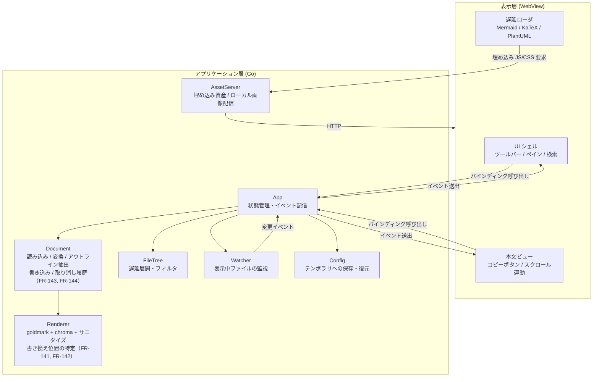
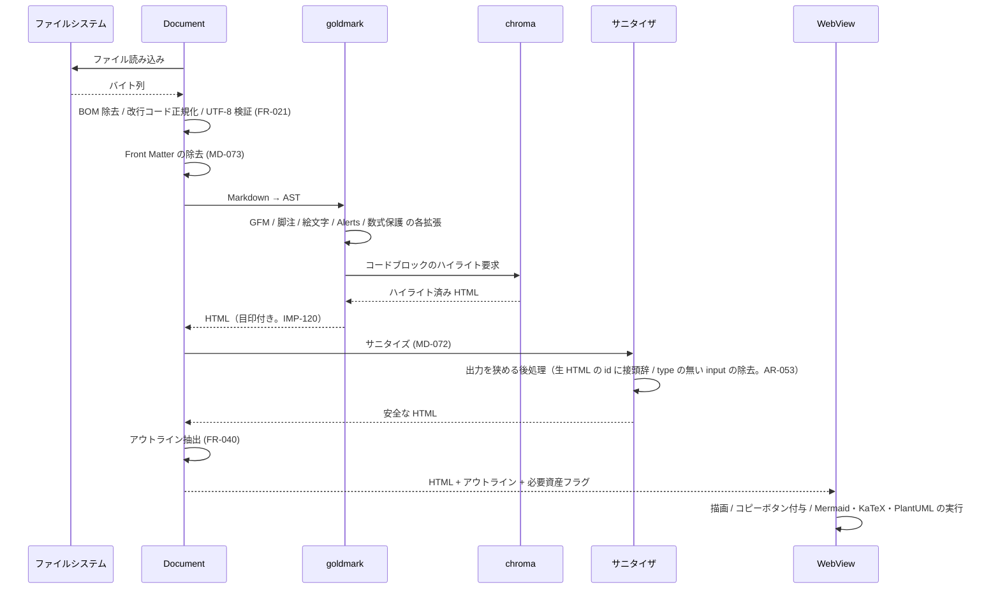
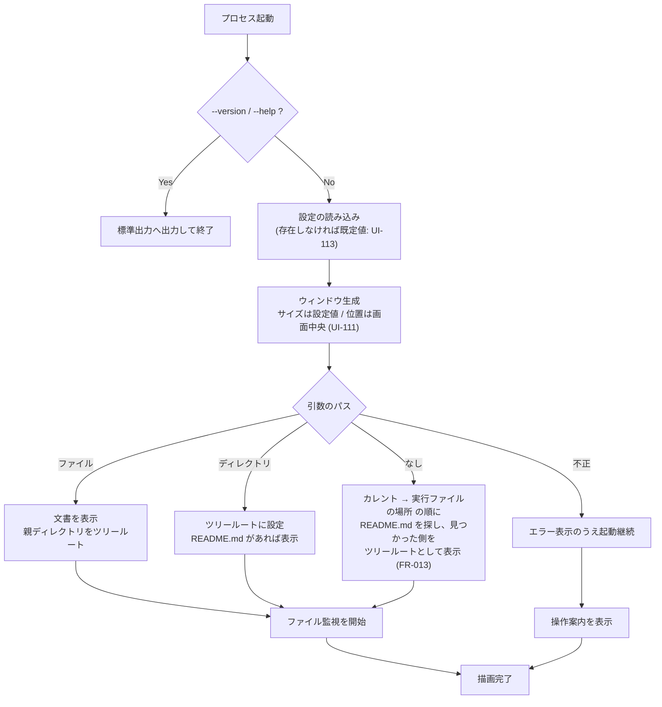

# 05. アーキテクチャ

> 索引: [README](README.md) | 前: [04. Markdown 描画仕様](04-markdown.md) | 次: [06. ビルド・配布](06-build-release.md)

本文書は、要求を満たすための技術構成と、その選定根拠・制約を定義する。ここに記載する内容は実装の指針であり、同等以上の結果が得られる代替手段を排除するものではないが、変更する場合は本文書を更新する。

## 5.1 全体方針（AR-001 系）

### AR-001: GUI 方式 **MUST**

**OS 標準の WebView を GUI として用い、Go で制御する。** フレームワークは **Wails v2** を採用する。

| 層 | 技術 | 役割 |
| --- | --- | --- |
| アプリケーション層 | Go | ファイル入出力、Markdown → HTML 変換、シンタックスハイライト、サニタイズ、ファイル監視、設定管理 |
| 表示層 | OS の WebView + HTML / CSS / JavaScript | 描画、ペインのレイアウト、スクロール、Mermaid・PlantUML・数式のレンダリング、ユーザ操作の受付 |
| 橋渡し | Wails のバインディング機構 | Go の関数を JavaScript から呼び出す／Go からイベントを送出する |

### AR-002: 選定根拠 **MUST**

要求（GitHub 準拠の見た目、Mermaid、軽量、1 実行ファイル）に対する主要な選択肢の比較は以下のとおり。

| 方式 | バイナリサイズ | GitHub 準拠の描画 | Mermaid | 実装量 | 判定 |
| --- | --- | --- | --- | --- | --- |
| **OS 標準 WebView（Wails v2）** | 中（10〜20 MB） | 容易（CSS をそのまま利用） | 容易（公式 JS をそのまま利用） | 小 | **採用** |
| ピュア Go GUI（Fyne 等） | 大（25〜40 MB） | 困難（HTML レンダラを自作） | 極めて困難 | 極大 | 不採用 |
| ローカル HTTP サーバ + 既定ブラウザ | 小（5 MB） | 容易 | 容易 | 小 | 不採用 |

- ピュア Go GUI は「1 実行ファイル・外部依存ゼロ」という点では最良だが、GitHub 準拠の描画と Mermaid を自前実装することになり、実装量とバイナリサイズの両面で要求と矛盾する。
- ローカル HTTP サーバ方式は最小サイズだが、独立したアプリケーションウィンドウを持てず、OS ネイティブのファイルダイアログとウィンドウへのドラッグ＆ドロップ（FR-010, FR-011）が満たせない。
- WebView 方式は、描画エンジンを OS から借りることで「アプリ本体を小さく保ちながら GitHub 準拠の描画を得る」という要求の組み合わせを唯一成立させる。

### AR-003: プラットフォーム別の WebView 依存 **MUST**

| OS | WebView | 実行環境での前提 |
| --- | --- | --- |
| Windows 11 | WebView2（Chromium ベース） | **OS に標準搭載**。追加インストール不要 |
| Ubuntu 24.04 以降 | WebKitGTK 4.1 | `libwebkit2gtk-4.1-0` パッケージが必要 |

- Linux ではビルド時に `webkit2_41` ビルドタグを指定し、WebKitGTK 4.1 系にリンクする（Ubuntu 24.04 は 4.0 系を提供しないため）。
- WebKitGTK が見つからず起動できない場合に備え、リリースノートと README に必要なパッケージ名とインストールコマンドを明記する（BR-051）。

> [!NOTE]
> この依存は「1 実行ファイルで完結」という原則の唯一の例外である。ディストリビューション標準パッケージであり、GNOME 環境では多くの場合すでに導入されている。依存を完全に排除する AppImage 形式は、ファイルサイズが 80 MB 規模となり「小さい」という価値と正面から衝突するため採用しない（[06. ビルド・配布](06-build-release.md)）。

### AR-004: WebView のユーザデータ領域 **MUST**

WebView は、アプリケーションとは別に**自身のデータ領域**（プロファイル、キャッシュ、シェーダキャッシュ等）をディスク上に作る。これは MarkView が書くファイルではないが、**どこに作らせるかを決めるのはアプリケーション側の責任**である。

**位置を指定できる OS では、テンポラリディレクトリ配下に置かなければならない**（NFR-033）。設定ファイル（UI-112）と同じ `MarkView` ディレクトリの下にまとめ、利用者が 1 か所を消せば痕跡が残らない状態にする。

| OS | 位置 | 指定手段 |
| --- | --- | --- |
| Windows | `%TEMP%\MarkView\webview2`（この下に WebView2 が `EBWebView` を作る） | あり（IMP-193） |
| Linux | WebKitGTK の既定に従う | **無い**（下記） |

- 数十 MB 規模になりうる。消えても支障がなく、次回起動時に作り直される。テンポラリに置く前提と矛盾しない。
- 複数のインスタンスがこの領域を共有する。同時に起動しても破綻しないこと（UI-115）。

> [!IMPORTANT]
> **Linux には指定手段が無い。** Wails v2.15.0 の `linux.Options` にデータ領域のパス項目が存在せず、内部で `webkit_web_context_get_default()` を用いるためである。`ProgramName` は `g_set_prgname` を呼ぶだけで、ディレクトリ**名**は変えられても**場所**は変えられない。
>
> したがって Linux では WebKitGTK の既定（`$XDG_DATA_HOME` と `$XDG_CACHE_HOME` の配下）に作られる。これは NFR-033 が禁じている領域に当たるため、**NFR-033 の明示的な例外として扱う**。実際の位置は E2E-313 で実測し、判明した内容をこの表へ反映する。**rc.3 / rc.4 で E2E-313 を L1 でも実施したが、記録の備考にディレクトリの名前と大きさが残っておらず、まだ反映できていない**（2026-09-14 に確認）。次の rc で E2E-313 の手順 8 を実施するときに備考へ残し、この表を直す。
>
> `XDG_DATA_HOME` / `XDG_CACHE_HOME` を起動前に書き換えて移す方法は採らない。この 2 つは GTK / GLib 全体（アイコンテーマ等）に効くため、WebView のデータ領域だけを移す手段として副作用が大きすぎる。

## 5.2 モジュール構成（AR-010 系）

### AR-010: 論理構成 **SHOULD**



- **監視は App が張る。** Document は Watcher に依存しない。`internal/` 同士の依存は `document → renderer` と葉パッケージへの依存に限られ、それ以外の組み合わせは App（`desktop` パッケージ）で行う（IMP-012）。

### AR-011: ディレクトリ構成 **SHOULD**

**本節は全体像を示すものであり、ファイル単位まで挙げていない。実装単位の正は [IMP-011](10-impl-overview.md) とする。** 食い違った場合は IMP-011 に合わせる。

```
go_MarkView/
├── main.go                    アプリのエントリポイント、CLI 引数処理、埋め込み、Wails の起動
├── console_*.go               親プロセスのコンソールへの接続（OS 別。IMP-193）
├── desktop/                   Wails との境界（package desktop。IMP-011, IMP-012）
│   ├── app.go                 App 型の状態とライフサイクル
│   ├── bind.go / editor.go / link.go / editmode.go / clipboard.go   Wails にバインドするメソッド（責務で分割。editmode.go は編集モード。IMP-195）
│   ├── open.go / watch.go / drop.go   文書を開く共通処理・監視のイベント・ドロップ
│   ├── errors.go / recover.go / dto*.go   エラー分類・パニックの回復・境界の型
│   └── webview_*.go           WebView の版の取得（OS 別。IMP-181）
├── go.mod / go.sum
├── wails.json                 Wails のプロジェクト設定
├── internal/
│   ├── mdfile/                Markdown 拡張子の判定（IMP-105。依存なしの葉）
│   ├── localurl/              /__local/ URL の組み立てと解読（AR-040。依存なしの葉）
│   ├── applog/                MARKVIEW_DEBUG の判定とログ（IMP-023。依存なしの葉）
│   ├── document/              Markdown の読み込みと変換、編集モードの書き込み
│   │   ├── document.go
│   │   ├── encoding.go        BOM・改行コードの処理（FR-021）
│   │   ├── edit.go            書き換え位置と元のバイト列の対応（FR-141, FR-142）
│   │   ├── editcell.go        表のセルの書き換え（FR-142）
│   │   ├── write.go           一時ファイル + リネームによる書き込み（FR-143）
│   │   ├── editlog.go         取り消し履歴（FR-144）
│   │   └── editsession.go     編集モードの状態と判断（FR-140。IMP-109）
│   ├── renderer/              goldmark パイプライン
│   │   ├── renderer.go
│   │   ├── alerts.go          GitHub Alerts 拡張（MD-040）
│   │   ├── math.go            数式ノードの保護（MD-060）
│   │   ├── mermaid.go         mermaid ブロックの取り出しと目印（MD-080）
│   │   ├── plantuml.go        plantuml ブロックの取り出し・指令の検査・目印（MD-083, MD-084）
│   │   ├── highlight.go       chroma 設定（MD-030）
│   │   ├── anchor.go          見出しスラッグの生成（MD-021）
│   │   ├── editref.go         編集・並べ替え・リンクの目印と、書き換え位置の特定（FR-063, FR-130, FR-141, FR-142）
│   │   └── sanitize.go        許可リスト（MD-072）
│   ├── filetree/              ファイルツリーの遅延展開（FR-032）
│   ├── watcher/               ファイル監視（FR-014）
│   ├── config/                設定の保存・復元（UI-110 系）
│   ├── assetsrv/              埋め込み資産の配信とローカル画像配信（AR-040）
│   ├── opener/                外部プログラムへの委譲（FR-053, FR-090）
│   ├── ostheme/               OS のテーマ設定の取得（FR-071）
│   ├── buildinfo/             バージョン情報（BR-030）
│   └── session/               履歴・起動解決・パス算出（FR-051, FR-013）
├── frontend/                  表示層
│   ├── index.html
│   ├── css/                   アプリ UI と GitHub 準拠スタイル
│   ├── js/                    UI ロジック（ビルド不要の素の JavaScript）
│   ├── icons/                 インライン SVG のソース（IMP-203）
│   └── vendor/                リポジトリで管理する埋め込み資産（BR-042）
│       ├── vendor.json        名称・版・SPDX・全文の位置・取得元・取得日（BR-042）
│       ├── mermaid/           mermaid.min.js（ライセンス表記込み）
│       ├── katex/             katex.min.js / katex.min.css / フォント
│       └── plantuml/          plantuml.js / viz-global.js（ライセンス表記込み）
│           └── licenses/      Viz.js / Graphviz / Expat の全文（BR-042。バンドルに入っていない）
├── assets/                    アプリケーションアイコンの原本（UI-025, BR-013）
│   ├── icon.ico               Windows: 実行ファイル・ウィンドウ
│   ├── icon.png               Linux: ウィンドウ / 情報ダイアログ表示用
│   └── icon.icns              macOS 用。本バージョンでは未使用（AR-090）
├── licenses/
│   └── THIRD_PARTY.md         生成物（BR-040）
├── scripts/                   ライセンス生成・chroma の CSS 生成・vendor 更新・アイコン配置・決め打ち id の検査・スモークテスト・検証用データの生成・配布物の梱包・自動 E2E（genlicenses / genchroma / vendorupdate / copyicons / domids / smoke / gentestdata / pack / e2e）
├── testdata/                  検証用 Markdown（BR-053, BR-054）
├── docs/
│   ├── specs/                 本仕様書
│   └── tests/                 手動テストの記録用 Excel と生成スクリプト（E2E-200）
│       ├── gen_manual_test_xlsx.py
│       ├── manual_cases.py    41 章のケース定義の読み取りと照合（生成スクリプトが使う）
│       └── results/           実施済みの Excel（バージョンごとにコミット）
└── .github/workflows/         CI/CD（BR-010 系）
```

## 5.3 資産の埋め込みと遅延ロード（AR-020 系）

### AR-020: 埋め込み **MUST**

描画に必要な資産はすべて `go:embed` で実行ファイルに埋め込み、実行時に外部から取得しない。

| 資産 | 概算サイズ | 用途 |
| --- | --- | --- |
| アプリ UI の HTML / CSS / JS | 約 210 KB（JS 159 KB、`index.html` 14 KB、CSS 38 KB） | シェル、ペイン、ツールバー |
| GitHub 準拠スタイル（Light / Dark） | 50 KB 未満（`markdown.css` と `chroma.css` で 18 KB） | 本文の描画（MD-010 系） |
| アイコン（インライン SVG） | 約 11 KB | ツールバー（UI-022） |
| `mermaid.min.js` | 約 3.4 MB | Mermaid 図（MD-080） |
| KaTeX（JS + CSS + フォント） | 約 1.3 MB | 数式（MD-060） |
| `plantuml.js` | 約 3.7 MB | PlantUML 図（MD-083） |
| `viz-global.js` | 約 1.4 MB | PlantUML の Graphviz を要する図（MD-083） |
| ライセンス全文 | 200 KB 未満 | 情報ウィンドウ（FR-101）。**`viz-global.js` が同梱する 3 件はバンドルに入っていないため別に持つ**（BR-042） |
| 内蔵の操作案内 Markdown | 5 KB 未満 | 引数なし起動時（FR-013） |
| `vendor.json`（資産の記録） | 2 KB 未満 | 情報ウィンドウの `Bundled` 行（UI-100）と、ライセンス一覧の生成（BR-040） |

- **概算サイズは v1.0.0 の実物の値である**（2026-09-14 に測定。単位は 2 進接頭辞。[README](README.md) の「単位の表記」）。**アプリ UI は当初の見込み（100 KB 未満）を超えている**が、実行ファイル全体（NFR-021）に対しては小さく、目標を変える理由にはならない。v1.1.0 の機能で JS とアイコンはさらに増える。Mermaid・KaTeX・PlantUML は BR-043 で更新されるため、値は版によって変わる。
- Mermaid・KaTeX・PlantUML の実ファイルはリポジトリで管理し、ビルド時に取得しない。バージョンの決定と更新の運用は BR-042・BR-043 に従う。
- **PlantUML の 2 ファイルは読み込む順序が決まっている**。`viz-global.js` を先に、`plantuml.js` を後に読む（IMP-233）。逆にすると Graphviz が見つからない。
- CDN からの読み込み、実行ファイル外のファイル参照、自動ダウンロードのいずれも行わない。
- フォントファイルは埋め込まない（KaTeX が必要とする数式フォントのみ例外）。本文・コードは OS のフォントを使用する（MD-010）。

### AR-021: 遅延ロード **MUST**

サイズと起動時メモリの両立のため、重い資産は使用時にのみ読み込む。

| 資産 | 読み込み契機 |
| --- | --- |
| Mermaid | 変換結果に `mermaid` ブロックが 1 つ以上含まれるとき |
| KaTeX | 変換結果に数式要素が 1 つ以上含まれるとき |
| PlantUML | 変換結果に `plantuml` / `puml` ブロックが 1 つ以上含まれるとき |

- 判定は Go 側の変換時に行い、フロントエンドへ「Mermaid が必要」「KaTeX が必要」「PlantUML が必要」というフラグとともに HTML を渡す（IMP-302）。
- **フロントエンドが描画する図のブロックは、変換のたびに作る鍵の合う目印を持つものに限る**（IMP-120, MD-084, NFR-030）。生 HTML で書かれた偽の図のブロックは、描画もせず、資産を読み込む契機にもしない。
- 一度読み込んだ資産はプロセス終了まで保持し、文書を切り替えるたびに再読み込みしない。
- 読み込みは埋め込み資産を配信する内部 HTTP 経由（AR-040）で行う。

## 5.4 Markdown 変換パイプライン（AR-030 系）

### AR-030: 変換の流れ **MUST**

変換は Go 側で完結させ、フロントエンドには変換済みの HTML を渡す。



### AR-031: 変換に関する制約 **MUST**

- **Markdown から HTML への変換をフロントエンドで行ってはならない。** JavaScript の Markdown パーサを埋め込むと、サイズ・メモリ・変換速度のいずれにも不利となるため。
- **シンタックスハイライトも Go 側で行う。** ブラウザ用ハイライトライブラリは埋め込まない。
- サニタイズと、その出力を狭める後処理（生 HTML の `id` への接頭辞の付与、`type` の無い `input` の除去。IMP-116, AR-053）を変換パイプラインの最後段に固定で組み込み、迂回できる経路を設けない。**後処理は要素と属性を増やさない**——増やすとサニタイズを通った後に許可リストの外のものが入りうる。
- Mermaid・KaTeX・PlantUML のみ、性質上フロントエンドで実行する。
- **編集モードの書き換え（FR-141〜FR-144）で、書き換える位置をソース上に求める処理も Go 側で行う。** フロントエンドは Markdown のソースを解析せず、「どのチェックボックスか・どのセルか」と新しい文字列だけを Go へ渡す。セルの編集欄に入れるソース（FR-142）も Go 側から受け取る。**フロントで位置を求めると、Markdown パーサをフロントに積むのと同じことになる。**

### AR-032: 採用ライブラリ **SHOULD**

| 用途 | ライブラリ | ライセンス |
| --- | --- | --- |
| アプリケーションフレームワーク | `github.com/wailsapp/wails/v2` | MIT |
| WebView2 の版の取得（Windows） | `github.com/wailsapp/go-webview2`（IMP-181） | MIT |
| Markdown パーサ | `github.com/yuin/goldmark`（GFM 拡張を含む） | MIT |
| 脚注 | goldmark 標準の Footnote 拡張 | MIT |
| 絵文字 | `github.com/yuin/goldmark-emoji` | MIT |
| シンタックスハイライト | `github.com/alecthomas/chroma/v2` | MIT |
| goldmark との接続 | `github.com/yuin/goldmark-highlighting/v2` | MIT |
| Front Matter | `github.com/yuin/goldmark-meta`（YAML）+ TOML は自前で除去 | MIT |
| HTML サニタイズ | `github.com/microcosm-cc/bluemonday` | BSD-3-Clause |
| ファイル監視 | `github.com/fsnotify/fsnotify` | BSD-3-Clause |
| Mermaid | `mermaid`（埋め込み JS。バージョン管理は BR-042） | MIT |
| 数式 | `KaTeX`（埋め込み JS/CSS/フォント。バージョン管理は BR-042） | MIT |
| PlantUML | `@plantuml/core`（埋め込み JS。バージョン管理は BR-042） | **MIT（1.2026.6 以降）** |
| PlantUML の Graphviz | `Viz.js`（`viz-global.js`。埋め込み JS） | MIT |
| └ 同梱される Graphviz 本体 | `viz-global.js` に**オブジェクトコードで**含まれる | **EPL-2.0**（NFR-051） |
| └ 同梱される Expat | 同上 | MIT |
| 本文スタイル | `github-markdown-css` | MIT |
| アイコン | Octicons 等の MIT ライセンスのアイコンセット | MIT |

- GitHub Alerts（MD-040）および数式ノードの保護（MD-060）に相当する goldmark 拡張は、要件を満たす既存拡張がなければ自前で実装する。いずれも AST 変換で実現でき、依存の追加を避けられる。
- **`go-webview2` は Wails 自身が WebView2 の起動に使っているものであり、直接 import しても新しいモジュールは増えない**（`go.mod` の `// indirect` が外れるだけ）。版の取得を `internal/` へ置かないのは IMP-012 の規約による。
- 依存の追加は「サイズへの寄与」と「保守されているか」の両面で評価する。ライセンスは MIT / BSD / Apache-2.0 / EPL-2.0 等の再配布可能なものに限る（NFR-051）。

> [!WARNING]
> **`@plantuml/core` は 1.2026.5 以前が GPL-3.0-or-later である。** MIT になったのは **1.2026.6 から**であり、NFR-051 は GPL 系の同梱を禁じている。**版を下げると即座に違反する。** 資産は BR-043 で自動更新されるため、取得した版のライセンスを確かめる手順を BR-043 に定めている。
>
> **`viz-global.js` は 3 つのプロジェクトを含む**。先頭の告知に `This distribution contains other software in object code form: Graphviz / Expat` とあるとおりであり、**Graphviz は EPL-2.0**である。NFR-051 で許容するが、**改変しないこと**がその前提になる（BR-042）。

### AR-033: chroma のサイズ最適化 **SHOULD**

chroma はすべての言語定義を含めると数 MB のサイズ寄与となる。MD-031 に列挙した言語に限定して登録することでサイズを削減してよい。その場合、未登録の言語が指定されたときはハイライトなしで表示する（MD-030 の規定どおり）。

> [!NOTE]
> **実装時の判断（2026-08-31）: 限定しない。** 実測でのサイズ寄与は 3.7 MB であり、NFR-021 の上限（実行ファイル 30 MB）に対して余裕がある。加えて、限定には次の 2 つの障害がある。
> 
> - IMP-114 が採用する `goldmark-highlighting` は `lexers.Get`（chroma のグローバル登録簿）を直接呼ぶ。自前の登録簿に差し替える手段がなく、限定するにはこのライブラリを使わない構成が必要になる。
> - chroma v2 は 257 個の言語定義を 1 つの `embed.FS` に持つ。限定は XML の複製と chroma 更新への追随を意味し、「エイリアス解決は chroma の機能に委ねる」（IMP-114）とも両立しない。
> 
> P6 で配布物を実測し、上限を超える場合に再検討する。
>
> **再検討の契機は近づいた（2026-09-03）。** P6 の実測は 20.86 MB であったが、PlantUML の同梱（AR-020）で **26.02 MB** になった。**上限 30 MB に対する余裕は 3.98 MB** であり、chroma の寄与（3.7 MB）はその**大半を占める**。それでも限定しない判断を変えないのは、上記 2 つの障害が解消されていないためである。**削るなら chroma より先に検討すべきものがある**（`emoji.js` は既に同梱していない。AR-020）。

## 5.5 ローカルファイルの配信（AR-040 系）

### AR-040: 内部アセットサーバ **MUST**

WebView は `file://` スキームでの任意のローカルファイル参照を制限する。ローカル画像（FR-022）を表示するため、Wails のアセットサーバにカスタムハンドラを組み込み、内部 HTTP 経由でファイルを配信する。

| パス | 配信内容 |
| --- | --- |
| `/` 以下 | 埋め込みのアプリ資産（HTML / CSS / JS / vendor） |
| `/__local/<エンコード済み絶対パス>` | ローカルファイル（画像等） |

### AR-041: 配信の制約 **MUST**

- 配信対象は画像として扱える拡張子（FR-022 の一覧）に限定する。任意の拡張子のファイルを配信してはならない。
- 要求されたパスは絶対パスに正規化したうえで、シンボリックリンクを解決してから拡張子を検査する。
- Content-Type は拡張子から決定し、`X-Content-Type-Options: nosniff` を付与する。
- **SVG は `` 要素からのみ参照させる。** SVG ファイルに埋め込まれたスクリプトは `` 経由では実行されないが、WebView が直接その URL へ遷移した場合は実行されうる。AR-060 によりページ遷移自体を発生させない設計であることに加え、配信時に `Content-Security-Policy: sandbox` 相当のヘッダを付与して二重に防ぐ。インライン SVG は Markdown のサニタイズ段階で除去される（MD-072）。
- アセットサーバは外部ネットワークインターフェースにバインドしない。Wails の内部プロトコル経由でのみアクセスされる構成とする。

### AR-042: 相対パスの解決 **MUST**

Markdown 内の相対パスは、**表示中の Markdown ファイルのディレクトリ**を基準に解決する（FR-022, FR-050）。ツリールートを基準にしてはならない。文書がリンクをたどって移動した場合も、その時点で表示している文書の位置が基準となる。

## 5.6 フロントエンド構成（AR-050 系）

### AR-050: フレームワークを使用しない **SHOULD**

フロントエンドは素の HTML / CSS / JavaScript で実装し、React・Vue 等の UI フレームワークおよびバンドラを導入しない。

- 理由: UI の要素数が限られており、フレームワーク導入によるサイズ増（数百 KB）とビルド工程の追加が、本アプリの価値（サイズ・起動速度・ビルドの単純さ）に見合わないため。
- 本文の HTML は Go 側から受け取った文字列をそのまま挿入する。フロントエンド側では、コピーボタンの付与・スクロール連動・検索ハイライト、**図と画像のボタンの付与（FR-120）・表の表示上の並べ替え（FR-130）・編集モードの操作の受付（FR-141, FR-142）**といった後処理のみを行う。**いずれも描画済みの DOM を扱う処理であり、Markdown のソースを解析しない**（AR-031）。
- ビルド工程を持たないため、`frontend/` 以下のファイルはそのまま `go:embed` の対象となる。
- UI テキストはソース中の固定文字列とし、**言語リソース機構やロケール判定を持たない**（UI-024）。ツールチップの英日併記も固定文字列として記述する。ただし、後日の変更を容易にするため、UI 文言は 1 箇所にまとめて定義する。

### AR-051: スクロール連動の実装方式 **SHOULD**

アウトラインのスクロール連動（FR-042）は `IntersectionObserver` を用いて実装し、スクロールイベントごとに全見出しの位置を計算する方式は避ける。長大な文書でのスクロール性能を確保するため。

### AR-052: 大きな文書の描画 **SHOULD**

数 MB 規模の文書でも操作を阻害しないよう、本文の HTML 挿入は 1 回の DOM 操作で行い、挿入後の後処理（コピーボタン付与等）は要素数に比例した単純走査に留める。

### AR-053: 文書の id と画面の id の分離 **MUST**

**文書から生まれる HTML の `id` 属性は、すべて `user-content-` で始める。** 画面（`frontend/index.html` と、フロントエンドが作る要素）の id と、同梱資産（BR-042）が決め打ちで参照する id は、この接頭辞で始めない。**両者を名前空間で分け、どちらに id を足しても衝突しないようにする。**

| 区分 | id | 規則 |
| --- | --- | --- |
| 文書から生まれる | 見出しのアンカー（MD-021）、脚注（MD-050）、生 HTML の `id`（MD-072） | **`user-content-` で始める**（Go 側が出力の時点で付ける） |
| 文書から生まれる（図の中） | **Mermaid の図のラベルに書き手が書いた HTML の `id` / `name`**（SVG の中の XHTML 名前空間の要素） | **`user-content-` で始める**（Mermaid の設定で付けさせる。IMP-231） |
| 画面 | `index.html` の要素、フロントエンドが作る要素（本文の中に作る図の器 `plantuml-svg-N` を含む。IMP-233） | `user-content-` で始めない |
| 描画処理系が作る | **図の SVG の要素（SVG 名前空間）に処理系が付ける id**。Mermaid の `mermaid-svg-N`、シーケンス図の `actor0` / `root-0`、フローチャートの `…-flowchart-<ノード名>-N`、PlantUML の `ent0001` など | 対象にしない（**処理系の接頭辞や連番で形が決まり、画面の id と同じ値にならない**。ノード名のように値の一部を書き手が決めるものも、全体を決めることはできない） |
| 同梱資産 | 資産が `getElementById` などで決め打ちで参照する id（`status` / `cy` など） | `user-content-` で始まらないことを確かめる（BR-043） |

- **DOM の id はページ全体で 1 つの名前空間である。** `document.getElementById` は文書の順で最初に現れる要素を返すため、本文の中に画面や資産と同じ id があると、**本文の要素が画面の要素を乗っ取る**（[BUG-011](../bugs/2026-09-14-bug-011-document-id-collision.md)。`## Tooltip` という見出しでツールチップの文言が見出しに書き込まれる、など）。文書の書き手は id を自由に決められるため、**名前を避ける方式では防げない。**
- **文書の中の要素を id で探すのは、次の 2 つのときだけ**とし、**本文の中だけを探す。** 画面の要素に当たってはならない。
  - **リンクのフラグメント**（見出し・脚注・生 HTML の `id`。FR-050, MD-072）。見つからなければ、リンク先が見つからない旨を通知する（FR-050 の表の「存在しないパス」と同じ扱い）
  - **アウトラインの移動とスクロール連動**（FR-041, FR-042）。**見出しの中だけを、完全な id で探す**——アウトラインが並べるのは見出しであり、同じ id を持つ生 HTML の要素（下記）や、接頭辞を補って別の見出しに当たることで移動先を奪われてはならない
- **リンクの書き方は変わらない。** `#<スラッグ>` と書かれたリンクで、`user-content-<スラッグ>` の要素へ移動する（MD-021）。`#user-content-<スラッグ>` と書かれたリンクも同じ要素へ移動する。GitHub が同じ出力をしているためであり、GitHub で動くリンクは MarkView でも動く。
- **描画処理系が作る id**（上の表）は、この規則の対象にしない。**ただし Mermaid の図のラベルには書き手が HTML を書け、その `id` は SVG の中にそのまま残る**（`securityLevel: 'strict'` でも落ちない。4.43.0 で実測）。そのためラベルの `id` / `name` には処理系の設定で接頭辞を付けさせる（IMP-231）。**ラベルの HTML は SVG の中の XHTML 名前空間の要素として置かれる**（`foreignObject` の中）。**両者は名前空間で見分ける**——図の SVG の中でも、XHTML 名前空間の要素の `id` は書き手のものとして `user-content-` で始まらなければならず、SVG 名前空間の要素の `id` は処理系のものとして扱う（BR-054 の検査もこの区別で行う）。数式（KaTeX）は `trust: false` で `\htmlId` を拒むため、書き手が id を作れない（IMP-232）。
- **生 HTML の `id` と見出しの id は重複しうる**（`<div id="test">` と `## Test` はどちらも `user-content-test`）。重複の連番は見出しどうしだけで付ける（MD-021）。**リンクのフラグメントで重複したときに移動する先は、文書の順で先に現れる要素とする。** アウトラインの移動とスクロール連動は見出しの中だけを探すため、重複の影響を受けない（上記）。

> [!IMPORTANT]
> **スラッグの規則（MD-021 の 1〜5）は変えない。** 変わるのは `id` 属性の値の前に付く接頭辞だけである。**スラッグを変えると、GitHub に書かれた `#見出し` のリンクが解決しなくなる。**

## 5.7 ナビゲーションとイベント制御（AR-060 系）

### AR-060: ページ遷移の禁止 **MUST**

WebView 内でのページ遷移（`location.href` の変更、リンクの既定動作、`form` の送信）は一切発生させない。

- 本文中のリンククリックはすべて JavaScript で捕捉し、Go 側へ通知する。Go 側が FR-050 の規則に従って処理を決定する。
- Markdown ファイルへのリンクは、**アプリケーションのウィンドウを増やさず**、本文ペインの内容を差し替えることで実現する。文書の切り替えは、ファイルツリーからの選択（FR-033）と同一の内部処理を通す。異なるのは履歴とツリー強調表示の扱い（FR-051, FR-052）のみとする。
- 外部 URL は Go 側から OS の既定ブラウザへ渡す。WebView 内で開いてはならない。
- 新しいウィンドウを開く要求（`target="_blank"` 等）も同様に捕捉して既定ブラウザへ委譲する。
- **マウスの左ボタン以外（中ボタンなど）でリンクを押しても、既定の動作（新しいウィンドウ・ウィンドウの中の遷移）を起こさず、何もしない**（4.61.0。利用者の判断。[BUG-016](../bugs/2026-09-17-bug-016-link-middle-click.md)）。リンクを開くのは左クリックとキーボードだけとする。**v1.0.0 は中ボタンを捕捉しておらず、W1 では Markdown へのリンクが Go を通らずに既定のブラウザへ回って表示されず、L1 では MarkView のウィンドウがリンク先に置き換わって戻れなくなった。**
- 画像およびその他のローカルファイルへのリンクは、Go 側から OS の既定アプリケーションへ渡す（FR-053）。**アプリケーションは終始 1 つのウィンドウのみを持つ。** Wails v2 が 2 つ目のネイティブウィンドウをサポートしないことは、この設計上の制約であると同時に、方針とも一致している。**拡大画面（FR-122）と右クリックメニュー（FR-063）も、メインウィンドウ内に描画する。**
- **WebView の標準の右クリックメニューは、リリースビルドでも開発ビルドでも出さない（MUST）。** 右クリックには、代わりに MarkView 自身が描くメニューを出す（FR-063）。標準のメニューを有効にして項目を削る方式は採らない——標準のメニューの項目は WebView の版で変わり、こちらで制御しきれないためである。**FR-063 はこの無効化に依拠しているため、ここを SHOULD に留めない。**
- 開発者ツールとページ内リロードは、リリースビルドでは無効化する（**SHOULD**）。

### AR-061: Go とフロントエンドの通信 **MUST**

| 方向 | 手段 | 主な用途 |
| --- | --- | --- |
| フロント → Go | バインドされたメソッドの呼び出し | ファイルを開く、ツリーの展開、リンク遷移、設定変更、クリップボードへのコピーと読み取り、**編集モードでの書き込みと取り消し**（FR-141〜FR-144） |
| Go → フロント | イベント送出 | ファイル更新の通知、エラー通知、ドロップされたファイルの通知 |

- Go からフロントへ渡す文書データは「HTML 文字列」「アウトライン構造」「必要資産フラグ」「ファイルのメタ情報」を含む単一の構造体とし、往復回数を最小化する。
- 編集モード（FR-140〜FR-144）の書き込みはフロントからの呼び出しで行い、**書き込んだ結果の表示は、ファイル更新の自動検知（FR-014）と同じ再描画の処理が同じ通知で届ける。** Go 側は書き込みの直後にその処理を直接呼ぶ（監視のイベントを待たない。FR-014）。書き込みの呼び出しの戻り値に再描画用の文書データを載せない——**再描画の処理と通知を 2 つにしないためである。** 編集モードを開始できるか（FR-140 の表）の判断に要る情報と、セルのソース（FR-142）の受け渡し方は、実装仕様で定める。

### AR-062: クリップボード **MUST**

コードブロックのコピー（FR-061）は、WebView の Clipboard API が権限や環境によって使用できない場合があるため、**Go 側のクリップボード機能を経由する**実装を基本とする。

- **右クリックメニューの `Paste`（FR-063）も、Go 側のクリップボード機能からテキストを読む。** WebView の Clipboard API は、読み取りに権限を求める。
- **右クリックメニューの `Copy`（FR-063）は、`Ctrl+C`（FR-062）と同じ内容（書式付きの内容とプレーンテキストの両方）を格納する。** Go 側のクリップボード機能はプレーンテキストしか扱わないため、この項目だけは上の「基本」に当たらない。実現の手段は実装仕様で定め、**WebView2 と WebKitGTK の両方で実測して選ぶ**（NFR-061）。

## 5.8 ファイル監視（AR-070 系）

### AR-070: 監視の実装 **MUST**

- `fsnotify` により、表示中のファイル 1 つのみを監視する（FR-014）。
- ファイル単体の監視がプラットフォームによって不安定な場合、親ディレクトリを監視して対象ファイルのイベントのみを拾う方式を用いてよい。この場合も通知の対象は表示中のファイルに限定する。
- 監視対象の切り替え時は、必ず以前の監視を解除する。ウォッチャのリークを起こしてはならない。
- 「一時ファイル作成 → リネーム」型の保存で監視が外れた場合、同一パスへの再監視を試みる（FR-014）。
- **MarkView 自身の書き込み（FR-143）でもイベントは発生するが、再描画の契機には使わない。** 書き込みの直後に再描画の処理を直接呼ぶためである（FR-014）。後から届いたイベントは、読み直した内容が直前に描画したものと同じなので何もしない（FR-014）。**自分の書き込みのイベントだけを抑止する仕組みは作らない**——内容の比較で足り、抑止の窓を誤ると外部の変更を取りこぼす。書き込みはリネームを伴う（FR-143）が、上の再監視で監視を保つ。
- **シンボリックリンクで開いた場合は、リンクの置き場所ではなく、実体のあるディレクトリを監視する。** 実体への書き込み（外部のエディタによるもの、FR-143 の置き換え）は実体のディレクトリで起きるため、リンクの置き場所を監視しても拾えない。

## 5.9 起動シーケンス（AR-080）

### AR-080: 起動時の処理順序 **SHOULD**



## 5.10 将来拡張（AR-090）

### AR-090: 拡張の余地 **MAY**

以下は本バージョンのスコープ外だが、現在の構成のまま実現できる。仕様変更時の判断材料として記録する。

| 拡張 | 現構成での実現性 |
| --- | --- |
| macOS 対応 | Wails は WKWebView に対応済み。ビルドターゲットの追加とコード署名・公証の工程が必要 |
| タブによる複数文書表示 | フロントエンドの状態管理とメモリ設計の見直しが必要 |
| ディレクトリ横断の全文検索 | Go 側にインデックス不要の逐次検索として追加可能。メモリ目標との整合を要検討 |
| ユーザ定義 CSS | アセットサーバの配信経路を追加すれば実現可能だが、「1 実行ファイルで完結」との整合を要検討 |
| Wails v3 への移行 | v3 の安定化後に評価する。ウィンドウ管理 API が変更されるため移行コストの見積もりが必要 |

## 5.11 要求一覧

| ID | 概要 | 必須度 |
| --- | --- | --- |
| AR-001 | GUI 方式（OS 標準 WebView + Wails v2） | MUST |
| AR-002 | 選定根拠 | MUST |
| AR-003 | プラットフォーム別の WebView 依存 | MUST |
| AR-004 | WebView のユーザデータ領域 | MUST |
| AR-010 | 論理構成 | SHOULD |
| AR-011 | ディレクトリ構成 | SHOULD |
| AR-020 | 資産の埋め込み | MUST |
| AR-021 | 遅延ロード | MUST |
| AR-030 | 変換の流れ | MUST |
| AR-031 | 変換に関する制約 | MUST |
| AR-032 | 採用ライブラリ | SHOULD |
| AR-033 | chroma のサイズ最適化 | SHOULD |
| AR-040 | 内部アセットサーバ | MUST |
| AR-041 | 配信の制約 | MUST |
| AR-042 | 相対パスの解決 | MUST |
| AR-050 | フロントエンドにフレームワークを使用しない | SHOULD |
| AR-051 | スクロール連動の実装方式 | SHOULD |
| AR-052 | 大きな文書の描画 | SHOULD |
| AR-053 | 文書の id と画面の id の分離 | MUST |
| AR-060 | ページ遷移の禁止 | MUST |
| AR-061 | Go とフロントエンドの通信 | MUST |
| AR-062 | クリップボード | MUST |
| AR-070 | ファイル監視の実装 | MUST |
| AR-080 | 起動時の処理順序 | SHOULD |
| AR-090 | 将来拡張 | MAY |
