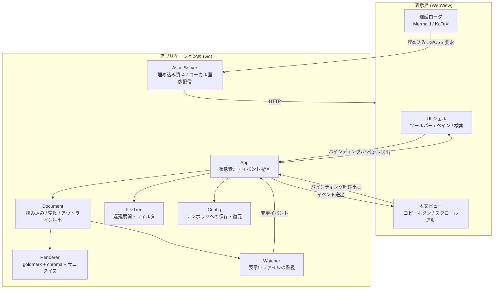
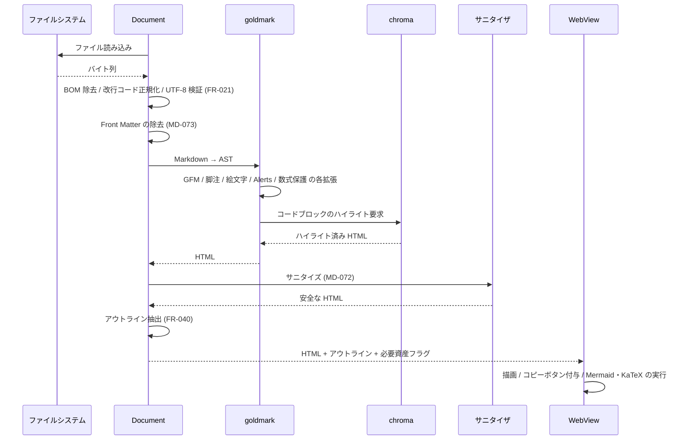
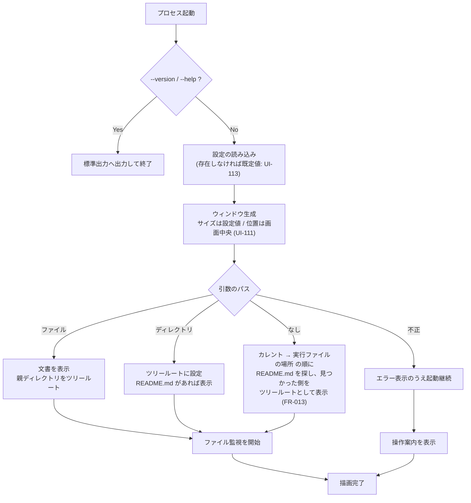

# 05. アーキテクチャ

> 索引: [README](README.md) | 前: [04. Markdown 描画仕様](04-markdown.md) | 次: [06. ビルド・配布](06-build-release.md)

本文書は、要求を満たすための技術構成と、その選定根拠・制約を定義する。ここに記載する内容は実装の指針であり、同等以上の結果が得られる代替手段を排除するものではないが、変更する場合は本文書を更新する。

## 5.1 全体方針（AR-001 系）

### AR-001: GUI 方式 **MUST**

**OS 標準の WebView を GUI として用い、Go で制御する。** フレームワークは **Wails v2** を採用する。

| 層 | 技術 | 役割 |
| --- | --- | --- |
| アプリケーション層 | Go | ファイル入出力、Markdown → HTML 変換、シンタックスハイライト、サニタイズ、ファイル監視、設定管理 |
| 表示層 | OS の WebView + HTML / CSS / JavaScript | 描画、ペインのレイアウト、スクロール、Mermaid・数式のレンダリング、ユーザ操作の受付 |
| 橋渡し | Wails のバインディング機構 | Go の関数を JavaScript から呼び出す／Go からイベントを送出する |

### AR-002: 選定根拠 **MUST**

要求（GitHub 準拠の見た目、Mermaid、軽量、1 実行ファイル）に対する主要な選択肢の比較は以下のとおり。

| 方式 | バイナリサイズ | GitHub 準拠の描画 | Mermaid | 実装量 | 判定 |
| --- | --- | --- | --- | --- | --- |
| **OS 標準 WebView（Wails v2）** | 中（10〜20 MB） | 容易（CSS をそのまま利用） | 容易（公式 JS をそのまま利用） | 小 | **採用** |
| ピュア Go GUI（Fyne 等） | 大（25〜40 MB） | 困難（HTML レンダラを自作） | 極めて困難 | 極大 | 不採用 |
| ローカル HTTP サーバ + 既定ブラウザ | 小（5 MB） | 容易 | 容易 | 小 | 不採用 |

- ピュア Go GUI は「1 実行ファイル・外部依存ゼロ」という点では最良だが、GitHub 準拠の描画と Mermaid を自前実装することになり、実装量とバイナリサイズの両面で要求と矛盾する。
- ローカル HTTP サーバ方式は最小サイズだが、独立したアプリケーションウィンドウを持てず、OS ネイティブのファイルダイアログとウィンドウへのドラッグ＆ドロップ（FR-010, FR-011）が満たせない。
- WebView 方式は、描画エンジンを OS から借りることで「アプリ本体を小さく保ちながら GitHub 準拠の描画を得る」という要求の組み合わせを唯一成立させる。

### AR-003: プラットフォーム別の WebView 依存 **MUST**

| OS | WebView | 実行環境での前提 |
| --- | --- | --- |
| Windows 11 | WebView2（Chromium ベース） | **OS に標準搭載**。追加インストール不要 |
| Ubuntu 24.04 以降 | WebKitGTK 4.1 | `libwebkit2gtk-4.1-0` パッケージが必要 |

- Linux ではビルド時に `webkit2_41` ビルドタグを指定し、WebKitGTK 4.1 系にリンクする（Ubuntu 24.04 は 4.0 系を提供しないため）。
- WebKitGTK が見つからず起動できない場合に備え、リリースノートと README に必要なパッケージ名とインストールコマンドを明記する（BR-051）。

> [!NOTE]
> この依存は「1 実行ファイルで完結」という原則の唯一の例外である。ディストリビューション標準パッケージであり、GNOME 環境では多くの場合すでに導入されている。依存を完全に排除する AppImage 形式は、ファイルサイズが 80 MB 規模となり「小さい」という価値と正面から衝突するため採用しない（[06. ビルド・配布](06-build-release.md)）。

## 5.2 モジュール構成（AR-010 系）

### AR-010: 論理構成 **SHOULD**



### AR-011: ディレクトリ構成 **SHOULD**

```
go_MarkView/
├── main.go                    アプリのエントリポイント、CLI 引数処理
├── app.go                     Wails にバインドする API の定義
├── go.mod / go.sum
├── wails.json                 Wails のプロジェクト設定
├── internal/
│   ├── mdfile/                Markdown 拡張子の判定（IMP-105。依存なしの葉）
│   ├── localurl/              /__local/ URL の組み立てと解読（AR-040。依存なしの葉）
│   ├── document/              Markdown の読み込みと変換
│   │   ├── document.go
│   │   └── encoding.go        BOM・改行コードの処理（FR-021）
│   ├── renderer/              goldmark パイプライン
│   │   ├── renderer.go
│   │   ├── alerts.go          GitHub Alerts 拡張（MD-040）
│   │   ├── math.go            数式ノードの保護（MD-060）
│   │   ├── mermaid.go         mermaid ブロックの取り出し（MD-080）
│   │   ├── highlight.go       chroma 設定（MD-030）
│   │   └── sanitize.go        許可リスト（MD-072）
│   ├── filetree/              ファイルツリーの遅延展開（FR-032）
│   ├── watcher/               ファイル監視（FR-014）
│   ├── config/                設定の保存・復元（UI-110 系）
│   ├── assetsrv/              埋め込み資産の配信とローカル画像配信（AR-040）
│   ├── opener/                既定ブラウザ・既定アプリへの委譲（FR-053）
│   ├── ostheme/               OS のテーマ設定の取得（FR-071）
│   ├── buildinfo/             バージョン情報（BR-030）
│   └── session/               履歴・起動解決・パス算出（FR-051, FR-013）
├── frontend/                  表示層
│   ├── index.html
│   ├── css/                   アプリ UI と GitHub 準拠スタイル
│   ├── js/                    UI ロジック（ビルド不要の素の JavaScript）
│   └── vendor/                リポジトリで管理する埋め込み資産（BR-042）
│       ├── vendor.json        資産ごとのバージョン・取得元・取得日
│       ├── mermaid/           mermaid.min.js（ライセンス表記込み）
│       └── katex/             katex.min.js / katex.min.css / フォント
├── assets/                    アプリケーションアイコンの原本（UI-025, BR-013）
│   ├── icon.ico               Windows: 実行ファイル・ウィンドウ
│   ├── icon.png               Linux: ウィンドウ / 情報ダイアログ表示用
│   └── icon.icns              macOS 用。本バージョンでは未使用（AR-090）
├── licenses/
│   └── THIRD_PARTY.md         生成物（BR-040）
├── scripts/                   ライセンス生成・vendor 更新・アイコン配置・スモークテスト
├── testdata/                  検証用 Markdown（BR-053, BR-054）
├── docs/
│   ├── specs/                 本仕様書
│   └── tests/                 手動テストの記録用 Excel と生成スクリプト（E2E-200）
│       ├── gen_manual_test_xlsx.py
│       └── results/           実施済みの Excel（バージョンごとにコミット）
└── .github/workflows/         CI/CD（BR-010 系）
```

## 5.3 資産の埋め込みと遅延ロード（AR-020 系）

### AR-020: 埋め込み **MUST**

描画に必要な資産はすべて `go:embed` で実行ファイルに埋め込み、実行時に外部から取得しない。

| 資産 | 概算サイズ | 用途 |
| --- | --- | --- |
| アプリ UI の HTML / CSS / JS | 100 KB 未満 | シェル、ペイン、ツールバー |
| GitHub 準拠スタイル（Light / Dark） | 50 KB 未満 | 本文の描画（MD-010 系） |
| アイコン（インライン SVG） | 10 KB 未満 | ツールバー（UI-022） |
| `mermaid.min.js` | 約 3 MB | Mermaid 図（MD-080） |
| KaTeX（JS + CSS + フォント） | 約 1.3 MB | 数式（MD-060） |
| ライセンス全文 | 200 KB 未満 | 情報ウィンドウ（FR-101） |
| 内蔵の操作案内 Markdown | 5 KB 未満 | 引数なし起動時（FR-013） |
| `vendor.json`（資産のバージョン情報） | 1 KB 未満 | 情報ウィンドウの `Bundled` 行（UI-100） |

- Mermaid と KaTeX の実ファイルはリポジトリで管理し、ビルド時に取得しない。バージョンの決定と更新の運用は BR-042・BR-043 に従う。
- CDN からの読み込み、実行ファイル外のファイル参照、自動ダウンロードのいずれも行わない。
- フォントファイルは埋め込まない（KaTeX が必要とする数式フォントのみ例外）。本文・コードは OS のフォントを使用する（MD-010）。

### AR-021: 遅延ロード **MUST**

サイズと起動時メモリの両立のため、重い資産は使用時にのみ読み込む。

| 資産 | 読み込み契機 |
| --- | --- |
| Mermaid | 変換結果に `mermaid` ブロックが 1 つ以上含まれるとき |
| KaTeX | 変換結果に数式要素が 1 つ以上含まれるとき |

- 判定は Go 側の変換時に行い、フロントエンドへ「Mermaid が必要」「KaTeX が必要」というフラグとともに HTML を渡す。
- 一度読み込んだ資産はプロセス終了まで保持し、文書を切り替えるたびに再読み込みしない。
- 読み込みは埋め込み資産を配信する内部 HTTP 経由（AR-040）で行う。

## 5.4 Markdown 変換パイプライン（AR-030 系）

### AR-030: 変換の流れ **MUST**

変換は Go 側で完結させ、フロントエンドには変換済みの HTML を渡す。



### AR-031: 変換に関する制約 **MUST**

- **Markdown から HTML への変換をフロントエンドで行ってはならない。** JavaScript の Markdown パーサを埋め込むと、サイズ・メモリ・変換速度のいずれにも不利となるため。
- **シンタックスハイライトも Go 側で行う。** ブラウザ用ハイライトライブラリは埋め込まない。
- サニタイズは変換パイプラインの最後段に固定で組み込み、迂回できる経路を設けない。
- Mermaid と KaTeX のみ、性質上フロントエンドで実行する。

### AR-032: 採用ライブラリ **SHOULD**

| 用途 | ライブラリ | ライセンス |
| --- | --- | --- |
| アプリケーションフレームワーク | `github.com/wailsapp/wails/v2` | MIT |
| Markdown パーサ | `github.com/yuin/goldmark`（GFM 拡張を含む） | MIT |
| 脚注 | goldmark 標準の Footnote 拡張 | MIT |
| 絵文字 | `github.com/yuin/goldmark-emoji` | MIT |
| シンタックスハイライト | `github.com/alecthomas/chroma/v2` | MIT |
| goldmark との接続 | `github.com/yuin/goldmark-highlighting/v2` | MIT |
| Front Matter | `github.com/yuin/goldmark-meta`（YAML）+ TOML は自前で除去 | MIT |
| HTML サニタイズ | `github.com/microcosm-cc/bluemonday` | BSD-3-Clause |
| ファイル監視 | `github.com/fsnotify/fsnotify` | BSD-3-Clause |
| Mermaid | `mermaid`（埋め込み JS。バージョン管理は BR-042） | MIT |
| 数式 | `KaTeX`（埋め込み JS/CSS/フォント。バージョン管理は BR-042） | MIT |
| 本文スタイル | `github-markdown-css` | MIT |
| アイコン | Octicons 等の MIT ライセンスのアイコンセット | MIT |

- GitHub Alerts（MD-040）および数式ノードの保護（MD-060）に相当する goldmark 拡張は、要件を満たす既存拡張がなければ自前で実装する。いずれも AST 変換で実現でき、依存の追加を避けられる。
- 依存の追加は「サイズへの寄与」と「保守されているか」の両面で評価する。ライセンスは MIT / BSD / Apache-2.0 等の再配布可能なものに限る（NFR-051）。

### AR-033: chroma のサイズ最適化 **SHOULD**

chroma はすべての言語定義を含めると数 MB のサイズ寄与となる。MD-031 に列挙した言語に限定して登録することでサイズを削減してよい。その場合、未登録の言語が指定されたときはハイライトなしで表示する（MD-030 の規定どおり）。

> [!NOTE]
> **実装時の判断（2026-08-31）: 限定しない。** 実測でのサイズ寄与は 3.7 MB であり、NFR-021 の上限（実行ファイル 25 MB）に対して余裕がある。加えて、限定には次の 2 つの障害がある。
> 
> - IMP-114 が採用する `goldmark-highlighting` は `lexers.Get`（chroma のグローバル登録簿）を直接呼ぶ。自前の登録簿に差し替える手段がなく、限定するにはこのライブラリを使わない構成が必要になる。
> - chroma v2 は 257 個の言語定義を 1 つの `embed.FS` に持つ。限定は XML の複製と chroma 更新への追随を意味し、「エイリアス解決は chroma の機能に委ねる」（IMP-114）とも両立しない。
> 
> P6 で配布物を実測し、上限を超える場合に再検討する。

## 5.5 ローカルファイルの配信（AR-040 系）

### AR-040: 内部アセットサーバ **MUST**

WebView は `file://` スキームでの任意のローカルファイル参照を制限する。ローカル画像（FR-022）を表示するため、Wails のアセットサーバにカスタムハンドラを組み込み、内部 HTTP 経由でファイルを配信する。

| パス | 配信内容 |
| --- | --- |
| `/` 以下 | 埋め込みのアプリ資産（HTML / CSS / JS / vendor） |
| `/__local/<エンコード済み絶対パス>` | ローカルファイル（画像等） |

### AR-041: 配信の制約 **MUST**

- 配信対象は画像として扱える拡張子（FR-022 の一覧）に限定する。任意の拡張子のファイルを配信してはならない。
- 要求されたパスは絶対パスに正規化したうえで、シンボリックリンクを解決してから拡張子を検査する。
- Content-Type は拡張子から決定し、`X-Content-Type-Options: nosniff` を付与する。
- **SVG は `` 要素からのみ参照させる。** SVG ファイルに埋め込まれたスクリプトは `` 経由では実行されないが、WebView が直接その URL へ遷移した場合は実行されうる。AR-060 によりページ遷移自体を発生させない設計であることに加え、配信時に `Content-Security-Policy: sandbox` 相当のヘッダを付与して二重に防ぐ。インライン SVG は Markdown のサニタイズ段階で除去される（MD-072）。
- アセットサーバは外部ネットワークインターフェースにバインドしない。Wails の内部プロトコル経由でのみアクセスされる構成とする。

### AR-042: 相対パスの解決 **MUST**

Markdown 内の相対パスは、**表示中の Markdown ファイルのディレクトリ**を基準に解決する（FR-022, FR-050）。ツリールートを基準にしてはならない。文書がリンクをたどって移動した場合も、その時点で表示している文書の位置が基準となる。

## 5.6 フロントエンド構成（AR-050 系）

### AR-050: フレームワークを使用しない **SHOULD**

フロントエンドは素の HTML / CSS / JavaScript で実装し、React・Vue 等の UI フレームワークおよびバンドラを導入しない。

- 理由: UI の要素数が限られており、フレームワーク導入によるサイズ増（数百 KB）とビルド工程の追加が、本アプリの価値（サイズ・起動速度・ビルドの単純さ）に見合わないため。
- 本文の HTML は Go 側から受け取った文字列をそのまま挿入する。フロントエンド側では、コピーボタンの付与・スクロール連動・検索ハイライトといった後処理のみを行う。
- ビルド工程を持たないため、`frontend/` 以下のファイルはそのまま `go:embed` の対象となる。
- UI テキストはソース中の固定文字列とし、**言語リソース機構やロケール判定を持たない**（UI-024）。ツールチップの英日併記も固定文字列として記述する。ただし、後日の変更を容易にするため、UI 文言は 1 箇所にまとめて定義する。

### AR-051: スクロール連動の実装方式 **SHOULD**

アウトラインのスクロール連動（FR-042）は `IntersectionObserver` を用いて実装し、スクロールイベントごとに全見出しの位置を計算する方式は避ける。長大な文書でのスクロール性能を確保するため。

### AR-052: 大きな文書の描画 **SHOULD**

数 MB 規模の文書でも操作を阻害しないよう、本文の HTML 挿入は 1 回の DOM 操作で行い、挿入後の後処理（コピーボタン付与等）は要素数に比例した単純走査に留める。

## 5.7 ナビゲーションとイベント制御（AR-060 系）

### AR-060: ページ遷移の禁止 **MUST**

WebView 内でのページ遷移（`location.href` の変更、リンクの既定動作、`form` の送信）は一切発生させない。

- 本文中のリンククリックはすべて JavaScript で捕捉し、Go 側へ通知する。Go 側が FR-050 の規則に従って処理を決定する。
- Markdown ファイルへのリンクは、**アプリケーションのウィンドウを増やさず**、本文ペインの内容を差し替えることで実現する。文書の切り替えは、ファイルツリーからの選択（FR-033）と同一の内部処理を通す。異なるのは履歴とツリー強調表示の扱い（FR-051, FR-052）のみとする。
- 外部 URL は Go 側から OS の既定ブラウザへ渡す。WebView 内で開いてはならない。
- 新しいウィンドウを開く要求（`target="_blank"` 等）も同様に捕捉して既定ブラウザへ委譲する。
- 画像およびその他のローカルファイルへのリンクは、Go 側から OS の既定アプリケーションへ渡す（FR-053）。**アプリケーションは終始 1 つのウィンドウのみを持つ。** Wails v2 が 2 つ目のネイティブウィンドウをサポートしないことは、この設計上の制約であると同時に、方針とも一致している。
- WebView の右クリックメニュー、開発者ツール、ページ内リロードは、リリースビルドでは無効化する（**SHOULD**）。

### AR-061: Go とフロントエンドの通信 **MUST**

| 方向 | 手段 | 主な用途 |
| --- | --- | --- |
| フロント → Go | バインドされたメソッドの呼び出し | ファイルを開く、ツリーの展開、リンク遷移、設定変更、クリップボードへのコピー |
| Go → フロント | イベント送出 | ファイル更新の通知、エラー通知、ドロップされたファイルの通知 |

- Go からフロントへ渡す文書データは「HTML 文字列」「アウトライン構造」「必要資産フラグ」「ファイルのメタ情報」を含む単一の構造体とし、往復回数を最小化する。

### AR-062: クリップボード **MUST**

コードブロックのコピー（FR-061）は、WebView の Clipboard API が権限や環境によって使用できない場合があるため、**Go 側のクリップボード機能を経由する**実装を基本とする。

## 5.8 ファイル監視（AR-070 系）

### AR-070: 監視の実装 **MUST**

- `fsnotify` により、表示中のファイル 1 つのみを監視する（FR-014）。
- ファイル単体の監視がプラットフォームによって不安定な場合、親ディレクトリを監視して対象ファイルのイベントのみを拾う方式を用いてよい。この場合も通知の対象は表示中のファイルに限定する。
- 監視対象の切り替え時は、必ず以前の監視を解除する。ウォッチャのリークを起こしてはならない。
- 「一時ファイル作成 → リネーム」型の保存で監視が外れた場合、同一パスへの再監視を試みる（FR-014）。

## 5.9 起動シーケンス（AR-080）

### AR-080: 起動時の処理順序 **SHOULD**



## 5.10 将来拡張（AR-090）

### AR-090: 拡張の余地 **MAY**

以下は本バージョンのスコープ外だが、現在の構成のまま実現できる。仕様変更時の判断材料として記録する。

| 拡張 | 現構成での実現性 |
| --- | --- |
| macOS 対応 | Wails は WKWebView に対応済み。ビルドターゲットの追加とコード署名・公証の工程が必要 |
| タブによる複数文書表示 | フロントエンドの状態管理とメモリ設計の見直しが必要 |
| ディレクトリ横断の全文検索 | Go 側にインデックス不要の逐次検索として追加可能。メモリ目標との整合を要検討 |
| ユーザ定義 CSS | アセットサーバの配信経路を追加すれば実現可能だが、「1 実行ファイルで完結」との整合を要検討 |
| Wails v3 への移行 | v3 の安定化後に評価する。ウィンドウ管理 API が変更されるため移行コストの見積もりが必要 |

## 5.11 要求一覧

| ID | 概要 | 必須度 |
| --- | --- | --- |
| AR-001 | GUI 方式（OS 標準 WebView + Wails v2） | MUST |
| AR-002 | 選定根拠 | MUST |
| AR-003 | プラットフォーム別の WebView 依存 | MUST |
| AR-010 | 論理構成 | SHOULD |
| AR-011 | ディレクトリ構成 | SHOULD |
| AR-020 | 資産の埋め込み | MUST |
| AR-021 | 遅延ロード | MUST |
| AR-030 | 変換の流れ | MUST |
| AR-031 | 変換に関する制約 | MUST |
| AR-032 | 採用ライブラリ | SHOULD |
| AR-033 | chroma のサイズ最適化 | SHOULD |
| AR-040 | 内部アセットサーバ | MUST |
| AR-041 | 配信の制約 | MUST |
| AR-042 | 相対パスの解決 | MUST |
| AR-050 | フロントエンドにフレームワークを使用しない | SHOULD |
| AR-051 | スクロール連動の実装方式 | SHOULD |
| AR-052 | 大きな文書の描画 | SHOULD |
| AR-060 | ページ遷移の禁止 | MUST |
| AR-061 | Go とフロントエンドの通信 | MUST |
| AR-062 | クリップボード | MUST |
| AR-070 | ファイル監視の実装 | MUST |
| AR-080 | 起動時の処理順序 | SHOULD |
| AR-090 | 将来拡張 | MAY |
