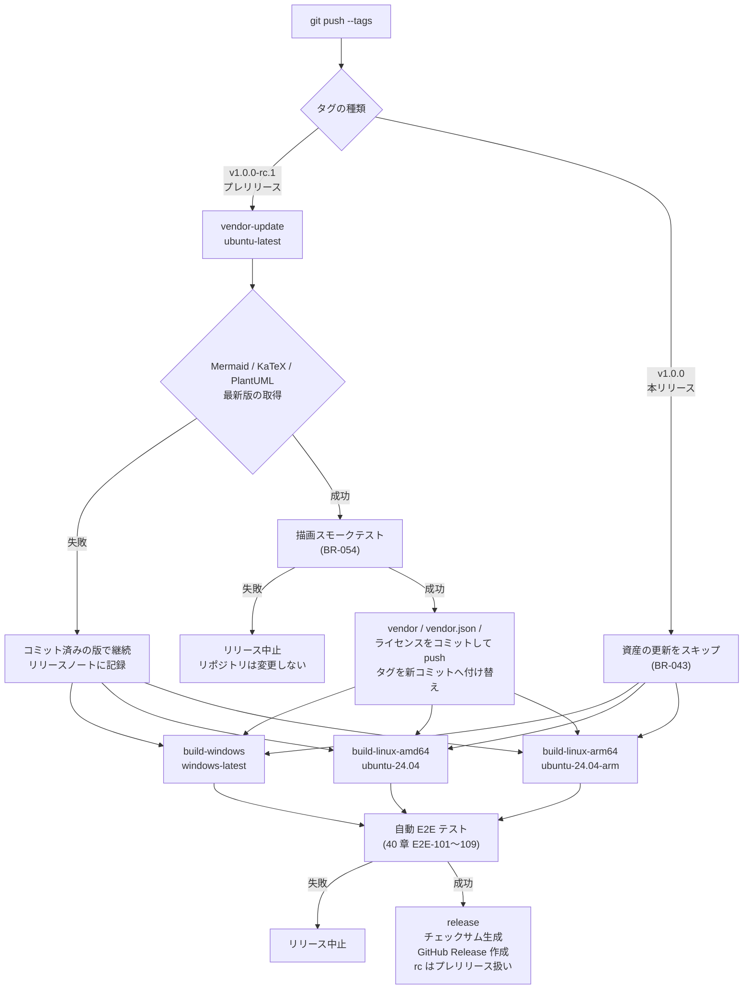

# 06. ビルド・配布

> 索引: [README](README.md) | 前: [05. アーキテクチャ](05-architecture.md) | 次: [07. 非機能要求](07-nonfunctional.md)

本文書は、ビルド手順、CI/CD、リリース成果物に関する要求を定義する。

> [!NOTE]
> 本文書の節はビルドからリリースへ至る順に並べており、ID の番号順とは一致しない。リリース成果物（BR-020 系）は 6.4 節、バージョン情報と埋め込み資産（BR-030 系）は 6.3 節にある。

## 6.1 開発環境（BR-001 系）

### BR-001: 前提ツール **MUST**

| ツール | バージョン | 用途 |
| --- | --- | --- |
| Go | **1.25 以上**（開発は最新安定版） | 本体のビルド |
| Wails CLI | v2 系の最新版 | プロジェクトのビルド・開発サーバ |
| Git | 任意 | バージョン情報の埋め込み（BR-030） |

- 開発ホストは Windows 11 とする。
- Go の下限を 1.25 としているのは、**Wails v2.13.0 以降が `go 1.25.0` を要求する**ためである（v2.12.0 以前は 1.22.0）。「v2 系の最新版を使う」という上表の要求と、それより低い下限は両立しない。Wails 側が下限を引き上げた場合は、本項と IMP-010 を同じ変更で追随させる。
- Node.js は**不要**とする。フロントエンドにビルド工程を持たないため（AR-050）。`wails.json` のフロントエンドビルドコマンドは空とする。

### BR-002: Linux ビルドの追加要件 **MUST**

Linux 向けビルドには、以下のパッケージがビルドホストに必要となる。

```sh
sudo apt install -y libgtk-3-dev libwebkit2gtk-4.1-dev build-essential pkg-config
```

Linux 版は cgo を有効にしてビルドする必要があるため、**Windows ホストから Linux バイナリへのクロスコンパイルは行わない**（BR-011）。

## 6.2 ローカルビルド（BR-010 系）

### BR-010: ビルドコマンド **MUST**

| ターゲット | コマンド |
| --- | --- |
| Windows / amd64 | `wails build -platform windows/amd64 -ldflags "-s -w ..." -o MarkView.exe` |
| Windows / arm64 | `wails build -platform windows/arm64 -ldflags "-s -w ..." -o MarkView.exe` |
| Linux / amd64 | `wails build -platform linux/amd64 -tags webkit2_41 -ldflags "-s -w ..." -o MarkView` |
| Linux / arm64 | `wails build -platform linux/arm64 -tags webkit2_41 -ldflags "-s -w ..." -o MarkView` |

- 出力される実行ファイル名は Windows で `MarkView.exe`、Linux で `MarkView` とする。
- `-ldflags "-s -w"` によりシンボルテーブルとデバッグ情報を除去し、サイズを削減する。
- **UPX 等の実行ファイル圧縮は使用しない。** ウイルス対策ソフトの誤検知を誘発し、「受け取った側がそのまま実行できる」という配布価値を損なうため（NFR-052）。
- Linux では `-tags webkit2_41` を必ず指定する（AR-003）。

### BR-011: クロスコンパイルの制約 **MUST**

| ビルドホスト | 生成可能なターゲット | 備考 |
| --- | --- | --- |
| Windows | windows/amd64, windows/arm64 | cgo 不要のため `GOARCH` の指定だけで可能 |
| Linux (amd64) | linux/amd64 | cgo 必須。arm64 は同アーキのホストで行う |
| Linux (arm64) | linux/arm64 | cgo 必須 |

この制約から、CI は Windows ランナー 1 つと Linux ランナー 2 つ（amd64 / arm64）で構成する（BR-050）。

### BR-012: 開発時の実行 **SHOULD**

`wails dev` によりホットリロード付きで起動できること。開発ビルドではブラウザの開発者ツールを有効にしてよい（リリースビルドでは無効: AR-060）。

### BR-013: アプリケーションアイコンの組み込み **MUST**

UI-025 のアイコンを実行ファイルとウィンドウに反映させる。

| 項目 | 内容 |
| --- | --- |
| 原本の位置 | `assets/icon.ico`, `assets/icon.png`, `assets/icon.icns` |
| 正 | **`assets/` を唯一の正とする。** 他の場所にあるアイコンは、そこから複製されたものとして扱う |
| Wails が参照する位置 | `build/appicon.png`（共通）、`build/windows/icon.ico`（Windows の実行ファイル用リソース） |
| 配置手順 | ビルドの前に `scripts/` の処理で `assets/` から `build/` へ複製する |

- Wails v2 はアイコンの参照先を `build/` 配下に固定しており、任意のパスを指定する設定を持たない。このため「原本を `assets/` に置き、ビルド前に複製する」構成とする。
- 複製処理はローカルビルド（BR-010）とリリース CI（BR-050）の両方で実行する。**CI だけ・ローカルだけで実行する構成にしない。** 一方でしか行わないと、手元と配布物でアイコンが食い違う。
- `build/` 配下の複製をリポジトリで管理するかは任意とする。管理する場合も、`assets/` を変更したら複製を更新することを必須とし、両者が食い違ったまま放置しない。
- アイコンを差し替える際は `assets/` のファイルのみを変更すれば足りる状態を保つ。
- `icon.icns` は複製の対象に含めない（macOS 対象外のため）。

## 6.3 バージョン情報・ライセンス・埋め込み資産（BR-030 系）

### BR-030: バージョン情報の埋め込み **MUST**

以下の情報をビルド時に `-ldflags -X` で埋め込み、`--version` と情報ウィンドウ（FR-100）で表示する。

| 変数 | 内容 | 取得元 |
| --- | --- | --- |
| バージョン | `v1.2.3` 形式 | Git タグ。タグがない場合は `dev` |
| コミットハッシュ | 短縮ハッシュ（7 桁） | `git rev-parse --short HEAD` |
| ビルド日時 | RFC 3339 形式（UTC） | ビルド実行時刻 |

### BR-040: OSS ライセンス情報の生成 **MUST**

- 実行ファイルに埋め込む OSS ライセンス一覧（FR-101）は、`licenses/THIRD_PARTY.md` としてリポジトリに生成・コミットする。生成は `go run ./scripts/genlicenses` で行う。
- Go モジュールのライセンスは自動収集する。**収集対象は `go list -deps` で main パッケージから到達するモジュールに限る。** `go.mod` の `require` をそのまま並べると、実行ファイルに入らないものまで載る。全文はモジュールキャッシュ内の `LICENSE` / `COPYING` 等から読む。
- **`NOTICE` と `PATENTS`、および副次的なライセンスファイルも併記する。** Apache-2.0 は `NOTICE` の再頒布を求めており（`gopkg.in/yaml.v2`）、`golang.org/x/*` の `PATENTS` も許諾の一部である。主たる 1 つだけでは条件を満たさない。
- **収集は対象プラットフォームを明示し、その和集合を採る**（Windows / Linux）。Windows だけに入るモジュール（`go-webview2`）があり、生成したホストによって内容が変わると BR-041 の検査が環境ごとに違う結果を出す。
- 埋め込みの JavaScript / CSS / フォント資産は Go のツールで収集できないため、別に集めて同じ一覧へ統合する。**`frontend/vendor/` にあるものは、すべて `vendor.json`（BR-042）を正として読み出す。** 名称・バージョン・ライセンス種別（SPDX）・全文の位置のすべてをそこから引き、**生成スクリプトに決め打ちを持たない。** Mermaid・KaTeX・PlantUML と、`viz-global.js` が同梱する Viz.js・Graphviz・Expat は、**すべて同じ経路で一覧に載る。**
- 生成スクリプト内に定義を持つのは、**`frontend/vendor/` に無いもの**に限る。現時点では `github-markdown-css`（`frontend/css/markdown.css` の由来）と Octicons（`frontend/icons/` と `index.html` の `<symbol>`。IMP-203）の 2 件である。
- **`license` の指す全文が読めない・空の場合は、生成を失敗させる。** 空欄のまま出力しない。全文の保持は EPL-2.0 と MIT の双方が求める条件であり（NFR-051）、FR-101 の表示の実体でもある。
- **バージョンが空のエントリは `—` と表示する。** Graphviz と Expat は版が分からない（BR-042）。**版が無いことを理由に一覧から落とさない。**
- **`@plantuml/core` の `LICENSE` をそのまま載せない。** 本文は 「IGY distribution (Install GraphViz by Yourself)」——**Graphviz を利用者が自分で入れる版**の文面であり、Viz.js を同梱する JS ビルドの実態と食い違う。PlantUML 本体の MIT として載せ、Graphviz は別行で示す。
- 外部ツール（`go-licenses` 等）に依存しない。CI へ導入の手間とネットワークの前提を持ち込まないためで、収集内容が同等であれば手段は問わない。

### BR-041: ライセンス情報の鮮度検査 **MUST**

CI において、生成スクリプトを実行した結果と、リポジトリにコミットされている生成物を比較し、**差分がある場合はビルドを失敗させる**。依存を追加・更新したときのライセンス表示の更新漏れを防ぐため。

対象は `licenses/THIRD_PARTY.md`（BR-040）と `frontend/css/chroma.css`（IMP-114）とする。**どちらも「スクリプトを直したのに生成物を更新し忘れた」という食い違いが、他のどの検査にも現れない。** 生成物を手で書き換えた場合も、再生成で上書きされたうえで差分として現れる。

ただし、リリース CI が埋め込み資産を自動更新した場合（BR-043）は、その更新後に生成スクリプトを再実行した結果を正とする。この検査はブランチへの push / PR に対して行う（BR-052）。

### BR-042: 埋め込み資産のバージョン管理 **MUST**

Mermaid・KaTeX・PlantUML は、**実ファイルをリポジトリにコミットして管理する**。**`viz-global.js` が同梱する Viz.js・Graphviz・Expat も同じ管理下に置く**（後述）。

| 項目 | 規定 |
| --- | --- |
| 配置場所 | `frontend/vendor/` |
| 記録 | `frontend/vendor/vendor.json` に、資産ごとの**名称・バージョン・ライセンス種別（SPDX）・ライセンス全文の位置・取得元 URL・取得日**を記録する（IMP-181） |
| 取得元 | 公式配布物（npm レジストリの tarball、または公式 CDN の該当バージョン）に限る |
| 改変 | 一切行わない。取得したファイルをそのまま格納する。**バージョン管理による改行コードの正規化も改変に当たる**（下記） |
| ビルド時の取得 | 行わない。ビルドはリポジトリ内のファイルのみを使用する |

- リポジトリにコミットされたバージョンが、そのコミットからビルドされる実行ファイルに埋め込まれるバージョンと常に一致すること。
- `vendor.json` の内容は、実行ファイルに埋め込んでアプリケーション情報ウィンドウの `Bundled` 行に表示する（UI-100）。
- 資産を更新した場合は、同一のコミットで `vendor.json` とライセンス情報（BR-040）も更新する。
- **資産が決め打ちで参照する DOM の id を把握し、`frontend/index.html` の id と衝突しないことを確かめる。** 検査は `scripts/domids` が行い、**CI が毎回実行する**（BR-052）。**資産は改変できない以上、避けるのはこちら側である**（IMP-202, IMP-230）。

**同梱物の中に含まれるもの**

`viz-global.js` は Viz.js の配布物であり、その中に **Graphviz（EPL-2.0）と Expat（MIT）がオブジェクトコードで**含まれる（AR-032）。この 3 件は個別に取得するものではなく、**PlantUML を更新したときにまとめて入れ替わる。**

| 項目 | 規定 |
| --- | --- |
| 記録 | `vendor.json` に `bundledIn: "PlantUML"` を付けて記録する。**最上位の資産と同じ形で並べる** |
| ライセンス全文 | `frontend/vendor/plantuml/licenses/` に置き、**改変しない**（上表と同じ）。`vendor.json` の `license` がその位置を指す |
| 全文の入手 | **自動更新（BR-043）は取りに行かない。** EPL-2.0 と MIT の本文は版に依存せず、毎回取得する意味がない。人が 1 度取得してコミットし、取得元と取得日を `vendor.json` に残す |
| 更新時の扱い | **自動更新は `plantuml/` を入れ替えるが、`licenses/` は残す。** 入れ替えは階層ごと消してから置くため、**明示的に残さないと更新が走った瞬間に全文が消える。** NFR-051 の「著作権表示とライセンス全文の保持」に直接触れる |
| バージョン | `viz-global.js` 先頭の告知から読める **Viz.js のみ記録する。** Graphviz と Expat の版は告知に現れないため**空とする** |

> [!IMPORTANT]
> **ライセンス全文がバンドルの中に入っていない。** `viz-global.js` の先頭にあるのは「含んでいる」という短い告知だけで、`Permission is hereby granted` も `Eclipse Public License` も現れない。**Mermaid や KaTeX のように tarball から `LICENSE` を取り出すことができないのはこの 3 件だけである。**
> だからこそ、**告知とリポジトリの記録が一致していることを機械で確かめる**（BR-043）。
>
> **版が空であることを理由に記録から外さない。** 再頒布の条件は**名称・ライセンス種別・全文**の 3 つで満たせる（NFR-051）。版は「どれを取ってきたか」を人が追うための情報であって、条件ではない。

> [!IMPORTANT]
> **「改変を一切行わない」は、PlantUML を加えた時点でライセンス上の条件になった。** `viz-global.js` には Graphviz が**オブジェクトコードで**含まれており、そのライセンスは **EPL-2.0** である（AR-032, NFR-051）。EPL-2.0 のコピーレフトは**ファイル単位**であり、**改変しない限り他へ伝播しない**。
>
> したがって、サイズ削減のために `viz-global.js` を**再圧縮する・他のファイルと結合する・先頭の `/*! Viz.js ... */` を削る**のいずれも行ってはならない。著作権表示の保持義務とファイル単位のコピーレフトの**両方に触れる**。NFR-021 の目標が厳しくなっても、ここを削ってはならない。
>
> **改行コードの正規化も改変である。** `.gitattributes` の `text=auto` は、コミットの時点で
> CRLF を LF へ書き換える。**取得した資産は正規化の対象から外す**（`frontend/vendor/** -text`）。
>
> 実際、PlantUML を加えたときに **`viz-global.js` と `plantuml/LICENSE` の 2 件が
> 書き換わって格納される**ところだった（2026-09-03 に `git hash-object` の比較で確認）。
> **改変してからでは、それが改変であったことを検出する手立てが無い。** 資産を追加するときは、
> `git hash-object --no-filters` と `git hash-object` が一致することを確かめる。

開発時の更新手順は以下とする。

1. 開発者がローカルで対象バージョンを取得し、`frontend/vendor/` に配置する。
2. **PlantUML を更新した場合は、`viz-global.js` の告知を照合する**（BR-043 の表）。同梱物が入れ替わっていれば、`plantuml/licenses/` の全文と `vendor.json` の記録もあわせて直す。
3. `vendor.json` を更新する。**版だけでなく `spdx` と `license` も見る。**
4. ライセンス生成（BR-040）を実行する。
5. **決め打ち id の検査**（`go run ./scripts/domids`）と描画スモークテスト（BR-054）をローカルで実行し、表示を確認する。
6. 以上を 1 つのコミットとしてリポジトリに入れる。

### BR-043: リリース時の埋め込み資産の自動更新 **MUST**

**プレリリースタグ（`v<version>-rc.<n>`）の付与を契機に**、CI が Mermaid / KaTeX / PlantUML をその時点の最新安定版へ自動更新する。これにより、開発者が明示的に更新しなくても、リリースのたびに新しい Mermaid が取り込まれる。

| タグの種類 | 埋め込み資産の自動更新 |
| --- | --- |
| プレリリース（例: `v1.0.0-rc.1`） | **行う**。最新安定版を取得し、スモークテストを通してコミットする |
| 本リリース（例: `v1.0.0`） | **行わない**。リポジトリにコミット済みの版をそのまま使う |

> [!IMPORTANT]
> 本タグで更新しないのは、**プレリリースで手動テスト（E2E-205）を行った内容と、実際に配布される内容を一致させる**ためである。本タグでも取得しに行くと、rc の検証後に公開された新しい版が入り込み、誰も確認していないものが配布される。
>
> このため、埋め込み資産を新しくするには**プレリリースを経由する必要がある**。本タグだけを打つ運用では資産は更新されない。

**取得の範囲**: メジャーバージョンの更新を含めて、常に最新安定版を取得する（資産側のプレリリース版は対象外）。

> [!IMPORTANT]
> **取得した版のライセンスを確かめる。** `@plantuml/core` は **1.2026.5 以前が GPL-3.0-or-later、1.2026.6 以降が MIT** であり、NFR-051 は GPL 系の同梱を禁じている。
>
> 判定は、取得したパッケージのライセンスを `vendor.json` の `spdx`（BR-042）へ書き戻し、**NFR-051 の許容する一覧と突き合わせて**行う。
>
> 取得したパッケージのライセンスが**許容する一覧（NFR-051）に無い場合は、その資産を更新せず、コミット済みの版を使ってリリースを継続する**（取得に失敗した場合と同じ扱いとし、リリースノートと CI のログに残す）。**自動更新は通常版を上げる方向へ動くため即座の危険は無いが、この検査が無いと上流のライセンス変更が黙って入る。** Mermaid / KaTeX には無かった問題である。

**`viz-global.js` の告知を `vendor.json` と照合する。** PlantUML を更新したら、そのバンドルに含まれる `viz-global.js` の先頭の告知を読み、次を確かめる。**Mermaid や KaTeX と違い、この 3 件は全文を取りに行かない**（BR-042）ため、同梱の構成が変わったことをここで捕まえる。

| # | 確かめること | 食い違ったときの扱い |
| --- | --- | --- |
| 1 | 告知が名指しするプロジェクトが、`vendor.json` の `bundledIn: "PlantUML"` の一覧と**過不足なく一致する** | **リリースを中止する。** 4 つ目が同梱されたのに、そのライセンスを表示しないまま配布することになる（NFR-051, FR-101） |
| 2 | 告知の**著作権者の名前**（`Copyright (c)` と年を取り除いた残り。`Michael Daines`）が、`license` の指す全文に**含まれる** | **リリースを中止する。** 上流で権利者が変わったか、置いてある全文が別物である |
| 3 | Viz.js の版が告知と一致する | **告知の値を `vendor.json` へ書き戻す**（失敗にしない） |

> [!IMPORTANT]
> **照合 1 で数える集合は 3 件である。** 告知は 1 行目に配布物そのもの（`Viz.js 3.24.0`）を書き、
> `contains other software` の下には Graphviz と Expat の 2 件しか並べない。
> **1 行目を数え忘れると、正しい告知に対して `notice-mismatch` を出してリリースを止めてしまう。**
>
> **照合 2 で告知の行そのものを部分文字列として探してはならない。** 告知は
> `Copyright (c) Michael Daines` と年を書かないが、Viz.js の全文は
> `Copyright (c) 2014-2018 Michael Daines` と年を持つ（実測。2026-09-03）。
> **行を丸ごと探すと、正しい組み合わせに対して毎回リリースが止まる。**
> 捕まえたいのは権利者が変わったことであり、**年の更新は権利者の変更ではない。**

> [!NOTE]
> **この照合が、3 件の全文を「取りに行かない」ことの代償を埋めている**（BR-042）。全文を毎回取得しない代わりに、**同梱の構成が変わったことは必ず検出する。**
>
> 逆に、この照合で捕まえられないものもある。**同じ 3 件のまま、上流が全文だけを差し替えた場合**である。著作権表示（2）に現れない変更は検出できない。ここは Mermaid / KaTeX が tarball の `LICENSE` を毎回取り直すのに劣る点であり、**そのことを承知したうえでの判断**である。

**同梱資産が決め打ちする DOM の id を検査する**（`scripts/domids`）。取得した資産の中から
`document.getElementById('<literal>')` の形をすべて取り出し、**`frontend/index.html` が定義する id と
交差しないこと**を確かめる。

```bash
go run ./scripts/domids   # 交差があれば終了コード 1。どのファイルが原因かを出す
```

| # | 確かめること | 食い違ったときの扱い |
| --- | --- | --- |
| 1 | 資産が決め打ちする id と `index.html` の id の**交差が空である** | **リリースを中止する。** 資産が MarkView の DOM を書き換える。何が壊れるかは資産の実装次第であり、**静かに壊れる** |

> [!IMPORTANT]
> **この検査は資産の更新時だけでなく、CI で毎回実行する**（BR-052）。**衝突は資産の側からも
> `index.html` の側からも生まれる。** 資産の更新時にしか見ないと、`index.html` の編集で
> 持ち込んだ衝突に気づけない。**判定そのものには単体テストがある**（UT-810）。

> [!IMPORTANT]
> **この検査は「資産を改変できない」ことの裏返しである**（BR-042）。衝突を見つけても資産は直せないため、
> **`index.html` の側で名前を変える**しかない。だからこそ、**資産を入れ替えた時点で気づく必要がある。**
>
> 実際に `plantuml.js` の `document.getElementById('status')` が `<footer id="status">` を壊し、
> **PlantUML を含む文書を開くとステータス領域の通知がすべて出なくなっていた**
> （[調査報告](../bugs/2026-09-05-bug-006-status-id-collision.md)）。**rc.2 の手動テスト 67 件を通り抜けている。**
>
> **描画スモークテスト（BR-054）では捕まらない。** あちらは `index.html` を配らず、独自のページを使うため
> **衝突しようがない。** 見る場所が違う検査であり、片方で代替できない。

> [!NOTE]
> **Mermaid にも決め打ちがある**（`cy`）。いま無事なのは、たまたまその名前を使っていないからである。
> **「いま衝突していない」ことと「衝突しない」ことは違う。** 版が上がれば決め打ちも変わりうる。

**取得に成功した場合**の処理順序は以下とする。

1. 最新安定版を取得し、`frontend/vendor/` を更新する。
2. **`viz-global.js` の告知を照合する**（上記の表）。**表の 1・2 に当たったらここで止め、リリースを中止する。**
3. `vendor.json` を更新する。**取得したライセンス種別と Viz.js の版もここで書き戻す。**
4. ライセンス情報（BR-040）を再生成する。
5. **決め打ち id の検査（上記）と描画スモークテスト（BR-054）を実行する。**
   - 失敗した場合、**リリースを中止する**。この時点ではまだコミットも push も行っていないため、リポジトリの状態は変化しない。CI を失敗として終了する。
6. 成功した場合、1〜4 の変更をコミットし、タグが指していたコミットを含むブランチ（既定は `main`）へ push する。
7. **タグを新しいコミットへ付け替え**、強制更新で push する。
8. 付け替え後のコミットからビルドし、リリースを作成する。

**取得に失敗した場合**（ネットワーク到達不能、レジストリ障害、対象バージョンが取得できない等）の処理は以下とする。

- **リリースを中止しない。** リポジトリにコミット済みのバージョンでビルドを継続する。
- コミット・タグの付け替えは行わない。
- リリースノート（BR-051）に、資産が更新されなかったこと、および実際に使用したバージョンを記載する。
- CI のログに警告を残す。

> [!IMPORTANT]
> この運用は、タグの強制更新（force update）とデフォルトブランチへの push を CI が行うことを前提とする。したがって、
>
> - ワークフローに `contents: write` の権限を与える必要がある。
> - デフォルトブランチが保護されている場合、CI による push を許可する設定が必要となる。
> - タグの付け替えは**リリースが公開される前**に行われるため、利用者が取得済みのタグを書き換えることはない。ただし、タグを push した開発者のローカルリポジトリとは差異が生じるため、リリース後は `git fetch --tags --force` が必要になる旨を開発手順に記載する。
> - CI 自身が行う push が、ブランチへの push を契機とする検証ワークフロー（BR-052）を再び起動する。コミットメッセージに `[skip ci]` を含めるなどして、二重実行を避けること。この更新内容はリリースジョブ内で既に検証済みであるため、再検証の必要はない。

> [!NOTE]
> 「常に最新を取り込む」設計は、Mermaid や PlantUML の新しい図種別や不具合修正を自動的に取り込める一方、メジャーバージョンアップによる破壊的変更をリリース直前に抱え込むリスクを伴う。このリスクは BR-054 のスモークテストで受け止める。スモークテストが失敗した場合は、開発者が `vendor.json` のバージョンを明示的に固定したうえでタグを打ち直す運用とする。

手順 1〜3（取得・告知の照合・`vendor.json` の更新）は `scripts/vendorupdate` が行う。手順 4 以降はワークフローの担当とする。

```bash
go run ./scripts/vendorupdate              # frontend/vendor/ を更新する
go run ./scripts/vendorupdate -dir <path>  # 別の場所へ出して確かめる
```

| 事項 | 決めたこと |
| --- | --- |
| 取得元 | npm レジストリの tarball（`registry.npmjs.org`）。`latest` の dist-tag を引くため、**プレリリース版は定義上現れない** |
| 取り出すもの | Mermaid は `dist/mermaid.min.js` と `LICENSE`。KaTeX は `dist/katex.min.js` / `dist/katex.min.css` / `dist/fonts/` 一式と `LICENSE`。**PlantUML は `plantuml.js` / `viz-global.js` と `LICENSE`**（`emoji.js` と `openiconic.js` は取らない。AR-020） |
| 欠落の扱い | 要るものが 1 つでも tarball に無ければ**失敗**とする。版が上がって配置が変わったことに気づかないまま、欠けた資産で配布するのが最悪の結末である |
| 一部だけの更新 | **しない。** 3 つのうち 1 つでも取れなければどれも更新しない。半端に新しい組み合わせを作らず、リリースノートに書く内容も「更新した / しない」の 2 通りで済む |
| 置き換え方 | 一時ディレクトリへ取得し、**全部そろってから**置き換える。置く前に既存を消す（版によってフォントの構成が変わりうるため） |
| 告知の照合 | **`viz-global.js` の先頭を読み、`vendor.json` の `bundledIn` の一覧・著作権表示・Viz.js の版と突き合わせる**（上記）。PlantUML を取得したときだけ行う |
| 決め打ち id の検査 | **`scripts/vendorupdate` は行わない。** 資産を置き換えた後にワークフローが `scripts/domids` を実行する（上記）。**資産の更新の有無によらず CI でも毎回走る**（BR-052） |
| 失敗時の終了コード | **0。** 取得の失敗でリリースを中止しないため、呼び出し側が判断できるよう `updated` と `reason`（`updated` / `already-latest` / `fetch-failed` / **`license-rejected`** / **`notice-mismatch`**）を返す。**後ろの 2 つは中止を意味する**（取得の失敗とは扱いが違う）。**決め打ち id の衝突は別の工程で判定する**ため、ここには現れない |

## 6.4 リリース成果物（BR-020 系）

### BR-020: 成果物一覧 **MUST**

タグの付与により、以下 4 つのアーカイブと 1 つのチェックサムファイルを GitHub Releases に添付する。

| ファイル名 | 対象 | 内容 |
| --- | --- | --- |
| `MarkView-<version>-windows-amd64.zip` | Windows 11 (x64) | `MarkView.exe`, `LICENSE`, `README.md` |
| `MarkView-<version>-windows-arm64.zip` | Windows 11 (ARM64) | `MarkView.exe`, `LICENSE`, `README.md` |
| `MarkView-<version>-linux-amd64.tar.gz` | Ubuntu 24.04+ (x64) | `MarkView`, `LICENSE`, `README.md` |
| `MarkView-<version>-linux-arm64.tar.gz` | Ubuntu 24.04+ (ARM64) | `MarkView`, `LICENSE`, `README.md` |
| `checksums.txt` | 全成果物 | 各アーカイブの SHA-256 |

- `<version>` は Git タグ名（`v1.0.0` 形式）とする。
- Linux バイナリは実行権限を保持した状態で tar に格納する。
- **インストーラ形式（NSIS、.deb、AppImage 等）は提供しない。** 「展開してそのまま実行する」という配布形態に統一するため。

### BR-021: 成果物の構成方針 **MUST**

アーカイブ内には実行ファイルと最小限の文書のみを含め、ディレクトリ階層を作らない（展開してすぐ実行できる状態にする）。設定ファイルやランタイムを同梱してはならない。

詰める処理は `scripts/pack` が行う。

```bash
go run ./scripts/pack -exe build/bin/MarkView.exe -os windows -arch amd64 -version v1.0.0
```

**ランナーの `tar` や `Compress-Archive` を使わない。** ここで求めているのは「階層を作らない」「実行ビットが立っている」「余計なものを入れない」であり、これは道具によって結果が変わる。zip はそもそも権限を持たず、Windows で作った tar は所有者やモードがホストの都合を引きずる。E2E-101 がこれらを 1 件ずつ検査する以上、**作る側も同じ規則で固定する**。所有者は `root:root`、実行ファイルは `0755`、文書は `0644` とする。

## 6.5 CI/CD（BR-050 系）

### BR-050: リリースワークフロー **MUST**

GitHub Actions により、`v` で始まるタグの push を契機として自動的にリリースを作成する。



| ジョブ | ランナー | 役割 |
| --- | --- | --- |
| `vendor-update` | `ubuntu-latest` | 埋め込み資産の更新、スモークテスト、コミットとタグの付け替え（BR-043, BR-054） |
| `build-windows` | `windows-latest` | windows/amd64, windows/arm64 の zip |
| `build-linux-amd64` | `ubuntu-24.04` | linux/amd64 の tar.gz |
| `build-linux-arm64` | `ubuntu-24.04-arm` | linux/arm64 の tar.gz |
| `e2e` | `ubuntu-latest` | 4 種の成果物をまたぐ自動 E2E（E2E-101 / 107 / 108）と描画スモークテスト（E2E-109） |
| `release` | `ubuntu-latest` | 成果物の収集、`checksums.txt` 生成、Release の作成と添付 |

**ジョブは 6 つである。** 上の図で `自動 E2E テスト` と記した箱が `e2e` ジョブに当たる。**対象 OS の上でしか実行できない E2E-102〜106 は各ビルドジョブの中で行う**ため、`e2e` ジョブが担うのは 4 種そろって初めて確かめられるものだけである（下表の「実行を伴う E2E の置き場」）。

- ビルドの 3 ジョブは `vendor-update` の完了を待ち、**`vendor-update` が確定させたコミット**を checkout してビルドする。タグ名ではなくコミット SHA を受け渡し、付け替えの前後で取り違えが起きないようにする。
- `vendor-update` が失敗した場合、後続のジョブは実行せず、リリースを作成しない。
- トリガは `push` の `tags: ['v*']` とする。
- Linux ジョブでは BR-002 のパッケージを導入する。
- ビルドは glibc の互換性を考慮し、**ターゲットとして宣言している Ubuntu 24.04 のランナー上で行う**。より新しいランナーでビルドすると、24.04 では動作しないバイナリになりうるため、ランナーのバージョンは明示的に固定する。
- Release の作成には `GITHUB_TOKEN` を使用し、追加のシークレットを必要としない構成とする。

実装は `.github/workflows/release.yml` とする。

| 事項 | 決めたこと |
| --- | --- |
| `vendor-update` の実行 | **本タグでも走らせる。** 資産は更新しないが、「ビルドするコミットを確定させる」役として必ず通す。後続がタグ名ではなく SHA を受け取る形を、タグの種類によらず 1 つに保つ |
| 再帰の防止 | タグの付け替えは `GITHUB_TOKEN` で push する。**この push は新しいワークフローを起動しない**（GitHub の仕様）。コミットの `[skip ci]` は、人が同じ手順を追うときの保険として付ける |
| ブランチへの push | **既定ブランチの先端がタグのコミットと一致するときだけ行う。** 先へ進んでいる場合に無理やり載せると、リリースと関係のない変更を巻き込むか、非早送りで弾かれる。一致しない場合は警告を出し、資産の更新はタグの側にだけ残す。**このときタグは本流から外れた枝に残る**ため、変更点の基準を到達可能性で選んではならない（BR-051）|
| 実行を伴う E2E の置き場 | **各ビルドジョブの中。** E2E-102〜106 は対象 OS の上でしか実行できないため、ビルドした直後にその場で行う。`windows/arm64` だけは動かせる環境が無く、E2E-010 が「ビルドのみ」としているとおり省く |
| 成果物をまたぐ E2E の置き場 | `e2e` ジョブ。4 種そろって初めて確かめられる E2E-101 / 107 / 108 と、描画スモークテスト（E2E-109）をここで行う |
| 変更点の一覧（BR-051） | 基準のタグからの `git log` で作る。`--generate-notes` に頼らず、本文を全部こちらで組み立てる。基準の選び方は BR-051 に定める |

### BR-051: リリースノート **MUST**

Release の本文には少なくとも以下を含める。

- 変更点の一覧（コミットから自動生成してよい。基準の選び方は下記）
- 各成果物の対応環境
- **Linux 版の依存パッケージの案内**（AR-003）

  ```sh
  sudo apt install libwebkit2gtk-4.1-0
  ```

- SHA-256 チェックサムの確認方法
- **同梱した Mermaid / KaTeX / PlantUML のバージョン**。自動更新（BR-043）が行われた場合は更新前後のバージョンを、取得に失敗した場合はその旨と使用したバージョンを記載する

#### 変更点の基準とするタグ

タグの種類で基準を変える。

| 打ったタグ | 基準 | 見せたいもの |
| --- | --- | --- |
| プレリリース（`v*-rc.*`） | **直前のタグ**（rc を含む） | 前回の rc から何を直したか |
| 本リリース（`v*`） | **直前の本リリース**（rc を除く） | 前の安定版から何が変わったか |

- 本リリースで rc を基準にしてはならない。E2E-205 が「rc と本タグの間に別の変更を入れない」と定めているため、**変更点が空になる**。利用者は rc のノートを遡らないと何が入ったか分からなくなる。
- 基準が見つからない場合（最初のプレリリース、最初の本リリース）は、直近のコミットを一定件数まで列挙する。
- 比較は `<基準>..<タグ>` で行う。**この形は両者が枝分かれしていても正しく動く**（到達可能性ではなく集合の差であるため）。

> [!IMPORTANT]
> **基準の選択に `git describe` を使ってはならない。** `git describe` が返すのは「そのコミットから**到達できる**最も近いタグ」であり、前のリリースのタグに到達できるとは限らない。
>
> BR-043 の `vendor-update` は、資産更新のコミットを作ってタグをそこへ付け替える。このコミットは既定ブランチへ取り込めないことがあり（下記）、その場合タグは本流から外れた枝に残る。次のリリースからは到達できず、`git describe` はさらに古いタグへ落ちる。
>
> 実際に `v0.1.0-rc.2` で起きた。基準が `v0.1.0-rc.1` ではなく `specs-4.2.0` になり、変更点に全履歴が並んだ（2026-09-03 に検出）。
>
> 代わりに**タグの一覧から選ぶ**。到達可能性に依存しない方法であれば実装は問わない。

### BR-052: 継続的検証 **MUST**

`main` および `develop` 系ブランチへの push / PR を契機に、以下を実行する。

| 検査 | 内容 | 失敗時 |
| --- | --- | --- |
| ビルド | Windows / Linux の両方でビルドが通ること | 失敗 |
| `go vet` | 静的解析 | 失敗 |
| `gofmt` | 整形の差分がないこと | 失敗 |
| ユニットテスト | `go test -race ./...`（30 / 31 章の単体テスト仕様に基づく） | 失敗 |
| テストカバレッジ | `go test -cover ./...` の結果を記録 | 記録のみ（**合否にしない**。UT-060） |
| 生成物の鮮度（BR-041） | `licenses/THIRD_PARTY.md` と `frontend/css/chroma.css` を再生成し、差分がないこと | 失敗 |
| バイナリサイズ（BR-060） | 計測して記録すること | 警告のみ（CI は失敗させない） |
| 描画スモークテスト（BR-054） | **描画に関わるパス**に変更を含むとき実行（`frontend/vendor/`, `frontend/js/lazy.js`, `scripts/smoke/`, `testdata/smoke.md`） | 失敗 |
| **決め打ち id の交差**（BR-042, BR-043） | `go run ./scripts/domids`。同梱資産が `getElementById` で決め打ちする id と、`frontend/index.html` の id が交差しないこと。**毎回実行する**（衝突は資産と `index.html` のどちらからも生まれる） | 失敗 |

### BR-053: 描画の回帰検証 **SHOULD**

リポジトリに、対応するすべての Markdown 記法を網羅した検証用ファイル（`testdata/showcase.md` 等）を用意する。

- 変換結果の HTML に対するスナップショットテストを CI で実行し、意図しない描画変化を検出する。
- 同ファイルは GitHub 上でも表示できるため、MarkView の描画と GitHub の描画を目視で比較する用途にも用いる（MD-002）。

### BR-054: 描画スモークテスト **MUST**

埋め込み資産を更新した際、それが実際に描画できることを機械的に検証する。BR-043 の自動更新における合否判定にこの結果を用いる。

検証内容は以下とする。

| 対象 | 検証 |
| --- | --- |
| Mermaid | `flowchart` / `sequenceDiagram` / `classDiagram` / `stateDiagram` / `erDiagram` / `gantt` / `pie` を含む検証用文書を描画し、各ブロックについて SVG 要素が生成されること |
| KaTeX | インライン数式・ブロック数式・`math` コードブロックを描画し、数式要素が生成されること |
| PlantUML | **Graphviz を要する図（`class`）と要さない図（`sequence`）の両方**を描画し、各ブロックについて SVG 要素が生成されること |
| 共通 | 描画中に JavaScript のエラーが発生しないこと |
| 共通 | 実行が 60 秒以内に完了すること（無限ループ・ハングの検出） |

- 検証は CI 上でヘッドレスブラウザを用いて実行してよい。**この依存は CI 内に閉じたものであり、配布物にも開発ホストの前提（BR-001）にも影響しない。**
- 1 つでも失敗した場合、そのリリースは中止する（BR-043）。
- 検証用文書は `testdata/` に置き、BR-053 の検証用 Markdown と共用してよい。
- ローカルでも同じ検証を実行できる手段を用意する（BR-042 の開発時手順で使用するため）。

実装は `scripts/smoke` とする。

```bash
go run ./scripts/smoke
go run ./scripts/smoke -browser "C:\Program Files\Google\Chrome\Application\chrome.exe"
```

| 事項 | 決めたこと |
| --- | --- |
| 検証用文書 | `testdata/smoke.md`。**`showcase.md` とは共用しない** |
| 変換 | 本番の `renderer` を呼ぶ。フロントエンドへ渡る HTML と同じものを描かせる |
| 描画 | 本番の `frontend/js/lazy.js` を呼ぶ。描画コードの写しを持たない |
| 配信 | `frontend/` を `127.0.0.1` の空きポートで配る。**`file://` を使わない**（ES モジュールが読み込めないため） |
| Wails のバインディング | `frontend/wailsjs/` は配らず代役のモジュールを返す。あれはビルドのたびに生成されるもので、リポジトリには無い（AR-050） |
| ブラウザ | Chromium 系を自動で探す（Windows は Edge を優先。WebView2 と同じエンジンであるため）。`MARKVIEW_SMOKE_BROWSER` または `-browser` で指定できる |
| 結果の受け渡し | ページが描画を終えた時点で結果を POST で返す。待ち時間を推測しない |
| 合否の判断 | Go 側で行う。ページは事実だけを返す |

検査は以下を満たすことを求める。

- 7 種類の図が**すべて揃っている**こと（1 つでも文書から消えたら失敗）
- **PlantUML の Graphviz 系の図が描けている**こと。`viz-global.js` の読み込みに失敗しても**Graphviz を要さない図だけは描けてしまう**ため、両方を見ないと見落とす
- 図ごとに SVG が 1 つ生成され、**幅と高さがゼロでない**こと。失敗しても大きさのない SVG が残ることがあるため
- 数式の数が変換結果と一致し、そのすべてに `.katex` が生成されていること
- 数式の出力に**色が付いていない**こと。KaTeX は解釈できないコマンドを `errorColor` で着色して描き切るため、要素の有無だけでは失敗を見落とす
- 未捕捉の例外・Promise の拒否・資産の読み込み失敗・`console.error` のいずれも起きていないこと

> [!NOTE]
> `showcase.md` と共用しなかったのは、あちらが **GitHub と並べて目視比較する**ための文書（MD-002）であり、7 種類の図を足すと比較する側が読みにくくなるためである。BR-054 は共用を許しているが、求めてはいない。

## 6.6 サイズと署名（BR-060 系）

### BR-060: バイナリサイズの監視 **MUST**

CI はビルド成果物のサイズを常に計測し、記録する。

| 対象 | 閾値 |
| --- | --- |
| 実行ファイル単体 | 30 MB |
| 配布アーカイブ | 12 MB |

- **閾値を超えても CI を失敗させない。** PR・push・リリースのいずれにおいても、警告として可視化するに留め、ビルドとリリースは完了させる。
- 警告は、CI のジョブサマリに計測値と閾値を出力する形で行う。PR の場合はサマリから差分が読み取れるようにする（**SHOULD**）。
- 閾値の超過は、依存追加や資産追加の妥当性を再評価する契機とする（NFR-021）。機械的に止めるのではなく、開発者が判断する材料として扱う。

> [!NOTE]
> リリース時に埋め込み資産が自動更新される運用（BR-043）を採る以上、外部の資産サイズの増加でリリースが機械的に止まると、利用者に新しい版を届けられなくなる。サイズは重要な価値であるが、その担保は「計測を常に見えるようにすること」で行い、リリースの可否とは切り離す。

### BR-070: コード署名 **MUST**

- 本バージョンではコード署名・公証を行わない。証明書の取得・維持コストが、個人開発の OSS としての運用に見合わないため。
- 未署名であることに起因して、Windows SmartScreen の警告や、ウイルス対策ソフトの検知が発生しうる。この可能性と回避手順（プロパティの「ブロックの解除」等）を README に記載する（**SHOULD**）。
- 将来的に署名を導入する場合は、CI のシークレット管理を含めて本文書を改訂する。

### BR-071: ファイル関連付け **MUST**

**`.md` 拡張子の関連付けは行わない。** Windows・Linux のいずれにおいても、インストール時・初回起動時・設定画面のいずれからも、既定のアプリケーションとしての登録を行わない。

- 理由は 2 つある。第一に、MarkView はインストーラを持たず、展開してそのまま実行する配布形態を採るため（BR-020）、関連付けを登録・解除する主体が存在しない。第二に、関連付けはレジストリまたは `~/.local/share/applications` への書き込みを伴い、「システムに痕跡を残さない」という方針（NFR-033）と矛盾する。
- 利用者が任意に関連付けを行うことは妨げない。Windows の「プログラムから開く」や Linux の `.desktop` エントリから起動された場合も、コマンドライン引数の経路（FR-012）で正しく動作する。
- README に、利用者が自分で関連付けを行う場合の手順を参考情報として記載してよい（**MAY**）。

## 6.7 バージョニング（BR-080）

### BR-080: バージョン番号の規則 **SHOULD**

- セマンティックバージョニング（`vMAJOR.MINOR.PATCH`）に従う。
- タグ名は `v` で始める（例: `v1.0.0`）。CI のトリガ条件と一致させる。
- プレリリースは `v1.0.0-rc.1` の形式とし、GitHub Release のプレリリース扱いとする。

プレリリースは**手動テスト（E2E-205）のために必須の工程**である。省略できる補助的なものではない。

| タグ | 目的 | 埋め込み資産の更新（BR-043） | 手動テスト |
| --- | --- | --- | --- |
| `v1.0.0-rc.n` | 検証用の成果物を作る | **行う** | **ここで実施する** |
| `v1.0.0` | 利用者へ配布する | 行わない | 実施済みの内容がそのまま出る |

- rc で NG が出た場合、修正して `rc.2`、`rc.3` と繰り返す。番号は 1 から連番とする。
- 本タグは、対応する rc の検証がすべて完了してから打つ。
- rc と本タグの間に、検証に関係しない変更（文書の修正など）も入れない。入れた場合は rc をやり直す。

## 6.8 要求一覧

| ID | 概要 | 必須度 |
| --- | --- | --- |
| BR-001 | 前提ツール | MUST |
| BR-002 | Linux ビルドの追加要件 | MUST |
| BR-010 | ビルドコマンド | MUST |
| BR-011 | クロスコンパイルの制約 | MUST |
| BR-012 | 開発時の実行 | SHOULD |
| BR-013 | アプリケーションアイコンの組み込み | MUST |
| BR-020 | リリース成果物一覧 | MUST |
| BR-021 | 成果物の構成方針 | MUST |
| BR-030 | バージョン情報の埋め込み | MUST |
| BR-040 | OSS ライセンス情報の生成 | MUST |
| BR-041 | ライセンス情報の鮮度検査 | MUST |
| BR-042 | 埋め込み資産のバージョン管理 | MUST |
| BR-043 | リリース時の埋め込み資産の自動更新 | MUST |
| BR-050 | リリースワークフロー | MUST |
| BR-051 | リリースノート | MUST |
| BR-052 | 継続的検証 | MUST |
| BR-053 | 描画の回帰検証 | SHOULD |
| BR-054 | 描画スモークテスト | MUST |
| BR-060 | バイナリサイズの監視 | MUST |
| BR-070 | コード署名 | MUST |
| BR-071 | ファイル関連付け | MUST |
| BR-080 | バージョン番号の規則 | SHOULD |
