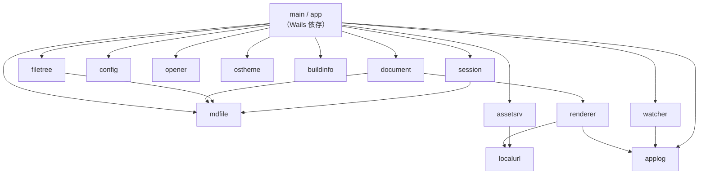

# 10. 実装仕様: 全体構成と規約

> 索引: [README](README.md) | 実装仕様: **10** / [11](11-impl-backend.md) / [12](12-impl-frontend.md) / [13](13-impl-interface.md)

本文書から始まる実装仕様書（`IMP-nnn`）は、要求仕様書（`01`〜`07`）が定めた「何を満たすか」に対して、**どう作るか**を定める。

## 10.1 本文書群の位置づけ

### IMP-001: 要求仕様との関係 **MUST**

- 要求仕様書が上位であり、実装仕様書が要求仕様書と矛盾する場合は**要求仕様書を正とする**。実装仕様書側を改訂して整合させる。
- 実装仕様書は要求を実現する手段を定める。ここに書かれた型名・関数名・ファイル分割は、同等以上の結果が得られるならば実装時に変更してよいが、変更した場合は本文書を更新する（NFR-071）。
- 各要求 ID がどの実装仕様・表示仕様に対応するかは [90. トレーサビリティ](90-traceability.md) で管理する。

### IMP-002: 記述の範囲 **MUST**

本文書群には型定義・関数シグネチャを記す。これは実装者が迷わず着手できるようにするためのものであり、記述された定義がそのまま最終的なソースコードになることを保証するものではない。処理の詳細なアルゴリズムや最適化は実装者の裁量とする。

## 10.2 実装環境（IMP-010 系）

### IMP-010: 言語とツール **MUST**

| 項目 | 内容 | 根拠 |
| --- | --- | --- |
| Go | 1.25 以上。`go.mod` の `go` ディレクティブは 1.25 とする（Go が正規化して `1.25.0` と書く。Wails v2.13.0 以降の要求。BR-001） | BR-001 |
| モジュールパス | `github.com/kznagamori/go_MarkView` | — |
| フレームワーク | Wails v2 系 | AR-001 |
| フロントエンド | 素の HTML / CSS / JavaScript（ES2020 相当）。ビルド工程なし | AR-050 |
| Node.js | 使用しない。`wails.json` の `frontend:build` は空文字列とする | BR-001 |

### IMP-011: ディレクトリ構成 **MUST**

AR-011 の構成を実装単位まで具体化したもの。

```
go_MarkView/
├── main.go                     エントリポイント、CLI 解析、Wails 起動
├── app.go                      App 型の状態とライフサイクル（IMP-190, IMP-193, IMP-194）
├── open.go                     文書を開く共通処理（IMP-192）
├── bind.go                     バインドメソッドとドロップ判定（IMP-310, IMP-313）
├── link.go                     リンク遷移の判定（IMP-312）
├── errors.go                   エラーの分類（IMP-315）
├── dto.go                      フロントエンドとの境界の型（IMP-302〜307）
├── go.mod / go.sum
├── wails.json
├── internal/
│   ├── mdfile/                 IMP-105（依存を持たない葉パッケージ）
│   │   ├── mdfile.go           Markdown 拡張子の判定
│   │   └── mdfile_test.go
│   ├── localurl/               AR-040（依存を持たない葉パッケージ）
│   │   ├── localurl.go         /__local/ URL の組み立てと解読
│   │   └── localurl_test.go
│   ├── applog/                 IMP-023（依存を持たない葉パッケージ）
│   │   ├── applog.go           MARKVIEW_DEBUG の判定とログの初期化
│   │   └── applog_test.go
│   ├── document/               IMP-100 系
│   │   ├── document.go         Document 型、Load、サイズ判定、番兵エラー
│   │   ├── encoding.go         BOM・改行・UTF-8 検証、行数
│   │   └── document_test.go
│   ├── renderer/               IMP-110 系
│   │   ├── renderer.go         goldmark パイプラインの構築と実行
│   │   ├── alerts.go           GitHub Alerts 拡張
│   │   ├── math.go             数式ノードの保護
│   │   ├── mermaid.go          mermaid ブロックの取り出し
│   │   ├── highlight.go        chroma 設定
│   │   ├── anchor.go           見出しスラッグ生成
│   │   ├── sanitize.go         bluemonday ポリシー
│   │   └── *_test.go
│   ├── filetree/               IMP-130 系
│   │   ├── filetree.go         Node 型、Read / Filter
│   │   └── filetree_test.go
│   ├── watcher/                IMP-140 系
│   │   └── watcher.go          単一ファイル監視
│   ├── config/                 IMP-150 系
│   │   ├── config.go           Config 型、Load / Save
│   │   ├── path.go             保存先の解決
│   │   ├── path_windows.go     %TEMP%\MarkView（IMP-031, IMP-152）
│   │   ├── path_other.go       $TMPDIR/MarkView-<uid>（IMP-031, IMP-152）
│   │   └── config_test.go
│   ├── assetsrv/               IMP-160 系
│   │   └── assetsrv.go         埋め込み資産とローカル画像の配信
│   ├── opener/                 IMP-170 系
│   │   ├── opener.go           既定ブラウザ・既定アプリへの委譲
│   │   ├── open_windows.go     rundll32.exe（IMP-031, IMP-170）
│   │   └── open_other.go       xdg-open（IMP-031, IMP-170）
│   ├── ostheme/                IMP-175（依存を持たない葉パッケージ）
│   │   ├── ostheme.go          OS のテーマの取得と、値の解釈
│   │   ├── ostheme_windows.go  レジストリ（IMP-031, IMP-175）
│   │   ├── ostheme_other.go    gsettings（IMP-031, IMP-175）
│   │   └── ostheme_test.go
│   ├── buildinfo/              IMP-180 系
│   │   ├── buildinfo.go        バージョン情報（IMP-180）
│   │   └── vendor.go           vendor.json の読み出しと環境情報（IMP-181）
│   └── session/                IMP-190 系のうち Wails に依存しない部分
│       ├── history.go          表示履歴（IMP-191）
│       ├── startup.go          起動時の対象解決（IMP-193）
│       ├── path.go             表示用パスの算出（IMP-025）
│       └── *_test.go
├── frontend/                   IMP-200 系（12-impl-frontend.md）
│   ├── index.html
│   ├── css/
│   ├── js/
│   ├── icons/
│   └── vendor/
├── assets/                     アプリケーションアイコンの原本（UI-025, BR-013）
│   ├── icon.ico                Windows: 実行ファイル・ウィンドウ
│   ├── icon.png                Linux ウィンドウ / 情報ダイアログ
│   └── icon.icns               macOS 用。本バージョンでは未使用
├── build/                      Wails が参照する生成物の置き場（BR-013 が assets から複製）
│   ├── appicon.png
│   └── windows/icon.ico
├── licenses/THIRD_PARTY.md
├── scripts/
├── testdata/
├── docs/
│   ├── specs/
│   └── tests/                  手動テストの記録用 Excel と生成スクリプト（E2E-200）
└── .github/workflows/
```

- `internal/` 配下は外部から import されないことを保証する目的で使用する。
- 1 ファイルの行数は目安として 400 行以内とし、超える場合は責務で分割する。

### IMP-012: パッケージの依存方向 **MUST**

依存は一方向とし、循環を作らない。



- `internal/` 同士の依存は、**`document` → `renderer`** と、**任意のパッケージ → `mdfile` / `localurl` / `applog`** の 2 系統のみとする。それ以外は作らない。共通で必要になった処理は、呼び出し側（`app.go`）で組み合わせる。
- `mdfile`（IMP-105）を例外としているのは、Markdown の拡張子判定を `filetree`（IMP-132）と `session`（IMP-193）が必要とするためである。**`mdfile` は他のどのパッケージにも依存しない葉**であり、これを参照しても重い依存はテストバイナリに入らない。逆に判定を `document` に置くと、両者が `renderer` 経由で goldmark と chroma を引き込むことになる。**`mdfile` に依存を追加してはならない。** 依存を持たないことがこの例外の唯一の根拠である。
- `localurl`（AR-040）を例外としているのは、`/__local/` URL を**組み立てる側**（`renderer` の IMP-118）と**解く側**（`assetsrv` の IMP-161）が互いに依存できない一方、両者の規則は必ず一致していなければならないためである。食い違えばローカル画像がすべて 404 になる。逆変換の対を 1 か所に置くことで、片方だけが変わる事故を防ぐ。`mdfile` と同じく**依存を持たない葉**であり、**`localurl` に依存を追加してはならない**。
- `applog`（IMP-023）を例外としているのは、「既定ではログを出さない」（NFR-041）が**判定を 1 か所に集めないと守れない**ためである。`MARKVIEW_DEBUG` の判定が散れば、そのうち 1 か所が漏れて配布物が出力を始める。実際に go-webview2 が標準ロガーへ直接書いていた件（IMP-023）を E2E-104 で検出しており、これは自前のコードでも同じように起こりうる。`mdfile` / `localurl` と同じく**標準ライブラリしか使わない葉**であり、**`applog` に依存を追加してはならない**。
- `internal/` の各パッケージは Wails に依存しない。**Wails の API を呼ぶのは `main.go` と `app.go` / `bind.go` のみとする。** これにより、GUI なしのユニットテストが可能になる（NFR-070）。
- **判断を伴うロジックを `app.go` に置かない。** 履歴の操作、起動時の対象解決、表示用パスの算出は `internal/session` に置き、`app.go` からは呼ぶだけにする。`app.go` に置いたロジックは `package main` のテストとなり、テストバイナリに Wails（Linux では cgo と WebKitGTK）がリンクされるため、単体テストの前提（UT-002）が崩れる。

## 10.3 実装規約（IMP-020 系）

### IMP-020: 命名 **SHOULD**

| 対象 | 規約 | 例 |
| --- | --- | --- |
| パッケージ名 | 小文字 1 語。複数形にしない | `document`, `filetree` |
| 公開型 | パッケージ名を語頭で繰り返さない | `filetree.Node`（`filetree.FileTreeNode` としない） |
| コンストラクタ | `New` + 型名（型が 1 つなら `New`） | `renderer.New(opts)` |
| エラー変数 | `Err` + 内容 | `ErrTooLarge`, `ErrNotMarkdown` |
| テスト | `Test` + 対象 + `_` + 条件 | `TestLoad_InvalidUTF8` |

### IMP-021: エラー処理 **MUST**

- 関数は `error` を返して呼び出し元へ委ねる。`panic` は使用しない。
- 事象の判別が必要なエラーは番兵エラー（`errors.New` によるパッケージ変数）として定義し、呼び出し側は `errors.Is` で判定する。
- 文脈を追加する場合は `fmt.Errorf("...: %w", err)` でラップする。
- ユーザに見せる文言はエラー値に含めない。`app.go` が UI 用の英語メッセージへ変換する（IMP-315）。エラー値そのものは開発者向けの英語とする。

主要な番兵エラーは以下とする。

```go
// internal/document
var (
    ErrNotFound     = errors.New("file not found")
    ErrPermission   = errors.New("permission denied")
    ErrNotMarkdown  = errors.New("not a markdown file")
    ErrTooLarge     = errors.New("file exceeds the maximum size")
    ErrNeedsConfirm = errors.New("file requires confirmation before rendering")
)
```

### IMP-022: パニックの遮断 **MUST**

FR-111（異常終了の回避）を実装レベルで保証するため、以下の 2 点で `recover` を行う。

1. `app.go` の各バインドメソッドの入口。回復したパニックはエラーとして返し、UI には状態画面（UI-052）を表示させる。
2. `renderer` の変換処理。goldmark 拡張や chroma の想定外の入力で発生したパニックを、変換エラーとして返す。

`recover` した内容は、開発モード（IMP-023）でのみ標準エラー出力へスタックトレースを出力する。

### IMP-023: ログ **MUST**

- 既定ではログを出力しない（NFR-041）。
- 環境変数 `MARKVIEW_DEBUG=1` が設定されている場合に限り、標準エラー出力へログを出す。ファイルには出力しない。
- ログ出力には標準ライブラリの `log/slog` を用い、出力先を `os.Stderr` に固定する。

配置は `internal/applog` とする。**依存を持たない葉パッケージ**であり、どのパッケージから参照してもよい（IMP-012）。

```go
package applog

// Enabled は MARKVIEW_DEBUG=1 かを返す。
//
// **環境変数を読むのはこの関数だけとする。** 他のどこでも os.Getenv しない。
// 判定が散れば、そのうち 1 か所が漏れて配布物が出力を始める。
func Enabled() bool

// New は出力先を固定したロガーを返す。
// Enabled() が false なら io.Discard を出力先とする。
func New() *slog.Logger

// Recovered は recover した値とスタックトレースを記録する（IMP-022）。
// where は "renderer.Render" のような発生箇所。
func Recovered(where string, v any)
```

- 関数名を `NewLogger` としない。パッケージ名と語が重複する（IMP-020）。
- **`"1"` 以外はすべて無効とする。** `0` / `true` / 空文字 / 未設定のいずれでも出力しない。ここを緩めると、意図しない値で出力が復活する（UT-806）。
- `Recovered` は `recover` した直後に呼ぶ。スタックは巻き戻ると取れないため、呼び出し側で `debug.Stack()` を持ち回らない。
- 検査は機械的に行える。`grep -rn 'MARKVIEW_DEBUG' --include=*.go` が `internal/applog` の 1 ファイルだけを返すこと。

- **標準の `log` パッケージの出力先も捨てる。** 「ログを出さない」は自分が書かなければ満たせるものではなく、**依存ライブラリが標準ロガーへ直接書く**。`go-webview2` は環境の初期化に成功したことを `log.Printf` で報告しており（v1.0.22 の `pkg/edge/chromium.go`）、そのままだと配布物が起動のたびに標準エラーへ 1 行出す。ウィンドウを起動する経路の入口で `log.SetOutput(io.Discard)` を呼ぶ（`applog.Enabled()` が true のときは呼ばない）。MarkView 自身は `log/slog` を使うため、これで自前のログが消えることはない。**ここでも環境変数を直接読まず `applog.Enabled()` を使う**（判定を 1 か所に保つため）。
  - 2026-09-02 に E2E-104 のケース 5 で検出した。**要求としては最初から MUST だったが、誰も確かめていなかった。**

### IMP-024: 並行性 **MUST**

- Wails のバインドメソッドは複数のゴルーチンから呼ばれうる。アプリケーション状態（表示中の文書、ツリールート、履歴）は `App` 内のミューテックスで保護する。
- ファイル監視（`watcher`）はゴルーチンでイベントを待ち受け、チャネル経由で `App` へ通知する。`App` はイベントを受けてからフロントエンドへ送出する。
- 変換処理（`renderer`）は状態を持たず、goldmark インスタンスを使い回す。goldmark の `Convert` はゴルーチンセーフであるため、インスタンスを共有してよい。
- ゴルーチンはアプリ終了時に必ず停止させる。`context.Context` をアプリのライフサイクルに紐付け、監視ゴルーチンはその `Done` で終了する（NFR-020 のリーク禁止）。

### IMP-025: パスの扱い **MUST**

- 内部で保持するファイルパスは**常に絶対パス**とし、`filepath.Abs` と `filepath.Clean` を通す。
- ユーザに表示するパスは、ツリールートからの相対パス（UI-060）を都度算出する。`filepath.Rel` が失敗した場合、またはツリー外の場合は絶対パスを表示する（FR-052）。
- パスの比較は、Windows では大文字小文字を区別せず、Linux では区別する。この判定と表示用パスの算出は `internal/session` に置く（IMP-012, UT-805）。
- シンボリックリンクは `filepath.EvalSymlinks` で解決してから検査する（AR-041, NFR-031）。

## 10.4 埋め込み（IMP-030 系）

### IMP-030: go:embed の構成 **MUST**

```go
//go:embed all:frontend
var frontendFS embed.FS

//go:embed licenses/THIRD_PARTY.md
var thirdPartyLicenses string
```

- `all:` 接頭辞を付け、`_` や `.` で始まるファイルも含める。
- `frontend/vendor/vendor.json` も同じ FS に含め、`buildinfo` から読み出す（IMP-181）。
- 埋め込み対象に不要なファイル（`.map` 等のソースマップ）を含めない。vendor 取得時に除外する（BR-042）。

### IMP-031: ビルドタグ **MUST**

| タグ | 用途 |
| --- | --- |
| `webkit2_41` | Linux ビルドで必ず指定する（AR-003, BR-010） |
| `dev` | 開発ビルド。開発者ツールの有効化に用いる（BR-012） |

OS 差異のある実装（設定パスの解決、既定アプリの起動）は、ビルドタグではなく `runtime.GOOS` による分岐、またはファイル名サフィックス（`_windows.go` / `_linux.go`）で分ける。後者を優先する。

### IMP-032: アプリケーションアイコン **MUST**

UI-025 / BR-013 を実装する。アイコンは 3 つの経路で使われ、それぞれ取得元が異なる。

| 用途 | 取得元 | 実装 |
| --- | --- | --- |
| Windows 実行ファイルのアイコン | `build/windows/icon.ico` | Wails のビルドが実行ファイルのリソースへ埋め込む。Go のコードからは何もしない |
| Windows ウィンドウ・タスクバー | 同上 | 実行ファイルのリソースから OS が自動的に用いる。明示的な指定は不要 |
| Linux ウィンドウ・タスクバー | `assets/icon.png` を `go:embed` したバイト列 | Wails のオプションへ明示的に渡す（下記） |
| 情報ダイアログの表示 | 同上を内部アセットサーバで配信 | `/appicon.png` として提供する（IMP-160） |

```go
//go:embed assets/icon.png
var appIconPNG []byte
```

Wails のアプリケーションオプションには、Linux 向けにこのバイト列を渡す。

```go
wails.Run(&options.App{
    Title:  "MarkView",
    Linux:  &linux.Options{ Icon: appIconPNG },
    // Windows は実行ファイルのリソースから取得されるため、ここでの指定は不要
})
```

- **`assets/icon.ico` を `go:embed` しない。** Windows のウィンドウアイコンは実行ファイルのリソース経由で解決されるため、バイナリに二重に含める意味がなく、サイズを無駄に増やす（NFR-021）。
- 埋め込むのは `icon.png` のみとする。`icon.icns` は埋め込まない。
- アイコンの読み込みに失敗する状況（ファイルの欠落）は、`go:embed` がビルド時に失敗するため実行時には起こらない。実行時のフォールバック処理を書かない。

## 10.5 テスト方針（IMP-040 系）

> [!NOTE]
> 本節はテストに関する**実装側の前提**（何をテスト可能な形に保つか）を定める。テストの書き方・禁止事項・具体的なケースは [30. 単体テスト仕様: 方針と禁止事項](30-test-policy.md) と [31. テストケース](31-test-cases.md) で定める。記述が食い違う場合は 30 / 31 章を正とする。

### IMP-040: テストの対象 **MUST**

GUI に依存しない層にユニットテストを用意する（NFR-070）。対象と対象外の判断は UT-002 に従う。

| パッケージ | 主なテスト対象 | 対応要求 |
| --- | --- | --- |
| `document` | BOM・改行コード・不正 UTF-8 の処理、サイズ判定、読み込みエラーの分類 | FR-021, FR-016, FR-110 |
| `renderer` | GFM・Alerts・脚注・絵文字・数式・Mermaid 抽出・サニタイズ・アンカー生成 | MD-020〜MD-082 |
| `filetree` | フィルタ規則、除外ディレクトリ、並び順、件数上限 | FR-031, FR-032 |
| `config` | 保存先の解決、破損時のフォールバック、範囲外値の丸め | UI-112, UI-113 |
| `assetsrv` | 拡張子の許可・拒否、パス正規化、ヘッダ | AR-041, NFR-031 |
| `opener` | 引数の組み立て（実際の起動は行わない） | FR-053 |
| `ostheme` | レジストリ値と gsettings 出力の解釈（実際の問い合わせは行わない） | FR-071 |
| `applog` | `MARKVIEW_DEBUG` の判定と出力先の切り替え（`"1"` 以外はすべて無効） | NFR-041 |

### IMP-041: ゴールデンテスト **SHOULD**

`renderer` の変換結果は、`testdata/` の入力 Markdown と期待 HTML を対にしたゴールデンテストで検証する（BR-053, UT-214）。

- 期待値の更新は `go test ./internal/renderer -update` で行えるようにする。
- 期待 HTML は整形して保存し、差分がレビューで読めるようにする。
- **更新時は差分を必ず確認する**（UT-039）。無検証の再生成は、誤りを期待値として固定する。

### IMP-042: テストで行わないこと **MUST**

- WebView を起動する自動テストは行わない。CI ランナーでの安定性が確保できないため。表示の確認は BR-054 のスモークテストと手動確認による。
  - 描画スモークテスト（BR-054）はこれに当たらない。**MarkView を起動せず**、`frontend/` を配信したヘッドレスブラウザで `lazy.js` の描画だけを走らせるものであり、ウィンドウの操作も要素のクリックも行わない。
- ネットワークアクセスを伴うテストを書かない。リモート画像（MD-071）の検証は手動とする。

## 10.6 要求一覧

| ID | 概要 | 必須度 |
| --- | --- | --- |
| IMP-001 | 要求仕様との関係 | MUST |
| IMP-002 | 記述の範囲 | MUST |
| IMP-010 | 言語とツール | MUST |
| IMP-011 | ディレクトリ構成 | MUST |
| IMP-012 | パッケージの依存方向 | MUST |
| IMP-020 | 命名 | SHOULD |
| IMP-021 | エラー処理 | MUST |
| IMP-022 | パニックの遮断 | MUST |
| IMP-023 | ログ | MUST |
| IMP-024 | 並行性 | MUST |
| IMP-025 | パスの扱い | MUST |
| IMP-030 | go:embed の構成 | MUST |
| IMP-031 | ビルドタグ | MUST |
| IMP-032 | アプリケーションアイコン | MUST |
| IMP-040 | テストの対象 | MUST |
| IMP-041 | ゴールデンテスト | SHOULD |
| IMP-042 | テストで行わないこと | MUST |
