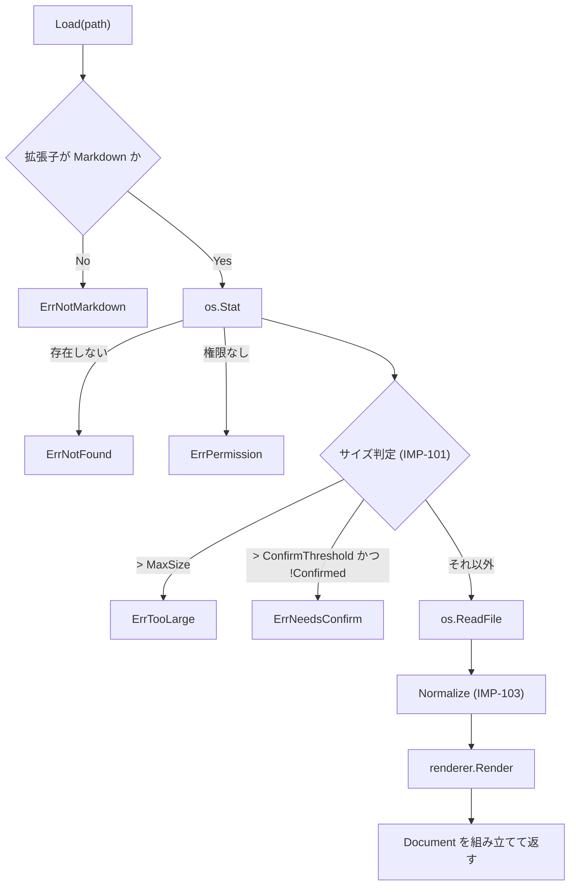

# 11. 実装仕様: Go 側

> 索引: [README](README.md) | 実装仕様: [10](10-impl-overview.md) / **11** / [12](12-impl-frontend.md) / [13](13-impl-interface.md)

本文書は `internal/` 配下の各パッケージと `app.go` の実装仕様を定める。型定義・シグネチャは実装の指針であり、同等の結果が得られる範囲での変更を妨げない（IMP-002）。

## 11.1 mdfile パッケージ（IMP-105）

責務: Markdown ファイルの拡張子判定。**依存を一切持たない葉パッケージ**であり、`document` / `filetree` / `session` / `app.go` のいずれからも直接参照してよい（IMP-012）。

### IMP-105: 拡張子の判定 **MUST**

```go
package mdfile

// Extensions は FR-010 / FR-031 が定める対象拡張子。
var Extensions = []string{".md", ".markdown", ".mdown", ".mkd"}

// IsMarkdown は拡張子が Markdown のものかを判定する。比較は常に小文字化して行う。
func IsMarkdown(path string) bool
```

この 1 箇所を、ファイルダイアログのフィルタ（FR-010）、ドロップ判定（FR-011）、ツリーのフィルタ（FR-031）、リンク遷移の判定（FR-050）、README の探索（FR-013）のすべてが参照する。定義を分散させない。

> [!NOTE]
> 独立したパッケージとしているのは、`filetree`（IMP-132）と `session`（IMP-193）がこの判定を必要とする一方、IMP-012 が `internal/` 同士の依存を禁じているためである。判定を `document` に置くと両者が `document` を経由して `renderer` に依存し、拡張子を調べるだけのために goldmark と chroma をテストバイナリへ持ち込むことになる。依存を持たない葉パッケージに置くことで、「定義は 1 箇所」（本項）と「内部パッケージ同士を絡ませない」（IMP-012）の双方を満たす。

## 11.2 document パッケージ（IMP-100 系）

責務: Markdown ファイルの読み込み、文字コードの正規化、サイズ判定、`renderer` の呼び出し、結果の組み立て。

### IMP-100: 型定義 **MUST**

```go
package document

// Document は表示対象の 1 文書を表す。
type Document struct {
    Path         string            // 絶対パス（IMP-025）
    Size         int64             // ファイルの実バイト数
    HTML         string            // サニタイズ済みの本文 HTML
    Headings     []renderer.Heading // アウトライン（FR-040）
    LineCount    int               // 総行数（UI-060 の表示に使う）
    NeedsMermaid bool              // Mermaid の遅延ロード判定（AR-021）
    NeedsKaTeX   bool              // KaTeX の遅延ロード判定（AR-021）
    Warnings     []Warning         // 描画は継続するが利用者に伝える事象
}

// Warning は FR-110 のうち「描画を継続する」事象を表す。
type Warning struct {
    Kind    WarningKind
    Detail  string
}

type WarningKind int

const (
    WarnInvalidEncoding WarningKind = iota // 不正な UTF-8 を置換した（FR-021）
    WarnTruncatedTree                      // ツリーの件数上限に達した（FR-032）
)
```

### IMP-101: サイズ閾値 **MUST**

```go
const (
    // FR-016 の閾値。仕様上の「10 MB」「50 MB」は 2 進接頭辞として解釈する。
    ConfirmThreshold int64 = 10 << 20 // 10 MiB = 10,485,760 バイト
    MaxSize          int64 = 50 << 20 // 50 MiB = 52,428,800 バイト
)
```

利用者への表示は小数第 1 位までの MB 表記（`12.4 MB`）とし、`1 MB = 1024 × 1024` で換算する（DSP-181）。

### IMP-102: 読み込み **MUST**

```go
type LoadOptions struct {
    // Confirmed が true の場合、ConfirmThreshold を超えていても描画する。
    // FR-016 の「Open anyway」に対応する。
    Confirmed bool
}

// Load はファイルを読み込み、変換して Document を返す。
// 返しうるエラー: ErrNotFound / ErrPermission / ErrNotMarkdown /
//                 ErrTooLarge / ErrNeedsConfirm / 変換エラー
func Load(r *renderer.Renderer, path string, opts LoadOptions) (*Document, error)
```

処理順序を以下に固定する。



- `ErrTooLarge` と `ErrNeedsConfirm` は、サイズ情報を添えて返す。呼び出し側が状態画面（UI-052）に表示できるよう、`*SizeError` 型でラップする。

```go
type SizeError struct {
    Path  string
    Size  int64
    Limit int64
    Err   error // ErrTooLarge または ErrNeedsConfirm
}

func (e *SizeError) Error() string { ... }
func (e *SizeError) Unwrap() error { return e.Err }
```

### IMP-103: 文字コードの正規化 **MUST**

FR-021 を実装する。

```go
// Normalize は生バイト列を UTF-8 テキストへ正規化する。
// 戻り値の bool は、不正なバイト列を置換したかどうかを示す。
func Normalize(raw []byte) (text []byte, replaced bool)
```

処理内容は以下の順とする。

1. UTF-8 BOM（`EF BB BF`）を先頭にのみ検出し、除去する。
2. 改行コードを LF に統一する。`CRLF` → `LF`、単独の `CR` → `LF` の順で置換する。
3. `utf8.Valid` が false の場合、`strings.ToValidUTF8` 相当の処理で不正バイトを U+FFFD に置換し、`replaced = true` を返す。
4. UTF-16 の BOM（`FF FE` / `FE FF`）を検出した場合も、変換は行わずそのまま 3 の処理へ進む。結果は文字化けするが、読み込み自体は成功させる（FR-021 の「失敗させない」）。

### IMP-104: 行数の算出 **MUST**

`LineCount` は正規化後のテキストの LF の個数に 1 を加えた値とする。末尾が LF で終わる場合は加算しない。

## 11.3 renderer パッケージ（IMP-110 系）

責務: goldmark パイプラインの構築と実行。Markdown → サニタイズ済み HTML への変換と、見出しの抽出。

### IMP-110: 型定義 **MUST**

```go
package renderer

type Heading struct {
    Level int    `json:"level"` // 1..6
    Text  string `json:"text"`  // インライン記法を除去したプレーンテキスト
    ID    string `json:"id"`    // 見出しアンカー（MD-021）
}

type Result struct {
    HTML         string
    Headings     []Heading
    NeedsMermaid bool
    NeedsKaTeX   bool
}

type Renderer struct {
    md       goldmark.Markdown
    policy   *bluemonday.Policy
}

func New() *Renderer

// Render は Markdown を変換する。baseDir は相対パス解決の基準ディレクトリ
// （表示中ファイルのディレクトリ。AR-042）。
func (r *Renderer) Render(source []byte, baseDir string) (Result, error)
```

- `Renderer` は状態を持たず、複数のゴルーチンから同時に `Render` を呼べる（IMP-024）。
- `Render` 内でパニックが発生した場合は `recover` し、エラーとして返す（IMP-022）。

### IMP-111: goldmark の構成 **MUST**

```go
goldmark.New(
    goldmark.WithExtensions(
        extension.GFM,          // 表・打消し線・タスクリスト・自動リンク（MD-022, MD-024）
        extension.Footnote,     // 脚注（MD-050）
        emoji.Emoji,            // 絵文字ショートコード（MD-051）
        meta.Meta,              // Front Matter（MD-073）
        highlighting.NewHighlighting(...), // IMP-114
        &alertExtension{},      // GitHub Alerts（IMP-112）
        &mathExtension{},       // 数式の保護（IMP-113）
        &mermaidExtension{},    // Mermaid ブロックの取り出し（IMP-115）
    ),
    goldmark.WithParserOptions(
        parser.WithAutoHeadingID(),  // 後述の理由により使用せず、独自の ID 生成を用いる
    ),
    goldmark.WithRendererOptions(
        html.WithUnsafe(),      // 生 HTML を通し、後段の bluemonday で除去する
    ),
)
```

- **`html.WithUnsafe()` を有効にする。** 生 HTML を goldmark 段階で落とすと、`<details>` 等の許可要素（MD-072）まで失われるため。安全性の担保は後段のサニタイズ（IMP-116）に一元化する。この 2 つは必ず対で実装する。
- **見出し ID は goldmark の `WithAutoHeadingID` を使わない。** GitHub 互換のスラッグ規則（MD-021）と生成結果が異なるため、独自の AST 変換で付与する（IMP-117）。
- TOML の Front Matter（`+++`）は `meta.Meta` が扱わないため、`Render` の前段で文字列として除去する。

### IMP-112: GitHub Alerts 拡張 **MUST**

MD-040 を実装する。goldmark の `ASTTransformer` として実装する。

```go
type alertKind int

const (
    alertNote alertKind = iota
    alertTip
    alertImportant
    alertWarning
    alertCaution
)

// alertTransformer は Blockquote の最初の Paragraph の先頭テキストが
// "[!NOTE]" 形式であれば、Blockquote を Alert ノードへ差し替える。
type alertTransformer struct{}

func (t *alertTransformer) Transform(doc *ast.Document, reader text.Reader, pc parser.Context)
```

判定規則:

1. `ast.Blockquote` の最初の子が `ast.Paragraph` であること。
2. その先頭行が `[!` で始まり `]` で終わること。大文字小文字は区別しない。
3. 括弧内が 5 種のいずれかに一致すること。一致しない場合は変換せず、通常の引用として残す（MD-040）。
4. 一致した場合、その行を Blockquote から取り除き、Alert 種別を属性として保持する。

出力する HTML の構造は以下に固定する。

```html
<div class="markdown-alert markdown-alert-warning">
  <p class="markdown-alert-title">Warning</p>
  <p>本文…</p>
</div>
```

- 種別は `markdown-alert-<種別小文字>` のクラスで示す（`note` / `tip` / `important` / `warning` / `caution`）。
- ラベル（`Note` 等）は Go 側が出力する。英語表記に固定する（MD-040）。
- **アイコンは Go 側で出力しない。** サニタイズ（MD-072）は `svg` 要素を除去対象としており、Go 側が出力したインライン SVG は必ず落ちる。アイコンはフロントエンドが後処理で付与する（IMP-220 の 3'、DSP-260）。
- サニタイズの許可クラスに `markdown-alert` の接頭辞を含める（IMP-116）。

> [!IMPORTANT]
> 「アイコンは SVG で表示する」（MD-040）と「生 HTML の `svg` は除去する」（MD-072）は、Go 側で SVG を出力しようとすると衝突する。アイコンの付与をフロントエンドに寄せることで、サニタイズの許可リストを緩めずに両立させる。**サニタイズの許可リストに `svg` を追加して解決してはならない。**

### IMP-113: 数式の保護 **MUST**

MD-060 を実装する。KaTeX は**フロントエンドで実行する**（AR-031）ため、Go 側の役割は「数式部分を Markdown の他の記法から保護し、フロントエンドが識別できる形で出力する」ことに限る。

```go
// mathExtension は $...$ / $$...$$ / ```math を検出し、
// 内容をエスケープした上で <span class="math-inline"> /
// <div class="math-block"> として出力する。
type mathExtension struct{}
```

- 数式の中身は Markdown として解釈させない。`_` や `*` が強調として処理されることを防ぐため、インラインパーサの段階でテキストノードとして取り込む。
- `$` の判定は GitHub の規則に従う（MD-060）。開始の `$` の直後が空白の場合、および終了の `$` の直前が空白の場合は数式としない。これにより `$100 と $200` が数式にならない。
- コードブロック・インラインコードの内部は対象外とする。goldmark のインラインパーサはコードスパンを先に処理するため、優先度を適切に設定すれば自然に満たされる。
- 数式ノードを 1 つ以上出力した場合、`Result.NeedsKaTeX = true` とする。

### IMP-114: シンタックスハイライト **MUST**

MD-030 を実装する。

```go
highlighting.NewHighlighting(
    highlighting.WithFormatOptions(
        chromahtml.WithClasses(true),   // 重要（後述）
        chromahtml.WithLineNumbers(false), // 行番号なし（MD-032）
    ),
    highlighting.WithWrapperRenderer(codeBlockWrapper), // IMP-115
)
```

- **`WithClasses(true)` を必ず指定し、インラインスタイルを出力させない。** chroma がインラインの `style` 属性で色を書き込むと、テーマ切り替え（FR-070）のたびに Markdown の再変換が必要になり、「ちらつきなく即座に切り替える」（UI-105）が満たせなくなる。クラス名のみを出力し、配色は CSS 側で Light / Dark を切り替える（DSP-250）。
- chroma のスタイル定義から生成した CSS（`github` / `github-dark` 相当）を、ビルド時ではなく**あらかじめ生成して `frontend/css/` に置く**。実行時に chroma のスタイルを走査しない。
- 登録する言語は MD-031 の一覧に限定してよい（AR-033）。限定する場合、`lexers.Get` が nil を返した言語はハイライトなしで出力する。
- 言語名のエイリアス解決は chroma の機能に委ねる。

### IMP-115: コードブロックのラッパと Mermaid **MUST**

FR-060 / MD-080 を実装する。すべてのコードブロックを共通のラッパで包み、フロントエンドがコピーボタンと Mermaid 描画の対象を識別できるようにする。

出力する構造:

```html
<div class="code-block" data-lang="go">
  <pre><code class="chroma">…ハイライト済み…</code></pre>
</div>

<div class="code-block" data-lang="mermaid" data-mermaid="1"
     data-source="graph TD&#10;  A--&gt;B">
  <pre class="mermaid-source">graph TD
  A--&gt;B</pre>
</div>
```

- **Mermaid ブロックにのみ `data-source` 属性を付け、原文を重複して持たせる。** Mermaid は描画後に `<pre>` が SVG へ置き換わり、DOM から原文が失われる。これがないと、描画後にコピーボタン（FR-060）がソースを取得できず、テーマ切り替え時の再描画（IMP-231）もできない。
- `data-source` の値は HTML 属性としてエスケープする（改行は `&#10;`）。Base64 等の追加のエンコードは行わない。デバッグ時に目視できる形を保つため。
- 通常のコードブロックには `data-source` を付けない。原文は `pre code` の `textContent` から取得できる（IMP-221）。
- `mermaid` ブロックを 1 つ以上出力した場合、`Result.NeedsMermaid = true` とする。
- `math` 言語のコードブロックは Mermaid ではなく数式として扱う（IMP-113）。

### IMP-116: サニタイズ **MUST**

MD-072 を実装する。変換パイプラインの最後段に固定で置き、迂回経路を作らない（AR-031）。

```go
// Policy は MD-072 の許可リストを実装した bluemonday ポリシーを返す。
func Policy() *bluemonday.Policy
```

ポリシーの要点:

- 許可要素は MD-072 の一覧をハードコードする。設定で緩められるようにしない。
- `img` には `src` / `alt` / `title` / `width` / `height` を許可する。`src` は `http`, `https`, および内部アセットサーバのパス（`/__local/`）のみ許可する。
- `a` には `href` / `title` を許可する。`href` は `http`, `https`, `mailto`, 相対パス、`#` アンカーのみ許可する。`javascript:` 等は除去する。
- コードブロックとハイライトのために、`span` / `code` / `pre` / `div` の `class` 属性を許可する。ただし許可する値は接頭辞で制限する（`chroma`, `code-block`, `markdown-alert`, `math-` など）。任意のクラス名を通さない。
- `data-lang` / `data-mermaid` / `data-source` / `id`（見出しアンカー）を許可する。
- サニタイズ後に、想定したクラスや属性が失われていないことをユニットテストで確認する（IMP-040）。

> [!IMPORTANT]
> `html.WithUnsafe()`（IMP-111）とこのサニタイズは対で意味を持つ。片方だけを変更してはならない。

### IMP-117: 見出しアンカーの生成 **MUST**

MD-021 を実装する。

```go
type slugger struct {
    used map[string]int
}

// Slug は GitHub 互換のアンカー文字列を返す。同一 slugger 内で
// 重複した場合、2 つ目以降に "-1", "-2" … を付加する。
func (s *slugger) Slug(text string) string
```

処理順序:

1. 見出しの AST からインライン記法を除いたプレーンテキストを組み立てる。
2. Unicode の小文字化を行う（`strings.ToLower`）。
3. 空白（連続を含む）を単一の `-` に置換する。
4. 英数字・`-`・`_`・非 ASCII 文字以外を除去する。
5. 重複時に連番を付与する。

同じ処理で得たプレーンテキストを `Heading.Text` にも用いる（FR-040）。

### IMP-118: 画像 URL の書き換え **MUST**

FR-022 / AR-040 / AR-042 を実装する。

```go
// rewriteImageURL は Markdown 内の画像 src を、WebView から取得できる形へ変換する。
//   http:// https://        → そのまま（MD-071）
//   data:image/…            → そのまま
//   絶対パス・相対パス       → /__local/<エスケープ済み絶対パス>（AR-040）
func rewriteImageURL(src, baseDir string) string
```

- 相対パスは `baseDir` を基準に `filepath.Join` して絶対化する。
- リンク（`a href`）は書き換えない。クリック時にフロントエンドが捕捉して Go 側へ渡すため（AR-060）、元の値のまま保持する。

## 11.4 filetree パッケージ（IMP-130 系）

### IMP-130: 型定義 **MUST**

```go
package filetree

type Node struct {
    Name     string `json:"name"`
    Path     string `json:"path"`     // 絶対パス
    IsDir    bool   `json:"isDir"`
    Children []Node `json:"children"` // 未読込のディレクトリでは nil
    Loaded   bool   `json:"loaded"`   // 子を読み込み済みか
    Truncated bool  `json:"truncated"` // 件数上限で切り詰めたか（FR-032）
}
```

### IMP-131: 読み込み **MUST**

```go
const MaxEntriesPerDir = 1000 // FR-032

// ReadDir は dir の直下のみを読み込む。再帰しない（FR-032）。
func ReadDir(dir string) ([]Node, error)

// PathTo は root から target に至る経路上のディレクトリを順に返す。
// 表示中ファイルまでの自動展開（FR-032）に用いる。
func PathTo(root, target string) ([]string, error)
```

### IMP-132: フィルタ規則 **MUST**

FR-031 を実装する。

```go
var excludedDirs = map[string]bool{
    "node_modules": true, "vendor": true, ".git": true,
    "target": true, "dist": true, "build": true,
}

// include はエントリを表示対象とするか判定する。
func include(name string, isDir bool) bool
```

- 名前が `.` で始まるものを除外する。
- `excludedDirs` に一致するディレクトリを除外する。
- ファイルは `mdfile.IsMarkdown` が真のもののみ含める（IMP-105）。
- 並び順はディレクトリ優先、次に名前の昇順（大文字小文字を区別しない比較）。

### IMP-133: 空ディレクトリの判定 **SHOULD**

FR-031 の「Markdown を 1 つも含まないディレクトリは表示しない」を、FR-032 の遅延展開と両立させる。

```go
// hasMarkdownWithin は dir 直下と、その 1 階層下までを調べ、
// Markdown ファイルが存在する可能性があるかを返す。
// 全階層は走査しない（FR-032 の NOTE）。
func hasMarkdownWithin(dir string) bool
```

判定できなかった深い階層のディレクトリは表示し、展開したときに空であることが分かる状態を許容する。

## 11.5 watcher パッケージ（IMP-140 系）

### IMP-140: 型定義とライフサイクル **MUST**

FR-014 / AR-070 を実装する。

```go
package watcher

type EventKind int

const (
    Modified EventKind = iota
    Removed
)

type Event struct {
    Path string
    Kind EventKind
}

type Watcher struct { ... }

// New は監視を開始する。ctx のキャンセルで内部ゴルーチンを終了する（IMP-024）。
func New(ctx context.Context) (*Watcher, error)

// Watch は監視対象を path 1 つに切り替える。以前の対象は必ず解除する。
// 監視対象は常に 1 つ以下であること（NFR-020）。
func (w *Watcher) Watch(path string) error

// Unwatch は監視を解除する。
func (w *Watcher) Unwatch()

// Events は通知チャネルを返す。デバウンス後のイベントのみが流れる。
func (w *Watcher) Events() <-chan Event

func (w *Watcher) Close() error
```

### IMP-141: 監視方式 **MUST**

- fsnotify では**対象ファイルの親ディレクトリを監視し**、イベントのファイル名が対象と一致するものだけを拾う。ファイル単体の監視は、エディタの「一時ファイル作成 → リネーム」保存で監視ハンドルが外れるため採用しない（FR-014）。
- 親ディレクトリの監視で拾ったイベントのうち、対象ファイル以外のものは破棄する。ツリーの更新契機には使わない（FR-035）。

### IMP-142: デバウンス **MUST**

```go
const debounceInterval = 150 * time.Millisecond // FR-014
```

- 最後のイベントから 150 ms 追加のイベントがなければ、1 件の `Modified` を送出する。
- タイマはイベントごとにリセットする。
- `Remove` / `Rename` を受けた場合、150 ms 待って対象ファイルが再び存在すれば `Modified`、存在しなければ `Removed` を送出する。これにより、リネーム型の保存を削除と誤認しない。

## 11.6 config パッケージ（IMP-150 系）

### IMP-150: 型定義 **MUST**

UI-110 を実装する。

```go
package config

type Config struct {
    Theme           string `json:"theme"`           // "light" | "dark"
    Zoom            int    `json:"zoom"`            // 50..300
    OutlineVisible  bool   `json:"outlineVisible"`
    FileTreeVisible bool   `json:"fileTreeVisible"`
    OutlineWidth    int    `json:"outlineWidth"`
    FileTreeWidth   int    `json:"fileTreeWidth"`
    WindowWidth     int    `json:"windowWidth"`
    WindowHeight    int    `json:"windowHeight"`
    WindowMaximized bool   `json:"windowMaximized"`
}
```

**ウィンドウ位置（X, Y）のフィールドを定義しない。** 構造体に存在しなければ、保存も復元も起こり得ない（UI-111）。

### IMP-151: 読み書き **MUST**

```go
// Default は UI-110 の既定値を返す。Theme は空文字とし、
// OS のテーマ設定に追従させる判断は呼び出し側が行う（FR-071）。
func Default() Config

// Load は設定を読み込む。**エラーを返さない。**
// ファイルがない・壊れている・読めない場合は Default() を返す（UI-113）。
func Load() Config

// Save は設定を保存する。失敗しても動作は継続させるため、
// 呼び出し側はエラーを無視してよい（UI-113）。
func Save(c Config) error

// Normalize は範囲外の値を既定値へ丸める（UI-113）。
func (c *Config) Normalize()
```

- `Save` は同一ディレクトリの一時ファイルへ書き出し、`os.Rename` で置き換える（UI-112）。
- `Load` は JSON の部分的な欠落を許容する。`Default()` を初期値とした構造体へ `json.Unmarshal` することで、未指定項目に既定値が残る。

### IMP-152: 保存先の解決 **MUST**

UI-112 を実装する。OS 差異はファイル名サフィックスで分ける（IMP-031）。

```go
// Dir は設定ディレクトリの絶対パスを返す。
//   Windows: %TEMP%\MarkView
//   Linux:   $TMPDIR/MarkView-<uid>  （TMPDIR 未設定時は /tmp/MarkView-<uid>）
func Dir() (string, error)

func Path() (string, error) // Dir() + "/config.json"
```

- Linux では `os.Getuid()` をディレクトリ名に含め、ディレクトリを `0700`、ファイルを `0600` で作成する。
- ディレクトリの作成に失敗した場合、`Dir` はエラーを返す。`Load` はそれを握り潰して `Default()` を返す。

### IMP-153: 値の範囲 **MUST**

```go
const (
    MinPaneWidth = 160  // UI-030, UI-040
    MinZoom      = 50   // FR-081
    MaxZoom      = 300
    ZoomStep     = 10
    MinWindowW   = 640  // UI-011
    MinWindowH   = 480
)
```

`Normalize` は、範囲外・ゼロ値・負値をすべて `Default()` の対応する値へ置き換える。ペイン幅の上限（ウィンドウ幅の 40 %）は実行時のウィンドウ幅に依存するため、フロントエンド側で制限する（IMP-240）。

## 11.7 assetsrv パッケージ（IMP-160 系）

### IMP-160: ハンドラ **MUST**

AR-040 / AR-041 を実装する。

```go
package assetsrv

const (
    LocalPrefix = "/__local/"
    AppIconPath = "/appicon.png" // アプリケーションアイコン（IMP-032）
)

type Handler struct {
    embedded fs.FS
    appIcon  []byte
}

func New(embedded fs.FS, appIcon []byte) *Handler

func (h *Handler) ServeHTTP(w http.ResponseWriter, r *http.Request)

// LocalURL は絶対パスから配信用 URL を組み立てる（IMP-118 が使用）。
func LocalURL(absPath string) string
```

配信するパスは以下の 3 系統に限る。

| パス | 配信内容 |
| --- | --- |
| `/appicon.png` | `go:embed` したアプリケーションアイコン（UI-025）。情報ダイアログが参照する |
| `/__local/<絶対パス>` | ローカルの画像ファイル（IMP-161 の検査を通す） |
| それ以外の `/` 配下 | 埋め込みのアプリ資産（HTML / CSS / JS / vendor） |

### IMP-161: ローカル配信の検査順序 **MUST**

`/__local/` へのリクエストは、以下の順で検査する。1 つでも失敗したら 404 を返し、理由を本文に含めない。

1. URL からパスをデコードする。
2. `filepath.Clean` と `filepath.Abs` で正規化する。
3. `filepath.EvalSymlinks` でシンボリックリンクを解決する。
4. **解決後のパス**の拡張子が許可リストに含まれるかを検査する（下記）。
5. `os.Stat` で通常ファイルであることを確認する。ディレクトリ・デバイスファイル等は拒否する。

```go
// FR-022 の対応形式と一致させる。
var allowedImageExt = map[string]string{
    ".png": "image/png", ".jpg": "image/jpeg", ".jpeg": "image/jpeg",
    ".gif": "image/gif", ".svg": "image/svg+xml", ".webp": "image/webp",
    ".avif": "image/avif", ".bmp": "image/bmp", ".ico": "image/x-icon",
}
```

### IMP-162: 応答ヘッダ **MUST**

| ヘッダ | 値 | 根拠 |
| --- | --- | --- |
| `Content-Type` | 拡張子から決定（IMP-161 の表） | AR-041 |
| `X-Content-Type-Options` | `nosniff` | AR-041 |
| `Content-Security-Policy` | `sandbox` | AR-041（SVG 対策） |
| `Cache-Control` | `no-store` | 更新した画像が古いまま表示されるのを防ぐ |

埋め込み資産（`/` 配下）には `Cache-Control: public, max-age=31536000` を付けてよい。内容は実行ファイルに固定されているため。

## 11.8 opener パッケージ（IMP-170 系）

### IMP-170: 外部委譲 **MUST**

FR-050 / FR-053 を実装する。Wails に依存しない（IMP-012）。

```go
package opener

// OpenURL は既定ブラウザで URL を開く。http/https/mailto のみ受け付ける。
func OpenURL(rawurl string) error

// OpenFile は既定のアプリケーションでファイルを開く（FR-053）。
func OpenFile(path string) error
```

| OS | 実装 |
| --- | --- |
| Windows | `rundll32.exe url.dll,FileProtocolHandler <target>` を `exec.Command` で起動する。`cmd /c start` はクォート処理の差異で誤動作しうるため用いない |
| Linux | `xdg-open <target>` を起動する。存在しない場合はエラーを返し、呼び出し側がステータス表示する |

- 引数は必ず `exec.Command` の可変長引数として渡し、シェルを経由しない。文字列連結でコマンドを組み立てない。
- URL は事前にスキームを検査し、`http` / `https` / `mailto` 以外を拒否する。

## 11.9 buildinfo パッケージ（IMP-180 系）

### IMP-180: バージョン情報 **MUST**

BR-030 を実装する。

```go
package buildinfo

// ldflags -X で上書きする。既定値は開発ビルド用。
var (
    Version   = "dev"
    Commit    = "unknown"
    BuildTime = "unknown"
)
```

### IMP-181: 同梱資産の情報 **MUST**

BR-042 / UI-100 の `Bundled` 行を実装する。

```go
type VendorEntry struct {
    Name    string `json:"name"`
    Version string `json:"version"`
    Source  string `json:"source"`
    Fetched string `json:"fetched"`
}

// Vendors は埋め込まれた vendor.json を解析して返す。
func Vendors() []VendorEntry

// Environment は "windows/amd64  Go 1.24.0  WebView2 120.x" 形式の文字列を返す。
// WebView のバージョンは Wails から取得できない場合、空欄とする。
func Environment(webviewVersion string) string
```

## 11.10 App と session（IMP-190 系）

`app.go` は Wails にバインドされる唯一の型であり、Wails に依存する。**判断を伴うロジックは `internal/session` に置き、`app.go` からは呼ぶだけにする**（IMP-012）。この分離により、履歴・起動解決・パス算出を Wails なしでテストできる（UT-803〜UT-805）。

| 責務 | 置き場所 |
| --- | --- |
| Wails のバインドメソッド、イベント送出、ウィンドウ操作 | `app.go` |
| アプリケーション状態の保持と排他制御 | `app.go` |
| 表示履歴の操作（IMP-191） | `internal/session` |
| 起動時の対象解決（IMP-193） | `internal/session` |
| 表示用パスの算出とパス比較（IMP-025） | `internal/session` |

### IMP-190: 保持する状態 **MUST**

```go
type App struct {
    ctx      context.Context
    mu       sync.Mutex

    renderer *renderer.Renderer
    watcher  *watcher.Watcher
    cfg      config.Config

    treeRoot string      // ツリールートの絶対パス（FR-030）
    current  *document.Document   // 表示中の文書。未表示なら nil
    history  *session.History     // 表示履歴（IMP-191）

    // 確認画面を表示中のファイル（FR-016）。OpenConfirmed が受け付ける
    // 対象をこの 1 つに限定するために保持する（IMP-314）。
    pendingConfirm string
}
```

- すべての状態変更は `mu` で保護する（IMP-024）。
- **ファイルパスの履歴やツリールートをディスクへ書き出す経路を持たない**（NFR-042）。`config.Config` にそれらのフィールドが存在しないことで構造的に保証する（IMP-150）。

### IMP-191: 表示履歴 **MUST**

FR-051 を実装する。**配置は `internal/session`**（IMP-012）。

```go
package session

type Entry struct {
    Path      string
    ScrollTop int    // フロントエンドから受け取るスクロール位置
    Anchor    string // アンカー付きリンクで開いた場合の見出し ID
}

type History struct {
    entries []Entry
    index   int // 現在位置
}

const MaxHistory = 50 // FR-051

func NewHistory() *History
func (h *History) Push(e Entry)              // 前方履歴を破棄して追加
func (h *History) Back() (Entry, bool)
func (h *History) Forward() (Entry, bool)
func (h *History) SetScrollTop(top int)      // 現在位置のスクロール位置を更新
```

- 履歴はメモリ上のみ。プロセス終了で破棄する（FR-051, NFR-042）。
- `Push` の前に、現在位置のエントリのスクロール位置を更新する。戻ったときに元の位置へ復元できるようにするため（FR-050）。
- 上限を超えた場合、先頭から捨てる。

### IMP-192: 文書を開く共通処理 **MUST**

FR-010 / FR-011 / FR-012 / FR-033 / FR-050 / FR-051 のすべてが、この 1 つの内部処理を通る（AR-060）。

```go
type openSource int

const (
    openFromDialog openSource = iota // FR-010
    openFromDrop                     // FR-011
    openFromArgs                     // FR-012
    openFromTree                     // FR-033
    openFromLink                     // FR-050
    openFromHistory                  // FR-051
    openFromReload                   // FR-014, FR-015
)

func (a *App) open(path string, src openSource, opts document.LoadOptions) (DocumentDTO, error)
```

各 `openSource` による差異は以下に限る。

| source | ツリールート | 履歴 | スクロール |
| --- | --- | --- | --- |
| `openFromDialog` / `openFromDrop` / `openFromArgs` | 親ディレクトリへ変更 | 積む | 先頭 |
| `openFromTree` / `openFromLink` | **変更しない**（FR-030, FR-052） | 積む | 先頭（アンカー指定時はその位置） |
| `openFromHistory` | 変更しない | 積まない | `restore`: 記録された位置を復元 |
| `openFromReload` | 変更しない | **積まない**（FR-051） | `keep`: 現在位置を維持 |

この表以外の差異を持ち込まない。分岐が増えると FR-030 の不変条件（リンク遷移でツリールートが動かない）を壊しやすくなる。

### IMP-193: 起動シーケンス **MUST**

FR-012 / FR-013 / AR-080 を実装する。**判定部分の配置は `internal/session`**（IMP-012）。`main.go` はコマンドライン引数を渡すだけとし、探索の判断をここへ集約する。

```go
package session

// Startup は起動時に決定した表示対象とツリールートを表す。
type Startup struct {
    TreeRoot string // 絶対パス
    Initial  string // 表示対象の絶対パス。なければ空文字
}

// ResolveStartup は起動時の表示対象とツリールートを決定する。
// cwd と exeDir を引数で受け取ることで、テストから差し替えられる（UT-803）。
func ResolveStartup(args []string, cwd, exeDir string) (Startup, error)
```

`os.Getwd()` と `os.Executable()` の呼び出しは `main.go` 側で行い、結果を引数として渡す。**実行環境に依存する値を関数内で直接取得しない**（UT-035）。

1. `--version` / `--help` は Wails を起動する前に処理し、標準出力へ書いて終了する（FR-012）。

   > [!IMPORTANT]
   > **Windows では、標準出力へ書く前に親プロセスのコンソールへ繋ぎ直す必要がある。**
   > Wails が作る Windows の実行ファイルは GUI サブシステムであり、コンソールから
   > 起動されてもコンソールに接続されない（`GetStdHandle` が NULL を返す）。
   > そのまま書いても行き先がなく、利用者がターミナルで `MarkView --version` と
   > 打っても何も表示されない。`AttachConsole(ATTACH_PARENT_PROCESS)` を呼び、
   > `CONOUT$` を開き直してから出力する。実装は `console_windows.go` に置き、
   > Windows 以外は何もしない実装を `console_other.go` に置く（IMP-031）。
   >
   > ただし**標準出力がすでに有効な場合（リダイレクトやパイプ）は繋ぎ直さない。**
   > 繋ぎ直すと、リダイレクト先ではなくコンソールへ出力してしまう。
   > また、繋ぎ直すのは `--version` / `--help` / 未知のオプションを処理する経路に
   > 限る。ウィンドウを開く経路でコンソールを掴み続けると、起動元のターミナルを
   > 閉じられなくなる。
   >
   > **シェルはプロセスの終了を待たずにプロンプトを返す。** GUI サブシステムの
   > 実行ファイルに対する Windows の既定の挙動であり、出力はプロンプトが出た後に
   > 現れる。見え方は不格好だが、出力そのものは届いており、リダイレクトや
   > パイプで起動した場合はシェルが待つため終了コードも正しく取れる（E2E-102,
   > E2E-103, E2E-105 は CI で出力を捕捉して実行するため成立する）。
   > これを解消するにはコンソールサブシステムでビルドすることになるが、その場合は
   > エクスプローラからのダブルクリック起動（UC-01。本アプリの主たる使い方）で
   > 黒いコンソール窓が開いてしまう。**主たる使い方を優先し、この見え方を許容する。**
2. 引数にパスがある場合、ファイルなら「親ディレクトリ + そのファイル」、ディレクトリなら「そのディレクトリ + 直下の README」。
3. 引数がない場合、以下の順で `README.md`（大文字小文字を区別しない）を探す（FR-013）。
   1. `os.Getwd()`
   2. `os.Executable()` を `filepath.EvalSymlinks` で解決したディレクトリ
4. どちらにも見つからない場合、ツリールートをカレントディレクトリとし、表示対象なしとする。

```go
// FindReadme はディレクトリ直下から README を探す。
// 完全一致 "README.md" を優先し、次に大文字小文字を無視した一致のうち
// 名前の昇順で先頭のものを返す（FR-013）。配置は internal/session。
func FindReadme(dir string) (string, bool)
```

起動時の表示対象が読み込めない場合も、**ウィンドウは必ず開く**（FR-012）。エラーの種類に応じて `InitialStateDTO.StateKind` を設定し、状態画面を初期表示とする（IMP-303）。

| 起動時の事象 | `StateKind` | `Document` |
| --- | --- | --- |
| 正常に読み込めた | `""` | 文書 |
| 表示対象が見つからない | `"welcome"` | null |
| 10 MB 超（`ErrNeedsConfirm`） | `"confirm-large"` | null（`Error` にパスとサイズ） |
| 50 MB 超（`ErrTooLarge`） | `"too-large"` | null（同上） |
| 変換に失敗した | `"render-error"` | null（`Error` に内容） |
| 存在しない・読めないパスを指定された | `"welcome"` | null（加えてエラーをステータス表示） |

`confirm-large` で起動した場合、`pendingConfirm`（IMP-190）にそのパスを設定し、`OpenConfirmed` を受け付けられる状態にする。

### IMP-194: 終了処理 **MUST**

- `watcher` を停止し、ゴルーチンを終了させる。
- `config.Save` を呼ぶ（UI-114）。失敗しても終了を妨げない。
- 履歴・表示中パスは保存しない（NFR-042）。

**ウィンドウのサイズと最大化状態は Go 側で取得する。** これらはフロントエンドから通知されない（`ConfigDTO` に含まれない。IMP-303）ため、保存の直前に Wails のランタイムから読み出す。

```go
// 終了時、および設定保存時に呼ぶ
func (a *App) captureWindowState() {
    if runtime.WindowIsMaximised(a.ctx) {
        a.cfg.WindowMaximized = true
        // 最大化中のサイズは保存しない。復元時に元のサイズが失われるため
        return
    }
    a.cfg.WindowMaximized = false
    a.cfg.WindowWidth, a.cfg.WindowHeight = runtime.WindowGetSize(a.ctx)
}
```

- 最大化状態で終了した場合、**そのときの画面いっぱいのサイズを保存しない。** 保存すると、次回に最大化を解除したときのウィンドウが画面いっぱいのままになる。最大化フラグのみを保存し、幅と高さは最大化する前の値を保つ。
- ウィンドウ位置は取得しない。構造体にフィールドが存在しない（IMP-150, UI-111）。

## 11.11 要求一覧

| ID | 概要 | 必須度 |
| --- | --- | --- |
| IMP-100 | document 型定義 | MUST |
| IMP-101 | サイズ閾値 | MUST |
| IMP-102 | 読み込み | MUST |
| IMP-103 | 文字コードの正規化 | MUST |
| IMP-104 | 行数の算出 | MUST |
| IMP-105 | 拡張子の判定（`internal/mdfile`） | MUST |
| IMP-110 | renderer 型定義 | MUST |
| IMP-111 | goldmark の構成 | MUST |
| IMP-112 | GitHub Alerts 拡張 | MUST |
| IMP-113 | 数式の保護 | MUST |
| IMP-114 | シンタックスハイライト | MUST |
| IMP-115 | コードブロックのラッパと Mermaid | MUST |
| IMP-116 | サニタイズ | MUST |
| IMP-117 | 見出しアンカーの生成 | MUST |
| IMP-118 | 画像 URL の書き換え | MUST |
| IMP-130 | filetree 型定義 | MUST |
| IMP-131 | 読み込み | MUST |
| IMP-132 | フィルタ規則 | MUST |
| IMP-133 | 空ディレクトリの判定 | SHOULD |
| IMP-140 | watcher 型定義とライフサイクル | MUST |
| IMP-141 | 監視方式 | MUST |
| IMP-142 | デバウンス | MUST |
| IMP-150 | config 型定義 | MUST |
| IMP-151 | 読み書き | MUST |
| IMP-152 | 保存先の解決 | MUST |
| IMP-153 | 値の範囲 | MUST |
| IMP-160 | アセットサーバのハンドラ | MUST |
| IMP-161 | ローカル配信の検査順序 | MUST |
| IMP-162 | 応答ヘッダ | MUST |
| IMP-170 | 外部委譲 | MUST |
| IMP-180 | バージョン情報 | MUST |
| IMP-181 | 同梱資産の情報 | MUST |
| IMP-190 | App が保持する状態 | MUST |
| IMP-191 | 表示履歴 | MUST |
| IMP-192 | 文書を開く共通処理 | MUST |
| IMP-193 | 起動シーケンス | MUST |
| IMP-194 | 終了処理 | MUST |
