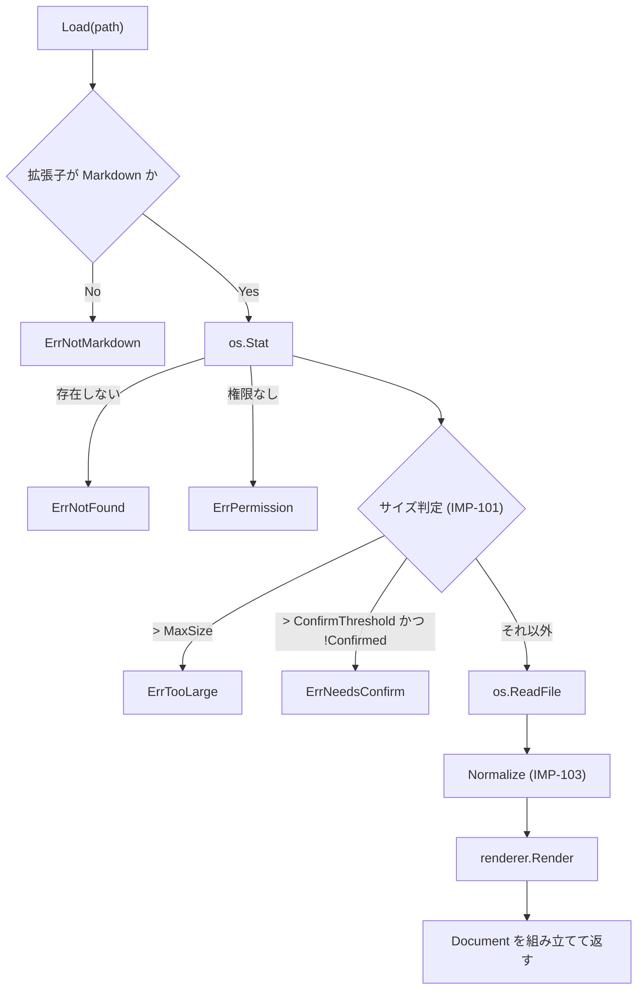

# 11. 実装仕様: Go 側

> 索引: [README](README.md) | 実装仕様: [10](10-impl-overview.md) / **11** / [12](12-impl-frontend.md) / [13](13-impl-interface.md)

本文書は `internal/` 配下の各パッケージと `app.go` の実装仕様を定める。型定義・シグネチャは実装の指針であり、同等の結果が得られる範囲での変更を妨げない（IMP-002）。

## 11.1 mdfile パッケージ（IMP-105）

責務: Markdown ファイルの拡張子判定。**依存を一切持たない葉パッケージ**であり、`document` / `filetree` / `session` / `app.go` のいずれからも直接参照してよい（IMP-012）。

### IMP-105: 拡張子の判定 **MUST**

```go
package mdfile

// Extensions は FR-010 / FR-031 が定める対象拡張子。
var Extensions = []string{".md", ".markdown", ".mdown", ".mkd"}

// IsMarkdown は拡張子が Markdown のものかを判定する。比較は常に小文字化して行う。
func IsMarkdown(path string) bool
```

この 1 箇所を、ファイルダイアログのフィルタ（FR-010）、ドロップ判定（FR-011）、ツリーのフィルタ（FR-031）、リンク遷移の判定（FR-050）、README の探索（FR-013）のすべてが参照する。定義を分散させない。

> [!NOTE]
> 独立したパッケージとしているのは、`filetree`（IMP-132）と `session`（IMP-193）がこの判定を必要とする一方、IMP-012 が `internal/` 同士の依存を禁じているためである。判定を `document` に置くと両者が `document` を経由して `renderer` に依存し、拡張子を調べるだけのために goldmark と chroma をテストバイナリへ持ち込むことになる。依存を持たない葉パッケージに置くことで、「定義は 1 箇所」（本項）と「内部パッケージ同士を絡ませない」（IMP-012）の双方を満たす。

## 11.2 document パッケージ（IMP-100 系）

責務: Markdown ファイルの読み込み、文字コードの正規化、サイズ判定、`renderer` の呼び出し、結果の組み立て。

### IMP-100: 型定義 **MUST**

```go
package document

// Document は表示対象の 1 文書を表す。
type Document struct {
    Path         string            // 絶対パス（IMP-025）
    Size         int64             // ファイルの実バイト数
    HTML         string            // サニタイズ済みの本文 HTML
    Headings     []renderer.Heading // アウトライン（FR-040）
    LineCount    int               // 総行数（UI-060 の表示に使う）
    NeedsMermaid bool              // Mermaid の遅延ロード判定（AR-021）
    NeedsKaTeX   bool              // KaTeX の遅延ロード判定（AR-021）
    Warnings     []Warning         // 描画は継続するが利用者に伝える事象
}

// Warning は FR-110 のうち「描画を継続する」事象を表す。
type Warning struct {
    Kind    WarningKind
    Detail  string
}

type WarningKind int

const (
    WarnInvalidEncoding WarningKind = iota // 不正な UTF-8 を置換した（FR-021）
    WarnTruncatedTree                      // ツリーの件数上限に達した（FR-032）
)
```

### IMP-101: サイズ閾値 **MUST**

```go
const (
    // FR-016 の閾値。仕様上の「10 MB」「50 MB」は 2 進接頭辞として解釈する。
    ConfirmThreshold int64 = 10 << 20 // 10 MiB = 10,485,760 バイト
    MaxSize          int64 = 50 << 20 // 50 MiB = 52,428,800 バイト
)
```

利用者への表示は小数第 1 位までの MB 表記（`12.4 MB`）とし、`1 MB = 1024 × 1024` で換算する（DSP-181）。

### IMP-102: 読み込み **MUST**

```go
type LoadOptions struct {
    // Confirmed が true の場合、ConfirmThreshold を超えていても描画する。
    // FR-016 の「Open anyway」に対応する。
    Confirmed bool
}

// Load はファイルを読み込み、変換して Document を返す。
// 返しうるエラー: ErrNotFound / ErrPermission / ErrNotMarkdown /
//                 ErrTooLarge / ErrNeedsConfirm / 変換エラー
func Load(r *renderer.Renderer, path string, opts LoadOptions) (*Document, error)
```

処理順序を以下に固定する。



- `ErrTooLarge` と `ErrNeedsConfirm` は、サイズ情報を添えて返す。呼び出し側が状態画面（UI-052）に表示できるよう、`*SizeError` 型でラップする。

```go
type SizeError struct {
    Path  string
    Size  int64
    Limit int64
    Err   error // ErrTooLarge または ErrNeedsConfirm
}

func (e *SizeError) Error() string { ... }
func (e *SizeError) Unwrap() error { return e.Err }
```

### IMP-103: 文字コードの正規化 **MUST**

FR-021 を実装する。

```go
// Normalize は生バイト列を UTF-8 テキストへ正規化する。
// 戻り値の bool は、不正なバイト列を置換したかどうかを示す。
func Normalize(raw []byte) (text []byte, replaced bool)
```

処理内容は以下の順とする。

1. UTF-8 BOM（`EF BB BF`）を先頭にのみ検出し、除去する。
2. 改行コードを LF に統一する。`CRLF` → `LF`、単独の `CR` → `LF` の順で置換する。
3. `utf8.Valid` が false の場合、`strings.ToValidUTF8` 相当の処理で不正バイトを U+FFFD に置換し、`replaced = true` を返す。
4. UTF-16 の BOM（`FF FE` / `FE FF`）を検出した場合も、変換は行わずそのまま 3 の処理へ進む。結果は文字化けするが、読み込み自体は成功させる（FR-021 の「失敗させない」）。

### IMP-104: 行数の算出 **MUST**

`LineCount` は正規化後のテキストの LF の個数に 1 を加えた値とする。末尾が LF で終わる場合は加算しない。

## 11.3 renderer パッケージ（IMP-110 系）

責務: goldmark パイプラインの構築と実行。Markdown → サニタイズ済み HTML への変換と、見出しの抽出。

### IMP-110: 型定義 **MUST**

```go
package renderer

type Heading struct {
    Level int    `json:"level"` // 1..6
    Text  string `json:"text"`  // インライン記法を除去したプレーンテキスト
    ID    string `json:"id"`    // 見出しアンカー（MD-021）
}

type Result struct {
    HTML         string
    Headings     []Heading
    NeedsMermaid bool
    NeedsKaTeX   bool
}

type Renderer struct {
    md       goldmark.Markdown
    policy   *bluemonday.Policy
}

func New() *Renderer

// Render は Markdown を変換する。baseDir は相対パス解決の基準ディレクトリ
// （表示中ファイルのディレクトリ。AR-042）。
func (r *Renderer) Render(source []byte, baseDir string) (Result, error)
```

- `Renderer` は状態を持たず、複数のゴルーチンから同時に `Render` を呼べる（IMP-024）。
- `Render` 内でパニックが発生した場合は `recover` し、エラーとして返す（IMP-022）。

### IMP-111: goldmark の構成 **MUST**

```go
goldmark.New(
    goldmark.WithExtensions(
        // GFM の内訳を個別に登録する。表の桁揃えを style 属性ではなく align 属性で
        // 出させ、出力から style を一掃するため（MD-024, MD-072, IMP-116）。
        extension.NewTable(
            extension.WithTableCellAlignMethod(extension.TableCellAlignAttribute),
        ),
        extension.Strikethrough, // 打消し線（MD-024）
        extension.TaskList,      // タスクリスト（MD-022）
        extension.Linkify,       // 裸の URL の自動リンク（MD-070）
        extension.NewFootnote(  // 脚注（MD-050）。戻りリンクの記号を指定する
            extension.WithFootnoteBacklinkHTML("&#x21a9;"),
        ),
        emoji.Emoji,            // 絵文字ショートコード（MD-051）
        meta.Meta,              // Front Matter（MD-073）
        highlighting.NewHighlighting(...), // IMP-114
        &alertExtension{},      // GitHub Alerts（IMP-112）
        &mathExtension{},       // 数式の保護（IMP-113）
        &mermaidExtension{},    // Mermaid ブロックの取り出し（IMP-115）
    ),
    goldmark.WithParserOptions(
        // parser.WithAutoHeadingID() は使用しない（理由は後述）。
        parser.WithASTTransformers(
            util.Prioritized(headingTransformer{}, 100), // 見出し ID と一覧（IMP-117）
        ),
    ),
    goldmark.WithRendererOptions(
        html.WithUnsafe(),      // 生 HTML を通し、後段の bluemonday で除去する
    ),
)
```

- **`html.WithUnsafe()` を有効にする。** 生 HTML を goldmark 段階で落とすと、`<details>` 等の許可要素（MD-072）まで失われるため。安全性の担保は後段のサニタイズ（IMP-116）に一元化する。この 2 つは必ず対で実装する。
- **見出し ID は goldmark の `WithAutoHeadingID` を使わない。** GitHub 互換のスラッグ規則（MD-021）と生成結果が異なるため、独自の AST 変換で付与する（IMP-117）。上のコードブロックが `parser.WithASTTransformers` を渡しているのはこのためであり、`WithAutoHeadingID` を併用してはならない（後から付与される ID に上書きされる）。
- **脚注の戻りリンクは `extension.NewFootnote(extension.WithFootnoteBacklinkHTML("&#x21a9;"))` で指定する。** goldmark の既定は `&#x21a9;&#xfe0e;` で、異体字セレクタにより白黒の記号として描かれる。GitHub はセレクタを付けないため見た目が変わる（MD-050, MD-002）。
- TOML の Front Matter（`+++`）は `meta.Meta` が扱わないため、`Render` の前段で文字列として除去する。

### IMP-112: GitHub Alerts 拡張 **MUST**

MD-040 を実装する。goldmark の `ASTTransformer` として実装する。

```go
type alertKind int

const (
    alertNote alertKind = iota
    alertTip
    alertImportant
    alertWarning
    alertCaution
)

// alertTransformer は Blockquote の最初の Paragraph の先頭テキストが
// "[!NOTE]" 形式であれば、Blockquote を Alert ノードへ差し替える。
type alertTransformer struct{}

func (t *alertTransformer) Transform(doc *ast.Document, reader text.Reader, pc parser.Context)
```

判定規則:

1. `ast.Blockquote` の最初の子が `ast.Paragraph` であること。
2. その先頭行が `[!` で始まり `]` で終わること。大文字小文字は区別しない。
3. 括弧内が 5 種のいずれかに一致すること。一致しない場合は変換せず、通常の引用として残す（MD-040）。
4. 一致した場合、その行を Blockquote から取り除き、Alert 種別を属性として保持する。

出力する HTML の構造は以下に固定する。

```html
<div class="markdown-alert markdown-alert-warning">
  <p class="markdown-alert-title">Warning</p>
  <p>本文…</p>
</div>
```

- 種別は `markdown-alert-<種別小文字>` のクラスで示す（`note` / `tip` / `important` / `warning` / `caution`）。
- ラベル（`Note` 等）は Go 側が出力する。英語表記に固定する（MD-040）。
- **アイコンは Go 側で出力しない。** サニタイズ（MD-072）は `svg` 要素を除去対象としており、Go 側が出力したインライン SVG は必ず落ちる。アイコンはフロントエンドが後処理で付与する（IMP-220 の 3'、DSP-260）。
- サニタイズの許可クラスに `markdown-alert` の接頭辞を含める（IMP-116）。

> [!IMPORTANT]
> 「アイコンは SVG で表示する」（MD-040）と「生 HTML の `svg` は除去する」（MD-072）は、Go 側で SVG を出力しようとすると衝突する。アイコンの付与をフロントエンドに寄せることで、サニタイズの許可リストを緩めずに両立させる。**サニタイズの許可リストに `svg` を追加して解決してはならない。**

### IMP-113: 数式の保護 **MUST**

MD-060 を実装する。KaTeX は**フロントエンドで実行する**（AR-031）ため、Go 側の役割は「数式部分を Markdown の他の記法から保護し、フロントエンドが識別できる形で出力する」ことに限る。

```go
// mathExtension は $...$ / $$...$$ / ```math を検出し、
// 内容をエスケープした上で <span class="math-inline"> /
// <div class="math-block"> として出力する。
type mathExtension struct{}
```

- 数式の中身は Markdown として解釈させない。`_` や `*` が強調として処理されることを防ぐため、インラインパーサの段階でテキストノードとして取り込む。
- `$` の判定は GitHub の規則に従う（MD-060）。開始の `$` の直後が空白の場合、および終了の `$` の直前が空白の場合は数式としない。これにより `$100 と $200` が数式にならない。
- コードブロック・インラインコードの内部は対象外とする。goldmark のインラインパーサはコードスパンを先に処理するため、優先度を適切に設定すれば自然に満たされる。
- 数式ノードを 1 つ以上出力した場合、`Result.NeedsKaTeX = true` とする。

### IMP-114: シンタックスハイライト **MUST**

MD-030 を実装する。

```go
highlighting.NewHighlighting(
    highlighting.WithFormatOptions(
        chromahtml.WithClasses(true),   // 重要（後述）
        chromahtml.WithLineNumbers(false), // 行番号なし（MD-032）
    ),
    highlighting.WithWrapperRenderer(codeBlockWrapper), // IMP-115
)
```

- **`WithClasses(true)` を必ず指定し、インラインスタイルを出力させない。** chroma がインラインの `style` 属性で色を書き込むと、テーマ切り替え（FR-070）のたびに Markdown の再変換が必要になり、「ちらつきなく即座に切り替える」（UI-105）が満たせなくなる。クラス名のみを出力し、配色は CSS 側で Light / Dark を切り替える（DSP-250）。
- 配色 CSS は**あらかじめ生成して `frontend/css/chroma.css` に置く**（`go run ./scripts/genchroma`）。ビルド時に作らず、実行時にも chroma のスタイルを走査しない。
- **生成に使うのはクラス名だけとし、色は DSP-013 の表から与える。** chroma 同梱の `github` / `github-dark` は 2015 年ごろの GitHub の配色（キーワードが黒の太字、文字列が `#dd1144`）であり、DSP-013 が定める現在の Primer の配色とは別物である。色までそちらから採ると MD-002 の「GitHub と並べて比較する」が成り立たない。一方でクラス名を手で並べると chroma が型を増やしたときに取りこぼすため、`chroma.StandardTypes` を走査し、系統（`Keyword` / `LiteralString` / `LiteralNumber` / `Comment` など）ごとにまとめて色を与える。DSP-013 の表に無い系統には色を与えない。
- **`WithLineNumbers(false)` だけでは足りない。** goldmark-highlighting は info string の属性（```` ```go {linenos=table} ````）から行番号を有効にできる。文書側から MD-032 を破れてしまうため、`WithCodeBlockOptions` で `WithLineNumbers(false)` を返し、属性由来の設定を打ち消す（属性より後に適用される）。
- 登録する言語は MD-031 の一覧に限定してよい（AR-033）。限定する場合、`lexers.Get` が nil を返した言語はハイライトなしで出力する。
- 言語名のエイリアス解決は chroma の機能に委ねる。

### IMP-115: コードブロックのラッパと Mermaid **MUST**

FR-060 / MD-080 を実装する。すべてのコードブロックを共通のラッパで包み、フロントエンドがコピーボタンと Mermaid 描画の対象を識別できるようにする。

出力する構造:

```html
<div class="code-block" data-lang="go">
  <pre class="chroma"><code>…ハイライト済み…</code></pre>
</div>

<div class="code-block" data-lang="mermaid" data-mermaid="1"
     data-source="graph TD&#10;  A--&gt;B">
  <pre class="mermaid-source">graph TD
  A--&gt;B</pre>
</div>
```

- **Mermaid ブロックにのみ `data-source` 属性を付け、原文を重複して持たせる。** Mermaid は描画後に `<pre>` が SVG へ置き換わり、DOM から原文が失われる。これがないと、描画後にコピーボタン（FR-060）がソースを取得できず、テーマ切り替え時の再描画（IMP-231）もできない。
- `data-source` の値は HTML 属性としてエスケープする（改行は `&#10;`）。Base64 等の追加のエンコードは行わない。デバッグ時に目視できる形を保つため。ただし最後段のサニタイズ（IMP-116）が数値文字参照を実体へ戻すため、**最終的な出力では改行がそのまま現れる**。要求は「値として改行が保たれること」であり、表記の形ではない。
- 通常のコードブロックには `data-source` を付けない。原文は `pre code` の `textContent` から取得できる（IMP-221）。
- ラッパが出すのは `<div class="code-block">` だけであり、内側の `<pre>` / `<code>` は chroma が出力する。ハイライトできない場合（言語指定なし・未知の言語）は chroma を通らないため、ラッパ側で `<pre><code>` を補う。`chroma` クラスが付くのは `<pre>` であり、ハイライトされたブロックに限る。
- `mermaid` ブロックを 1 つ以上出力した場合、`Result.NeedsMermaid = true` とする。
- `math` 言語のコードブロックは Mermaid ではなく数式として扱う（IMP-113）。

### IMP-116: サニタイズ **MUST**

MD-072 を実装する。変換パイプラインの最後段に固定で置き、迂回経路を作らない（AR-031）。

```go
// Policy は MD-072 の許可リストを実装した bluemonday ポリシーを返す。
func Policy() *bluemonday.Policy
```

ポリシーの要点:

- 許可要素は MD-072 の一覧をハードコードする。設定で緩められるようにしない。
- `img` には `src` / `alt` / `title` / `width` / `height` を許可する。`src` は `http`, `https`, および内部アセットサーバのパス（`/__local/`）のみ許可する。
- `abbr` には `title` を許可する。これがないと許可要素として意味を持たない。
- `a` には `href` / `title` を許可する。`href` は `http`, `https`, `mailto`, 相対パス、`#` アンカーのみ許可する。`javascript:` 等は除去する。
- コードブロックとハイライトのために、`span` / `code` / `pre` / `div` の `class` 属性を許可する。ただし許可する値は接頭辞で制限する（`chroma`, `code-block`, `markdown-alert`, `math-` など）。任意のクラス名を通さない。
- `data-lang` / `data-mermaid` / `data-source` / `id`（見出しアンカーと脚注）を許可する。
- 表の桁揃えのため `th` / `td` の `align`（`left` / `center` / `right`）を許可する。goldmark に align 属性で出力させることで、`style` 属性を許可せずに MD-024 を満たす（IMP-111）。
- タスクリスト（MD-022）のため `input` の `type="checkbox"` / `checked` / `disabled` を許可する。MD-072 の許可要素に `input` はないが、これがないとタスクリストが描画されない。**bluemonday では属性を許可した要素が許可要素になる**ため、要素の一覧には足さず、この属性指定だけで例外を閉じ込める。
- 脚注の `role`（`doc-*`）を許可する。
- **chroma のトークンクラス（`k` `s2` `nf` など）は接頭辞を持たない。** 値を書き写すと chroma の更新で取りこぼし、コードが無色になる。`chroma.StandardTypes` から許可リストを組み立て、一覧の維持を不要にする。
- **`data:` の判定に bluemonday の `AllowDataURIImages` を使わない。** あれは `image/svg+xml` を許可する（MD-072 参照）。許可する種別を自前で `gif` / `jpeg` / `png` / `webp` に限る。
- サニタイズ後に、想定したクラスや属性が失われていないことをユニットテストで確認する（IMP-040）。

> [!IMPORTANT]
> `html.WithUnsafe()`（IMP-111）とこのサニタイズは対で意味を持つ。片方だけを変更してはならない。

### IMP-117: 見出しアンカーの生成 **MUST**

MD-021 を実装する。

```go
type slugger struct {
    used map[string]int
}

// Slug は GitHub 互換のアンカー文字列を返す。同一 slugger 内で
// 重複した場合、2 つ目以降に "-1", "-2" … を付加する。
func (s *slugger) Slug(text string) string
```

処理順序:

1. 見出しの AST からインライン記法を除いたプレーンテキストを組み立てる。
2. Unicode の小文字化を行う（`strings.ToLower`）。
3. 空白（連続を含む）を単一の `-` に置換する。
4. 英数字・`-`・`_`・非 ASCII 文字以外を除去する。
5. 重複時に連番を付与する。

同じ処理で得たプレーンテキストを `Heading.Text` にも用いる（FR-040）。

### IMP-118: 画像 URL の書き換え **MUST**

FR-022 / AR-040 / AR-042 を実装する。

```go
// rewriteImageURL は Markdown 内の画像 src を、WebView から取得できる形へ変換する。
//   http:// https://        → そのまま（MD-071）
//   data:image/…            → そのまま
//   絶対パス・相対パス       → /__local/<エスケープ済み絶対パス>（AR-040）
func rewriteImageURL(src, baseDir string) string
```

- 相対パスは `baseDir` を基準に `filepath.Join` して絶対化する。先頭が `/` のパスは、OS を問わず絶対パスとして扱う（Markdown の URL は POSIX 形式で書かれるが、Windows の `filepath.IsAbs` はドライブレターを要求するため）。
- URL の組み立ては `internal/localurl` の `Encode` を使う（IMP-012）。**接頭辞とエスケープ規則を `renderer` 側に書かない。**解く側（IMP-161）と規則が食い違えば、ローカル画像がすべて 404 になる。
- 宛先は URL であるため、`%20` のような百分率エンコードを解いてからパスとして解決する。
- リンク（`a href`）は書き換えない。クリック時にフロントエンドが捕捉して Go 側へ渡すため（AR-060）、元の値のまま保持する。

## 11.4 filetree パッケージ（IMP-130 系）

### IMP-130: 型定義 **MUST**

```go
package filetree

type Node struct {
    Name     string `json:"name"`
    Path     string `json:"path"`     // 絶対パス
    IsDir    bool   `json:"isDir"`
    Children []Node `json:"children"` // 未読込のディレクトリでは nil
    Loaded   bool   `json:"loaded"`   // 子を読み込み済みか
    Omitted  int    `json:"omitted"`  // 件数上限で除かれた数。0 なら全件（FR-032）
}
```

- `Omitted` は、**その要素が属する一覧から件数上限で除かれた数**である。切り詰めが起きた場合、`ReadDir` は返すすべての要素に同じ値を入れる。
  一覧に対する値を要素側に持たせているのは、`ReadDir` が返すのが子の並びだけで、親を表す値を返さないためである。すべてに入れるので、並べ替えても値が失われない。フロントエンドは先頭の要素を見て、一覧の末尾に `… and N more` を表示する（FR-032, DSP-112）。
  真偽値ではなく件数を持つのは、表示に N が要るためである。切り詰めの有無だけを返すと、フロントエンドは省略された件数を組み立てられない。

### IMP-131: 読み込み **MUST**

```go
const MaxEntriesPerDir = 1000 // FR-032

// ReadDir は dir の直下のみを読み込む。再帰しない（FR-032）。
// 件数の上限は絞り込み後の件数に対して適用する。
func ReadDir(dir string) ([]Node, error)

// PathTo は root から target に至る経路上のディレクトリを順に返す。
// 表示中ファイルまでの自動展開（FR-032）に用いる。target 自身は含めない。
// target がツリー外にある場合は ErrOutsideRoot を返す。
var ErrOutsideRoot = errors.New("target is outside the tree root")

func PathTo(root, target string) ([]string, error)
```

- `PathTo` はファイルシステムに触れない。与えられたパスを絶対パスとみなし、`filepath.Clean` だけを行う。存在しないパスでも経路を計算できるほうが、呼び出し側で扱いやすい。

### IMP-132: フィルタ規則 **MUST**

FR-031 を実装する。

```go
var excludedDirs = map[string]bool{
    "node_modules": true, "vendor": true, ".git": true,
    "target": true, "dist": true, "build": true,
}

// include はエントリを表示対象とするか判定する。
func include(name string, isDir bool) bool
```

- 名前が `.` で始まるものを除外する。
- `excludedDirs` に一致するディレクトリを除外する。
- ファイルは `mdfile.IsMarkdown` が真のもののみ含める（IMP-105）。
- 並び順はディレクトリ優先、次に名前の昇順（大文字小文字を区別しない比較）。

### IMP-133: 空ディレクトリの判定 **SHOULD**

FR-031 の「Markdown を 1 つも含まないディレクトリは表示しない」を、FR-032 の遅延展開と両立させる。

```go
// hasMarkdownWithin は dir 直下と、その 1 階層下までを調べ、
// Markdown ファイルが存在する可能性があるかを返す。
// 全階層は走査しない（FR-032 の NOTE）。
func hasMarkdownWithin(dir string) bool
```

判定できなかった深い階層のディレクトリは表示し、展開したときに空であることが分かる状態を許容する。

## 11.5 watcher パッケージ（IMP-140 系）

### IMP-140: 型定義とライフサイクル **MUST**

FR-014 / AR-070 を実装する。

```go
package watcher

type EventKind int

const (
    Modified EventKind = iota
    Removed
)

type Event struct {
    Path string
    Kind EventKind
}

type Watcher struct { ... }

// New は監視を開始する。ctx のキャンセルで内部ゴルーチンを終了する（IMP-024）。
func New(ctx context.Context) (*Watcher, error)

// Watch は監視対象を path 1 つに切り替える。以前の対象は必ず解除する。
// 監視対象は常に 1 つ以下であること（NFR-020）。
func (w *Watcher) Watch(path string) error

// Unwatch は監視を解除する。
func (w *Watcher) Unwatch()

// Events は通知チャネルを返す。デバウンス後のイベントのみが流れる。
func (w *Watcher) Events() <-chan Event

func (w *Watcher) Close() error
```

### IMP-141: 監視方式 **MUST**

- fsnotify では**対象ファイルの親ディレクトリを監視し**、イベントのファイル名が対象と一致するものだけを拾う。ファイル単体の監視は、エディタの「一時ファイル作成 → リネーム」保存で監視ハンドルが外れるため採用しない（FR-014）。
- 親ディレクトリの監視で拾ったイベントのうち、対象ファイル以外のものは破棄する。ツリーの更新契機には使わない（FR-035）。

### IMP-142: デバウンス **MUST**

```go
const debounceInterval = 150 * time.Millisecond // FR-014
```

- 最後のイベントから 150 ms 追加のイベントがなければ、1 件の `Modified` を送出する。
- タイマはイベントごとにリセットする。
- `Remove` / `Rename` を受けた場合、150 ms 待って対象ファイルが再び存在すれば `Modified`、存在しなければ `Removed` を送出する。これにより、リネーム型の保存を削除と誤認しない。

## 11.6 config パッケージ（IMP-150 系）

### IMP-150: 型定義 **MUST**

UI-110 を実装する。

```go
package config

type Config struct {
    Theme           string `json:"theme"`           // "light" | "dark"
    OutlineVisible  bool   `json:"outlineVisible"`
    FileTreeVisible bool   `json:"fileTreeVisible"`
    OutlineWidth    int    `json:"outlineWidth"`
    FileTreeWidth   int    `json:"fileTreeWidth"`
    WindowWidth     int    `json:"windowWidth"`
    WindowHeight    int    `json:"windowHeight"`
}
```

**次のフィールドを定義しない。** 構造体に存在しなければ、保存も復元も起こり得ない（UI-111）。

| 定義しないもの | 根拠 |
| --- | --- |
| ウィンドウ位置（`X`, `Y`） | UI-111。起動時は常にプライマリモニタの中央 |
| 表示倍率（`Zoom`） | UI-111, UI-115。セッション内の値であり、フロントエンドだけが持つ（IMP-242） |
| 最大化状態（`WindowMaximized`） | UI-111, UI-115。起動時は常に通常状態 |

倍率と最大化状態は「保存しないだけ」であり、セッション内では機能する。**保存しないことを構造で保証する**という点で、ウィンドウ位置と同じ扱いにする。

### IMP-151: 読み書き **MUST**

```go
// Default は UI-110 の既定値を返す。Theme は空文字とし、
// OS のテーマ設定に追従させる判断は呼び出し側が行う（FR-071）。
func Default() Config

// Load は設定を読み込む。**エラーを返さない。**
// ファイルがない・壊れている・読めない場合は Default() を返す（UI-113）。
func Load() Config

// Save は設定を保存する。失敗しても動作は継続させるため、
// 呼び出し側はエラーを無視してよい（UI-113）。
func Save(c Config) error

// Normalize は範囲外の値を既定値へ丸める（UI-113）。
func (c *Config) Normalize()
```

- `Save` は同一ディレクトリの一時ファイルへ書き出し、`os.Rename` で置き換える（UI-112）。
- `Load` は JSON の部分的な欠落を許容する。`Default()` を初期値とした構造体へ `json.Unmarshal` することで、未指定項目に既定値が残る。

### IMP-152: 保存先の解決 **MUST**

UI-112 を実装する。OS 差異はファイル名サフィックスで分ける（IMP-031）。

```go
// Dir は設定ディレクトリの絶対パスを返す。
//   Windows: %TEMP%\MarkView
//   Linux:   $TMPDIR/MarkView-<uid>  （TMPDIR 未設定時は /tmp/MarkView-<uid>）
func Dir() (string, error)

func Path() (string, error) // Dir() + "/config.json"
```

- Linux では `os.Getuid()` をディレクトリ名に含め、ディレクトリを `0700`、ファイルを `0600` で作成する。
- ディレクトリの作成に失敗した場合、`Dir` はエラーを返す。`Load` はそれを握り潰して `Default()` を返す。

### IMP-153: 値の範囲 **MUST**

```go
const (
    MinPaneWidth = 160  // UI-030, UI-040
    MinWindowW   = 640  // UI-011
    MinWindowH   = 480
)
```

**倍率の範囲（50〜300、10 刻み）は `config` に置かない。** 倍率は保存されず（UI-111）、`Normalize` の対象にならない。範囲と刻みは操作の上限・下限としてフロントエンドだけが持つ（IMP-242, FR-081）。

`Normalize` は、範囲外・ゼロ値・負値をすべて `Default()` の対応する値へ置き換える。**最小値・最大値へ切り詰めない。** 範囲外の値が保存されているのはファイルが壊れた場合であり、その値を元に復元するより既定値から始めるほうが確実である。

対象は数値と文字列に限る。**真偽値は対象としない。** 真偽値にはゼロ値と「利用者が false を選んだ状態」の区別がなく、ゼロ値を既定値へ戻すと、閉じたペインが毎回開くことになる（UI-113 の「一部の項目のみが存在する場合、欠けている項目は既定値を用いる」は、`Default()` を初期値として `json.Unmarshal` することで満たす。IMP-151）。ペイン幅の上限（ウィンドウ幅の 40 %）は実行時のウィンドウ幅に依存するため、フロントエンド側で制限する（IMP-240）。

## 11.7 assetsrv パッケージ（IMP-160 系）

### IMP-160: ハンドラ **MUST**

AR-040 / AR-041 を実装する。

```go
package assetsrv

const (
    LocalPrefix = "/__local/"
    AppIconPath = "/appicon.png" // アプリケーションアイコン（IMP-032）
)

type Handler struct {
    embedded fs.FS
    appIcon  []byte
}

func New(embedded fs.FS, appIcon []byte) *Handler

func (h *Handler) ServeHTTP(w http.ResponseWriter, r *http.Request)

// URL の組み立てと解読は internal/localurl が持つ（IMP-012）。
//   localurl.Prefix                  = "/__local/"
//   localurl.Encode(absPath) string  // IMP-118 が使用
//   localurl.Decode(urlPath) (string, bool)  // 本パッケージが使用
```

配信するパスは以下の 3 系統に限る。

| パス | 配信内容 |
| --- | --- |
| `/appicon.png` | `go:embed` したアプリケーションアイコン（UI-025）。情報ダイアログが参照する |
| `/__local/<絶対パス>` | ローカルの画像ファイル（IMP-161 の検査を通す） |
| それ以外の `/` 配下 | 埋め込みのアプリ資産（HTML / CSS / JS / vendor） |

### IMP-161: ローカル配信の検査順序 **MUST**

`/__local/` へのリクエストは、以下の順で検査する。1 つでも失敗したら 404 を返し、理由を本文に含めない。

1. `localurl.Decode` でパスを取り出す（`r.URL.Path` ではなく `r.URL.EscapedPath()` を渡す）。失敗したら 404。
2. `filepath.Clean` と `filepath.Abs` で正規化する。
3. `filepath.EvalSymlinks` でシンボリックリンクを解決する。
4. **解決後のパス**の拡張子が許可リストに含まれるかを検査する（下記）。
5. `os.Stat` で通常ファイルであることを確認する。ディレクトリ・デバイスファイル等は拒否する。

```go
// FR-022 の対応形式と一致させる。
var allowedImageExt = map[string]string{
    ".png": "image/png", ".jpg": "image/jpeg", ".jpeg": "image/jpeg",
    ".gif": "image/gif", ".svg": "image/svg+xml", ".webp": "image/webp",
    ".avif": "image/avif", ".bmp": "image/bmp", ".ico": "image/x-icon",
}
```

### IMP-162: 応答ヘッダ **MUST**

| ヘッダ | 値 | 根拠 |
| --- | --- | --- |
| `Content-Type` | 拡張子から決定（IMP-161 の表） | AR-041 |
| `X-Content-Type-Options` | `nosniff` | AR-041 |
| `Content-Security-Policy` | `sandbox` | AR-041（SVG 対策） |
| `Cache-Control` | `no-store` | 更新した画像が古いまま表示されるのを防ぐ |

埋め込み資産（`/` 配下）には `Cache-Control: public, max-age=31536000` を付けてよい。内容は実行ファイルに固定されているため。

- 埋め込み資産の `Content-Type` は**拡張子から自前の表で決める**。`mime.TypeByExtension` に任せない。Windows では拡張子と種別の対応をレジストリから引くため、`.js` が `text/plain` になる環境がある。CSS と JS の種別を誤ると画面が成り立たない。
- 埋め込み資産の配信に `http.FileServer` を使わない。`/index.html` を `/` へ 301 で書き換え、ディレクトリ一覧も返すためである。パスから直接ファイルを引き、見つからなければ 404 とする。

## 11.8 opener パッケージ（IMP-170 系）

### IMP-170: 外部委譲 **MUST**

FR-050 / FR-053 を実装する。Wails に依存しない（IMP-012）。

```go
package opener

// OpenURL は既定ブラウザで URL を開く。http/https/mailto のみ受け付ける。
func OpenURL(rawurl string) error

// OpenFile は既定のアプリケーションでファイルを開く（FR-053）。
func OpenFile(path string) error
```

| OS | 実装 |
| --- | --- |
| Windows | `rundll32.exe url.dll,FileProtocolHandler <target>` を `exec.Command` で起動する。`cmd /c start` はクォート処理の差異で誤動作しうるため用いない |
| Linux | `xdg-open <target>` を起動する。存在しない場合はエラーを返し、呼び出し側がステータス表示する |

- 引数は必ず `exec.Command` の可変長引数として渡し、シェルを経由しない。文字列連結でコマンドを組み立てない。
- URL は事前にスキームを検査し、`http` / `https` / `mailto` 以外を拒否する。

## 11.9 ostheme パッケージ（IMP-175 系）

### IMP-175: OS のテーマ設定の取得 **MUST**

FR-071 を実装する。Wails に依存しない（IMP-012）。

```go
package ostheme

const (
    Light   = "light"
    Dark    = "dark"
    Unknown = ""       // 判定できなかった
)

// Detect は OS のテーマ設定を返す。判定できない場合は Unknown を返す。
func Detect() string
```

**Wails v2 のランタイムには OS のテーマを取得する API がない**（`WindowSetDarkTheme` などの設定側のみ）。FR-071 の追従を実現するには、OS ごとの設定を直接読むほかない。

| OS | 実装 |
| --- | --- |
| Windows | レジストリ `HKCU\Software\Microsoft\Windows\CurrentVersion\Themes\Personalize` の `AppsUseLightTheme`（`REG_DWORD`）を読む。**0 がダーク、1 がライト**。`golang.org/x/sys/windows/registry` を用いる |
| Linux | `gsettings get org.gnome.desktop.interface color-scheme` を実行し、`'prefer-dark'` / `'prefer-light'` を解釈する。`'default'` または取得に失敗した場合は `gtk-theme` を読み、名前が `-dark` で終わるものだけをダークとみなす |

- **判定できない場合に Light を返さない。** 「OS がライトである」ことと「OS の設定を読めなかった」ことは別であり、呼び出し側が区別できる必要がある。FR-071 の「判定できない場合は Light テーマとする」の適用は呼び出し側（`resolvedTheme`）の責務とする。
- `SystemUsesLightTheme`（タスクバー等の配色）ではなく `AppsUseLightTheme` を見る。アプリケーションの配色に対応するのは後者である。
- Linux では外部コマンドを起動するため、応答を待つ上限を 500 ms とする。GNOME が入っていない環境では実行そのものが失敗し、待ち時間は発生しない。引数は `exec.Command` の可変長引数として渡し、シェルを経由しない（IMP-170 と同じ理由）。
- **OS へ実際に問い合わせる部分と、値を解釈する部分を分ける。** 解釈（`fromAppsUseLightTheme` / `fromColorScheme` / `fromGTKTheme`）はプラットフォームに依存しないファイルへ置き、ビルドタグ付きのテストを書かずに済むようにする（UT-035, UT-703）。
- **呼び出しは設定にテーマが記録されていないときだけとする**（IMP-303）。通常は初回起動の 1 回に限られるため、結果を保持する仕組みは持たない。

## 11.10 buildinfo パッケージ（IMP-180 系）

### IMP-180: バージョン情報 **MUST**

BR-030 を実装する。

```go
package buildinfo

// ldflags -X で上書きする。既定値は開発ビルド用。
var (
    Version   = "dev"
    Commit    = "unknown"
    BuildTime = "unknown"
)
```

### IMP-181: 同梱資産の情報 **MUST**

BR-042 / UI-100 の `Bundled` 行を実装する。

```go
type VendorEntry struct {
    Name    string `json:"name"`
    Version string `json:"version"`
    Source  string `json:"source"`
    Fetched string `json:"fetched"`
}

// SetVendorJSON は埋め込んだ vendor.json を登録する。main.go が起動時に
// 1 度だけ呼ぶ。go:embed はパッケージのディレクトリより上を参照できず、
// frontend/vendor/vendor.json をこのパッケージから直接は読めないため。
func SetVendorJSON(data []byte)

// Vendors は登録された vendor.json を解析して返す。**常に非 nil を返す。**
func Vendors() []VendorEntry

// Environment は "windows/amd64  Go 1.24.0  WebView2 120.x" 形式の文字列を返す。
// WebView のバージョンが取得できない場合、その区画ごと省く。
func Environment(webviewVersion string) string
```

- `vendor.json` の形式は `VendorEntry` の配列とする（BR-042）。
- `Vendors` は解析に失敗しても**空スライスを返し、エラーにしない**（FR-111）。情報表示が欠けるだけで、文書の閲覧は続けられる。JSON の `null` は解析に成功したうえで nil を書き込むため、そこも空スライスへ揃える。
- `Environment` の WebView 名は OS で異なる（Windows: `WebView2`、Linux: `WebKitGTK`）。バージョンが空のときに「`WebView2 `」とだけ書かれた区画は情報として役に立たないため、区画ごと省く。

## 11.11 App と session（IMP-190 系）

`app.go` は Wails にバインドされる唯一の型であり、Wails に依存する。**判断を伴うロジックは `internal/session` に置き、`app.go` からは呼ぶだけにする**（IMP-012）。この分離により、履歴・起動解決・パス算出を Wails なしでテストできる（UT-803〜UT-805）。

| 責務 | 置き場所 |
| --- | --- |
| Wails のバインドメソッド、イベント送出、ウィンドウ操作 | `app.go` |
| アプリケーション状態の保持と排他制御 | `app.go` |
| 表示履歴の操作（IMP-191） | `internal/session` |
| 起動時の対象解決（IMP-193） | `internal/session` |
| 表示用パスの算出とパス比較（IMP-025） | `internal/session` |

### IMP-190: 保持する状態 **MUST**

```go
type App struct {
    ctx      context.Context
    mu       sync.Mutex

    renderer *renderer.Renderer
    watcher  *watcher.Watcher
    cfg      config.Config

    treeRoot string      // ツリールートの絶対パス（FR-030）
    current  *document.Document   // 表示中の文書。未表示なら nil
    history  *session.History     // 表示履歴（IMP-191）

    // 確認画面を表示中のファイル（FR-016）。OpenConfirmed が受け付ける
    // 対象をこの 1 つに限定するために保持する（IMP-314）。
    pendingConfirm string
    pendingSource  openSource // 確認画面を出したときの経路（IMP-192）
}
```

- すべての状態変更は `mu` で保護する（IMP-024）。
- **ファイルパスの履歴やツリールートをディスクへ書き出す経路を持たない**（NFR-042）。`config.Config` にそれらのフィールドが存在しないことで構造的に保証する（IMP-150）。

### IMP-191: 表示履歴 **MUST**

FR-051 を実装する。**配置は `internal/session`**（IMP-012）。

```go
package session

type Entry struct {
    Path      string
    ScrollTop int    // フロントエンドから受け取るスクロール位置
    Anchor    string // アンカー付きリンクで開いた場合の見出し ID
}

type History struct {
    entries []Entry
    index   int // 現在位置
}

const MaxHistory = 50 // FR-051

func NewHistory() *History
func (h *History) Push(e Entry)              // 前方履歴を破棄して追加
func (h *History) Back() (Entry, bool)
func (h *History) Forward() (Entry, bool)
func (h *History) SetScrollTop(top int)      // 現在位置のスクロール位置を更新
```

- 履歴はメモリ上のみ。プロセス終了で破棄する（FR-051, NFR-042）。
- `Push` の前に、現在位置のエントリのスクロール位置を更新する。戻ったときに元の位置へ復元できるようにするため（FR-050）。
- 上限を超えた場合、先頭から捨てる。

表示用パスの算出も同じパッケージに置く（IMP-025, UT-805）。

```go
// DisplayPath はステータス領域に出すパスと、ツリー外かどうかを返す
// （UI-060, FR-052）。ツリールートの内側なら相対パス、外側なら絶対パス。
func DisplayPath(root, target string) (display string, outside bool)
```

- ファイルシステムには触れない。`target` は絶対パスであることを前提とし、`filepath.Clean` だけを行う。
- 区切り文字は OS のものをそのまま使う。ツリー外で絶対パスを出すときと表記を揃えるため。
- ツリールートが定まっていない（空文字）場合は絶対パスを返し、**`outside` は false とする**。ツリーがない状態で `(outside tree)` と表示しても意味を持たないため。

パスの比較も同じパッケージに置く（IMP-025）。

```go
// SamePath は 2 つのパスが同じ場所を指すかを返す。Windows では大文字小文字を
// 区別せず、Linux では区別する。シンボリックリンクは解決しない。
func SamePath(a, b string) bool
```

`app.go` はツリールートの変更判定にこれを使う（IMP-192）。単純な `!=` で比べると、Windows で大文字小文字だけが違うパスを別のルートとみなし、同じ場所を指しているのに `tree:root-changed` を送ってツリーを組み直してしまう。

### IMP-192: 文書を開く共通処理 **MUST**

FR-010 / FR-011 / FR-012 / FR-033 / FR-050 / FR-051 のすべてが、この 1 つの内部処理を通る（AR-060）。

```go
type openSource int

const (
    openFromDialog openSource = iota // FR-010
    openFromDrop                     // FR-011
    openFromArgs                     // FR-012
    openFromTree                     // FR-033
    openFromLink                     // FR-050
    openFromHistory                  // FR-051
    openFromReload                   // FR-014, FR-015
    openFromConfirm                  // FR-016 の Open anyway
)

// openRequest は open への指示。アンカー（FR-050）と復元位置（FR-051）を
// 渡す必要があるため、位置引数ではなく構造体で受ける。
type openRequest struct {
    path      string
    src       openSource
    anchor    string // アンカー付きリンクを踏んだときの見出し ID
    scrollTop int    // openFromHistory で復元する位置
    confirmed bool   // FR-016 の Open anyway
}

func (a *App) open(req openRequest) (*DocumentDTO, error)
```

各 `openSource` による差異は以下に限る。

| source | ツリールート | 履歴 | スクロール |
| --- | --- | --- | --- |
| `openFromDialog` / `openFromDrop` / `openFromArgs` | 親ディレクトリへ変更 | 積む | 先頭 |
| `openFromTree` / `openFromLink` | **変更しない**（FR-030, FR-052） | 積む | 先頭（アンカー指定時はその位置） |
| `openFromHistory` | 変更しない | 積まない | `restore`: 記録された位置を復元 |
| `openFromReload` | 変更しない | **積まない**（FR-051） | `keep`: 現在位置を維持 |
| `openFromConfirm` | **変更しない**（確認時に変更済み） | **積まない**（確認時に積み済み） | 先頭 |

この表以外の差異を持ち込まない。分岐が増えると FR-030 の不変条件（リンク遷移でツリールートが動かない）を壊しやすくなる。

実装上の規約を以下に定める。

- **読み込みと変換はミューテックスの外で行う。** 10 MB 近い文書では時間がかかり、その間ほかのバインドメソッドを止める理由がない。`renderer` は状態を持たず同時に呼んでよい（IMP-024）。状態への反映だけをロックの内側で行う。
- **Wails の呼び出し（`tree:root-changed` の送出）もロックの外で行う。** ツリールートが変わったかどうかはロックの内側で判定し、送出は解いた後に行う。
- ツリールートが変わるのは `filepath.Dir` を取った結果が現在の値と異なる場合に限る。比較は `session.SamePath` で行う（IMP-191）。
- 確認待ちのパス（`pendingConfirm`）はこの処理の中でのみ更新する。`ErrNeedsConfirm` で立て、**開けたときと、確認以外の失敗のときに消す**（IMP-314）。残したままにすると、確認画面を閉じたあとの操作で開けてしまう。
- 監視対象の切り替え（`watcher.Watch`）もここで行う。監視は常に 1 つ以下とし、失敗しても開く操作は成功とする。自動更新が効かなくなるだけで、利用者は再読み込みできる（FR-014, FR-015, FR-111）。

### IMP-193: 起動シーケンス **MUST**

FR-012 / FR-013 / AR-080 を実装する。**判定部分の配置は `internal/session`**（IMP-012）。`main.go` はコマンドライン引数を渡すだけとし、探索の判断をここへ集約する。

```go
package session

// Startup は起動時に決定した表示対象とツリールートを表す。
type Startup struct {
    TreeRoot  string // 絶対パス
    Initial   string // 表示対象の絶対パス。なければ空文字
    Requested string // 引数で指定されたパスの絶対形。解決に失敗した場合も残す
}

// ResolveStartup は起動時の表示対象とツリールートを決定する。
// cwd と exeDir を引数で受け取ることで、テストから差し替えられる（UT-803）。
func ResolveStartup(args []string, cwd, exeDir string) (Startup, error)
```

`os.Getwd()` と `os.Executable()` の呼び出しは `main.go` 側で行い、結果を引数として渡す。**実行環境に依存する値を関数内で直接取得しない**（UT-035）。

1. `--version` / `--help` は Wails を起動する前に処理し、標準出力へ書いて終了する（FR-012）。

   > [!IMPORTANT]
   > **Windows では、標準出力へ書く前に親プロセスのコンソールへ繋ぎ直す必要がある。**
   > Wails が作る Windows の実行ファイルは GUI サブシステムであり、コンソールから
   > 起動されてもコンソールに接続されない（`GetStdHandle` が NULL を返す）。
   > そのまま書いても行き先がなく、利用者がターミナルで `MarkView --version` と
   > 打っても何も表示されない。`AttachConsole(ATTACH_PARENT_PROCESS)` を呼び、
   > `CONOUT$` を開き直してから出力する。実装は `console_windows.go` に置き、
   > Windows 以外は何もしない実装を `console_other.go` に置く（IMP-031）。
   >
   > ただし**標準出力がすでに有効な場合（リダイレクトやパイプ）は繋ぎ直さない。**
   > 繋ぎ直すと、リダイレクト先ではなくコンソールへ出力してしまう。
   > また、繋ぎ直すのは `--version` / `--help` / 未知のオプションを処理する経路に
   > 限る。ウィンドウを開く経路でコンソールを掴み続けると、起動元のターミナルを
   > 閉じられなくなる。
   >
   > **シェルはプロセスの終了を待たずにプロンプトを返す。** GUI サブシステムの
   > 実行ファイルに対する Windows の既定の挙動であり、出力はプロンプトが出た後に
   > 現れる。見え方は不格好だが、出力そのものは届いており、リダイレクトや
   > パイプで起動した場合はシェルが待つため終了コードも正しく取れる（E2E-102,
   > E2E-103, E2E-105 は CI で出力を捕捉して実行するため成立する）。
   > これを解消するにはコンソールサブシステムでビルドすることになるが、その場合は
   > エクスプローラからのダブルクリック起動（UC-01。本アプリの主たる使い方）で
   > 黒いコンソール窓が開いてしまう。**主たる使い方を優先し、この見え方を許容する。**
2. 引数にパスがある場合、ファイルなら「親ディレクトリ + そのファイル」、ディレクトリなら「そのディレクトリ + 直下の README」。
3. 引数がない場合、以下の順で `README.md`（大文字小文字を区別しない）を探す（FR-013）。
   1. `os.Getwd()`
   2. `os.Executable()` を `filepath.EvalSymlinks` で解決したディレクトリ
4. どちらにも見つからない場合、ツリールートをカレントディレクトリとし、表示対象なしとする。

```go
// FindReadme はディレクトリ直下から README を探す。
// 完全一致 "README.md" を優先し、次に大文字小文字を無視した一致のうち
// 名前の昇順で先頭のものを返す（FR-013）。配置は internal/session。
func FindReadme(dir string) (string, bool)
```

**設定は `main.go` が Wails の起動前に読む**（`config.Load`）。ウィンドウの初期サイズ（UI-110）が `wails.Run` のオプションとして必要であり、`App` の生成より先に確定していなければならないためである。**`WindowStartState` は指定しない。** 最大化状態は復元しないため、常に既定の `options.Normal` で開く（UI-111, UI-115）。`Load` はエラーを返さない。設定がない・壊れている場合も既定値で起動する（UI-113, IMP-151）。

**Windows では WebView2 のユーザデータ領域をテンポラリへ寄せる**（AR-004, NFR-033）。`options.App` に次を渡す。

```go
// AR-004。この下に WebView2 が EBWebView を作る。
// 設定ファイル（IMP-152）と同じ %TEMP%\MarkView の下にまとめる
Windows: &windows.Options{
    WebviewUserDataPath: filepath.Join(os.TempDir(), "MarkView", "webview2"),
},
```

- **指定しないと `%APPDATA%\MarkView.exe` が使われる。** 既定値は go-webview2 が `filepath.Join(os.Getenv("AppData"), <実行ファイル名>)` で組み立てており、NFR-033 に反する。
- **環境変数では代替できない。** go-webview2 は環境生成の直前に `preventEnvAndRegistryOverrides` で `WEBVIEW2_USER_DATA_FOLDER` を自身の計算値へ上書きするため、外から与えた値もレジストリの設定も効かない。このオプションが唯一の手段である。
- パスは `config.Dir()`（IMP-152）を使わず `os.TempDir()` から直接組み立てる。`config.Dir()` はディレクトリを作成しエラーを返しうるが、ここは `wails.Run` のオプション値であり、失敗しても起動を止めてはならない（FR-012）。ディレクトリは WebView2 が自分で作る。
- Linux には対応するオプションが無い。`linux.Options` には渡さない（AR-004）。

> [!IMPORTANT]
> **指定したパスが使えないと、WebView2 の環境生成に失敗して `os.Exit(1)` する**（go-webview2 の `Embed` → `errorCallback`）。これは FR-111 が禁じる異常終了に当たるが、**指定しない場合も `%APPDATA%` が書けなければ同じ結果になる**ため、この変更が新たな失敗経路を作るわけではない。むしろ書き込み先が UI-112 と同じテンポラリに揃い、前提が 1 つ減る。

起動時の表示対象が読み込めない場合も、**ウィンドウは必ず開く**（FR-012）。エラーの種類に応じて `InitialStateDTO.StateKind` を設定し、状態画面を初期表示とする（IMP-303）。

| 起動時の事象 | `StateKind` | `Document` |
| --- | --- | --- |
| 正常に読み込めた | `""` | 文書 |
| 表示対象が見つからない | `"welcome"` | null |
| 10 MB 超（`ErrNeedsConfirm`） | `"confirm-large"` | null（`Error` にパスとサイズ） |
| 50 MB 超（`ErrTooLarge`） | `"too-large"` | null（同上） |
| 変換に失敗した | `"render-error"` | null（`Error` に内容） |
| 存在しない・読めないパスを指定された | `"welcome"` | null（加えてエラーをステータス表示） |

`confirm-large` で起動した場合、`pendingConfirm`（IMP-190）にそのパスを設定し、`OpenConfirmed` を受け付けられる状態にする。

### IMP-194: 終了処理 **MUST**

- `watcher` を停止し、ゴルーチンを終了させる。
- `config.Save` を呼ぶ（UI-114）。失敗しても終了を妨げない。
- 履歴・表示中パスは保存しない（NFR-042）。

**ウィンドウのサイズは Go 側で取得する。** フロントエンドから通知されない（`ConfigDTO` に含まれない。IMP-303）ため、保存の直前に Wails のランタイムから読み出す。最大化しているかどうかも同時に読むが、これは**保存しないと決めるための判定**であって、保存する値ではない（UI-111）。

> [!IMPORTANT]
> **取得は `OnBeforeClose` で行う。`OnShutdown` では取得できない。**
> `OnShutdown` が呼ばれる時点でウィンドウは既に破棄されており、
> `runtime.WindowGetSize` は DPI を 0 として除算し、**panic する**
> （Wails v2.15.0 / Windows で実測。`winc.ScaleToDefaultDPI`）。
> 終了のたびにアプリケーションが異常終了することになり、FR-111 に反する。
>
> 役割を次のように分ける。
>
> | 契機 | 行うこと |
> | --- | --- |
> | `OnBeforeClose` | `captureWindowState` のみ。`false` を返して閉じる操作を通す |
> | 保存の予約（UI-114 の 1 秒） | `captureWindowState` + `config.Save`。ウィンドウは生きている |
> | `OnShutdown` | 保存の予約を止め、`watcher` を閉じ、`config.Save`。**Wails のランタイムを呼ばない** |
>
> `captureWindowState` 自体にも `recover` を置く。ウィンドウの状態を読む API は
> ウィンドウの生存に依存しており、取りこぼしても保存は続けるべきである
> （FR-111, IMP-022）。

```go
// OnBeforeClose と、保存の予約から呼ぶ
func (a *App) captureWindowState() {
    // 最大化中は画面いっぱいの値が返るため、サイズを取り込まない。
    // 最大化していること自体は保存しない（UI-111, IMP-150）
    if runtime.WindowIsMaximised(a.ctx) {
        return
    }
    a.cfg.WindowWidth, a.cfg.WindowHeight = runtime.WindowGetSize(a.ctx)
}
```

- 最大化状態で終了した場合、**そのときの画面いっぱいのサイズを保存しない。** 保存すると、次回のウィンドウが画面いっぱいの大きさで開く。幅と高さは最大化する前の値を保つ。**最大化状態そのものは保存しないため、次回は通常状態で開く**（UI-111, UI-115）。
- ウィンドウ位置と最大化状態は保存しない。構造体にフィールドが存在しない（IMP-150, UI-111）。

## 11.12 要求一覧

| ID | 概要 | 必須度 |
| --- | --- | --- |
| IMP-100 | document 型定義 | MUST |
| IMP-101 | サイズ閾値 | MUST |
| IMP-102 | 読み込み | MUST |
| IMP-103 | 文字コードの正規化 | MUST |
| IMP-104 | 行数の算出 | MUST |
| IMP-105 | 拡張子の判定（`internal/mdfile`） | MUST |
| IMP-110 | renderer 型定義 | MUST |
| IMP-111 | goldmark の構成 | MUST |
| IMP-112 | GitHub Alerts 拡張 | MUST |
| IMP-113 | 数式の保護 | MUST |
| IMP-114 | シンタックスハイライト | MUST |
| IMP-115 | コードブロックのラッパと Mermaid | MUST |
| IMP-116 | サニタイズ | MUST |
| IMP-117 | 見出しアンカーの生成 | MUST |
| IMP-118 | 画像 URL の書き換え | MUST |
| IMP-130 | filetree 型定義 | MUST |
| IMP-131 | 読み込み | MUST |
| IMP-132 | フィルタ規則 | MUST |
| IMP-133 | 空ディレクトリの判定 | SHOULD |
| IMP-140 | watcher 型定義とライフサイクル | MUST |
| IMP-141 | 監視方式 | MUST |
| IMP-142 | デバウンス | MUST |
| IMP-150 | config 型定義 | MUST |
| IMP-151 | 読み書き | MUST |
| IMP-152 | 保存先の解決 | MUST |
| IMP-153 | 値の範囲 | MUST |
| IMP-160 | アセットサーバのハンドラ | MUST |
| IMP-161 | ローカル配信の検査順序 | MUST |
| IMP-162 | 応答ヘッダ | MUST |
| IMP-170 | 外部委譲 | MUST |
| IMP-175 | OS のテーマ設定の取得 | MUST |
| IMP-180 | バージョン情報 | MUST |
| IMP-181 | 同梱資産の情報 | MUST |
| IMP-190 | App が保持する状態 | MUST |
| IMP-191 | 表示履歴 | MUST |
| IMP-192 | 文書を開く共通処理 | MUST |
| IMP-193 | 起動シーケンス | MUST |
| IMP-194 | 終了処理 | MUST |
