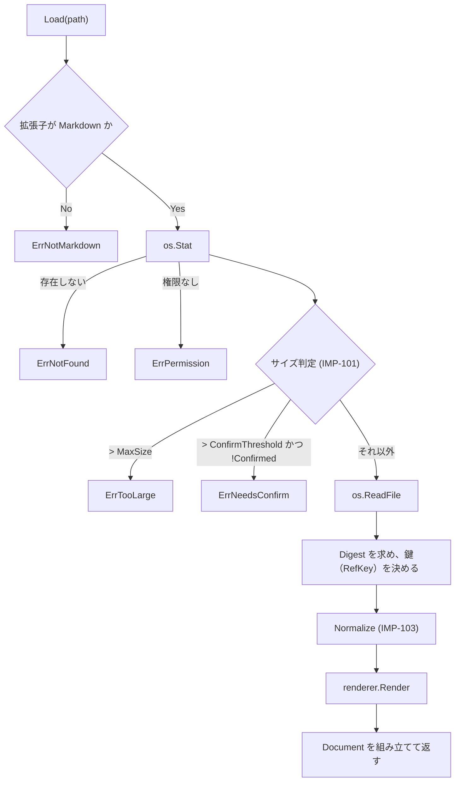

# 11. 実装仕様: Go 側

> 索引: [README](README.md) | 実装仕様: [10](10-impl-overview.md) / **11** / [12](12-impl-frontend.md) / [13](13-impl-interface.md)

本文書は `internal/` 配下の各パッケージと `app.go` の実装仕様を定める。型定義・シグネチャは実装の指針であり、同等の結果が得られる範囲での変更を妨げない（IMP-002）。

> [!NOTE]
> 本文書の節はパッケージの依存順（葉から先）に並べており、ID の番号順とは一致しない。`mdfile`（IMP-105）を先頭に置いているのは、**依存を持たない葉パッケージ**であり `document` / `filetree` / `session` が参照するためである（IMP-012）。

## 11.1 mdfile パッケージ（IMP-105）

責務: Markdown ファイルの拡張子判定。**依存を一切持たない葉パッケージ**であり、`document` / `filetree` / `session` / `app.go` のいずれからも直接参照してよい（IMP-012）。

### IMP-105: 拡張子の判定 **MUST**

```go
package mdfile

// Extensions は FR-010 / FR-031 が定める対象拡張子。
var Extensions = []string{".md", ".markdown", ".mdown", ".mkd"}

// IsMarkdown は拡張子が Markdown のものかを判定する。比較は常に小文字化して行う。
func IsMarkdown(path string) bool
```

この 1 箇所を、ファイルダイアログのフィルタ（FR-010）、ドロップ判定（FR-011）、ツリーのフィルタ（FR-031）、リンク遷移の判定（FR-050）、README の探索（FR-013）のすべてが参照する。定義を分散させない。

> [!NOTE]
> 独立したパッケージとしているのは、`filetree`（IMP-132）と `session`（IMP-193）がこの判定を必要とする一方、IMP-012 が `internal/` 同士の依存を禁じているためである。判定を `document` に置くと両者が `document` を経由して `renderer` に依存し、拡張子を調べるだけのために goldmark と chroma をテストバイナリへ持ち込むことになる。依存を持たない葉パッケージに置くことで、「定義は 1 箇所」（本項）と「内部パッケージ同士を絡ませない」（IMP-012）の双方を満たす。

## 11.2 document パッケージ（IMP-100 系）

責務: Markdown ファイルの読み込み、文字コードの正規化、サイズ判定、`renderer` の呼び出し、結果の組み立て。

### IMP-100: 型定義 **MUST**

```go
package document

// Document は表示対象の 1 文書を表す。
type Document struct {
    Path          string             // 絶対パス（IMP-025）
    Size          int64              // ファイルの実バイト数
    HTML          string             // サニタイズ済みの本文 HTML
    Headings      []renderer.Heading // アウトライン（FR-040）
    LineCount     int                // 総行数（UI-060 の表示に使う）
    NeedsMermaid  bool               // Mermaid の遅延ロード判定（AR-021）
    NeedsKaTeX    bool               // KaTeX の遅延ロード判定（AR-021）
    NeedsPlantUML bool               // PlantUML の遅延ロード判定（AR-021, MD-085）
    Warnings      []Warning          // 描画は継続するが利用者に伝える事象
    Digest        [sha256.Size]byte  // 読み込んだ生バイト列の要約（FR-143 の「把握している内容」）
    RefKey        string             // この描画の目印の鍵（IMP-120）。描画のたびに作り直す
}

// Editable は編集モードを開始できる文書かを返す（FR-140 の表）。
// 不正なバイト列を置き換えた文書は、表示とファイルの内容が一致しないため偽とする。
func (d *Document) Editable() bool

// Warning は FR-110 のうち「描画を継続する」事象を表す。
type Warning struct {
    Kind   WarningKind
    Detail string
}

type WarningKind int

const (
    WarnInvalidEncoding WarningKind = iota // 不正な UTF-8 を置換した（FR-021）
    WarnTruncatedTree                      // ツリーの件数上限に達した（FR-032）
)
```

### IMP-101: サイズ閾値 **MUST**

```go
const (
    // FR-016 の閾値。「10 MB」「50 MB」は 2 進接頭辞（specs/README.md の「単位の表記」）。
    ConfirmThreshold int64 = 10 << 20 // 10 MiB = 10,485,760 バイト
    MaxSize          int64 = 50 << 20 // 50 MiB = 52,428,800 バイト
)
```

利用者への表示は小数第 1 位までの MB 表記（`12.4 MB`）とし、`1 MB = 1024 × 1024` で換算する（DSP-181）。**仕様書全体の約束と同じである**（[README](README.md) の「単位の表記」）。

### IMP-102: 読み込み **MUST**

```go
type LoadOptions struct {
    // Confirmed が true の場合、ConfirmThreshold を超えていても描画する。
    // FR-016 の「Open anyway」と、確認して描画した文書を同じファイルとして
    // 読み直すとき（IMP-192 の currentConfirmed）に渡す。
    Confirmed bool

    // RefKey が空でなく、読んだ生バイト列の要約が ExpectDigest と一致すれば、
    // 新しい鍵を作らずにこの値を使う（IMP-120）。
    // 編集モードの書き込みの直後の読み直しだけが渡す（IMP-195 の 8, FR-143）。
    RefKey       string
    ExpectDigest [sha256.Size]byte // RefKey を使ってよい内容の要約（書き込んだ内容の SHA-256）
}

// Load はファイルを読み込み、変換して Document を返す。
// 返しうるエラー: ErrNotFound / ErrPermission / ErrNotMarkdown /
//                 ErrTooLarge / ErrNeedsConfirm / 変換エラー
func Load(r *renderer.Renderer, path string, opts LoadOptions) (*Document, error)
```

処理順序を以下に固定する。



- **`Digest` は `os.ReadFile` で得た生バイト列（正規化の前）の SHA-256 とする**（FR-143, FR-144）。内容の写しは保持しない。
- **`RefKey` は `crypto/rand` の 8 バイトを 16 進 16 文字にしたものとし、`Load` のたびに作り直して `renderer.Render` へ渡す**（IMP-120）。同じファイルを読み直しても値は変わる。**鍵が変わること自体が「その描画の後に再描画が起きた」ことの印になる**（FR-143 の「指示を作った描画に対してだけ有効」）。
- **例外は `LoadOptions.RefKey` が空でなく、`Digest` が `LoadOptions.ExpectDigest` と一致するときで、その値をそのまま使う。** 編集モードの書き込みの直後の読み直し（IMP-195 の 8）だけが、表示中の文書の鍵と、書き込んだ内容の要約を渡す。**自分の書き込みでは、それより前の描画で作った指示を有効なまま保つ**（FR-143）——作り直すと、続けてクリックした 2 つ目が拒まれる。
  - **要約が一致しなければ、新しい鍵を作る。** 書き込み（IMP-195 の 7）と読み直し（8）の間に外部の書き込みが入ると、読み直した内容は自分の書き込みではない。鍵を引き継ぐと、古い描画で作った指示が `Check`（IMP-109）を通り、`Loaded` が把握している内容を外部の内容で作り直すため要約の照合も通る。**外部で項目が挿入されていれば、別のチェックボックスを書き換える**（FR-143 の「自分の書き込み以外による再描画の後の指示は拒む」）。
  - 要約と鍵は `os.ReadFile` の直後、変換の前に決める（上の図）。
- **`Confirmed` が真でも、`MaxSize` を超えれば `ErrTooLarge` とする。** 同意が効くのは `ConfirmThreshold` だけである（FR-016）。
- `ErrTooLarge` と `ErrNeedsConfirm` は、サイズ情報を添えて返す。呼び出し側が状態画面（UI-052）に表示できるよう、`*SizeError` 型でラップする。

```go
type SizeError struct {
    Path  string
    Size  int64
    Limit int64
    Err   error // ErrTooLarge または ErrNeedsConfirm
}

func (e *SizeError) Error() string { ... }
func (e *SizeError) Unwrap() error { return e.Err }
```

### IMP-103: 文字コードの正規化 **MUST**

FR-021 を実装する。

```go
// Normalize は生バイト列を UTF-8 テキストへ正規化する。
// 戻り値の bool は、不正なバイト列を置換したかどうかを示す。
func Normalize(raw []byte) (text []byte, replaced bool)
```

処理内容は以下の順とする。

1. UTF-8 BOM（`EF BB BF`）を先頭にのみ検出し、除去する。
2. 改行コードを LF に統一する。`CRLF` → `LF`、単独の `CR` → `LF` の順で置換する。
3. `utf8.Valid` が false の場合、`strings.ToValidUTF8` 相当の処理で不正バイトを U+FFFD に置換し、`replaced = true` を返す。
4. UTF-16 の BOM（`FF FE` / `FE FF`）を検出した場合も、変換は行わずそのまま 3 の処理へ進む。結果は文字化けするが、読み込み自体は成功させる（FR-021 の「失敗させない」）。

### IMP-104: 行数の算出 **MUST**

`LineCount` は正規化後のテキストの LF の個数に 1 を加えた値とする。末尾が LF で終わる場合は加算しない。

### IMP-106: 書き換え位置の対応 **MUST**

FR-141 / FR-142 / AR-031 を実装する。**書き換える位置を、ファイルの生バイト列の上で求める。** 配置は `internal/document/edit.go`。

**書き換え処理を置くパッケージは `document` とする。** 位置を求めるには `renderer` と同じ goldmark の構成が要り（IMP-121）、`internal/` 同士の依存で許されているのは `document` → `renderer` だけである（IMP-012）。**`internal/editor` のような新しいパッケージを作らない**——`renderer` を呼べず、構成が 2 か所に複製される。

```go
// RefKind は書き換え対象の種類。
type RefKind int

const (
    RefTask RefKind = iota // タスクリストのチェックボックス（FR-141）
    RefCell                // 表のセル（FR-142）
)

// Ref はフロントエンドから届く書き換え対象の指示を解いたもの（IMP-120 の目印の値）。
type Ref struct {
    Key   string  // 描画の鍵（Document.RefKey と照合する）
    Kind  RefKind
    Index int     // RefTask: 文書の中で何番目のタスクか（0 起点）。RefCell: 何番目の表か
    Row   int     // RefCell: 行（0 が見出し行、1 以降が本体の行。ソース上の順）
    Col   int     // RefCell: 列（0 起点）
}

var (
    ErrBadRef      = errors.New("malformed edit reference")
    ErrRefNotFound = errors.New("edit target not found")
    ErrNotEditable = errors.New("document is not editable")
    ErrChanged     = errors.New("file changed on disk")
)

// ParseRef は data-ref 属性の値（IMP-120）を解く。形が違えば ErrBadRef。
// 書き込みの対象（task / cell）以外の目印（table / mermaid / plantuml。IMP-120）も ErrBadRef とする。
// 数は IMP-116 の正規表現と同じ形（符号なしの 10 進数）だけを受け付け、int に収まらなければ ErrBadRef。
func ParseRef(s string) (Ref, error)

// Patch は生バイト列の 1 か所の置き換え。取り消し（IMP-108）にもそのまま使う。
type Patch struct {
    Offset int    // 生バイト列の上の位置
    Old    []byte // 置き換える前のバイト列
    New    []byte // 置き換えた後のバイト列
}

// Apply は raw に p を適用した新しいバイト列を返す。
// raw[Offset:Offset+len(Old)] が Old と一致しなければ ErrChanged を返す。
func (p Patch) Apply(raw []byte) ([]byte, error)

// Inverse は p を打ち消す Patch を返す（Old と New を入れ替える）。
func (p Patch) Inverse() Patch

// PlanTask は raw の中で ref のチェックボックスを checked にする Patch を返す（FR-141）。
// 既にその状態なら changed は false。
func PlanTask(r *renderer.Renderer, raw []byte, ref Ref, checked bool) (p Patch, changed bool, err error)

// PlanCell は raw の中で ref のセルを text に置き換える Patch を返す（FR-142）。
func PlanCell(r *renderer.Renderer, raw []byte, ref Ref, text string) (p Patch, changed bool, err error)

// CellSource は raw の中の ref のセルのソースを返す（FR-142 の編集欄の初期値）。
func CellSource(r *renderer.Renderer, raw []byte, ref Ref) (string, error)
```

**処理の順序を固定する。**

1. `raw` を IMP-103 と同じ規則で正規化し、**正規化後の位置から生バイト列の位置への対応表**を作る。対応が崩れるのは次の 2 つだけである。
   - 先頭の UTF-8 BOM（3 バイト）の除去
   - `CRLF` と単独の `CR` の `LF` への置き換え（除いた `CR` の位置を昇順に持ち、二分探索で数える）
   
   **不正なバイト列の置き換え（IMP-103 の 3）が起きる場合は `ErrNotEditable` を返す。** 置き換えは長さを変え、位置を対応させられない。FR-140 はこの文書で編集モードを始めさせないが、**書き込みの直前に読み直した内容で改めて確かめる**（その間に外部で壊されうる）。
2. 正規化後のテキストを `r.Locate`（IMP-121）に渡し、ソース上の位置を得る。**`Render` と `Locate` は同じ数え方を共有しており**、`Ref.Index` / `Row` / `Col` は描画時の目印（IMP-120）と一致する。
3. 位置を 1 の対応表で生バイト列へ移し、`Patch` を組み立てる。**生バイト列のそれ以外の部分には触れない**（FR-143 の「1 バイトも変えない」）。

**チェックボックス**（`PlanTask`）

- 置き換えるのは括弧の中の 1 バイトだけとする。`checked` が真なら `x`、偽なら半角空白を書く。
- 現在の文字が `x` / `X` なら「オン」、それ以外（goldmark のタスクの正規表現の `\s` に当たる半角空白・タブ・改ページ）なら「オフ」とみなす。**`X` をオフにすると半角空白になる**（FR-141）。
- 指示された状態と既に同じなら `changed` を偽にする。**反転ではなく「この状態にする」で受け取る**のは、同じ指示が 2 度届いても元へ戻らないようにするためである。
- **求めた位置の前後が `[` と `]` であり、中の 1 バイトが半角空白・タブ・改ページ・`x`・`X` のいずれかであることを確かめる。** 違えば `Patch` を返さず `ErrNotEditable` とする。位置の求め方（IMP-121）が構文木と食い違ったときに、別のバイトを書き換えないための防御である（リストの字下げにタブを含むと、goldmark は字下げを桁に換算して扱うため、行の中の位置の数え方がずれうる）。

**セル**（`PlanCell`）

- 入力は次の順で整える。
  1. 改行（`\r\n` / `\r` / `\n`）を半角空白 1 つへ置き換える（FR-142）。
  2. 前後の空白を除く。
  3. **直前の 1 文字が `\` でない `|`** を `\|` にする。**`\` の個数は数えない**——goldmark v1.8.5 の表の解析は、`|` の直前の 1 文字だけを見て区切りかどうかを決める（`extension/table.go`）。`\` を数えて「偶数ならエスケープされていない」とすると、パーサと食い違う。
  4. **新しい内容が `\` で終わり、セルの内容の直後が区切りの `|`（間に空白が無い）なら、内容の末尾に半角空白を 1 つ足す。** そのままでは `\` が区切りの `|` をエスケープし、隣のセルと結合して表の形が変わる。空白があれば何も足さない。
- 置き換える範囲はセルの**内容**（前後の空白を除いた範囲。IMP-121 の `Content`）とする。区切りの `|` と、その内側の前後の空白は残す（FR-142）。
- **空のセルに書き込むときは、区切りの間の空白（`Between`）の 1 文字目の直後へ入れる。** 空白が無ければ前の区切りの直後へ入れる。`|  |` は `| x |` になり、区切りの間の空白の数は変わらない。
- 整えた結果が元の内容と同じなら `changed` を偽にする（FR-142 の「内容が変わっていなければ書き込まない」）。
- **組み立てた `Patch` を適用した生バイト列を、1 と同じ規則で正規化してから `r.Locate` で解き直し**、次のすべてを確かめる。どれかが違えば `Patch` を返さず `ErrNotEditable` とする（書き込まない。IMP-195 が `edit-failed` で通知する）。**エスケープの規則はパーサの実装に依存し、手で書いた規則だけでは形が変わらないことを保証できない**（4.43.0 で、`\` の個数を数える規則が goldmark と食い違っていた）。
  - 文書の中の表の数とタスクの数が変わらない（**見出し行の書き換えで表として解析されなくなると、後ろの表とセルの番号がずれる**）
  - その表の行数と、各行のセルの数が変わらない
  - 書き換えたセル以外のセルについて、`Content` の区間が指すバイト列が変わらない（**区間の位置そのものは、書き換えたセルより後ろでずれる。** 比べるのは位置ではなく中身である）
  - 書き換えたセルの `Content` の区間が指すバイト列が、整えた文字列（4 で足した空白を除く）と一致する
- 表の番号・行・列が文書の範囲を超える場合は `ErrRefNotFound` とする。panic しない。
- **ソース上に存在しないセル**（IMP-121 で `nil`）は `ErrRefNotFound` とする（FR-142）。

> [!IMPORTANT]
> **位置は書き込みのたびに、その時点のファイルの内容から求め直す。** 描画時に求めた位置を持ち回らない。**続けて編集すると前の書き込みで後ろのセルの位置がずれる**（FR-143）。`Ref` が持つのは「何番目か」だけであり、構造を変えない編集（[2.14](02-functional.md) の IMPORTANT）では何番目かは変わらない（上のセルの確かめが、それを書き込みのたびに保証する）。

### IMP-107: 置き換えによる書き込み **MUST**

FR-143 / NFR-031 / NFR-033 を実装する。配置は `internal/document/write.go`。

```go
// Replace は path の実体を data で置き換える。
// 返しうるエラー: ErrNotFound / ErrPermission / 書き込み時のエラー
func Replace(path string, data []byte) error
```

処理の順序を固定する。**どこで失敗しても、元のファイルは変わらず、一時ファイルは残らない。**

| # | 処理 | 失敗したとき |
| --- | --- | --- |
| 1 | `filepath.EvalSymlinks(path)` で実体のパスを得る。以降はすべて実体に対して行う | `ErrNotFound` |
| 2 | `os.Stat` で権限ビットを控える | `ErrNotFound` |
| 3 | **`os.OpenFile(実体, os.O_WRONLY, 0)` で開けるかを確かめ、すぐ閉じる**（切り詰めない） | `ErrPermission` |
| 4 | `os.CreateTemp(filepath.Dir(実体), "." + ベース名 + ".markview-*.tmp")` | `ErrPermission`（ディレクトリに書けない） |
| 5 | 一時ファイルへ `data` を書き、`Sync` して閉じる | 一時ファイルを消して返す |
| 6 | Windows 以外では、一時ファイルの権限ビットを 2 で控えた値にする（`Chmod`） | 一時ファイルを消して返す |
| 7 | `os.Rename(一時ファイル, 実体)` | 一時ファイルを消して返す |

- **表の番兵は、その段階の既定である。** どの段階でも、失敗の原因が「存在しない」（`fs.ErrNotExist`）なら `ErrNotFound`、「権限が無い」（`fs.ErrPermission`）なら `ErrPermission` とし、それ以外は表の番兵で包む（4.67.0）。**1 で上位のディレクトリを辿れない場合も `ErrPermission` になる**——`ErrNotFound` にすると、利用者への通知（FR-143）が実態と違う。IMP-102 の `classifyError` と同じ分け方である。実体が通常のファイルでなければ `ErrNotFound` とする。
- **3 を省かない。** ディレクトリに書き込めればリネームは成功するため、**読み取り専用のファイルを置き換えてしまう**（FR-143 の「元のファイルが書き込み可能でなければ置き換えない」）。Windows でも、読み取り専用属性とアクセス制御の両方をこの 1 回で確かめられる。
- **一時ファイルの名前を `.` で始める。** ファイルツリーは `.` で始まる名前を出さない（FR-031）。書き込みの途中でツリーを読み直しても現れない。
- **一時ファイルを実体と同じディレクトリに置く。** 別のボリュームへのリネームは置き換えにならない（コピーと削除になり、途中の状態が残りうる）。`%TEMP%` に置かない（NFR-033 の例外の範囲。FR-143）。
- **リンクそのものを置き換えない。** 1 で実体を得てから 7 で実体へリネームするため、シンボリックリンクは残る（FR-143）。
- 監視（IMP-141）は実体のディレクトリを見ており、リネームは `Rename` / `Create` として届く。IMP-142 が 150 ms 後に存在を確かめて `Modified` にするため、**削除とは誤認しない**（FR-140 の「保存に伴う一時的な削除」）。
- ハードリンクが切れること、Windows でファイル個別に設定したアクセス制御が引き継がれないことは許容する（FR-143）。

### IMP-108: 取り消し履歴 **MUST**

FR-144 を実装する。配置は `internal/document/editlog.go`。**ファイルに触れない純粋なデータ構造**とし、単体テストでファイルを要さない。

```go
const MaxUndo = 100 // FR-144

// EditLog は編集モードの 1 回分の書き込みの記録。編集モードを始めたときに作り、
// 終えたときに捨てる（FR-140）。
type EditLog struct {
    known [sha256.Size]byte // 把握している内容の要約（FR-143）
    undo  []Patch           // 古い順。末尾が直前の書き込み
    redo  []Patch           // 取り消した書き込み。末尾が直前に取り消したもの
}

func NewEditLog(known [sha256.Size]byte) *EditLog

// Known は把握している内容の要約を返す。
func (l *EditLog) Known() [sha256.Size]byte

// Record は書き込みを記録する。known を after にし、redo を捨て、undo が MaxUndo を超えたら先頭を捨てる。
func (l *EditLog) Record(p Patch, after [sha256.Size]byte)

// Undo は取り消しに使う Patch（直前の書き込みの Inverse）を返す。無ければ ok は偽。
// 返しただけでは履歴を動かさない。書き込みに成功してから CommitUndo を呼ぶ。
// CommitUndo は known を after にし、undo の末尾を redo へ移す。
func (l *EditLog) Undo() (p Patch, ok bool)
func (l *EditLog) CommitUndo(after [sha256.Size]byte)

// Redo / CommitRedo は Undo / CommitUndo の逆向き。
func (l *EditLog) Redo() (p Patch, ok bool)
func (l *EditLog) CommitRedo(after [sha256.Size]byte)
```

- **履歴に文書全体の写しを持たない。** `Patch` は書き換えた箇所の前後の文字列だけを持ち、内容の一致は要約で確かめる（FR-144, NFR-020）。50 MB の文書でも、1 回の記録はセルの文字列程度の大きさで済む。
- **「取り出す」と「確定する」を分ける。** 書き込みに失敗した取り消しで履歴が動くと、次の `Ctrl+Z` が 1 つ先を取り消してしまう。
- `Undo` が返す `Patch` を適用できるのは、ファイルの内容が `Known()` と一致しているときだけである。**位置（`Offset`）は直前の書き込みの後の内容に対するもの**であり、他者の変更の上に適用すると別の箇所を壊す。一致を確かめるのは呼び出し側（IMP-109 の `Plan`）である。

### IMP-109: 編集モードの判断 **MUST**

FR-140〜FR-144 / NFR-030 を実装する。配置は `internal/document/editsession.go`。

**編集モードの状態と、書き込んでよいかの判断をすべてここに置く。** ファイルにも Wails にも触れず、錠も持たない。**バインドメソッドの側（IMP-195）は、錠を取り、ファイルを読み書きし、イベントを送るだけにする。** 判断を `desktop` に置くと単体テストの対象外になり（UT-002, IMP-012）、**書き込みの安全性を担う部分が検証されない。**

```go
// ErrStale は、指示を作った描画の後に再描画が起きていたことを表す（FR-143）。通知しない。
var ErrStale = errors.New("edit instruction is stale")

// OpKind は書き込みの種類。
type OpKind int

const (
    OpTask OpKind = iota // SetTask（FR-141）
    OpCell               // SetCell（FR-142）
    OpUndo               // UndoEdit（FR-144）
    OpRedo               // RedoEdit（FR-144）
)

// Op はフロントエンドから届いた 1 回の書き込みの指示。
type Op struct {
    Kind    OpKind
    Ref     string // OpTask / OpCell: data-ref の値そのもの（IMP-316）
    Checked bool   // OpTask
    Text    string // OpCell
}

// EditSession は編集モードの状態（FR-140）。ゼロ値は「編集モードでない」。
type EditSession struct {
    on      bool
    removed bool     // 監視が表示中のファイルの削除を送った。次に読み込めたら偽に戻す
    log     *EditLog // on の間だけ非 nil（IMP-108）
    seq     uint64   // 状態を変えうる呼び出しのたびに増やす（IMP-302 の EditSeq）
}

func (s *EditSession) On() bool
func (s *EditSession) Seq() uint64

// CanStart は doc で編集モードを始められるかを返す（DocumentDTO.Editable）。
// showing は、画面が doc を表示していること（状態画面・文書未表示でない。IMP-190 の showing）。
func (s *EditSession) CanStart(doc *Document, showing bool) bool

// Start は CanStart が真なら編集モードを始めて真を返す。偽なら何も変えない。
func (s *EditSession) Start(doc *Document, showing bool) bool

// Stop は編集モードを終え、履歴を捨てる。
func (s *EditSession) Stop()

// Loaded は文書を開く処理（IMP-192）で読み込みに成功したときに呼ぶ。same は SameDocument。
func (s *EditSession) Loaded(doc *Document, same bool)

// Left は状態画面を出したときに呼ぶ（文書の切り替えとして終える。IMP-192）。
func (s *EditSession) Left()

// Removed は監視が表示中のファイルの削除を送ったときに呼ぶ（IMP-195, IMP-320）。
func (s *EditSession) Removed()

// Deleted は削除の印が立っているか（Removed の後、まだ読み込めていないか）を返す（IMP-192）。
func (s *EditSession) Deleted() bool

// Discard は取り消し・やり直しの履歴だけを捨てる。把握している内容（Known）は変えない（IMP-195 の 4）。
func (s *EditSession) Discard()

// Check は、指示がいまの描画に対して有効かを確かめる（IMP-195 の 1, 2）。ファイルを読む前に呼ぶ。
func (s *EditSession) Check(doc *Document, showing bool, op Op) error

// Plan は読んだ生バイト列 raw に対する Patch を作る（IMP-195 の 4, 5）。
func (s *EditSession) Plan(r *renderer.Renderer, raw []byte, op Op) (p Patch, changed bool, err error)

// Commit は書き込みに成功した後に呼び、履歴を確定する（IMP-195 の 7）。after は書き込んだ内容。
func (s *EditSession) Commit(op Op, p Patch, after []byte)

// CellSource は raw の中の ref のセルのソースを返す（GetCellSource。IMP-195）。
func (s *EditSession) CellSource(r *renderer.Renderer, raw []byte, ref string) (string, error)
```

**開始できる条件**（`CanStart`。FR-140 の表）

次のすべてを満たすときだけ真とする。`doc` が nil でない、`showing` が真、`doc.Editable()` が真、`removed` が偽。**`Start` はこの関数だけで判断する**——`DocumentDTO.Editable` とボタンの淡色（UI-021）と、開始の可否を 1 つの式に揃える。

**読み込みの後の扱い**（`Loaded` / `Left`。FR-140, FR-144）

| 呼び出し | 条件 | 編集モード | 取り消し履歴 |
| --- | --- | --- | --- |
| `Loaded` | `on` が偽 | 変えない（始めない） | —（持っていない） |
| `Left` | 状態画面を出した（文書の切り替え） | **終える** | 捨てる |
| `Loaded` | `same` が偽（文書の切り替え） | **終える** | 捨てる |
| `Loaded` | `same` が真で、`doc.Editable()` が偽（読み直したら不正なバイト列を含んでいた） | **終える** | 捨てる |
| `Loaded` | `same` が真で、`doc.Digest` が `log.Known()` と一致しない | 保つ | **捨てて、新しい `Digest` で作り直す**（外部で変更された。FR-144） |
| `Loaded` | `same` が真で、一致する | 保つ | 保つ |

- 表は上から順に当てはめる。
- `Loaded` は `removed` を偽に戻す（読み込めた以上、ファイルはある）。`Left` は戻さない。
- `Start` は編集モードを始めるとき、`NewEditLog(doc.Digest)` で履歴を作る（IMP-108）。
- **表示を変えない失敗**（`not-found` など。IMP-192 の `target` の表）では、どちらも呼ばない。

**書き込みの判断**（`Check` / `Plan`）

| # | 確かめること | 当てはまらないとき |
| --- | --- | --- |
| 1 | `on` が真、`doc` が nil でない、`showing` が真 | `ErrStale` |
| 2 | `OpTask` / `OpCell` なら、`ParseRef` で解け、**`Ref.Key` が `doc.RefKey` と一致し、`Ref.Kind` が `Op.Kind` と一致する**（取り消し・やり直しは鍵を持たないため省く） | `ErrStale`——指示を作った描画の後に、文書の切り替えか、自分の書き込み以外による再描画が起きている（FR-143）。**種類が食い違う指示（セルの目印でタスクを書き換える）も拒む** |
| 4 | **`raw` の SHA-256 が `log.Known()` と一致する** | `ErrChanged`（書き込まない。FR-143） |
| 5 | `OpTask` は `PlanTask`、`OpCell` は `PlanCell`、`OpUndo` は `log.Undo()`、`OpRedo` は `log.Redo()` | `ErrBadRef` / `ErrRefNotFound` は `ErrStale`。**`ErrNotEditable` はそのまま返す**（IMP-195 が `edit-failed` で通知する。表の形の確かめ（IMP-106）で拒んだ場合など）。変わらない・履歴が空なら `changed` が偽 |

- 番号は IMP-195 の手順の番号と揃えている（3 のファイルの読み込みは IMP-195 が行う）。
- **`Commit` は、`OpTask` / `OpCell` なら `log.Record`、`OpUndo` なら `log.CommitUndo`、`OpRedo` なら `log.CommitRedo` を、`after` の SHA-256 で呼ぶ。** 書き込みに失敗したときは呼ばない（IMP-108 の「取り出す」と「確定する」を分ける）。
- **5 で `ErrNotEditable` を `ErrStale` にしない。** 形の確かめで拒んだのは、エスケープの規則が働かなかった場合であり、古い指示ではない。黙って戻すと、**確定した入力が通知も無く消える**（FR-142, FR-110）。
- `CellSource` は 4 と同じ確かめを行い（一致しなければ `ErrChanged`）、`document.CellSource` の結果を返す。`ErrBadRef` / `ErrRefNotFound` / `ErrNotEditable` は `ErrStale` とする（編集欄が開かないだけで済み、書き込みではないため通知しない）。呼ぶ前に `Check`（`OpCell`）を通す。
- **`seq` は、`Stop` / `Loaded` / `Left` / `Removed` のたびと、`Start` が編集モードを始めたとき（偽を返した `Start` と、既に編集モードの間の `Start` を除く）に 1 増やす。** フロントエンドは、先に届いた新しい値を後から届いた古い値で上書きしない（IMP-260）。
- **`Removed` は編集モードを終え、履歴を捨て、削除の印を立てる**（FR-140 の表の「削除された」）。
- **`Discard` は `seq` を増やさない**（編集モードの状態を変えない）。**把握している内容を作り直さない**——作り直すと、読み直しに失敗して描画が古いまま（鍵も古いまま）なのに、次の書き込みが 4 を通ってしまう。次に読み込めたときに `Loaded` が作り直す。
- **既に編集モードの間に `Start` を呼んでも、何も変えずに真を返す**（履歴を保つ。ボタンの二重押しで履歴が消えないようにする）。

## 11.3 renderer パッケージ（IMP-110 系）

責務: goldmark パイプラインの構築と実行。Markdown → サニタイズ済み HTML への変換と、見出しの抽出。

### IMP-110: 型定義 **MUST**

```go
package renderer

type Heading struct {
    Level int    `json:"level"` // 1..6
    Text  string `json:"text"`  // インライン記法を除去したプレーンテキスト
    ID    string `json:"id"`    // 見出しの id 属性の値。user-content- 付き（MD-021, AR-053）
}

type Result struct {
    HTML          string
    Headings      []Heading
    NeedsMermaid  bool
    NeedsKaTeX    bool
    NeedsPlantUML bool // AR-021, MD-085
}

type Renderer struct {
    md       goldmark.Markdown
    policy   *bluemonday.Policy
}

func New() *Renderer

// Render は Markdown を変換する。baseDir は相対パス解決の基準ディレクトリ
// （表示中ファイルのディレクトリ。AR-042）。refKey は目印の鍵（IMP-120）。
// 空文字なら目印を付けない。
func (r *Renderer) Render(source []byte, baseDir, refKey string) (Result, error)

// Locate は変換を行わずに構文木だけを作り、書き換え位置を返す（IMP-121）。
func (r *Renderer) Locate(source []byte) (Locations, error)
```

- `Renderer` は状態を持たず、複数のゴルーチンから同時に `Render` / `Locate` を呼べる（IMP-024）。
- **`refKey` を空にできるのはテストのためである。** ゴールデンテスト（IMP-041）は固定の鍵を渡して目印も含めて比べ、目印を見ないテストは空文字を渡す。**アプリケーションは必ず鍵を渡す**（IMP-102）。鍵を渡さないと、並べ替え（FR-130）とリンクのコピー（FR-063）も働かない。
- **`Render` を呼ぶのは `internal/document`（IMP-102）と、描画スモークテストの `scripts/smoke`（BR-054）である。** 引数を足すときは両方を直す。**描画スモークテストも、アプリと同じく実行のたびに作った鍵を渡す**——目印の照合（BR-054）を検査するためである。
- `Render` 内でパニックが発生した場合は `recover` し、エラーとして返す（IMP-022）。

### IMP-111: goldmark の構成 **MUST**

```go
goldmark.New(
    goldmark.WithExtensions(
        // GFM の内訳を個別に登録する。表の桁揃えを style 属性ではなく align 属性で
        // 出させ、出力から style を一掃するため（MD-024, MD-072, IMP-116）。
        extension.NewTable(
            extension.WithTableCellAlignMethod(extension.TableCellAlignAttribute),
        ),
        extension.Strikethrough, // 打消し線（MD-024）
        extension.TaskList,      // タスクリスト（MD-022）
        extension.Linkify,       // 裸の URL の自動リンク（MD-070）
        extension.NewFootnote(  // 脚注（MD-050）。戻りリンクの記号を指定する
            extension.WithFootnoteBacklinkHTML("&#x21a9;"),
            extension.WithFootnoteIDPrefix("user-content-"), // AR-053
        ),
        emoji.Emoji,            // 絵文字ショートコード（MD-051）
        meta.Meta,              // Front Matter（MD-073）
        alertExtension{},       // GitHub Alerts（IMP-112）
        mathExtension{},        // 数式の保護（IMP-113）
        mermaidExtension{},     // Mermaid ブロックの取り出し（IMP-115）
        plantUMLExtension{},    // PlantUML ブロックの取り出し（IMP-119）
        refExtension{},         // 編集・並べ替え・リンクの目印（IMP-120）
        // ハイライトは数式・Mermaid・PlantUML より後に置く（下記）
        highlighting.NewHighlighting(...), // IMP-114
    ),
    goldmark.WithParserOptions(
        // parser.WithAutoHeadingID() は使用しない（理由は後述）。
        parser.WithASTTransformers(
            util.Prioritized(headingTransformer{}, 100), // 見出し ID と一覧（IMP-117）
            util.Prioritized(imageTransformer{}, 95),    // 画像 URL の書き換え（IMP-118）
            util.Prioritized(rawHTMLTransformer{}, 90),  // 生 HTML の有無。サニタイズの後処理を省いてよいかの判断（IMP-116）
        ),
    ),
    goldmark.WithRendererOptions(
        html.WithUnsafe(),      // 生 HTML を通し、後段の bluemonday で除去する
        // インデント形式のコードブロックもラッパで包む（IMP-115）。
        // 既定の描画器（優先度 1000）より小さい値で上書きする
        gmrenderer.WithNodeRenderers( // goldmark の renderer パッケージ
            util.Prioritized(codeBlockRenderer{}, 500),
        ),
    ),
)
```

- **ハイライト（IMP-114）は、数式（IMP-113）・Mermaid（IMP-115）・PlantUML（IMP-119）の拡張より後に登録する。** これらは先に専用のノードへ差し替わり、chroma に渡らない。先に登録すると、`mermaid` や `plantuml` のフェンスがハイライト済みのコードブロックとして出力される（v1.0.0 の `renderer.go` と同じ並び）。
- **`html.WithUnsafe()` を有効にする。** 生 HTML を goldmark 段階で落とすと、`<details>` 等の許可要素（MD-072）まで失われるため。安全性の担保は後段のサニタイズ（IMP-116）に一元化する。この 2 つは必ず対で実装する。
- **見出し ID は goldmark の `WithAutoHeadingID` を使わない。** GitHub 互換のスラッグ規則（MD-021）と生成結果が異なるため、独自の AST 変換で付与する（IMP-117）。上のコードブロックが `parser.WithASTTransformers` を渡しているのはこのためであり、`WithAutoHeadingID` を併用してはならない（後から付与される ID に上書きされる）。
- **脚注の id には `extension.WithFootnoteIDPrefix("user-content-")` で接頭辞を付ける**（MD-050, AR-053）。goldmark はこの値を `id` 属性とリンクの `href`（`#user-content-fn:1`）の両方に付ける。フロントエンドは接頭辞付きのフラグメントもそのまま探せる（IMP-223）。
- **脚注の戻りリンクは `extension.NewFootnote(extension.WithFootnoteBacklinkHTML("&#x21a9;"))` で指定する。** goldmark の既定は `&#x21a9;&#xfe0e;` で、異体字セレクタにより白黒の記号として描かれる。GitHub はセレクタを付けないため見た目が変わる（MD-050, MD-002）。
- TOML の Front Matter（`+++`）は `meta.Meta` が扱わないため、`Render` の前段で文字列として除去する。

### IMP-112: GitHub Alerts 拡張 **MUST**

MD-040 を実装する。goldmark の `ASTTransformer` として実装する。

```go
type alertKind int

const (
    alertNote alertKind = iota
    alertTip
    alertImportant
    alertWarning
    alertCaution
)

// alertTransformer は Blockquote の最初の Paragraph の先頭テキストが
// "[!NOTE]" 形式であれば、Blockquote を Alert ノードへ差し替える。
type alertTransformer struct{}

func (t *alertTransformer) Transform(doc *ast.Document, reader text.Reader, pc parser.Context)
```

判定規則:

1. `ast.Blockquote` の最初の子が `ast.Paragraph` であること。
2. その先頭行が `[!` で始まり `]` で終わること。大文字小文字は区別しない。
3. 括弧内が 5 種のいずれかに一致すること。一致しない場合は変換せず、通常の引用として残す（MD-040）。
4. 一致した場合、その行を Blockquote から取り除き、Alert 種別を属性として保持する。

出力する HTML の構造は以下に固定する。

```html
<div class="markdown-alert markdown-alert-warning">
  <p class="markdown-alert-title">Warning</p>
  <p>本文…</p>
</div>
```

- 種別は `markdown-alert-<種別小文字>` のクラスで示す（`note` / `tip` / `important` / `warning` / `caution`）。
- ラベル（`Note` 等）は Go 側が出力する。英語表記に固定する（MD-040）。
- **アイコンは Go 側で出力しない。** サニタイズ（MD-072）は `svg` 要素を除去対象としており、Go 側が出力したインライン SVG は必ず落ちる。アイコンはフロントエンドが後処理で付与する（IMP-220 の 3'、DSP-260）。
- サニタイズの許可クラスに `markdown-alert` の接頭辞を含める（IMP-116）。

> [!IMPORTANT]
> 「アイコンは SVG で表示する」（MD-040）と「生 HTML の `svg` は除去する」（MD-072）は、Go 側で SVG を出力しようとすると衝突する。アイコンの付与をフロントエンドに寄せることで、サニタイズの許可リストを緩めずに両立させる。**サニタイズの許可リストに `svg` を追加して解決してはならない。**

### IMP-113: 数式の保護 **MUST**

MD-060 を実装する。KaTeX は**フロントエンドで実行する**（AR-031）ため、Go 側の役割は「数式部分を Markdown の他の記法から保護し、フロントエンドが識別できる形で出力する」ことに限る。

```go
// mathExtension は $...$ / $$...$$ / ```math を検出し、
// 内容をエスケープした上で <span class="math-inline"> /
// <div class="math-block"> として出力する。
type mathExtension struct{}
```

- 数式の中身は Markdown として解釈させない。`_` や `*` が強調として処理されることを防ぐため、インラインパーサの段階でテキストノードとして取り込む。
- `$` の判定は GitHub の規則に従う（MD-060）。開始の `$` の直後が空白の場合、および終了の `$` の直前が空白の場合は数式としない。これにより `$100 と $200` が数式にならない。
- コードブロック・インラインコードの内部は対象外とする。goldmark のインラインパーサはコードスパンを先に処理するため、優先度を適切に設定すれば自然に満たされる。
- 数式ノードを 1 つ以上出力した場合、`Result.NeedsKaTeX = true` とする。

### IMP-114: シンタックスハイライト **MUST**

MD-030 を実装する。

```go
highlighting.NewHighlighting(
    highlighting.WithFormatOptions(
        chromahtml.WithClasses(true),   // 重要（後述）
        chromahtml.WithLineNumbers(false), // 行番号なし（MD-032）
    ),
    highlighting.WithWrapperRenderer(codeBlockWrapper), // IMP-115
)
```

- **`WithClasses(true)` を必ず指定し、インラインスタイルを出力させない。** chroma がインラインの `style` 属性で色を書き込むと、テーマ切り替え（FR-070）のたびに Markdown の再変換が必要になり、「ちらつきなく即座に切り替える」（UI-105）が満たせなくなる。クラス名のみを出力し、配色は CSS 側で Light / Dark を切り替える（DSP-250）。
- 配色 CSS は**あらかじめ生成して `frontend/css/chroma.css` に置く**（`go run ./scripts/genchroma`）。ビルド時に作らず、実行時にも chroma のスタイルを走査しない。
- **生成に使うのはクラス名だけとし、色は DSP-013 の表から与える。** chroma 同梱の `github` / `github-dark` は 2015 年ごろの GitHub の配色（キーワードが黒の太字、文字列が `#dd1144`）であり、DSP-013 が定める現在の Primer の配色とは別物である。色までそちらから採ると MD-002 の「GitHub と並べて比較する」が成り立たない。一方でクラス名を手で並べると chroma が型を増やしたときに取りこぼすため、`chroma.StandardTypes` を走査し、系統（`Keyword` / `LiteralString` / `LiteralNumber` / `Comment` など）ごとにまとめて色を与える。DSP-013 の表に無い系統には色を与えない。
- **`WithLineNumbers(false)` だけでは足りない。** goldmark-highlighting は info string の属性（```` ```go {linenos=table} ````）から行番号を有効にできる。文書側から MD-032 を破れてしまうため、`WithCodeBlockOptions` で `WithLineNumbers(false)` を返し、属性由来の設定を打ち消す（属性より後に適用される）。
- 登録する言語は MD-031 の一覧に限定してよい（AR-033）。限定する場合、`lexers.Get` が nil を返した言語はハイライトなしで出力する。
- 言語名のエイリアス解決は chroma の機能に委ねる。

### IMP-115: コードブロックのラッパと Mermaid **MUST**

FR-060 / MD-080 を実装する。すべてのコードブロックを共通のラッパで包み、フロントエンドがコピーボタンと Mermaid 描画の対象を識別できるようにする。

出力する構造:

```html
<div class="code-block" data-lang="go">
  <pre class="chroma"><code>…ハイライト済み…</code></pre>
</div>

<div class="code-block" data-lang="mermaid" data-mermaid="1"
     data-ref="0123456789abcdef:mermaid:0"
     data-source="graph TD&#10;  A--&gt;B">
  <pre class="mermaid-source">graph TD
  A--&gt;B</pre>
</div>
```

- **Mermaid ブロックにのみ `data-source` 属性を付け、原文を重複して持たせる。** Mermaid は描画後に `<pre>` が SVG へ置き換わり、DOM から原文が失われる。これがないと、描画後にコピーボタン（FR-060）がソースを取得できず、テーマ切り替え時の再描画（IMP-231）もできない。
- `data-source` の値は HTML 属性としてエスケープする（改行は `&#10;`）。Base64 等の追加のエンコードは行わない。デバッグ時に目視できる形を保つため。ただし最後段のサニタイズ（IMP-116）が数値文字参照を実体へ戻すため、**最終的な出力では改行がそのまま現れる**。要求は「値として改行が保たれること」であり、表記の形ではない。
- **Mermaid ブロックには目印 `data-ref="<鍵>:mermaid:<n>"` を付ける**（IMP-120, NFR-030）。n は文書の中の Mermaid ブロックの出現順（0 起点。描画に失敗するものも数える。FR-120 の「同じ対象」と同じ数え方）。**フロントエンドは鍵の合うブロックだけを描画し、鍵の合うブロックの `data-source` だけを使う**（IMP-230, IMP-221）。生 HTML で `class="code-block"` と `data-mermaid` と `data-source` を書けば同じ形を作れる（サニタイズは形しか見られない。IMP-116）。**目印で見分けないと、Go 側を経ていない図が描かれ、見えている内容と違う原文がコピーされる**（[BUG-014](../bugs/2026-09-14-bug-014-diagram-marker-spoofing.md)）。鍵が空なら付けない（IMP-110）。
- 通常のコードブロックには `data-source` も目印も付けない。原文は `pre code` の `textContent` から取得できる（IMP-221）。**コピーされるのは見えている文字列そのもの**であり、偽装の余地が無い。
- ラッパが出すのは `<div class="code-block">` だけであり、内側の `<pre>` / `<code>` は chroma が出力する。ハイライトできない場合（言語指定なし・未知の言語）は chroma を通らないため、ラッパ側で `<pre><code>` を補う。`chroma` クラスが付くのは `<pre>` であり、ハイライトされたブロックに限る。
- `mermaid` ブロックを 1 つ以上出力した場合、`Result.NeedsMermaid = true` とする。
- `math` 言語のコードブロックは Mermaid ではなく数式として扱う（IMP-113）。
- `plantuml` / `puml` 言語のコードブロックは PlantUML として扱う（IMP-119）。ラッパの形は同じであり、属性だけが違う。

### IMP-116: サニタイズ **MUST**

MD-072 を実装する。変換パイプラインの最後段に固定で置き、迂回経路を作らない（AR-031）。

```go
// Policy は MD-072 の許可リストを実装した bluemonday ポリシーを返す。
func Policy() *bluemonday.Policy
```

ポリシーの要点:

- 許可要素は MD-072 の一覧をハードコードする。設定で緩められるようにしない。
- `img` には `src` / `alt` / `title` / `width` / `height` を許可する。`src` は `http`, `https`, および内部アセットサーバのパス（`/__local/`）のみ許可する。
- `abbr` には `title` を許可する。これがないと許可要素として意味を持たない。
- `a` には `href` / `title` を許可する。`href` は `http`, `https`, `mailto`, 相対パス、`#` アンカーのみ許可する。`javascript:` 等は除去する。
- `class` 属性は `a` / `p` / `div` / `span` / `pre` / `code` / `ol` / `li` / `sup` に許可する。**値は、次の語を空白で区切って並べたものだけを通す**（語の完全一致。接頭辞で許可しない）。**「など」で濁さず、自前で出力するものをすべて列挙する。** 任意のクラス名を通さない。
  - `code-block` / `mermaid-source` / `plantuml-source`（IMP-115, IMP-119）
  - `markdown-alert` / `markdown-alert-title` / `markdown-alert-note` / `markdown-alert-tip` / `markdown-alert-important` / `markdown-alert-warning` / `markdown-alert-caution`（IMP-112）
  - `math-inline` / `math-block`（IMP-113）
  - `footnotes` / `footnote-ref` / `footnote-backref`（goldmark の脚注。MD-050）
  - chroma のクラス（`chroma` とトークンクラス。下記）
- `div` の `data-lang` / `data-mermaid` / **`data-plantuml`** / **`data-puml-error`** / `data-source` / `data-ref`（図のブロックの目印。下記）と、`id`（見出しアンカーと脚注）を許可する。**PlantUML の 2 つを落とすと、描画対象と拒んだブロックがフロントエンドから見えなくなる**（IMP-119, IMP-233）。
- 表の桁揃えのため `th` / `td` の `align`（`left` / `center` / `right`）を許可する。goldmark に align 属性で出力させることで、`style` 属性を許可せずに MD-024 を満たす（IMP-111）。
- タスクリスト（MD-022）のため `input` の `type="checkbox"` / `checked` / `disabled` を許可する。MD-072 の許可要素に `input` はないが、これがないとタスクリストが描画されない。**bluemonday では属性を許可した要素が許可要素になる**ため、要素の一覧には足さない。**`disabled` は編集モードでも出力し続ける。** 外すのはフロントエンドであり、目印（IMP-120）の鍵が合う要素に限る（IMP-261）。
- **生 HTML の `id` 属性は、サニタイズの後に `user-content-` を前に付けた値へ書き換える**（MD-072, AR-053）。既に `user-content-` で始まる値には付けない。**書き換えは下の `input` の後処理と同じ 1 回の走査で行い**、`id` 属性を持つ**開始タグと自己終了タグ（`StartTagToken` / `SelfClosingTagToken`）**だけを組み立て直す（トークンの種類、つまり末尾の `/>` の有無は保つ）。それ以外のトークンは `Raw()` のバイト列をそのまま書く。**bluemonday は `<div id="x"/>` を自己終了タグのまま出力し、ブラウザはこれを開始タグとして扱う**（bluemonday v1.0.27 の `sanitize.go`）。開始タグだけを見ると、接頭辞の無い `id` が本文に残る。**見出しと脚注の id は、出力の時点で接頭辞が付いている**（IMP-117, IMP-111）ため、この走査では変わらない。
  - **文書に生 HTML が 1 つも無い（構文木に `HTMLBlock` / `RawHTML` が無い）なら、この走査を省いてよい**（NFR-011）。生 HTML が無ければ、出力の `id` と `input` はすべて自分で出したものである。
- **`type="checkbox"` を持たない `input` を残さない。** bluemonday は、許可した属性が 1 つでも残れば要素を残す。**`<input disabled>` や `<input data-ref="…">` と書くと、`type` が落ちて文字の入力欄として本文に出る**（`type` の既定は `text`。bluemonday v1.0.27 で確認）。**属性指定だけでは例外を閉じ込められない。** サニタイズの後に `golang.org/x/net/html` のトークナイザで `input` の開始タグと自己終了タグ（`<input disabled/>`）を調べ、`type="checkbox"` を持たないものを取り除く。**それ以外のトークンは `Raw()` のバイト列をそのまま書き、出力を変えない**（ゴールデンテストに差分を出さない）。
  - **生 HTML がある場合は、数を数えて走査を省いてはならない。** bluemonday は `object` / `noscript` / `style` / `title` などの**中身ごと捨てる**（bluemonday v1.0.27 の `policy.go` の `addDefaultSkipElementContent`）。`<object>` の中に Markdown の見出しを置くと Go が出した `id` が 1 つ消え、同じ数だけ生 HTML の `id="statusbar"` を足せば数が一致する。**`id` の数も `<input` の数も、書き手が合わせられる**（AR-053 の [BUG-011](../bugs/2026-09-14-bug-011-document-id-collision.md) の再発、`<input disabled>` が入力欄として残る）。
  - **組み立て直すタグの属性値は、HTML の属性値としてエスケープし直す。**
  - **「既に `user-content-` で始まる値には付けない」はこの走査に必須の規則である**——見出しと脚注の id は出力の時点で接頭辞が付いており、付け直すと二重になる。
- **目印の属性（IMP-120）を、値の形を正規表現で縛って許可する。** `data-ref` は `input` / `table` / `th` / `td` に限り `^[0-9a-f]{16}:(task:[0-9]+|table:[0-9]+|cell:[0-9]+:[0-9]+:[0-9]+)$`、`div` に限り `^[0-9a-f]{16}:(?:mermaid|plantuml):[0-9]+$`、`data-link` は `a` に限り `^[0-9a-f]{16}:` で始まる値だけを通す。**形を縛っても偽装は防げない**（書き手は同じ形を書ける）。**防ぐのは鍵である**——鍵は変換のたびに作られ、書き手は知りようがない（IMP-120）。形を縛るのは、それ以外の用途で属性を通さないためである。
- 脚注の `role`（`doc-*`）を許可する。
- **chroma のトークンクラス（`k` `s2` `nf` など）は接頭辞を持たない。** 値を書き写すと chroma の更新で取りこぼし、コードが無色になる。`chroma.StandardTypes` から許可リストを組み立て、一覧の維持を不要にする。
- **`data:` の判定に bluemonday の `AllowDataURIImages` を使わない。** あれは `image/svg+xml` を許可する（MD-072 参照）。許可する種別を自前で `gif` / `jpeg` / `png` / `webp` に限る。
- サニタイズ後に、想定したクラスや属性が失われていないことをユニットテストで確認する（IMP-040）。

> [!IMPORTANT]
> `html.WithUnsafe()`（IMP-111）とこのサニタイズは対で意味を持つ。片方だけを変更してはならない。

### IMP-117: 見出しアンカーの生成 **MUST**

MD-021 を実装する。

```go
type slugger struct {
    used map[string]int
}

// Slug は GitHub 互換のアンカー文字列を返す。同一 slugger 内で
// 重複した場合、2 つ目以降に "-1", "-2" … を付加する。
func (s *slugger) Slug(text string) string
```

処理順序:

1. 見出しの AST からインライン記法を除いたプレーンテキストを組み立てる。
2. Unicode の小文字化を行う（`strings.ToLower`）。
3. **前後の空白を落としたうえで、残った空白（`unicode.IsSpace`）1 つにつき `-` を 1 つ書く。** **連続をまとめない**（MD-021 の 3）。まとめると、記号を除いた跡に並んだ空白が 1 つのハイフンになり、GitHub と食い違う。
4. **英数字・`-`・`_` と、`unicode.IsLetter` / `unicode.IsDigit` に当たる文字だけを残す。** それ以外は除去する（MD-021 の 4）。**「非 ASCII なら残す」と書かない。** 全角の括弧・中黒・矢印まで残り、GitHub と違うアンカーになる。
5. 重複時に連番を付与する。
6. **`id` 属性の値は、スラッグの前に `user-content-` を付けたものとする**（MD-021, AR-053）。`Heading.ID` も同じ値にする（アウトラインが本文の要素を探すため。IMP-224）。重複の判定と連番はスラッグで行う（`test` / `test-1`）。
   - **スラッグが `user-content-` で始まっていても、必ず付ける**（`## user-content-foo` の id は `user-content-user-content-foo`）。「二重に付けない」は生 HTML の `id` だけの規則である（IMP-116）。
   - **スラッグが空なら、`id` 属性も `Heading.ID` も空とする**（接頭辞だけの `user-content-` を出さない。空の見出しがいくつあっても同じ id が並ばない）。

同じ処理で得たプレーンテキストを `Heading.Text` にも用いる（FR-040）。

> [!IMPORTANT]
> **接頭辞を `Slug` の中で付けない。** `Slug` は MD-021 の 1〜5 を実装する関数であり、UT-202 はスラッグそのものを見る。接頭辞は `id` 属性へ書くときに 1 か所で付ける。**2 か所で付けると、`user-content-user-content-` が生まれる。**

### IMP-118: 画像 URL の書き換え **MUST**

FR-022 / AR-040 / AR-042 を実装する。

```go
// rewriteImageURL は Markdown 内の画像 src を、WebView から取得できる形へ変換する。
//   http:// https://        → そのまま（MD-071）
//   data:image/…            → そのまま
//   絶対パス・相対パス       → /__local/<エスケープ済み絶対パス>（AR-040）
func rewriteImageURL(src, baseDir string) string
```

- 相対パスは `baseDir` を基準に `filepath.Join` して絶対化する。先頭が `/` のパスは、OS を問わず絶対パスとして扱う（Markdown の URL は POSIX 形式で書かれるが、Windows の `filepath.IsAbs` はドライブレターを要求するため）。
- URL の組み立ては `internal/localurl` の `Encode` を使う（IMP-012）。**接頭辞とエスケープ規則を `renderer` 側に書かない。**解く側（IMP-161）と規則が食い違えば、ローカル画像がすべて 404 になる。
- 宛先は URL であるため、`%20` のような百分率エンコードを解いてからパスとして解決する。
- リンク（`a href`）は書き換えない。クリック時にフロントエンドが捕捉して Go 側へ渡すため（AR-060）、元の値のまま保持する。

### IMP-119: PlantUML ブロックの取り出し **MUST**

FR-024 / MD-083 / MD-084 を実装する。IMP-115 のラッパの上に乗り、Mermaid と同じ形で出力する。

```html
<div class="code-block" data-lang="plantuml" data-plantuml="1"
     data-ref="0123456789abcdef:plantuml:0"
     data-source="@startuml&#10;Alice -&gt; Bob&#10;@enduml">
  <pre class="plantuml-source">@startuml
Alice -&gt; Bob
@enduml</pre>
</div>
```

- 対象は言語指定が `plantuml` または `puml` のフェンス。**大文字小文字を区別しない**（chroma の言語名解決と揃える）。**`uml` は対象としない**（MD-083）。
- **`data-source` を付ける**。描画後に `<pre>` が SVG へ置き換わり原文が失われるためであり、理由は IMP-115 と同じである（コピーボタンとテーマ切り替え時の再描画）。
- **目印 `data-ref="<鍵>:plantuml:<n>"` を、描画するブロックにも、下の検査で拒んだブロック（`data-puml-error`）にも付ける**（IMP-120）。n は文書の中の PlantUML ブロックの出現順（0 起点。拒んだものも数える。FR-120 の「同じ対象」と同じ数え方）。**フロントエンドは鍵の合うブロックだけを描画と理由の表示の対象にし、資産を読むかどうかも鍵の合うブロックの有無で決める**（IMP-233, NFR-013）。**目印が無いと、生 HTML で `data-plantuml` と `data-source` を書いたブロックが、下の検査を経ずに描画へ回る**（MD-084, NFR-032。[BUG-014](../bugs/2026-09-14-bug-014-diagram-marker-spoofing.md)）。鍵が空なら付けない（IMP-110）。
- **`data-plantuml` を付けたブロック**を 1 つ以上出力した場合、`Result.NeedsPlantUML = true` とする（下記の検査で拒んだブロックは数えない）。

**取り込み指令の検査**（MD-084, NFR-032）

```go
// hasIncludeDirective は PlantUML ソースが外部を取り込む指令を含むかを返す。
func hasIncludeDirective(source string) bool
```

| 規則 | 内容 |
| --- | --- |
| 対象の指令 | `!include` / `!includeurl` / `!includesub` / `!import` と、**`from` を伴う `!theme`** |
| 位置 | **行頭**（前に空白があってもよい）にあるものだけを見る。PlantUML のプリプロセッサは行頭でしか効かない |
| 大文字小文字 | 区別しない |
| `!includesub` の前方一致 | **`!include` の検出で巻き込めない。** `!includesub` は `!include` で始まるが、`!includeurl` とともに別の指令である。どれも拒むため結果は同じだが、**将来 `!include` だけを許すことになったときに壊れる** |
| `!theme` | **`from` を伴わない `!theme plain` は拒まない**（組み込みテーマ。MD-083 で使えると定めている） |
| コメント | `'` で始まる行は検査の対象外とする |

- 検査に引っかかったブロックは、`data-plantuml` を**付けず**、`data-puml-error="include"` を付けて出力する。フロントエンドはこれを見て理由を表示し（FR-110）、**描画を試みない**。
- **引っかかったブロックは `NeedsPlantUML` を立てない。** 全部のブロックが拒まれた文書で 5 MiB の資産を読むのは無駄である（NFR-013）。

> [!IMPORTANT]
> **判定を Go 側に置くのは、描画処理系の振る舞いに依存しないためである**（MD-084, AR-031）。資産は BR-043 で自動更新されるため、上流がリモート取得を有効化してもこちらは気づかない。
>
> **フロント側で `XMLHttpRequest` を一時的に潰す方式は採らない。** 描画中だけ差し替える実装は副作用が読みにくく、描画が非同期（IMP-233）であるため元に戻す契機も定まらない。

### IMP-120: 編集・並べ替え・リンクの目印 **MUST**

FR-061 / FR-063 / FR-130 / FR-141 / FR-142 / MD-084 / NFR-030 を実装する。配置は `internal/renderer/editref.go`（図のブロックの目印は IMP-115 / IMP-119 の描画器が出す）。

**GFM の構文に由来する要素にだけ、変換時に目印の属性を付ける。** フロントエンドは目印を見て、編集できる要素・並べ替えられる表・書かれたとおりのリンク先・**描画してよい図と、コピーに使ってよい原文（`data-source`）**を知る。**生 HTML で書かれた要素には付かない。**

| 対象（goldmark のノード） | 出力する属性 | 値 |
| --- | --- | --- |
| `TaskCheckBox`（タスクリストの項目） | `input` の `data-ref` | `<鍵>:task:<n>`。n は文書の中で何番目のタスクか |
| `Table`（GFM の表） | `table` の `data-ref` | `<鍵>:table:<t>`。t は文書の中で何番目の GFM の表か |
| `TableCell`（**ソース上に存在するセル**） | `th` / `td` の `data-ref` | `<鍵>:cell:<t>:<r>:<c>`。r は 0 が見出し行、c は列 |
| `Link` / `AutoLink` | `a` の `data-link` | `<鍵>:<書かれたとおりのリンク先>` |
| Mermaid のブロック（IMP-115） | `div.code-block` の `data-ref` | `<鍵>:mermaid:<n>`。n は文書の中で何番目の Mermaid ブロックか |
| PlantUML のブロック（IMP-119。検査で拒んだものを含む） | `div.code-block` の `data-ref` | `<鍵>:plantuml:<n>`。n は文書の中で何番目の PlantUML ブロックか |

- **鍵（`refKey`）は変換のたびに作る乱数である**（IMP-102）。文書の書き手は変換より前に文書を書くため、**鍵を知りようがなく、生 HTML で目印を偽装できない**（FR-141, FR-063, NFR-030）。サニタイズ（IMP-116）が属性の形を通しても、鍵の合わない目印はフロントエンドが無視し（IMP-260）、Go 側も拒む（IMP-195）。
- 番号は 0 起点で、**文書の中の出現順**とする。数え方は IMP-121 の `Locate` と**同じ関数で**決める（`walkRefs`）。**2 か所に書くと、描画で付けた番号と書き込みで探す番号が食い違い、別のセルを書き換える。**
  - **図のブロックの番号と目印の値は、変換器（`mermaidTransformer` / `plantUMLTransformer`）が文書の順に振ってノードに持たせ、描画器（IMP-115, IMP-119）はそれを書くだけとする**（4.67.0）。描画器は複数の変換で共有されゴルーチンをまたぐため、変換ごとの状態（番号と鍵）を持てない。変換器は `parser.Context` から鍵を受け取れ、集める順が文書の順である。図は書き換えの対象ではなく `Locate` は位置を返さないため、`walkRefs` と共有しなくてよい。描画に失敗するブロック・拒んだブロックも数える（FR-120 の「同じ対象」）。
- **補われたセルには `data-ref` を付けない。** 行のセル数が見出し行より少ないとき、goldmark は空の `TableCell` を補う（ソース上の位置を持たない。`Lines().Len() == 0`）。付けないことで、フロントエンドは編集できないセルとして扱う（FR-142）。
- **`TaskCheckBox` は描画器を差し替える。** goldmark 標準の描画器は属性を出力しない。**差し替えた描画器は、標準の描画器と同じ文字列（属性の順と、末尾の半角空白 `> ` を含む）に `data-ref` を足しただけにする。** 違えると、ゴールデンテスト（IMP-041）の差分が目印以外にも出る。`Table` / `TableCell` / `Link` / `AutoLink` は、AST 変換で属性を与えれば標準の描画器が `data-` 属性として出力する（`html.RenderAttributes` は `data-` で始まる属性をフィルタに関わらず出す。goldmark v1.8.5 で確認）。
- **リンク先の「書かれたとおり」は `Link.Destination` の値とする**（FR-063）。goldmark は参照リンクを解決した後の宛先（定義に書かれた形）を `Destination` に持ち、`href` へ出すときにエスケープと実体参照を解いて百分率エンコードする。**`Destination` は原文そのものではない。** 山括弧で囲んだ宛先（`<./a b.md>`）は括弧が外れ（`./a b.md`）、バックスラッシュのエスケープと実体参照は解かれずに残る（`./a\_b.md` はそのまま）。**これを「書かれたとおり」とする。**
- **`AutoLink` は `Label(source)` の値とする。** `URL(source)` は `www.` で始まる裸の URL（MD-070）に `http://` を足すため、書かれた形ではない（`www.example.com/p` が `http://www.example.com/p` になる）。メールアドレスの `mailto:` は `href` にだけ付き、どちらにも入らない。
- **生 HTML の `<a>` には付かないため、フロントエンドは `href` を使う**（FR-063）。
- 属性値は HTML 属性としてエスケープする（IMP-115 の `data-source` と同じ扱い）。

> [!IMPORTANT]
> **目印を「生 HTML か GFM か」を区別する唯一の手段にする。** サニタイズを通った後の HTML では、GFM のタスクリストのチェックボックスと、生 HTML で書かれた `<input type="checkbox" disabled>` は**区別がつかない**（MD-072 の NOTE）。属性の有無や形で判断すると、書き手が同じ属性を書くだけで偽装できる。**鍵が合うかどうかだけで判断する。**
>
> **図のブロックも同じである。** `data-mermaid` / `data-plantuml` / `data-source` の有無で判断すると、生 HTML で書いたブロックが Go 側の検査（IMP-119）を経ずに描画され、見えている内容と違う原文がコピーされる（[BUG-014](../bugs/2026-09-14-bug-014-diagram-marker-spoofing.md)。v1.0.0 から残っていた）。

### IMP-121: 書き換え位置の特定 **MUST**

FR-141 / FR-142 / AR-031 を実装する。配置は `internal/renderer/editref.go`。

```go
// Span はソース上の半開区間 [Start, Stop)。
type Span struct{ Start, Stop int }

// CellSpan は 1 つのセルの位置。
type CellSpan struct {
    Content Span // 前後の空白を除いた内容（空のセルでは Start == Stop）
    Between Span // 前後の区切り（|）の間。空白を含む
}

type TableLocation struct {
    Cells [][]*CellSpan // [行][列]。0 行目が見出し行。nil はソース上に存在しないセル
}

type Locations struct {
    Tasks  []Span          // 各タスクの括弧の中の 1 文字
    Tables []TableLocation // GFM の表
}
```

- **`Render` と同じ goldmark の構成で構文木だけを作り、HTML を出力しない。** サニタイズも通さない。位置を求めるのに要らない。
- **前処理も `Render` と同じにする。** 前処理（Front Matter の扱い。IMP-111）は位置を次の 2 通りでずらすため、ずれた分を位置から戻す。**前処理とずれの量は 1 つの関数が返し、`Render` と `Locate` の 2 か所に書かない。**
  - TOML の Front Matter（`+++`）を文字列として除いた場合: 除いた長さを足す。
  - **1 行目が `---` で閉じの無い YAML の場合: 前処理が先頭に改行を 1 バイト足しているため、1 を引く。**
  - 閉じた YAML は `meta.Meta` がパーサの中で読み飛ばすため、位置はずれない。
- 番号付けは IMP-120 と共有する `walkRefs` で行う。
- **タスクの位置**は、`TaskCheckBox` の親（`TextBlock` または `Paragraph`）の先頭行の開始位置から、GFM のタスクリストの正規表現（`^\[([\sxX])\]\s*`）で括弧の中の 1 文字を求める。
- **セルの位置**は `TableCell.Lines().At(0)` の区間とする。goldmark は前後の空白を除いた区間を持つ。`Between` は、その区間を区切りの `|` の直後・直前まで広げたものとする。**引用やリストの中の表**でも、区間はソース上の実際の位置を指す（行頭の `> ` などは区間の外にある）。
  - **空のセル（`|  |`）の区間は `Start == Stop` で、位置は閉じる `|` の位置（空白の後ろ）にある。** `Between` は前の `|` の直後からその位置までとなる。
  - **行頭に `|` が無い行の最初のセル**の `Between` は、行の内容の先頭（引用の `> ` などの後ろ）から始まる。
  - **`Between` へ広げるときに越えるのは、半角空白とタブだけ**とし、改行は越えない。**左は行の内容の先頭（行のノードの位置）、右は行末（改行の手前）で止まる**——行末に `|` が無い行の最後のセルは、行の終わりまでとなる（4.67.0。UT-218 のケース 8・9 の期待はこの規則による）。
  - **エスケープした `\|` を含むセルの区間は `\` を含む。** `CellSource` はそれをそのまま返す（編集欄には書かれたとおりに出る）。
  - **見出し行より多いセルは、goldmark が構文木から捨てる。** 描画されず、目印も位置も持たない。
- 変換と同じく、パニックは `recover` してエラーとして返す（IMP-022）。

> [!NOTE]
> **位置は「正規化後のテキスト」の上の値である。** 生バイト列の上の位置へ移すのは `document` の役目である（IMP-106）。`renderer` は BOM や改行コードの正規化を知らない（IMP-103 は `document` にある）。

## 11.4 filetree パッケージ（IMP-130 系）

### IMP-130: 型定義 **MUST**

```go
package filetree

type Node struct {
    Name     string `json:"name"`
    Path     string `json:"path"`     // 絶対パス
    IsDir    bool   `json:"isDir"`
    Children []Node `json:"children"` // 未読込のディレクトリでは nil
    Loaded   bool   `json:"loaded"`   // 子を読み込み済みか
    Omitted  int    `json:"omitted"`  // 件数上限で除かれた数。0 なら全件（FR-032）
}
```

- `Omitted` は、**その要素が属する一覧から件数上限で除かれた数**である。切り詰めが起きた場合、`ReadDir` は返すすべての要素に同じ値を入れる。
  一覧に対する値を要素側に持たせているのは、`ReadDir` が返すのが子の並びだけで、親を表す値を返さないためである。すべてに入れるので、並べ替えても値が失われない。フロントエンドは先頭の要素を見て、一覧の末尾に `… and N more` を表示する（FR-032, DSP-112）。
  真偽値ではなく件数を持つのは、表示に N が要るためである。切り詰めの有無だけを返すと、フロントエンドは省略された件数を組み立てられない。

### IMP-131: 読み込み **MUST**

```go
const MaxEntriesPerDir = 1000 // FR-032

// ReadDir は dir の直下のみを読み込む。再帰しない（FR-032）。
// 件数の上限は絞り込み後の件数に対して適用する。
func ReadDir(dir string) ([]Node, error)

// PathTo は root から target に至る経路上のディレクトリを順に返す。
// 表示中ファイルまでの自動展開（FR-032）に用いる。target 自身は含めない。
// target がツリー外にある場合は ErrOutsideRoot を返す。
var ErrOutsideRoot = errors.New("target is outside the tree root")

func PathTo(root, target string) ([]string, error)
```

- `PathTo` はファイルシステムに触れない。与えられたパスを絶対パスとみなし、`filepath.Clean` だけを行う。存在しないパスでも経路を計算できるほうが、呼び出し側で扱いやすい。

### IMP-132: フィルタ規則 **MUST**

FR-031 を実装する。

```go
var excludedDirs = map[string]bool{
    "node_modules": true, "vendor": true, ".git": true,
    "target": true, "dist": true, "build": true,
}

// include はエントリを表示対象とするか判定する。
func include(name string, isDir bool) bool
```

- 名前が `.` で始まるものを除外する。
- `excludedDirs` に一致するディレクトリを除外する。
- ファイルは `mdfile.IsMarkdown` が真のもののみ含める（IMP-105）。
- 並び順はディレクトリ優先、次に名前の昇順（大文字小文字を区別しない比較）。

### IMP-133: 空ディレクトリの判定 **SHOULD**

FR-031 の「Markdown を 1 つも含まないディレクトリは表示しない」を、FR-032 の遅延展開と両立させる。

```go
// hasMarkdownWithin は dir 直下と、その 1 階層下までを調べ、
// Markdown ファイルが存在する可能性があるかを返す。
// 全階層は走査しない（FR-032 の NOTE）。
func hasMarkdownWithin(dir string) bool
```

判定できなかった深い階層のディレクトリは表示し、展開したときに空であることが分かる状態を許容する。

## 11.5 watcher パッケージ（IMP-140 系）

### IMP-140: 型定義とライフサイクル **MUST**

FR-014 / AR-070 を実装する。

```go
package watcher

type EventKind int

const (
    Modified EventKind = iota
    Removed
)

type Event struct {
    Path string
    Kind EventKind
}

type Watcher struct { ... }

// New は監視を開始する。ctx のキャンセルで内部ゴルーチンを終了する（IMP-024）。
func New(ctx context.Context) (*Watcher, error)

// Watch は監視対象を path 1 つに切り替える。以前の対象は必ず解除する。
// 監視対象は常に 1 つ以下であること（NFR-020）。
func (w *Watcher) Watch(path string) error

// Unwatch は監視を解除する。
func (w *Watcher) Unwatch()

// Events は通知チャネルを返す。デバウンス後のイベントのみが流れる。
// バッファは 1 とし、受け手が取り出す前に次のイベントが出たら、新しい値で置き換える。
func (w *Watcher) Events() <-chan Event

func (w *Watcher) Close() error
```

- **送信で止まらない。** 通知を受ける側（IMP-192 の読み直し、IMP-195 の削除）は `ioMu` を待つため、取り出しが秒単位で遅れうる。送信で止まると、監視のゴルーチンが fsnotify のイベントを読まなくなる。**fsnotify v1.10.1 の Windows 実装は、イベントの送信が詰まっている間、`Add` / `Remove` の要求も処理しない**（同じゴルーチンで処理する）。その間に文書を開く処理が `ioMu` を持ったまま `Watch` を呼ぶと止まり、`mu` を取るバインドメソッドがすべて止まる（FR-111）。**v1.0.0 はバッファの無いチャネルで送っていた**（読み込みと変換が `ioMu` の外にあり、窓が狭かった）。
- 置き換えてよいのは、監視対象が常に 1 つで（NFR-020）、受け手が必要とするのは「いまファイルがあるか」の最新の状態だけだからである。`Modified` の後の `Removed` も、その逆も、後の値だけで正しく扱える。
- `Watch` / `Unwatch` は `App.mu` の外で呼ぶ（IMP-192）。

### IMP-141: 監視方式 **MUST**

- fsnotify では**対象ファイルの親ディレクトリを監視し**、イベントのファイル名が対象と一致するものだけを拾う。ファイル単体の監視は、エディタの「一時ファイル作成 → リネーム」保存で監視ハンドルが外れるため採用しない（FR-014）。
- 親ディレクトリの監視で拾ったイベントのうち、対象ファイル以外のものは破棄する。ツリーの更新契機には使わない（FR-035）。**編集モードの一時ファイル（`.<名前>.markview-*.tmp`。IMP-107）もここで捨てられる。**
- **監視するのは、シンボリックリンクを解決した実体のあるディレクトリとする**（AR-070）。`Watch` は受け取ったパスを `filepath.EvalSymlinks` で解決してから親ディレクトリを求め、イベントのファイル名も実体の名前と比べる。リンクの置き場所を監視すると、実体への書き込み（外部のエディタ、IMP-107）を拾えない。解決に失敗した場合は、受け取ったパスのまま監視する。**v1.0.0 の実装は解決していない**（4.41.0 で足した規則）。
- **`Event.Path` は `Watch` に渡したパスとする**（リンクを開いていればリンクのパス）。実体のパスを載せると、`openFromReload` で開き直したときに画面の対象（`target`）とウィンドウタイトルがリンクのパスから実体のパスへ変わる（IMP-190）。

### IMP-142: デバウンス **MUST**

```go
const debounceInterval = 150 * time.Millisecond // FR-014
```

- 対象のファイル名のイベントを受けるたびに、**種類を問わず**タイマをリセットする。
- 最後のイベントから 150 ms 追加のイベントがなければ、**その時点で対象ファイルの存在を確かめ**、存在すれば `Modified`、存在しなければ `Removed` を 1 件送出する。これにより、リネーム型の保存（`Remove` / `Rename` の後に `Create`）を削除と誤認しない。

## 11.6 config パッケージ（IMP-150 系）

### IMP-150: 型定義 **MUST**

UI-110 を実装する。

```go
package config

type Config struct {
    Theme           string `json:"theme"`           // "light" | "dark"
    OutlineVisible  bool   `json:"outlineVisible"`
    FileTreeVisible bool   `json:"fileTreeVisible"`
    OutlineWidth    int    `json:"outlineWidth"`
    FileTreeWidth   int    `json:"fileTreeWidth"`
    WindowWidth     int    `json:"windowWidth"`
    WindowHeight    int    `json:"windowHeight"`
    Editor          string `json:"editor"`          // 実行ファイルの絶対パス（UI-116）
}
```

`Editor` だけ性格が異なる。**他の 7 項目は「表示の快適性に関わる値」だが、これは「起動されるプログラム」である**（NFR-035）。絶対パス以外を保持しないことを `Normalize` で保証する（IMP-153）。

**次のフィールドを定義しない。** 構造体に存在しなければ、保存も復元も起こり得ない（UI-111）。

| 定義しないもの | 根拠 |
| --- | --- |
| ウィンドウ位置（`X`, `Y`） | UI-111。起動時は常にプライマリモニタの中央 |
| 表示倍率（`Zoom`） | UI-111, UI-115。セッション内の値であり、フロントエンドだけが持つ（IMP-242） |
| 最大化状態（`WindowMaximized`） | UI-111, UI-115。起動時は常に通常状態 |
| 編集モードの状態（`EditMode`） | UI-111, FR-140。起動時は常に編集モードでない。多重起動で後勝ちになる値にしない |
| 取り消し履歴・表の並べ替え・原寸表示・拡大画面の状態 | UI-111, NFR-042。取り消し履歴は文書の断片を含む。いずれも Go 側（IMP-108）かフロントエンドのメモリ上だけに持つ |

倍率と最大化状態は「保存しないだけ」であり、セッション内では機能する。**保存しないことを構造で保証する**という点で、ウィンドウ位置と同じ扱いにする。

### IMP-151: 読み書き **MUST**

```go
// Default は UI-110 の既定値を返す。Theme は空文字とし、
// OS のテーマ設定に追従させる判断は呼び出し側が行う（FR-071）。
func Default() Config

// Load は設定を読み込む。**エラーを返さない。**
// ファイルがない・壊れている・読めない場合は Default() を返す（UI-113）。
func Load() Config

// Save は設定を保存する。失敗しても動作は継続させるため、
// 呼び出し側はエラーを無視してよい（UI-113）。
func Save(c Config) error

// Normalize は範囲外の値を既定値へ丸める（UI-113）。
func (c *Config) Normalize()
```

- `Save` は同一ディレクトリの一時ファイルへ書き出し、`os.Rename` で置き換える（UI-112）。
- `Load` は JSON の部分的な欠落を許容する。`Default()` を初期値とした構造体へ `json.Unmarshal` することで、未指定項目に既定値が残る。

### IMP-152: 保存先の解決 **MUST**

UI-112 を実装する。OS 差異はファイル名サフィックスで分ける（IMP-031）。

```go
// Dir は設定ディレクトリの絶対パスを返す。
//   Windows: %TEMP%\MarkView
//   Linux:   $TMPDIR/MarkView-<uid>  （TMPDIR 未設定時は /tmp/MarkView-<uid>）
func Dir() (string, error)

func Path() (string, error) // Dir() + "/config.json"
```

- Linux では `os.Getuid()` をディレクトリ名に含め、ディレクトリを `0700`、ファイルを `0600` で作成する。
- ディレクトリの作成に失敗した場合、`Dir` はエラーを返す。`Load` はそれを握り潰して `Default()` を返す。

### IMP-153: 値の範囲 **MUST**

```go
const (
    MinPaneWidth = 160  // UI-030, UI-040
    MinWindowW   = 640  // UI-011
    MinWindowH   = 480
)
```

**倍率の範囲（50〜300、10 刻み）は `config` に置かない。** 倍率は保存されず（UI-111）、`Normalize` の対象にならない。範囲と刻みは操作の上限・下限としてフロントエンドだけが持つ（IMP-242, FR-081）。

`Normalize` は、範囲外・ゼロ値・負値をすべて `Default()` の対応する値へ置き換える。**最小値・最大値へ切り詰めない。** 範囲外の値が保存されているのはファイルが壊れた場合であり、その値を元に復元するより既定値から始めるほうが確実である。

`Editor` は、**絶対パスでなければ空にする**（UI-116, NFR-035）。相対パスやコマンド名を残すと、`$PATH` や作業ディレクトリの内容によって起動されるプログラムが変わる。存在するかどうかはここでは見ない。設定を読むのは起動時の 1 回だけであり（UI-115）、その後にアンインストールされうるためである。**存在の確認は起動の直前に行う**（IMP-171）。

対象は数値と文字列に限る。**真偽値は対象としない。** 真偽値にはゼロ値と「利用者が false を選んだ状態」の区別がなく、ゼロ値を既定値へ戻すと、閉じたペインが毎回開くことになる（UI-113 の「一部の項目のみが存在する場合、欠けている項目は既定値を用いる」は、`Default()` を初期値として `json.Unmarshal` することで満たす。IMP-151）。ペイン幅の上限（ウィンドウ幅の 40 %）は実行時のウィンドウ幅に依存するため、フロントエンド側で制限する（IMP-240）。

## 11.7 assetsrv パッケージ（IMP-160 系）

### IMP-160: ハンドラ **MUST**

AR-040 / AR-041 を実装する。

```go
package assetsrv

const (
    LocalPrefix = "/__local/"
    AppIconPath = "/appicon.png" // アプリケーションアイコン（IMP-032）
)

type Handler struct {
    embedded fs.FS
    appIcon  []byte
}

func New(embedded fs.FS, appIcon []byte) *Handler

func (h *Handler) ServeHTTP(w http.ResponseWriter, r *http.Request)

// URL の組み立てと解読は internal/localurl が持つ（IMP-012）。
//   localurl.Prefix                  = "/__local/"
//   localurl.Encode(absPath) string  // IMP-118 が使用
//   localurl.Decode(urlPath) (string, bool)  // 本パッケージが使用
```

配信するパスは以下の 3 系統に限る。

| パス | 配信内容 |
| --- | --- |
| `/appicon.png` | `go:embed` したアプリケーションアイコン（UI-025）。情報ダイアログが参照する |
| `/__local/<絶対パス>` | ローカルの画像ファイル（IMP-161 の検査を通す） |
| それ以外の `/` 配下 | 埋め込みのアプリ資産（HTML / CSS / JS / vendor） |

### IMP-161: ローカル配信の検査順序 **MUST**

`/__local/` へのリクエストは、以下の順で検査する。1 つでも失敗したら 404 を返し、理由を本文に含めない。

1. `localurl.Decode` でパスを取り出す（`r.URL.Path` ではなく `r.URL.EscapedPath()` を渡す）。失敗したら 404。
2. `filepath.Clean` と `filepath.Abs` で正規化する。
3. `filepath.EvalSymlinks` でシンボリックリンクを解決する。
4. **解決後のパス**の拡張子が許可リストに含まれるかを検査する（下記）。
5. `os.Stat` で通常ファイルであることを確認する。ディレクトリ・デバイスファイル等は拒否する。

```go
// FR-022 の対応形式と一致させる。
var allowedImageExt = map[string]string{
    ".png": "image/png", ".jpg": "image/jpeg", ".jpeg": "image/jpeg",
    ".gif": "image/gif", ".svg": "image/svg+xml", ".webp": "image/webp",
    ".avif": "image/avif", ".bmp": "image/bmp", ".ico": "image/x-icon",
}
```

### IMP-162: 応答ヘッダ **MUST**

| ヘッダ | 値 | 根拠 |
| --- | --- | --- |
| `Content-Type` | 拡張子から決定（IMP-161 の表） | AR-041 |
| `X-Content-Type-Options` | `nosniff` | AR-041 |
| `Content-Security-Policy` | `sandbox` | AR-041（SVG 対策） |
| `Cache-Control` | `no-store` | 更新した画像が古いまま表示されるのを防ぐ |

埋め込み資産（`/` 配下）には `Cache-Control: public, max-age=31536000` を付けてよい。内容は実行ファイルに固定されているため。

- 埋め込み資産の `Content-Type` は**拡張子から自前の表で決める**。`mime.TypeByExtension` に任せない。Windows では拡張子と種別の対応をレジストリから引くため、`.js` が `text/plain` になる環境がある。CSS と JS の種別を誤ると画面が成り立たない。
- 埋め込み資産の配信に `http.FileServer` を使わない。`/index.html` を `/` へ 301 で書き換え、ディレクトリ一覧も返すためである。パスから直接ファイルを引き、見つからなければ 404 とする。

## 11.8 opener パッケージ（IMP-170 系）

### IMP-170: 外部委譲 **MUST**

FR-050 / FR-053 を実装する。Wails に依存しない（IMP-012）。**利用者が選んだエディタの起動（FR-090）も本パッケージに置く**（IMP-171）。プロセス起動の実装を 1 か所に保つためである。`internal/` 同士の依存は 2 系統に限られており（IMP-012）、別パッケージからは呼べない。

```go
package opener

// 番兵エラー（IMP-021）。
var (
    ErrUnsupportedScheme = errors.New("unsupported URL scheme") // http / https / mailto 以外（NFR-030）
    ErrNotFound          = errors.New("file not found")          // 開く対象、またはエディタの実行ファイルが無い
)

// OpenURL は既定ブラウザで URL を開く。http/https/mailto のみ受け付ける。
func OpenURL(rawurl string) error

// OpenFile は既定のアプリケーションでファイルを開く（FR-053）。
func OpenFile(path string) error
```

| OS | 実装 |
| --- | --- |
| Windows | `rundll32.exe url.dll,FileProtocolHandler <target>` を `exec.Command` で起動する。`cmd /c start` はクォート処理の差異で誤動作しうるため用いない |
| Linux | `xdg-open <target>` を起動する。存在しない場合はエラーを返し、呼び出し側がステータス表示する |

- 引数は必ず `exec.Command` の可変長引数として渡し、シェルを経由しない。文字列連結でコマンドを組み立てない。
- URL は事前にスキームを検査し、`http` / `https` / `mailto` 以外を `ErrUnsupportedScheme` で拒否する。
- **失敗（`ErrUnsupportedScheme`・`ErrNotFound`・プロセスを起動できない）は、リンクの経路では `open-failed` として伝える**（IMP-312, IMP-315）。**文書の変換の失敗（`render-error`）と同じ種別にしない**——フロントエンドは `render-error` を状態画面として出し、本文が消える（[BUG-013](../bugs/2026-09-14-bug-013-link-open-failure-state-screen.md)。FR-053 はステータス表示を求める）。

### IMP-171: エディタの起動 **MUST**

FR-090 と [NFR-035](07-nonfunctional.md) を実装する。

```go
// 番兵エラー（IMP-021）。ErrNotFound は IMP-170 のものを使う。
var (
    ErrNotAbsolute = errors.New("editor path must be absolute")
    ErrSelf        = errors.New("MarkView cannot be used as an editor")
)

// OpenWith は指定した実行ファイルでファイルを開く（FR-090）。
//
// editor / path はいずれも絶対パスであること。渡す引数は path 1 つだけとする。
func OpenWith(editor, path string) error
```

検査の順序は次のとおり。**どれかで落ちたら起動しない。**

| # | 検査 | 返すエラー | 根拠 |
| --- | --- | --- | --- |
| 1 | `editor` が絶対パスである | `ErrNotAbsolute` | NFR-035 の 5 |
| 2 | `editor` が存在する | `ErrNotFound` | UI-116 |
| 3 | `editor` が MarkView 自身でない | `ErrSelf` | NFR-035 の 6 |
| 4 | `path` が絶対パスで、存在する | `ErrNotFound` | — |
| 5 | `exec.Command(editor, path).Start()` が成功する | 起動時のエラー | — |

`path` は **`App` が保持する画面の対象**（`target`。IMP-190）であり、フロントエンドから受け取らない（NFR-035 の 2 と 3）。**相対パスは、実在していても拒む。**

- **3 の比較は `filepath.EvalSymlinks` で両者を解決してから行う。** シンボリックリンクやジャンクション経由の指定を素通しさせない。`os.Executable()` を基準とする。
- 大文字小文字の扱いは IMP-025 に従う（Windows では区別しない）。ただし **`session.SamePath` は使えない。** `internal/` 同士の依存は 2 系統に限られており（IMP-012）、`opener` から `session` を呼べないためである。**同じ規則を `opener` の非公開関数として持つ。** 判定の内容が食い違わないよう、変更するときは両方を見る。
- 起動後は待たない。`OpenURL` / `OpenFile` と同じく、別のゴルーチンで `Wait` を呼んでゾンビを回収する（NFR-020）。
- **`OpenFile`（FR-053）と統合しない。** あちらは OS の既定アプリケーションへ委譲するもので、何が起動されるかを MarkView が知らない。検査すべき対象も内容も異なる。

### IMP-172: プリセットの検出 **MUST**

[UI-103](03-ui.md) の一覧を作る。

```go
// Editor は既知のエディタ 1 件。
type Editor struct {
    ID   string // "vscode" 等。**設定には保存しない**（UI-116）
    Name string // 画面に出す表示名。英語（UI-024）
    Path string // 見つかった絶対パス。見つからなければ空
}

// Editors は既知のエディタを定義順に返す。
// **見つからなかったものも Path が空の状態で含める**（UI-103）。
func Editors() []Editor
```

- **順序を定義順に固定する。** 見つかったものを前へ並べ替えない（UI-103）。並びが環境や起動のたびに変わると、位置で覚えられなくなる。
- **検出は `os.Stat`（Windows）と `exec.LookPath`（Linux）だけで行う。レジストリを読まない。** 依存が増えるうえ、「レジストリに触らない」という製品の性格（NFR-033）と一貫しなくなる。
- **`ID` に `custom` を使わない。** フロントエンドとの間で「任意指定」を表す予約語である（IMP-309）。
- **探索処理は変数として差し替えられるようにする**（`runCommand` と同じ流儀。UT-705）。実際にエディタがインストールされているかどうかに依存するテストを書かないためである（UT-035）。

#### Windows（`presets_windows.go`）

| ID | 表示名 | 探す場所（先に見つかったものを採る） |
| --- | --- | --- |
| `notepad` | Notepad | `%WINDIR%\system32\notepad.exe` |
| `vscode` | Visual Studio Code | `%LOCALAPPDATA%\Programs\Microsoft VS Code\Code.exe`、`%PROGRAMFILES%\Microsoft VS Code\Code.exe` |
| `notepadpp` | Notepad++ | `%PROGRAMFILES%\Notepad++\notepad++.exe`、`%PROGRAMFILES(X86)%\Notepad++\notepad++.exe` |
| `hidemaru` | Hidemaru | `%PROGRAMFILES%\Hidemaru\Hidemaru.exe`、`%PROGRAMFILES(X86)%\Hidemaru\Hidemaru.exe` |
| `sakura` | sakura editor | `%PROGRAMFILES(X86)%\sakura\sakura.exe`、`%PROGRAMFILES%\sakura\sakura.exe` |

**環境変数が空の環境では、その候補ごと落とす。** そのまま連結すると相対パスになり、作業ディレクトリに置かれた実行ファイルを起動しうる（NFR-035 の 5）。`PROGRAMFILES(X86)` が存在しない構成はありうる。

#### Linux（`presets_other.go`）

`exec.LookPath` で `$PATH` から探す。返る絶対パスをそのまま `Path` とする。**絶対パスで返らなかった候補は採らない。** `$PATH` に相対パスの項目が含まれていると `exec.LookPath` は相対パスを返し、作業ディレクトリの内容で起動対象が変わる（NFR-035 の 5）。

| ID | 表示名 | コマンド |
| --- | --- | --- |
| `gnome-text-editor` | GNOME Text Editor | `gnome-text-editor` |
| `gedit` | gedit | `gedit` |
| `kate` | Kate | `kate` |
| `mousepad` | Mousepad | `mousepad` |
| `vscode` | Visual Studio Code | `code` |
| `gvim` | gVim | `gvim` |

> [!IMPORTANT]
> **端末エディタ（`vim` / `nano` / `emacs -nw`）をプリセットに入れない。** `exec.Command("vim", path)` は端末を持たないため、GUI から起動しても何も起きないまま終わる。**利用者からは「押しても無反応」に見える。** 引数を渡さない設計（NFR-035 の 2）のため `Other...` でラッパを指定することもできず、**この用途には対応しない。**

> [!NOTE]
> **「OS の既定アプリケーション」をプリセットに入れない。** 利用者が `.md` を MarkView に関連付けている場合（`docs/usage.md` がその手順を案内している）、押すたびに新しい MarkView が開く。NFR-035 の 6 が拒めるのは実行ファイルの直接指定だけであり、既定アプリ経由はその検査をすり抜ける。

## 11.9 ostheme パッケージ（IMP-175 系）

### IMP-175: OS のテーマ設定の取得 **MUST**

FR-071 を実装する。Wails に依存しない（IMP-012）。

```go
package ostheme

const (
    Light   = "light"
    Dark    = "dark"
    Unknown = ""       // 判定できなかった
)

// Detect は OS のテーマ設定を返す。判定できない場合は Unknown を返す。
func Detect() string
```

**Wails v2 のランタイムには OS のテーマを取得する API がない**（`WindowSetDarkTheme` などの設定側のみ）。FR-071 の追従を実現するには、OS ごとの設定を直接読むほかない。

| OS | 実装 |
| --- | --- |
| Windows | レジストリ `HKCU\Software\Microsoft\Windows\CurrentVersion\Themes\Personalize` の `AppsUseLightTheme`（`REG_DWORD`）を読む。**0 がダーク、1 がライト**。`golang.org/x/sys/windows/registry` を用いる |
| Linux | `gsettings get org.gnome.desktop.interface color-scheme` を実行し、`'prefer-dark'` / `'prefer-light'` を解釈する。`'default'` または取得に失敗した場合は `gtk-theme` を読み、名前が `-dark` で終わるものだけをダークとみなす |

- **判定できない場合に Light を返さない。** 「OS がライトである」ことと「OS の設定を読めなかった」ことは別であり、呼び出し側が区別できる必要がある。FR-071 の「判定できない場合は Light テーマとする」の適用は呼び出し側（`resolvedTheme`）の責務とする。
- `SystemUsesLightTheme`（タスクバー等の配色）ではなく `AppsUseLightTheme` を見る。アプリケーションの配色に対応するのは後者である。
- Linux では外部コマンドを起動するため、応答を待つ上限を 500 ms とする。GNOME が入っていない環境では実行そのものが失敗し、待ち時間は発生しない。引数は `exec.Command` の可変長引数として渡し、シェルを経由しない（IMP-170 と同じ理由）。
- **OS へ実際に問い合わせる部分と、値を解釈する部分を分ける。** 解釈（`fromAppsUseLightTheme` / `fromColorScheme` / `fromGTKTheme`）はプラットフォームに依存しないファイルへ置き、ビルドタグ付きのテストを書かずに済むようにする（UT-035, UT-703）。
- **呼び出しは設定にテーマが記録されていないときだけとする**（IMP-303）。通常は初回起動の 1 回に限られるため、結果を保持する仕組みは持たない。

## 11.10 buildinfo パッケージ（IMP-180 系）

### IMP-180: バージョン情報 **MUST**

BR-030 を実装する。

```go
package buildinfo

// ldflags -X で上書きする。既定値は開発ビルド用。
var (
    Version   = "dev"
    Commit    = "unknown"
    BuildTime = "unknown"
)
```

### IMP-181: 同梱資産の情報 **MUST**

BR-042 / UI-100 の `Bundled` 行を実装する。

```go
type VendorEntry struct {
    Name      string `json:"name"`
    Version   string `json:"version"`             // 分からない場合は空（BR-042）
    SPDX      string `json:"spdx"`                // ライセンス種別。NFR-051 の判定に使う
    License   string `json:"license"`             // 全文の位置。frontend/vendor/ からの相対パス
    Source    string `json:"source"`
    Fetched   string `json:"fetched"`
    BundledIn string `json:"bundledIn,omitempty"` // 同梱元の資産名。最上位なら空
}

// SetVendorJSON は埋め込んだ vendor.json を登録する。main.go が起動時に
// 1 度だけ呼ぶ。go:embed はパッケージのディレクトリより上を参照できず、
// frontend/vendor/vendor.json をこのパッケージから直接は読めないため。
func SetVendorJSON(data []byte)

// Vendors は登録された vendor.json を解析して返す。**常に非 nil を返す。**
// 記録をそのまま返し、絞り込まない。
func Vendors() []VendorEntry

// Bundled は Bundled 行（UI-100）に出す資産だけを返す。BundledIn が空のもの。
func Bundled() []VendorEntry

// Environment は "windows/amd64  Go 1.24.0  WebView2 120.x" 形式の文字列を返す。
// WebView のバージョンは呼び出し側（desktop）が渡す。**取得に失敗した
// ときだけ空文字を渡し**、その場合は区画ごと省く。
func Environment(webviewVersion string) string
```

`webviewVersion` の取得は `desktop` パッケージに置く（`desktop/webview_windows.go` / `webview_other.go`）。**OS ごとにビルドタグで分ける**（ルートの `console_windows.go` / `console_other.go` と同じ形）。

```go
// webview_windows.go   //go:build windows
func webviewVersion() string   // go-webview2 の webviewloader から取る
// webview_other.go     //go:build !windows
func webviewVersion() string   // WebKitGTK の版を取る
```

- `vendor.json` の形式は `VendorEntry` の配列とする（BR-042）。**全エントリが同じ形を持つ。** 同梱物の中に含まれるもの（Viz.js / Graphviz / Expat）だけを別の形にしない。
- **`SPDX` と `License` はアプリケーションの実行時には使わない。** 全文は `THIRD_PARTY.md` へ取り込み済みであり（FR-101）、この 2 つを読むのは `genlicenses`（BR-040）と `vendorupdate`（BR-043）である。**それでも同じ構造体に持たせるのは、`vendor.json` の形を 1 つに保つためである。**
- **`Bundled` の絞り込みをここ 1 か所に置く。** フロントエンドで絞ると、絞り方が 2 つに分かれる（IMP-306）。
- `Vendors` は解析に失敗しても**空スライスを返し、エラーにしない**（FR-111）。情報表示が欠けるだけで、文書の閲覧は続けられる。JSON の `null` は解析に成功したうえで nil を書き込むため、そこも空スライスへ揃える。
- `Environment` の WebView 名は OS で異なる（Windows: `WebView2`、Linux: `WebKitGTK`）。バージョンが空のときに「`WebView2 `」とだけ書かれた区画は情報として役に立たないため、区画ごと省く。
- **`Environment` に空文字を渡してよいのは、取得に失敗したときだけである。** UI-100 は `Environment` 行に WebView の版を出すことを **MUST** で定めており、**常に空を渡す実装はこの要求を満たさない。**
- **WebView の版は取得できる。** Wails v2 の公開ランタイム（`pkg/runtime`）は返さないが、それは「取得できない」という意味ではない。
  - **Windows**: `github.com/wailsapp/go-webview2/webviewloader` の `GetAvailableCoreWebView2BrowserVersionString("")` を使う。**Wails 自身が内部で使っているのと同じパッケージ**であり、`go-webview2` は既に依存関係に入っている（新しいモジュールは増えない）。
  - **Linux**: WebKitGTK の `webkit_get_major_version()` / `_minor_` / `_micro_` を cgo で呼ぶ。Linux ビルドは既に cgo と WebKitGTK にリンクしている（AR-003, BR-010 の `-tags webkit2_41`）。
- **取得は `internal/` に置かない**（IMP-012）。`internal/` を Wails 非依存・OS 非依存に保つ規約であり、ここへ入れると単体テストに OS 依存が持ち込まれる（UT-002）。
- 取得に失敗しても**起動を止めず、エラーも出さない**（FR-111）。区画が 1 つ減るだけである。

> [!IMPORTANT]
> **「Wails から取得できないことがある」を、実装しない理由に使わない。** 省略の規定は**異常系のための救済**であり、常に通る経路にしてはならない。
>
> **Linux こそ表示する価値が大きい。** `docs/troubleshooting.md` の最初の項目は「WebKitGTK 4.1 が入っていません」であり、`README.md` も 4.0 系との取り違えに繰り返し触れている。**利用者に「あなたの環境の WebKitGTK は何版か」を示せるのは、この情報ウィンドウだけである**（[調査報告](../bugs/2026-09-04-bug-005-about-webview-version.md)）。

## 11.11 App と session（IMP-190 系）

`App`（`desktop/app.go`）は Wails にバインドされる唯一の型であり、**`main.go` と `desktop` パッケージ（IMP-011）が Wails に依存する。** **判断を伴うロジックは `internal/session` / `internal/document` に置き、`desktop` からは呼ぶだけにする**（IMP-012）。

**`App` の公開メソッドはすべてフロントエンドから呼べる**（Wails の `Bind`）。**公開メソッドは IMP-310 の一覧に限る。** ライフサイクルの関数（`onStartup` / `onBeforeClose` / `onShutdown`）は非公開のまま `desktop.LifecycleOf` で取り出し、`main.go` が起動オプションへ渡す。Wails は起動オプションに渡された関数だけを関数名で照合してバインドから外すため、**公開メソッドにすると、`main.go` で包んで渡しただけで JavaScript から呼べるメソッドになる**（IMP-300。4.60.0 で `wails generate module` により確かめた）。この分離により、履歴・起動解決・パス算出・同じファイルの判定を Wails なしでテストできる（UT-803〜UT-805, UT-809）。

| 責務 | 置き場所 |
| --- | --- |
| Wails のバインドメソッド | `desktop/` の `bind.go` / `clipboard.go` / `editor.go` / `link.go` / `editmode.go`（IMP-011） |
| イベント送出、ウィンドウ操作、ライフサイクル | `desktop/app.go`（ライフサイクルの関数の取り出しは `desktop.go`） |
| アプリケーション状態の保持と排他制御 | `desktop/app.go` |
| 文書を開く共通処理（IMP-192） | `desktop/open.go` / `open_route.go` |
| 監視のイベントの受け取り（IMP-192）、ドロップ（IMP-313）、パニックの回復（IMP-022） | `desktop/watch.go` / `drop.go` / `recover.go` |
| 表示履歴の操作（IMP-191） | `internal/session` |
| 起動時の対象解決（IMP-193） | `internal/session` |
| 表示用パスの算出、パスの比較、**同じファイルの判定**（IMP-025, IMP-191） | `internal/session` |
| 書き換え位置の対応・書き込み・取り消し履歴・**編集モードの状態と判断**（IMP-106〜IMP-109） | `internal/document` |
| 編集モードのバインドメソッド・錠・ファイルの読み書きの呼び出し・イベント送出（IMP-195） | `desktop/editmode.go` |

### IMP-190: 保持する状態 **MUST**

```go
type App struct {
    ctx      context.Context
    mu       sync.Mutex

    renderer *renderer.Renderer
    watcher  *watcher.Watcher
    cfg      config.Config

    treeRoot string      // ツリールートの絶対パス（FR-030）
    current  *document.Document   // 表示中の文書。未表示なら nil
    history  *session.History     // 表示履歴（IMP-191）

    // target は画面がいま対象にしているファイルの絶対パス。
    // 本文を表示していればその文書、状態画面を出していればその対象。
    // 文書未表示（welcome）なら空。「エディタで開く」と再読み込みが使う（FR-090, FR-015）。
    target string

    // showing は、画面が current を表示しているか（状態画面・文書未表示なら偽。IMP-192）。
    // target と current.Path を比べて代わりにしない（同じファイルの状態画面がありうる）。
    showing bool

    // currentConfirmed は、current を確認画面の Open anyway で開いたか、
    // その同意を引き継いで読み直したか（FR-016）。同じファイルの読み直しで
    // LoadOptions.Confirmed を渡すために持つ（IMP-192）。
    currentConfirmed bool

    // 確認画面を表示中のファイル（FR-016）。OpenConfirmed が受け付ける
    // 対象をこの 1 つに限定するために保持する（IMP-314）。
    pendingConfirm string
    pendingSource  openSource // 確認画面を出したときの経路（IMP-192）

    // pendingEditor は BrowseEditor で選ばれた「確定前の候補」（IMP-310）。
    // 実行ファイルの絶対パスであり、フロントエンドへ渡さない（IMP-309, NFR-035）。
    pendingEditor string

    // ioMu は表示中ファイルの読み直しと書き込みを 1 つずつ順に行うための錠（FR-143）。
    // 取る順序は常に ioMu → mu とする。
    ioMu sync.Mutex

    // edit は編集モードの状態と判断（IMP-109）。Go 側が正（IMP-300 の 4）。
    // ioMu の内側でだけ触る。
    edit document.EditSession
}
```

- すべての状態変更は `mu` で保護する（IMP-024）。**`edit` だけは例外で、`ioMu` で保護する**（`edit` を触る経路はすべて `ioMu` を取るため。`Plan` の構文解析の間 `mu` を持ち続けない）。
- **`ioMu` は、文書を開く処理（IMP-192）、編集モードの切り替えと書き込み（IMP-195）、削除の受け取り（IMP-195）の全体を包む。** 読み込みと変換は `mu` の外で行う（IMP-192）が、`ioMu` の内側で行う。**`mu` だけでは、読み直しの途中に書き込みが割り込み、自分の書き込みを外部の変更と取り違える**（FR-143, FR-144）。**錠を取る順序を逆にしない**（デッドロックを避ける）。
- **`sync.Mutex` は再入できない。** `ioMu` を持ったまま文書を開く処理を呼ぶ経路（IMP-195 の 4 と 8）は、錠を取らない `openLocked`（IMP-192）を呼ぶ。`open` を呼ぶと止まる。
- **ファイルパスの履歴やツリールートをディスクへ書き出す経路を持たない**（NFR-042）。`config.Config` にそれらのフィールドが存在しないことで構造的に保証する（IMP-150）。

> [!IMPORTANT]
> **`target` と `current` を取り違えない。** `current` は「読み込みと変換に成功した文書」であり、状態画面（`confirm-large` / `too-large` / `render-error`）を出している間は**前に開いていた文書のまま残る**（IMP-192）。一方 `target` は画面が示している対象であり、**ウィンドウタイトル（UI-013）およびステータスのパス表示（DSP-302）と常に一致する。** 画面が `current` を表示しているかは `showing` で表す——**`target == current.Path` で代えない。** 表示中の文書を読み直したら 50 MB を超えていた場合、状態画面の対象は `current` と同じファイルになる。
>
> 「エディタで開く」（FR-090）は `target` を使う。ここで `current` を渡すと、利用者が `big.md — too large` の画面を見ながら押したのに前の文書が開き、**エラーも出ないため気づけない**（NFR-035 の 2）。

### IMP-191: 表示履歴 **MUST**

FR-051 を実装する。**配置は `internal/session`**（IMP-012）。

```go
package session

type Entry struct {
    Path      string
    ScrollTop int    // フロントエンドから受け取るスクロール位置
    Anchor    string // アンカー付きリンクで開いた場合のフラグメント（復号済み。IMP-302）
}

type History struct {
    entries []Entry
    index   int // 現在位置
}

const MaxHistory = 50 // FR-051

func NewHistory() *History
func (h *History) Push(e Entry)              // 前方履歴を破棄して追加
func (h *History) Back() (Entry, bool)
func (h *History) Forward() (Entry, bool)
func (h *History) SetScrollTop(top int)      // 現在位置のスクロール位置を更新
```

- 履歴はメモリ上のみ。プロセス終了で破棄する（FR-051, NFR-042）。
- `Push` の前に、現在位置のエントリのスクロール位置を更新する。戻ったときに元の位置へ復元できるようにするため（FR-050）。
- 上限を超えた場合、先頭から捨てる。

表示用パスの算出も同じパッケージに置く（IMP-025, UT-805）。

```go
// DisplayPath はステータス領域に出すパスと、ツリー外かどうかを返す
// （UI-060, FR-052）。ツリールートの内側なら相対パス、外側なら絶対パス。
func DisplayPath(root, target string) (display string, outside bool)
```

- ファイルシステムには触れない。`target` は絶対パスであることを前提とし、`filepath.Clean` だけを行う。
- 区切り文字は OS のものをそのまま使う。ツリー外で絶対パスを出すときと表記を揃えるため。
- ツリールートが定まっていない（空文字）場合は絶対パスを返し、**`outside` は false とする**。ツリーがない状態で `(outside tree)` と表示しても意味を持たないため。

パスの比較も同じパッケージに置く（IMP-025）。

```go
// SamePath は 2 つのパスが同じ場所を指すかを返す。Windows では大文字小文字を
// 区別せず、Linux では区別する。シンボリックリンクは解決しない。
func SamePath(a, b string) bool
```

`app.go` はツリールートの変更判定にこれを使う（IMP-192）。単純な `!=` で比べると、Windows で大文字小文字だけが違うパスを別のルートとみなし、同じ場所を指しているのに `tree:root-changed` を送ってツリーを組み直してしまう。

**同じファイルかどうか**（[1.7](01-overview.md)）の判定も同じパッケージに置く（UT-809）。

```go
// SameFile は a と b が同じファイル（1.7）かを返す。両方を filepath.EvalSymlinks で
// 解決し、SamePath で比べる。解決に失敗した側は、解決前のパスのまま比べる。
func SameFile(a, b string) bool
```

- **`DocumentDTO.SameDocument` の値を決める判断そのもの**であり、編集モードを終えるか（FR-140 の MUST）の入力になる（IMP-192 → IMP-109 の `Loaded`）。**`desktop` に置くと単体テストの対象外になる**（UT-002）。4.44.0 で `package main`（4.60.0 から `desktop`）の `sameFile` から移した。
- 標準ライブラリだけで書ける（`path/filepath`）。`session` の依存（IMP-012）は増えない。
- ファイルシステムに触れる（`EvalSymlinks`）。`DisplayPath` と違い、存在しないパスでも失敗にせず、解決前のパスで比べる。

### IMP-192: 文書を開く共通処理 **MUST**

FR-010 / FR-011 / FR-012 / FR-033 / FR-050 / FR-051 のすべてが、この 1 つの内部処理を通る（AR-060）。

```go
type openSource int

const (
    openFromDialog openSource = iota // FR-010
    openFromDrop                     // FR-011
    openFromArgs                     // FR-012
    openFromTree                     // FR-033
    openFromLink                     // FR-050
    openFromHistory                  // FR-051
    openFromReload                   // FR-014, FR-015
    openFromConfirm                  // FR-016 の Open anyway
)

// openRequest は open への指示。アンカー（FR-050）と復元位置（FR-051）を
// 渡す必要があるため、位置引数ではなく構造体で受ける。
type openRequest struct {
    path        string
    src         openSource
    anchor      string // アンカー付きリンクを踏んだときのフラグメント（復号済み。IMP-302）
    scrollTop   int    // openFromHistory で復元する位置
    confirmed   bool   // FR-016 の Open anyway。同じファイルの読み直しでは下の規則で決める
    trigger     string // DocumentDTO.Trigger（IMP-302）。"open" | "reload" | "watch" | "edit"
    refKey      string // 空でなければ LoadOptions.RefKey に渡す（IMP-102）。IMP-195 の 8 だけが渡す
    expectDigest [sha256.Size]byte // refKey と対で LoadOptions.ExpectDigest に渡す（IMP-102）
}

// open は ioMu を取って openLocked を呼ぶ。バインドメソッドと監視のイベントはこちらを呼ぶ。
func (a *App) open(req openRequest) (*DocumentDTO, error)

// openLocked は ioMu を持った呼び出し元から呼ぶ（IMP-195 の 4 と 8）。錠を取らない。
func (a *App) openLocked(req openRequest) (*DocumentDTO, error)
```

**呼び出し元ごとの `src` / パス / `trigger`** は次のとおりとする。

| 呼び出し元 | `src` | 開くパス | `trigger` |
| --- | --- | --- | --- |
| ダイアログ・ドロップ・引数・ツリー・リンク・履歴 | それぞれの経路 | 受け取った（解決した）パス | `open` |
| 確認画面の `Open anyway`（`OpenConfirmed`） | `openFromConfirm` | `pendingConfirm` | `open` |
| 手動の再読み込み（`Reload`） | `openFromReload` | **`target`**（状態画面の間はその対象。IMP-310） | `reload` |
| 監視のイベント（IMP-140） | `openFromReload` | `current.Path`（下の「イベントの照合」を通ったもの） | `watch` |
| 書き込み前の不一致による読み直し（IMP-195 の 4） | `openFromReload` | `current.Path` | `reload` |
| 書き込みの直後の読み直し（IMP-195 の 8） | `openFromReload` | `current.Path` | `edit` |

ツリールート・履歴・スクロールについて、各 `openSource` による差異は以下に限る。

| source | ツリールート | 履歴 | スクロール |
| --- | --- | --- | --- |
| `openFromDialog` / `openFromDrop` / `openFromArgs` | 親ディレクトリへ変更 | 積む | 先頭 |
| `openFromTree` / `openFromLink` | **変更しない**（FR-030, FR-052） | 積む | 先頭（アンカー指定時はその位置） |
| `openFromHistory` | 変更しない | 積まない | `restore`: 記録された位置を復元 |
| `openFromReload` | 変更しない | **積まない**（FR-051） | `keep`: 現在位置を維持 |
| `openFromConfirm` | **変更しない**（確認時に変更済み） | **積まない**（確認時に積み済み） | 先頭 |

ツリールート・履歴・スクロールについては、この表以外の差異を持ち込まない。分岐が増えると FR-030 の不変条件（リンク遷移でツリールートが動かない）を壊しやすくなる。`trigger` による違い（同じ内容なら送らない、鍵の引き継ぎ、同意の引き継ぎ）は、下の規則だけで定める。

実装上の規約を以下に定める。

- **読み込みと変換は `mu` の外で行う。** 10 MB 近い文書では時間がかかり、その間ほかのバインドメソッド（ツリー・設定・情報など）を止める理由がない。`renderer` は状態を持たず同時に呼んでよい（IMP-024）。状態への反映だけを `mu` の内側で行う。**`ioMu` の内側では行う**——文書を開く処理と書き込みどうしは 1 つずつ順に行う（IMP-190。`ioMu` を取らないバインドメソッドは止まらない）。
- **Wails の呼び出し（`tree:root-changed` の送出）もロックの外で行う。** ツリールートが変わったかどうかはロックの内側で判定し、送出は解いた後に行う。
- ツリールートが変わるのは `filepath.Dir` を取った結果が現在の値と異なる場合に限る。比較は `session.SamePath` で行う（IMP-191）。
- 確認待ちのパス（`pendingConfirm`）はこの処理の中でのみ更新する。`ErrNeedsConfirm` で立て、**開けたときと、確認以外の失敗のときに消す**（IMP-314）。残したままにすると、確認画面を閉じたあとの操作で開けてしまう。
- **画面の対象（`target`。IMP-190）もこの処理の中でのみ更新する。** 規則はウィンドウタイトル（UI-013）とまったく同じで、**画面の対象が変わったときだけ**書き換える。

| 結果 | `target` |
| --- | --- |
| 読み込みに成功した | 開いた文書の絶対パス |
| 状態画面を出した（`confirm-large` / `too-large` / `render-error`） | **その対象の絶対パス。** 描画していなくても書き換える |
| 表示を変えない失敗（`not-found` / `permission` / `not-markdown`） | **変えない。** FR-110 が「直前の内容を維持」と定めており、画面の対象も変わっていない |

  **判定はタイトル更新と同じ条件で行い、2 か所に分けて書かない。** 片方だけ直すと、タイトルと「エディタで開く」の対象が食い違う。
- **`showing` と監視も、`target` と同じ 3 つの結果で決める。**

  | 結果 | `showing` | 監視（`watcher`） | `currentConfirmed` |
  | --- | --- | --- | --- |
  | 読み込みに成功した | 真 | 開いた文書へ切り替える（`Watch`） | `req.confirmed` の値 |
  | 状態画面を出した | **偽** | **外す（`Unwatch`）** | 偽 |
  | 表示を変えない失敗 | 変えない | 変えない | 変えない |

  **状態画面を出したら、前の文書の監視を外す**（FR-014 の「表示対象を切り替えたときは、以前のファイルの監視を解除する」、FR-016 の「確認画面を表示しているだけの状態では監視しない」）。**v1.0.0 は外していなかった**——確認画面の間に前の文書が外部で更新されると、`ev.Path` をそのまま開き直して `document:changed` を送り、**確認画面が前の文書の表示に置き換わっていた**（[BUG-012](../bugs/2026-09-14-bug-012-state-screen-previous-document.md)）。
- 監視は常に 1 つ以下とし、`Watch` の失敗でも開く操作は成功とする。自動更新が効かなくなるだけで、利用者は再読み込みできる（FR-014, FR-015, FR-111）。**`Watch` / `Unwatch` は `mu` の外で呼ぶ**（IMP-140。`ioMu` の内側ではある）。
- **状態画面の失敗を返すときは、`ErrorDTO.DisplayPath` / `OutsideTree` に画面の対象の表示用パスを入れる**（IMP-307。`session.DisplayPath(treeRoot, target)`。ツリールートは、確認画面でツリーを移した後の値）。フロントエンドは状態画面の間、ステータス領域の左にこれを出す（DSP-302, FR-016）。**v1.0.0 は渡しておらず、状態画面の間も前の文書のパスが残っていた**（BUG-012）。
- **処理の全体を `ioMu` で包む**（IMP-190, FR-143）。包むのは `open` であり、中身は `openLocked` に書く。

**同じファイルかどうか**（[1.7](01-overview.md)）もこの処理の中で 1 度だけ判定し、`DocumentDTO.SameDocument`（IMP-302）として返す。判定は `session.SameFile`（IMP-191）で行う。

| 条件 | `SameDocument` |
| --- | --- |
| 読み込みに成功し、**直前の `showing` が真**で、`session.SameFile(直前の current.Path, 開いた文書のパス)` が真 | 真（**開き直し・再読み込み・更新検知・書き込みの後の読み直しのいずれも**） |
| それ以外（別のファイル、直前が状態画面や未表示だった） | 偽 |

- **直前が状態画面なら、同じファイルでも偽とする。** 状態画面へ移った時点で文書の切り替えが起きており（DSP-352, IMP-109 の `Left`）、引き継ぐ状態が残っていない。`current` は前の文書のまま残っているため、`current` だけを見ると真になってしまう。

**同意の引き継ぎ**（FR-016）

- **読み込みの前に、`showing` が真で、`currentConfirmed` が真で、`session.SameFile(current.Path, 開くパス)` が真なら、`confirmed` を真にして読む。** 監視・再読み込み・書き込みの後の読み直し・同じファイルの開き直し（ツリーやドロップ）のいずれも同じに扱う。**確認して描画した 10 MB 超の文書で、保存や `F5` のたびに確認画面へ戻さないため**であり、**書き込みの直後の読み直しが `ErrNeedsConfirm` になって、裏で編集モードが終わるのに画面は編集モードのまま残る**ことを防ぐ（FR-140, FR-143）。
- 50 MB を超えれば `ErrTooLarge`（IMP-102）。状態画面を出した時点で `currentConfirmed` は偽になり、以後の読み直しは確認し直す。

**イベントの照合**（監視のイベントを受けたとき）

- **`ioMu` を取った後で、`showing` が真で、`session.SameFile(ev.Path, current.Path)` が真であることを確かめる。** 違えば何もしない（読み直さず、送らない）。`ioMu` を待つ間に別の文書を開く処理が済んでいると、古いイベントが後から届く。**確かめないと、表示中の B に対して A を開き直し、B の表示が A に戻る。** 削除のイベント（IMP-195）も同じ照合を通す。

**編集モードと取り消し履歴**（FR-140, FR-144）もこの処理の中で決める。**フロントエンドに判断させない**（IMP-300 の 2）。判断そのものは `document.EditSession`（IMP-109）が持ち、この処理は呼ぶだけにする。

| 結果 | 呼ぶもの |
| --- | --- |
| 読み込みに成功した | `a.edit.Loaded(doc, SameDocument)` |
| 状態画面を出した（`confirm-large` / `too-large` / `render-error`） | `a.edit.Left()` |
| 表示を変えない失敗（`not-found` など。上の `target` の表） | 呼ばない |

- **監視のイベント（`trigger` が `watch`）で読み直した内容が、表示中の `current.Digest` と同じで、かつ `edit.Deleted()` が偽なら、`document:changed` を送らない**（FR-014）。書き込み（IMP-195）の直後に届くイベントで、同じ再描画を繰り返さないためである。**このとき `current` を差し替えず、`edit.Loaded` も呼ばず、`openLocked` は `(nil, nil)` を返す**（呼び出し側は何も送らない）——差し替えると鍵（`RefKey`）だけが新しくなり、画面の目印と食い違って以後の指示がすべて `Stale` になる。**手動の再読み込み（FR-015。`trigger` が `reload`）は、同じでも送る。**
  - **削除の印（`edit.Deleted()`）が立っていれば、同じ内容でも送り、`edit.Loaded` を呼ぶ。** 削除した後に同じ内容で戻る場合がある（`git checkout`、150 ms を超える削除と作成の保存）。送らないと、Go 側は削除の印が残って編集モードを二度と始められず、フロントエンドは `document:removed` で淡色にしたボタンとステータスの表示が戻らない。
- 返す `DocumentDTO` の `EditMode` / `Editable` / `EditSeq` は、上の呼び出しの**後の**値（`edit.On()` / `edit.CanStart(current, true)` / `edit.Seq()`）とする。

### IMP-193: 起動シーケンス **MUST**

FR-012 / FR-013 / AR-080 を実装する。**判定部分の配置は `internal/session`**（IMP-012）。`main.go` はコマンドライン引数を渡すだけとし、探索の判断をここへ集約する。

```go
package session

// Startup は起動時に決定した表示対象とツリールートを表す。
type Startup struct {
    TreeRoot  string // 絶対パス
    Initial   string // 表示対象の絶対パス。なければ空文字
    Requested string // 引数で指定されたパスの絶対形。解決に失敗した場合も残す
}

// ResolveStartup は起動時の表示対象とツリールートを決定する。
// cwd と exeDir を引数で受け取ることで、テストから差し替えられる（UT-803）。
func ResolveStartup(args []string, cwd, exeDir string) (Startup, error)
```

`os.Getwd()` と `os.Executable()` の呼び出しは `main.go` 側で行い、結果を引数として渡す。**実行環境に依存する値を関数内で直接取得しない**（UT-035）。

1. `--version` / `--help` は Wails を起動する前に処理し、標準出力へ書いて終了する（FR-012）。

   > [!IMPORTANT]
   > **Windows では、標準出力へ書く前に親プロセスのコンソールへ繋ぎ直す必要がある。**
   > Wails が作る Windows の実行ファイルは GUI サブシステムであり、コンソールから
   > 起動されてもコンソールに接続されない（`GetStdHandle` が NULL を返す）。
   > そのまま書いても行き先がなく、利用者がターミナルで `MarkView --version` と
   > 打っても何も表示されない。`AttachConsole(ATTACH_PARENT_PROCESS)` を呼び、
   > `CONOUT$` を開き直してから出力する。実装は `console_windows.go` に置き、
   > Windows 以外は何もしない実装を `console_other.go` に置く（IMP-031）。
   >
   > ただし**標準出力がすでに有効な場合（リダイレクトやパイプ）は繋ぎ直さない。**
   > 繋ぎ直すと、リダイレクト先ではなくコンソールへ出力してしまう。
   > また、繋ぎ直すのは `--version` / `--help` / 未知のオプションを処理する経路に
   > 限る。ウィンドウを開く経路でコンソールを掴み続けると、起動元のターミナルを
   > 閉じられなくなる。
   >
   > **シェルはプロセスの終了を待たずにプロンプトを返す。** GUI サブシステムの
   > 実行ファイルに対する Windows の既定の挙動であり、出力はプロンプトが出た後に
   > 現れる。見え方は不格好だが、出力そのものは届いており、リダイレクトや
   > パイプで起動した場合はシェルが待つため終了コードも正しく取れる（E2E-102,
   > E2E-103, E2E-105 は CI で出力を捕捉して実行するため成立する）。
   > これを解消するにはコンソールサブシステムでビルドすることになるが、その場合は
   > エクスプローラからのダブルクリック起動（UC-01。本アプリの主たる使い方）で
   > 黒いコンソール窓が開いてしまう。**主たる使い方を優先し、この見え方を許容する。**
2. 引数にパスがある場合、ファイルなら「親ディレクトリ + そのファイル」、ディレクトリなら「そのディレクトリ + 直下の README」。
3. 引数がない場合、以下の順で `README.md`（大文字小文字を区別しない）を探す（FR-013）。
   1. `os.Getwd()`
   2. `os.Executable()` を `filepath.EvalSymlinks` で解決したディレクトリ
4. どちらにも見つからない場合、ツリールートをカレントディレクトリとし、表示対象なしとする。

```go
// FindReadme はディレクトリ直下から README を探す。
// 完全一致 "README.md" を優先し、次に大文字小文字を無視した一致のうち
// 名前の昇順で先頭のものを返す（FR-013）。配置は internal/session。
func FindReadme(dir string) (string, bool)
```

**設定は `main.go` が Wails の起動前に読む**（`config.Load`）。ウィンドウの初期サイズ（UI-110）が `wails.Run` のオプションとして必要であり、`App` の生成より先に確定していなければならないためである。**`WindowStartState` は指定しない。** 最大化状態は復元しないため、常に既定の `options.Normal` で開く（UI-111, UI-115）。`Load` はエラーを返さない。設定がない・壊れている場合も既定値で起動する（UI-113, IMP-151）。

**Windows では WebView2 のユーザデータ領域をテンポラリへ寄せる**（AR-004, NFR-033）。`options.App` に次を渡す。

```go
// AR-004。この下に WebView2 が EBWebView を作る。
// 設定ファイル（IMP-152）と同じ %TEMP%\MarkView の下にまとめる
Windows: &windows.Options{
    WebviewUserDataPath: filepath.Join(os.TempDir(), "MarkView", "webview2"),
},
```

- **指定しないと `%APPDATA%\MarkView.exe` が使われる。** 既定値は go-webview2 が `filepath.Join(os.Getenv("AppData"), <実行ファイル名>)` で組み立てており、NFR-033 に反する。
- **環境変数では代替できない。** go-webview2 は環境生成の直前に `preventEnvAndRegistryOverrides` で `WEBVIEW2_USER_DATA_FOLDER` を自身の計算値へ上書きするため、外から与えた値もレジストリの設定も効かない。このオプションが唯一の手段である。
- パスは `config.Dir()`（IMP-152）を使わず `os.TempDir()` から直接組み立てる。`config.Dir()` はディレクトリを作成しエラーを返しうるが、ここは `wails.Run` のオプション値であり、失敗しても起動を止めてはならない（FR-012）。ディレクトリは WebView2 が自分で作る。
- Linux には対応するオプションが無い。`linux.Options` には渡さない（AR-004）。

**WebView の標準の右クリックメニューを出さない**（AR-060 の MUST, FR-063）。

- `options.App.EnableDefaultContextMenu` は**指定しない（`false` のまま）**。Wails v2.15.0 は、リリースビルドではこれが偽のとき、Windows では `AreDefaultContextMenusEnabled` を偽にし、Linux では WebKitGTK のメニューを抑止する。**`true` にしてはならない**——標準のメニューには「戻る」「再読み込み」「検証」が含まれる（AR-060）。
- **開発ビルド（`wails dev`、`-debug`）では、Wails はこの指定に関わらず標準のメニューを出す。** そのためフロントエンドは `contextmenu` を常に `preventDefault()` する（IMP-249）。**リリースビルドと開発ビルドで右クリックの振る舞いを変えない。**

> [!IMPORTANT]
> **指定したパスが使えないと、WebView2 の環境生成に失敗して `os.Exit(1)` する**（go-webview2 の `Embed` → `errorCallback`）。これは FR-111 が禁じる異常終了に当たるが、**指定しない場合も `%APPDATA%` が書けなければ同じ結果になる**ため、この変更が新たな失敗経路を作るわけではない。むしろ書き込み先が UI-112 と同じテンポラリに揃い、前提が 1 つ減る。

起動時の表示対象が読み込めない場合も、**ウィンドウは必ず開く**（FR-012）。エラーの種類に応じて `InitialStateDTO.StateKind` を設定し、状態画面を初期表示とする（IMP-303）。

| 起動時の事象 | `StateKind` | `Document` |
| --- | --- | --- |
| 正常に読み込めた | `""` | 文書 |
| 表示対象が見つからない | `"welcome"` | null |
| 10 MB 超（`ErrNeedsConfirm`） | `"confirm-large"` | null（`Error` にパスとサイズ） |
| 50 MB 超（`ErrTooLarge`） | `"too-large"` | null（同上） |
| 変換に失敗した | `"render-error"` | null（`Error` に内容） |
| 存在しない・読めないパスを指定された | `"welcome"` | null（加えてエラーをステータス表示） |

`confirm-large` で起動した場合、`pendingConfirm`（IMP-190）にそのパスを設定し、`OpenConfirmed` を受け付けられる状態にする。

**`StateKind` が `welcome` 以外のとき、`target`（IMP-190）にもそのパスを設定する。** 起動直後に「エディタで開く」を押せる状態にするためであり、規則は IMP-192 と同一である（`showing` は偽、監視は張らない、`Error.DisplayPath` / `OutsideTree` を入れる）。`welcome` のときは空のままとする。

### IMP-194: 終了処理 **MUST**

- **書き込みの途中なら、終わるまで上限つきで待つ。** `OnShutdown` は `ioMu` を最大 2 秒待ってから（`TryLock` を短い間隔で試す）後の処理へ進む。待たずに終わると、`document.Replace`（IMP-107）の途中でプロセスが終わり、**一時ファイルが残りうる**（FR-143, NFR-031）。上限を設けるのは、読み込みと変換（大きな文書では秒単位）で終了を止めないためである。**取れた `ioMu` は解かずに持ったまま後の処理へ進む**（4.67.0）——解くと、その直後に遅れて届いた書き込み（`SetTask` など）が始まり、その途中でプロセスが終わって一時ファイルが残りうる。`OnShutdown` の後にプロセスは終わるため、持ち続けて困る呼び出し元は無い。
- `watcher` を停止し、ゴルーチンを終了させる。
- `config.Save` を呼ぶ（UI-114）。失敗しても終了を妨げない。
- 履歴・表示中パスは保存しない（NFR-042）。

**ウィンドウのサイズは Go 側で取得する。** フロントエンドから通知されない（`ConfigDTO` に含まれない。IMP-303）ため、保存の直前に Wails のランタイムから読み出す。最大化しているかどうかも同時に読むが、これは**保存しないと決めるための判定**であって、保存する値ではない（UI-111）。

> [!IMPORTANT]
> **取得は `OnBeforeClose` で行う。`OnShutdown` では取得できない。**
> `OnShutdown` が呼ばれる時点でウィンドウは既に破棄されており、
> `runtime.WindowGetSize` は DPI を 0 として除算し、**panic する**
> （Wails v2.15.0 / Windows で実測。`winc.ScaleToDefaultDPI`）。
> 終了のたびにアプリケーションが異常終了することになり、FR-111 に反する。
>
> 役割を次のように分ける。
>
> | 契機 | 行うこと |
> | --- | --- |
> | `OnBeforeClose` | `captureWindowState` のみ。`false` を返して閉じる操作を通す |
> | 保存の予約（UI-114 の 1 秒） | `captureWindowState` + `config.Save`。ウィンドウは生きている |
> | `OnShutdown` | 保存の予約を止め、`ioMu` を上限つきで待ち、`watcher` を閉じ、`config.Save`。**Wails のランタイムを呼ばない** |
>
> `captureWindowState` 自体にも `recover` を置く。ウィンドウの状態を読む API は
> ウィンドウの生存に依存しており、取りこぼしても保存は続けるべきである
> （FR-111, IMP-022）。

```go
// OnBeforeClose と、保存の予約から呼ぶ
func (a *App) captureWindowState() {
    // 最大化中は画面いっぱいの値が返るため、サイズを取り込まない。
    // 最大化していること自体は保存しない（UI-111, IMP-150）
    if runtime.WindowIsMaximised(a.ctx) {
        return
    }
    a.cfg.WindowWidth, a.cfg.WindowHeight = runtime.WindowGetSize(a.ctx)
}
```

- 最大化状態で終了した場合、**そのときの画面いっぱいのサイズを保存しない。** 保存すると、次回のウィンドウが画面いっぱいの大きさで開く。幅と高さは最大化する前の値を保つ。**最大化状態そのものは保存しないため、次回は通常状態で開く**（UI-111, UI-115）。
- ウィンドウ位置と最大化状態は保存しない。構造体にフィールドが存在しない（IMP-150, UI-111）。

### IMP-195: 編集モードの処理 **MUST**

FR-140〜FR-144 を実装する。**バインドメソッドの入口は `desktop/editmode.go` に置く。ここに書くのは、錠を取ること、ファイルを読み書きする関数を呼ぶこと、イベントを送ることだけとする。** 状態と判断は `document.EditSession`（IMP-109）が持つ（IMP-012）。`editor.go`（外部エディタ。IMP-331）と混ぜない。

**編集モードの開始と終了**（`SetEditMode`。IMP-316）

- **`ioMu` を取る**（IMP-190）。取らないと、文書を開く処理が `edit` を決めてから `document:changed` を送るまでの間に割り込み、状態が食い違う。
- `mu` の内側で `current` と `showing`（IMP-190）を控える。
- 開始なら `a.edit.Start(current, showing)`、終了なら `a.edit.Stop()` を呼ぶ。**開始できなかった場合も失敗として通知しない**（ボタンは淡色のはずである）。
- `EditModeDTO{On: a.edit.On(), Seq: a.edit.Seq()}` を返す。

**書き込み**（`SetTask` / `SetCell` / `UndoEdit` / `RedoEdit`。IMP-316）

処理の順序を固定する。**全体を `ioMu` で包む**（IMP-190）。番号は IMP-109 の判断の番号と揃えている。

| # | 処理 | 当てはまらないとき |
| --- | --- | --- |
| 1, 2 | `mu` の内側で `current` と `showing` を控え、`a.edit.Check(current, showing, op)` を呼ぶ（IMP-109） | `ErrStale` なら `Stale` を返す（何もしない） |
| 3 | 実体のパス（`filepath.EvalSymlinks`）を求め、`os.Stat` の大きさが `document.MaxSize` 以下なら `os.ReadFile` で読む | 解決・読み込みの失敗は `edit-failed`。**`MaxSize` を超えていれば読まずに `ErrChanged` として 4 へ進む**（把握している内容は `MaxSize` 以下で読み込んだものであり、一致しえない） |
| 4, 5 | `a.edit.Plan(a.renderer, raw, op)` を呼ぶ（IMP-109） | **`ErrChanged` なら `edit-conflict`。** 書き込まず、**`a.edit.Discard()` を呼んでから**、`openLocked`（`trigger: "reload"`）で読み直して `document:changed` を送る。取り消し履歴は、読み直しに成功すれば `edit.Loaded` が作り直す（FR-143, FR-144）。**読み直しに失敗したら `error` イベント（`ErrorDTO`）を送る**（下記）。`ErrStale` なら `Stale`。**`ErrNotEditable` なら `edit-failed`**（パスを添える。表の形の確かめで拒んだ。IMP-106, IMP-109 の 5）。`changed` が偽なら `Changed: false`（何も書かない） |
| 6 | `Patch.Apply` で新しい内容を作り、**3 で解決した実体のパス**を `document.Replace` に渡して書き込む | `edit-failed`（パスを添える）。**`Commit` を呼ばない**（履歴を動かさない）。`Patch.Apply` の `ErrChanged` は 4 と同じく `edit-conflict` として扱う |
| 7 | `a.edit.Commit(op, patch, newContent)` を呼ぶ（IMP-109） | — |
| 8 | **監視のイベントを待たずに `openLocked`（`trigger: "edit"`、`refKey: current.RefKey`、`expectDigest: sha256(newContent)`）を呼び、`document:changed` を送る**（FR-014, AR-061）。**内容が書き込んだものと一致すれば鍵を引き継ぐ**（IMP-102, FR-143）。同意は IMP-192 の規則で引き継ぐ（FR-016） | 書き込みは成功として返す。**読み直しに失敗したら `error` イベント（`ErrorDTO`）を送る**（下記） |

- **読み直し（4 と 8）に失敗したら、監視のイベントと同じく `error` イベントで `ErrorDTO` を送る**（IMP-320）。状態画面になる失敗（しきい値をまたいだ・50 MB を超えた・変換に失敗した）では、`openLocked` が `edit.Left()` と `target` の書き換えと監視の解除を済ませており（IMP-192）、**送らないと Go 側だけが状態画面へ移り、画面は編集モードのまま残る**（以後の指示はすべて `Stale` で黙って戻り、セルは `.cell-pending` のまま残る。IMP-262）。表示を変えない失敗（削除・権限）では、フロントエンドはステータスに出すだけでよい。
- **3 で解決した実体のパスを 6 に渡す。** `Replace` の 1（IMP-107）で改めて解決すると、その間にリンク先が変わった場合に、読んだファイルと書くファイルが食い違う。
- **1 と 2 を省かない。** フロントエンドは見た目を先に変えてから呼ぶ（IMP-261, IMP-262）ため、呼び出しは描画より遅れて届きうる。**その間にドロップなどで文書が切り替わっていると、`current` は既に別の文書を指している**——鍵の照合がそれを止める（FR-143）。
- **`Stale` は失敗として通知しない**（FR-143 の「拒んだことは通知しない」）。フロントエンドは見た目を戻すだけにする。
- **4 と 8 は、1〜7 と同じ `ioMu` の内側で `openLocked` を呼ぶ。** 錠を解いてから読み直すと、その間に次の書き込みが入り、自分の書き込みを外部の変更と取り違える（FR-143）。**`open` を呼ばない**——`ioMu` を二重に取って止まる（IMP-190）。
- **4 と 5 の構文解析（`Plan`）は `mu` の外で行う。** 50 MB の文書でも、その間ほかのバインドメソッドを止めない（IMP-192 と同じ考え方）。
- **書き込みの呼び出しの戻り値に `DocumentDTO` を載せない**（AR-061）。表示は 8 の `document:changed` だけで届く。**戻り値とイベントの到着順は決まっていない**ため、フロントエンドはどちらが先でも成り立つように書く（IMP-261）。

**セルのソースの取得**（`GetCellSource`。IMP-316）

- 書き込みの 1〜3 と同じ手順を踏み（`ioMu` の内側）、`a.edit.CellSource(a.renderer, raw, ref)` の結果を返す。`ErrChanged` なら `edit-conflict` として 4 と同じ処理をする。**編集欄を開く前に食い違いに気づかせる**ためである。`ErrStale` なら `Stale` を返す。
- **3 の解決・読み込みの失敗は `Stale` を真で返し、通知しない。** `edit-failed` の文言は「Failed to save: <path>」であり、保存していない操作には合わない（IMP-310 の `GetCellSource` の回復したパニックと同じ扱い）。編集欄が開かないだけで済み、ファイルの削除や権限の変化は監視と次の書き込みが伝える。

**削除**

- 監視が `Removed` を送ったとき、**`ioMu` を取って**、IMP-192 の「イベントの照合」（`showing` と `session.SameFile(ev.Path, current.Path)`）を通ったときだけ `a.edit.Removed()` を呼び、`document:removed`（IMP-320）を送る（IMP-109）。編集モードは終わり、次に読み込めるまで開始できない。**照合しないと、`ioMu` を待つ間に開いた別の文書 B に対して削除の印を立て、B で編集を始められなくなる。**

**状態を変える経路**

- `edit` を変えるのは、上の `SetEditMode`・書き込み・削除と、文書を開く処理（IMP-192 の `edit.Loaded` / `edit.Left`）だけとする。**いずれも `ioMu` の内側である。**

> [!IMPORTANT]
> **書き込みの判断をフロントエンドの状態に委ねない。** フロントエンドの `state.editMode`（IMP-210）は写しであり、ボタンの見た目のためにある。**Go 側が編集モードを持ち、書き込みのたびに確かめる**（IMP-109 の `Check`）。フロントエンドの不具合で編集モードの外から呼ばれても、ファイルは書き換わらない（FR-140）。

## 11.12 要求一覧

| ID | 概要 | 必須度 |
| --- | --- | --- |
| IMP-100 | document 型定義 | MUST |
| IMP-101 | サイズ閾値 | MUST |
| IMP-102 | 読み込み | MUST |
| IMP-103 | 文字コードの正規化 | MUST |
| IMP-104 | 行数の算出 | MUST |
| IMP-105 | 拡張子の判定（`internal/mdfile`） | MUST |
| IMP-106 | 書き換え位置の対応 | MUST |
| IMP-107 | 置き換えによる書き込み | MUST |
| IMP-108 | 取り消し履歴 | MUST |
| IMP-109 | 編集モードの判断 | MUST |
| IMP-110 | renderer 型定義 | MUST |
| IMP-111 | goldmark の構成 | MUST |
| IMP-112 | GitHub Alerts 拡張 | MUST |
| IMP-113 | 数式の保護 | MUST |
| IMP-114 | シンタックスハイライト | MUST |
| IMP-115 | コードブロックのラッパと Mermaid | MUST |
| IMP-116 | サニタイズ | MUST |
| IMP-117 | 見出しアンカーの生成 | MUST |
| IMP-118 | 画像 URL の書き換え | MUST |
| IMP-119 | PlantUML ブロックの取り出し | MUST |
| IMP-120 | 編集・並べ替え・リンクの目印 | MUST |
| IMP-121 | 書き換え位置の特定 | MUST |
| IMP-130 | filetree 型定義 | MUST |
| IMP-131 | 読み込み | MUST |
| IMP-132 | フィルタ規則 | MUST |
| IMP-133 | 空ディレクトリの判定 | SHOULD |
| IMP-140 | watcher 型定義とライフサイクル | MUST |
| IMP-141 | 監視方式 | MUST |
| IMP-142 | デバウンス | MUST |
| IMP-150 | config 型定義 | MUST |
| IMP-151 | 読み書き | MUST |
| IMP-152 | 保存先の解決 | MUST |
| IMP-153 | 値の範囲 | MUST |
| IMP-160 | アセットサーバのハンドラ | MUST |
| IMP-161 | ローカル配信の検査順序 | MUST |
| IMP-162 | 応答ヘッダ | MUST |
| IMP-170 | 外部委譲 | MUST |
| IMP-171 | エディタの起動 | MUST |
| IMP-172 | プリセットの検出 | MUST |
| IMP-175 | OS のテーマ設定の取得 | MUST |
| IMP-180 | バージョン情報 | MUST |
| IMP-181 | 同梱資産の情報 | MUST |
| IMP-190 | App が保持する状態 | MUST |
| IMP-191 | 表示履歴 | MUST |
| IMP-192 | 文書を開く共通処理 | MUST |
| IMP-193 | 起動シーケンス | MUST |
| IMP-194 | 終了処理 | MUST |
| IMP-195 | 編集モードの処理 | MUST |
