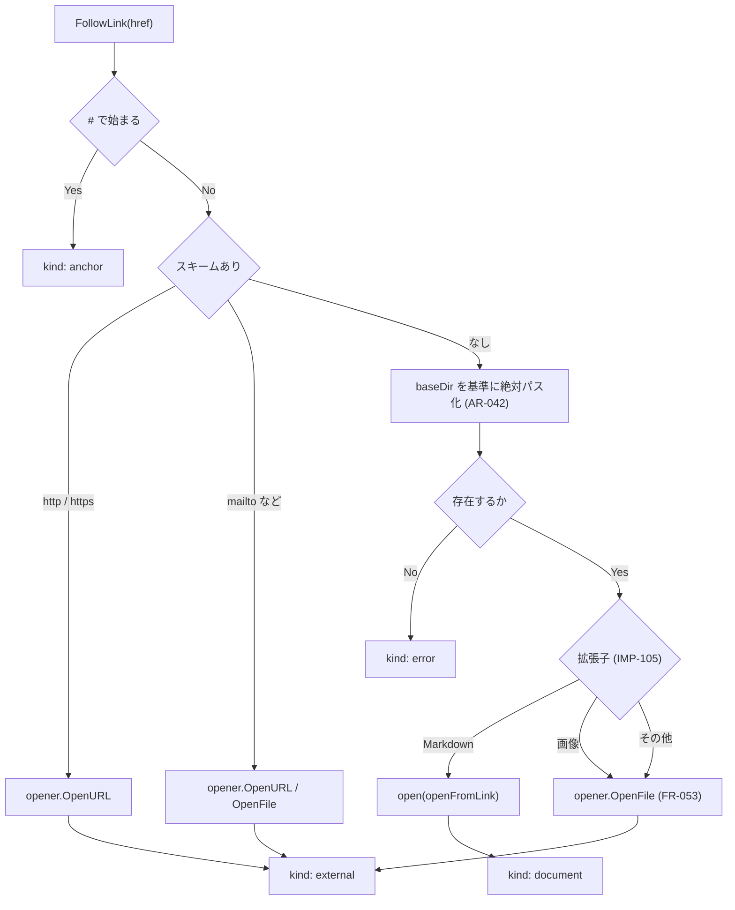
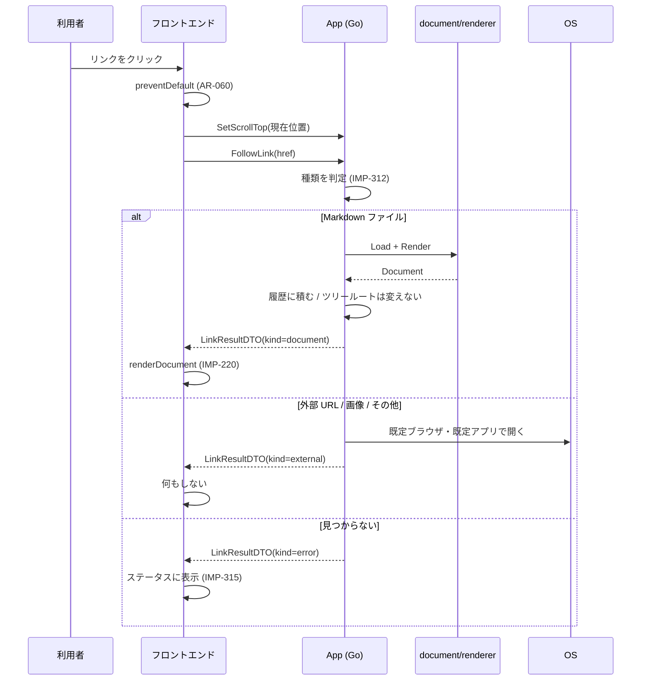
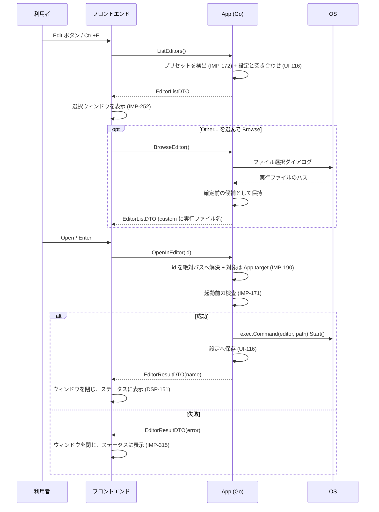

# 13. 実装仕様: Go ↔ フロントエンド インターフェース

> 索引: [README](README.md) | 実装仕様: [10](10-impl-overview.md) / [11](11-impl-backend.md) / [12](12-impl-frontend.md) / **13**

本文書は、Go 側（`app.go`）がフロントエンドへ公開するメソッドと、Go 側から送出するイベント、およびその間でやり取りするデータ型を定める。ここが両者の唯一の接点であり、**この境界の規約は厳密に守る**（AR-061）。

## 13.1 方針（IMP-300 系）

### IMP-300: 設計原則 **MUST**

1. **往復回数を最小化する。** 1 つの利用者操作に対する呼び出しは原則 1 回とし、必要な情報をまとめて返す（AR-061）。
2. **判断は Go 側に置く。** パスの解釈、リンク先の種類判定、拡張子の判定、サイズ判定をフロントエンドで行わない。フロントエンドは「利用者が何をしたか」を伝え、結果を描画する。
3. **フロントエンドから任意のパスを渡せる API を作らない。** ファイルを開く経路は、ダイアログ・ドロップ・引数・ツリー・リンク・履歴の 6 つに限る（IMP-192）。
4. **状態の正は Go 側にある。** フロントエンドの `state`（IMP-210）は写しである。

### IMP-301: 命名と型 **MUST**

- バインドメソッドは Go の慣習どおり大文字始まり。Wails は JavaScript 側で先頭小文字に変換する。
- DTO は `app.go` またはその近傍に定義し、`json` タグで JavaScript 側のフィールド名（キャメルケース）を明示する。
- 時刻は RFC 3339 の文字列、パスは絶対パスの文字列とする。
- `null` を返しうるフィールドはポインタ型とし、その旨を本文書に記す。

## 13.2 データ型（IMP-302 系）

### IMP-302: DocumentDTO **MUST**

```go
type DocumentDTO struct {
    Path          string             `json:"path"`          // 絶対パス
    DisplayPath   string             `json:"displayPath"`   // ステータス表示用（UI-060）
    Name          string             `json:"name"`          // ベース名（UI-013 のタイトル）
    OutsideTree   bool               `json:"outsideTree"`   // FR-052
    HTML          string             `json:"html"`          // サニタイズ済み（IMP-116）
    Headings      []renderer.Heading `json:"headings"`      // FR-040
    LineCount     int                `json:"lineCount"`     // UI-060
    Encoding      string             `json:"encoding"`      // 常に "UTF-8"
    NeedsMermaid  bool               `json:"needsMermaid"`  // AR-021
    NeedsKaTeX    bool               `json:"needsKaTeX"`    // AR-021
    NeedsPlantUML bool               `json:"needsPlantUML"` // AR-021, MD-085
    Scroll        ScrollDTO          `json:"scroll"`        // 描画後のスクロール指示
    Warnings      []string           `json:"warnings"`      // 警告の Kind（IMP-315）
}

type ScrollDTO struct {
    Mode   string `json:"mode"`   // "top" | "anchor" | "restore" | "keep"
    Anchor string `json:"anchor"` // mode == "anchor" のときの見出し ID
    Top    int    `json:"top"`    // mode == "restore" のときの位置
}
```

| `Mode` | 動作 | 使う場面 |
| --- | --- | --- |
| `top` | 文書の先頭へ | ファイルを開く、ツリー選択、リンク遷移（アンカーなし） |
| `anchor` | `Anchor` の見出しがペイン上端付近に来る位置へ | アンカー付きリンク |
| `restore` | `Top` の値へ復元する | 履歴移動（FR-051） |
| `keep` | **フロントエンドが現在の位置をそのまま保つ**。`Top` は使わない | 再読み込み、更新の自動検知（FR-014, FR-015） |

`restore` と `keep` を分けているのは、位置の出どころが異なるためである。`restore` は Go 側が履歴に記録した値を渡すのに対し、`keep` はフロントエンドが持っている現在位置を使う。両者を 1 つのモードで表そうとすると「`Top` に 0 を入れて現在位置を維持させる」といった約束が必要になり、意味が読み取れなくなる。

`Scroll` を Go 側が決めるのは、スクロールの扱いが「どの経路で開いたか」（IMP-192）に依存するためである。フロントエンドに経路を意識させない。

`Warnings` には**文言ではなく IMP-315 の `Kind` を入れる**（例: 不正な UTF-8 を置換したときは `encoding`）。文言そのものを Go 側が組み立てると、`strings.js` の `warnEncoding`（IMP-290）が使われないまま残り、同じ文言の定義が 2 箇所になる。`ErrorDTO.Kind` と同じ扱いに揃え、フロントエンドが `Kind` から文言を選ぶ。空でも `null` ではなく空配列を返す。

同じ理由で、`Headings` も見出しがないとき空配列を返す。`null` を渡すとフロントエンドの走査が落ち、アウトラインだけでなく描画全体が止まる。

### IMP-303: InitialStateDTO **MUST**

```go
type InitialStateDTO struct {
    Config    ConfigDTO    `json:"config"`
    TreeRoot  string       `json:"treeRoot"`  // 絶対パス。未確定なら空文字
    Document  *DocumentDTO `json:"document"`  // 表示対象がなければ null
    StateKind string       `json:"stateKind"` // "" | "welcome" | "confirm-large" | "too-large" | "render-error"
    Error     *ErrorDTO    `json:"error"`     // StateKind が "" 以外で情報を要する場合
}

type ConfigDTO struct {
    Theme           string `json:"theme"`           // "light" | "dark"（解決済み。FR-071）
    OutlineVisible  bool   `json:"outlineVisible"`
    FileTreeVisible bool   `json:"fileTreeVisible"`
    OutlineWidth    int    `json:"outlineWidth"`
    FileTreeWidth   int    `json:"fileTreeWidth"`
}
```

**表示倍率を含めない。** 倍率は保存しない（UI-111, UI-115）ため、往路では渡すものがなく、復路でも Go 側に受け取る先がない（IMP-150）。倍率はフロントエンドの `state` だけが持つ（IMP-210, IMP-242）。ウィンドウの大きさと最大化状態も同様に含めない（サイズは Go 側が Wails のランタイムから直接読む。IMP-194）。

`Theme` は Go 側で OS 設定への追従（FR-071）まで解決済みの値を返す。OS 設定の取得は `ostheme`（IMP-175）が行う。フロントエンドで `prefers-color-scheme` を判定して上書きしない。

**`ConfigDTO` は往路（Go → JS）と復路（JS → Go, `UpdateConfig`）で同じ型を用いるが、`Theme` の意味だけが異なる。**

| 向き | `Theme` の値 | 意味 |
| --- | --- | --- |
| 往路 | `light` / `dark` | 解決済み。そのまま画面へ適用する |
| 復路 | `light` / `dark` | 利用者が明示的に切り替えた |
| 復路 | 空文字 | 利用者はまだ選んでいない。OS 設定への追従を保つ |

復路で解決済みの値を常に返すと、**ペインを開閉しただけで `config.Config.Theme` が空文字から `light` へ書き換わり、初回起動の OS 追従が最初の保存で失われる。** フロントエンドは「利用者が自分で切り替えたか」を別に持ち（IMP-210 の `state.themeExplicit`）、切り替えるまでは空文字を送る。Go 側の `Normalize`（IMP-153）は空文字を既定値（＝空文字）のまま保つため、追加の処理は要らない。

`StateKind` が `welcome` 以外の値を取るのは、**起動時の引数に大きすぎるファイルや壊れたファイルが指定された場合**である（FR-012）。この場合 `Document` は null となり、`Error` に対象パスとサイズが入る。フロントエンドは通常の状態画面（IMP-250）と同じ処理でこれを描画する。起動経路のためだけの専用画面を作らない。

### IMP-304: TreeNodeDTO **MUST**

```go
type TreeNodeDTO struct {
    Name      string `json:"name"`
    Path      string `json:"path"`      // 絶対パス
    IsDir     bool   `json:"isDir"`
    HasChild  bool   `json:"hasChild"`  // 展開可能か（FR-032 の先読み結果）
    Omitted   int    `json:"omitted"`   // 件数上限で除かれた数。0 なら全件（FR-032）
}
```

子ノードは含めない。展開のたびに `ReadDir` を呼ぶ（FR-032 の遅延展開）。

`Omitted` は**その要素が属する一覧から件数上限で除かれた数**である（IMP-130）。切り詰めが起きた場合、返すすべての要素に同じ値が入る。フロントエンドは先頭の要素を見て、一覧の末尾に `… and N more` を表示する（DSP-112, IMP-290 の `treeMore`）。

`HasChild` はディレクトリかどうかと一致する。`filetree.ReadDir` が Markdown を含まないディレクトリを既に除いており（FR-031, IMP-133）、返ってきたディレクトリはすべて展開する価値があるためである。**先読みの判定を DTO 側でやり直さない。**

### IMP-305: LinkResultDTO **MUST**

```go
type LinkResultDTO struct {
    Kind     string       `json:"kind"`     // "document" | "external" | "anchor" | "error"
    Document *DocumentDTO `json:"document"` // kind == "document" のとき
    Anchor   string       `json:"anchor"`   // kind == "anchor" のとき
    Error    *ErrorDTO    `json:"error"`    // kind == "error" のとき
}
```

`external`（外部 URL・画像・その他のファイル）の場合、Go 側が既に OS へ委譲済みであり、フロントエンドは何もしない。

失敗は文言ではなく `ErrorDTO` をそのまま載せる（IMP-307）。リンク先が大きな Markdown だった場合、`Kind` は `error`、`Error.Kind` は `needs-confirm` となり、フロントエンドは他の経路と同じ確認画面を出せる（FR-016）。文言だけを渡すとサイズと上限が失われ、確認画面を組み立てられない。理由は IMP-308 と同じである。

### IMP-306: AboutDTO **MUST**

```go
type AboutDTO struct {
    Version     string              `json:"version"`
    Commit      string              `json:"commit"`
    BuildTime   string              `json:"buildTime"`
    Author      string              `json:"author"`
    Repository  string              `json:"repository"`
    License     string              `json:"license"`
    Environment string              `json:"environment"`
    Vendors     []buildinfo.VendorEntry `json:"vendors"`  // UI-100 の Bundled 行
    Licenses    string              `json:"licenses"`     // THIRD_PARTY.md の全文（FR-101）
}
```

- **`Vendors` には `buildinfo.Bundled()` の結果を入れる**（IMP-181）。`Vendors()` の全体ではない。同梱物の中に含まれるもの（Viz.js / Graphviz / Expat）は `Bundled` 行に出さず、`Licenses` の中に全文として現れる（UI-100）。

### IMP-307: ErrorDTO **MUST**

```go
type ErrorDTO struct {
    Kind    string `json:"kind"`    // IMP-315 の分類
    Message string `json:"message"` // 表示用の英語文言
    Path    string `json:"path"`    // 対象がある場合
    Size    int64  `json:"size"`    // サイズ関連のときのみ
    Limit   int64  `json:"limit"`   // サイズ関連のときのみ
}
```

### IMP-308: OpenResultDTO **MUST**

```go
type OpenResultDTO struct {
    Document *DocumentDTO `json:"document"` // 成功したとき。失敗時は null
    Error    *ErrorDTO    `json:"error"`    // 失敗したとき。成功時は null
}
```

文書を開くバインドメソッド（IMP-310）の戻り値。**失敗を Go の `error` ではなく、この構造体で返す。**

> [!IMPORTANT]
> Wails v2 は Go の `error` を**メッセージ文字列としてしか**フロントエンドへ渡せない（`dispatcher.NewErrorCallback(message string, ...)` を経て、JavaScript 側は `new Error(message)` を受け取る）。`(*DocumentDTO, error)` のまま返すと `ErrorDTO` の `Kind` / `Size` / `Limit` が失われ、**大きなファイルの確認画面（FR-016, IMP-314）を組み立てられない。** 失敗が値として渡る形にする必要がある。

`Document` と `Error` がどちらも `null` の場合は「**何も起きなかった**」を表す。フロントエンドは表示を変えない。次の 4 つがこれにあたる。

| 場面 | メソッド |
| --- | --- |
| ダイアログを取り消した | `OpenFileDialog` |
| ダイアログを開けなかった | `OpenFileDialog` |
| 履歴の端で戻る・進むを呼んだ | `HistoryBack` / `HistoryForward` |
| 表示中の文書がない状態で再読み込みした | `Reload` |

ダイアログを開けなかった場合を失敗として扱わないのは、表示中の文書を状態画面で置き換える理由がないためである（FR-110）。利用者から見れば「ファイルが選ばれなかった」ことに変わりはない。

`ReadDir` と `CopyToClipboard` は `error` を返したままとする。前者はツリーの一部が読めないだけであり、後者は失敗の種類が 1 つしかない。いずれも `Kind` を伴う分岐を必要としない（IMP-315）。

### IMP-309: EditorListDTO / EditorDTO / EditorResultDTO **MUST**

エディタ選択ウィンドウ（[UI-103](03-ui.md)）とその実行の DTO。

```go
// EditorListDTO は選択ウィンドウの中身（UI-103）。
type EditorListDTO struct {
    Editors []EditorDTO `json:"editors"`
    Error   *ErrorDTO   `json:"error"`
}

// EditorDTO は一覧の 1 行。
type EditorDTO struct {
    ID        string `json:"id"`        // プリセットの ID、または "custom"
    Name      string `json:"name"`      // 画面に出す表示名
    Available bool   `json:"available"` // 選択できるか（見つかったか）
    Selected  bool   `json:"selected"`  // 初期選択（UI-116）
}

// EditorResultDTO は起動の結果。
type EditorResultDTO struct {
    Name  string    `json:"name"`  // 起動したエディタの表示名。ステータス表示に使う
    Error *ErrorDTO `json:"error"` // 失敗したとき。成功時は null
}
```

> [!IMPORTANT]
> **`EditorDTO` に実行ファイルのパスを載せてはならない**（[NFR-035](07-nonfunctional.md) の 3）。画面に出す必要がなく、載せた時点でフロントエンドをパスが通ることになる。これは IMP-300 の 3 が禁じている形そのものである。

- 一覧の末尾には常に **`ID` が `custom` の行**を置く。`Other...` にあたる。
  - まだ何も選ばれていなければ `Name` は空、`Available` は `false`。
  - `BrowseEditor` で選ばれた後、または設定のエディタがどのプリセットとも一致しない場合は、**実行ファイル名（`filepath.Base`。パスではない）**を `Name` に入れ、`Available` を `true` にする（UI-103）。
- `Selected` が真の行は高々 1 つとする。設定にエディタが無い、または見つからない場合は**どの行も真にしない**（UI-116）。
- `Editors` の順序は [IMP-172](11-impl-backend.md) の定義順に `custom` を足したものとし、**並べ替えない**（UI-103）。

## 13.3 バインドメソッド（IMP-310 系）

すべて `App` のメソッドとして定義する。Wails のバインディングにより、JavaScript からは `window.go.main.App.*` として呼べる。`js/api.js` がこれを薄くラップする（IMP-201）。

### IMP-310: 一覧 **MUST**

| メソッド | 引数 | 戻り値 | 対応要求 |
| --- | --- | --- | --- |
| `GetInitialState()` | — | `InitialStateDTO` | FR-012, FR-013, UI-110 |
| `OpenFileDialog()` | — | `OpenResultDTO` | FR-010 |
| `OpenFromTree(path string)` | 絶対パス | `OpenResultDTO` | FR-033 |
| `OpenConfirmed(path string)` | 絶対パス | `OpenResultDTO` | FR-016 |
| `FollowLink(href string)` | リンクの生値 | `LinkResultDTO` | FR-050, FR-053 |
| `HistoryBack()` / `HistoryForward()` | — | `OpenResultDTO` | FR-051 |
| `Reload()` | — | `OpenResultDTO` | FR-015 |
| `ReadDir(path string)` | 絶対パス | `([]TreeNodeDTO, error)` | FR-032, FR-035 |
| `GetTreeRoot()` | — | `string` | FR-030 |
| `SetScrollTop(top int)` | 現在のスクロール位置 | — | FR-051 |
| `UpdateConfig(patch ConfigDTO)` | 変更後の設定 | — | UI-110, UI-114 |
| `CopyToClipboard(text string)` | コピー対象 | `error` | FR-061, AR-062 |
| `ListEditors()` | — | `EditorListDTO` | FR-091 |
| `BrowseEditor()` | — | `EditorListDTO` | FR-091 |
| `OpenInEditor(id string)` | プリセットの ID または `"custom"` | `EditorResultDTO` | FR-090 |
| `GetAbout()` | — | `AboutDTO` | FR-100, FR-101 |
| `Quit()` | — | — | UI-090 |

このほかに、フロントエンドから任意のパスを開く汎用メソッドを**定義しない**（IMP-300 の 3）。**エディタの 3 つも例外ではない。** 実行ファイルのパスは Go 側で生まれて Go 側で消費され、フロントエンドは識別子しか扱わない（IMP-309, NFR-035）。

- `BrowseEditor` は Go 側でファイル選択ダイアログを開き、**選ばれたパスを「確定前の候補」として 1 つだけ保持する。** `OpenInEditor("custom")` が用いてよいのは、**この候補か、設定に保存されたエディタ（UI-116）のどちらかだけ**とする。フロントエンドから受け取った値は使わない。任意の実行ファイルを無条件に起動する経路を作らないためであり、`OpenConfirmed` が確認待ちのパスを 1 つだけ保持するのと同じ考え方である（IMP-314）。
- **`ListEditors` は確定前の候補を捨てる。** 押すたびに選択ウィンドウを出す設計であり（[UI-103](03-ui.md)）、初期選択は設定に保存されたエディタだけから決まる（[UI-116](03-ui.md)）。`Browse` したまま閉じた候補が次に開いたときも残っていると、利用者には「閉じた場合は何も保存しない」（FR-091）が破れたように見える。
- **`OpenInEditor("custom")` は、確定前の候補が無ければ設定に保存されたエディタを使う**（UI-116）。`ListEditors` が候補を捨てる以上、候補だけを見ると**保存されたエディタは 2 回目以降けっして起動できない。** 一覧では選択済みとして出るのに `Open` が必ず `editor-failed` になる、という食い違いになる。用いてよいかどうかの判定は `EditorDTO.Available`（IMP-309）と同じ条件にする。**「一覧で選べる行」と「起動できる行」を一致させる。**
- `OpenInEditor` が成功したとき、**そのとき初めて設定へ保存する**（UI-116）。選択しただけ、`Browse` しただけでは保存しない。
- **`OpenInEditor` が開くファイルは `App.target`（IMP-190）である。** 「表示中の文書」（`current`）ではない。状態画面を出している間 `current` は前の文書のまま残っており、それを渡すと画面と食い違う（FR-090, NFR-035）。`target` が空（文書未表示）のときは `Error.Kind` を `editor-failed` として返す。**ボタンが淡色である以上（UI-021）通常は起こらないが、防御的に扱う。**

- **`GetAbout` は WebView のバージョンを取得して渡す**（[UI-100](03-ui.md), [IMP-181](11-impl-backend.md)）。空文字を固定で渡さない。取得手段と OS ごとの実装は IMP-181 が定める。**空文字は取得に失敗したときだけ**であり、そのとき `Environment` は当該区画を省く。
- **`ReadDir` はキャッシュを持たない。** 呼ばれるたびにディスクを読む。**いつ呼び直すかを決めるのはフロントエンドである**（FR-035 の 3 契機。[IMP-240](12-impl-frontend.md)）。

- **失敗は戻り値の DTO で伝える**（IMP-308, IMP-305）。Go の `error` を返すのは `ReadDir` と `CopyToClipboard` だけとする。
- 各メソッドの入口で `recover` する（IMP-022, FR-111）。回復したパニックは `Error.Kind` が `render-error` の失敗として返す。**ただしエディタの 3 つは `editor-failed` とする。** これらの結果はステータス領域に出るものであり（IMP-315）、`render-error` の文言「Failed to render this document.」は状況と合わない。利用者は「エディタを開こうとしたのに文書の変換に失敗した」と受け取ることになる。
- `Quit` は `Ctrl+Q`（UI-090）の受け口である。`Alt+F4` と閉じるボタンは OS とウィンドウマネージャが処理するためこの経路を通らない。**終了処理そのものは Wails に任せ、ここで設定を保存しない。** `OnBeforeClose` / `OnShutdown`（IMP-194）を通ることで、閉じるボタンで終了した場合とまったく同じ後始末になる。
- `UpdateConfig` を**立て続けに 2 つ呼ばない**。バインドメソッドの呼び出しは Wails がメッセージごとに処理するため、到着順が入れ替わりうる。フロントエンドは `saveConfig`（IMP-210）を経由し、前の応答を待ってから次を送る。

### IMP-311: SetScrollTop の扱い **MUST**

- フロントエンドは、文書を離れる直前（リンク遷移・ツリー選択・履歴移動・再読み込みの前）に呼ぶ。
- スクロールのたびに呼ばない。呼び出し頻度を抑えるため、離脱時の 1 回に限る。
- Go 側は受け取った値を現在の履歴エントリに記録する（IMP-191）。

### IMP-312: FollowLink の判定順序 **MUST**

FR-050 の表を実装する。Go 側で以下の順に判定する。



- `href` にアンカーが付いた Markdown（`./a.md#sec`）は、パス部分とアンカー部分を分離し、`DocumentDTO.Scroll` を `anchor` モードで返す。
- 基準ディレクトリは**表示中の文書のディレクトリ**であり、ツリールートではない（AR-042）。相対パスの解決規則は画像（IMP-118）と同一のものを使う。別々に書くと、`[x](./a.png)` が開くファイルと `` が表示するファイルが食い違いうる。
- **Windows のドライブレターをスキームと取り違えない。** `net/url` は `C:/docs/a.md` のスキームを `c` と解釈する。1 文字のスキームは存在しないため、これはローカルパスとして扱う。
- **`opener` が受け付けないスキームは `kind: error` とする**（IMP-170, NFR-030）。FR-050 は「`mailto:` 等のその他スキームは OS の既定ハンドラに委譲する」と定めるが、委譲してよいのは `http` / `https` / `mailto` に限る。文書は任意の第三者から受け取りうるため、`javascript:` や `file:` を OS へ渡さないことを優先する。

### IMP-313: ドロップの受け口 **MUST**

Wails のファイルドロップは、バインドメソッドではなくコールバックで受け取る。

```go
runtime.OnFileDrop(ctx, func(x, y int, paths []string) {
    // FR-011 の規則に従って 1 つを選び、open(openFromDrop) を呼ぶ
    // 結果は "document:opened" イベントでフロントエンドへ送る
})
```

- 複数パスから対象を選ぶ判定（FR-011）は Go 側で行う。
- ディレクトリがドロップされた場合、ツリールートを変更し、直下の README を探して開く。

> [!IMPORTANT]
> **`runtime.OnFileDrop`（Go）は購読であって、発火ではない。** 中身は `EventsOn(ctx, "wails:file-drop", ...)` だけである。**これを書いただけではパスは届かない。**
>
> | OS | 発火させるもの |
> | --- | --- |
> | **Windows**（WebView2） | **フロントエンドの `window.runtime.OnFileDrop()`**（[IMP-245](12-impl-frontend.md)）。これが `drop` リスナを取り付け、ドロップされた File オブジェクトを `postMessageWithAdditionalObjects` で Go へ渡して初めて絶対パスが得られる |
> | **Linux**（WebKitGTK） | GTK の `drag-data-received` / `drag-drop` シグナル。**JS 側の登録は要らない** |
>
> **この差があるため、Go 側だけを見て「配線した」と判断してはならない。** IMP-245 の JS 側の登録と対で成立する。片方を欠いた状態は、**オーバーレイだけが正しく出てドロップが無反応になる**という、原因を取り違えやすい形で現れる（[調査報告](../bugs/2026-09-04-bug-001-file-drop-windows.md)）。

### IMP-314: 大きなファイルの確認 **MUST**

FR-016 を実装する。

1. 通常の `open` が `ErrNeedsConfirm`（`*SizeError`）を返す。
2. `app.go` はこれを `OpenResultDTO{Error: &ErrorDTO{Kind: "needs-confirm", Path, Size, Limit}}` に変換して返す（IMP-308）。リンクから開いた場合は `LinkResultDTO{Kind: "error", Error: ...}` となる（IMP-305）。
3. フロントエンドは状態画面 `confirm-large` を表示する（IMP-250）。
4. `Open anyway` の押下で `OpenConfirmed(path)` を呼ぶ。Go 側は `LoadOptions{Confirmed: true}` で再試行する。

`OpenConfirmed` は、直前に確認画面を出したパスに対してのみ有効とする。Go 側が「確認待ちのパス」を 1 つだけ保持し、それ以外のパスを渡された場合は拒否する。任意のサイズのファイルを無条件に開く経路を作らないため。

**確認画面を出した時点で、ツリールートと表示履歴は対象へ移す**（FR-016）。FR-016 は「確認画面を表示した時点でタイトルとパス表示を対象のものに更新し、履歴に積む。`Alt+←` で直前の文書へ戻れること」を求めており、積まないと戻る先が 1 つずれる。適用する規則は成功時と同じ表（IMP-192）に従う。**監視は張らず、表示中の文書も差し替えない。** 描画を始めていないファイルは FR-014 の対象外である（FR-016）。

したがって `OpenConfirmed` から呼ぶ `open` は `openFromConfirm` を使い、ツリールートと履歴を二重に動かさない（IMP-192）。

### IMP-315: エラーの分類と文言 **MUST**

Go 側の番兵エラー（IMP-021）を `ErrorDTO.Kind` へ写像し、フロントエンドが `strings.js` の文言（IMP-290）を選ぶ。

| Go のエラー | `Kind` | 表示先 | 文言（英語） |
| --- | --- | --- | --- |
| `document.ErrNotFound` | `not-found` | ステータス | `File not found: <path>` |
| `document.ErrPermission` | `permission` | ステータス | `Cannot access: <path>` |
| `document.ErrNotMarkdown` | `not-markdown` | ステータス | `Not a Markdown file: <path>` |
| `document.ErrNeedsConfirm` | `needs-confirm` | 状態画面 | `This file is large.` ほか（UI-052） |
| `document.ErrTooLarge` | `too-large` | 状態画面 | `File is too large (<size> / limit <limit>)` |
| 変換エラー・パニック回復 | `render-error` | 状態画面 | `Failed to render this document.` |
| リンク先が見つからない | `link-not-found` | ステータス | `Link target not found: <href>` |
| クリップボード失敗 | `clipboard` | ステータス | `Failed to copy.` |
| 監視対象が削除された | `removed` | ステータス | `File was deleted: <path>` |
| エディタを起動できない | `editor-failed` | ステータス | `Failed to start the editor.` |
| `opener.ErrSelf` | `editor-self` | ステータス | `MarkView cannot be used as an editor.` |
| 不正な文字コードを置換 | `encoding` | ステータス | `Some characters were replaced.` |

- 文言の組み立てはフロントエンドで行う。Go 側は `Kind` と要素（パス・サイズ）を渡す。これにより、文言の定義が `strings.js` の 1 箇所に集約される（IMP-290）。
- **`Kind` は戻り値の DTO に載せて渡す**（IMP-308, IMP-305）。Go の `error` として返すとメッセージ文字列しか渡らず、`Kind` も `Size` / `Limit` も失われる。
- `ErrorDTO.Message` には Go 側が組み立てた英語文言も入れる。フロントエンドが未知の `Kind` を受け取った場合のフォールバックとして用いる。

## 13.4 イベント（IMP-320 系）

Go からフロントエンドへの一方向通知。`runtime.EventsEmit` で送出し、フロントエンドは `runtime.EventsOn` で購読する。

### IMP-320: 一覧 **MUST**

| イベント名 | ペイロード | 契機 | 対応要求 |
| --- | --- | --- | --- |
| `document:opened` | `DocumentDTO` | ドロップ・引数など、フロントエンドの呼び出し以外で表示対象が変わったとき | FR-011 |
| `document:changed` | `DocumentDTO` | 表示中ファイルの更新を検知して再変換したとき | FR-014 |
| `document:removed` | `ErrorDTO` | 表示中ファイルが削除されたとき | FR-014, FR-110 |
| `tree:root-changed` | `string`（絶対パス） | ツリールートが変わったとき | FR-030 |
| `error` | `ErrorDTO` | 非同期処理で発生したエラー | FR-110 |

### IMP-321: document:changed の扱い **MUST**

FR-014 を実装する。

- ペイロードの `Scroll.Mode` は **`keep`** とする（IMP-302）。位置はフロントエンドが保持している現在値を用い、Go 側は `Top` を設定しない。
- 再描画時、フロントエンドは検索状態をリセットし（FR-080）、ツリーの展開状態は維持する（FR-014）。
- 再描画後、Mermaid・KaTeX・PlantUML の描画も再実行する。資産の再読み込みは行わない（AR-021）。

### IMP-322: イベントの購読解除 **SHOULD**

フロントエンドは単一ページであり、購読は起動時の 1 回のみ行う。動的な購読・解除を繰り返さない。

## 13.5 呼び出しの流れ（例）

### IMP-330: 文書内リンクをクリックしたとき



### IMP-331: エディタで開くとき

**押すたびに選択ウィンドウを出す**（FR-091）。往復は最大 3 回で、`Browse` を使わなければ 2 回で済む。



`ListEditors` は**画面の対象があるかを見ない。** 一覧を作るだけであり、対象の有無はボタンの活性（UI-021）で表す。

**対象が無いときに呼ばない判定は、フロントエンド側の 1 か所に置く。** ツールバーのボタンとショートカット（`Ctrl+E`）の両方が同じ入口を通るようにする。ボタンは淡色で防げるが（UI-021）、ショートカットはそれだけでは止まらない。判定が抜けると、操作案内の表示中に `Ctrl+E` を押したときだけ `Failed to start the editor.` が出る、原因の分からない失敗になる。

**保存は起動できたあとに行う。** 図の順序どおり、`Start()` が成功してから設定へ書く（IMP-310, UI-116）。先に保存すると、起動に失敗したエディタが次回の初期選択として残る。

**`ListEditors` を起動時に先読みしない。** プリセットの検出はファイルシステムを触るため、押されるまで行わない（NFR-013）。また、MarkView の実行中にエディタがインストール・アンインストールされうる。

## 13.6 要求一覧

| ID | 概要 | 必須度 |
| --- | --- | --- |
| IMP-300 | 設計原則 | MUST |
| IMP-301 | 命名と型 | MUST |
| IMP-302 | DocumentDTO | MUST |
| IMP-303 | InitialStateDTO | MUST |
| IMP-304 | TreeNodeDTO | MUST |
| IMP-305 | LinkResultDTO | MUST |
| IMP-306 | AboutDTO | MUST |
| IMP-307 | ErrorDTO | MUST |
| IMP-308 | OpenResultDTO | MUST |
| IMP-309 | EditorListDTO / EditorDTO / EditorResultDTO | MUST |
| IMP-310 | バインドメソッド一覧 | MUST |
| IMP-311 | SetScrollTop の扱い | MUST |
| IMP-312 | FollowLink の判定順序 | MUST |
| IMP-313 | ドロップの受け口 | MUST |
| IMP-314 | 大きなファイルの確認 | MUST |
| IMP-315 | エラーの分類と文言 | MUST |
| IMP-320 | イベント一覧 | MUST |
| IMP-321 | document:changed の扱い | MUST |
| IMP-322 | イベントの購読解除 | SHOULD |
| IMP-330 | 呼び出しの流れ（リンク遷移） | — |
| IMP-331 | 呼び出しの流れ（エディタで開く） | — |
