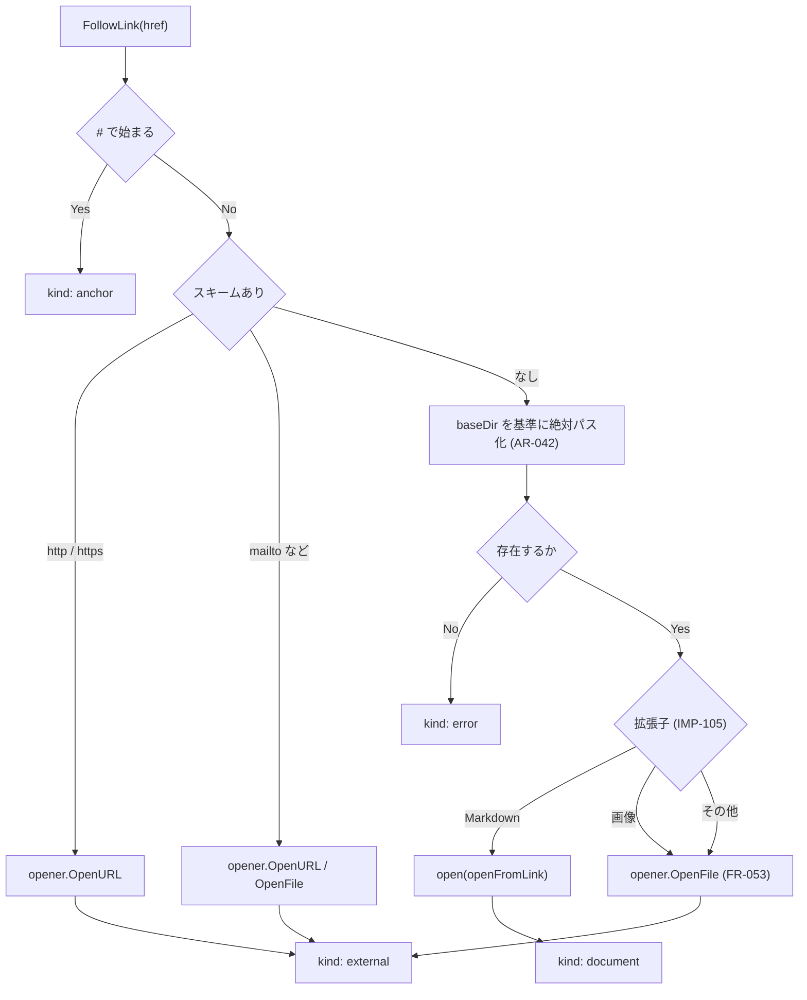
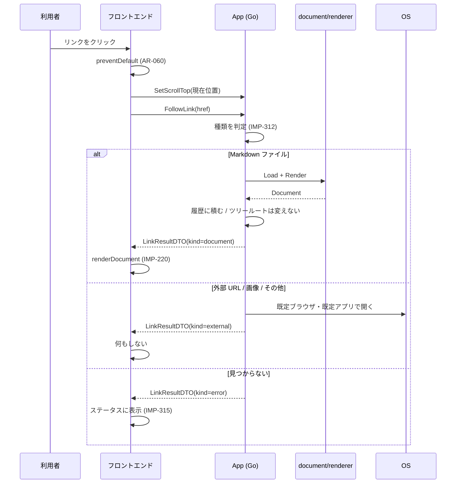

# 13. 実装仕様: Go ↔ フロントエンド インターフェース

> 索引: [README](README.md) | 実装仕様: [10](10-impl-overview.md) / [11](11-impl-backend.md) / [12](12-impl-frontend.md) / **13**

本文書は、Go 側（`app.go`）がフロントエンドへ公開するメソッドと、Go 側から送出するイベント、およびその間でやり取りするデータ型を定める。ここが両者の唯一の接点であり、**この境界の規約は厳密に守る**（AR-061）。

## 13.1 方針（IMP-300 系）

### IMP-300: 設計原則 **MUST**

1. **往復回数を最小化する。** 1 つの利用者操作に対する呼び出しは原則 1 回とし、必要な情報をまとめて返す（AR-061）。
2. **判断は Go 側に置く。** パスの解釈、リンク先の種類判定、拡張子の判定、サイズ判定をフロントエンドで行わない。フロントエンドは「利用者が何をしたか」を伝え、結果を描画する。
3. **フロントエンドから任意のパスを渡せる API を作らない。** ファイルを開く経路は、ダイアログ・ドロップ・引数・ツリー・リンク・履歴の 6 つに限る（IMP-192）。
4. **状態の正は Go 側にある。** フロントエンドの `state`（IMP-210）は写しである。

### IMP-301: 命名と型 **MUST**

- バインドメソッドは Go の慣習どおり大文字始まり。Wails は JavaScript 側で先頭小文字に変換する。
- DTO は `app.go` またはその近傍に定義し、`json` タグで JavaScript 側のフィールド名（キャメルケース）を明示する。
- 時刻は RFC 3339 の文字列、パスは絶対パスの文字列とする。
- `null` を返しうるフィールドはポインタ型とし、その旨を本文書に記す。

## 13.2 データ型（IMP-302 系）

### IMP-302: DocumentDTO **MUST**

```go
type DocumentDTO struct {
    Path         string             `json:"path"`         // 絶対パス
    DisplayPath  string             `json:"displayPath"`  // ステータス表示用（UI-060）
    Name         string             `json:"name"`         // ベース名（UI-013 のタイトル）
    OutsideTree  bool               `json:"outsideTree"`  // FR-052
    HTML         string             `json:"html"`         // サニタイズ済み（IMP-116）
    Headings     []renderer.Heading `json:"headings"`     // FR-040
    LineCount    int                `json:"lineCount"`    // UI-060
    Encoding     string             `json:"encoding"`     // 常に "UTF-8"
    NeedsMermaid bool               `json:"needsMermaid"` // AR-021
    NeedsKaTeX   bool               `json:"needsKaTeX"`   // AR-021
    Scroll       ScrollDTO          `json:"scroll"`       // 描画後のスクロール指示
    Warnings     []string           `json:"warnings"`     // 表示する警告文言（英語）
}

type ScrollDTO struct {
    Mode   string `json:"mode"`   // "top" | "anchor" | "restore" | "keep"
    Anchor string `json:"anchor"` // mode == "anchor" のときの見出し ID
    Top    int    `json:"top"`    // mode == "restore" のときの位置
}
```

| `Mode` | 動作 | 使う場面 |
| --- | --- | --- |
| `top` | 文書の先頭へ | ファイルを開く、ツリー選択、リンク遷移（アンカーなし） |
| `anchor` | `Anchor` の見出しがペイン上端付近に来る位置へ | アンカー付きリンク |
| `restore` | `Top` の値へ復元する | 履歴移動（FR-051） |
| `keep` | **フロントエンドが現在の位置をそのまま保つ**。`Top` は使わない | 再読み込み、更新の自動検知（FR-014, FR-015） |

`restore` と `keep` を分けているのは、位置の出どころが異なるためである。`restore` は Go 側が履歴に記録した値を渡すのに対し、`keep` はフロントエンドが持っている現在位置を使う。両者を 1 つのモードで表そうとすると「`Top` に 0 を入れて現在位置を維持させる」といった約束が必要になり、意味が読み取れなくなる。

`Scroll` を Go 側が決めるのは、スクロールの扱いが「どの経路で開いたか」（IMP-192）に依存するためである。フロントエンドに経路を意識させない。

### IMP-303: InitialStateDTO **MUST**

```go
type InitialStateDTO struct {
    Config    ConfigDTO    `json:"config"`
    TreeRoot  string       `json:"treeRoot"`  // 絶対パス。未確定なら空文字
    Document  *DocumentDTO `json:"document"`  // 表示対象がなければ null
    StateKind string       `json:"stateKind"` // "" | "welcome" | "confirm-large" | "too-large" | "render-error"
    Error     *ErrorDTO    `json:"error"`     // StateKind が "" 以外で情報を要する場合
}

type ConfigDTO struct {
    Theme           string `json:"theme"`           // "light" | "dark"（解決済み。FR-071）
    Zoom            int    `json:"zoom"`
    OutlineVisible  bool   `json:"outlineVisible"`
    FileTreeVisible bool   `json:"fileTreeVisible"`
    OutlineWidth    int    `json:"outlineWidth"`
    FileTreeWidth   int    `json:"fileTreeWidth"`
}
```

`Theme` は Go 側で OS 設定への追従（FR-071）まで解決済みの値を返す。フロントエンドで `prefers-color-scheme` を判定して上書きしない。

`StateKind` が `welcome` 以外の値を取るのは、**起動時の引数に大きすぎるファイルや壊れたファイルが指定された場合**である（FR-012）。この場合 `Document` は null となり、`Error` に対象パスとサイズが入る。フロントエンドは通常の状態画面（IMP-250）と同じ処理でこれを描画する。起動経路のためだけの専用画面を作らない。

### IMP-304: TreeNodeDTO **MUST**

```go
type TreeNodeDTO struct {
    Name      string `json:"name"`
    Path      string `json:"path"`      // 絶対パス
    IsDir     bool   `json:"isDir"`
    HasChild  bool   `json:"hasChild"`  // 展開可能か（FR-032 の先読み結果）
    Truncated bool   `json:"truncated"` // 件数上限で切り詰めた（FR-032）
}
```

子ノードは含めない。展開のたびに `ReadDir` を呼ぶ（FR-032 の遅延展開）。

`Truncated` は**その要素が属する一覧が切り詰められた**ことを示す（IMP-130）。切り詰めが起きた場合、返すすべての要素に立つ。フロントエンドは先頭の要素を見て、一覧の末尾に省略の旨を表示する。

### IMP-305: LinkResultDTO **MUST**

```go
type LinkResultDTO struct {
    Kind     string       `json:"kind"`     // "document" | "external" | "anchor" | "error"
    Document *DocumentDTO `json:"document"` // kind == "document" のとき
    Anchor   string       `json:"anchor"`   // kind == "anchor" のとき
    Message  string       `json:"message"`  // kind == "error" のとき（英語）
}
```

`external`（外部 URL・画像・その他のファイル）の場合、Go 側が既に OS へ委譲済みであり、フロントエンドは何もしない。

### IMP-306: AboutDTO **MUST**

```go
type AboutDTO struct {
    Version     string              `json:"version"`
    Commit      string              `json:"commit"`
    BuildTime   string              `json:"buildTime"`
    Author      string              `json:"author"`
    Repository  string              `json:"repository"`
    License     string              `json:"license"`
    Environment string              `json:"environment"`
    Vendors     []buildinfo.VendorEntry `json:"vendors"`  // UI-100 の Bundled 行
    Licenses    string              `json:"licenses"`     // THIRD_PARTY.md の全文（FR-101）
}
```

### IMP-307: ErrorDTO **MUST**

```go
type ErrorDTO struct {
    Kind    string `json:"kind"`    // IMP-315 の分類
    Message string `json:"message"` // 表示用の英語文言
    Path    string `json:"path"`    // 対象がある場合
    Size    int64  `json:"size"`    // サイズ関連のときのみ
    Limit   int64  `json:"limit"`   // サイズ関連のときのみ
}
```

## 13.3 バインドメソッド（IMP-310 系）

すべて `App` のメソッドとして定義する。Wails のバインディングにより、JavaScript からは `window.go.main.App.*` として呼べる。`js/api.js` がこれを薄くラップする（IMP-201）。

### IMP-310: 一覧 **MUST**

| メソッド | 引数 | 戻り値 | 対応要求 |
| --- | --- | --- | --- |
| `GetInitialState()` | — | `InitialStateDTO` | FR-012, FR-013, UI-110 |
| `OpenFileDialog()` | — | `(*DocumentDTO, error)` | FR-010 |
| `OpenFromTree(path string)` | 絶対パス | `(*DocumentDTO, error)` | FR-033 |
| `OpenConfirmed(path string)` | 絶対パス | `(*DocumentDTO, error)` | FR-016 |
| `FollowLink(href string)` | リンクの生値 | `(LinkResultDTO, error)` | FR-050, FR-053 |
| `HistoryBack()` / `HistoryForward()` | — | `(*DocumentDTO, error)` | FR-051 |
| `Reload()` | — | `(*DocumentDTO, error)` | FR-015 |
| `ReadDir(path string)` | 絶対パス | `([]TreeNodeDTO, error)` | FR-032, FR-035 |
| `GetTreeRoot()` | — | `string` | FR-030 |
| `SetScrollTop(top int)` | 現在のスクロール位置 | — | FR-051 |
| `UpdateConfig(patch ConfigDTO)` | 変更後の設定 | — | UI-110, UI-114 |
| `CopyToClipboard(text string)` | コピー対象 | `error` | FR-061, AR-062 |
| `GetAbout()` | — | `AboutDTO` | FR-100, FR-101 |

このほかに、フロントエンドから任意のパスを開く汎用メソッドを**定義しない**（IMP-300 の 3）。

### IMP-311: SetScrollTop の扱い **MUST**

- フロントエンドは、文書を離れる直前（リンク遷移・ツリー選択・履歴移動・再読み込みの前）に呼ぶ。
- スクロールのたびに呼ばない。呼び出し頻度を抑えるため、離脱時の 1 回に限る。
- Go 側は受け取った値を現在の履歴エントリに記録する（IMP-191）。

### IMP-312: FollowLink の判定順序 **MUST**

FR-050 の表を実装する。Go 側で以下の順に判定する。



- `href` にアンカーが付いた Markdown（`./a.md#sec`）は、パス部分とアンカー部分を分離し、`DocumentDTO.Scroll` を `anchor` モードで返す。
- 基準ディレクトリは**表示中の文書のディレクトリ**であり、ツリールートではない（AR-042）。

### IMP-313: ドロップの受け口 **MUST**

Wails のファイルドロップは、バインドメソッドではなくコールバックで受け取る。

```go
runtime.OnFileDrop(ctx, func(x, y int, paths []string) {
    // FR-011 の規則に従って 1 つを選び、open(openFromDrop) を呼ぶ
    // 結果は "document:opened" イベントでフロントエンドへ送る
})
```

- 複数パスから対象を選ぶ判定（FR-011）は Go 側で行う。
- ディレクトリがドロップされた場合、ツリールートを変更し、直下の README を探して開く。

### IMP-314: 大きなファイルの確認 **MUST**

FR-016 を実装する。

1. 通常の `open` が `ErrNeedsConfirm`（`*SizeError`）を返す。
2. `app.go` はこれを `ErrorDTO{Kind: "needs-confirm", Path, Size, Limit}` に変換して返す。
3. フロントエンドは状態画面 `confirm-large` を表示する（IMP-250）。
4. `Open anyway` の押下で `OpenConfirmed(path)` を呼ぶ。Go 側は `LoadOptions{Confirmed: true}` で再試行する。

`OpenConfirmed` は、直前に確認画面を出したパスに対してのみ有効とする。Go 側が「確認待ちのパス」を 1 つだけ保持し、それ以外のパスを渡された場合は拒否する。任意のサイズのファイルを無条件に開く経路を作らないため。

### IMP-315: エラーの分類と文言 **MUST**

Go 側の番兵エラー（IMP-021）を `ErrorDTO.Kind` へ写像し、フロントエンドが `strings.js` の文言（IMP-290）を選ぶ。

| Go のエラー | `Kind` | 表示先 | 文言（英語） |
| --- | --- | --- | --- |
| `document.ErrNotFound` | `not-found` | ステータス | `File not found: <path>` |
| `document.ErrPermission` | `permission` | ステータス | `Cannot access: <path>` |
| `document.ErrNotMarkdown` | `not-markdown` | ステータス | `Not a Markdown file: <path>` |
| `document.ErrNeedsConfirm` | `needs-confirm` | 状態画面 | `This file is large.` ほか（UI-052） |
| `document.ErrTooLarge` | `too-large` | 状態画面 | `File is too large (<size> / limit <limit>)` |
| 変換エラー・パニック回復 | `render-error` | 状態画面 | `Failed to render this document.` |
| リンク先が見つからない | `link-not-found` | ステータス | `Link target not found: <href>` |
| クリップボード失敗 | `clipboard` | ステータス | `Failed to copy.` |
| 監視対象が削除された | `removed` | ステータス | `File was deleted: <path>` |
| 不正な文字コードを置換 | `encoding` | ステータス | `Some characters were replaced.` |

- 文言の組み立てはフロントエンドで行う。Go 側は `Kind` と要素（パス・サイズ）を渡す。これにより、文言の定義が `strings.js` の 1 箇所に集約される（IMP-290）。
- `ErrorDTO.Message` には Go 側が組み立てた英語文言も入れる。フロントエンドが未知の `Kind` を受け取った場合のフォールバックとして用いる。

## 13.4 イベント（IMP-320 系）

Go からフロントエンドへの一方向通知。`runtime.EventsEmit` で送出し、フロントエンドは `runtime.EventsOn` で購読する。

### IMP-320: 一覧 **MUST**

| イベント名 | ペイロード | 契機 | 対応要求 |
| --- | --- | --- | --- |
| `document:opened` | `DocumentDTO` | ドロップ・引数など、フロントエンドの呼び出し以外で表示対象が変わったとき | FR-011 |
| `document:changed` | `DocumentDTO` | 表示中ファイルの更新を検知して再変換したとき | FR-014 |
| `document:removed` | `ErrorDTO` | 表示中ファイルが削除されたとき | FR-014, FR-110 |
| `tree:root-changed` | `string`（絶対パス） | ツリールートが変わったとき | FR-030 |
| `error` | `ErrorDTO` | 非同期処理で発生したエラー | FR-110 |

### IMP-321: document:changed の扱い **MUST**

FR-014 を実装する。

- ペイロードの `Scroll.Mode` は **`keep`** とする（IMP-302）。位置はフロントエンドが保持している現在値を用い、Go 側は `Top` を設定しない。
- 再描画時、フロントエンドは検索状態をリセットし（FR-080）、ツリーの展開状態は維持する（FR-014）。
- 再描画後、Mermaid・KaTeX の描画も再実行する。資産の再読み込みは行わない（AR-021）。

### IMP-322: イベントの購読解除 **SHOULD**

フロントエンドは単一ページであり、購読は起動時の 1 回のみ行う。動的な購読・解除を繰り返さない。

## 13.5 呼び出しの流れ（例）

### IMP-330: 文書内リンクをクリックしたとき



## 13.6 要求一覧

| ID | 概要 | 必須度 |
| --- | --- | --- |
| IMP-300 | 設計原則 | MUST |
| IMP-301 | 命名と型 | MUST |
| IMP-302 | DocumentDTO | MUST |
| IMP-303 | InitialStateDTO | MUST |
| IMP-304 | TreeNodeDTO | MUST |
| IMP-305 | LinkResultDTO | MUST |
| IMP-306 | AboutDTO | MUST |
| IMP-307 | ErrorDTO | MUST |
| IMP-310 | バインドメソッド一覧 | MUST |
| IMP-311 | SetScrollTop の扱い | MUST |
| IMP-312 | FollowLink の判定順序 | MUST |
| IMP-313 | ドロップの受け口 | MUST |
| IMP-314 | 大きなファイルの確認 | MUST |
| IMP-315 | エラーの分類と文言 | MUST |
| IMP-320 | イベント一覧 | MUST |
| IMP-321 | document:changed の扱い | MUST |
| IMP-322 | イベントの購読解除 | SHOULD |
| IMP-330 | 呼び出しの流れ（リンク遷移） | — |
