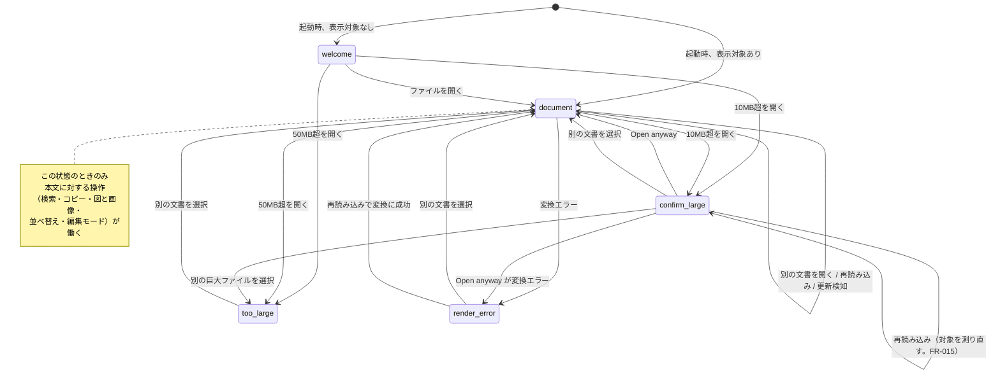
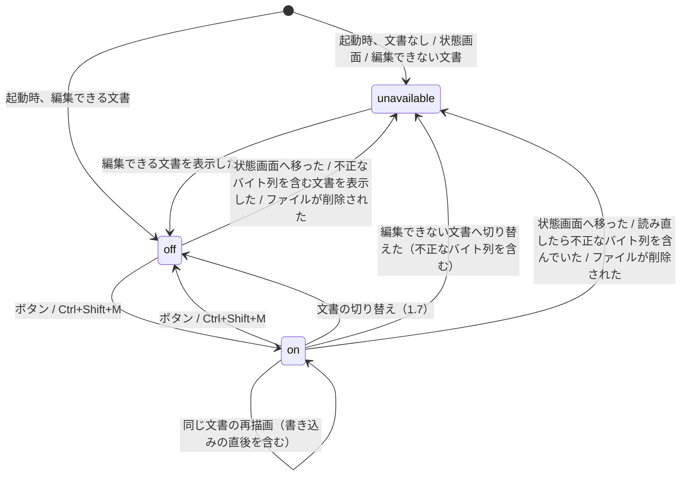
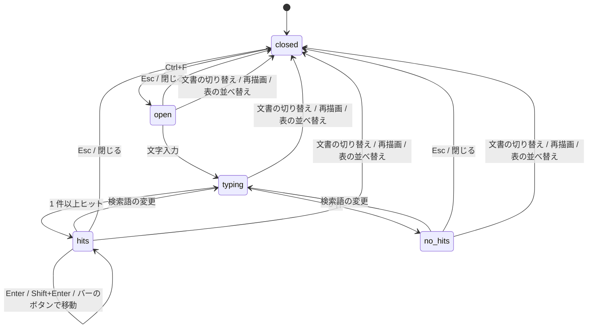

# 22. 表示仕様: 状態と遷移

> 索引: [README](README.md) | 表示仕様: [20](20-display-foundation.md) / [21](21-display-components.md) / **22**

本文書は、画面がどの状態を取り、何を契機に遷移するかを定める。個々の部品の見え方は [21. コンポーネント](21-display-components.md) を参照。

## 22.1 本文ペインの状態（DSP-300 系）

### DSP-300: 状態の一覧 **MUST**

本文ペインは常に以下のいずれか 1 つの状態にある。

| 状態 | 表示 | 契機 | 対応要求 |
| --- | --- | --- | --- |
| `welcome` | 操作案内（DSP-181） | 起動時に表示対象が見つからない | FR-013 |
| `document` | 描画された本文 | 文書を開いた／再描画した | FR-020 |
| `confirm-large` | 確認画面（DSP-181） | 10 MB 超のファイルを開こうとした | FR-016 |
| `too-large` | 上限超過（DSP-181） | 50 MB 超のファイルを開こうとした | FR-016 |
| `render-error` | エラー（DSP-181） | 変換中に想定外のエラーが発生した | FR-111 |

### DSP-301: 遷移 **MUST**



- `document` 以外の状態でも、ツールバー・ファイルツリー・アウトラインペイン・ステータス領域は表示され、操作できる（UI-052）。**右クリックメニューの `Select all` は状態画面でも使える**（状態画面の文字を選ぶ。IMP-249）。
- `document` 以外の状態では、アウトラインペインに `No headings` を表示する（DSP-113）。
- `document` 以外の状態で `Ctrl+F` を押した場合、検索バーは開かない。
- **`document` 以外の状態では、編集モードを開始できない**（FR-140。DSP-320）。`document` から他の状態へ移ると、編集モードは終わる。
- **上図は主な経路を示したものであり、遷移を制限する表ではない。** どの状態からでも、次に開く対象の大きさと変換結果に応じて `document` / `confirm-large` / `too-large` / `render-error` のいずれへも移りうる。**`Open anyway` を押した結果が変換エラーになる経路（`confirm-large` → `render-error`）は実際に起こる**ため、図にも入れている。

### DSP-302: 状態ごとの周辺表示 **MUST**

| 状態 | ウィンドウタイトル | ステータス（左） | ツリーの強調 |
| --- | --- | --- | --- |
| `welcome` | `MarkView` | 空 | なし |
| `document` | `<ファイル名> - MarkView` | 相対パス（ツリー外なら絶対パス + `(outside tree)`） | 対象ファイル |
| `confirm-large` | `<ファイル名> - MarkView` | 同上 | 対象ファイル |
| `too-large` | `<ファイル名> - MarkView` | 同上 | 対象ファイル |
| `render-error` | `<ファイル名> - MarkView` | 同上 | 対象ファイル |

- **状態画面（`confirm-large` / `too-large` / `render-error`）の間のステータスの左は、画面が対象にしているファイルのパスである。** `ErrorDTO` の `displayPath` / `outsideTree`（IMP-307）から出す（IMP-250 の `state.target`）。右の文字コード・行数は出さない（描画していない）。**前に表示していた文書のパスを残さない**——v1.0.0 はタイトルだけが対象に変わり、パスは前の文書のまま残っていた（[BUG-012](../bugs/2026-09-14-bug-012-state-screen-previous-document.md)）。

## 22.2 ペインの表示状態（DSP-310 系）

### DSP-310: 4 通りの組み合わせ **MUST**

UI-010 / UI-041 を実装する。ファイルツリーとアウトラインは独立してトグルされ、4 通りすべてが有効な状態である。

```
[1] 両方 OFF                    [2] アウトラインのみ ON（既定）
┌──────────────────────┐        ┌────────┬─────────────┐
│                      │        │Outline │             │
│     本文（全幅）     │        │        │    本文     │
│                      │        │        │             │
└──────────────────────┘        └────────┴─────────────┘

[3] ファイルツリーのみ ON        [4] 両方 ON
┌────────┬─────────────┐        ┌────────┬───────┬──────┐
│Files   │             │        │Files   │Outline│ 本文 │
│        │    本文     │        │        │       │      │
│        │             │        │        │       │      │
└────────┴─────────────┘        └────────┴───────┴──────┘
```

- 並び順は常に「ファイルツリー → アウトライン → 本文」に固定する（UI-041）。片方が非表示でも残る側の位置は変わらない。
- 本文ペインは残りの幅をすべて使う。本文の最大幅（980px）を超える場合は中央寄せとなる（DSP-120）。
- 既定は `[2]`（アウトラインのみ ON、ファイルツリー OFF）とする（UI-110）。

### DSP-311: トグルの即時性 **MUST**

- 開閉にアニメーションを掛けない（DSP-050）。
- 開閉により本文の折り返し幅が変わるが、**スクロール位置（先頭からの相対位置）を維持する**。位置がずれると読んでいた箇所を見失うため。
- ツールバーのボタンの `aria-pressed` と見た目（DSP-101 のトグル ON）を同時に更新する。

## 22.3 編集モードの状態（DSP-320 系）

### DSP-320: 状態と遷移 **MUST**

FR-140 / UI-021 / UI-055 / IMP-195 / IMP-260 を実装する。



| 状態 | ツールバーのボタン（DSP-101） | 本文ペイン（DSP-126） | チェックボックス・セル |
| --- | --- | --- | --- |
| `unavailable` | **無効**（淡色、押せない） | 枠とラベルなし | 読み取り専用（DSP-121） |
| `off` | 通常（トグル OFF） | 枠とラベルなし | 読み取り専用（DSP-121） |
| `on` | **トグル ON** | **枠と `Edit mode` のラベル** | 目印の合うものだけ編集できる（DSP-126） |

- **起動時は常に `on` にならない**（FR-140）。
- **状態の正は Go 側にある**（IMP-195）。画面は `DocumentDTO.editable` / `editMode`（IMP-302）と `EditModeDTO.on`（IMP-316）を写す。
- **ボタンと枠とラベルは同時に切り替える**（トランジションなし。DSP-050）。ボタンだけが ON で枠が出ていない時間を作らない。
- `on` から `off` / `unavailable` へ移ったとき、**開いていたセルの編集欄は取り消す**（FR-142）。取り消しの履歴は Go 側で捨てられる（FR-144）。

### DSP-321: 編集の反映の見え方 **MUST**

FR-141 / FR-142 / FR-143 / FR-144 / NFR-012 / IMP-261 / IMP-262 / IMP-263 を実装する。**見た目を先に変え、ファイルから読み直した再描画で整える。**

| 段階 | チェックボックス（FR-141） | セル（FR-142） | 取り消し・やり直し（FR-144） |
| --- | --- | --- | --- |
| 操作の直後（100 ms 以内。NFR-012） | 反転して見せる | 編集欄を閉じ、確定した文字列を `--fg-muted` でそのまま見せる（`.cell-pending`。記法は描かない） | **何も変えない**（どこが変わるか分からない） |
| 書き込みに成功し、再描画が届いた | 再描画の結果（ファイルの状態）で置き換わる。**フォーカスは同じ順番のチェックボックスに戻る**（FR-014） | 再描画の結果で置き換わる（記法が描かれ、文字の色が戻る） | 再描画の結果で置き換わる |
| 内容が変わらなかった（`changed` が偽） | そのまま | **元の表示へ戻す** | 何もしない |
| 指示が古かった（`stale`。FR-143） | **戻す**（通知しない） | **戻す**（通知しない） | **何もしない**（通知しない。取り消しは見た目を先に変えていない。編集モードでなくなっていた・状態画面へ移っていた場合に起きる。IMP-263） |
| 書き込み前にファイルが変わっていた（`edit-conflict`） | **戻し**、ステータス領域にエラー（DSP-151）。**続けて再描画でファイルの最新の内容が届く** | 同左 | ステータス領域にエラー。再描画で最新の内容が届く |
| 書き込めなかった（`edit-failed`） | **戻し**、ステータス領域にエラー（DSP-151） | 同左 | ステータス領域にエラー |

- **戻すのは、その要素がまだ画面にある場合だけとする。** 再描画が先に届いていれば、画面は既にファイルの状態を示している（IMP-261, IMP-262）。
- **エラーの表示は DSP-151 の「エラー」の段**とする。成功したときに情報の段を出さない（DSP-151 の「情報を出すのはエディタの起動に成功したときだけ」を変えない）。
- **続けて素早く操作した場合、先の操作の再描画が後の操作の見た目を一瞬上書きすることがある**（後の操作の書き込みがまだ終わっていないため）。**後の操作の再描画で正しい状態に落ち着く。** これは許容する——見た目を当て直す仕組みを持つと、ファイルの内容と画面を食い違わせる経路が増える。

## 22.4 ツリーとアウトラインの状態（DSP-330 系）

### DSP-330: ツリーノードの状態 **MUST**

| 状態 | 表現 |
| --- | --- |
| 折りたたみ（子未読込） | 矢印 `▸`。クリックで読み込んで展開 |
| 折りたたみ（子読込済） | 矢印 `▸`。クリックで再読み込みして展開（FR-035） |
| 展開 | 矢印 `▾`、アイコンを開いたフォルダに変更 |
| ホバー | 背景 `--neutral-muted` |
| 選択中（表示中のファイル） | 背景 `--accent-subtle`、左端 2px の `--accent-fg` |
| フォーカス | フォーカスリング（DSP-016）を **`.tree-item:focus-visible > .tree-row`** に出す（IMP-248）。**選択とは独立**。`li` に出すと展開中は配下の木全体が囲まれる |
| ツリー外を表示中 | **選択中のノードなし**（FR-052） |

### DSP-331: 自動展開 **MUST**

FR-032 を実装する。表示中のファイルに至る経路上のディレクトリは自動的に展開し、対象が可視になるまでスクロールする。この処理は以下の契機で行う。

- 起動時
- ファイル選択ダイアログ・ドロップ・引数で文書を開いたとき
- 履歴移動でツリー内の文書へ戻ったとき

リンク遷移（FR-050）でツリー内の別ファイルへ移った場合も、経路上のディレクトリを展開して可視にする。ツリールートは変えない。

### DSP-340: アウトライン項目の状態 **MUST**

| 状態 | 表現 |
| --- | --- |
| 通常 | `--fg-muted` |
| ホバー | `--fg-default`、背景 `--neutral-muted` |
| 現在位置（FR-042） | `--accent-fg`、背景 `--accent-subtle`、左端 2px |
| 見出しなし | `No headings`（DSP-113） |

現在位置の項目は同時に 1 つのみとする。判定は「本文ペインの上端より上にある最後の見出し」（FR-042）。

## 22.5 スクロール位置の扱い（DSP-350 系）

### DSP-350: 契機ごとの挙動 **MUST**

表示が切り替わる際のスクロール位置を、契機ごとに定める。実装は Go 側が指示する（IMP-302 の `ScrollDTO`）。

| 契機 | スクロール位置 | 対応要求 |
| --- | --- | --- |
| ファイルを開く（ダイアログ・ドロップ・引数） | 先頭 | FR-010 |
| ファイルツリーから選択 | 先頭 | FR-033 |
| リンク遷移（アンカーなし） | 先頭 | FR-050 |
| リンク遷移（アンカーあり） | 該当見出しがペイン上端付近 | FR-050 |
| 同一文書内のアンカー | 該当見出しがペイン上端付近 | FR-050 |
| アウトラインのクリック | 該当見出しがペイン上端付近 | FR-041 |
| `Alt+←` / `Alt+→` | 記録された位置を復元（`restore`） | FR-051 |
| 手動の再読み込み（F5） | **現在位置を維持**（`keep`） | FR-015 |
| ファイル更新の自動検知 | **現在位置を維持**（`keep`） | FR-014 |
| **編集モードの書き込み・取り消し・やり直しの直後の再描画** | **現在位置を維持**（`keep`） | FR-143, FR-144 |
| テーマ切り替え | 維持 | UI-105 |
| ペインの開閉・リサイズ | 維持（相対位置） | DSP-311 |
| 表示倍率の変更 | 維持（相対位置） | FR-081 |
| **表の並べ替え** | 維持 | FR-130 |
| **原寸表示の切り替え** | **押したボタンの画面上の位置を保つ**（切り替えで要素の高さが変わる分を補正する。IMP-228） | FR-121 |
| **拡大画面を開く・閉じる** | 維持（開いている間、本文は動かない） | FR-122 |
| **右クリックメニューの `Select all`** | 維持（選択でスクロールしない） | FR-063 |

- **開いていた折りたたみの復元（DSP-352）は、位置の設定より前に行う**（IMP-220 の手順 6a）。後に行うと、開いた分だけ位置がずれる。

### DSP-351: 位置が復元できない場合 **MUST**

文書が短くなり記録された位置が存在しない場合は、可能な限り近い位置（新しい文書末尾）に合わせる（FR-014）。エラーとしない。

### DSP-352: 再描画と文書の切り替えで引き継ぐ状態 **MUST**

FR-014 / FR-121 / FR-122 / FR-130 / FR-140 / FR-144 / IMP-220 を実装する。**画面の状態を「同じ文書の再描画」と「文書の切り替え」（1.7）でどう扱うかを 1 つの表にまとめる。** 機能ごとに別々に決めると、どれか 1 つだけが違う振る舞いになる（4.40.0 で実際に原寸表示だけが違っていた）。

判定は `DocumentDTO.sameDocument`（IMP-302）で行う。**同じ文書の再描画には、ファイル更新の自動検知・手動の再読み込み・同じファイルの開き直し・編集モードの書き込みの直後の読み直しを含む**（1.7）。

| 状態 | 同じ文書の再描画 | 文書の切り替え | 根拠 |
| --- | --- | --- | --- |
| スクロール位置 | DSP-350 の表に従う（`keep`。開き直しは先頭） | DSP-350 の表に従う | DSP-350 |
| 検索 | **閉じる** | 閉じる | FR-080, DSP-361 |
| 開いていた折りたたみ | **同じ順番のものを開いたまま** | 閉じた状態（HTML のまま） | FR-014 |
| フォーカス | 本文中のチェックボックスにあれば**同じ順番のチェックボックスへ**。それ以外は本文ペイン。**ダイアログ・拡大画面の表示中は動かさない**（IMP-220 の手順 11） | 本文ペイン（ダイアログの表示中は動かさない。拡大画面は閉じている） | FR-014, UI-051 |
| 表の並べ替え | **保つ。** 書き込みの直後（`trigger` が `edit`）は行の並びをそのまま、それ以外は並べ直す。列数が変わる・行が 2 行未満になると解除 | 解除 | FR-130 |
| 原寸表示 | **同じ対象（FR-120）があれば保つ**（図は描画が終わってから当て直す） | 解除 | FR-121 |
| 拡大画面 | **開いたまま。** 同じ対象の描画が終われば差し替えて倍率と位置を保つ（SHOULD）。無ければ閉じる | 閉じる | FR-122 |
| 右クリックメニュー | **閉じる**（本文を差し替える前に閉じる。IMP-220 の手順 0a） | 閉じる | FR-063 |
| セルの編集欄 | **取り消す** | 取り消す | FR-142 |
| 編集モード | **保つ**（読み直したら編集できない文書だった場合は終える） | **終える** | FR-140 |
| 取り消し履歴 | **保つ**（読み直した内容が把握している内容と違えば捨てる） | 捨てる | FR-144 |
| ツリーの展開状態 | 保つ。**ただし手動の再読み込み（F5）ではツリーを読み直し、表示中の文書までの経路だけを開く**（FR-035 の 2 番目の契機。IMP-240, DSP-331） | 保つ（強調だけを移す） | FR-014, FR-035, FR-050 |

- **テーマの切り替えは再描画ではない**（本文を差し替えない。DSP-370）。この表の対象にしない。

## 22.6 検索の状態（DSP-360 系）

### DSP-360: 状態遷移 **MUST**



| 状態 | 表示 |
| --- | --- |
| `closed` | 検索バー非表示、ハイライトなし |
| `open` | 検索バー表示、入力欄にフォーカス、ヒット数は空 |
| `typing` | 入力に応じてインクリメンタルに更新 |
| `hits` | `3 / 12` を表示、全ヒットを強調、現在位置を別色 |
| `no_hits` | `No results` を `--danger-fg` で表示、ハイライトなし |

> [!IMPORTANT]
> **移動の手段は 2 つある**（FR-080）。`Enter` / `Shift+Enter` と、検索バーの「前へ」「次へ」
> ボタンである。**どちらも同じ遷移**であり、片方だけを書かない。
>
> 片方だけを書くと、**片方だけが壊れている状態を検証で通してしまう。**
> 実際に起きた（[調査報告](../bugs/2026-09-03-search-jump-buttons.md)）。

### DSP-361: 検索状態のリセット **MUST**

文書の切り替え・再描画（自動検知を含む）・**表の並べ替え**（FR-130）で検索状態を破棄し、`closed` に戻す（FR-080）。このとき、挿入した強調用の要素をすべて取り除き、元の DOM 構造へ戻す（IMP-241）。

## 22.7 テーマ切り替え時の保持（DSP-370 系）

### DSP-370: 維持する状態 **MUST**

UI-105 を実装する。テーマ切り替えで以下を維持する。

| 対象 | 扱い |
| --- | --- |
| 本文のスクロール位置 | 維持 |
| 検索の状態（開閉・検索語・ヒット位置） | 維持 |
| ツリーの展開状態・スクロール位置 | 維持 |
| アウトラインの現在位置 | 維持 |
| 表示倍率 | 維持 |
| 表の並べ替え | 維持（FR-130） |
| 原寸表示 | 維持。**図は描き直した後に当て直す**（FR-121, IMP-228） |
| 編集モード | 維持（FR-140） |
| Mermaid 図 | **再描画する**（テーマ追従のため。IMP-231） |
| PlantUML 図 | **再描画する**（同上。IMP-233） |

図の 2 つだけ再描画が必要なため、図が一瞬消えて描き直される。これは許容するが、本文のレイアウトが動かないよう、再描画中も図の領域の高さを確保する。**PlantUML は Graphviz を要する図で 1 枚 1 秒近くかかる**（NFR-011）ため、再描画の完了を待たない（IMP-243）。

## 22.8 ウィンドウサイズへの追随（DSP-380 系）

### DSP-380: 狭いウィンドウでの表示 **MUST**

最小ウィンドウサイズは 640 × 480（UI-011）。この幅でも操作が破綻しないよう、以下を定める。

| 条件 | 挙動 |
| --- | --- |
| 本文ペインの内容の幅（スクロールバーの領域を除く）が 980px 以上 | 本文が最大幅 980px（**左右パディングを含む**。DSP-120）に達し、左右に余白ができる。文字の並ぶ幅は最大 916px |
| 同じく 980px 未満 | 本文がペインの残り幅いっぱいに広がる |
| 左右パディング | `clamp(16px, 4vw, 32px)`。**ウィンドウ幅 800px 以上で 32px**、それより狭いとウィンドウ幅の 4 %（最小ウィンドウ幅 640px で 25.6px。下限 16px は最小ウィンドウ幅では届かない） |
| ペイン幅の上限 | 各ペインはウィンドウ幅の 40 % を超えない（UI-030, UI-040）。ウィンドウを縮めた際、上限を超えるペインは自動的に縮む |
| 両ペイン表示時の本文最小幅 | 240px。これを下回る場合、**アウトラインペインを一時的に隠す**（UI-026） |

> [!NOTE]
> **本文の幅はウィンドウ幅だけでは決まらない。** サイドペインの幅と縦スクロールバーの領域（DSP-041 の `scrollbar-gutter: stable`）を引いた残りで決まる。**手動テストで本文の幅に近い大きさの画像を見るとき**（E2E-351 の `medium.png` は 900px で、文字の並ぶ幅 916px との差は 16px しかない）は、**ウィンドウとペインの幅を固定する**（ペインの幅は保存される。UI-110）。4.44.0 より前はこの表が `box-sizing: content-box` を前提にした「ウィンドウ幅 1044px 以上」と書いており、ペインとスクロールバーの幅も入っていなかった。

一時的に隠している間もトグルボタンは ON のままとし、設定値も変更しない。ウィンドウを広げれば元に戻る。利用者の意思による OFF と、幅による一時的な非表示を区別するためである（UI-026, IMP-246）。ファイルツリーは隠さない。

```
1280px            → Files + Outline + 本文（980px 上限）
 800px            → Files + Outline + 本文（300px）
 640px（最小）     → Files + 本文（384px）  ← Outline を一時的に隠す
                     ボタンは ON のまま。広げれば戻る
```

> [!IMPORTANT]
> **上の 3 行は、両ペインが既定幅（アウトライン 240 / ファイルツリー 260。UI-110）のときの値である。** 数値だけを見て実装すると、発火する範囲を取り違える。検算は次のとおり。
>
> | ウィンドウ幅 | アウトライン | ツリー | 本文 | アウトラインを隠すか |
> | --- | --- | --- | --- | --- |
> | 800 | 240 | 260 | **300** | しない（300 ≥ 240） |
> | 640 | 240 | 256（上限 40 % で縮む） | **144** | **する** → 隠すと本文は 384 |
>
> **ペイン幅は利用者が変えられ、設定に保存される**（UI-030, UI-040, UI-110, UI-114）。幅の組み合わせによっては、**最小ウィンドウ幅でも一度も発火しない。**
>
> | アウトライン | ツリー | 640px での本文 | 隠すか |
> | --- | --- | --- | --- |
> | 240（既定） | 260（既定） | 144 | **する** |
> | 240 | 200 | 200 | **する** |
> | 240 | 160（下限） | **240** | しない（閾値ちょうどは下回らない） |
> | 160（下限） | 160（下限） | **320** | しない |
>
> ```
> 到達しうる本文の最小幅 = 640（UI-011） - 160 - 160 = 320  >  240（UI-026 の閾値）
> ```
>
> **両ペインが下限にあるとき、UI-026 は原理的に発火しない。** それでよい。本文 320px は読める幅であり、隠す理由が無い（UI-026 の IMPORTANT）。**検証手順では幅を固定する**（[E2E-246](41-e2e-manual.md)、[調査報告](../bugs/2026-09-04-bug-003-outline-auto-hide.md)）。

### DSP-381: 高 DPI **MUST**

UI-012 を実装する。

- 寸法はすべて論理ピクセルで定義し、デバイスピクセル比に応じて OS 側でスケールされる。
- アイコンは SVG のため、拡大してもぼやけない（UI-022）。
- 1px の境界線は、高 DPI 環境で 0.5px 相当に潰れないよう `1px` のまま指定する。細く見せる目的でのサブピクセル指定を行わない。

## 22.9 起動時の見え方（DSP-390 系）

### DSP-390: 初期描画の順序 **MUST**

NFR-010 の起動時間を満たし、かつ見た目のちらつきを防ぐため、以下の順で描画する。

1. テーマを適用した状態でウィンドウを表示する。既定色から切り替わる瞬間を見せない（IMP-211）。
2. ツールバー・ペインの骨格を表示する。この時点で本文は空。
3. 本文を挿入する。**ここまでを NFR-010 の計測終点とする。**
4. ファイルツリーのルート直下を読み込んで表示する。
5. Mermaid・KaTeX・PlantUML が必要な場合に限り、遅延ロードして描画する（AR-021）。

4 と 5 はいずれも本文の表示を妨げない。ツリーや図が遅れて現れることは許容する。両者に前後の依存はなく、実装上どちらが先に完了してもよい（IMP-211 では本文描画の内部で 5 を起動し、その後に 4 を実行する）。

### DSP-391: 空の状態を見せない **SHOULD**

読み込み中に「白い矩形」を見せないため、本文の挿入前は `welcome` 画面またはひとつ前の文書を表示したままにする。中間状態として空の本文ペインを表示しない。

## 22.10 要求一覧

| ID | 概要 | 必須度 |
| --- | --- | --- |
| DSP-300 | 本文ペインの状態一覧 | MUST |
| DSP-301 | 状態遷移 | MUST |
| DSP-302 | 状態ごとの周辺表示 | MUST |
| DSP-310 | ペイン表示の 4 通りの組み合わせ | MUST |
| DSP-311 | トグルの即時性 | MUST |
| DSP-320 | 編集モードの状態と遷移 | MUST |
| DSP-321 | 編集の反映の見え方 | MUST |
| DSP-330 | ツリーノードの状態 | MUST |
| DSP-331 | 自動展開 | MUST |
| DSP-340 | アウトライン項目の状態 | MUST |
| DSP-350 | スクロール位置の契機ごとの挙動 | MUST |
| DSP-351 | 位置が復元できない場合 | MUST |
| DSP-352 | 再描画と文書の切り替えで引き継ぐ状態 | MUST |
| DSP-360 | 検索の状態遷移 | MUST |
| DSP-361 | 検索状態のリセット | MUST |
| DSP-370 | テーマ切り替え時に維持する状態 | MUST |
| DSP-380 | 狭いウィンドウでの表示 | MUST |
| DSP-381 | 高 DPI | MUST |
| DSP-390 | 初期描画の順序 | MUST |
| DSP-391 | 空の状態を見せない | SHOULD |
