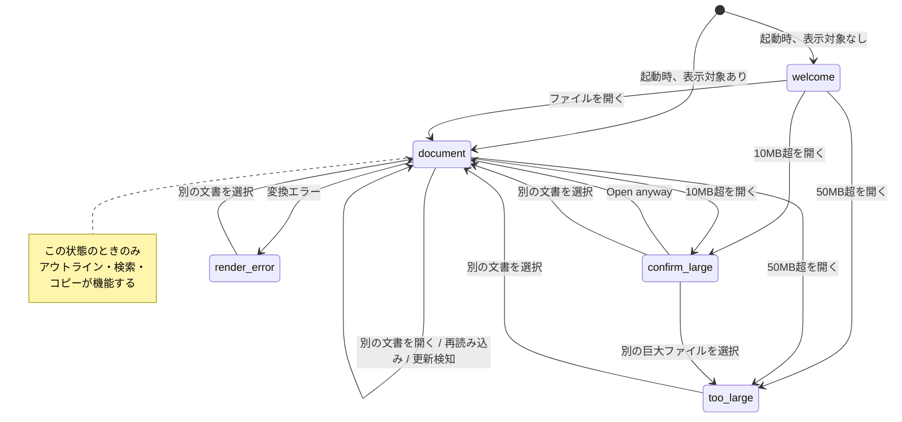
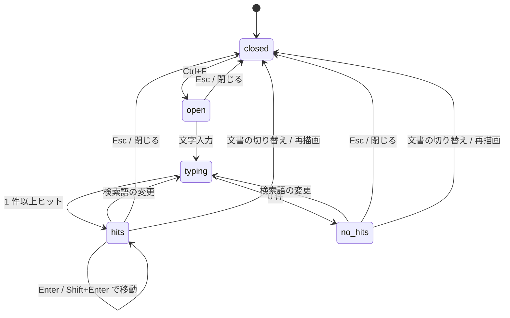

# 22. 表示仕様: 状態と遷移

> 索引: [README](README.md) | 表示仕様: [20](20-display-foundation.md) / [21](21-display-components.md) / **22**

本文書は、画面がどの状態を取り、何を契機に遷移するかを定める。個々の部品の見え方は [21. コンポーネント](21-display-components.md) を参照。

## 22.1 本文ペインの状態（DSP-300 系）

### DSP-300: 状態の一覧 **MUST**

本文ペインは常に以下のいずれか 1 つの状態にある。

| 状態 | 表示 | 契機 | 対応要求 |
| --- | --- | --- | --- |
| `welcome` | 操作案内（DSP-181） | 起動時に表示対象が見つからない | FR-013 |
| `document` | 描画された本文 | 文書を開いた／再描画した | FR-020 |
| `confirm-large` | 確認画面（DSP-181） | 10 MB 超のファイルを開こうとした | FR-016 |
| `too-large` | 上限超過（DSP-181） | 50 MB 超のファイルを開こうとした | FR-016 |
| `render-error` | エラー（DSP-181） | 変換中に想定外のエラーが発生した | FR-111 |

### DSP-301: 遷移 **MUST**



- `document` 以外の状態でも、ツールバー・ファイルツリー・アウトラインペイン・ステータス領域は表示され、操作できる（UI-052）。
- `document` 以外の状態では、アウトラインペインに `No headings` を表示する（DSP-113）。
- `document` 以外の状態で `Ctrl+F` を押した場合、検索バーは開かない。

### DSP-302: 状態ごとの周辺表示 **MUST**

| 状態 | ウィンドウタイトル | ステータス（左） | ツリーの強調 |
| --- | --- | --- | --- |
| `welcome` | `MarkView` | 空 | なし |
| `document` | `<ファイル名> - MarkView` | 相対パス（ツリー外なら絶対パス + `(outside tree)`） | 対象ファイル |
| `confirm-large` | `<ファイル名> - MarkView` | 同上 | 対象ファイル |
| `too-large` | `<ファイル名> - MarkView` | 同上 | 対象ファイル |
| `render-error` | `<ファイル名> - MarkView` | 同上 | 対象ファイル |

## 22.2 ペインの表示状態（DSP-310 系）

### DSP-310: 4 通りの組み合わせ **MUST**

UI-010 / UI-041 を実装する。ファイルツリーとアウトラインは独立してトグルされ、4 通りすべてが有効な状態である。

```
[1] 両方 OFF                    [2] アウトラインのみ ON（既定）
┌──────────────────────┐        ┌────────┬─────────────┐
│                      │        │Outline │             │
│      本文（全幅）      │        │        │    本文      │
│                      │        │        │             │
└──────────────────────┘        └────────┴─────────────┘

[3] ファイルツリーのみ ON        [4] 両方 ON
┌────────┬─────────────┐        ┌────────┬───────┬──────┐
│Files   │             │        │Files   │Outline│ 本文  │
│        │    本文      │        │        │       │      │
│        │             │        │        │       │      │
└────────┴─────────────┘        └────────┴───────┴──────┘
```

- 並び順は常に「ファイルツリー → アウトライン → 本文」に固定する（UI-041）。片方が非表示でも残る側の位置は変わらない。
- 本文ペインは残りの幅をすべて使う。本文の最大幅（980px）を超える場合は中央寄せとなる（DSP-120）。
- 既定は `[2]`（アウトラインのみ ON、ファイルツリー OFF）とする（UI-110）。

### DSP-311: トグルの即時性 **MUST**

- 開閉にアニメーションを掛けない（DSP-050）。
- 開閉により本文の折り返し幅が変わるが、**スクロール位置（先頭からの相対位置）を維持する**。位置がずれると読んでいた箇所を見失うため。
- ツールバーのボタンの `aria-pressed` と見た目（DSP-101 のトグル ON）を同時に更新する。

## 22.3 ツリーとアウトラインの状態（DSP-330 系）

### DSP-330: ツリーノードの状態 **MUST**

| 状態 | 表現 |
| --- | --- |
| 折りたたみ（子未読込） | 矢印 `▸`。クリックで読み込んで展開 |
| 折りたたみ（子読込済） | 矢印 `▸`。クリックで再読み込みして展開（FR-035） |
| 展開 | 矢印 `▾`、アイコンを開いたフォルダに変更 |
| ホバー | 背景 `--neutral-muted` |
| 選択中（表示中のファイル） | 背景 `--accent-subtle`、左端 2px の `--accent-fg` |
| フォーカス | フォーカスリング（DSP-016）。選択とは独立 |
| ツリー外を表示中 | **選択中のノードなし**（FR-052） |

### DSP-331: 自動展開 **MUST**

FR-032 を実装する。表示中のファイルに至る経路上のディレクトリは自動的に展開し、対象が可視になるまでスクロールする。この処理は以下の契機で行う。

- 起動時
- ファイル選択ダイアログ・ドロップ・引数で文書を開いたとき
- 履歴移動でツリー内の文書へ戻ったとき

リンク遷移（FR-050）でツリー内の別ファイルへ移った場合も、経路上のディレクトリを展開して可視にする。ツリールートは変えない。

### DSP-340: アウトライン項目の状態 **MUST**

| 状態 | 表現 |
| --- | --- |
| 通常 | `--fg-muted` |
| ホバー | `--fg-default`、背景 `--neutral-muted` |
| 現在位置（FR-042） | `--accent-fg`、背景 `--accent-subtle`、左端 2px |
| 見出しなし | `No headings`（DSP-113） |

現在位置の項目は同時に 1 つのみとする。判定は「本文ペインの上端より上にある最後の見出し」（FR-042）。

## 22.4 スクロール位置の扱い（DSP-350 系）

### DSP-350: 契機ごとの挙動 **MUST**

表示が切り替わる際のスクロール位置を、契機ごとに定める。実装は Go 側が指示する（IMP-302 の `ScrollDTO`）。

| 契機 | スクロール位置 | 対応要求 |
| --- | --- | --- |
| ファイルを開く（ダイアログ・ドロップ・引数） | 先頭 | FR-010 |
| ファイルツリーから選択 | 先頭 | FR-033 |
| リンク遷移（アンカーなし） | 先頭 | FR-050 |
| リンク遷移（アンカーあり） | 該当見出しがペイン上端付近 | FR-050 |
| 同一文書内のアンカー | 該当見出しがペイン上端付近 | FR-050 |
| アウトラインのクリック | 該当見出しがペイン上端付近 | FR-041 |
| `Alt+←` / `Alt+→` | 記録された位置を復元（`restore`） | FR-051 |
| 手動の再読み込み（F5） | **現在位置を維持**（`keep`） | FR-015 |
| ファイル更新の自動検知 | **現在位置を維持**（`keep`） | FR-014 |
| テーマ切り替え | 維持 | UI-105 |
| ペインの開閉・リサイズ | 維持（相対位置） | DSP-311 |
| 表示倍率の変更 | 維持（相対位置） | FR-081 |

### DSP-351: 位置が復元できない場合 **MUST**

文書が短くなり記録された位置が存在しない場合は、可能な限り近い位置（新しい文書末尾）に合わせる（FR-014）。エラーとしない。

## 22.5 検索の状態（DSP-360 系）

### DSP-360: 状態遷移 **MUST**



| 状態 | 表示 |
| --- | --- |
| `closed` | 検索バー非表示、ハイライトなし |
| `open` | 検索バー表示、入力欄にフォーカス、ヒット数は空 |
| `typing` | 入力に応じてインクリメンタルに更新 |
| `hits` | `3 / 12` を表示、全ヒットを強調、現在位置を別色 |
| `no_hits` | `No results` を `--danger-fg` で表示、ハイライトなし |

### DSP-361: 検索状態のリセット **MUST**

文書の切り替え・再描画（自動検知を含む）で検索状態を破棄し、`closed` に戻す（FR-080）。このとき、挿入した強調用の要素をすべて取り除き、元の DOM 構造へ戻す（IMP-241）。

## 22.6 テーマ切り替え時の保持（DSP-370 系）

### DSP-370: 維持する状態 **MUST**

UI-105 を実装する。テーマ切り替えで以下を維持する。

| 対象 | 扱い |
| --- | --- |
| 本文のスクロール位置 | 維持 |
| 検索の状態（開閉・検索語・ヒット位置） | 維持 |
| ツリーの展開状態・スクロール位置 | 維持 |
| アウトラインの現在位置 | 維持 |
| 表示倍率 | 維持 |
| Mermaid 図 | **再描画する**（テーマ追従のため。IMP-231） |

Mermaid のみ再描画が必要なため、図が一瞬消えて描き直される。これは許容するが、本文のレイアウトが動かないよう、再描画中も図の領域の高さを確保する。

## 22.7 ウィンドウサイズへの追随（DSP-380 系）

### DSP-380: 狭いウィンドウでの表示 **MUST**

最小ウィンドウサイズは 640 × 480（UI-011）。この幅でも操作が破綻しないよう、以下を定める。

| ウィンドウ幅 | 挙動 |
| --- | --- |
| 1044px 以上 | 本文が最大幅 980px に達し、左右に余白ができる |
| 640〜1043px | 本文がペインの残り幅いっぱいに広がる。左右パディングを 32px から 16px まで縮小 |
| ペイン幅の上限 | 各ペインはウィンドウ幅の 40 % を超えない（UI-030, UI-040）。ウィンドウを縮めた際、上限を超えるペインは自動的に縮む |
| 両ペイン表示時の本文最小幅 | 240px。これを下回る場合、**アウトラインペインを一時的に隠す**（UI-026） |

一時的に隠している間もトグルボタンは ON のままとし、設定値も変更しない。ウィンドウを広げれば元に戻る。利用者の意思による OFF と、幅による一時的な非表示を区別するためである（UI-026, IMP-246）。ファイルツリーは隠さない。

```
1280px            → Files + Outline + 本文（980px 上限）
 800px            → Files + Outline + 本文（300px）
 640px（最小）     → Files + 本文（384px）  ← Outline を一時的に隠す
                     ボタンは ON のまま。広げれば戻る
```

### DSP-381: 高 DPI **MUST**

UI-012 を実装する。

- 寸法はすべて論理ピクセルで定義し、デバイスピクセル比に応じて OS 側でスケールされる。
- アイコンは SVG のため、拡大してもぼやけない（UI-022）。
- 1px の境界線は、高 DPI 環境で 0.5px 相当に潰れないよう `1px` のまま指定する。細く見せる目的でのサブピクセル指定を行わない。

## 22.8 起動時の見え方（DSP-390 系）

### DSP-390: 初期描画の順序 **MUST**

NFR-010 の起動時間を満たし、かつ見た目のちらつきを防ぐため、以下の順で描画する。

1. テーマを適用した状態でウィンドウを表示する。既定色から切り替わる瞬間を見せない（IMP-211）。
2. ツールバー・ペインの骨格を表示する。この時点で本文は空。
3. 本文を挿入する。**ここまでを NFR-010 の計測終点とする。**
4. ファイルツリーのルート直下を読み込んで表示する。
5. Mermaid・KaTeX が必要な場合に限り、遅延ロードして描画する（AR-021）。

4 と 5 はいずれも本文の表示を妨げない。ツリーや図が遅れて現れることは許容する。両者に前後の依存はなく、実装上どちらが先に完了してもよい（IMP-211 では本文描画の内部で 5 を起動し、その後に 4 を実行する）。

### DSP-391: 空の状態を見せない **SHOULD**

読み込み中に「白い矩形」を見せないため、本文の挿入前は `welcome` 画面またはひとつ前の文書を表示したままにする。中間状態として空の本文ペインを表示しない。

## 22.9 要求一覧

| ID | 概要 | 必須度 |
| --- | --- | --- |
| DSP-300 | 本文ペインの状態一覧 | MUST |
| DSP-301 | 状態遷移 | MUST |
| DSP-302 | 状態ごとの周辺表示 | MUST |
| DSP-310 | ペイン表示の 4 通りの組み合わせ | MUST |
| DSP-311 | トグルの即時性 | MUST |
| DSP-330 | ツリーノードの状態 | MUST |
| DSP-331 | 自動展開 | MUST |
| DSP-340 | アウトライン項目の状態 | MUST |
| DSP-350 | スクロール位置の契機ごとの挙動 | MUST |
| DSP-351 | 位置が復元できない場合 | MUST |
| DSP-360 | 検索の状態遷移 | MUST |
| DSP-361 | 検索状態のリセット | MUST |
| DSP-370 | テーマ切り替え時に維持する状態 | MUST |
| DSP-380 | 狭いウィンドウでの表示 | MUST |
| DSP-381 | 高 DPI | MUST |
| DSP-390 | 初期描画の順序 | MUST |
| DSP-391 | 空の状態を見せない | SHOULD |
