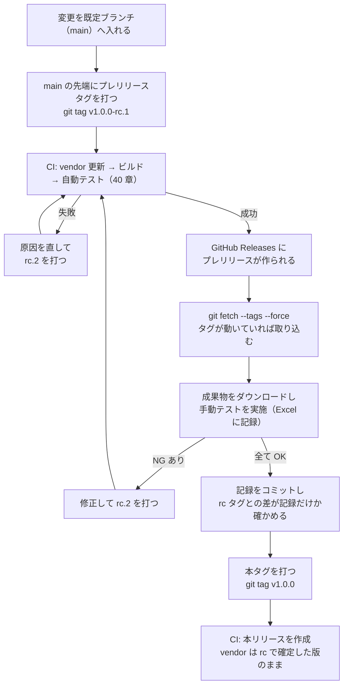

# 41. E2E テスト仕様: 手動テスト

> 索引: [README](README.md) | E2E テスト: [40](40-e2e-auto.md) / **41**

本文書は、人が操作して確認する E2E テストのケースを定める。方針・環境・自動テストは [40. 方針と自動テスト](40-e2e-auto.md) にある。

## 41.1 本文書と記録用ファイルの関係

### E2E-200: 正と生成物 **MUST**

| もの | 位置づけ |
| --- | --- |
| **本文書（41 章）** | **正**。テストケースの定義はここでのみ行う |
| `docs/tests/gen_manual_test_xlsx.py` | 本文書から記録用 Excel を生成するスクリプト |
| `docs/tests/manual_cases.py` | 本文書のケース定義の読み取りと「テストケース一覧」との照合、Excel に入れる表記の正規化。生成スクリプトが使う（4.66.0 で分けた） |
| `docs/tests/results/MarkView_手動テスト結果_v<version>.xlsx` | 生成した**実施記録用のファイル**。ケースの追加・変更はここで行わない |

- ケースを追加・変更・削除する場合、**本文書を直す**。Excel を直接編集してケースを変えない。
- Excel に記入するのは、実施日・実施環境・実施者・結果・備考といった**実施のたびに変わる情報**に限る。
- **未記入の雛形をリポジトリに置かない。** 検証するバージョンごとに生成する。複写とリネームの手順を挟まないため、雛形を誤って上書きしたまま次の検証に入る事故が起きない。
- 実施を終えた Excel は `docs/tests/results/` に置いたままコミットする。どのリリースで何を確認したかが、リポジトリの履歴として残る。

> [!IMPORTANT]
> 本文書と Excel の内容が食い違った場合、**本文書を正とする**。Excel は生成物であり、再生成すれば本文書の内容に戻る。

生成コマンド:

```bash
python docs/tests/gen_manual_test_xlsx.py --version v1.0.0-rc.1
```

`docs/tests/results/MarkView_手動テスト結果_v1.0.0-rc.1.xlsx` が作られる。ID・テストグループ・環境・優先度・概要・前提条件・手順・確認内容・関連要求に加え、表紙と各行の**ソフトウェアバージョン**が記入済みの状態で出る。

| 項目 | 内容 |
| --- | --- |
| 必要なもの | Python 3.10 以上と `openpyxl`（`pip install openpyxl`） |
| 動作環境 | Windows / Linux のどちらでもよい。**Excel のインストールは不要** |
| CI での実行 | 行わない。検証者が手元で生成する |

- スクリプトは**グループの節**（`## 41.n Gn 名称` の見出しを持つ節）の箇条書きを読み取る。**節と項目の書式を変えると生成が壊れる**ため、既存のケースと同じ形（`### E2E-nnn: 概要` と `- **環境**:` 以下の項目）を守る。
- **`手順` と `確認内容` は、どちらも番号付きリスト（`1.` `2.` …）で書く。** 記録用 Excel にも同じ番号で出る。**不具合を指摘するときに「確認内容 3 が NG」と番号で言えるようにするため**であり、文言を引き写す手間と写し間違いをなくす。1 つのケースの中に OK と NG が混在したとき、どれが NG だったかを短く正確に残せる。
- **1 項目が長くなっても、途中で改行して 2 行に分けない。** 行の頭が `1.` で始まらない行は読み取られず、**その項目が途中で切れたまま Excel に入る。**
- **Excel には、太字（`**`）とコード（`` ` ``）の記号を落として入れる。ただしコードスパンの中は書かれたとおりに残す**（4.65.0）。利用者が入力する記法そのもの（E2E-384 の `` `**fresh**` ``）は、コードスパンで書けば Excel にも `**fresh**` と出る。**4.64.0 までの生成スクリプトは先に太字を落としており、`fresh` になっていた。** 太字の範囲がコードスパンを含んでいてもよい。
- スクリプトは、抽出したケースが**「テストケース一覧」節**の一覧と**一致することを自身で検査**し、食い違えばファイルを作らずにエラーで終了する。片方だけを直したまま気づかない状態にならないようにするためである。
- **スクリプトは節番号を当てにしない。** グループの節は見出しの `Gn` で、一覧は見出しの文言「テストケース一覧」で探す。グループを増やすと後続の節番号がずれるためであり、**番号で探すと、ケースを 1 つ足しただけで生成が止まる。**

### E2E-201: 実施の単位 **MUST**

| 契機 | 実施範囲 |
| --- | --- |
| **プレリリースの初回検証**（`rc.1`） | **全ケース**を、各ケースの環境欄に挙げた環境で実施する（環境欄に W1 を含むものは W1 で、L1 を含むものは L1 で。L1 だけのケースもある。WA / LA は下の行） |
| **2 回目以降のプレリリース**（`rc.2` 以降） | 前回 NG だったケースと、修正が影響するテストグループ。それ以外は前回の結果を引き継ぐ |
| arm64 環境が入手できたとき | 環境欄に WA / LA を含むケース |

- 手動テストは**ビルドされた成果物を必要とする**ため、PR 単位の検証（BR-052）では実施しない（E2E-002, E2E-011）。PR で行うのは自動の検査だけである。
- 結果を引き継ぐ場合は、**新しい rc の版で Excel を生成し直し**、再実施しないケースの実施時の列（テスト実施日・実施環境・実施者・テスト確認結果・実測・備考・不具合番号）を前の rc のファイルから写す。**写した行は、ソフトウェアバージョンの列をその結果を得た rc の版に書き換え**、備考にもどの rc で確認した結果かを残す。**前の rc のファイルを複写して版名を改める方法は採らない**——E2E-200 が雛形を置かない理由と同じく、古い版名や古いケースの定義が残ったまま次の検証に入る。
- **本文書を改訂した場合は引き継がない。** 生成し直して全ケースを実施する。ケースの内容が変わった以上、前回の OK は別のケースに対する結果である。
- 実施で NG があった場合、修正してから次のプレリリースを作り、そのケースを再実施する。**NG のまま本リリースを行わない。**
- 「対象外」とした場合は、なぜ実施できなかったかを備考に残す。

### E2E-202: 環境コード **MUST**

40 章 E2E-010 で定めた環境コードを用いる。

| コード | 環境 |
| --- | --- |
| W1 | Windows 11 / amd64（主環境） |
| L1 | Ubuntu 24.04 / amd64 |
| WA | Windows 11 / arm64 |
| LA | Ubuntu 24.04 / arm64 |

各ケースの「環境」は**そのケースを実施すべき環境**を示す。`W1` のみのケースは Windows でだけ確認すればよい。`W1 / L1` は両方で確認する。

### E2E-203: 優先度 **MUST**

| 優先度 | 意味 |
| --- | --- |
| **高** | 壊れていると配布物として成立しない。NG ならリリースしない |
| 中 | 主要機能。NG なら原則リリースしない |
| 低 | 補助的な振る舞い。NG でも影響を判断のうえリリースしてよい |

### E2E-204: 記録する項目 **MUST**

Excel の各列の意味は以下とする。列の追加・削除は本文書の改訂を伴う。

| 列 | 内容 | 記入 |
| --- | --- | --- |
| ID | `E2E-nnn` | 生成時 |
| テストグループ | G1〜G18 とその名称 | 生成時 |
| テスト環境 | 実施すべき環境コード | 生成時 |
| 優先度 | 高 / 中 / 低 | 生成時 |
| テスト概要 | 何を確かめるケースか | 生成時 |
| 前提条件 | 実施前に整えておく状態 | 生成時 |
| テスト手順 | 操作の順序 | 生成時 |
| テスト確認内容 | 満たすべき結果 | 生成時 |
| 関連要求 | 根拠となる要求 ID | 生成時 |
| テスト実施日 | 実施した日付 | **実施時** |
| ソフトウェアバージョン | 検証した成果物のバージョン | 生成時（`--version` に渡した値）。**前の rc から結果を引き継いだ行は、その結果を得た版に書き換える**（E2E-201） |
| 実施環境 | 実際に実施した環境コード | **実施時** |
| 実施者 | 実施した人 | **実施時** |
| テスト確認結果 | OK / NG / 対象外 / 未実施 | **実施時** |
| 実測・備考 | 実際の挙動、気づいた点 | **実施時** |
| 不具合番号 | NG のとき、`docs/bugs/` の調査報告に付した `BUG-nnn`（Issue を起票した場合はその番号でもよい）。**同じ原因の NG には同じ番号を付ける** | **実施時** |

### E2E-205: リリースまでの検証手順 **MUST**

手動テストは、**利用者が受け取るのと同じ手順で作られた成果物**に対して行う（E2E-011）。そのため、本リリースの前にプレリリースを作り、その成果物を検証する。



| 手順 | 内容 |
| --- | --- |
| 1 | プレリリースタグ（`v<version>-rc.<n>`、BR-080）を**既定ブランチ（`main`）の先端に**打って push する。**作業ブランチの先端に打たない**——CI が資産を更新したとき、そのコミットを `main` へ push するのは `main` の先端がタグと一致するときだけであり（BR-043, BR-050）、一致しなければ更新はタグの側にだけ残る |
| 2 | CI の自動テスト（40 章）がすべて通ることを確認する。失敗した場合はここで止め、修正して次の rc を打つ。**通ったら `git fetch --tags --force` を実行し、CI がタグを新しいコミットへ付け替えたかを確かめる**（BR-043 の手順 7）。付け替えていれば、そのコミットを作業ブランチへ取り込む（`main` に載っていなければ `main` へも取り込む） |
| 3 | GitHub Releases のプレリリースから、検証する環境向けの成果物をダウンロードする。あわせて**リリースノートの「変更点」が BR-051 の基準どおりか**を見る（rc なら直前のタグから、本タグなら直前の本リリースから。**全履歴が並んでいたら基準の選択が壊れている**）|
| 4 | `python docs/tests/gen_manual_test_xlsx.py --version <rc タグ>` で記録用 Excel を生成し、実施範囲（E2E-201）のケースを実施して結果を記入する |
| 5 | NG があれば修正し、次の rc を打って 2 へ戻る。NG を残したまま先へ進まない |
| 6 | 全ケースが OK（または理由のある「対象外」）になったら、記入済みの Excel を `docs/tests/results/` にコミットする。**`git diff --name-only <rc タグ> HEAD` がその記録ファイル 1 つだけを返すことを確かめてから**、本タグを打つ。他のファイルが出たら本タグを打たず、rc を作り直す（BR-080） |
| 7 | 本リリースの成果物が、検証した rc と同じ内容から作られていることを確認する（下記） |

**rc で検証した内容が本リリースでも保たれること**を、以下で担保する。

- 本タグでは埋め込み資産の自動更新を行わない（BR-043）。**CI が rc のタグを付け替えていた場合は、そのコミットを取り込んでから本タグを打つ（手順 2）。** 取り込んでいれば、rc で確定した Mermaid / KaTeX / PlantUML がそのまま配布される。**取り込まずに打つと、rc で検証していない版の資産が配布される**（`v1.0.0-rc.4` で、付け替えられた KaTeX の更新がどのブランチにも載っていなかった）。
- 手順 7 の確認は、rc と本リリースの**アプリケーション情報ダイアログの `Bundled` 行が一致すること**で行う。実行ファイルのハッシュはバージョン文字列とビルド日時が異なるため一致しない。ハッシュの比較では確認できない。
- rc と本タグの間に別の変更を入れない。**例外は、その rc の手動テストの記録（`docs/tests/results/` の Excel 1 ファイル）だけである**（BR-080）。手順 6 の `git diff --name-only` で確かめる。入れた場合は改めて rc を作り直し、手動テストをやり直す。

> [!NOTE]
> プレリリースを挟まず本タグだけを打つと、**検証していない成果物が公開される**。E2E-011 が「リリースと同じ手順で作られた成果物」を求めるのは、ローカルビルドでは BR-043 の資産更新が反映されず、手元と配布物で Mermaid のバージョンが食い違いうるためである。


## 41.2 テストグループ

| グループ | 名称 | ケース |
| --- | --- | --- |
| G1 | 起動と終了 | E2E-211〜E2E-215 |
| G2 | ファイルを開く | E2E-221〜E2E-226 |
| G3 | Markdown の表示 | E2E-231〜E2E-240 |
| G4 | ファイルツリー | E2E-241〜E2E-246 |
| G5 | アウトラインと本文のスクロール | E2E-251〜E2E-253 |
| G6 | リンクと履歴 | E2E-261〜E2E-265 |
| G7 | 検索と表示倍率 | E2E-271〜E2E-274 |
| G8 | テーマ | E2E-281〜E2E-283 |
| G9 | コピー | E2E-291〜E2E-293 |
| G10 | 情報ダイアログ | E2E-301〜E2E-302 |
| G11 | 設定の永続化 | E2E-311〜E2E-315 |
| G12 | 異常系 | E2E-321〜E2E-328 |
| G13 | 配布物とアイコン | E2E-331〜E2E-334 |
| G14 | 外部エディタ | E2E-341〜E2E-345 |
| G15 | 図と画像の拡大表示 | E2E-351〜E2E-354 |
| G16 | 表の並べ替え | E2E-361〜E2E-362 |
| G17 | 右クリックメニュー | E2E-371〜E2E-373 |
| G18 | 編集モード | E2E-381〜E2E-388 |

## 41.3 G1 起動と終了

### E2E-211: 配布物のダブルクリック起動
- **環境**: W1 / L1
- **優先度**: 高
- **関連要求**: FR-013, UI-013, UC-01
- **概要**: 配布物を展開したフォルダから、引数なしで起動して README が表示されることを確認する
- **前提条件**: 配布アーカイブを展開している。**同梱の `README.md` が実行ファイルの隣にある状態**（BR-020, BR-021）から手を加えない
- **手順**:
  1. ファイルマネージャで実行ファイルをダブルクリックする
  2. ウィンドウが開くまで待つ
- **確認内容**:
  1. ウィンドウが開き、**アーカイブに同梱された `README.md`** の内容が表示される
  2. ウィンドウタイトルが `README.md - MarkView` である
  3. 起動から表示まで体感で待たされない（1 秒程度）

### E2E-212: シェルからの起動（カレントディレクトリ優先）
- **環境**: W1 / L1
- **優先度**: 高
- **関連要求**: FR-013
- **概要**: カレントディレクトリの README が、実行ファイルの隣の README より優先されることを確認する
- **前提条件**: 実行ファイルの隣と、別ディレクトリの両方に異なる内容の `README.md` を置いている
- **手順**:
  1. ターミナルで別ディレクトリへ `cd` する
  2. 実行ファイルをフルパスで引数なし起動する
- **確認内容**:
  1. **カレントディレクトリ側**の `README.md` が表示される
  2. ファイルツリーのルートがカレントディレクトリになっている

### E2E-213: 引数でファイルを指定して起動
- **環境**: W1 / L1
- **優先度**: 高
- **関連要求**: FR-012, FR-030, UI-013
- **概要**: コマンドライン引数で指定した文書が表示されることを確認する
- **前提条件**: 検証用データを配置している
- **手順**:
  1. `MarkView testdata/e2e/docs/design.md` を実行する
- **確認内容**:
  1. `design.md` の内容が表示される
  2. ファイルツリーのルートが `testdata/e2e/docs` になっている
  3. タイトルが `design.md - MarkView` である

### E2E-214: 引数でディレクトリを指定して起動
- **環境**: W1
- **優先度**: 中
- **関連要求**: FR-012
- **概要**: ディレクトリを指定した場合、そこをルートとして README が開くことを確認する
- **前提条件**: 検証用データを配置している
- **手順**:
  1. `MarkView testdata/e2e` を実行する
- **確認内容**:
  1. `testdata/e2e/README.md` が表示される
  2. ファイルツリーのルートが `testdata/e2e` になっている

### E2E-215: 終了
- **環境**: W1 / L1
- **優先度**: 高
- **関連要求**: UI-090, UI-114
- **概要**: 通常の手段で終了でき、次回起動に影響が残らないことを確認する
- **前提条件**: 文書を表示している
- **手順**:
  1. ウィンドウの閉じるボタンで終了する
  2. 再度起動する
  3. `Ctrl+Q` で終了する
- **確認内容**:
  1. いずれの手段でも終了できる
  2. 終了時にエラーダイアログが出ない
  3. 再起動時に前回の設定（テーマ・ペイン幅）が復元される

## 41.4 G2 ファイルを開く

### E2E-221: ファイル選択ダイアログから開く
- **環境**: W1 / L1
- **優先度**: 高
- **関連要求**: FR-010, UI-020
- **概要**: ツールバーのボタンからファイルを選んで開けることを確認する
- **前提条件**: MarkView が起動している
- **手順**:
  1. ツールバー左端のフォルダアイコンをクリックする
  2. `testdata/showcase.md` を選択して開く
- **確認内容**:
  1. OS 標準のファイル選択ダイアログが開く
  2. フィルタが `Markdown files` になっており、`.md` 以外が既定で表示されない
  3. 選択した文書が表示される
  4. ファイルツリーのルートが選択したファイルの親ディレクトリに変わる

### E2E-222: ショートカットでダイアログを開く
- **環境**: W1
- **優先度**: 中
- **関連要求**: FR-010, UI-090
- **概要**: `Ctrl+O` でダイアログが開くことを確認する
- **前提条件**: MarkView が起動している
- **手順**:
  1. `Ctrl+O` を押す
  2. ダイアログをキャンセルする
- **確認内容**:
  1. ダイアログが開く
  2. キャンセルしても表示中の文書が変わらない

### E2E-223: ドラッグ＆ドロップで開く
- **環境**: W1 / L1
- **優先度**: 高
- **関連要求**: FR-011, UI-070
- **概要**: ウィンドウに Markdown をドロップして開けることを確認する
- **前提条件**: MarkView が起動している。ファイルマネージャで検証用データを開いている
- **手順**:
  1. `showcase.md` をウィンドウ上へドラッグする
  2. ドラッグ中の表示を確認する
  3. ドロップする
  4. **本文中のリンクと、選択した文字を、ウィンドウの中でドラッグする**（ドロップしない。4.70.0）
  5. **拡大画面（FR-122）を開いて図をドラッグし、閉じてから手順 1・2 をもう一度行う**（4.70.0）
- **確認内容**:
  1. ドラッグ中にウィンドウ全体へオーバーレイと `Drop a Markdown file to open` の案内が出る（UI-070）。**W1 と L1 の両方で見る**（4.70.0。[BUG-020](../bugs/2026-09-21-bug-020-file-drop-webview-navigation.md)。**WebKitGTK は `dataTransfer.types` に `Files` を入れない**ため、Chromium の形だけを見る実装では L1 で出ない）
  2. ドロップした文書が表示される（FR-011）
  3. ファイルツリーのルートがドロップしたファイルの親に変わる
  4. 本文ペイン以外（ツールバー・サイドペイン）にドロップしても同じ結果になる
  5. **手順 4 では案内が出ない**（ウィンドウ内で完結するドラッグ。UI-070。**リンクのドラッグにも `text/uri-list` が付く**ため、型だけでは見分けられない）
  6. **手順 5 で案内が出る**（[BUG-020](../bugs/2026-09-21-bug-020-file-drop-webview-navigation.md)。**中止された `dragstart` で旗が固定されると、ここで二度と出なくなる**）

> [!IMPORTANT]
> **確認内容 1 と 2 以降は、壊れる原因がまったく別である。**
> **`v1.1.0-rc.1` では「1 が NG なのに 2・3 は OK」という裏返しが起きた**（L1。BUG-020）——案内が出なくても、Wails の GTK 側の経路が Go へパスを届けるため文書は開く。**「開けたから配線できている」とも言えない。**
> 1 はフロントエンドだけで完結する表示であり、2 以降は Wails を通ってパスが Go へ届くかである（[IMP-245](12-impl-frontend.md), [IMP-313](13-impl-interface.md)）。
> **1 だけが OK で 2 以降が NG になる**ことが実際に起きた（[調査報告](../bugs/2026-09-04-bug-001-file-drop-windows.md)）。**「案内が出たから配線できている」と判断しない。**
> NG のときは**どの番号が NG だったかを備考に残す**（E2E-204）。

### E2E-224: ディレクトリのドロップ
- **環境**: W1
- **優先度**: 中
- **関連要求**: FR-011, FR-030
- **概要**: ディレクトリをドロップした場合の動作を確認する
- **前提条件**: MarkView が起動している
- **手順**:
  1. `testdata/e2e` ディレクトリをウィンドウへドロップする
- **確認内容**:
  1. そのディレクトリがファイルツリーのルートになる
  2. 直下の `README.md` が表示される

### E2E-225: Markdown 以外のドロップ
- **環境**: W1
- **優先度**: 中
- **関連要求**: FR-011, FR-110
- **概要**: 対応していないファイルをドロップしたときの振る舞いを確認する
- **前提条件**: 文書を表示している
- **手順**:
  1. `.png` ファイルをウィンドウへドロップする
- **確認内容**:
  1. 表示中の文書が変わらない
  2. ステータス領域に英語のメッセージが出て、数秒後に消える
  3. アプリが異常終了しない

### E2E-226: ファイル更新の自動反映
- **環境**: W1 / L1
- **優先度**: 高
- **関連要求**: FR-014, AR-070, UC-03
- **概要**: 外部エディタで保存したときに自動で再描画され、スクロール位置が保たれることを確認する
- **前提条件**: 長めの文書（`showcase.md`）を開き、**折りたたみ（`<details>`）を 1 つ開いて**、中ほどまでスクロールしている
- **手順**:
  1. 別のエディタで同じファイルを開き、先頭付近に一文を追加して保存する
  2. MarkView の画面を見る
  3. 続けて 3 回連続で保存する
- **確認内容**:
  1. 保存後 1 秒以内に表示が更新される
  2. **スクロール位置が保たれている**（先頭に戻らない）
  3. 連続保存で表示が何度もちらつかない
  4. ファイルツリーの展開状態が保たれている
  5. **開いていた折りたたみが、開いたまま残っている**（同じ文書の再描画。FR-014, DSP-352）

## 41.5 G3 Markdown の表示

### E2E-231: GitHub 準拠の描画
- **環境**: W1 / L1
- **優先度**: 高
- **関連要求**: FR-020, MD-001, MD-002, MD-011, MD-020, MD-022, MD-023, MD-024, MD-025, MD-026, MD-033, MD-050, MD-051, MD-072, MD-073, UI-050, NFR-030, NFR-061
- **概要**: 主要な記法が GitHub と同じ体裁で表示されることを確認する
- **前提条件**: `showcase.md` を開いている。**W1 と L1 の両方で実施する**
- **手順**:
  1. GitHub 上で同じ `showcase.md` を開き、並べて比較する
  2. 見出し・段落・リスト・引用・表・水平線を上から順に見る
  3. 折りたたみ（`<details>`）・脚注・絵文字ショートコードを確認する
- **確認内容**:
  1. 見出しの階層と大きさが GitHub と同等である
  2. `h1` / `h2` の下に境界線がある
  3. 表に罫線があり、ヘッダ行が強調されている
  4. タスクリストのチェックボックスが表示され、**編集モードでない間は、クリックしても状態が変わらない**（MD-022）。**寸法は W1 と L1 で 2px 以内の差を許容する**（NFR-061。エンジンが描く部品であり、BUG-009 で許容差と決着した）。**チェック済みの塗りの色は W1 と L1 で同じであること**（4.70.0。DSP-121。[BUG-018](../bugs/2026-09-21-bug-018-task-checkbox-accent-color.md)。**色は許容差ではない**——`accent-color` を指定しており、OS のテーマのアクセント色に従ってはならない）
  5. 引用が左の縦線付きで表示される
  6. **折りたたみが開閉する**（MD-026。サニタイズで `<details>` が落ちていない）
  7. 脚注が文書末尾に一覧で描画され、参照箇所と相互に行き来できる（MD-050）
  8. `:sparkles:` などの絵文字ショートコードが絵文字になっている（MD-051）
  9. **見出しにマウスを乗せると、左側にアンカーのアイコンが出る**（MD-020, DSP-023）
  10. アイコンをクリックすると、その見出しが本文ペインの上端へ移動する
  11. **アイコンが出ても見出しの文字の位置がずれない**（絶対配置。DSP-023）
  12. アウトラインの文言にアイコンが混ざっていない（IMP-227）
  13. **生 HTML の `<script>` と `onclick` が消えている**（MD-072, NFR-030）。**配布物のサニタイズが実際に効いていることを、ここで一度だけ確かめる**
  14. **Front Matter が本文に出ていない**（MD-073）
  15. 本文の最大幅で中央寄せになり、横スクロールが出ていない（UI-050）

> [!NOTE]
> **画像はここで見ない。** `showcase.md` は読み込みに失敗するリモート画像を含むが、
> **その体裁は E2E-236 が受け持つ**（FR-022, DSP-123）。ここで重ねて見ると、
> 同じ症状が 2 つのケースから別々に報告される。
>
> **確認内容 4 は編集モードでない状態で見る。** 編集モードの間はクリックで切り替わるのが正しい（FR-141。E2E-383 が見る）。
>
> **確認内容 4 の許容差は [BUG-009](../bugs/2026-09-06-bug-009-task-checkbox-size-webkitgtk.md) で決着したものである。**
> **「W1 と L1 で同じ」と書いてはならない**——許容すると決めた以上、
> **次の実施者が同じ NG を上げない書き方にする**のがここの目的である。
>
> **本文の最大幅（確認内容 15）は倍率で変わらない。** 980 論理ピクセルの固定値であり（UI-050）、
> 倍率が効くのは文字の大きさである（FR-081, DSP-021）。**倍率は E2E-273 で見る。**

### E2E-232: シンタックスハイライト
- **環境**: W1 / L1
- **優先度**: 高
- **関連要求**: MD-030, MD-031, MD-032
- **概要**: コードブロックが言語ごとに色分けされることを確認する
- **前提条件**: `showcase.md`（Go / JSON / Shell / diff を含む）を開いている
- **手順**:
  1. 各コードブロックを目視で確認する
  2. 横に長いコードブロックを確認する
- **確認内容**:
  1. キーワード・文字列・コメントが色分けされている
  2. 配色が GitHub と同系統である
  3. 行番号が表示されていない
  4. 長い行はコードブロック内で横スクロールし、**ページ全体は横スクロールしない**

### E2E-233: GitHub Alerts
- **環境**: W1 / L1
- **優先度**: 中
- **関連要求**: MD-040
- **概要**: 5 種類の Alert が色とアイコン付きで表示されることを確認する
- **前提条件**: 5 種すべてを含む文書を開いている
- **手順**:
  1. NOTE / TIP / IMPORTANT / WARNING / CAUTION の表示を確認する
  2. `> [!FOO]` のような未知の種別も確認する
- **確認内容**:
  1. 各種別が異なる色の左ボーダーとアイコンで表示される
  2. ラベルが `Note` / `Tip` / `Important` / `Warning` / `Caution` の英語表記である
  3. **アイコンが表示されている**（サニタイズで消えていない）
  4. 未知の種別は通常の引用として表示される

### E2E-234: Mermaid 図
- **環境**: W1 / L1
- **優先度**: 高
- **関連要求**: FR-023, MD-080, MD-081, FR-050, AR-060, FR-122, UI-104
- **概要**: Mermaid 図が描画され、図の中のリンクが本文のリンクと同じく扱われ、WebView の中で遷移しないことを確認する
- **前提条件**: `testdata/e2e/mermaid.md` を開いている（E2E-012）。**ネットワークを切断しておく**
- **手順**:
  1. 1〜3 節のフローチャート・シーケンス図・クラス図の表示を確認する
  2. 4 節の構文エラーを含む Mermaid ブロックと、その後ろの 5 節の図の表示を確認する
  3. **1 節の図の `Open URL` のノード（`click` の URL）と、`label link` のノード（ラベルに書いた HTML のリンク）をクリックする**
  4. 1 節の図の `Run callback` のノード（`click` のコールバック）をクリックする
  5. 1 節の図の拡大画面を開き、`Open URL` と `label link` のノードをクリックしてから、`Esc` で閉じる
- **確認内容**:
  1. **オフラインでも図が描画される**
  2. 図が本文幅に収まっている
  3. 4 節の構文エラーのブロックはエラー内容とソースが表示され、**5 節の図は描画される**（他の図の描画を妨げない）
  4. **手順 3 で、既定のブラウザが `https://example.com/mermaid-click` と `https://example.com/mermaid-label` を開こうとする**（切断しているため、接続できない旨はブラウザの側に出る。FR-050, MD-081）。**MarkView のウィンドウは遷移せず、本文を表示したまま**である（AR-060）
  5. **手順 4 で何も起こらない**（コールバックは実行しない。`securityLevel: strict`。MD-081）
  6. **手順 5 で何も起こらない**（遷移もせず、ブラウザも開かない）。拡大画面は開いたまま（UI-104）

> [!IMPORTANT]
> **確認内容 4 の「ウィンドウが遷移しない」が要である**（[BUG-015](../bugs/2026-09-17-bug-015-mermaid-click-link-navigation.md)）。v1.0.0 では、`click` の URL のノードを押すと
> **MarkView のウィンドウの中身がリンク先に置き換わり、戻れなくなった。** 同梱の Mermaid は `strict` でもこのノードを SVG のリンク（`xlink:href`）で包む。
> **ブラウザが開いたことだけを見て OK にしない。** MarkView のウィンドウが本文のままであることを必ず見る。

### E2E-235: 数式
- **環境**: W1
- **優先度**: 中
- **関連要求**: MD-060
- **概要**: 数式が描画され、通貨表記が誤認されないことを確認する
- **前提条件**: インライン数式・ブロック数式・通貨表記を含む文書を開いている。ネットワークを切断しておく
- **手順**:
  1. `$a+b$` と `$$...$$` の表示を確認する
  2. `$100 と $200` のような通貨表記の表示を確認する
  3. `$x_1 + x_2$` の表示を確認する
- **確認内容**:
  1. オフラインでも数式が描画される
  2. 通貨表記が数式にならず、そのまま表示される
  3. `x_1` の `_` が強調（斜体）にならず、下付き文字として描画される

### E2E-236: 画像
- **環境**: W1 / L1
- **優先度**: 高
- **関連要求**: FR-022, MD-071, AR-040, NFR-061, DSP-123
- **概要**: ローカル画像とリモート画像の表示と、読み込み失敗時の体裁を確認する
- **前提条件**: 相対パス画像・存在しない画像・リモート画像を含む文書を開いている。**W1 と L1 の両方で実施する**
- **手順**:
  1. 相対パスのローカル画像を確認する
  2. 存在しない画像の箇所を確認する
  3. **ネットワークに接続した状態で**リモート画像を確認する
  4. **ネットワークを切断して**再読み込みし、リモート画像の箇所を確認する
  5. 同じ文書をもう一度開き直し、手順 2 の箇所を再確認する
- **確認内容**:
  1. ローカル画像が表示される
  2. 本文幅を超える画像が縮小されている
  3. 存在しない画像は alt テキストとプレースホルダになり、他の描画が止まらない
  4. **プレースホルダが破線 1px の枠で、alt が淡い文字色で出る**（DSP-123）
  5. **枠の中に `alt` の文字列が読める。** 枠だけが出て文字が出ない、あるいは壊れた画像のアイコン（□＋`?`）が出る場合は **NG**（BUG-008）
  6. **W1 と L1 で 4・5 の見え方が同じ**（NFR-061）
  7. リモート画像が表示される
  8. 手順 4 でも同じ破線の枠と alt になる（ローカルとリモートで扱いが変わらない）
  9. **手順 5 でも枠が出る。** 2 回目以降に枠が消える場合、配線前に失敗した画像を取りこぼしている（IMP-226）

> [!IMPORTANT]
> **確認内容 5・6 が要である**（[BUG-008](../bugs/2026-09-06-bug-008-broken-image-alt-webkitgtk.md)）。4（枠が出るか）は**こちらが CSS で描くもの**であり、両環境で出る。
> 5（`alt` が読めるか）は、**4.32.0 より前はエンジンの既定に任せていた**部分であり、
> **Linux では欠けていた**（BUG-008）。**枠だけを見て OK にしない。**
>
> **4 と 5 を分けて番号を振っているのは、この 2 つが別々に壊れるからである。**

> [!NOTE]
> **`sample.png` は縮小表示になるため、v1.1.0 からは右上に原寸表示と拡大画面のボタンが出る**（FR-120）。
> **ボタンはここで見ない。** E2E-351〜E2E-353 が受け持つ。

### E2E-237: 日本語の表示
- **環境**: W1 / L1
- **優先度**: 高
- **関連要求**: MD-010, FR-021
- **概要**: 日本語が文字化けせず、適切な書体で表示されることを確認する
- **前提条件**: 日本語を含む文書（本仕様書でよい）を開いている。`go run ./scripts/gentestdata -edit` を実行している（`generated/edit/bytes/`。E2E-012）
- **手順**:
  1. 本文・見出し・コードブロック内の日本語を確認する
  2. BOM 付き UTF-8 のファイル（`generated/edit/bytes/tasks-crlf-bom.md`。BOM と CRLF）を、**編集モードにせずに**開く
  3. CRLF 改行のファイル（`generated/edit/bytes/table-crlf.md`）を、編集モードにせずに開く
- **確認内容**:
  1. 日本語が文字化けしない。豆腐（□）にならない。**手順 2 と 3 のファイルでも見る**（4.70.0。`bytes/` の 4 つは末尾に日本語の行を持つ。E2E-012。**BOM・CRLF と多バイト文字の組み合わせ**を見るため）
  2. BOM が本文の先頭に文字として現れない
  3. CRLF のファイルで余分な改行や `^M` が現れない

### E2E-238: 仕様書自体の表示（ドッグフーディング）
- **環境**: W1
- **優先度**: 中
- **関連要求**: NFR-072
- **概要**: 本仕様書一式を MarkView で読み、実用に耐えることを確認する
- **前提条件**: `docs/specs/README.md` を開いている
- **手順**:
  1. README から各文書へ相対リンクでたどる
  2. Mermaid 図・表・Alerts・コードブロックの表示を確認する
  3. アウトラインから節へ移動する
- **確認内容**:
  1. すべての文書が破綻なく表示される
  2. リンクで文書間を移動できる
  3. 図表が正しく描画される
  4. 読み進めるうえで支障がない

### E2E-239: PlantUML 図
- **環境**: W1 / L1
- **優先度**: 高
- **関連要求**: FR-024, MD-083, MD-085, NFR-061, UI-060
- **概要**: PlantUML 図が描画され、テーマに追従することを確認する
- **前提条件**: sequence 図（Graphviz 不要）と class 図（**Graphviz 必須**）を含む文書を開いている。**ネットワークを切断しておく**
- **手順**:
  1. sequence 図と class 図の表示を確認する
  2. ツールバーのテーマボタンを押して配色を確認する
  3. PlantUML を含まない文書へ切り替え、その後もう一度戻る
- **確認内容**:
  1. **オフラインでも両方の図が描画される**
  2. **class 図（Graphviz）が描けている**。`viz-global.js` の読み込みに失敗しても sequence 図だけは描けてしまうため、**こちらを必ず見る**
  3. 図が本文幅に収まっている
  4. テーマに追従して図の配色が切り替わる
  5. 文書を戻しても図が再び描画される
  6. **L1 でも同じ図が描ける**。**速さは問わない**（性能の基準環境は W1。7.1）が、**描けなければ不具合とする**。FR-024 と MD-083 は MUST であり、対象環境を限定していない（NFR-061）
  7. **図を描いた後もステータス領域が正しい**。ファイルのパス・文字コード・行数が出ており、**PlantUML のログ 1 行（`[ nnn ms] PlantUML version ...`）に置き換わっていない**（UI-060, DSP-150）

> [!IMPORTANT]
> **確認内容 7 は図が描けた後に見る。** 文書を開いた直後は正しく、**資産の読み込みと描画が終わった時点で壊れる**。
> 早く見ると気づけない。
>
> 同梱資産が `#status` を決め打ちで書き換えていたために、**PlantUML を含む文書を開くと以降の通知がすべて
> 出なくなっていた**（[調査報告](../bugs/2026-09-05-bug-006-status-id-collision.md)）。**rc.2 では検出できなかった。**

### E2E-240: PlantUML の制限
- **環境**: W1
- **優先度**: 中
- **関連要求**: FR-024, FR-110, MD-083, MD-084, NFR-032, UI-060
- **概要**: 描けないものが、理由とともに示されることを確認する
- **前提条件**: `testdata/e2e/plantuml-limits.md` を開いている（1 節 正常な図、2 節 構文エラー、3 節 `!include`、4 節 `!includeurl`、5 節 標準ライブラリ、6 節 4096 px 超え、7 節 `salt`、8 節 `ditaa`）。**ネットワークを切断しておく**
- **手順**:
  1. 各ブロックの表示を上から順に確認する
  2. 描けなかったブロックのコピーボタンを押して貼り付ける
  3. **この文書を表示したまま、Markdown 以外のファイル（`.png` など）をウィンドウへドロップする**
- **確認内容**:
  1. 構文エラーのブロック（2 節）は **PlantUML のエラー図が図として出る**（行番号を含む。FR-024）
  2. `!include` と標準ライブラリのブロック（3〜5 節）は**図にならず**、理由と元のソースが英語で出る
  3. **4096 px 超えのブロック（6 節）は図にならず、理由と元のソースが出る。** **`Syntax Error?` の図が出たら NG**——大きさの制限に達する前に、ソースが文法違反で弾かれている（BUG-010）
  4. **`salt`（7 節）と `ditaa`（8 節）は、エラー図が出るか、理由と元のソースが出るかのどちらかである**（判定は「SVG が得られたか」だけで行うため。DSP-272）。**どちらであっても空白にならない**
  5. **どのブロックも他の図の描画を妨げない**。同じ文書内の正常な図（1 節）は描けている
  6. コピーで**元の PlantUML ソース**が貼り付けられる
  7. **待たされる箇所がない**（外部への接続試行がない。NFR-032）
  8. **図を描いた後もステータス領域が正しい**（パス・文字コード・行数が出ている。UI-060, DSP-150）
  9. **手順 3 で英語の一時メッセージが出て、数秒後に消える**（FR-110, DSP-151）

> [!IMPORTANT]
> **確認内容 3 と 4 で書き方を変えているのは、期待値を確定できるかどうかが違うからである**（[BUG-010](../bugs/2026-09-06-bug-010-plantuml-4096-testdata.md)）**。**
>
> **3（6 節）は確定できる。** 図の大きさは検証用データ側で決められるため、
> **「理由と元のソースが出る」と断定して書く**（実測: `Diagram too large for browser rendering: 72x4276 (max 4096)`）。**上限の値は MarkView が処理系へ渡す**（MD-083。1.2026.8 から処理系の既定は 8192 px であり、渡さないと 6 節が図になる。4.64.0）。
> **4.32.0 より前は 3 も「どちらでもよい」と書いており、6 節が構文エラーになっていることを見分けられなかった**（BUG-010）。
>
> **4（7・8 節）は確定できない。** `salt` / `ditaa` の返し方は同梱資産の版で変わりうる。
> **断定して書くと、資産が自動更新される（BR-043）たびに手動テストが誤って NG になる。**

> [!IMPORTANT]
> **確認内容 8・9 が要である。** この文書は描けない図を多く含むため、**処理系のログが何度も書き込まれる。**
> ステータス領域の id が同梱資産と衝突していると、**ここで確実に壊れる**
> （[調査報告](../bugs/2026-09-05-bug-006-status-id-collision.md)）。
> **9 は「通知の経路が生きているか」を見ている。** 8 が OK でも 9 が NG なら、壊れ方が違う。

> [!NOTE]
> **環境を W1 のみに留める。** 4096 px の判定は同梱した処理系の内部で行われ（値は MarkView が渡す）、
> **描画エンジンに依存しない**（実測は Chromium 系で行い、拒否のメッセージまで確認している）。
> **Linux で PlantUML が描けることは E2E-239 が W1 / L1 の両方で見ている**（NFR-061）。

## 41.6 G4 ファイルツリー

### E2E-241: ツリーの表示と切り替え
- **環境**: W1
- **優先度**: 高
- **関連要求**: FR-031, FR-034, UI-010, UI-021, UI-030, UI-041
- **概要**: ファイルツリーの表示・非表示と内容を確認する
- **前提条件**: `testdata/e2e` をルートとして起動している
- **手順**:
  1. ツールバーのファイルツリーボタンを押す
  2. ツリーの内容を確認する
  3. もう一度押して閉じる
- **確認内容**:
  1. ペインが即座に開閉する（アニメーションで待たされない）
  2. Markdown ファイルとディレクトリのみが表示される（画像・その他のファイルが出ない）
  3. `node_modules` `vendor` `.hidden` が表示されない（`.git` も同じ規則で除外される。E2E-012）
  4. ディレクトリが先、ファイルが後の順に並んでいる
  5. **両方のペインを開いたとき、左から `Files` → `Outline` → 本文の順に並ぶ**（UI-010, UI-041）
  6. ボタンが ON のとき押下状態に見える（UI-021）

### E2E-242: ツリーからのファイル選択
- **環境**: W1
- **優先度**: 高
- **関連要求**: FR-033, FR-030, UI-031
- **概要**: ツリーからファイルを選んでも、ルートが変わらないことを確認する
- **前提条件**: ツリーを表示し、複数階層の文書がある
- **手順**:
  1. `docs/design.md` をクリックする
  2. ファイルツリーのルート表示を確認する
  3. **`Tab` でツリーへフォーカスを移す**（マウスに触れない）
  4. `↑` `↓` で移動し、`→` でディレクトリを展開し、`←` で折りたたむ
  5. **一度展開したディレクトリを `←` で畳み、その状態で `↓` を押す**
  6. ファイルの上で `Enter` を押して開く
  7. **開いた直後に、マウスに触れずに `PageDown` を押す**
  8. `Alt+←` を押す
- **確認内容**:
  1. 選択した文書が表示される
  2. **ファイルツリーのルートが変わらない**
  3. 選択したファイルがツリー上で強調表示される
  4. 本文が先頭から表示される
  5. **手順 3 で、ツリーのどれか 1 つの項目にフォーカスが乗る**（枠が出る。DSP-016, DSP-330）
  6. **枠は行の高さで出る。** 展開中のディレクトリで、配下の木全体が囲まれていない（IMP-248）
  7. **手順 4 でキーボードだけで移動・展開・折りたたみができる**（UI-031）
  8. **手順 5 で、畳んだディレクトリの中へ入らず、次の兄弟へ移る**（IMP-248）
  9. **手順 6 でファイルが開く**
  10. **手順 7 で本文がスクロールする。** ツリーにフォーカスが残っていると効かない（UI-051, IMP-220 の手順 11）
  11. **手順 8 で直前の文書へ戻る。** `Alt+←` がツリーに奪われていない（UI-090, IMP-248）
  12. `↑` `↓` を押しても、**本文ペインが一緒にスクロールしない**（既定動作を抑止している。IMP-248）

> [!IMPORTANT]
> **確認内容 10 と 11 が要である。** どちらも「キーボード操作を足したことで、
> 別のものを壊していないか」を見ている。
>
> **10** は、`Enter` で開いた後にフォーカスがツリーへ残っていないかを見る。残っていると
> **利用者から見れば [BUG-007](../bugs/2026-09-05-bug-007-viewer-focus-on-open.md) と同じ症状**になる。
>
> **11** は、`Alt+←`（履歴の移動。UI-090）をツリーが奪っていないかを見る。
> **修飾キーの付いたキーをツリーが横取りすると、戻れなくなる。**

> [!NOTE]
> **手順 5 を省かない。** ツリーは遅延展開であり（FR-032）、**一度も開いていない
> ディレクトリの群は空である。** そのため「畳んだ中へ入ってしまう」誤りは、
> **一度展開してから畳んだ後でなければ現れない。**

### E2E-243: ディレクトリの展開と折りたたみ
- **環境**: W1
- **優先度**: 中
- **関連要求**: FR-032
- **概要**: 遅延展開が機能することを確認する
- **前提条件**: 階層のあるディレクトリをルートにしている
- **手順**:
  1. 折りたたまれたディレクトリをクリックして展開する
  2. 展開したまま、外部でそのディレクトリに新しい `.md` を追加する
  3. 折りたたんでから再度展開する
- **確認内容**:
  1. 展開時に子が表示される
  2. 再展開したときに、新しく追加したファイルが現れる

### E2E-244: ツリーの再読み込み
- **環境**: W1
- **優先度**: 中
- **関連要求**: FR-035, FR-015
- **概要**: ペインの再表示と再読み込みでツリーが最新になることを確認する
- **前提条件**: ツリーを表示している。**ルート直下にサブディレクトリが 1 つ以上あり、そのうち 1 つを展開しておく**（手順 6 で使う）
- **手順**:
  1. 外部でルート直下に `.md` を追加する
  2. ツリーペインを閉じて開き直す
  3. 外部でルート直下にもう 1 つ `.md` を追加する
  4. ツールバーの `Reload` を押す
  5. 外部で**展開しているサブディレクトリの直下**に `.md` を追加する
  6. **そのサブディレクトリ**を折りたたんでから開き直す
- **確認内容**:
  1. 手順 2 のあと、1 つ目の追加ファイルがツリーに現れる（FR-035 の 1 番目の契機）
  2. 手順 4 のあと、2 つ目の追加ファイルがツリーに現れる（FR-035 の 2 番目の契機）
  3. 手順 6 のあと、3 つ目の追加ファイルが**そのサブディレクトリの下に**現れる（FR-035 の 3 番目の契機）
  4. 表示中の文書がツリー上で選択されたままである（DSP-331）
  5. **`Ctrl+Shift+E` でも手順 2 と同じ結果になる**（ツールバーのボタンとショートカットが同じ経路を通る。IMP-240）

> [!IMPORTANT]
> **手順 5 はルート直下ではない。** 3 番目の契機（折りたたみ直し）が読み直すのは
> **そのディレクトリだけ**であり（[DSP-330](22-display-states.md)）、ルート直下に足しても現れない。
>
> **ツリールートは折りたためるノードではない。** ルート名はペインの見出しとして表示され（UI-030）、
> 直下の項目は一覧に並ぶ。**折りたためるのはサブディレクトリだけである。**
>
> 旧版は手順 5 を「ルート直下」としており、**手順どおりに実施すると確認内容 3 が必ず NG になった。**
> 実施者が「実装の不具合」と誤って記録しうる形であった（4.30.0 で修正）。

> [!IMPORTANT]
> **FR-035 は再読み込みの契機を 3 つ定めている。3 つとも確かめる。**
> 実装されていたのは 3 番目だけで、**1 番目と 2 番目はどの実装 ID にも割り当てられていなかった**（[調査報告](../bugs/2026-09-04-bug-002-filetree-reload-on-show.md)）。
> 旧版のこのケースは 1 番目しか見ておらず、2 番目は**手動テストでも検出できなかった。**

### E2E-245: ペイン幅の変更
- **環境**: W1
- **優先度**: 中
- **関連要求**: UI-030, UI-114
- **概要**: ペイン幅をドラッグで変更でき、保存されることを確認する
- **前提条件**: ツリーとアウトラインの両方を表示している
- **手順**:
  1. ツリーペインの右端の境界をドラッグして広げる
  2. 極端に狭く、極端に広くしてみる
  3. アプリを再起動する
- **確認内容**:
  1. ドラッグ中にカーソルが変わり、幅が追従する
  2. 下限（160px 程度）より狭くならない
  3. ウィンドウ幅の 40 % より広くならない
  4. 再起動後も変更した幅が保たれている

### E2E-246: 狭いウィンドウでの自動非表示
- **環境**: W1
- **優先度**: 中
- **関連要求**: UI-026
- **概要**: ウィンドウを狭めたときにアウトラインが一時的に隠れることを確認する
- **前提条件**: ツリーとアウトラインの両方を表示している。**両ペインの幅を既定（アウトライン 240 / ツリー 260）に戻しておく**（下記 IMPORTANT）
- **手順**:
  1. ウィンドウを最小サイズ付近まで狭める
  2. ツールバーのアウトラインボタンの状態を確認する
  3. ウィンドウを元の幅に戻す
  4. 両ペインを下限（160）まで狭めてから、もう一度ウィンドウを最小サイズ付近まで狭める
  5. ウィンドウとペインの幅を元に戻す
- **確認内容**:
  1. 手順 1 で、本文が読めなくなる前にアウトラインペインが隠れる
  2. 隠れている間も**アウトラインボタンは ON のまま**である
  3. 手順 3 でウィンドウを広げると、操作なしでアウトラインが戻る
  4. ファイルツリーは隠れない
  5. **手順 4 ではアウトラインが隠れない。それが正しい**（本文が 320px あり、閾値 240 を下回らない）

> [!IMPORTANT]
> **幅を固定せずに実施してはならない。** 隠すかどうかは `ウィンドウ幅 - アウトライン幅 - ツリー幅 < 240` で決まり、**ペイン幅は利用者が変えられて設定に保存される**（UI-030, UI-040, UI-110, UI-114）。
> **直前の E2E-245 が幅を極端に変える手順を含む**ため、続けて実施すると幅を引き継いだまま始まる。両ペインが下限（160）にあると、**最小ウィンドウ幅でも本文は 320px あり、UI-026 は発火しない**（[DSP-380](22-display-states.md) の表）。
> 実際にこの状態で NG が記録された（[調査報告](../bugs/2026-09-04-bug-003-outline-auto-hide.md)）。**幅を戻せない場合は `%TEMP%\MarkView\config.json` を削除して起動する**（設定が無くても既定値で動く。UI-113）。
> 手順 4 は「発火しないことの確認」であり、**閾値を下げて無理に発火させる修正を防ぐ。**

## 41.7 G5 アウトラインと本文のスクロール

### E2E-251: アウトラインの表示
- **環境**: W1
- **優先度**: 高
- **関連要求**: FR-040, FR-043, UI-040
- **概要**: 見出しの階層がアウトラインに反映されることを確認する
- **前提条件**: 見出しの多い文書を開いている
- **手順**:
  1. アウトラインペインの内容を確認する
  2. アウトラインボタンで開閉する
  3. 見出しのない文書を開く
- **確認内容**:
  1. 見出しが階層構造でインデント表示される
  2. 見出し内の強調やコード記法がプレーンテキストになっている
  3. コードブロック内の `#` 始まりの行が項目に含まれていない
  4. 見出しのない文書では `No headings` と表示される

### E2E-252: アウトラインからの移動
- **環境**: W1
- **優先度**: 高
- **関連要求**: FR-041
- **概要**: アウトラインのクリックで該当箇所へ移動することを確認する
- **前提条件**: 長い文書を開き、アウトラインを表示している
- **手順**:
  1. 中ほどの見出しをクリックする
  2. 末尾の見出しをクリックする
- **確認内容**:
  1. 該当する見出しがペイン上端付近に来る
  2. スクロールが即座に行われる（ゆっくり流れない）

### E2E-253: スクロール連動とキーボード操作
- **環境**: W1
- **優先度**: 高
- **関連要求**: FR-042, UI-051
- **概要**: 本文がキーボードでスクロールでき、アウトラインが追従することを確認する
- **前提条件**: 長い文書を開き、アウトラインを表示している。**開いた直後の状態にする。本文をクリックしない**
- **手順**:
  1. **マウスに一度も触れずに** `PageDown` を押す
  2. `PageUp` / `End` / `Home` / `↓` / `↑` を順に押す
  3. **ファイルツリーから別の長い文書を開き、マウスに触れずに** `PageDown` を押す
  4. 本文をゆっくりスクロールする（マウスホイール）
  5. 一気に末尾までスクロールする
- **確認内容**:
  1. **手順 1 で本文がスクロールする**（UI-051）
  2. **手順 2 のキーがすべて効く**（`End` で末尾、`Home` で先頭）
  3. **手順 3 でもスクロールする**（開く経路によらない）
  4. 現在位置の見出しがアウトライン上で強調される
  5. 強調が 1 つだけである
  6. 強調項目がアウトラインの表示範囲外に出そうなとき、自動でスクロールして見える位置に来る
  7. スクロールがカクつかない

> [!IMPORTANT]
> **手順 1 を、本文をクリックする前に行う。** 本文ペインは `tabindex="-1"` を持つため、
> **一度クリックするとフォーカスが入り、以降はキーが効いてしまう**（IMP-202）。
> **クリックしてから確かめると、不具合があっても OK になる。**
>
> 実際に、この順序でなかったために **rc.2 では検出できなかった**
> （[調査報告](../bugs/2026-09-05-bug-007-viewer-focus-on-open.md)）。旧版の手順は
> 「本文をゆっくりスクロールする」から始まっており、**先にマウスで触れることが前提になっていた。**

> [!NOTE]
> **スクロール位置が保たれるかは別のケースが持つ。** フォーカス移動が `preventScroll` を欠くと
> 位置が先頭へ戻るため（IMP-220 の条件 1）、**本ケースが OK でもあちらが NG になりうる。**
>
> | 契機 | 見るケース |
> | --- | --- |
> | 手動の再読み込み（`F5`。FR-015） | **E2E-274 の確認内容 4** |
> | ファイル更新の自動検知（FR-014） | E2E-226 の確認内容 2 |
> | 履歴での復元（`Alt+←`。FR-051） | E2E-262 の確認内容 2 |
> | テーマ切り替え（UI-105） | E2E-281 の確認内容 5 |
> | 編集モードの書き込みの後の再描画（FR-143） | E2E-383 の確認内容 9 |

## 41.8 G6 リンクと履歴

### E2E-261: 相対リンクでの文書間移動
- **環境**: W1
- **優先度**: 高
- **関連要求**: FR-050, AR-042, MD-070, UC-05
- **概要**: `.md` へのリンクが同じウィンドウで開くことを確認する
- **前提条件**: `README.md` から `docs/design.md` へのリンクがある
- **手順**:
  1. README 内のリンクをクリックする
- **確認内容**:
  1. **同じウィンドウ**でリンク先が表示される（新しいウィンドウが開かない）
  2. ファイルツリーのルートが変わらない
  3. タイトルとステータスのパス表示が更新される
  4. アウトラインが新しい文書のものに切り替わる

### E2E-262: 履歴での前後移動
- **環境**: W1
- **優先度**: 高
- **関連要求**: FR-051
- **概要**: `Alt+←` で元の文書に戻れ、位置も復元されることを確認する
- **前提条件**: 長い README の中ほどにリンクがある
- **手順**:
  1. README を中ほどまでスクロールしてリンクをクリックする
  2. `Alt+←` を押す
  3. `Alt+→` を押す
- **確認内容**:
  1. `Alt+←` で README に戻る
  2. **戻った位置が、リンクをクリックしたときのスクロール位置である**（先頭に戻らない）
  3. `Alt+→` で再びリンク先へ進む

### E2E-263: アンカー付きリンク
- **環境**: W1
- **優先度**: 中
- **関連要求**: FR-050, MD-021, AR-053
- **概要**: 見出しへのリンクが機能することを確認する
- **前提条件**: 同一文書内アンカーと、他文書のアンカー付きリンクがある
- **手順**:
  1. 同一文書内の `#見出し` リンクをクリックする
  2. `./other.md#section` 形式のリンクをクリックする
  3. 日本語見出しへのリンクをクリックする
  4. **全角の括弧や中黒を含む見出しへのリンク**をクリックする
  5. **`#user-content-` で始まるリンク**（GitHub が出力する見出しの `id` を直接指した形）をクリックする
- **確認内容**:
  1. 該当見出しの位置までスクロールする
  2. 他文書のアンカーでは、文書が切り替わったうえで該当位置に移動する
  3. 日本語見出しへのリンクも機能する
  4. **全角記号を含む見出しへのリンクも機能する**（MD-021 の 4）。`docs/specs/90-traceability.md` の 90.1 節にある 3 本のリンクがこれに当たり、**そのまま検証に使える**
  5. **手順 5 のリンクも、同じ見出しへ移る**（MD-021, AR-053）。`testdata/e2e/id-collision.md` の `[→ Overlay](#user-content-overlay)` を使ってよい

### E2E-264: 外部リンクと画像リンク
- **環境**: W1 / L1
- **優先度**: 高
- **関連要求**: FR-050, FR-053, FR-110, AR-060
- **概要**: 外部 URL と画像リンクが OS 側に委譲され、委譲できないときは本文を残したまま通知されることを確認する
- **前提条件**: `testdata/e2e/README.md` を開いている（`https://` のリンクと、`./docs/img/sample.png` へのリンク `図を既定のビューアで開く` と、`./docs/design.md` へのリンク `docs/design.md を開く` がある。E2E-012）
- **手順**:
  1. 外部 URL のリンクをクリックする
  2. 画像へのリンクをクリックする
  3. L1 のみ: MarkView を終了し、`xdg-open` が見つからない状態で起動し直して（`env PATH=/nonexistent <MarkView の絶対パス> testdata/e2e/README.md`）、画像へのリンクをクリックする
  4. 外部 URL のリンク、画像へのリンク、`docs/design.md を開く` のリンクを、それぞれ**マウスの中ボタン**で押す（L1 で手順 3 を行った後は、MarkView を終了して通常どおり `testdata/e2e/README.md` で起動し直してから）
- **確認内容**:
  1. 外部 URL が**既定のブラウザ**で開く。MarkView のウィンドウ内で遷移しない
  2. 画像が**OS の既定画像ビューア**で開く
  3. どちらの場合も MarkView の表示内容が変わらない
  4. **手順 3 で、本文が消えずに残り、ステータス領域に `Cannot open:` で始まるエラーが出る**（FR-053, FR-110）。**`Failed to render this document.` の状態画面が出たら NG**（[BUG-013](../bugs/2026-09-14-bug-013-link-open-failure-state-screen.md)）
  5. **手順 4 で、どのリンクでも何も起きない**——ブラウザも画像ビューアも開かず、新しいウィンドウも開かず、MarkView は `README.md` を表示したまま（リンク先の文書やページに置き換わらない）（AR-060, FR-050。[BUG-016](../bugs/2026-09-17-bug-016-link-middle-click.md)）

> [!NOTE]
> **手順 3 は L1 だけで行う。** W1 の委譲（`rundll32.exe`）は起動そのものが失敗しないため、この経路を作れない。W1 では確認内容 4 を「対象外」とし、備考に残す。
> `PATH` を存在しないディレクトリにするのは、`xdg-open` をアンインストールせずに「既定のアプリケーションで開けない」状態を作るためである。
> **修正の前（v1.0.0）では、本文が消えて状態画面になり NG になる**（BUG-013）。修正を入れる前に一度確かめる。
>
> **手順 4 は W1 と L1 の両方で行う。** L1 は手順 3 の状態（`xdg-open` が見つからない）のまま行わない——ブラウザやビューアが開かないことが確認にならず、手順 3 の `Cannot open:` の通知も残っている。
> **修正の前（v1.0.0）では、W1 で `docs/design.md を開く` が既定のブラウザへ回って表示されず、L1 では MarkView のウィンドウがリンク先に置き換わって戻れなくなる**（BUG-016）。**確認内容 5 は、ウィンドウが `README.md` のままであることまで見る。**

### E2E-265: ツリー外への遷移
- **環境**: W1
- **優先度**: 中
- **関連要求**: FR-052, UI-060
- **概要**: ツリールート外の文書を開いたときの表示を確認する
- **前提条件**: `docs/` をルートとし、`../outside/external.md` へのリンクがある
- **手順**:
  1. ツリー外へのリンクをクリックする
  2. `Alt+←` で戻る
- **確認内容**:
  1. 文書は表示される
  2. **ファイルツリーのルートも展開状態も変わらない**
  3. ツリー上の強調表示がなくなる
  4. ステータスに絶対パスと `(outside tree)` が表示される
  5. 戻ると強調表示が復活する

## 41.9 G7 検索と表示倍率

### E2E-271: 文書内検索
- **環境**: W1
- **優先度**: 高
- **関連要求**: FR-080, UI-080, MD-026
- **概要**: 検索の基本動作を確認する
- **前提条件**: 長い文書を開いている。**コードブロックと折りたたみ（`<details>`）を含むもの**とする（`docs/showcase.md` でよい）。**折りたたみは閉じた状態にしておく**
- **手順**:
  1. `Ctrl+F` を押す
  2. 複数箇所にある語を入力する
  3. `Enter` と `Shift+Enter` で移動する
  4. **検索バーの ∧ / ∨ ボタンを数回ずつクリックして移動する**
  5. 本文をホイールで大きくスクロールする
  6. **コードブロックが検索バーの真下に来る位置までスクロールし、そこで ∨ ボタンを押す**
  7. **折りたたみの中にしかない語を入力し、∨ ボタンで移動する**
  8. `Esc` で閉じ、手順 7 で開いた折りたたみを見る
  9. ヒットしない語を入力する
  10. `Esc` で閉じる
  11. **`go run ./scripts/gentestdata` で作った `testdata/e2e/generated/slow-plantuml.md` を開き、開いた直後に `Ctrl+F` で `zzqpending` と入力する**（E2E-012）
  12. **いちばん下の図のソースが消えて、理由とともに戻るまで待つ**（十数秒）
  13. `Enter` を 2 回押す
- **確認内容**:
  1. 検索バーが本文の右上に出て、本文が押し下げられない
  2. 入力に応じて即座にハイライトされる
  3. 現在位置のヒットが他と異なる色で示される
  4. `3 / 12` のようなヒット数が表示される
  5. **`Enter` / `Shift+Enter` で移動するたびに、該当箇所までスクロールする**（FR-080）
  6. **∧ / ∨ ボタンでも同じように移動する。** キーボードと同じ結果になる
  7. **移動したあとも検索バーが本文ペインの右上に見えており、続けてボタンを押せる**
  8. **本文をスクロールしても検索バーは右上に留まり、スクロールバーに重ならない**（DSP-160）
  9. **コードブロックやコピーボタンの上に来ても、検索バーが手前にあり、ボタンが押せる**（DSP-015）
  10. **手順 7 で、閉じていた折りたたみが開き、該当箇所までスクロールする**（FR-080, MD-026）
  11. **手順 7 のヒットが件数に入っている。** 折りたたみを閉じていても数が変わらない（UI-080）
  12. **手順 8 で、開いた折りたたみが閉じ直されずに開いたままである**
  13. ヒットしないとき `No results` が表示される
  14. `Esc` でハイライトが消え、本文が元に戻る
  15. **手順 11 で 2 件（冒頭の段落と、いちばん下の図のソース）がハイライトされ、`1 / 2` と出る**
  16. **手順 12 の後も 2 件のままで、戻ったソースの `zzqpending` にハイライトが付いている**（[BUG-017](../bugs/2026-09-18-bug-017-search-hits-before-rendering.md)。件数だけが残る状態になっていない）
  17. **手順 12 で本文のスクロール位置が動かない**（描き終えただけでは移動しない。FR-080）
  18. **手順 13 で、押すたびにハイライトされた箇所へ移動する**（件数だけが進んで何も起きない回が無い）

> [!IMPORTANT]
> **手順 4 と 5 を省かない。** FR-080 は移動手段を「`Enter` / `Shift+Enter` **または検索バーの
> ボタン**」の 2 つ定めている。**キーボードだけを試すと、ボタン経路だけが壊れている状態を
> 通してしまう。** 実際に通り抜けた（[調査報告](../bugs/2026-09-03-search-jump-buttons.md)）。
>
> **手順 6 も省かない。** 検索バーは本文の上に重なるため、**下に何が来るかで押せるかが変わる。**
> コードブロックは `position: relative`、コピーボタンは `z-index: 10` を持ち（DSP-015）、
> **重なり順を 1 つ間違えるとボタンへクリックが届かなくなる。**
> 2026-09-03 の修正で実際に起きており、**利用者の文書にたまたまコードブロックがあったから
> 見つかった。** 前提条件にコードブロックを含めたのはこのためである。

> [!IMPORTANT]
> **手順 7 と 8 も省かない。** 閉じた `<details>` の中の要素は**スクロール先として指定できない**ため、
> ハイライトも件数も現在位置の強調も正しく作れるのに、**スクロールだけが黙って何もしない**
> （[MD-026](04-markdown.md), [調査報告](../bugs/2026-09-04-bug-004-search-collapsed-details.md)）。
> **「ハイライトが付いた」を「移動できた」の証拠にしない。**
>
> **検索語の選び方で結果が変わる。** 折りたたみの外にもある語を選ぶと、そちらへ移動して
> しまい通過する。**折りたたみの中にしかない語を選ぶ。** 前回はたまたま当たったために
> 見つかった。

### E2E-272: 検索状態のリセット
- **環境**: W1
- **優先度**: 中
- **関連要求**: FR-080
- **概要**: 文書を切り替えたときに検索状態が残らないことを確認する
- **前提条件**: 検索してハイライトが出ている
- **手順**:
  1. 検索したまま別の文書を開く
  2. 元の文書に戻る
- **確認内容**:
  1. 文書切り替えで検索バーが閉じる
  2. ハイライトが残っていない
  3. 元の文書に戻ってもハイライトが残っていない

### E2E-273: 表示倍率
- **環境**: W1
- **優先度**: 中
- **関連要求**: FR-081, UI-050, UI-060, UI-111, UI-115
- **概要**: 倍率の変更と、保存されないことを確認する
- **前提条件**: 文書を表示している
- **手順**:
  1. `Ctrl` + `+` を数回押す
  2. `Ctrl` + マウスホイールを操作する
  3. `Ctrl+0` を押す
  4. 倍率を 140 % にしたまま終了し、再起動する
  5. **図と画像を含む文書（`showcase.md`）を開き、`Ctrl` + `+` で 300 % まで上げる**
- **確認内容**:
  1. 本文の文字が拡大・縮小する
  2. **ツールバーとサイドペインの文字サイズは変わらない**
  3. 上限（300 %）と下限（50 %）で止まる
  4. `Ctrl+0` で 100 % に戻る
  5. 100 % 以外のときステータスに倍率が表示される
  6. **再起動すると 100 % に戻っている**（倍率は保存しない。UI-111）
  7. 再起動後のステータスに倍率が表示されない
  8. **手順 5 で、本文の文字は大きくなるが、画像・Mermaid 図・PlantUML 図の大きさは変わらない**（DSP-021）。**本文の最大幅（980 論理ピクセル）も変わらない**（UI-050）

> [!NOTE]
> **確認内容 8 は「変わらないこと」を見ている。** 倍率が変えるのは文字の大きさと、
> `em` で定義した余白だけである（DSP-021）。**4.35.0 より前の表示仕様は「画像・図も倍率に
> 追随する」と書いていたが、実測すると追随しない。** 記述を実態へ合わせたうえで、
> **その実態を確かめるケースをここに置いた。**

### E2E-274: キーボードショートカット
- **環境**: W1
- **優先度**: 中
- **関連要求**: FR-015, FR-140, UI-090
- **概要**: 定義されたショートカットが機能することを確認する
- **前提条件**: 文書を表示している。**長い文書を開き、中ほどまでスクロールしておく**
- **手順**:
  1. `F5` / `Ctrl+R`（再読み込み）
  2. `Ctrl+Shift+T`（テーマ）
  3. `Ctrl+Shift+O`（アウトライン）
  4. `Ctrl+Shift+E`（ファイルツリー）
  5. `F1`（情報ダイアログ）。確かめたら `Esc` で閉じる
  6. `Ctrl+Shift+M`（編集モード）を 2 回
- **確認内容**:
  1. 各ショートカットが対応する動作を行う
  2. ツールバーのボタンを押した場合と同じ結果になる
  3. 検索バーに入力中は、テキスト編集のキーが優先される
  4. **手順 1 のあと、スクロール位置が保たれている**（先頭に戻らない。FR-015, DSP-350）
  5. **手順 6 で編集モードが始まって終わり、ツールバーのボタンの押下状態が同じく切り替わる**（FR-140, UI-090）。WebView が `Ctrl+Shift+M` を横取りしない

> [!IMPORTANT]
> **確認内容 4 は、手動の再読み込みで位置が維持されることを見る唯一のケースである。**
> DSP-350 は契機ごとにスクロール位置を定めているが、**`F5` の「維持」を確かめる手順が
> どのケースにも無かった**（4.28.0 で追加）。
>
> **文書を表示した時点で本文ペインへフォーカスを移す**（IMP-220 の手順 11）ため、
> **その実装が `preventScroll` を欠くとここが NG になる**（IMP-220 の条件 1）。

## 41.10 G8 テーマ

### E2E-281: テーマの切り替え
- **環境**: W1 / L1
- **優先度**: 高
- **関連要求**: FR-070, UI-105
- **概要**: Light / Dark の切り替えが全体に即座に反映されることを確認する
- **前提条件**: Mermaid 図・PlantUML 図・コードブロックを含む文書を開いている
- **手順**:
  1. ツールバーのテーマボタンを押す
  2. 各部の配色を確認する
  3. もう一度押して戻す
- **確認内容**:
  1. 本文・ツールバー・サイドペイン・ステータス・スクロールバーのすべてが切り替わる
  2. **ちらつきや再読み込みが起きない**
  3. コードブロックのハイライト配色も切り替わる
  4. **Mermaid 図と PlantUML 図の配色も切り替わる**
  5. スクロール位置が保たれている

### E2E-282: 初回起動時のテーマ
- **環境**: W1 / L1
- **優先度**: 中
- **関連要求**: FR-071
- **概要**: 設定がない状態で OS のテーマに追従することを確認する
- **前提条件**: 設定ファイル（`%TEMP%\MarkView` / `/tmp/MarkView-<uid>`）を削除している
- **手順**:
  1. OS をダークモードにして起動する
  2. 終了して設定を削除し、OS をライトモードにして起動する
- **確認内容**:
  1. OS の設定に応じたテーマで起動する

### E2E-283: テーマ切り替え時の状態保持
- **環境**: W1
- **優先度**: 低
- **関連要求**: UI-105, FR-121, FR-130, FR-140
- **概要**: テーマを切り替えても操作状態が失われないことを確認する
- **前提条件**: 検索してヒットがある状態、ツリーを展開した状態。`testdata/e2e/media.md` と `testdata/e2e/tables.md` がある（E2E-012）
- **手順**:
  1. 検索バーを開いた状態でテーマを切り替える
  2. ツリーを展開した状態でテーマを切り替える
  3. `tables.md` を開いて 1 節の表を並べ替え、テーマを切り替える
  4. `media.md` を開いて 1 節の図を原寸表示にし、テーマを切り替える
  5. `go run ./scripts/gentestdata -edit` の後に `generated/edit/tasks-lf.md` を開いて編集モードにし、テーマを切り替える
- **確認内容**:
  1. 検索バーと検索語、ヒットのハイライトが保たれる
  2. ツリーの展開状態が保たれる
  3. 手順 3 で並べ替えが保たれる（DSP-370）
  4. **手順 4 で、図が新しい配色で描き直された後も原寸表示のまま**である（FR-121, DSP-370）
  5. 手順 5 で編集モードが保たれ、枠とラベルが新しい配色になる（FR-140, DSP-370）

## 41.11 G9 コピー

### E2E-291: コードブロックのコピー
- **環境**: W1 / L1
- **優先度**: 高
- **関連要求**: FR-060, FR-061, AR-062
- **概要**: コピーボタンでコードをクリップボードに取得できることを確認する
- **前提条件**: 複数のコードブロックを含む文書を開いている
- **手順**:
  1. コードブロックにマウスを乗せる
  2. 右上のコピーボタンを押す
  3. テキストエディタに貼り付ける
- **確認内容**:
  1. コピーボタンがコードブロックの右上にあり、内容と重なっていない
  2. ホバーで見やすくなる
  3. 押すとアイコンが変わり、1〜2 秒で戻る
  4. 貼り付けた内容が**元のコードと完全に一致する**（HTML タグや行番号が混ざらない）
  5. インデントが保たれている

### E2E-292: Mermaid・PlantUML のコピー
- **環境**: W1
- **優先度**: 中
- **関連要求**: FR-060, IMP-115, IMP-119
- **概要**: 描画後の図から元のソースをコピーできることを確認する
- **前提条件**: Mermaid 図と PlantUML 図が描画されている
- **手順**:
  1. Mermaid 図のコピーボタンを押して貼り付ける
  2. PlantUML 図のコピーボタンを押して貼り付ける
- **確認内容**:
  1. **図ではなく元の Mermaid ソース**が貼り付けられる
  2. **図ではなく元の PlantUML ソース**が貼り付けられる。どちらも描画後に `<pre>` が SVG へ置き換わるため、**同じ壊れ方をする**

### E2E-293: 選択範囲のコピー
- **環境**: W1
- **優先度**: 低
- **関連要求**: FR-062
- **概要**: 本文の任意の範囲をコピーできることを確認する
- **前提条件**: 文書を表示している
- **手順**:
  1. 本文の一部をマウスで選択する
  2. `Ctrl+C` を押して貼り付ける
- **確認内容**:
  1. 選択した範囲がコピーされる

> [!NOTE]
> **右クリックメニューの `Copy` が `Ctrl+C` と同じ内容を格納することは、E2E-371 が見る**（FR-063）。

## 41.12 G10 情報ダイアログ

### E2E-301: 情報ダイアログの表示
- **環境**: W1 / L1
- **優先度**: 高
- **関連要求**: FR-100, UI-100, UI-025, UI-102, BR-042
- **概要**: アプリケーション情報が正しく表示されることを確認する
- **前提条件**: MarkView が起動している
- **手順**:
  1. ツールバー右端の「?」を押す
  2. 表示内容を確認する
  3. **リポジトリ URL をクリックする**
  4. `Esc` で閉じる
- **確認内容**:
  1. **アプリケーションアイコン**が見出し横に表示される
  2. バージョンが `dev` ではなく、**いま検証しているプレリリースタグ**（`v<version>-rc.<n>`）と一致する（E2E-205）
  3. 作成者が `kznagamori`、リポジトリ URL が正しい
  4. **実行環境が 4 項目そろって表示される**（OS / アーキテクチャ / Go / **WebView の版**）。W1 では `WebView2 <版>`、L1 では `WebKitGTK <版>`（UI-100, AR-001）
  5. **同梱資産（Mermaid / KaTeX / PlantUML）のバージョン**が表示される
  6. **Viz.js / Graphviz / Expat はここに出ない**（UI-100）。ライセンス表示（E2E-302）の側で確かめる
  7. **リポジトリ URL のクリックで既定ブラウザが開き、ダイアログ内では遷移しない**（UI-102）
  8. 背後のメインウィンドウが操作できない（ファイルのドロップを除く。UI-090, E2E-373）
  9. `Esc`、閉じるボタン、外側クリックのいずれでも閉じる

> [!IMPORTANT]
> **`Environment` 行の項目数を数える。** WebView の版が取れないとき、その区画は**行ごと省かれるのではなく、静かに 1 項目減るだけ**である（[IMP-181](11-impl-backend.md)）。行そのものは自然に見えるため、**「4 項目そろっているか」を数えないと気づけない。**
> 実際に、呼び出し側が常に空文字を渡していたために 3 項目で出ていた（[調査報告](../bugs/2026-09-04-bug-005-about-webview-version.md)）。**単体テストは緑のまま通り抜ける。**

### E2E-302: OSS ライセンス表示
- **環境**: W1
- **優先度**: 高
- **関連要求**: FR-101, UI-101, AR-032, BR-040, NFR-051
- **概要**: 依存パッケージのライセンスが全文表示されることを確認する
- **前提条件**: 情報ダイアログを開いている
- **手順**:
  1. ライセンス欄をスクロールする
  2. 一部を選択してコピーする
  3. リポジトリ URL をクリックする
- **確認内容**:
  1. 主要な依存（Wails / goldmark / chroma / bluemonday / fsnotify / Mermaid / KaTeX / **PlantUML / Viz.js / Graphviz / Expat**）が含まれている
  2. **Graphviz の EPL-2.0 の全文が入っている**（NFR-051, BR-040）。Viz.js と Expat の MIT 全文も入っている
  3. **Graphviz と Expat のバージョン欄が `—` になっている**（BR-042。版が分からないものを一覧から落としていないこと）
  4. 各パッケージの名称・バージョン・ライセンス種別・全文がある
  5. テキストを選択・コピーできる
  6. URL クリックで既定ブラウザが開く

> [!NOTE]
> **ライセンス欄の右クリックメニュー（`Copy` / `Select all`）は E2E-373 が見る**（FR-063）。

## 41.13 G11 設定の永続化

### E2E-311: 設定の保存と復元
- **環境**: W1 / L1
- **優先度**: 高
- **関連要求**: UI-110, UI-114
- **概要**: 設定が次回起動時に復元されることを確認する
- **前提条件**: MarkView が起動している
- **手順**:
  1. テーマを Dark に、ペインを両方表示にし、幅を変える
  2. ウィンドウサイズを変える
  3. 終了して再起動する
- **確認内容**:
  1. テーマ・ペインの表示状態・ペイン幅・ウィンドウサイズが復元される

### E2E-312: 位置・倍率・最大化状態が保存されないこと
- **環境**: W1
- **優先度**: 高
- **関連要求**: UI-011, UI-111, UI-115
- **概要**: ウィンドウごとに変わる値が保存されず、常に既定の状態で開くことを確認する
- **前提条件**: MarkView が起動している
- **手順**:
  1. ウィンドウを画面の隅へ移動して終了する
  2. 再起動する
  3. （可能なら）外部ディスプレイへ移動して終了し、ディスプレイを外して再起動する
  4. ウィンドウを最大化し、倍率を 150 % にして終了する
  5. 再起動する
  6. ウィンドウのサイズを変えてから最大化し、その状態で終了して再起動する
- **確認内容**:
  1. **常にプライマリモニタの中央に表示される**
  2. ディスプレイ構成が変わっても、ウィンドウが画面外に出ない
  3. **手順 5 で通常状態（最大化されていない）で開く**
  4. **手順 5 で倍率が 100 % に戻っている**
  5. **手順 6 で、最大化する前に指定したサイズで開く**（最大化中の画面いっぱいのサイズが保存されていない）

### E2E-313: 設定の保存先
- **環境**: W1 / L1
- **優先度**: 中
- **関連要求**: UI-112, AR-004, NFR-031, NFR-033, NFR-042, UI-111, FR-140, FR-144
- **概要**: 設定と WebView のデータがテンポラリ以外に書き込まれないことを確認する
- **前提条件**: 設定を変更して終了している。**その前に `generated/edit/tasks-lf.md` を開いて編集モードにし、チェックボックスを 1 つ切り替えてから終了している**（`go run ./scripts/gentestdata -edit`）
- **手順**:
  1. Windows: `%TEMP%\MarkView\config.json` を確認する
  2. Linux: `/tmp/MarkView-<uid>/config.json` とパーミッションを確認する
  3. config.json の中身を確認する
  4. Windows: `%TEMP%\MarkView\webview2\EBWebView` があることを確認する
  5. Windows: **`%APPDATA%\MarkView.exe` が作られていないこと**を確認する（実行ファイル名と同じ名前のディレクトリ）
  6. Windows: `%APPDATA%` / `%LOCALAPPDATA%` に MarkView 関連のディレクトリがないことを確認する
  7. Linux: `~/.config` に MarkView 関連のファイルがないことを確認する
  8. Linux: `~/.local/share` と `~/.cache` を確認し、**WebKitGTK が作ったディレクトリの名前と実サイズを記録する**
- **確認内容**:
  1. テンポラリディレクトリに設定ファイルがある
  2. Linux でディレクトリが `0700`、ファイルが `0600` である
  3. **開いたファイルのパス・履歴・ウィンドウ位置・倍率・編集モードの状態・取り消しの履歴が記録されていない**（UI-111, NFR-042, FR-140, FR-144）
  4. Windows: WebView2 のデータが `%TEMP%\MarkView\webview2` の下にある（AR-004）
  5. Windows: **`%APPDATA%\MarkView.exe` が存在しない。** 存在したら `WebviewUserDataPath` の指定漏れである（IMP-193）
  6. Windows: `%APPDATA%` / `%LOCALAPPDATA%` に何も作られていない
  7. Linux: `~/.config` に何も作られていない
  8. Linux: `~/.local/share` / `~/.cache` の内容を**記録する**（NG にはしない。AR-004 の既知の例外）

> [!NOTE]
> 手順 8 は**現状を確定させるための実測**である。Linux には WebKitGTK のデータ領域を指定する手段が無く（AR-004）、既定の位置を仕様が断定できていない。ここで得た名前とサイズを AR-004 の表へ書き戻す。**この項目だけは、結果が想定と違っても NG としない。**

### E2E-314: 設定が失われた場合
- **環境**: W1 / L1
- **優先度**: 中
- **関連要求**: UI-113
- **概要**: 設定がなくても壊れていても正常に起動することを確認する
- **前提条件**: 設定ファイルが存在する
- **手順**:
  1. 設定ファイルを削除して起動する
  2. 終了し、設定ファイルの中身を `{` だけにして起動する
  3. 終了し、`"windowWidth"` に `100` を書き込んで起動する
  4. 終了し、`"zoom": 200` と `"windowMaximized": true` を書き足して起動する
- **確認内容**:
  1. いずれの場合もエラーを出さずに起動する
  2. 既定値（または丸めた値）で表示される
  3. **手順 4 の 2 つのキーは無視される**（倍率は 100 %、ウィンドウは通常状態。UI-111）
  4. 起動後に設定を変更して終了すると、正常な設定ファイルに戻る。**書き足したキーは消えている**

### E2E-315: 多重起動
- **環境**: W1 / L1
- **優先度**: 高
- **関連要求**: UI-115, UI-111, UI-112
- **概要**: 複数同時に起動して並べて使えることを確認する
- **前提条件**: 検証用データに 2 つ以上の Markdown ファイルがある
- **手順**:
  1. MarkView を 2 つ起動し、それぞれ別のファイルを開く
  2. 2 つを画面に並べ、片方だけを最大化する
  3. 片方の倍率を 200 % にする
  4. 片方でテーマを Dark に切り替える
  5. 3 つ目を起動する
  6. すべて終了し、もう一度 1 つ起動する
- **確認内容**:
  1. **2 つ目以降も普通に起動する。** 最初のウィンドウが前面に出るだけ、といった単一インスタンス化の挙動をしない
  2. それぞれが独立して文書・ツリー・アウトライン・検索・履歴を持つ
  3. **片方の最大化・倍率が、もう片方に影響しない**
  4. 手順 5 の 3 つ目は、**通常状態・倍率 100 %** で開く（UI-111）
  5. 手順 4 のテーマは、**既に起動しているウィンドウには反映されない**（実行中の再読み込みは行わない。UI-115）
  6. 手順 6 で設定ファイルが壊れておらず、エラーも出ない
  7. 手順 6 のテーマ・ペイン・ウィンドウサイズは、**最後に終了したウィンドウの状態**になっている（後勝ち。UI-115）

> [!NOTE]
> 最後の 2 つが UI-115 の核心である。設定は「後勝ちで上書きされても不都合が小さいもの」に限ると定めたため、**後勝ちであること自体は不具合ではない。** 倍率と最大化状態を保存対象から外したのは、この 2 つだけが後勝ちだと利用者の意図と食い違うからである。

## 41.14 G12 異常系

### E2E-321: 存在しないファイルの指定
- **環境**: W1 / L1
- **優先度**: 高
- **関連要求**: FR-012, FR-110, UI-024, UI-060, NFR-050, NFR-062
- **概要**: 不正な引数でも起動し、案内が出ることを確認する
- **前提条件**: 配布物を展開し、ターミナルでそのディレクトリにいる
- **手順**:
  1. `MarkView nosuch.md` を実行する
  2. `MarkView /nonexistent/dir` を実行する
- **確認内容**:
  1. ウィンドウが開く（起動が失敗しない）
  2. エラーがステータス領域に英語で表示される
  3. モーダルダイアログが出ない

### E2E-322: 大きなファイル
- **環境**: W1
- **優先度**: 中
- **関連要求**: FR-016, FR-014, FR-015, FR-051, UI-052, UI-060, DSP-302
- **概要**: 大きなファイルの確認画面と上限の動作と、状態画面の間のステータス領域・ツリーの強調・再読み込み・前の文書の監視・確認の引き継ぎを確認する
- **前提条件**: `go run ./scripts/gentestdata` を実行している（`generated/large-12mb.md` / `generated/large-60mb.md`。E2E-012）。`MarkView testdata/e2e` で起動し、ツリーから `generated/README.md` を開いている。ターミナルのカレントディレクトリを `testdata/e2e/generated` にしている
- **手順**:
  1. ツリーから `large-12mb.md` を開く
  2. ウィンドウタイトルと、ステータス領域の左のパスと、ツリーの強調を見る
  3. 確認画面のまま `F5` を押す。続けて、ターミナルで `README.md` の末尾に 1 行書き足し（W1 の PowerShell: `Add-Content README.md "x"`）、3 秒待つ
  4. `Alt+←` を押す
  5. `Alt+→` を押し、確認画面で `Open anyway` を押す
  6. 描画が終わったら `F5` を押す。続けて、ターミナルで `large-12mb.md` の末尾に 1 行書き足し（`Add-Content large-12mb.md "x"`）、3 秒待つ
  7. ツリーから `large-60mb.md` を開き、ステータス領域の左のパスを見る
- **確認内容**:
  1. 手順 1 で確認画面が出て、ファイル名とサイズが表示される
  2. **モーダルダイアログではなく本文ペインに表示される**
  3. 確認画面のままでもツールバーとツリーが操作できる
  4. **手順 2 で、ウィンドウタイトルとステータス領域の左のパスとツリーの強調が、すべて `large-12mb.md` を指す**（FR-016, DSP-302）。**ステータス領域に `README.md` のパスが残っていたら NG**（[BUG-012](../bugs/2026-09-14-bug-012-state-screen-previous-document.md)）
  5. **手順 3 の `F5` の後も、書き足しの後も、`large-12mb.md` の確認画面のまま変わらない**（`F5` は画面の対象を読み直す。FR-015。表示対象を切り替えた時点で前の文書の監視を外している。FR-014, FR-016）。**`README.md` の表示に戻ったら NG**（BUG-012）
  6. 手順 4 で `README.md` が表示され、手順 3 で書き足した行が入っている
  7. 手順 5 の `Open anyway` で描画が始まり、完了する
  8. **手順 6 の `F5` と書き足しのどちらでも、確認画面に戻らずに描き直される**（確認のうえ開いた文書は、同じ文書の再描画で確認し直さない。FR-016）
  9. 手順 7 で上限超過の表示になり、実行ボタンがない。**ステータス領域の左のパスが `large-60mb.md` を指す**（DSP-302）

> [!IMPORTANT]
> **確認内容 4・5 は v1.0.0 では NG になる**（[BUG-012](../bugs/2026-09-14-bug-012-state-screen-previous-document.md)）。タイトルだけが対象へ変わり、ステータス領域は前の文書のパスのまま残っていた。**タイトルだけを見て OK にしない。**
>
> **確認内容 5 は、手順 3 で前の文書を書き換えてから待つことで初めて見える。** 書き換えなければ、監視が残っていても何も起きない。**`F5` も同じ手順 3 で見る**——v1.0.0 の `Reload` は前の文書を読み直していた。
>
> **確認内容 8 は 4.44.0 で決めた振る舞いである**（FR-016）。それより前は、確認のうえ開いた文書でも再描画のたびに確認画面へ戻っていた。

### E2E-323: 壊れたファイル
- **環境**: W1
- **優先度**: 中
- **関連要求**: FR-021, FR-111
- **概要**: 不正なデータでも異常終了しないことを確認する
- **前提条件**: 不正な UTF-8 を含むファイル、極端に深い入れ子のファイルを用意している
- **手順**:
  1. 不正な UTF-8 を含むファイルを開く
  2. 1000 段のネストしたリストを含むファイルを開く
  3. 巨大な表を含むファイルを開く
- **確認内容**:
  1. いずれもアプリが異常終了しない
  2. 不正な文字は置換され、警告がステータスに出る
  3. 描画に時間がかかっても、最終的に表示されるか、エラー表示になる

### E2E-324: 表示中ファイルの削除
- **環境**: W1 / L1
- **優先度**: 中
- **関連要求**: FR-014, FR-110, FR-140
- **概要**: 表示中のファイルが消えたときの振る舞いを確認する
- **前提条件**: 文書を表示している
- **手順**:
  1. 外部で表示中のファイルを削除する
  2. しばらく待つ
- **確認内容**:
  1. **表示内容が消えない**（直前の描画が残る）
  2. ステータスにファイルが削除された旨が表示される
  3. アプリが異常終了しない
  4. **編集モードのボタンが淡色になる**（書き込み先が無い。FR-140。編集モードの間に削除した場合は E2E-381 が見る）

### E2E-325: オフラインでの動作
- **環境**: W1 / L1
- **優先度**: 高
- **関連要求**: AR-020, NFR-032, UC-04
- **概要**: ネットワークなしで全機能が使えることを確認する
- **前提条件**: ネットワークを完全に切断している
- **手順**:
  1. MarkView を起動する
  2. Mermaid 図・PlantUML 図・数式・コードハイライトを含む文書を開く
  3. 各機能を一通り操作する
- **確認内容**:
  1. **すべての描画が完了する**（図・数式が欠けない）。**PlantUML は Graphviz を要する図も描けていること**
  2. 待たされる箇所がない（外部への接続試行がない）
  3. エラーが出ない

### E2E-326: 権限のないファイル
- **環境**: L1
- **優先度**: 低
- **関連要求**: FR-110
- **概要**: 読み取り権限のないファイルを開いたときの振る舞いを確認する
- **前提条件**: `chmod 000` したファイルを用意している
- **手順**:
  1. そのファイルを開こうとする
- **確認内容**:
  1. アクセスできない旨がステータスに表示される
  2. 表示中の内容が変わらない
  3. アプリが異常終了しない

### E2E-327: 文書の id が画面の要素を乗っ取らない
- **環境**: W1
- **優先度**: 中
- **関連要求**: AR-053, MD-021, MD-050, MD-072, FR-050, FR-041, FR-080, FR-090, FR-110, FR-122, FR-063, UI-024, UI-052, UI-055, UI-060, UI-070, UI-100, UI-103, DSP-301
- **概要**: 画面や同梱資産と同じ名前の見出し・生 HTML の `id`・Mermaid のラベルの `id` を含む文書でも、ツールチップ・検索・通知・ダイアログ・ドロップの案内・状態画面・拡大画面・右クリックメニュー・編集モードのラベルが正しく出て、見出しが書き換わらないことを確認する
- **前提条件**: `go run ./scripts/gentestdata` を実行している。`testdata/e2e/id-collision.md` を開き、ファイルツリーとアウトラインを表示している（E2E-012）。エディタを 1 つ選んだことがある
- **手順**:
  1. PlantUML と Mermaid の図が描き終わるまで待ち、本文の見出し（`App` / `Tooltip` / `State screen` / `Status message` / `Status path` / `Status meta` / `Overlay` / `Dropzone` / `Editor open` / `Contextmenu` / `Expand view` / `Editmode badge` / `Viewer frame` / `Status` / `cy`）を見る
  2. ツールバーのボタンに順にマウスを乗せ、ボタンから離し、キーを 1 つ押す
  3. `.png` ファイルをウィンドウへドロップする
  4. `F1` で情報ダイアログを開き、暗幕をクリックして閉じる
  5. `Ctrl+E` でエディタ選択ウィンドウを開き、エディタを選んで `Open` を押す
  6. ファイルをウィンドウの上へドラッグし、ドロップせずにウィンドウの外へ出す
  7. 本文の段落で右クリックし、`Esc` で閉じる
  8. PlantUML の図の拡大画面のボタンを押し、`Esc` で閉じる
  9. 編集モードにし、もう一度終える
  10. 本文の `[→ Tooltip](#tooltip)` / `[→ Overlay](#user-content-overlay)` / `[→ 脚注](#user-content-fn:1)` / `[→ 画面の id](#statusbar)` の各リンクを押す
  11. アウトラインの `State screen` を押す
  12. ツリーから `generated/` の 50 MB 超のファイルを開き、`Ctrl+F` を押す。`Alt+←` で戻る
  13. 手順 12 で戻った後、PlantUML と Mermaid の図が描き終わるまで待ち、もう一度、手順 1 の見出しを見る
- **確認内容**:
  1. **手順 1 で、見出しがすべて表示され、`Status` の見出しの文字が `Status` のまま**である（PlantUML のログ `[ nnn ms] PlantUML version ...` に置き換わっていない）。**`App` の見出しに背景や格子の体裁が付いていない**（CSS の `#app`）。**`cy` の見出しの下に余分な空白が無い**（Mermaid の配置の器が見出しの中に足されていない）。Mermaid のラベルに書いた文字（`tooltip label`）は図の中に出ている
  2. **手順 2 で、ツールチップがボタンの下に出て、`Tooltip` の見出しの文字も位置も変わらず、ボタンから離してもキーを押しても見出しが消えない**（UI-024）
  3. **手順 3 で、英語のメッセージがステータス領域に出て数秒後に消える。** `Status message` の見出しは変わらない（FR-110, UI-060）
  4. **手順 4 で、情報ダイアログが暗幕の上に出て、暗幕のクリックで閉じる**（本文の中に出ない。UI-100）。閉じた後も `Overlay` の見出しが残る
  5. **手順 5 で、エディタ選択ウィンドウが暗幕の上に出て、`Open` を押せ、エディタが起動する**（UI-103, FR-090）。`Editor open` の見出しは変わらない
  6. **手順 6 で、ウィンドウ全体にドロップの案内が出て消える。** `Dropzone` の見出しは変わらず、消えない（UI-070）
  7. 手順 7 で右クリックメニューが右クリックした位置に出る。`Contextmenu` の見出しは変わらない（FR-063）
  8. 手順 8 で拡大画面がウィンドウいっぱいに出る。`Expand view` の見出しは変わらない（FR-122）
  9. 手順 9 で `Edit mode` のラベルが本文ペインの右下に出て消える。`Editmode badge` と `Viewer frame` の見出しは変わらない（UI-055）
  10. **手順 10 で、`#tooltip` と `#user-content-overlay` はそれぞれの見出しへ、`#user-content-fn:1` は脚注へ移る。`#statusbar` では本文が動かず、ステータス領域に `Link target not found: #statusbar` が出る**（FR-050, MD-021, MD-050, AR-053）
  11. 手順 11 で `State screen` の見出しへ移る（FR-041）
  12. **手順 12 で状態画面が正しく出て（ファイル名とサイズ）、`Ctrl+F` を押しても検索バーが開かない**（DSP-301）。戻ると文書が表示される（UI-052）
  13. **手順 13 で、手順 1 の見出しがすべて残り、文字が変わっていない。** ステータス領域にはパスと文字コードと行数が出ている（UI-060）
  14. 生 HTML の `<div id="status">` の中身（`raw html status`）も変わっていない（MD-072）

> [!IMPORTANT]
> **このケースは 4.43.0 より前の実装では、多くの確認内容が NG になる**（[BUG-011](../bugs/2026-09-14-bug-011-document-id-collision.md)）。
> **修正を入れる前に一度実施し、NG になることを確かめてから直す**（UT-033 と同じ考え方）。**最初から OK になるなら、検証用の文書が症状を起こせていない。**
> 修正の前は手順 1 そのものが満たせないことがある（`State screen` の見出しは描画の時点で隠れ、`Status path` の文字は置き換わる）。**そのときは見えなかったこと自体を NG と数える。**
>
> **修正の前の実施は、記録用 Excel に残さない開発時の確認である**（記録するのは rc の成果物に対する実施だけ。E2E-011, E2E-205）。**手順 1〜6・10〜13 は v1.0.0 の配布物で行う**（BUG-011 は v1.0.0 から残っている）。**手順 7〜9 は v1.0.0 に無い機能**（右クリックメニュー・拡大画面・編集モード）を使うため、**v1.1.0 の機能を入れ、AR-053 をまだ入れていないローカルビルドで行ってよい**（E2E-011 の例外。結果は記録に使わない）。
>
> **`Viewer frame` の見出し（確認内容 9）は、`getElementById` による乗っ取りを原理的に起こさない。** `#viewer-frame` は本文（`#markdown`）の祖先であり、文書の順で先に現れるためである。**見ているのは CSS の id セレクタが見出しにも当たるか**であり、修正の前でも変化しないことがある（`Editmode badge` は `#markdown` より後ろにあり、乗っ取られうる）。
>
> **確認内容 1 は図を描き終えてから見る。** 文書を開いた直後は正しく、PlantUML がログを出した時点で書き換わる（BUG-006 と同じ時間差）。
>
> **`id-collision.md` の中の順番を変えない**（E2E-012）。`Status` の見出しを生 HTML の `<div id="status">` より前に置いている。逆にすると、修正の前でも PlantUML のログが div の方へ書かれ、確認内容 1 が OK になってしまう。

### E2E-328: 生 HTML で偽装した図とコードブロック
- **環境**: W1
- **優先度**: 中
- **関連要求**: NFR-030, MD-072, MD-084, NFR-032, FR-023, FR-024, FR-060, FR-061, FR-120
- **概要**: 生 HTML で図のブロックやコードブロックの目印を偽装しても、図として描画されず、コピーボタンが見えている文字列と違う原文をコピーしないことを確認する
- **前提条件**: `testdata/e2e/markers.md` を開いている（E2E-012）。**ネットワークを切断しておく**。テキストエディタを開いている
- **手順**:
  1. 1 節の Mermaid 図と 2 節の PlantUML 図が描き終わるまで待ち、見る
  2. 3 節の、生 HTML で偽装した PlantUML のブロックを見て、10 秒待つ
  3. 4 節の、生 HTML で偽装した Mermaid のブロックを見る
  4. 3 節と 4 節のブロックの右上を見る
  5. 5 節のコードブロック（見えている中身は `npm install`）のコピーボタンを押し、テキストエディタへ貼り付ける
  6. 1 節と 2 節の図のコピーボタンをそれぞれ押し、テキストエディタへ貼り付ける
- **確認内容**:
  1. 手順 1 で本物の 2 つの図が描画される（FR-023, FR-024。偽装への対策が本物の図まで止めていない）
  2. **手順 2 で、偽装した PlantUML のブロックは図にならず、PlantUML のエラー図も取り込み指令の理由の表示も出ない。** 生 HTML に書いた `fake plantuml` の文字がそのまま残る（MD-084, NFR-030）
  3. 手順 2 で、待たされる箇所も、遅れて出るエラー図も無い（NFR-032）
  4. **手順 3 で、偽装した Mermaid のブロックも図にならず、`fake mermaid` の文字がそのまま残る**（NFR-030）
  5. **手順 4 で、3 節と 4 節のブロックに原寸表示と拡大画面のボタンが無い**（FR-120。描画する図として扱っていない）
  6. **手順 5 で `npm install` が貼り付けられる。`curl` で始まる文字列が貼り付けられたら NG**（見えている内容と違う原文をコピーしない。FR-061, NFR-030）
  7. 手順 6 で、それぞれ元の Mermaid / PlantUML のソースが貼り付けられる（FR-060。鍵の合うブロックの原文は使える）
  8. アプリが異常終了しない

> [!IMPORTANT]
> **このケースは 4.44.0 より前の実装では、確認内容 2・4・6 が NG になる**（[BUG-014](../bugs/2026-09-14-bug-014-diagram-marker-spoofing.md)）。**修正を入れる前に一度実施し、NG になることを確かめてから直す**（UT-033 と同じ考え方）。E2E-327 と同じく記録用 Excel に残さない開発時の確認であり、v1.0.0 の配布物で行える（確認内容 5 のボタンは v1.1.0 からの機能であり、そこは見ない）。
>
> **確認内容 6 が要である。** 図が描かれないことは画面で分かるが、**コピーされる文字列の食い違いは貼り付けるまで見えない。** 利用者はコピーした文字列を端末へ貼り付けて実行しうる。
>
> **確認内容 1 と 7 を省かない。** 「鍵の合わないものを描かない」を「すべて描かない」で満たす実装を捕まえる。
>
> **ネットワークを切断して行う。** 3 節は外部の取り込み指令を含む。描画へ回った場合に外部を取りに行く経路が開いていると、結果が回線の状態で変わる。

## 41.15 G13 配布物とアイコン

### E2E-331: 配布物の構成
- **環境**: W1 / L1
- **優先度**: 高
- **関連要求**: BR-020, BR-021
- **概要**: 受け取った側の視点で配布物を確認する
- **前提条件**: リリース候補のアーカイブを入手している
- **手順**:
  1. アーカイブを展開する
  2. 中身を確認する
  3. 実行ファイルの隣に Markdown を置いて起動する
- **確認内容**:
  1. 実行ファイル・LICENSE・README のみが入っている
  2. ディレクトリ階層が作られていない
  3. インストール作業なしで起動できる
  4. 設定ファイルやランタイムが同梱されていない

### E2E-332: アプリケーションアイコン
- **環境**: W1
- **優先度**: 中
- **関連要求**: UI-025, BR-013, DSP-017
- **概要**: アイコンが各所で表示されることを確認する
- **前提条件**: 配布物を展開している
- **手順**:
  1. ファイルマネージャで実行ファイルのアイコンを確認する
  2. 起動してタスクバーとウィンドウのアイコンを確認する
  3. `Alt+Tab` の表示を確認する
  4. ライトテーマとダークテーマの両方で確認する
- **確認内容**:
  1. Go の既定アイコンではなく、MarkView 固有のアイコンが表示される
  2. タスクバー・`Alt+Tab` でも同じアイコンが出る
  3. **明るい背景でも暗い背景でも視認できる**

> [!NOTE]
> **L1 では実施しない**（4.70.0。`v1.1.0-rc.1` で NG だったものを、要求の側を見直して決着させた）。
> **ELF にアイコンを埋め込む仕組みが無く**、ウィンドウのアイコン（`gtk_window_set_icon`）は **Wayland では無視される**。
> GNOME は `.desktop` の `StartupWMClass` でアイコンを解決するが、**`.desktop` を置いても実行ファイル自体のアイコンは変わらない**ため、確認内容 1 は満たせない。
> **情報ダイアログのアイコン（`/appicon.png`）は L1 でも出る**——そちらは E2E-301 が見る。置き方は `docs/troubleshooting.md` に載せる。

### E2E-333: Linux の依存パッケージ案内
- **環境**: L1
- **優先度**: 中
- **関連要求**: AR-003, BR-051
- **概要**: 依存が未導入の環境での挙動と案内を確認する
- **前提条件**: `libwebkit2gtk-4.1-0` が入っていない環境を用意している（可能な場合）
- **手順**:
  1. 実行ファイルを起動する
  2. リリースノートの案内どおりにパッケージを導入する
  3. 再度起動する
- **確認内容**:
  1. 起動できない場合、必要なパッケージ名が分かる形で失敗する
  2. リリースノートに記載されたコマンドで解決できる
  3. 導入後は正常に起動する

### E2E-334: arm64 での起動
- **環境**: WA / LA
- **優先度**: 低
- **関連要求**: FR-024, NFR-060
- **概要**: arm64 の成果物が起動することを確認する
- **前提条件**: arm64 環境を入手している
- **手順**:
  1. arm64 用のアーカイブを展開して起動する
  2. 文書を 1 つ開く
- **確認内容**:
  1. 起動する
  2. 文書が表示される
  3. Mermaid が描画される
  4. **PlantUML の Graphviz を要する図が描画される**。Graphviz は WebAssembly で動く（AR-032）ため、**この製品で唯一 arm64 の差が出うる箇所**である

## 41.16 G14 外部エディタ

### E2E-341: エディタ選択ウィンドウの表示
- **環境**: W1 / L1
- **優先度**: 高
- **関連要求**: FR-091, UI-103, IMP-172
- **概要**: 押すたびに選択ウィンドウが開き、検出結果が一覧に並ぶことを確認する
- **前提条件**: プリセット（IMP-172）のエディタが少なくとも 1 つインストールされている。Windows なら Notepad が必ず該当する
- **手順**:
  1. 文書を開いていない状態で、ツールバーの「エディタで開く」ボタンを見る
  2. 文書を 1 つ開く
  3. 「エディタで開く」ボタンを押す
  4. 一覧の並びと、インストールしていないエディタの表示を確かめる
  5. `Esc` で閉じる
  6. もう一度ボタンを押し、`Cancel` で閉じる
  7. もう一度ボタンを押し、ウィンドウの外側をクリックして閉じる
- **確認内容**:
  1. 手順 1 でボタンが淡色表示になっており、押しても何も起きない
  2. 手順 3 で選択ウィンドウが開く
  3. インストール済みのエディタは選択でき、していないものは `(not installed)` を添えて淡色になっている
  4. **一覧から消えているエディタが無い**
  5. 初回は初期選択が無く、`Open` を押せない
  6. `Esc` / `Cancel` / 外側のクリックのいずれでも閉じ、**エディタは起動しない**
  7. 閉じた後、フォーカスが「エディタで開く」ボタンに戻っている

### E2E-342: エディタで開く
- **環境**: W1 / L1
- **優先度**: 高
- **関連要求**: FR-090, FR-014, FR-140, UI-116, DSP-151
- **概要**: 選んだエディタで開き、編集した内容が MarkView に反映されることを確認する
- **前提条件**: 書き込める場所に `.md` を 1 つ用意する
- **手順**:
  1. その `.md` を開き、本文の途中までスクロールする
  2. 「エディタで開く」を押し、エディタを選んで `Open` を押す
  3. ステータス領域を見る
  4. エディタで本文を書き換えて保存する
  5. MarkView の表示を見る
  6. MarkView を終了し、起動し直して同じファイルを開く
  7. 「エディタで開く」を押し、`Enter` だけで開く
  8. `Ctrl+E` でも選択ウィンドウが開くことを確かめる
- **確認内容**:
  1. 手順 2 で選んだエディタが起動し、そのファイルが開く
  2. 手順 3 でステータス領域に `Opened in <エディタ名>` が出て、5 秒ほどで消える
  3. 手順 5 で表示が自動的に更新され、**スクロール位置が保たれる**（FR-014）
  4. 手順 7 で前回選んだエディタが初期選択になっており、`Open` にフォーカスがある
  5. **手順 7 は `Enter` だけでエディタが起動する**（`Open` をクリックしない）。キーが握りつぶされていると、フォーカスがあっても何も起きない
  6. 手順 8 で `Ctrl+E` でも選択ウィンドウが開く
  7. **エディタで保存しない限りファイルの内容が変わらない**（**編集モードでない間**、MarkView 自身は書かない。FR-140）

### E2E-343: 任意のエディタの指定
- **環境**: W1 / L1
- **優先度**: 中
- **関連要求**: FR-091, UI-103, UI-116
- **概要**: `Other...` で一覧に無いエディタを指定でき、後から変更できることを確認する
- **前提条件**: プリセット（IMP-172）に無いエディタを 1 つ用意する
- **手順**:
  1. 文書を開き、「エディタで開く」を押す
  2. `Other...` を選ぶ
  3. `Browse` で実行ファイルを選ぶ
  4. `Open` を押す
  5. 起動したエディタを閉じ、もう一度「エディタで開く」を押す
  6. **選び直さずに、そのまま `Open` を押す**
  7. もう一度「エディタで開く」を押し、一覧のプリセットを選び直して `Open` を押す
  8. もう一度「エディタで開く」を押す
- **確認内容**:
  1. 手順 2 の時点では `Open` を押せない
  2. 手順 3 の後、`Other...` の下に**実行ファイル名だけ**が出る（フルパスではない）
  3. 手順 4 でそのエディタが起動する
  4. 手順 5 で `Other...` が初期選択になっている
  5. **手順 6 で同じエディタがもう一度起動する。** `Failed to start the editor.` が出たら NG。一覧で選べる行は必ず起動できること（UI-116, IMP-310）
  6. 手順 8 で手順 7 に選んだプリセットが初期選択になっている（**エディタを変更できる**）

### E2E-344: エディタに関する異常系
- **環境**: W1 / L1
- **優先度**: 中
- **関連要求**: NFR-035, UI-116, FR-110
- **概要**: 見つからないエディタ、MarkView 自身の指定、絶対パスでない設定が、いずれも安全に扱われることを確認する
- **前提条件**: 設定ファイルの場所（E2E-313）を把握している
- **手順**:
  1. エディタを 1 つ選んで開き、MarkView を終了する
  2. 選んだエディタの実行ファイルをリネームする
  3. MarkView を起動して文書を開き、「エディタで開く」を押す
  4. ウィンドウを閉じ、MarkView を終了して、リネームを元に戻す
  5. MarkView を起動して文書を開き、「エディタで開く」→ `Other...` → `Browse` で **MarkView 自身の実行ファイル**を選び、`Open` を押す
  6. MarkView を終了し、設定ファイルの `editor` を `"notepad"`（絶対パスでない値）へ書き換えて起動する
  7. 文書を開き、「エディタで開く」を押す
- **確認内容**:
  1. 手順 3 で初期選択が無い状態になり、**エラー表示は出ない**（選び直しを促すだけ。UI-116）
  2. 手順 5 で **MarkView が新しく起動せず**、ステータス領域に `MarkView cannot be used as an editor.` が出る
  3. 手順 7 で初期選択が無い状態になる（絶対パスでない値が破棄されている。NFR-035）
  4. いずれの場合も MarkView は落ちず、表示中の文書はそのまま保たれる

### E2E-345: 状態画面からエディタで開く
- **環境**: W1 / L1
- **優先度**: 高
- **関連要求**: FR-090, FR-140, UI-021, IMP-190, NFR-035
- **概要**: 本文を表示できない状態でも、**画面が示しているファイル**がエディタで開くことを確認する
- **前提条件**: `go run ./scripts/gentestdata` で `testdata/e2e/generated/` を作ってある（E2E-012）。エディタを 1 つ選んだことがある
- **手順**:
  1. `testdata/e2e/README.md` を開く
  2. ツリーから 50 MB 超のファイルを選び、上限超過の状態画面を出す
  3. ウィンドウタイトルとステータス領域が、その大きなファイルを指していることを確かめる
  4. 「エディタで開く」を押し、`Open` を実行する
  5. **エディタで開かれたファイル名**を確かめる
  6. MarkView に戻り、`Alt+←` で `README.md` へ戻る
  7. 10 MB 超のファイルを選び、確認画面（`Open anyway` が出る状態）で「エディタで開く」を押す
  8. `README.md` へ戻り、`generated/` の 1000 段の入れ子ファイルを開く
  9. MarkView を起動し直し、文書を開いていない状態（操作案内）でツールバーを見る
- **確認内容**:
  1. 手順 2 でボタンが**淡色になっていない**（押せる）
  2. 手順 5 で開かれたのは**大きなファイル**である。**`README.md` が開いたら NG。** 画面の対象ではなく直前に表示していた文書を渡している（IMP-190 の `target` と `current` の取り違え）
  3. 手順 7 でも、確認画面が対象にしているファイルが開く
  4. 手順 8 で描画に失敗した場合、その状態でも「エディタで開く」が使え、**そのファイル**が開く。描画に成功した場合はこの確認を「対象外」とする
  5. 手順 9 では**ボタンが淡色**で、押しても何も起きない（対象となるファイルが無いため）
  6. いずれの場合も MarkView は落ちず、状態画面の表示は変わらない
  7. **手順 2・7 の状態画面と、手順 8 で描画に失敗した場合の状態画面では、編集モードのボタンが淡色である**（「エディタで開く」とは違い、書き換える対象が描画されていない。FR-140）。手順 8 で描画に成功した場合、その部分は「対象外」とする（描画した文書では編集モードのボタンが押せるのが正しい）

## 41.17 G15 図と画像の拡大表示

### E2E-351: 図と画像のボタン
- **環境**: W1 / L1
- **優先度**: 高
- **関連要求**: FR-120, UI-053, UI-024, MD-071, DSP-124
- **概要**: 原寸表示と拡大画面のボタンが、決めた対象にだけ出て、キーボードでも操作できることを確認する
- **前提条件**: `testdata/e2e/media.md` を開いている（E2E-012）。ウィンドウは初期サイズ（1280 × 860）で、ファイルツリーは閉じ、アウトラインは既定の幅（240 論理ピクセル。UI-110）で開いている。**前のケースで幅やウィンドウの大きさを変えていたら、MarkView を終了して設定ファイル（E2E-313）を削除し、起動し直す**
- **手順**:
  1. 横に広い Mermaid 図（1 節）の右上を見る
  2. 描画に失敗する Mermaid 図（2 節）、PlantUML の構文エラーの図（3 節）、描画に成功した PlantUML の図（9 節）、取り込み指令で描画しなかった PlantUML（10 節）の右上を見る
  3. 縮小表示される画像（4 節の `sample.png`）、小さな画像（5 節のバッジ）、読み込みに失敗する画像（6 節）、幅 900 の画像（8 節の `medium.png`）の右上を見る
  4. 各ボタンにマウスを乗せて待つ
  5. `Tab` で 1 節の図の拡大画面のボタンへフォーカスを移して `Enter` を押し、`Esc` で閉じる。原寸表示のボタンへ移って `Space` を押し、もう一度 `Space` を押す
  6. リンクで囲んだ画像（7 節）の拡大画面のボタンを押し、`Esc` で閉じる
  7. ウィンドウを幅 900 論理ピクセル程度まで狭めてから 8 節の画像の右上を見て、ウィンドウを初期サイズに戻して、もう一度見る
- **確認内容**:
  1. 手順 1 の図の右上に、右から「コピー」「拡大画面」「原寸表示」のボタンが並ぶ（UI-053）
  2. **手順 2 で、描画に失敗した Mermaid 図と描画しなかった PlantUML には原寸表示と拡大画面のボタンが無い（コピーボタンはある）。PlantUML のエラー図と、描画に成功した PlantUML の図には拡大画面のボタンがある**（FR-120 の表）
  3. **手順 3 で、ボタンがあるのは縮小表示の `sample.png` だけである。** バッジ・読み込みに失敗した画像・初期サイズで収まっている `medium.png` にはボタンが無い
  4. 手順 4 のツールチップが `Actual size` / `Expand` の英語だけである（UI-024）。**コピーボタンにはツールチップが出ない**
  5. 手順 5 で、フォーカスの枠が見え、`Enter` と `Space` のどちらでもボタンが働く
  6. **手順 6 で拡大画面が開き、リンク先へ移らない**（MD-071, UI-053）
  7. **手順 7 で、狭めると `medium.png` にボタンが出て、戻すと消える**（「縮小表示中」を幅が変わるたびに判定し直す。FR-120）

> [!IMPORTANT]
> **確認内容 2 と 3 は「出てはならない」ことを見る。** 出るべきところに出ていることだけを見ると、
> すべての図と画像にボタンを付ける実装が通る。**段落の中のバッジにまでボタンが付くのを避ける**のが FR-120 の意図である。
>
> **確認内容 7 は `medium.png` で見る。** `sample.png`（1600 px）は本文幅の上限（980 論理ピクセル。UI-050）を超えるため、ウィンドウを広げても縮小表示のままであり、判定のやり直しを観測できない。
>
> **前提条件のペインの幅とウィンドウの大きさを省かない。** 本文の中身の幅と `medium.png`（900 px）の差は小さく、アウトラインの幅やウィンドウの大きさが保存された値のまま（UI-110）だと、確認内容 3 が誤って NG になる。

### E2E-352: 本文中の原寸表示
- **環境**: W1 / L1
- **優先度**: 中
- **関連要求**: FR-121, FR-081, UI-050, DSP-124, DSP-350, DSP-352
- **概要**: 原寸表示が対象の枠の中で横にスクロールし、倍率に追随せず、同じ文書の再描画で保たれることを確認する
- **前提条件**: `testdata/e2e/media.md` を作業用のディレクトリへ `docs/img/` ごと複写し、その複写を開いている
- **手順**:
  1. 1 節の Mermaid 図の原寸表示のボタンを押す
  2. 図の枠の中で横にスクロールする
  3. 4 節の画像も原寸表示にする
  4. `Ctrl` + `+` を 3 回押し、`Ctrl+0` で戻す
  5. `F5` を押す
  6. テーマを切り替える
  7. 別のエディタで `media.md` の末尾に 1 行足して保存する
  8. 1 節の図の原寸表示のボタンをもう一度押す
  9. もう一度 1 節の図を原寸表示にしてから、`Ctrl+O` で `testdata/showcase.md` を開き、`Alt+←` で `media.md` へ戻る
- **確認内容**:
  1. 手順 1 で図が本来の大きさになり、**ボタンが押下状態になる。ボタンの画面上の位置が動かない**（DSP-350）
  2. **手順 2 で、図の枠の中だけが横にスクロールし、ページ全体には横スクロールが出ない**（UI-050）。ボタンは枠の右上に留まり、流れない
  3. **手順 4 で、原寸表示の図と画像の大きさが変わらない**（FR-081, DSP-021）
  4. **手順 5・6・7 の後も、1 節の図と 4 節の画像が原寸表示のまま**である（FR-121）。図は描き直された後に原寸へ戻る
  5. 手順 8 で 1 節の図が縮小表示に戻り、ボタンの押下状態が解ける。4 節の画像は原寸表示のまま
  6. **手順 9 で戻ると、図も画像も縮小表示に戻っている**（文書の切り替え。FR-121）

### E2E-353: 拡大画面の操作
- **環境**: W1 / L1
- **優先度**: 高
- **関連要求**: FR-122, UI-104, UI-024, UI-090, FR-081, FR-063, NFR-061, DSP-173
- **概要**: 拡大画面の倍率・移動・閉じ方と、背後を操作できないこと、SVG の輪郭がぼやけないことを確認する
- **前提条件**: `testdata/e2e/media.md` を開いている
- **手順**:
  1. 1 節の Mermaid 図の拡大画面のボタンを押す
  2. 操作バーの各ボタンにマウスを乗せて待つ
  3. `Tab` で `+` のボタンへ移り、`Enter` を 1000 % に達するまで繰り返し押す
  4. 図の中の細い線と文字を見る
  5. `Shift+Tab` で `-` のボタンへ移り、`Enter` を 10 % に達するまで繰り返し押す
  6. `F` を押し、図の右端付近にカーソルを置いてホイールを回す
  7. 図をドラッグし、方向キーを押す
  8. キーボードの `+`、`-`、`Ctrl` + `+`、`0` を順に押し、`Ctrl` + ホイールを回す
  9. 図の上で右クリックする
  10. ステータス領域の文字をドラッグして選択しようとし、クリックする。操作バーの何も無い部分（倍率の表示と閉じるボタンの間）をクリックする
  11. `Alt+←`、`Ctrl+F`、`Ctrl+O` を押す
  12. `Tab` を何度も押す
  13. `Esc` で閉じる
  14. もう一度開き、`+` を 1 回押してから、ウィンドウの大きさを変える。`Fit` を押してから、もう一度ウィンドウの大きさを変える
  15. 閉じるボタンで閉じる
  16. 9 節の PlantUML の図が本文ペインの中ほどに見えるまでスクロールし、その図の拡大画面のボタンを押す
  17. `Esc` で閉じる
- **確認内容**:
  1. 手順 1 で、**ステータス領域を除く**ウィンドウいっぱいに拡大画面が出る。開いた時点で**図の全体が収まる**倍率で中央にある（FR-122）
  2. 手順 2 のツールチップが `Fit (F)` / `Actual size (0)` / `Zoom out (-)` / `Zoom in (+)` / `Close (Esc)` である（UI-104）
  3. **手順 3 で 1000 % より大きくならず、`+` のボタンが淡色になっても、フォーカスの枠がそのボタンに残っている**（DSP-173）
  4. **手順 4 で、1000 % でも図の線と文字の輪郭がぼやけていない**（FR-122。W1 と L1 の両方で見る。NFR-061）
  5. 手順 5 で 10 % より小さくならず、倍率の表示が 10 % である。`-` のボタンにフォーカスが残る
  6. 手順 6 で、**カーソルの下の点が動かないように**拡大・縮小する
  7. 手順 7 で表示位置が動き、**図が画面の外へ完全には出ない**。ドラッグ中はカーソルが移動中の形になり、図の中の文字が選択されない
  8. 手順 8 で、`+` / `Ctrl` + `+` が拡大し、`-` が縮小し、`0` が 100 % に戻す。**`Ctrl` + ホイールが拡大画面の倍率を変え、閉じた後の本文の倍率は変わっていない**（UI-104, FR-081）
  9. **手順 9 で右クリックメニューが出ない**（UI-104, FR-063）。WebView の標準のメニューも出ない
  10. **手順 10 で、ステータス領域の文字が選択されず、何も起きない**（ステータス領域は操作を受け付けない。UI-104）。操作バーの何も無い部分のクリックでも閉じない
  11. **手順 11 で、履歴の移動も検索バーもファイル選択ダイアログも起きない**（背後の操作を受け付けない。UI-090, UI-104）
  12. 手順 12 で、フォーカスが操作バーのボタンの間だけを巡る
  13. **手順 13 で閉じると、フォーカスが開いたボタンに戻る**（FR-122）
  14. **手順 14 で、`Fit` でない間は画面の中心に見えていた箇所が保たれ、`Fit` の後は全体が収まる倍率に合わせ直される**（UI-104）
  15. 手順 15 でも、フォーカスが開いたボタンに戻る
  16. **手順 17 で閉じると、本文のスクロール位置が手順 16 で開く前のまま（9 節の図が同じ位置に見えている）で、フォーカスが 9 節の図の拡大画面のボタンに戻る**（FR-122）。本文が先頭へ戻ったら NG

> [!IMPORTANT]
> **確認内容 4 は目で見るしかない。** 倍率を器の大きさで掛けるのは、`transform: scale()` がエンジンによって
> 描画済みのビットマップを引き伸ばすためである（IMP-253）。**W1 だけで OK にしない。**
>
> **閉じたときのスクロール位置は、確認内容 16（9 節の図）で見る。** 1 節の図は文書の先頭にあり、開く前の位置が 0 に近いため、「閉じると先頭へ戻る」誤りと見分けられない。
>
> **確認内容 3 と 5 は、範囲の端でボタンを `disabled` にする実装を捕まえる。** そうするとフォーカスが外れ、
> キーボードで操作を続けられなくなる（4.42.0 で直した）。**マウスでクリックするとフォーカスの枠が出ない**（DSP-016 の `:focus-visible`）ため、キーボードで操作して見る。

### E2E-354: 拡大画面を開いたままの再描画と文書の切り替え
- **環境**: W1 / L1
- **優先度**: 低
- **関連要求**: FR-122, FR-014, FR-110, UI-090, UI-104, DSP-352
- **概要**: 拡大画面を開いている間の外部の更新・図の削除・ファイルのドロップ・削除の通知を確認する
- **前提条件**: `testdata/e2e/media.md` を作業用のディレクトリへ `docs/img/` ごと複写し、その複写を開いている（Mermaid のブロックは 1・2 節の 2 つだけである。E2E-012）。拡大画面で 1 節の図を開き、`+` で 2 段拡大し、少しドラッグしている
- **手順**:
  1. 別のエディタで、1 節の図のノードの名前を 1 つ変えて保存する
  2. 別のエディタで、1 節の見出しの直後の段落を 1 つ消して保存する（図の数と順番は変えない）
  3. 別のエディタで、1 節の Mermaid のブロックを丸ごと消して保存する
  4. 9 節の PlantUML の図の拡大画面を開き、`testdata/showcase.md` をウィンドウへドロップする
  5. `Alt+←` で `media.md` へ戻り、9 節の図の拡大画面を開いたまま、エクスプローラ（L1 はファイルマネージャ）でその `media.md` を削除する
- **確認内容**:
  1. **手順 1 で拡大画面が開いたまま中身が差し替わり、倍率と表示位置が保たれる**（FR-122 の SHOULD）
  2. 手順 2 でも開いたまま差し替わる（図の順番は変わっていない。FR-120 の「同じ対象」）
  3. **手順 3 で拡大画面が閉じる。** フォーカスは本文ペインへ戻る
  4. **手順 4 で拡大画面が閉じ、`showcase.md` が表示される**（文書の切り替え。UI-090）
  5. **手順 5 で、拡大画面を開いたまま、ステータス領域にファイルが削除された旨が見える**（FR-110, UI-104）

## 41.18 G16 表の並べ替え

### E2E-361: 並べ替えの操作と比較
- **環境**: W1 / L1
- **優先度**: 中
- **関連要求**: FR-130, UI-054, UI-024, FR-080, MD-072, DSP-125
- **概要**: 並べ替えのボタンの巡回・比較の規則・対象にしない表・検索のリセットを確認する
- **前提条件**: `testdata/e2e/tables.md` を開いている（E2E-012）
- **手順**:
  1. 1 節の表（数値の列）の `Amount` のボタンにマウスを乗せ、3 回押す
  2. 同じ表の `Amount` のボタンを 1 回押して昇順にしてから、`Name` のボタンを押す
  3. 2 節の表（`item2` / `item10`、大文字小文字、数値と文字列の混在）の各列を昇順・降順にする
  4. 3 節の表（空のセルを含む列、同じ値の行）を昇順・降順にする
  5. 4 節（本体が 1 行の表）と 5 節（生 HTML の表）と 6 節（見出しが長い表）を見る
  6. `Tab` で並べ替えのボタンへ移り、`Enter` と `Space` を押す
  7. `Ctrl+F` で本文の語を検索してハイライトを出し、1 節の表のボタンを押す
- **確認内容**:
  1. 手順 1 のツールチップが `Sort` の英語だけで、押すたびに **昇順 → 降順 → 元の順** と巡る。**ボタンの形で昇順と降順が見分けられる**（UI-054）
  2. 手順 1 の昇順で `-1.5` < `10%` < `1,234` の順に並ぶ（`,` と `%` を無視した数として比べる。FR-130）
  3. **手順 2 で `Amount` の並べ替えが解け、`Name` の昇順から始まる**（1 つの表に基準は 1 列）
  4. 手順 3 で `item2` が `item10` より前に来る。大文字と小文字を区別しない。**昇順では数値が先、降順では文字列が先**に来る
  5. **手順 4 で、空のセルの行は昇順でも降順でも末尾にある**。同じ値の行は、元の順を保っている
  6. **手順 5 で、本体が 1 行の表と生 HTML の表にはボタンが無い**（FR-130, MD-072）。見出しが長い表でも、ボタンが見出しの文字に重ならない
  7. 手順 6 でキーボードだけで並べ替えられる
  8. **手順 7 で検索バーが閉じ、ハイライトが消える**（FR-080）

> [!IMPORTANT]
> **確認内容 5 は、比較の関数だけでは見えない**（UT-814 の NOTE）。降順は並べる側が符号を反転するため、
> 空のセルの例外を並べる側で落とすと、降順で空のセルが先頭に来る。

### E2E-362: 再描画での並べ替えの保持
- **環境**: W1
- **優先度**: 低
- **関連要求**: FR-130, FR-014, FR-015, DSP-352
- **概要**: 同じ文書の再描画では並べ替えが保たれ、表の形が変わったときと文書の切り替えでは解けることを確認する
- **前提条件**: `testdata/e2e/tables.md` を作業用に複写して開き、1 節の表を `Amount` の降順にしている
- **手順**:
  1. 別のエディタで、1 節の表の一番上に並んでいる行の `Amount` の値を `-100`（既存のどの値よりも小さい）に変えて保存する
  2. `F5` を押す
  3. 別のエディタで、1 節の表に列を 1 つ足して保存する
  4. もう一度 `Amount` の降順にしてから、`Ctrl+O` で `testdata/showcase.md` を開き、`Alt+←` で戻る
- **確認内容**:
  1. **手順 1 で並べ替えが保たれ、書き換えた行が降順の末尾へ移る**（編集モード以外の再描画では並べ直す。FR-130）
  2. 手順 2 でも並べ替えが保たれる
  3. **手順 3 で並べ替えが解ける**（列数が変わった。FR-130）
  4. **手順 4 で戻ると、並べ替えが解けている**（文書の切り替え）

## 41.19 G17 右クリックメニュー

### E2E-371: 本文での右クリックメニュー
- **環境**: W1 / L1
- **優先度**: 高
- **関連要求**: FR-063, FR-062, UI-085, UI-024, AR-060, AR-062, NFR-061, DSP-140
- **概要**: 本文で右クリックしたとき MarkView のメニューだけが出て、`Copy` が `Ctrl+C` と同じ内容を格納することを確認する
- **前提条件**: `testdata/e2e/contextmenu.md` を開き、ファイルツリーとアウトラインを表示している（E2E-012）。書式付きの貼り付けを受け付けるアプリケーション（Word / OneNote / LibreOffice Writer など）と、テキストエディタを開いている
- **手順**:
  1. 何も選択せずに本文の段落の上で右クリックする
  2. `Esc` を押す
  3. 太字とリンクを含む段落を選択し、選択を保ったまま右クリックして `Copy` を選ぶ。書式付きの貼り付け先とテキストエディタへ貼り付ける
  4. 同じ範囲を選択し直して `Ctrl+C` を押し、同じ 2 か所へ貼り付けて手順 3 と比べる
  5. 右クリックして `Select all` を選ぶ
  6. 段落を選択してからフォーカスを本文に置き、`Shift+F10` を押す。アプリケーションキーのあるキーボードではそれも押す
  7. メニューを開いたまま `↑` / `↓` を押し、`Tab` を押し、`Enter` で `Copy` を実行する
  8. メニューを開き、**メニューの外の本文の上で、本文をスクロールできる向きへ**ホイールを回す。もう一度開き、メニューの外をクリックする。もう一度開き、`Alt+Tab` で他のウィンドウへ移る
  9. ツールバー・ファイルツリー・アウトライン・ステータス領域の上で、それぞれ右クリックする
  10. 本文ペインの右下の隅（スクロールバーの左）で右クリックする
- **確認内容**:
  1. 手順 1 で `Copy` と `Select all` の 2 項目のメニューが出て、**`Copy` が淡色で選べない**（FR-063 の表）。**WebView の標準のメニュー（戻る・再読み込み・検証など）は出ない**（AR-060）
  2. 手順 2 でメニューが閉じ、フォーカスが開く前の位置に戻る（UI-085）
  3. **手順 3 で、右クリックしても選択範囲が変わらず、`Copy` が選べる**（FR-063）。**W1 と L1 の両方で見る**（4.70.0。[BUG-019](../bugs/2026-09-21-bug-019-context-menu-copy-webkitgtk.md)。**WebKit はフォーカスの移動で選択範囲を解除する**ため、メニューを開いた時点で選択が消える実装だと、`Copy` が選べても空のものが入る）
  4. **手順 3 と 4 で、書式付きの貼り付け先に同じ書式（太字・リンク）で入り、テキストエディタには同じ文字列が入る**（FR-063。**W1 と L1 の両方で見る**。AR-062, NFR-061）
  5. 手順 5 で**本文の全体**が選択され、スクロール位置が変わらない（DSP-350）
  6. 手順 6 で、選択範囲の近くにメニューが出る（UI-085 の SHOULD。アプリケーションキーが無ければその部分は「対象外」とし、備考に残す）
  7. 手順 7 で、`↑` / `↓` が使える項目の間を移り、**`Tab` でメニューの外へフォーカスが出ない**。`Enter` で実行するとメニューが閉じ、フォーカスが開く前の位置へ戻る
  8. **手順 8 のいずれでもメニューが閉じる**（FR-063）
  9. **手順 9 のいずれでも、MarkView のメニューも WebView の標準のメニューも出ない**（FR-063, AR-060）
  10. 手順 10 で、メニューがウィンドウからはみ出さず、全体が見える（UI-085）
  11. 項目名がすべて英語である（UI-024）

> [!IMPORTANT]
> **確認内容 1 と 9 の「標準のメニューが出ない」を、配布物で必ず見る。** Wails は開発ビルドで標準のメニューを出すため
> （IMP-193）、**`wails dev` で見た結果は配布物の結果にならない**（E2E-011）。
>
> **確認内容 4 は、`Copy` を Go 側のクリップボード（プレーンテキストだけ）で実装した誤りを捕まえる。**
> テキストエディタへの貼り付けだけを見ると、その誤りは通る。**書式付きの貼り付け先を必ず使う。**

### E2E-372: リンク先のコピー
- **環境**: W1
- **優先度**: 中
- **関連要求**: FR-063, UI-085, MD-070, MD-072, NFR-030
- **概要**: `Copy link address` がリンクの上でだけ出て、Markdown に書かれたとおりのリンク先を格納することを確認する
- **前提条件**: `testdata/e2e/contextmenu.md` を開いている。テキストエディタを開いている
- **手順**:
  1. 段落の文字の上（リンクでない所）で右クリックする
  2. 1 節の各リンクの上で右クリックし、`Copy link address` を選んでテキストエディタへ貼り付ける（相対パスとアンカー、日本語のファイル名、参照リンク、山括弧の自動リンク、裸の `www.` の URL、メールアドレス）
  3. 2 節の生 HTML の `<a>` の上で右クリックし、`Copy link address` を選んで貼り付ける
  4. 3 節の、見えている文字と書かれたリンク先が違うリンクの上で右クリックし、`Copy link address` を選んで貼り付ける
  5. 4 節の、生 HTML で `data-link` を偽装した `<a>`（`href` は `https://example.com/real`、`data-link` は別の鍵と `https://example.com/fake`）の上で右クリックし、`Copy link address` を選んで貼り付ける
- **確認内容**:
  1. 手順 1 のメニューに `Copy link address` の行が**無い**（行ごと出さない。FR-063）
  2. リンクの上では `Copy link address` が一番上にあり、他の項目との間に区切り線がある（UI-085）
  3. **手順 2 で、1 節の「期待」の列と 1 文字も違わない文字列が貼り付けられる。** `./docs/design.md#api` と `./設計.md` が**百分率エンコードされておらず、絶対パスになっていない。** `www.example.com/p` に `http://` が付いていない
  4. 手順 3 で、`href` 属性に書かれた値がそのまま貼り付けられる
  5. **手順 4 で、見えている文字ではなく、リンク先そのものが貼り付けられる**（見えている遷移先とコピーされる文字列が食い違わない。NFR-030）
  6. **手順 5 で `https://example.com/real` が貼り付けられる。`fake` の文字列が出たら NG**（鍵の合わない目印を使わない。NFR-030, IMP-260）

> [!IMPORTANT]
> **確認内容 3 の「絶対パスになっていない」を見落とさない。** 絶対パスは利用者のユーザー名を含みうる。
> **書かれたとおりに返すのは、別の Markdown へ貼って使えることと、環境のパスを漏らさないことの両方のためである**（FR-063 の NOTE）。

### E2E-373: 入力欄とライセンス欄の右クリックメニュー
- **環境**: W1 / L1
- **優先度**: 中
- **関連要求**: FR-063, UI-085, UI-090, UI-100, UI-101, AR-062, FR-080, FR-011, DSP-015
- **概要**: 入力欄の `Cut` / `Copy` / `Paste` / `Select all` と、情報ダイアログのライセンス欄のメニュー、それらを開いている間のドロップを確認する
- **前提条件**: 文書を表示している。テキストエディタを開いている。ファイルマネージャで `testdata/showcase.md` を表示している
- **手順**:
  1. `Ctrl+F` で検索バーを開き、`beta` と入力して `bet` を選択する
  2. 検索バーの入力欄で右クリックし、`Cut` を選ぶ
  3. テキストエディタで `alpha` をコピーする。MarkView の入力欄の末尾をクリックし、右クリックして `Paste` を選ぶ
  4. 入力欄で右クリックし、`Select all` を選び、もう一度右クリックして `Copy` を選び、テキストエディタへ貼り付ける
  5. 画像だけをクリップボードに入れる（W1 は画面の切り取りなど、L1 は画像ビューアで画像をコピー）。入力欄で右クリックする
  6. テキストエディタで `gamma` をコピーする。MarkView の入力欄の末尾をクリックして選択を解除し、右クリックする
  7. `F1` で情報ダイアログを開き、ライセンス欄の一部を選択して右クリックし、`Copy` を選んでテキストエディタへ貼り付ける
  8. ライセンス欄で右クリックし、`Select all` を選ぶ。`Tab` を押す
  9. ダイアログの見出しやボタンの上で右クリックする
  10. 情報ダイアログを開いたまま、`showcase.md` をウィンドウへドロップする
- **確認内容**:
  1. 手順 2 のメニューが `Cut` / `Copy` / `Paste` / `Select all` の 4 項目で、`bet` が切り取られて入力欄が `a` になる。**検索がインクリメンタルに更新される**（FR-080）
  2. **手順 3 で、入力欄が `aalpha` になる**（カーソルの位置へ入る。書式は持ち込まない）
  3. 手順 4 で入力欄の全文が貼り付けられる
  4. **手順 5 で `Paste` が淡色で選べない**（クリップボードにテキストが無い。FR-063）。通知は出ない
  5. 手順 6 で `Cut` と `Copy` が淡色で、`Paste` と `Select all` は選べる
  6. **手順 7 で、メニューが情報ダイアログより手前に出て**、選択した部分が貼り付けられる（DSP-015）
  7. 手順 8 でライセンス欄の全文だけが選択される。`Tab` でダイアログの外へフォーカスが出ない（UI-100 のフォーカストラップが保たれている）
  8. 手順 9 でメニューが出ない（ライセンス欄以外。FR-063）
  9. **手順 10 で、背後の文書が `showcase.md` に切り替わり、情報ダイアログは開いたまま残る**（UI-090）

> [!NOTE]
> **確認内容 4 は L1 でも見る。** クリップボードの読み取りは Wails のランタイムを通り（AR-062）、Linux では GTK の実装になる。
> テキストが無いときに空文字が返らず失敗になると、`Paste` が淡色にならず、開くたびに通知が出る。
>
> **手順 3 でテキストをコピーし直す。** 手順 2 の `Cut` で、クリップボードの中身は `bet` に置き換わっている。

## 41.20 G18 編集モード

> [!IMPORTANT]
> **このグループのケースはファイルを書き換える。** 各ケースの前に `go run ./scripts/gentestdata -edit` を実行し、
> `testdata/e2e/generated/edit/` を作り直す（E2E-012）。**前のケースで書き換えたファイルのまま始めると、確認内容のバイト列が合わない。**
>
> **リポジトリにコミットされたファイル（`showcase.md` など）を編集モードで書き換えない。** 書き換えてしまった場合は `git checkout` で戻す。

### E2E-381: 編集モードの開始と終了
- **環境**: W1 / L1
- **優先度**: 高
- **関連要求**: FR-140, UI-020, UI-021, UI-024, UI-055, UI-090, UI-111, FR-014, DSP-320
- **概要**: 編集モードを始められる状態と始められない状態、自動的に終わる契機と終わらない契機を確認する
- **前提条件**: `go run ./scripts/gentestdata` と `go run ./scripts/gentestdata -edit` を実行している。**`MarkView testdata/e2e/generated/edit` で起動している**（README が無いため操作案内が出る。ツリーのルートは `generated/edit`）
- **手順**:
  1. ツールバーの編集モードのボタンを見て、押す。`Ctrl+Shift+M` を押す
  2. ツリーから `tasks-lf.md` を開き、編集モードのボタンを押す
  3. `Ctrl+Shift+M` を 2 回押す
  4. `F5` を押す。別のエディタで `tasks-lf.md` の末尾に 1 行足して保存する
  5. 本文の `[先頭へ](#tasks)` のリンクを押す
  6. ツリーから `table.md` を開く。`Alt+←` で `tasks-lf.md` へ戻る
  7. ツリーから `invalid-utf8.md` を開き、ボタンを見る
  8. ツリーから `tasks-lf.md` を開いて編集モードにし、`Ctrl+O` で `generated/` の 50 MB 超のファイルを開く
  9. `Alt+←` で戻り、編集モードにしてから、エクスプローラ（L1 はファイルマネージャ）で `tasks-lf.md` を削除する
  10. `go run ./scripts/gentestdata -edit` を実行し直し、`Ctrl+O` で `tasks-lf.md` を開いて編集モードにし、`showcase.md` をウィンドウへドロップする
  11. `Ctrl+O` で `tasks-lf.md` を開いて編集モードにしたまま MarkView を終了し、`MarkView testdata/e2e/generated/edit/tasks-lf.md` で起動し直す
  12. 編集モードにして、`Ctrl+O` で同じ `tasks-lf.md` を開き直す
  13. ツールバーの編集モードのボタンと、エディタで開くボタンにマウスを乗せて待つ
  14. 編集モードのまま、ターミナル（カレントディレクトリは `testdata/e2e/generated/edit`）で `tasks-lf.md` の末尾に不正なバイトを 1 つ書き足す（W1 の PowerShell 7: `Add-Content -AsByteStream -Value 0xFF tasks-lf.md`、W1 の Windows PowerShell 5.1: `Add-Content -Encoding Byte -Value 0xFF tasks-lf.md`、L1: `printf '\xff' >> tasks-lf.md`）
- **確認内容**:
  1. **手順 1 でボタンが淡色で、押しても `Ctrl+Shift+M` でも何も起きない**（FR-140 の表。UI-021）
  2. 手順 2 で、ボタンが押下状態になり、**本文ペインに枠と右下の `Edit mode` のラベルが出る**（UI-055, DSP-126）。ボタンはエディタで開くボタンの右にある（UI-020）
  3. 手順 3 で終わって始まり、ボタンと枠とラベルが**同時に**切り替わる（DSP-320）
  4. **手順 4 のどちらでも編集モードが保たれる**（同じ文書の再描画。FR-140）
  5. 手順 5 でも保たれる（文書の切り替えに当たらない）
  6. **手順 6 で `table.md` を開いた時点で編集モードが終わり、`Alt+←` で戻っても終わったままである**（FR-140）
  7. **手順 7 でボタンが淡色になる**（不正なバイト列を置き換えた文書。FR-140 の表）
  8. **手順 8 で状態画面に移ると編集モードが終わり、ボタンが淡色になる**
  9. **手順 9 で、ステータス領域に削除の通知が出て、編集モードが終わり、ボタンが淡色になる**（FR-140, FR-014）
  10. **手順 10 で `showcase.md` が表示され、編集モードが終わっている**
  11. **手順 11 で、起動し直した後は編集モードでない**（保存しない。UI-111）
  12. **手順 12 で開き直しても、編集モードが保たれる**（同じ文書の再描画。FR-140）
  13. 手順 13 のツールチップが `Edit mode / 編集モード (Ctrl+Shift+M)` と `Open in editor / エディタで開く (Ctrl+E)` である（UI-024）
  14. **手順 14 で、自動で読み直された後に編集モードが終わり、ボタンが淡色になる**（読み直したら不正なバイト列を含んでいた。FR-140）
  15. 手順 1〜14 のどこでも、**ボタンの押下状態と、本文ペインの枠とラベルの有無が食い違わない**

> [!IMPORTANT]
> **確認内容 6 が要である。** リンクやツリーで移った先の文書が、書き換えられる状態で開いてはならない（FR-140）。
> **`Alt+←` で戻ったときに編集モードが「戻る」実装も NG である**——利用者が「この文書を直す」と決めたのは、切り替える前のことである。

### E2E-382: 編集できる要素の見分け
- **環境**: W1 / L1
- **優先度**: 中
- **関連要求**: UI-055, FR-141, FR-142, MD-072, DSP-126
- **概要**: 編集モードの間、書き換えられる要素とそうでない要素を見分けられ、編集モードでない間の見た目が変わらないことを確認する
- **前提条件**: `go run ./scripts/gentestdata -edit` を実行している。`MarkView testdata/e2e/generated/edit` で起動している
- **手順**:
  1. 編集モードでない状態で、ツリーから `tasks-lf.md` を開いてチェックボックスにマウスを乗せ、`table.md` を開いて表のセルにマウスを乗せる
  2. `table.md` のまま編集モードにして、表を見る
  3. GFM の表のセル、補われたセル（`cherry` の行の 3 列目）、生 HTML の表のセルに、それぞれマウスを乗せる
  4. ツリーから `tasks-lf.md` を開いて編集モードにし、GFM のチェックボックスと生 HTML のチェックボックスにマウスを乗せる。`Tab` でチェックボックスへフォーカスを移す
  5. ツリーから `table.md` を開いて編集モードにし、`Ctrl+F` で検索バーを開いて、本文を下までスクロールする
- **確認内容**:
  1. 手順 1 で、表とチェックボックスの見た目が v1.0.0 と同じである（UI-055）。セルに印が無く、チェックボックスは読み取り専用の見た目である
  2. **手順 2 で、GFM の表のセルの内側に破線の印が付く。見出し行のセルにも付く**（DSP-126）
  3. **手順 3 で、補われたセルと生 HTML の表のセルには、印もホバーの表現も無い。** GFM のセルはホバーで実線の強調色になる
  4. **手順 4 で、GFM のチェックボックスは有効の見た目になり、ホバーで周りに淡い帯が出る。生 HTML のチェックボックスは淡色のまま**で、ホバーの表現が無い（DSP-126）
  5. 手順 4 のフォーカスの枠が、ホバーの帯と見分けられる（DSP-016）
  6. 手順 2 の印で、**セルの大きさと表の配置が変わらない**（DSP-126）
  7. **手順 5 で、検索バーは右上、`Edit mode` のラベルは右下にあり、重ならない。** スクロールしても枠とラベルは動かない

### E2E-383: チェックボックスの切り替え
- **環境**: W1 / L1
- **優先度**: 高
- **関連要求**: FR-141, FR-143, FR-014, MD-022, MD-072, NFR-012, UI-051, DSP-321
- **概要**: チェックボックスの切り替えが即座に見え、ファイルの該当する 1 文字だけが書き換わることを確認する
- **前提条件**: `go run ./scripts/gentestdata -edit` を実行している。`generated/edit/tasks-lf.md` を開いて少し下へスクロールし、編集モードにしている。同じファイルをテキストエディタでも開いている
- **手順**:
  1. `one` のチェックボックスをクリックする
  2. テキストエディタでファイルを読み直す
  3. `three`（ソースは `[X]`）のチェックボックスをクリックし、テキストエディタで読み直す
  4. `Tab` / `Shift+Tab` で `two` のチェックボックスへフォーカスを移して `Space` を押し、表示が落ち着いたら `Tab` と `Space` を続けて押す
  5. `nested` / `quoted` / `last` の 3 つを、表示の更新を待たずに素早く続けてクリックする
  6. テキストエディタで読み直す
  7. 生 HTML のチェックボックス（`raw html` の行）をクリックする
  8. 編集モードを終えて、`one` のチェックボックスをクリックする
- **確認内容**:
  1. **手順 1 でクリックした瞬間にチェックが付く**（書き込みを待たない。NFR-012）
  2. **手順 2 で、`- [ ] one` が `- [x] one` になっている。他の行は変わっていない**（FR-141）
  3. 手順 3 で `[X]` が半角空白になる（大文字もオンとみなし、オフにすると半角空白。FR-141）
  4. **手順 4 で、書き換えの後もフォーカスが同じチェックボックスに残り、続けて `Tab` と `Space` で次の項目を切り替えられる**（FR-014, UI-051）
  5. **手順 5 の 3 つが、最終的にすべて切り替わった状態に落ち着き、「ファイルが変更されていた」旨の通知が出ない**（FR-143）。途中で一瞬戻って見えることは許容する（DSP-321）
  6. 手順 6 で、`nested`（入れ子の内側）・`quoted`（引用の中）・`last` の行が、それぞれ正しく書き換わっている。**コードブロックの中の `- [ ] in code` は変わっていない**
  7. **手順 7 で状態が変わらない**（生 HTML は対象外。FR-141, MD-072）
  8. **手順 8 で状態が変わらない**（編集モードでない。MD-022）
  9. 手順 1〜6 で、スクロール位置が変わらない（DSP-350）

> [!IMPORTANT]
> **確認内容 5 は、書き込みの直後の読み直しで鍵を引き継ぐ処理（IMP-195 の 8）を見る唯一のケースである。**
> 引き継ぎを忘れると、2 つ目以降のクリックが「古い描画の指示」として**黙って戻される**。
> **単体テストでは見えない**（`desktop` にある。UT-115 の IMPORTANT）。**1 つずつ待ってクリックすると通ってしまう**ため、必ず素早く続けて押す。
> **表示が落ち着いてから、テキストエディタで読み直して 3 つとも書き換わっていることも見る**（確認内容 6）。黙って戻された場合、ファイルにも入っていない。

### E2E-384: セルの書き換え
- **環境**: W1 / L1
- **優先度**: 高
- **関連要求**: FR-142, FR-130, FR-050, FR-063, FR-140, UI-055, UI-051, UI-090, NFR-012, DSP-127
- **概要**: セルの編集欄の開き方・確定・取り消しと、表の形を壊さない書き込み、`Esc` の振り分けを確認する
- **前提条件**: `go run ./scripts/gentestdata -edit` を実行している。`generated/edit/table.md` を開いて編集モードにしている。同じファイルをテキストエディタでも開いている。テキストエディタで `line1` と `line2` の 2 行をコピーしておく
- **手順**:
  1. `apple` のセルをダブルクリックする。`**fresh**` のセルもダブルクリックする
  2. `apple` のセルを開き、`pear` にして `Enter` を押す。そのまま `PageDown` を押す
  3. `banana` のセルを開いて文字を変え、`Esc` を押す
  4. `banana` のセルを開いて文字を変え、ツールバーのテーマのボタンをクリックする
  5. `date` のセルを開き、IME で `かき` と入力して変換を確定する `Enter` を押し、もう一度 `Enter` を押す（IME を使えない環境では対象外とし、備考に残す）
  6. `Ctrl+F` で本文の語を検索してヒットを出し、`elder` のセルを開いて何も変えずに `Enter` を押す
  7. `elder` のセルを `a` + 縦棒 + `b` にして確定し、テキストエディタで読み直す
  8. `Note` の見出しのセルを開き、`Ctrl+A` で全体を選んでから `Ctrl+V` で 2 行を貼り付けて確定する
  9. 空の `Name` のセルを開き、右クリックして `Paste` を選び、確定する
  10. 補われたセル（`cherry` の行の 3 列目）と、生 HTML の表のセルをダブルクリックする
  11. `Name` の見出しのセルの並べ替えのボタンを素早く 2 回押す。`banana` の行のリンクをクリックする
  12. `Qty` の列を降順に並べ替え、一番上の行の `Qty` を `0`（既存のどの値よりも小さい）に書き換える
  13. `date` のセルを開いて中身をすべて消し、確定する
  14. セルを開いたまま、`Alt+Tab` で他のウィンドウへ移って戻る
  15. セルを開いたまま右クリックしてメニューを開き、`Esc` を押し、もう一度 `Esc` を押す
  16. 検索バーを開いたままセルを開き、`Esc` を押す
  17. セルを開いたまま `Ctrl+Shift+M` を押す。編集モードにし直す
  18. テキストエディタで `table.md` を読み直してから末尾に 1 行足し、MarkView でセルを開いたまま保存する
- **確認内容**:
  1. 手順 1 で、セルの位置に重なって 1 行の編集欄が開き、**`apple` と `**fresh**`（記法を含むソース）が入っている**。表の配置が崩れない（FR-142, UI-055）
  2. **手順 2 で、確定した瞬間にセルが `pear` になり**（NFR-012）、少しして描き直される。**`PageDown` で本文がスクロールする**（フォーカスが本文ペインへ戻っている。UI-055）
  3. **手順 3 で文字が元に戻り、ファイルが変わらない。** フォーカスは本文ペインへ戻る
  4. **手順 4 で編集が取り消され、フォーカスがテーマのボタンに残る**（UI-055）
  5. **手順 5 の 1 回目の `Enter` では確定せず、2 回目で確定する**（FR-142 の IME）
  6. **手順 6 の `Enter` で編集欄が閉じるだけで、検索のヒットへ移らない。** 内容が変わっていないため、ファイルも書き換わらない（UI-090, FR-142）
  7. **手順 7 で、ファイルのセルが `a` + `\` + 縦棒 + `b` になり、表の列がずれていない**（FR-142）
  8. **手順 8 で、見出しのセルが `line1 line2`（改行が半角空白）になる**（FR-142, FR-063）
  9. 手順 9 で、空のセルに貼り付けた文字列が入る。**右クリックメニューを開いても編集欄が消えない**（FR-142）
  10. **手順 10 で編集欄が開かない**（FR-142）
  11. **手順 11 で編集欄が開かず**（ボタンの操作として並べ替えが巡る）、**リンク先へも移らない**（FR-142, FR-050 の例外）
  12. **手順 12 で、書き換えた行が一番上に留まり、ファイルでは正しい行の `Qty` だけが `0` になる**（FR-130, FR-142）
  13. 手順 13 で `date` のセルが空になり、表の形が変わらない（FR-142）
  14. **手順 14 で戻ったとき、編集欄が開いたまま、フォーカスが編集欄にある**（FR-142）
  15. **手順 15 の 1 回目の `Esc` で右クリックメニューだけが閉じて編集欄が残り、2 回目で編集欄が取り消される**（UI-090 の `Esc` の順序）
  16. **手順 16 の `Esc` で編集欄だけが取り消され、検索バーは開いたまま残る**（UI-090）
  17. **手順 17 で編集モードが終わり、編集欄が取り消される**（FR-142, FR-140）
  18. **手順 18 で編集欄が取り消され、外部の変更が表示に反映される。** 手順 2〜13 の書き込みも残っている（FR-142）

### E2E-385: 書き込みの規則（1 バイトも変えない）
- **環境**: W1 / L1
- **優先度**: 高
- **関連要求**: FR-143, FR-141, FR-142, FR-021, FR-014, MD-073, NFR-031, NFR-033, AR-070
- **概要**: 書き換える箇所以外のバイト列（BOM・改行コード・末尾の改行・Front Matter）が変わらず、一時ファイルが残らず、シンボリックリンクの実体が監視されることを確認する
- **前提条件**: `go run ./scripts/gentestdata -edit` を実行している。`generated/edit/bytes/` の 4 つのファイルと、`generated/edit/expected/` の同名のファイルがある（E2E-012）。**`MarkView testdata/e2e/generated/edit/bytes` で起動し、ターミナルのカレントディレクトリを `testdata/e2e/generated/edit` にしている**
- **手順**:
  1. `bytes/tasks-crlf-bom.md`（BOM と CRLF、末尾に改行なし）を開いて編集モードにし、`one` をオン、`three` をオフ、`last` をオンにする
  2. `bytes/tasks-lf.md`（LF）と `bytes/tasks-cr.md`（CR だけ、YAML の Front Matter）で、手順 1 と同じ操作をする
  3. `bytes/table-crlf.md`（CRLF の表）で、`apple` を `pear` + 縦棒 + `x` に、`cherry` の `Qty` を `70` に、空の `Name` を `fig` にする
  4. 4 つのファイルを `expected/` の同名のファイルとバイト単位で比べる（W1 の PowerShell: `fc.exe /b bytes\tasks-crlf-bom.md expected\tasks-crlf-bom.md`、L1: `cmp bytes/tasks-crlf-bom.md expected/tasks-crlf-bom.md`）
  5. `bytes/` の中身を、隠しファイルを含めて一覧する（W1 の PowerShell: `Get-ChildItem -Force bytes`、L1: `ls -la bytes`）
  6. L1 のみ: `bytes/perm.md`（権限 `0640`）を開いて 1 つ切り替え、`ls -l bytes/perm.md` で権限を見る
  7. L1 のみ: `bytes/link.md`（`real/linked.md` を指すシンボリックリンク）を開いて 1 つ切り替え、`ls -l bytes/link.md` でリンクを見て、`bytes/real/linked.md` の中身を見る
  8. L1 のみ: `link.md` を表示したまま、ターミナルで `echo x >> bytes/real/linked.md` を実行する
- **確認内容**:
  1. **手順 4 で、4 つとも差分が無い**（`fc.exe` は日本語の環境で「相違点は検出されませんでした」、英語の環境で `FC: no differences encountered` を出す。`cmp` は何も出力しない）。**BOM・CRLF / CR・末尾の改行の無さ・Front Matter が保たれている**（FR-143）
  2. **手順 5 で、`.` で始まり `.markview-` を含む一時ファイルが 1 つも無い**（FR-143）
  3. 手順 6 で、権限が `0640` のままである（FR-143 の SHOULD）
  4. **手順 7 で、`link.md` はシンボリックリンクのままで、`real/linked.md` の中身が書き換わっている**（FR-143）
  5. **手順 8 で、`link.md` の表示が自動で更新される**（実体のディレクトリを監視している。IMP-141, AR-070, FR-014）

> [!IMPORTANT]
> **確認内容 1 は目で見て判断しない。** CRLF と LF、BOM の有無はテキストエディタの表示では区別しにくい。
> **必ずバイト単位の比較コマンドを使う。** `expected/` は `gentestdata` が、手順 1〜3 の操作をした後の内容として作る。
>
> **W1 の PowerShell では `fc` と書かない**（`Format-Custom` の別名になる）。`fc.exe` と書く。
>
> **確認内容 5 は、自分の書き込みでは確かめられない。** MarkView は自分の書き込みの後に監視を待たずに読み直す（FR-143）ため、**監視が実体を見ていなくても表示は更新される。** 外部から実体を書き換えて確かめる。
>
> **L1 の手順 6〜8 は Windows では確かめられない**（権限ビットとシンボリックリンク）。W1 では確認内容 3〜5 を「対象外」とし、備考に残す。

### E2E-386: 書き込めないときと、外部で変更されていたとき
- **環境**: W1 / L1
- **優先度**: 高
- **関連要求**: FR-143, FR-144, FR-110, FR-014, UI-115
- **概要**: 読み取り専用のファイルに書き込まず見た目を戻すこと、外部の変更を黙って上書きしないこと、2 つの MarkView で同じファイルを直せることを確認する
- **前提条件**: `go run ./scripts/gentestdata -edit` を実行している。`generated/edit/readonly.md` は読み取り専用になっている（E2E-012）。テキストエディタを開いている。**ターミナルのカレントディレクトリを `testdata/e2e/generated/edit` にしている**
- **手順**:
  1. `readonly.md` を開いて編集モードにし、チェックボックスを 1 つクリックする
  2. `readonly.md` の中身をテキストエディタで見る。同じディレクトリを隠しファイルを含めて一覧する（W1 の PowerShell: `Get-ChildItem -Force`、L1: `ls -la`）
  3. `conflict.md` を開いて編集モードにし、チェックボックス `A` をクリックして、表示の更新を待つ
  4. ターミナルで、`conflict.md` の末尾へ 50 ms ごとに 1 行ずつ 100 回書き足すコマンドを走らせ（W1 の PowerShell: `1..100 | % { Add-Content conflict.md "x"; Start-Sleep -Milliseconds 50 }`、L1: `for i in $(seq 100); do echo x >> conflict.md; sleep 0.05; done`）、**走っている間に**チェックボックス `B` をクリックする
  5. コマンドが終わったら、`conflict.md` の中身をテキストエディタで見る。MarkView で `Ctrl+Z` を押す
  6. `go run ./scripts/gentestdata -edit` を実行し直す。MarkView をもう 1 つ起動し、2 つとも `conflict.md` を開いて編集モードにする
  7. 1 つ目でチェックボックス `A` をクリックする。2 つ目の表示を見る
  8. 2 つ目でチェックボックス `B` をクリックする。1 つ目の表示を見る
  9. L1 のみ: `chmod 555 locked` を実行し、`locked/locked.md` を開いて編集モードにし、チェックボックスをクリックする。終わったら `chmod 755 locked` で戻す
- **確認内容**:
  1. **手順 1 で、チェックが一瞬付いてから元に戻り、ステータス領域に `Failed to save: <パス>` がエラーの色で出る**（FR-143, FR-110）
  2. **手順 2 で、`readonly.md` の中身が変わっておらず、一時ファイルが残っていない**
  3. **手順 4 で、`B` のチェックが元に戻り、ステータス領域に `The file changed on disk and was not saved.` が出る**（FR-143）
  4. **手順 5 で、ファイルには手順 3 の `A` の書き込みと書き足した行だけがあり、`B` のクリックは入っていない。** 表示は書き足した行を含む最新の内容になっている。**`Ctrl+Z` で何も起きず、`A` のチェックは付いたまま**である（外部の変更で取り消しの履歴が捨てられた。FR-144）
  5. **手順 7 で、2 つ目の表示が自動で更新され、`A` にチェックが付いている**（FR-014）
  6. **手順 8 で、「ファイルが変更されていた」旨の通知が出ずに `B` が書き込まれ、1 つ目の表示にも `B` が反映される**（2 つ目は `A` の書き込みを読み直した後の内容を把握している。FR-143, UI-115）
  7. 手順 9 で、見た目が元に戻り、書き込めない旨の通知が出る。`locked.md` は変わっていない
  8. いずれの場合も MarkView は落ちない

> [!IMPORTANT]
> **手順 4 の書き足しを止めてからクリックしない。** 外部の変更は 150 ms 以内に自動で読み直され（FR-014）、
> 読み直した後は「把握している内容」が新しくなるため、**衝突が起きずに書き込めてしまう。**
> 書き足しを続けている間は監視の待ち（デバウンス）が明けないため、**読み直す前のクリックを作れる。**
>
> **手順 3 で `A` を先に書き込んでおく。** 取り消しの履歴が空のままだと、確認内容 4 の `Ctrl+Z` は履歴を捨てる処理が無くても何も起きず、確かめたことにならない。
>
> **手順 9 は Windows では確かめられない**（ディレクトリの権限）。W1 では確認内容 7 を「対象外」とし、備考に残す。**`chmod 755` で戻してから次へ進む。** 戻し忘れても次の `gentestdata -edit` は権限を戻してから作り直す（E2E-012）が、戻さないまま同じディレクトリで他の手順を行うと、書き込めない理由が混ざる。

### E2E-387: 元に戻す・やり直す
- **環境**: W1 / L1
- **優先度**: 中
- **関連要求**: FR-144, FR-140, UI-090
- **概要**: ファイルへの書き込みの取り消しとやり直しと、入力欄での振り分け、履歴が捨てられる契機を確認する
- **前提条件**: `go run ./scripts/gentestdata -edit` を実行している。`generated/edit/undo.md` を開いて編集モードにしている。`generated/edit/expected/undo-original.md` がある（`undo.md` を作り直した直後と同じ内容）。**ターミナルのカレントディレクトリを `testdata/e2e/generated/edit` にしている**
- **手順**:
  1. チェックボックスを 2 つ切り替え、表のセルを 1 つ書き換える
  2. `Ctrl+Z` を 3 回押し、`undo.md` を `expected/undo-original.md` とバイト単位で比べる（W1 の PowerShell: `fc.exe /b undo.md expected\undo-original.md`、L1: `cmp undo.md expected/undo-original.md`）
  3. `Ctrl+Y` を 2 回、`Ctrl+Shift+Z` を 1 回押す
  4. `Ctrl+Z` を 1 回押してから、3 つ目のチェックボックスを切り替え、`Ctrl+Y` を押す
  5. セルの編集欄を開いて文字を足し、`Ctrl+Z` を押してから `Esc` を押す。`Ctrl+F` で入力欄に文字を入れ、`Ctrl+Z` を押して `Esc` を押す
  6. 編集モードを終えて `Ctrl+Z` を押す。もう一度編集モードにして `Ctrl+Z` を押す
  7. チェックボックスを 1 つ切り替え、別のエディタで `undo.md` を読み直してから末尾に 1 行足して保存し、`Ctrl+Z` を押す
- **確認内容**:
  1. **手順 2 で、表示が元に戻り、バイト単位の比較で差分が無い**（FR-144）
  2. 手順 3 で、3 つの書き込みがすべてやり直される
  3. 手順 4 の `Ctrl+Y` で何も起きない（新しく書き込んだので、やり直しの履歴が捨てられた）
  4. **手順 5 の `Ctrl+Z` は、編集欄と検索の入力欄の中の文字の取り消しとして働き、ファイルは変わらない**（FR-144, UI-090）
  5. **手順 6 で、編集モードでない間の `Ctrl+Z` は何もせず、編集モードにし直した後も取り消すものが無い**（履歴は編集モードを終えたときに捨てる。FR-140）
  6. **手順 7 の `Ctrl+Z` で何も起きず、外部で足した行が残っている**（他者の変更の上から古い状態を書き戻さない。FR-144）
  7. 取り消すもの・やり直すものが無いときに、通知が出ない
  8. **L1 でも、`Ctrl+Y` / `Ctrl+Shift+Z` / `Ctrl+Z` が WebView に横取りされず、同じ結果になる**

### E2E-388: 書き込みの後の再描画で引き継ぐ状態
- **環境**: W1
- **優先度**: 中
- **関連要求**: FR-014, FR-121, FR-130, FR-140, FR-063, FR-080, DSP-350, DSP-352
- **概要**: 編集モードでの書き込みと外部の更新で、折りたたみ・並べ替え・原寸表示・スクロール位置・フォーカスが引き継がれ、文書の切り替えで解けることを確認する
- **前提条件**: `go run ./scripts/gentestdata -edit` を実行している。`generated/edit/carry.md`（折りたたみ・並べ替えできる表・横に広い Mermaid 図・タスクを含む）を開いている。**ターミナルのカレントディレクトリを `testdata/e2e/generated/edit` にしている**
- **手順**:
  1. 折りたたみを 1 つ開き、表を `Qty` の降順にし、Mermaid 図を原寸表示にし、本文を中ほどまでスクロールする。編集モードにする
  2. `Ctrl+F` で語を検索してハイライトを出す。検索バーを開いたまま**折りたたみの中の段落**（`Click this paragraph` で始まる）をクリックし、`Tab` で折りたたみの中のチェックボックスへフォーカスを移して `Space` を押す
  3. 表の一番上の行の `Qty` を `0`（既存のどの値よりも小さい）に書き換える
  4. ターミナルで 3 秒後に `carry.md` の末尾へ 1 行書き足すコマンドを走らせ（W1 の PowerShell: `Start-Sleep 3; Add-Content carry.md "x"`）、MarkView に戻って 3 秒以内に本文の段落の上で右クリックし、メニューを開いたまま待つ
  5. ツリーから別の文書を開き、`Alt+←` で `carry.md` へ戻る
- **確認内容**:
  1. **手順 2 の再描画の後も、開いた折りたたみが開いたまま、原寸表示が保たれ、スクロール位置が変わらず、フォーカスが同じチェックボックスにある**（DSP-352）
  2. **手順 2 で検索バーが閉じてハイライトが消える**（DSP-352）
  3. **手順 3 で、書き換えた行が一番上に留まる**（書き込みの直後は並べ直さない。FR-130）
  4. **手順 4 で、書き足された時点で右クリックメニューが閉じ、表が `Qty` の降順に並べ直されて書き換えた行が末尾へ移る。** 折りたたみと原寸表示は保たれ、編集モードも保たれる（FR-063, FR-130, FR-121, FR-140）
  5. **手順 5 で戻ると、折りたたみは閉じ、並べ替えと原寸表示は解け、編集モードは終わっている**（文書の切り替え。DSP-352）

## 41.21 要求一覧

| ID | 概要 | 必須度 |
| --- | --- | --- |
| E2E-200 | 正と生成物 | MUST |
| E2E-201 | 実施の単位 | MUST |
| E2E-202 | 環境コード | MUST |
| E2E-203 | 優先度 | MUST |
| E2E-204 | 記録する項目 | MUST |
| E2E-205 | リリースまでの検証手順 | MUST |

## 41.22 テストケース一覧

`docs/tests/results/` の記録用 Excel は、この一覧と各グループ節（41.3〜41.20）の定義から生成される（E2E-200）。生成スクリプトは、抽出したケースがこの一覧と一致することを検査する。

| ID | グループ | 概要 | 優先度 |
| --- | --- | --- | --- |
| E2E-211 | G1 | 配布物のダブルクリック起動 | 高 |
| E2E-212 | G1 | シェルからの起動（カレントディレクトリ優先） | 高 |
| E2E-213 | G1 | 引数でファイルを指定して起動 | 高 |
| E2E-214 | G1 | 引数でディレクトリを指定して起動 | 中 |
| E2E-215 | G1 | 終了 | 高 |
| E2E-221 | G2 | ファイル選択ダイアログから開く | 高 |
| E2E-222 | G2 | ショートカットでダイアログを開く | 中 |
| E2E-223 | G2 | ドラッグ＆ドロップで開く | 高 |
| E2E-224 | G2 | ディレクトリのドロップ | 中 |
| E2E-225 | G2 | Markdown 以外のドロップ | 中 |
| E2E-226 | G2 | ファイル更新の自動反映 | 高 |
| E2E-231 | G3 | GitHub 準拠の描画 | 高 |
| E2E-232 | G3 | シンタックスハイライト | 高 |
| E2E-233 | G3 | GitHub Alerts | 中 |
| E2E-234 | G3 | Mermaid 図 | 高 |
| E2E-235 | G3 | 数式 | 中 |
| E2E-236 | G3 | 画像 | 高 |
| E2E-237 | G3 | 日本語の表示 | 高 |
| E2E-238 | G3 | 仕様書自体の表示（ドッグフーディング） | 中 |
| E2E-239 | G3 | PlantUML 図 | 高 |
| E2E-240 | G3 | PlantUML の制限 | 中 |
| E2E-241 | G4 | ツリーの表示と切り替え | 高 |
| E2E-242 | G4 | ツリーからのファイル選択 | 高 |
| E2E-243 | G4 | ディレクトリの展開と折りたたみ | 中 |
| E2E-244 | G4 | ツリーの再読み込み | 中 |
| E2E-245 | G4 | ペイン幅の変更 | 中 |
| E2E-246 | G4 | 狭いウィンドウでの自動非表示 | 中 |
| E2E-251 | G5 | アウトラインの表示 | 高 |
| E2E-252 | G5 | アウトラインからの移動 | 高 |
| E2E-253 | G5 | スクロール連動とキーボード操作 | 高 |
| E2E-261 | G6 | 相対リンクでの文書間移動 | 高 |
| E2E-262 | G6 | 履歴での前後移動 | 高 |
| E2E-263 | G6 | アンカー付きリンク | 中 |
| E2E-264 | G6 | 外部リンクと画像リンク | 高 |
| E2E-265 | G6 | ツリー外への遷移 | 中 |
| E2E-271 | G7 | 文書内検索 | 高 |
| E2E-272 | G7 | 検索状態のリセット | 中 |
| E2E-273 | G7 | 表示倍率 | 中 |
| E2E-274 | G7 | キーボードショートカット | 中 |
| E2E-281 | G8 | テーマの切り替え | 高 |
| E2E-282 | G8 | 初回起動時のテーマ | 中 |
| E2E-283 | G8 | テーマ切り替え時の状態保持 | 低 |
| E2E-291 | G9 | コードブロックのコピー | 高 |
| E2E-292 | G9 | Mermaid・PlantUML のコピー | 中 |
| E2E-293 | G9 | 選択範囲のコピー | 低 |
| E2E-301 | G10 | 情報ダイアログの表示 | 高 |
| E2E-302 | G10 | OSS ライセンス表示 | 高 |
| E2E-311 | G11 | 設定の保存と復元 | 高 |
| E2E-312 | G11 | 位置・倍率・最大化状態が保存されないこと | 高 |
| E2E-313 | G11 | 設定の保存先 | 中 |
| E2E-314 | G11 | 設定が失われた場合 | 中 |
| E2E-315 | G11 | 多重起動 | 高 |
| E2E-321 | G12 | 存在しないファイルの指定 | 高 |
| E2E-322 | G12 | 大きなファイル | 中 |
| E2E-323 | G12 | 壊れたファイル | 中 |
| E2E-324 | G12 | 表示中ファイルの削除 | 中 |
| E2E-325 | G12 | オフラインでの動作 | 高 |
| E2E-326 | G12 | 権限のないファイル | 低 |
| E2E-327 | G12 | 文書の id が画面の要素を乗っ取らない | 中 |
| E2E-328 | G12 | 生 HTML で偽装した図とコードブロック | 中 |
| E2E-331 | G13 | 配布物の構成 | 高 |
| E2E-332 | G13 | アプリケーションアイコン | 中 |
| E2E-333 | G13 | Linux の依存パッケージ案内 | 中 |
| E2E-334 | G13 | arm64 での起動 | 低 |
| E2E-341 | G14 | エディタ選択ウィンドウの表示 | 高 |
| E2E-342 | G14 | エディタで開く | 高 |
| E2E-343 | G14 | 任意のエディタの指定 | 中 |
| E2E-344 | G14 | エディタに関する異常系 | 中 |
| E2E-345 | G14 | 状態画面からエディタで開く | 高 |
| E2E-351 | G15 | 図と画像のボタン | 高 |
| E2E-352 | G15 | 本文中の原寸表示 | 中 |
| E2E-353 | G15 | 拡大画面の操作 | 高 |
| E2E-354 | G15 | 拡大画面を開いたままの再描画と文書の切り替え | 低 |
| E2E-361 | G16 | 並べ替えの操作と比較 | 中 |
| E2E-362 | G16 | 再描画での並べ替えの保持 | 低 |
| E2E-371 | G17 | 本文での右クリックメニュー | 高 |
| E2E-372 | G17 | リンク先のコピー | 中 |
| E2E-373 | G17 | 入力欄とライセンス欄の右クリックメニュー | 中 |
| E2E-381 | G18 | 編集モードの開始と終了 | 高 |
| E2E-382 | G18 | 編集できる要素の見分け | 中 |
| E2E-383 | G18 | チェックボックスの切り替え | 高 |
| E2E-384 | G18 | セルの書き換え | 高 |
| E2E-385 | G18 | 書き込みの規則（1 バイトも変えない） | 高 |
| E2E-386 | G18 | 書き込めないときと、外部で変更されていたとき | 高 |
| E2E-387 | G18 | 元に戻す・やり直す | 中 |
| E2E-388 | G18 | 書き込みの後の再描画で引き継ぐ状態 | 中 |

各ケースの手順と確認内容は各グループ節（41.3〜41.20）に定義する。
