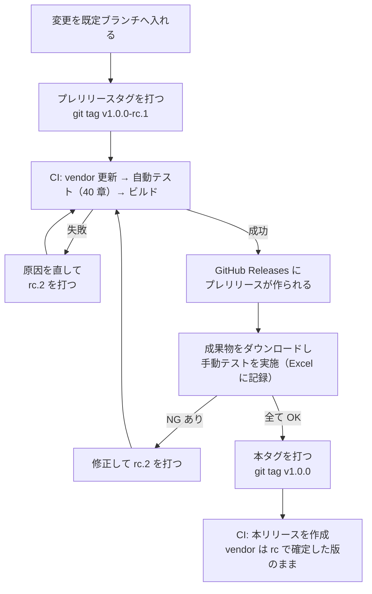

# 41. E2E テスト仕様: 手動テスト

> 索引: [README](README.md) | E2E テスト: [40](40-e2e-auto.md) / **41**

本文書は、人が操作して確認する E2E テストのケースを定める。方針・環境・自動テストは [40. 方針と自動テスト](40-e2e-auto.md) にある。

## 41.1 本文書と記録用ファイルの関係

### E2E-200: 正と生成物 **MUST**

| もの | 位置づけ |
| --- | --- |
| **本文書（41 章）** | **正**。テストケースの定義はここでのみ行う |
| `docs/tests/gen_manual_test_xlsx.py` | 本文書から記録用 Excel を生成するスクリプト |
| `docs/tests/results/MarkView_手動テスト結果_v<version>.xlsx` | 生成した**実施記録用のファイル**。ケースの追加・変更はここで行わない |

- ケースを追加・変更・削除する場合、**本文書を直す**。Excel を直接編集してケースを変えない。
- Excel に記入するのは、実施日・実施環境・実施者・結果・備考といった**実施のたびに変わる情報**に限る。
- **未記入の雛形をリポジトリに置かない。** 検証するバージョンごとに生成する。複写とリネームの手順を挟まないため、雛形を誤って上書きしたまま次の検証に入る事故が起きない。
- 実施を終えた Excel は `docs/tests/results/` に置いたままコミットする。どのリリースで何を確認したかが、リポジトリの履歴として残る。

> [!IMPORTANT]
> 本文書と Excel の内容が食い違った場合、**本文書を正とする**。Excel は生成物であり、再生成すれば本文書の内容に戻る。

生成コマンド:

```bash
python docs/tests/gen_manual_test_xlsx.py --version v1.0.0-rc.1
```

`docs/tests/results/MarkView_手動テスト結果_v1.0.0-rc.1.xlsx` が作られる。ID・テストグループ・環境・優先度・概要・前提条件・手順・確認内容・関連要求に加え、表紙と各行の**ソフトウェアバージョン**が記入済みの状態で出る。

| 項目 | 内容 |
| --- | --- |
| 必要なもの | Python 3.10 以上と `openpyxl`（`pip install openpyxl`） |
| 動作環境 | Windows / Linux のどちらでもよい。**Excel のインストールは不要** |
| CI での実行 | 行わない。検証者が手元で生成する |

- スクリプトは**グループの節**（`## 41.n Gn 名称` の見出しを持つ節）の箇条書きを読み取る。**節と項目の書式を変えると生成が壊れる**ため、既存のケースと同じ形（`### E2E-nnn: 概要` と `- **環境**:` 以下の項目）を守る。
- スクリプトは、抽出したケースが**「テストケース一覧」節**の一覧と**一致することを自身で検査**し、食い違えばファイルを作らずにエラーで終了する。片方だけを直したまま気づかない状態にならないようにするためである。
- **スクリプトは節番号を当てにしない。** グループの節は見出しの `Gn` で、一覧は見出しの文言「テストケース一覧」で探す。グループを増やすと後続の節番号がずれるためであり、**番号で探すと、ケースを 1 つ足しただけで生成が止まる。**

### E2E-201: 実施の単位 **MUST**

| 契機 | 実施範囲 |
| --- | --- |
| **プレリリースの初回検証**（`rc.1`） | **全ケース**を W1 で実施し、環境欄に L1 を含むケースを L1 で実施する |
| **2 回目以降のプレリリース**（`rc.2` 以降） | 前回 NG だったケースと、修正が影響するテストグループ。それ以外は前回の結果を引き継ぐ |
| arm64 環境が入手できたとき | 環境欄に WA / LA を含むケース |

- 手動テストは**ビルドされた成果物を必要とする**ため、PR 単位の検証（BR-052）では実施しない（E2E-002, E2E-011）。PR で行うのは自動の検査だけである。
- 結果を引き継ぐ場合は、**前の rc のファイルを複写して版名を改め**、再実施したケースだけを上書きする。引き継いだ行には、どの rc で確認した結果かを備考に残す。
- **本文書を改訂した場合は引き継がない。** 生成し直して全ケースを実施する。ケースの内容が変わった以上、前回の OK は別のケースに対する結果である。
- 実施で NG があった場合、修正してから次のプレリリースを作り、そのケースを再実施する。**NG のまま本リリースを行わない。**
- 「対象外」とした場合は、なぜ実施できなかったかを備考に残す。

### E2E-202: 環境コード **MUST**

40 章 E2E-010 で定めた環境コードを用いる。

| コード | 環境 |
| --- | --- |
| W1 | Windows 11 / amd64（主環境） |
| L1 | Ubuntu 24.04 / amd64 |
| WA | Windows 11 / arm64 |
| LA | Ubuntu 24.04 / arm64 |

各ケースの「環境」は**そのケースを実施すべき環境**を示す。`W1` のみのケースは Windows でだけ確認すればよい。`W1 / L1` は両方で確認する。

### E2E-203: 優先度 **MUST**

| 優先度 | 意味 |
| --- | --- |
| **高** | 壊れていると配布物として成立しない。NG ならリリースしない |
| 中 | 主要機能。NG なら原則リリースしない |
| 低 | 補助的な振る舞い。NG でも影響を判断のうえリリースしてよい |

### E2E-204: 記録する項目 **MUST**

Excel の各列の意味は以下とする。列の追加・削除は本文書の改訂を伴う。

| 列 | 内容 | 記入 |
| --- | --- | --- |
| ID | `E2E-nnn` | 生成時 |
| テストグループ | G1〜G14 とその名称 | 生成時 |
| テスト環境 | 実施すべき環境コード | 生成時 |
| 優先度 | 高 / 中 / 低 | 生成時 |
| テスト概要 | 何を確かめるケースか | 生成時 |
| 前提条件 | 実施前に整えておく状態 | 生成時 |
| テスト手順 | 操作の順序 | 生成時 |
| テスト確認内容 | 満たすべき結果 | 生成時 |
| 関連要求 | 根拠となる要求 ID | 生成時 |
| テスト実施日 | 実施した日付 | **実施時** |
| ソフトウェアバージョン | 検証した成果物のバージョン | 生成時（`--version` に渡した値） |
| 実施環境 | 実際に実施した環境コード | **実施時** |
| 実施者 | 実施した人 | **実施時** |
| テスト確認結果 | OK / NG / 対象外 / 未実施 | **実施時** |
| 実測・備考 | 実際の挙動、気づいた点 | **実施時** |
| 不具合番号 | NG のとき、起票した Issue 番号 | **実施時** |

### E2E-205: リリースまでの検証手順 **MUST**

手動テストは、**利用者が受け取るのと同じ手順で作られた成果物**に対して行う（E2E-011）。そのため、本リリースの前にプレリリースを作り、その成果物を検証する。



| 手順 | 内容 |
| --- | --- |
| 1 | プレリリースタグ（`v<version>-rc.<n>`、BR-080）を打って push する |
| 2 | CI の自動テスト（40 章）がすべて通ることを確認する。失敗した場合はここで止め、修正して次の rc を打つ |
| 3 | GitHub Releases のプレリリースから、検証する環境向けの成果物をダウンロードする。あわせて**リリースノートの「変更点」が BR-051 の基準どおりか**を見る（rc なら直前のタグから、本タグなら直前の本リリースから。**全履歴が並んでいたら基準の選択が壊れている**）|
| 4 | `python docs/tests/gen_manual_test_xlsx.py --version <rc タグ>` で記録用 Excel を生成し、実施範囲（E2E-201）のケースを実施して結果を記入する |
| 5 | NG があれば修正し、次の rc を打って 2 へ戻る。NG を残したまま先へ進まない |
| 6 | 全ケースが OK（または理由のある「対象外」）になったら、記入済みの Excel を `docs/tests/results/` にコミットし、本タグを打つ |
| 7 | 本リリースの成果物が、検証した rc と同じ内容から作られていることを確認する（下記） |

**rc で検証した内容が本リリースでも保たれること**を、以下で担保する。

- 本タグでは埋め込み資産の自動更新を行わない（BR-043）。rc で確定した Mermaid / KaTeX / PlantUML がそのまま配布される。
- 手順 7 の確認は、rc と本リリースの**アプリケーション情報ダイアログの `Bundled` 行が一致すること**で行う。実行ファイルのハッシュはバージョン文字列とビルド日時が異なるため一致しない。ハッシュの比較では確認できない。
- rc と本タグの間に別の変更を入れない。入れた場合は改めて rc を作り直し、手動テストをやり直す。

> [!NOTE]
> プレリリースを挟まず本タグだけを打つと、**検証していない成果物が公開される**。E2E-011 が「リリースと同じ手順で作られた成果物」を求めるのは、ローカルビルドでは BR-043 の資産更新が反映されず、手元と配布物で Mermaid のバージョンが食い違いうるためである。


## 41.2 テストグループ

| グループ | 名称 | ケース |
| --- | --- | --- |
| G1 | 起動と終了 | E2E-211〜E2E-215 |
| G2 | ファイルを開く | E2E-221〜E2E-226 |
| G3 | Markdown の表示 | E2E-231〜E2E-240 |
| G4 | ファイルツリー | E2E-241〜E2E-246 |
| G5 | アウトライン | E2E-251〜E2E-253 |
| G6 | リンクと履歴 | E2E-261〜E2E-265 |
| G7 | 検索と表示倍率 | E2E-271〜E2E-274 |
| G8 | テーマ | E2E-281〜E2E-283 |
| G9 | コピー | E2E-291〜E2E-293 |
| G10 | 情報ダイアログ | E2E-301〜E2E-302 |
| G11 | 設定の永続化 | E2E-311〜E2E-315 |
| G12 | 異常系 | E2E-321〜E2E-326 |
| G13 | 配布物とアイコン | E2E-331〜E2E-334 |
| G14 | 外部エディタ | E2E-341〜E2E-345 |

## 41.3 G1 起動と終了

### E2E-211: 配布物のダブルクリック起動
- **環境**: W1 / L1
- **優先度**: 高
- **関連要求**: FR-013, UI-013, UC-01
- **概要**: 配布物を展開したフォルダから、引数なしで起動して README が表示されることを確認する
- **前提条件**: 配布アーカイブを展開している。**同梱の `README.md` が実行ファイルの隣にある状態**（BR-020, BR-021）から手を加えない
- **手順**:
  1. ファイルマネージャで実行ファイルをダブルクリックする
  2. ウィンドウが開くまで待つ
- **確認内容**:
  - ウィンドウが開き、**アーカイブに同梱された `README.md`** の内容が表示される
  - ウィンドウタイトルが `README.md - MarkView` である
  - 起動から表示まで体感で待たされない（1 秒程度）

### E2E-212: シェルからの起動（カレントディレクトリ優先）
- **環境**: W1 / L1
- **優先度**: 高
- **関連要求**: FR-013
- **概要**: カレントディレクトリの README が、実行ファイルの隣の README より優先されることを確認する
- **前提条件**: 実行ファイルの隣と、別ディレクトリの両方に異なる内容の `README.md` を置いている
- **手順**:
  1. ターミナルで別ディレクトリへ `cd` する
  2. 実行ファイルをフルパスで引数なし起動する
- **確認内容**:
  - **カレントディレクトリ側**の `README.md` が表示される
  - ファイルツリーのルートがカレントディレクトリになっている

### E2E-213: 引数でファイルを指定して起動
- **環境**: W1 / L1
- **優先度**: 高
- **関連要求**: FR-012, FR-030, UI-013
- **概要**: コマンドライン引数で指定した文書が表示されることを確認する
- **前提条件**: 検証用データを配置している
- **手順**:
  1. `MarkView testdata/e2e/docs/design.md` を実行する
- **確認内容**:
  - `design.md` の内容が表示される
  - ファイルツリーのルートが `testdata/e2e/docs` になっている
  - タイトルが `design.md - MarkView` である

### E2E-214: 引数でディレクトリを指定して起動
- **環境**: W1
- **優先度**: 中
- **関連要求**: FR-012
- **概要**: ディレクトリを指定した場合、そこをルートとして README が開くことを確認する
- **前提条件**: 検証用データを配置している
- **手順**:
  1. `MarkView testdata/e2e` を実行する
- **確認内容**:
  - `testdata/e2e/README.md` が表示される
  - ファイルツリーのルートが `testdata/e2e` になっている

### E2E-215: 終了
- **環境**: W1 / L1
- **優先度**: 高
- **関連要求**: UI-090, UI-114
- **概要**: 通常の手段で終了でき、次回起動に影響が残らないことを確認する
- **前提条件**: 文書を表示している
- **手順**:
  1. ウィンドウの閉じるボタンで終了する
  2. 再度起動する
  3. `Ctrl+Q` で終了する
- **確認内容**:
  - いずれの手段でも終了できる
  - 終了時にエラーダイアログが出ない
  - 再起動時に前回の設定（テーマ・ペイン幅）が復元される

## 41.4 G2 ファイルを開く

### E2E-221: ファイル選択ダイアログから開く
- **環境**: W1 / L1
- **優先度**: 高
- **関連要求**: FR-010, UI-020
- **概要**: ツールバーのボタンからファイルを選んで開けることを確認する
- **前提条件**: MarkView が起動している
- **手順**:
  1. ツールバー左端のフォルダアイコンをクリックする
  2. `testdata/showcase.md` を選択して開く
- **確認内容**:
  - OS 標準のファイル選択ダイアログが開く
  - フィルタが `Markdown files` になっており、`.md` 以外が既定で表示されない
  - 選択した文書が表示される
  - ファイルツリーのルートが選択したファイルの親ディレクトリに変わる

### E2E-222: ショートカットでダイアログを開く
- **環境**: W1
- **優先度**: 中
- **関連要求**: FR-010, UI-090
- **概要**: `Ctrl+O` でダイアログが開くことを確認する
- **前提条件**: MarkView が起動している
- **手順**:
  1. `Ctrl+O` を押す
  2. ダイアログをキャンセルする
- **確認内容**:
  - ダイアログが開く
  - キャンセルしても表示中の文書が変わらない

### E2E-223: ドラッグ＆ドロップで開く
- **環境**: W1 / L1
- **優先度**: 高
- **関連要求**: FR-011, UI-070
- **概要**: ウィンドウに Markdown をドロップして開けることを確認する
- **前提条件**: MarkView が起動している。ファイルマネージャで検証用データを開いている
- **手順**:
  1. `showcase.md` をウィンドウ上へドラッグする
  2. ドラッグ中の表示を確認する
  3. ドロップする
- **確認内容**:
  - ドラッグ中にウィンドウ全体へオーバーレイと `Drop a Markdown file to open` の案内が出る
  - ドロップした文書が表示される
  - ファイルツリーのルートがドロップしたファイルの親に変わる
  - 本文ペイン以外（ツールバー・サイドペイン）にドロップしても同じ結果になる

### E2E-224: ディレクトリのドロップ
- **環境**: W1
- **優先度**: 中
- **関連要求**: FR-011, FR-030
- **概要**: ディレクトリをドロップした場合の動作を確認する
- **前提条件**: MarkView が起動している
- **手順**:
  1. `testdata/e2e` ディレクトリをウィンドウへドロップする
- **確認内容**:
  - そのディレクトリがファイルツリーのルートになる
  - 直下の `README.md` が表示される

### E2E-225: Markdown 以外のドロップ
- **環境**: W1
- **優先度**: 中
- **関連要求**: FR-011, FR-110
- **概要**: 対応していないファイルをドロップしたときの振る舞いを確認する
- **前提条件**: 文書を表示している
- **手順**:
  1. `.png` ファイルをウィンドウへドロップする
- **確認内容**:
  - 表示中の文書が変わらない
  - ステータス領域に英語のメッセージが出て、数秒後に消える
  - アプリが異常終了しない

### E2E-226: ファイル更新の自動反映
- **環境**: W1 / L1
- **優先度**: 高
- **関連要求**: FR-014, AR-070, UC-03
- **概要**: 外部エディタで保存したときに自動で再描画され、スクロール位置が保たれることを確認する
- **前提条件**: 長めの文書（`showcase.md`）を開き、中ほどまでスクロールしている
- **手順**:
  1. 別のエディタで同じファイルを開き、先頭付近に一文を追加して保存する
  2. MarkView の画面を見る
  3. 続けて 3 回連続で保存する
- **確認内容**:
  - 保存後 1 秒以内に表示が更新される
  - **スクロール位置が保たれている**（先頭に戻らない）
  - 連続保存で表示が何度もちらつかない
  - ファイルツリーの展開状態が保たれている

## 41.5 G3 Markdown の表示

### E2E-231: GitHub 準拠の描画
- **環境**: W1 / L1
- **優先度**: 高
- **関連要求**: FR-020, MD-001, MD-002, MD-011, MD-020, MD-022, MD-023, MD-024, MD-025, MD-026, MD-033, MD-050, MD-051, MD-072, MD-073, UI-050, NFR-030
- **概要**: 主要な記法が GitHub と同じ体裁で表示されることを確認する
- **前提条件**: `showcase.md` を開いている
- **手順**:
  1. GitHub 上で同じ `showcase.md` を開き、並べて比較する
  2. 見出し・段落・リスト・引用・表・水平線を上から順に見る
  3. 折りたたみ（`<details>`）・脚注・絵文字ショートコードを確認する
- **確認内容**:
  - 見出しの階層と大きさが GitHub と同等である
  - `h1` / `h2` の下に境界線がある
  - 表に罫線があり、ヘッダ行が強調されている
  - タスクリストのチェックボックスが表示され、**クリックしても状態が変わらない**
  - 引用が左の縦線付きで表示される
  - **折りたたみが開閉する**（MD-026。サニタイズで `<details>` が落ちていない）
  - 脚注が文書末尾に一覧で描画され、参照箇所と相互に行き来できる（MD-050）
  - `:sparkles:` などの絵文字ショートコードが絵文字になっている（MD-051）
  - **見出しにマウスを乗せると、左側にアンカーのアイコンが出る**（MD-020, DSP-023）
  - アイコンをクリックすると、その見出しが本文ペインの上端へ移動する
  - **アイコンが出ても見出しの文字の位置がずれない**（絶対配置。DSP-023）
  - アウトラインの文言にアイコンが混ざっていない（IMP-227）
  - **生 HTML の `<script>` と `onclick` が消えている**（MD-072, NFR-030）。**配布物のサニタイズが実際に効いていることを、ここで一度だけ確かめる**
  - **Front Matter が本文に出ていない**（MD-073）
  - 本文の最大幅で中央寄せになり、横スクロールが出ていない（UI-050）

### E2E-232: シンタックスハイライト
- **環境**: W1 / L1
- **優先度**: 高
- **関連要求**: MD-030, MD-031, MD-032
- **概要**: コードブロックが言語ごとに色分けされることを確認する
- **前提条件**: `showcase.md`（Go / JSON / Shell / diff を含む）を開いている
- **手順**:
  1. 各コードブロックを目視で確認する
  2. 横に長いコードブロックを確認する
- **確認内容**:
  - キーワード・文字列・コメントが色分けされている
  - 配色が GitHub と同系統である
  - 行番号が表示されていない
  - 長い行はコードブロック内で横スクロールし、**ページ全体は横スクロールしない**

### E2E-233: GitHub Alerts
- **環境**: W1 / L1
- **優先度**: 中
- **関連要求**: MD-040
- **概要**: 5 種類の Alert が色とアイコン付きで表示されることを確認する
- **前提条件**: 5 種すべてを含む文書を開いている
- **手順**:
  1. NOTE / TIP / IMPORTANT / WARNING / CAUTION の表示を確認する
  2. `> [!FOO]` のような未知の種別も確認する
- **確認内容**:
  - 各種別が異なる色の左ボーダーとアイコンで表示される
  - ラベルが `Note` / `Tip` / `Important` / `Warning` / `Caution` の英語表記である
  - **アイコンが表示されている**（サニタイズで消えていない）
  - 未知の種別は通常の引用として表示される

### E2E-234: Mermaid 図
- **環境**: W1 / L1
- **優先度**: 高
- **関連要求**: FR-023, MD-080, MD-081
- **概要**: Mermaid 図が描画されることを確認する
- **前提条件**: 複数種類の Mermaid 図を含む文書を開いている。**ネットワークを切断しておく**
- **手順**:
  1. フローチャート・シーケンス図・クラス図の表示を確認する
  2. 構文エラーを含む Mermaid ブロックの表示を確認する
  3. **`click` を含む Mermaid 図のノードをクリックする**
- **確認内容**:
  - **オフラインでも図が描画される**
  - 図が本文幅に収まっている
  - 構文エラーのブロックはエラー内容とソースが表示され、他の図の描画は妨げられない
  - **`click` を押しても何も起こらない**（`securityLevel: strict`。MD-081）。文書は第三者から受け取りうるため、**図の定義から遷移や実行が起きないことをここで確かめる**

### E2E-235: 数式
- **環境**: W1
- **優先度**: 中
- **関連要求**: MD-060
- **概要**: 数式が描画され、通貨表記が誤認されないことを確認する
- **前提条件**: インライン数式・ブロック数式・通貨表記を含む文書を開いている。ネットワークを切断しておく
- **手順**:
  1. `$a+b$` と `$$...$$` の表示を確認する
  2. `$100 と $200` のような通貨表記の表示を確認する
  3. `$x_1 + x_2$` の表示を確認する
- **確認内容**:
  - オフラインでも数式が描画される
  - 通貨表記が数式にならず、そのまま表示される
  - `x_1` の `_` が強調（斜体）にならず、下付き文字として描画される

### E2E-236: 画像
- **環境**: W1 / L1
- **優先度**: 高
- **関連要求**: FR-022, MD-071, AR-040, DSP-123
- **概要**: ローカル画像とリモート画像の表示と、読み込み失敗時の体裁を確認する
- **前提条件**: 相対パス画像・存在しない画像・リモート画像を含む文書を開いている
- **手順**:
  1. 相対パスのローカル画像を確認する
  2. 存在しない画像の箇所を確認する
  3. **ネットワークに接続した状態で**リモート画像を確認する
  4. **ネットワークを切断して**再読み込みし、リモート画像の箇所を確認する
  5. 同じ文書をもう一度開き直し、手順 2 の箇所を再確認する
- **確認内容**:
  - ローカル画像が表示される
  - 本文幅を超える画像が縮小されている
  - 存在しない画像は alt テキストとプレースホルダになり、他の描画が止まらない
  - **プレースホルダが破線 1px の枠で、alt が淡い文字色で出る**（DSP-123）
  - リモート画像が表示される
  - 手順 4 でも同じ破線の枠と alt になる（ローカルとリモートで扱いが変わらない）
  - **手順 5 でも枠が出る。** 2 回目以降に枠が消える場合、配線前に失敗した画像を
    取りこぼしている（IMP-226）

### E2E-237: 日本語の表示
- **環境**: W1 / L1
- **優先度**: 高
- **関連要求**: MD-010, FR-021
- **概要**: 日本語が文字化けせず、適切な書体で表示されることを確認する
- **前提条件**: 日本語を含む文書（本仕様書でよい）を開いている
- **手順**:
  1. 本文・見出し・コードブロック内の日本語を確認する
  2. BOM 付き UTF-8 のファイルを開く
  3. CRLF 改行のファイルを開く
- **確認内容**:
  - 日本語が文字化けしない。豆腐（□）にならない
  - BOM が本文の先頭に文字として現れない
  - CRLF のファイルで余分な改行や `^M` が現れない

### E2E-238: 仕様書自体の表示（ドッグフーディング）
- **環境**: W1
- **優先度**: 中
- **関連要求**: NFR-072
- **概要**: 本仕様書一式を MarkView で読み、実用に耐えることを確認する
- **前提条件**: `docs/specs/README.md` を開いている
- **手順**:
  1. README から各文書へ相対リンクでたどる
  2. Mermaid 図・表・Alerts・コードブロックの表示を確認する
  3. アウトラインから節へ移動する
- **確認内容**:
  - すべての文書が破綻なく表示される
  - リンクで文書間を移動できる
  - 図表が正しく描画される
  - 読み進めるうえで支障がない

### E2E-239: PlantUML 図
- **環境**: W1 / L1
- **優先度**: 高
- **関連要求**: FR-024, MD-083, MD-085, NFR-061
- **概要**: PlantUML 図が描画され、テーマに追従することを確認する
- **前提条件**: sequence 図（Graphviz 不要）と class 図（**Graphviz 必須**）を含む文書を開いている。**ネットワークを切断しておく**
- **手順**:
  1. sequence 図と class 図の表示を確認する
  2. ツールバーのテーマボタンを押して配色を確認する
  3. PlantUML を含まない文書へ切り替え、その後もう一度戻る
- **確認内容**:
  - **オフラインでも両方の図が描画される**
  - **class 図（Graphviz）が描けている**。`viz-global.js` の読み込みに失敗しても sequence 図だけは描けてしまうため、**こちらを必ず見る**
  - 図が本文幅に収まっている
  - テーマに追従して図の配色が切り替わる
  - 文書を戻しても図が再び描画される
  - **L1 でも同じ図が描ける**。**速さは問わない**（性能の基準環境は W1。7.1）が、**描けなければ不具合とする**。FR-024 と MD-083 は MUST であり、対象環境を限定していない（NFR-061）

### E2E-240: PlantUML の制限
- **環境**: W1
- **優先度**: 中
- **関連要求**: FR-024, FR-110, MD-083, MD-084, NFR-032
- **概要**: 描けないものが、理由とともに示されることを確認する
- **前提条件**: `testdata/e2e/plantuml-limits.md` を開いている（構文エラー・`!include`・標準ライブラリ・4096 px 超え・`salt` を含む）。**ネットワークを切断しておく**
- **手順**:
  1. 各ブロックの表示を上から順に確認する
  2. 描けなかったブロックのコピーボタンを押して貼り付ける
- **確認内容**:
  - 構文エラーのブロックは **PlantUML のエラー図が図として出る**（行番号を含む。FR-024）
  - `!include` と標準ライブラリのブロックは**図にならず**、理由と元のソースが英語で出る
  - 4096 px 超えと `salt` のブロックは、**PlantUML がエラー図を返せばその図、返さなければ理由と元のソース**が出る（判定は「SVG が得られたか」だけで行うため。DSP-272）。**どちらであっても空白にならない**
  - **どのブロックも他の図の描画を妨げない**。同じ文書内の正常な図は描けている
  - コピーで**元の PlantUML ソース**が貼り付けられる
  - **待たされる箇所がない**（外部への接続試行がない。NFR-032）

## 41.6 G4 ファイルツリー

### E2E-241: ツリーの表示と切り替え
- **環境**: W1
- **優先度**: 高
- **関連要求**: FR-031, FR-034, UI-010, UI-021, UI-030, UI-041
- **概要**: ファイルツリーの表示・非表示と内容を確認する
- **前提条件**: `testdata/e2e` をルートとして起動している
- **手順**:
  1. ツールバーのファイルツリーボタンを押す
  2. ツリーの内容を確認する
  3. もう一度押して閉じる
- **確認内容**:
  - ペインが即座に開閉する（アニメーションで待たされない）
  - Markdown ファイルとディレクトリのみが表示される（画像・その他のファイルが出ない）
  - `node_modules` `vendor` `.hidden` が表示されない（`.git` も同じ規則で除外される。E2E-012）
  - ディレクトリが先、ファイルが後の順に並んでいる
  - **両方のペインを開いたとき、左から `Files` → `Outline` → 本文の順に並ぶ**（UI-010, UI-041）
  - ボタンが ON のとき押下状態に見える（UI-021）

### E2E-242: ツリーからのファイル選択
- **環境**: W1
- **優先度**: 高
- **関連要求**: FR-033, FR-030, UI-031
- **概要**: ツリーからファイルを選んでも、ルートが変わらないことを確認する
- **前提条件**: ツリーを表示し、複数階層の文書がある
- **手順**:
  1. `docs/design.md` をクリックする
  2. ファイルツリーのルート表示を確認する
  3. **ツリーにフォーカスを移し、`↑` `↓` で移動、`→` で展開、`←` で折りたたみ、`Enter` で開く**
- **確認内容**:
  - 選択した文書が表示される
  - **ファイルツリーのルートが変わらない**
  - 選択したファイルがツリー上で強調表示される
  - 本文が先頭から表示される
  - **キーボードだけでノードを移動・展開・選択できる**（UI-031）

### E2E-243: ディレクトリの展開と折りたたみ
- **環境**: W1
- **優先度**: 中
- **関連要求**: FR-032
- **概要**: 遅延展開が機能することを確認する
- **前提条件**: 階層のあるディレクトリをルートにしている
- **手順**:
  1. 折りたたまれたディレクトリをクリックして展開する
  2. 展開したまま、外部でそのディレクトリに新しい `.md` を追加する
  3. 折りたたんでから再度展開する
- **確認内容**:
  - 展開時に子が表示される
  - 再展開したときに、新しく追加したファイルが現れる

### E2E-244: ツリーの再読み込み
- **環境**: W1
- **優先度**: 低
- **関連要求**: FR-035
- **概要**: ペインの再表示でツリーが最新になることを確認する
- **前提条件**: ツリーを表示している
- **手順**:
  1. 外部でルート直下に `.md` を追加する
  2. ツリーペインを閉じて開き直す
- **確認内容**:
  - 追加したファイルがツリーに現れる

### E2E-245: ペイン幅の変更
- **環境**: W1
- **優先度**: 中
- **関連要求**: UI-030, UI-114
- **概要**: ペイン幅をドラッグで変更でき、保存されることを確認する
- **前提条件**: ツリーとアウトラインの両方を表示している
- **手順**:
  1. ツリーペインの右端の境界をドラッグして広げる
  2. 極端に狭く、極端に広くしてみる
  3. アプリを再起動する
- **確認内容**:
  - ドラッグ中にカーソルが変わり、幅が追従する
  - 下限（160px 程度）より狭くならない
  - ウィンドウ幅の 40 % より広くならない
  - 再起動後も変更した幅が保たれている

### E2E-246: 狭いウィンドウでの自動非表示
- **環境**: W1
- **優先度**: 中
- **関連要求**: UI-026
- **概要**: ウィンドウを狭めたときにアウトラインが一時的に隠れることを確認する
- **前提条件**: ツリーとアウトラインの両方を表示している
- **手順**:
  1. ウィンドウを最小サイズ付近まで狭める
  2. ツールバーのアウトラインボタンの状態を確認する
  3. ウィンドウを元の幅に戻す
- **確認内容**:
  - 本文が読めなくなる前にアウトラインペインが隠れる
  - **アウトラインボタンは ON のまま**である
  - ウィンドウを広げると、操作なしでアウトラインが戻る
  - ファイルツリーは隠れない

## 41.7 G5 アウトライン

### E2E-251: アウトラインの表示
- **環境**: W1
- **優先度**: 高
- **関連要求**: FR-040, FR-043, UI-040
- **概要**: 見出しの階層がアウトラインに反映されることを確認する
- **前提条件**: 見出しの多い文書を開いている
- **手順**:
  1. アウトラインペインの内容を確認する
  2. アウトラインボタンで開閉する
  3. 見出しのない文書を開く
- **確認内容**:
  - 見出しが階層構造でインデント表示される
  - 見出し内の強調やコード記法がプレーンテキストになっている
  - コードブロック内の `#` 始まりの行が項目に含まれていない
  - 見出しのない文書では `No headings` と表示される

### E2E-252: アウトラインからの移動
- **環境**: W1
- **優先度**: 高
- **関連要求**: FR-041
- **概要**: アウトラインのクリックで該当箇所へ移動することを確認する
- **前提条件**: 長い文書を開き、アウトラインを表示している
- **手順**:
  1. 中ほどの見出しをクリックする
  2. 末尾の見出しをクリックする
- **確認内容**:
  - 該当する見出しがペイン上端付近に来る
  - スクロールが即座に行われる（ゆっくり流れない）

### E2E-253: スクロール連動
- **環境**: W1
- **優先度**: 中
- **関連要求**: FR-042, UI-051
- **概要**: 本文のスクロールにアウトラインが追従することを確認する
- **前提条件**: 長い文書を開き、アウトラインを表示している
- **手順**:
  1. 本文をゆっくりスクロールする
  2. 一気に末尾までスクロールする
- **確認内容**:
  - 現在位置の見出しがアウトライン上で強調される
  - 強調が 1 つだけである
  - 強調項目がアウトラインの表示範囲外に出そうなとき、自動でスクロールして見える位置に来る
  - スクロールがカクつかない

## 41.8 G6 リンクと履歴

### E2E-261: 相対リンクでの文書間移動
- **環境**: W1
- **優先度**: 高
- **関連要求**: FR-050, AR-042, MD-070, UC-05
- **概要**: `.md` へのリンクが同じウィンドウで開くことを確認する
- **前提条件**: `README.md` から `docs/design.md` へのリンクがある
- **手順**:
  1. README 内のリンクをクリックする
- **確認内容**:
  - **同じウィンドウ**でリンク先が表示される（新しいウィンドウが開かない）
  - ファイルツリーのルートが変わらない
  - タイトルとステータスのパス表示が更新される
  - アウトラインが新しい文書のものに切り替わる

### E2E-262: 履歴での前後移動
- **環境**: W1
- **優先度**: 高
- **関連要求**: FR-051
- **概要**: `Alt+←` で元の文書に戻れ、位置も復元されることを確認する
- **前提条件**: 長い README の中ほどにリンクがある
- **手順**:
  1. README を中ほどまでスクロールしてリンクをクリックする
  2. `Alt+←` を押す
  3. `Alt+→` を押す
- **確認内容**:
  - `Alt+←` で README に戻る
  - **戻った位置が、リンクをクリックしたときのスクロール位置である**（先頭に戻らない）
  - `Alt+→` で再びリンク先へ進む

### E2E-263: アンカー付きリンク
- **環境**: W1
- **優先度**: 中
- **関連要求**: FR-050, MD-021
- **概要**: 見出しへのリンクが機能することを確認する
- **前提条件**: 同一文書内アンカーと、他文書のアンカー付きリンクがある
- **手順**:
  1. 同一文書内の `#見出し` リンクをクリックする
  2. `./other.md#section` 形式のリンクをクリックする
  3. 日本語見出しへのリンクをクリックする
  4. **全角の括弧や中黒を含む見出しへのリンク**をクリックする
- **確認内容**:
  - 該当見出しの位置までスクロールする
  - 他文書のアンカーでは、文書が切り替わったうえで該当位置に移動する
  - 日本語見出しへのリンクも機能する
  - **全角記号を含む見出しへのリンクも機能する**（MD-021 の 4）。`docs/specs/90-traceability.md` の 90.1 節にある 3 本のリンクがこれに当たり、**そのまま検証に使える**

### E2E-264: 外部リンクと画像リンク
- **環境**: W1 / L1
- **優先度**: 高
- **関連要求**: FR-050, FR-053, AR-060
- **概要**: 外部 URL と画像リンクが OS 側に委譲されることを確認する
- **前提条件**: `https://` リンクと `[図](./img/sample.png)` 形式のリンクがある
- **手順**:
  1. 外部 URL のリンクをクリックする
  2. 画像へのリンクをクリックする
- **確認内容**:
  - 外部 URL が**既定のブラウザ**で開く。MarkView のウィンドウ内で遷移しない
  - 画像が**OS の既定画像ビューア**で開く
  - どちらの場合も MarkView の表示内容が変わらない

### E2E-265: ツリー外への遷移
- **環境**: W1
- **優先度**: 中
- **関連要求**: FR-052, UI-060
- **概要**: ツリールート外の文書を開いたときの表示を確認する
- **前提条件**: `docs/` をルートとし、`../outside/external.md` へのリンクがある
- **手順**:
  1. ツリー外へのリンクをクリックする
  2. `Alt+←` で戻る
- **確認内容**:
  - 文書は表示される
  - **ファイルツリーのルートも展開状態も変わらない**
  - ツリー上の強調表示がなくなる
  - ステータスに絶対パスと `(outside tree)` が表示される
  - 戻ると強調表示が復活する

## 41.9 G7 検索と表示倍率

### E2E-271: 文書内検索
- **環境**: W1
- **優先度**: 高
- **関連要求**: FR-080, UI-080
- **概要**: 検索の基本動作を確認する
- **前提条件**: 長い文書を開いている。**コードブロックを含むもの**とする（`docs/showcase.md` でよい）
- **手順**:
  1. `Ctrl+F` を押す
  2. 複数箇所にある語を入力する
  3. `Enter` と `Shift+Enter` で移動する
  4. **検索バーの ∧ / ∨ ボタンを数回ずつクリックして移動する**
  5. 本文をホイールで大きくスクロールする
  6. **コードブロックが検索バーの真下に来る位置までスクロールし、そこで ∨ ボタンを押す**
  7. ヒットしない語を入力する
  8. `Esc` で閉じる
- **確認内容**:
  - 検索バーが本文の右上に出て、本文が押し下げられない
  - 入力に応じて即座にハイライトされる
  - 現在位置のヒットが他と異なる色で示される
  - `3 / 12` のようなヒット数が表示される
  - **`Enter` / `Shift+Enter` で移動するたびに、該当箇所までスクロールする**（FR-080）
  - **∧ / ∨ ボタンでも同じように移動する。** キーボードと同じ結果になる
  - **移動したあとも検索バーが本文ペインの右上に見えており、続けてボタンを押せる**
  - **本文をスクロールしても検索バーは右上に留まり、スクロールバーに重ならない**（DSP-160）
  - **コードブロックやコピーボタンの上に来ても、検索バーが手前にあり、ボタンが押せる**（DSP-015）
  - ヒットしないとき `No results` が表示される
  - `Esc` でハイライトが消え、本文が元に戻る

> [!IMPORTANT]
> **手順 4 と 5 を省かない。** FR-080 は移動手段を「`Enter` / `Shift+Enter` **または検索バーの
> ボタン**」の 2 つ定めている。**キーボードだけを試すと、ボタン経路だけが壊れている状態を
> 通してしまう。** 実際に通り抜けた（[調査報告](../bugs/2026-09-03-search-jump-buttons.md)）。
>
> **手順 6 も省かない。** 検索バーは本文の上に重なるため、**下に何が来るかで押せるかが変わる。**
> コードブロックは `position: relative`、コピーボタンは `z-index: 10` を持ち（DSP-015）、
> **重なり順を 1 つ間違えるとボタンへクリックが届かなくなる。**
> 2026-09-03 の修正で実際に起きており、**利用者の文書にたまたまコードブロックがあったから
> 見つかった。** 前提条件にコードブロックを含めたのはこのためである。

### E2E-272: 検索状態のリセット
- **環境**: W1
- **優先度**: 中
- **関連要求**: FR-080
- **概要**: 文書を切り替えたときに検索状態が残らないことを確認する
- **前提条件**: 検索してハイライトが出ている
- **手順**:
  1. 検索したまま別の文書を開く
  2. 元の文書に戻る
- **確認内容**:
  - 文書切り替えで検索バーが閉じる
  - ハイライトが残っていない
  - 元の文書に戻ってもハイライトが残っていない

### E2E-273: 表示倍率
- **環境**: W1
- **優先度**: 中
- **関連要求**: FR-081, UI-060, UI-111, UI-115
- **概要**: 倍率の変更と、保存されないことを確認する
- **前提条件**: 文書を表示している
- **手順**:
  1. `Ctrl` + `+` を数回押す
  2. `Ctrl` + マウスホイールを操作する
  3. `Ctrl+0` を押す
  4. 倍率を 140 % にしたまま終了し、再起動する
- **確認内容**:
  - 本文の文字が拡大・縮小する
  - **ツールバーとサイドペインの文字サイズは変わらない**
  - 上限（300 %）と下限（50 %）で止まる
  - `Ctrl+0` で 100 % に戻る
  - 100 % 以外のときステータスに倍率が表示される
  - **再起動すると 100 % に戻っている**（倍率は保存しない。UI-111）
  - 再起動後のステータスに倍率が表示されない

### E2E-274: キーボードショートカット
- **環境**: W1
- **優先度**: 中
- **関連要求**: FR-015, UI-090
- **概要**: 定義されたショートカットが機能することを確認する
- **前提条件**: 文書を表示している
- **手順**:
  1. `F5` / `Ctrl+R`（再読み込み）
  2. `Ctrl+Shift+T`（テーマ）
  3. `Ctrl+Shift+O`（アウトライン）
  4. `Ctrl+Shift+E`（ファイルツリー）
  5. `F1`（情報ダイアログ）
- **確認内容**:
  - 各ショートカットが対応する動作を行う
  - ツールバーのボタンを押した場合と同じ結果になる
  - 検索バーに入力中は、テキスト編集のキーが優先される

## 41.10 G8 テーマ

### E2E-281: テーマの切り替え
- **環境**: W1 / L1
- **優先度**: 高
- **関連要求**: FR-070, UI-105
- **概要**: Light / Dark の切り替えが全体に即座に反映されることを確認する
- **前提条件**: Mermaid 図・PlantUML 図・コードブロックを含む文書を開いている
- **手順**:
  1. ツールバーのテーマボタンを押す
  2. 各部の配色を確認する
  3. もう一度押して戻す
- **確認内容**:
  - 本文・ツールバー・サイドペイン・ステータス・スクロールバーのすべてが切り替わる
  - **ちらつきや再読み込みが起きない**
  - コードブロックのハイライト配色も切り替わる
  - **Mermaid 図と PlantUML 図の配色も切り替わる**
  - スクロール位置が保たれている

### E2E-282: 初回起動時のテーマ
- **環境**: W1 / L1
- **優先度**: 中
- **関連要求**: FR-071
- **概要**: 設定がない状態で OS のテーマに追従することを確認する
- **前提条件**: 設定ファイル（`%TEMP%\MarkView` / `/tmp/MarkView-<uid>`）を削除している
- **手順**:
  1. OS をダークモードにして起動する
  2. 終了して設定を削除し、OS をライトモードにして起動する
- **確認内容**:
  - OS の設定に応じたテーマで起動する

### E2E-283: テーマ切り替え時の状態保持
- **環境**: W1
- **優先度**: 低
- **関連要求**: UI-105
- **概要**: テーマを切り替えても操作状態が失われないことを確認する
- **前提条件**: 検索してヒットがある状態、ツリーを展開した状態
- **手順**:
  1. 検索バーを開いた状態でテーマを切り替える
  2. ツリーを展開した状態でテーマを切り替える
- **確認内容**:
  - 検索バーと検索語、ヒットのハイライトが保たれる
  - ツリーの展開状態が保たれる

## 41.11 G9 コピー

### E2E-291: コードブロックのコピー
- **環境**: W1 / L1
- **優先度**: 高
- **関連要求**: FR-060, FR-061, AR-062
- **概要**: コピーボタンでコードをクリップボードに取得できることを確認する
- **前提条件**: 複数のコードブロックを含む文書を開いている
- **手順**:
  1. コードブロックにマウスを乗せる
  2. 右上のコピーボタンを押す
  3. テキストエディタに貼り付ける
- **確認内容**:
  - コピーボタンがコードブロックの右上にあり、内容と重なっていない
  - ホバーで見やすくなる
  - 押すとアイコンが変わり、1〜2 秒で戻る
  - 貼り付けた内容が**元のコードと完全に一致する**（HTML タグや行番号が混ざらない）
  - インデントが保たれている

### E2E-292: Mermaid・PlantUML のコピー
- **環境**: W1
- **優先度**: 中
- **関連要求**: FR-060, IMP-115, IMP-119
- **概要**: 描画後の図から元のソースをコピーできることを確認する
- **前提条件**: Mermaid 図と PlantUML 図が描画されている
- **手順**:
  1. Mermaid 図のコピーボタンを押して貼り付ける
  2. PlantUML 図のコピーボタンを押して貼り付ける
- **確認内容**:
  - **図ではなく元の Mermaid ソース**が貼り付けられる
  - **図ではなく元の PlantUML ソース**が貼り付けられる。どちらも描画後に `<pre>` が SVG へ置き換わるため、**同じ壊れ方をする**

### E2E-293: 選択範囲のコピー
- **環境**: W1
- **優先度**: 低
- **関連要求**: FR-062
- **概要**: 本文の任意の範囲をコピーできることを確認する
- **前提条件**: 文書を表示している
- **手順**:
  1. 本文の一部をマウスで選択する
  2. `Ctrl+C` を押して貼り付ける
- **確認内容**:
  - 選択した範囲がコピーされる

## 41.12 G10 情報ダイアログ

### E2E-301: 情報ダイアログの表示
- **環境**: W1 / L1
- **優先度**: 高
- **関連要求**: FR-100, UI-100, UI-025, UI-102, BR-042
- **概要**: アプリケーション情報が正しく表示されることを確認する
- **前提条件**: MarkView が起動している
- **手順**:
  1. ツールバー右端の「?」を押す
  2. 表示内容を確認する
  3. **リポジトリ URL をクリックする**
  4. `Esc` で閉じる
- **確認内容**:
  - **アプリケーションアイコン**が見出し横に表示される
  - バージョンが `dev` ではなく、**いま検証しているプレリリースタグ**（`v<version>-rc.<n>`）と一致する（E2E-205）
  - 作成者が `kznagamori`、リポジトリ URL が正しい
  - 実行環境（OS / アーキテクチャ / Go / WebView）が表示される
  - **同梱資産（Mermaid / KaTeX / PlantUML）のバージョン**が表示される
  - **Viz.js / Graphviz / Expat はここに出ない**（UI-100）。ライセンス表示（E2E-302）の側で確かめる
  - **リポジトリ URL のクリックで既定ブラウザが開き、ダイアログ内では遷移しない**（UI-102）
  - 背後のメインウィンドウが操作できない
  - `Esc`、閉じるボタン、外側クリックのいずれでも閉じる

### E2E-302: OSS ライセンス表示
- **環境**: W1
- **優先度**: 高
- **関連要求**: FR-101, UI-101, AR-032, BR-040, NFR-051
- **概要**: 依存パッケージのライセンスが全文表示されることを確認する
- **前提条件**: 情報ダイアログを開いている
- **手順**:
  1. ライセンス欄をスクロールする
  2. 一部を選択してコピーする
  3. リポジトリ URL をクリックする
- **確認内容**:
  - 主要な依存（Wails / goldmark / chroma / bluemonday / fsnotify / Mermaid / KaTeX / **PlantUML / Viz.js / Graphviz / Expat**）が含まれている
  - **Graphviz の EPL-2.0 の全文が入っている**（NFR-051, BR-040）。Viz.js と Expat の MIT 全文も入っている
  - **Graphviz と Expat のバージョン欄が `—` になっている**（BR-042。版が分からないものを一覧から落としていないこと）
  - 各パッケージの名称・バージョン・ライセンス種別・全文がある
  - テキストを選択・コピーできる
  - URL クリックで既定ブラウザが開く

## 41.13 G11 設定の永続化

### E2E-311: 設定の保存と復元
- **環境**: W1 / L1
- **優先度**: 高
- **関連要求**: UI-110, UI-114
- **概要**: 設定が次回起動時に復元されることを確認する
- **前提条件**: MarkView が起動している
- **手順**:
  1. テーマを Dark に、ペインを両方表示にし、幅を変える
  2. ウィンドウサイズを変える
  3. 終了して再起動する
- **確認内容**:
  - テーマ・ペインの表示状態・ペイン幅・ウィンドウサイズが復元される

### E2E-312: 位置・倍率・最大化状態が保存されないこと
- **環境**: W1
- **優先度**: 高
- **関連要求**: UI-011, UI-111, UI-115
- **概要**: ウィンドウごとに変わる値が保存されず、常に既定の状態で開くことを確認する
- **前提条件**: MarkView が起動している
- **手順**:
  1. ウィンドウを画面の隅へ移動して終了する
  2. 再起動する
  3. （可能なら）外部ディスプレイへ移動して終了し、ディスプレイを外して再起動する
  4. ウィンドウを最大化し、倍率を 150 % にして終了する
  5. 再起動する
  6. ウィンドウのサイズを変えてから最大化し、その状態で終了して再起動する
- **確認内容**:
  - **常にプライマリモニタの中央に表示される**
  - ディスプレイ構成が変わっても、ウィンドウが画面外に出ない
  - **手順 5 で通常状態（最大化されていない）で開く**
  - **手順 5 で倍率が 100 % に戻っている**
  - **手順 6 で、最大化する前に指定したサイズで開く**（最大化中の画面いっぱいのサイズが保存されていない）

### E2E-313: 設定の保存先
- **環境**: W1 / L1
- **優先度**: 中
- **関連要求**: UI-112, AR-004, NFR-031, NFR-033, NFR-042
- **概要**: 設定と WebView のデータがテンポラリ以外に書き込まれないことを確認する
- **前提条件**: 設定を変更して終了している
- **手順**:
  1. Windows: `%TEMP%\MarkView\config.json` を確認する
  2. Linux: `/tmp/MarkView-<uid>/config.json` とパーミッションを確認する
  3. config.json の中身を確認する
  4. Windows: `%TEMP%\MarkView\webview2\EBWebView` があることを確認する
  5. Windows: **`%APPDATA%\MarkView.exe` が作られていないこと**を確認する（実行ファイル名と同じ名前のディレクトリ）
  6. Windows: `%APPDATA%` / `%LOCALAPPDATA%` に MarkView 関連のディレクトリがないことを確認する
  7. Linux: `~/.config` に MarkView 関連のファイルがないことを確認する
  8. Linux: `~/.local/share` と `~/.cache` を確認し、**WebKitGTK が作ったディレクトリの名前と実サイズを記録する**
- **確認内容**:
  - テンポラリディレクトリに設定ファイルがある
  - Linux でディレクトリが `0700`、ファイルが `0600` である
  - **開いたファイルのパス・履歴・ウィンドウ位置・倍率が記録されていない**
  - Windows: WebView2 のデータが `%TEMP%\MarkView\webview2` の下にある（AR-004）
  - Windows: **`%APPDATA%\MarkView.exe` が存在しない。** 存在したら `WebviewUserDataPath` の指定漏れである（IMP-193）
  - Windows: `%APPDATA%` / `%LOCALAPPDATA%` に何も作られていない
  - Linux: `~/.config` に何も作られていない
  - Linux: `~/.local/share` / `~/.cache` の内容を**記録する**（NG にはしない。AR-004 の既知の例外）

> [!NOTE]
> 手順 8 は**現状を確定させるための実測**である。Linux には WebKitGTK のデータ領域を指定する手段が無く（AR-004）、既定の位置を仕様が断定できていない。ここで得た名前とサイズを AR-004 の表へ書き戻す。**この項目だけは、結果が想定と違っても NG としない。**

### E2E-314: 設定が失われた場合
- **環境**: W1 / L1
- **優先度**: 中
- **関連要求**: UI-113
- **概要**: 設定がなくても壊れていても正常に起動することを確認する
- **前提条件**: 設定ファイルが存在する
- **手順**:
  1. 設定ファイルを削除して起動する
  2. 終了し、設定ファイルの中身を `{` だけにして起動する
  3. 終了し、`"windowWidth"` に `100` を書き込んで起動する
  4. 終了し、`"zoom": 200` と `"windowMaximized": true` を書き足して起動する
- **確認内容**:
  - いずれの場合もエラーを出さずに起動する
  - 既定値（または丸めた値）で表示される
  - **手順 4 の 2 つのキーは無視される**（倍率は 100 %、ウィンドウは通常状態。UI-111）
  - 起動後に設定を変更して終了すると、正常な設定ファイルに戻る。**書き足したキーは消えている**

### E2E-315: 多重起動
- **環境**: W1 / L1
- **優先度**: 高
- **関連要求**: UI-115, UI-111, UI-112
- **概要**: 複数同時に起動して並べて使えることを確認する
- **前提条件**: 検証用データに 2 つ以上の Markdown ファイルがある
- **手順**:
  1. MarkView を 2 つ起動し、それぞれ別のファイルを開く
  2. 2 つを画面に並べ、片方だけを最大化する
  3. 片方の倍率を 200 % にする
  4. 片方でテーマを Dark に切り替える
  5. 3 つ目を起動する
  6. すべて終了し、もう一度 1 つ起動する
- **確認内容**:
  - **2 つ目以降も普通に起動する。** 最初のウィンドウが前面に出るだけ、といった単一インスタンス化の挙動をしない
  - それぞれが独立して文書・ツリー・アウトライン・検索・履歴を持つ
  - **片方の最大化・倍率が、もう片方に影響しない**
  - 手順 5 の 3 つ目は、**通常状態・倍率 100 %** で開く（UI-111）
  - 手順 4 のテーマは、**既に起動しているウィンドウには反映されない**（実行中の再読み込みは行わない。UI-115）
  - 手順 6 で設定ファイルが壊れておらず、エラーも出ない
  - 手順 6 のテーマ・ペイン・ウィンドウサイズは、**最後に終了したウィンドウの状態**になっている（後勝ち。UI-115）

> [!NOTE]
> 最後の 2 つが UI-115 の核心である。設定は「後勝ちで上書きされても不都合が小さいもの」に限ると定めたため、**後勝ちであること自体は不具合ではない。** 倍率と最大化状態を保存対象から外したのは、この 2 つだけが後勝ちだと利用者の意図と食い違うからである。

## 41.14 G12 異常系

### E2E-321: 存在しないファイルの指定
- **環境**: W1 / L1
- **優先度**: 高
- **関連要求**: FR-012, FR-110, UI-024, UI-060, NFR-050, NFR-062
- **概要**: 不正な引数でも起動し、案内が出ることを確認する
- **前提条件**: 配布物を展開し、ターミナルでそのディレクトリにいる
- **手順**:
  1. `MarkView nosuch.md` を実行する
  2. `MarkView /nonexistent/dir` を実行する
- **確認内容**:
  - ウィンドウが開く（起動が失敗しない）
  - エラーがステータス領域に英語で表示される
  - モーダルダイアログが出ない

### E2E-322: 大きなファイル
- **環境**: W1
- **優先度**: 中
- **関連要求**: FR-016, UI-052
- **概要**: 大きなファイルの確認画面と上限の動作を確認する
- **前提条件**: 12 MB 程度と 60 MB 程度の Markdown を用意している
- **手順**:
  1. 12 MB のファイルを開く
  2. `Open anyway` を押す
  3. 60 MB のファイルを開く
- **確認内容**:
  - 12 MB では確認画面が出て、ファイル名とサイズが表示される
  - **モーダルダイアログではなく本文ペインに表示される**
  - 確認画面のままでもツールバーとツリーが操作できる
  - `Open anyway` で描画が始まり、完了する
  - 60 MB では上限超過の表示になり、実行ボタンがない

### E2E-323: 壊れたファイル
- **環境**: W1
- **優先度**: 中
- **関連要求**: FR-021, FR-111
- **概要**: 不正なデータでも異常終了しないことを確認する
- **前提条件**: 不正な UTF-8 を含むファイル、極端に深い入れ子のファイルを用意している
- **手順**:
  1. 不正な UTF-8 を含むファイルを開く
  2. 1000 段のネストしたリストを含むファイルを開く
  3. 巨大な表を含むファイルを開く
- **確認内容**:
  - いずれもアプリが異常終了しない
  - 不正な文字は置換され、警告がステータスに出る
  - 描画に時間がかかっても、最終的に表示されるか、エラー表示になる

### E2E-324: 表示中ファイルの削除
- **環境**: W1 / L1
- **優先度**: 中
- **関連要求**: FR-014, FR-110
- **概要**: 表示中のファイルが消えたときの振る舞いを確認する
- **前提条件**: 文書を表示している
- **手順**:
  1. 外部で表示中のファイルを削除する
  2. しばらく待つ
- **確認内容**:
  - **表示内容が消えない**（直前の描画が残る）
  - ステータスにファイルが削除された旨が表示される
  - アプリが異常終了しない

### E2E-325: オフラインでの動作
- **環境**: W1 / L1
- **優先度**: 高
- **関連要求**: AR-020, NFR-032, UC-04
- **概要**: ネットワークなしで全機能が使えることを確認する
- **前提条件**: ネットワークを完全に切断している
- **手順**:
  1. MarkView を起動する
  2. Mermaid 図・PlantUML 図・数式・コードハイライトを含む文書を開く
  3. 各機能を一通り操作する
- **確認内容**:
  - **すべての描画が完了する**（図・数式が欠けない）。**PlantUML は Graphviz を要する図も描けていること**
  - 待たされる箇所がない（外部への接続試行がない）
  - エラーが出ない

### E2E-326: 権限のないファイル
- **環境**: L1
- **優先度**: 低
- **関連要求**: FR-110
- **概要**: 読み取り権限のないファイルを開いたときの振る舞いを確認する
- **前提条件**: `chmod 000` したファイルを用意している
- **手順**:
  1. そのファイルを開こうとする
- **確認内容**:
  - アクセスできない旨がステータスに表示される
  - 表示中の内容が変わらない
  - アプリが異常終了しない

## 41.15 G13 配布物とアイコン

### E2E-331: 配布物の構成
- **環境**: W1 / L1
- **優先度**: 高
- **関連要求**: BR-020, BR-021
- **概要**: 受け取った側の視点で配布物を確認する
- **前提条件**: リリース候補のアーカイブを入手している
- **手順**:
  1. アーカイブを展開する
  2. 中身を確認する
  3. 実行ファイルの隣に Markdown を置いて起動する
- **確認内容**:
  - 実行ファイル・LICENSE・README のみが入っている
  - ディレクトリ階層が作られていない
  - インストール作業なしで起動できる
  - 設定ファイルやランタイムが同梱されていない

### E2E-332: アプリケーションアイコン
- **環境**: W1 / L1
- **優先度**: 中
- **関連要求**: UI-025, BR-013, DSP-017
- **概要**: アイコンが各所で表示されることを確認する
- **前提条件**: 配布物を展開している
- **手順**:
  1. ファイルマネージャで実行ファイルのアイコンを確認する
  2. 起動してタスクバーとウィンドウのアイコンを確認する
  3. `Alt+Tab` の表示を確認する
  4. ライトテーマとダークテーマの両方で確認する
- **確認内容**:
  - Go の既定アイコンではなく、MarkView 固有のアイコンが表示される
  - タスクバー・`Alt+Tab` でも同じアイコンが出る
  - **明るい背景でも暗い背景でも視認できる**

### E2E-333: Linux の依存パッケージ案内
- **環境**: L1
- **優先度**: 中
- **関連要求**: AR-003, BR-051
- **概要**: 依存が未導入の環境での挙動と案内を確認する
- **前提条件**: `libwebkit2gtk-4.1-0` が入っていない環境を用意している（可能な場合）
- **手順**:
  1. 実行ファイルを起動する
  2. リリースノートの案内どおりにパッケージを導入する
  3. 再度起動する
- **確認内容**:
  - 起動できない場合、必要なパッケージ名が分かる形で失敗する
  - リリースノートに記載されたコマンドで解決できる
  - 導入後は正常に起動する

### E2E-334: arm64 での起動
- **環境**: WA / LA
- **優先度**: 低
- **関連要求**: FR-024, NFR-060
- **概要**: arm64 の成果物が起動することを確認する
- **前提条件**: arm64 環境を入手している
- **手順**:
  1. arm64 用のアーカイブを展開して起動する
  2. 文書を 1 つ開く
- **確認内容**:
  - 起動する
  - 文書が表示される
  - Mermaid が描画される
  - **PlantUML の Graphviz を要する図が描画される**。Graphviz は WebAssembly で動く（AR-032）ため、**この製品で唯一 arm64 の差が出うる箇所**である

## 41.16 G14 外部エディタ

### E2E-341: エディタ選択ウィンドウの表示
- **環境**: W1 / L1
- **優先度**: 高
- **関連要求**: FR-091, UI-103, IMP-172
- **概要**: 押すたびに選択ウィンドウが開き、検出結果が一覧に並ぶことを確認する
- **前提条件**: プリセット（IMP-172）のエディタが少なくとも 1 つインストールされている。Windows なら Notepad が必ず該当する
- **手順**:
  1. 文書を開いていない状態で、ツールバーの「エディタで開く」ボタンを見る
  2. 文書を 1 つ開く
  3. 「エディタで開く」ボタンを押す
  4. 一覧の並びと、インストールしていないエディタの表示を確かめる
  5. `Esc` で閉じる
  6. もう一度ボタンを押し、`Cancel` で閉じる
  7. もう一度ボタンを押し、ウィンドウの外側をクリックして閉じる
- **確認内容**:
  - 手順 1 でボタンが淡色表示になっており、押しても何も起きない
  - 手順 3 で選択ウィンドウが開く
  - インストール済みのエディタは選択でき、していないものは `(not installed)` を添えて淡色になっている
  - **一覧から消えているエディタが無い**
  - 初回は初期選択が無く、`Open` を押せない
  - `Esc` / `Cancel` / 外側のクリックのいずれでも閉じ、**エディタは起動しない**
  - 閉じた後、フォーカスが「エディタで開く」ボタンに戻っている

### E2E-342: エディタで開く
- **環境**: W1 / L1
- **優先度**: 高
- **関連要求**: FR-090, FR-014, UI-116, DSP-151
- **概要**: 選んだエディタで開き、編集した内容が MarkView に反映されることを確認する
- **前提条件**: 書き込める場所に `.md` を 1 つ用意する
- **手順**:
  1. その `.md` を開き、本文の途中までスクロールする
  2. 「エディタで開く」を押し、エディタを選んで `Open` を押す
  3. ステータス領域を見る
  4. エディタで本文を書き換えて保存する
  5. MarkView の表示を見る
  6. MarkView を終了し、起動し直して同じファイルを開く
  7. 「エディタで開く」を押し、`Enter` だけで開く
  8. `Ctrl+E` でも選択ウィンドウが開くことを確かめる
- **確認内容**:
  - 手順 2 で選んだエディタが起動し、そのファイルが開く
  - 手順 3 でステータス領域に `Opened in <エディタ名>` が出て、5 秒ほどで消える
  - 手順 5 で表示が自動的に更新され、**スクロール位置が保たれる**（FR-014）
  - 手順 7 で前回選んだエディタが初期選択になっており、`Open` にフォーカスがある
  - **手順 7 は `Enter` だけでエディタが起動する**（`Open` をクリックしない）。キーが握りつぶされていると、フォーカスがあっても何も起きない
  - 手順 8 で `Ctrl+E` でも選択ウィンドウが開く
  - **エディタで保存しない限りファイルの内容が変わらない**（MarkView 自身は書かない）

### E2E-343: 任意のエディタの指定
- **環境**: W1 / L1
- **優先度**: 中
- **関連要求**: FR-091, UI-103, UI-116
- **概要**: `Other...` で一覧に無いエディタを指定でき、後から変更できることを確認する
- **前提条件**: プリセット（IMP-172）に無いエディタを 1 つ用意する
- **手順**:
  1. 文書を開き、「エディタで開く」を押す
  2. `Other...` を選ぶ
  3. `Browse` で実行ファイルを選ぶ
  4. `Open` を押す
  5. 起動したエディタを閉じ、もう一度「エディタで開く」を押す
  6. **選び直さずに、そのまま `Open` を押す**
  7. もう一度「エディタで開く」を押し、一覧のプリセットを選び直して `Open` を押す
  8. もう一度「エディタで開く」を押す
- **確認内容**:
  - 手順 2 の時点では `Open` を押せない
  - 手順 3 の後、`Other...` の下に**実行ファイル名だけ**が出る（フルパスではない）
  - 手順 4 でそのエディタが起動する
  - 手順 5 で `Other...` が初期選択になっている
  - **手順 6 で同じエディタがもう一度起動する。** `Failed to start the editor.` が出たら NG。一覧で選べる行は必ず起動できること（UI-116, IMP-310）
  - 手順 8 で手順 7 に選んだプリセットが初期選択になっている（**エディタを変更できる**）

### E2E-344: エディタに関する異常系
- **環境**: W1 / L1
- **優先度**: 中
- **関連要求**: NFR-035, UI-116, FR-110
- **概要**: 見つからないエディタ、MarkView 自身の指定、絶対パスでない設定が、いずれも安全に扱われることを確認する
- **前提条件**: 設定ファイルの場所（E2E-313）を把握している
- **手順**:
  1. エディタを 1 つ選んで開き、MarkView を終了する
  2. 選んだエディタの実行ファイルをリネームする
  3. MarkView を起動して文書を開き、「エディタで開く」を押す
  4. ウィンドウを閉じ、MarkView を終了して、リネームを元に戻す
  5. MarkView を起動して文書を開き、「エディタで開く」→ `Other...` → `Browse` で **MarkView 自身の実行ファイル**を選び、`Open` を押す
  6. MarkView を終了し、設定ファイルの `editor` を `"notepad"`（絶対パスでない値）へ書き換えて起動する
  7. 文書を開き、「エディタで開く」を押す
- **確認内容**:
  - 手順 3 で初期選択が無い状態になり、**エラー表示は出ない**（選び直しを促すだけ。UI-116）
  - 手順 5 で **MarkView が新しく起動せず**、ステータス領域に `MarkView cannot be used as an editor.` が出る
  - 手順 7 で初期選択が無い状態になる（絶対パスでない値が破棄されている。NFR-035）
  - いずれの場合も MarkView は落ちず、表示中の文書はそのまま保たれる

### E2E-345: 状態画面からエディタで開く
- **環境**: W1 / L1
- **優先度**: 高
- **関連要求**: FR-090, UI-021, IMP-190, NFR-035
- **概要**: 本文を表示できない状態でも、**画面が示しているファイル**がエディタで開くことを確認する
- **前提条件**: `go run ./scripts/gentestdata` で `testdata/e2e/generated/` を作ってある（E2E-012）。エディタを 1 つ選んだことがある
- **手順**:
  1. `testdata/e2e/README.md` を開く
  2. ツリーから 50 MB 超のファイルを選び、上限超過の状態画面を出す
  3. ウィンドウタイトルとステータス領域が、その大きなファイルを指していることを確かめる
  4. 「エディタで開く」を押し、`Open` を実行する
  5. **エディタで開かれたファイル名**を確かめる
  6. MarkView に戻り、`Alt+←` で `README.md` へ戻る
  7. 10 MB 超のファイルを選び、確認画面（`Open anyway` が出る状態）で「エディタで開く」を押す
  8. `README.md` へ戻り、`generated/` の 1000 段の入れ子ファイルを開く
  9. MarkView を起動し直し、文書を開いていない状態（操作案内）でツールバーを見る
- **確認内容**:
  - 手順 2 でボタンが**淡色になっていない**（押せる）
  - 手順 5 で開かれたのは**大きなファイル**である。**`README.md` が開いたら NG。** 画面の対象ではなく直前に表示していた文書を渡している（IMP-190 の `target` と `current` の取り違え）
  - 手順 7 でも、確認画面が対象にしているファイルが開く
  - 手順 8 で描画に失敗した場合、その状態でも「エディタで開く」が使え、**そのファイル**が開く。描画に成功した場合はこの確認を「対象外」とする
  - 手順 9 では**ボタンが淡色**で、押しても何も起きない（対象となるファイルが無いため）
  - いずれの場合も MarkView は落ちず、状態画面の表示は変わらない

## 41.17 要求一覧

| ID | 概要 | 必須度 |
| --- | --- | --- |
| E2E-200 | 正と生成物 | MUST |
| E2E-201 | 実施の単位 | MUST |
| E2E-202 | 環境コード | MUST |
| E2E-203 | 優先度 | MUST |
| E2E-204 | 記録する項目 | MUST |
| E2E-205 | リリースまでの検証手順 | MUST |

## 41.18 テストケース一覧

`docs/tests/results/` の記録用 Excel は、この一覧と各グループ節（41.3〜41.16）の定義から生成される（E2E-200）。生成スクリプトは、抽出したケースがこの一覧と一致することを検査する。

| ID | グループ | 概要 | 優先度 |
| --- | --- | --- | --- |
| E2E-211 | G1 | 配布物のダブルクリック起動 | 高 |
| E2E-212 | G1 | シェルからの起動（カレントディレクトリ優先） | 高 |
| E2E-213 | G1 | 引数でファイルを指定して起動 | 高 |
| E2E-214 | G1 | 引数でディレクトリを指定して起動 | 中 |
| E2E-215 | G1 | 終了 | 高 |
| E2E-221 | G2 | ファイル選択ダイアログから開く | 高 |
| E2E-222 | G2 | ショートカットでダイアログを開く | 中 |
| E2E-223 | G2 | ドラッグ＆ドロップで開く | 高 |
| E2E-224 | G2 | ディレクトリのドロップ | 中 |
| E2E-225 | G2 | Markdown 以外のドロップ | 中 |
| E2E-226 | G2 | ファイル更新の自動反映 | 高 |
| E2E-231 | G3 | GitHub 準拠の描画 | 高 |
| E2E-232 | G3 | シンタックスハイライト | 高 |
| E2E-233 | G3 | GitHub Alerts | 中 |
| E2E-234 | G3 | Mermaid 図 | 高 |
| E2E-235 | G3 | 数式 | 中 |
| E2E-236 | G3 | 画像 | 高 |
| E2E-237 | G3 | 日本語の表示 | 高 |
| E2E-238 | G3 | 仕様書自体の表示（ドッグフーディング） | 中 |
| E2E-239 | G3 | PlantUML 図 | 高 |
| E2E-240 | G3 | PlantUML の制限 | 中 |
| E2E-241 | G4 | ツリーの表示と切り替え | 高 |
| E2E-242 | G4 | ツリーからのファイル選択 | 高 |
| E2E-243 | G4 | ディレクトリの展開と折りたたみ | 中 |
| E2E-244 | G4 | ツリーの再読み込み | 低 |
| E2E-245 | G4 | ペイン幅の変更 | 中 |
| E2E-246 | G4 | 狭いウィンドウでの自動非表示 | 中 |
| E2E-251 | G5 | アウトラインの表示 | 高 |
| E2E-252 | G5 | アウトラインからの移動 | 高 |
| E2E-253 | G5 | スクロール連動 | 中 |
| E2E-261 | G6 | 相対リンクでの文書間移動 | 高 |
| E2E-262 | G6 | 履歴での前後移動 | 高 |
| E2E-263 | G6 | アンカー付きリンク | 中 |
| E2E-264 | G6 | 外部リンクと画像リンク | 高 |
| E2E-265 | G6 | ツリー外への遷移 | 中 |
| E2E-271 | G7 | 文書内検索 | 高 |
| E2E-272 | G7 | 検索状態のリセット | 中 |
| E2E-273 | G7 | 表示倍率 | 中 |
| E2E-274 | G7 | キーボードショートカット | 中 |
| E2E-281 | G8 | テーマの切り替え | 高 |
| E2E-282 | G8 | 初回起動時のテーマ | 中 |
| E2E-283 | G8 | テーマ切り替え時の状態保持 | 低 |
| E2E-291 | G9 | コードブロックのコピー | 高 |
| E2E-292 | G9 | Mermaid・PlantUML のコピー | 中 |
| E2E-293 | G9 | 選択範囲のコピー | 低 |
| E2E-301 | G10 | 情報ダイアログの表示 | 高 |
| E2E-302 | G10 | OSS ライセンス表示 | 高 |
| E2E-311 | G11 | 設定の保存と復元 | 高 |
| E2E-312 | G11 | 位置・倍率・最大化状態が保存されないこと | 高 |
| E2E-313 | G11 | 設定の保存先 | 中 |
| E2E-314 | G11 | 設定が失われた場合 | 中 |
| E2E-315 | G11 | 多重起動 | 高 |
| E2E-321 | G12 | 存在しないファイルの指定 | 高 |
| E2E-322 | G12 | 大きなファイル | 中 |
| E2E-323 | G12 | 壊れたファイル | 中 |
| E2E-324 | G12 | 表示中ファイルの削除 | 中 |
| E2E-325 | G12 | オフラインでの動作 | 高 |
| E2E-326 | G12 | 権限のないファイル | 低 |
| E2E-331 | G13 | 配布物の構成 | 高 |
| E2E-332 | G13 | アプリケーションアイコン | 中 |
| E2E-333 | G13 | Linux の依存パッケージ案内 | 中 |
| E2E-334 | G13 | arm64 での起動 | 低 |
| E2E-341 | G14 | エディタ選択ウィンドウの表示 | 高 |
| E2E-342 | G14 | エディタで開く | 高 |
| E2E-343 | G14 | 任意のエディタの指定 | 中 |
| E2E-344 | G14 | エディタに関する異常系 | 中 |
| E2E-345 | G14 | 状態画面からエディタで開く | 高 |

各ケースの手順と確認内容は各グループ節（41.3〜41.16）に定義する。
