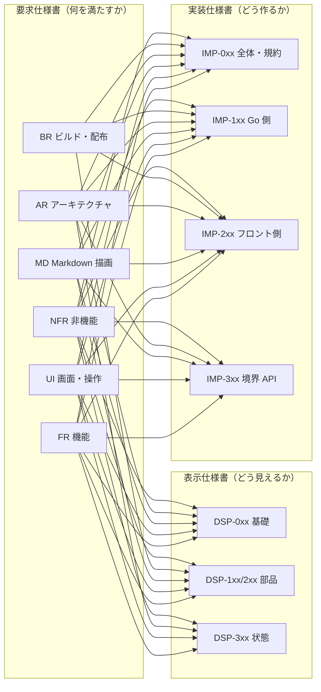

# 90. トレーサビリティ（要求 ↔ 実装 ↔ 表示）

> 索引: [README](README.md)

本文書は、要求仕様書（`FR` / `UI` / `MD` / `AR` / `BR` / `NFR`）と、実装仕様書（`IMP`）・表示仕様書（`DSP`）の対応を一覧にしたものである。

## 90.1 使い方

| 目的 | 参照する表 |
| --- | --- |
| ある要求を実現するには何を実装すればよいか | [90.3 正引き](#903-正引き要求--実装表示) |
| ある実装仕様は何のために存在するのか | [90.4 逆引き（実装）](#904-逆引き実装--要求) |
| ある表示仕様は何のために存在するのか | [90.5 逆引き（表示）](#905-逆引き表示--要求) |
| 実装・表示に落ちていない要求はどれか | [90.6 カバレッジ](#906-カバレッジ) |
| ある要求に単体テストがあるか | [31 章 31.10 の対応表](31-test-cases.md) |
| ある要求に E2E テストがあるか | [40 章 40.5 の対応表](40-e2e-auto.md)（E2E-030） |

> [!NOTE]
> 本文書が扱うのは要求 ↔ 実装 ↔ 表示の 3 層である。**テストとの対応は別に置いている**——単体テストは [31 章 31.10](31-test-cases.md)、E2E テストは [40 章 40.5](40-e2e-auto.md)（E2E-030）である。テストの追加・削除はケース側の変更が主であり、そちらで管理するほうが更新漏れが起きにくいため、意図的に分けている。

### 90.1.1 表の読み方 **MUST**

- 「実装」「表示」の列に挙げた ID は、その要求を**実現する側**の仕様である。参考として言及しているだけの箇所は含めない。
- **「実現する側」には、それが無いと要求が成立しないものを含める。** 横断的な仕様（重なり順 DSP-015、骨格 DSP-030、イベント一覧 IMP-320 など）は複数の要求に現れるが、**要求ごとに読む必要があるため省かない。** 実際、検索バーが押せなくなった不具合（2026-09-03）は重なり順の誤りであり、ツリーが更新されない不具合（[BUG-002](../bugs/2026-09-04-bug-002-filetree-reload-on-show.md)）は担当の実装 ID が挙がっていなかったことが原因である。
- `—` は、その要求が当該層に落ちないことを意味する。理由は [90.6](#906-カバレッジ) に分類して示す。
- **`TBD` は、要求を追加したが、まだその層の仕様を書いていないことを意味する。** `—`（落ちない）とはまったく違う。**実装に着手する前に必ず ID へ置き換える。** 該当する要求は [90.6.5](#9065-未割当の要求tbdと下位の文書の追随-must) に列挙する。**4.41.0 で本文書の表（実装・表示）から、4.43.0 で単体テスト（31.10）と E2E（40.5）の表から `TBD` が無くなった。**
- 1 つの要求が複数の仕様に分かれる場合、実現の主たるものを先に書く。**したがって列の並びは ID の番号順ではない。**

> [!IMPORTANT]
> **正引きと逆引きは、同じ対応関係を向きを変えて並べたものである。両者は必ず一致する。**
>
> 正引きが `FR-011 → IMP-320` と述べるなら、逆引きの `IMP-320` の行にも `FR-011` が現れる。**片方だけに書かれた対応は誤りである**（どちらが正しいかを判断し、両方を直す）。
>
> **この一致は機械的に検査できる**（90.6.4）。2 つの表を別々に育てると必ずずれる——実際に 69 か所ずれていた（4.24.0 で解消）。

> [!NOTE]
> **要求の箇条書きが複数ある場合、1 行に 1 つ以上の ID があることは「全部見た」を意味しない。** FR-035 は再読み込みの契機を 3 つ定めているが、対応表の 1 行だけでは 3 つとも担当が居るかどうかが分からない。**項目ごとに担当があるかは、要求の本文と実装仕様を突き合わせて確かめる**（[UT-061](30-test-policy.md) に同じ注意がある）。

### 90.1.2 更新の規則 **MUST**

要求・実装・表示のいずれかを追加または削除した場合、**同じ変更の中で本文書を更新する**（NFR-071）。本文書が古いまま残ると、要求の実現漏れを検出できなくなる。

## 90.2 文書間の関係

> [!NOTE]
> 矢印は 90.3 の正引き表に 1 組でも対応がある組み合わせをすべて描いたものである（4.44.0 で表から集計し直した。それまでは主なものだけを描いており、`FR` から表示仕様への矢印などが欠けていた）。**要求の区分ごとに担当する層を決め打ちしない**——`BR` にも IMP-2xx（`index.html` の id）があり、`MD` にも IMP-3xx（`DocumentDTO`）がある。

## 90.3 正引き（要求 → 実装・表示）

### 90.3.1 機能要求（FR）

| 要求 | 概要 | 実装 | 表示 |
| --- | --- | --- | --- |
| FR-010 | ファイル選択ダイアログからの表示 | IMP-105, IMP-192, IMP-310 | DSP-100 |
| FR-011 | ドラッグ＆ドロップによる表示 | IMP-192, IMP-245, IMP-313, IMP-320 | DSP-190 |
| FR-012 | コマンドライン引数による起動 | IMP-193 | — |
| FR-013 | 引数なし起動時の動作 | IMP-193, IMP-211 | DSP-181, DSP-300 |
| FR-014 | ファイル更新の自動検知と再描画 | IMP-140, IMP-141, IMP-142, IMP-321, IMP-320, IMP-195, IMP-192, IMP-220, IMP-302, IMP-109 | DSP-350, DSP-351, DSP-352 |
| FR-015 | 手動での再読み込み | IMP-192, IMP-310 | DSP-350, DSP-352, DSP-300 |
| FR-016 | 大きなファイルの扱い | IMP-101, IMP-102, IMP-250, IMP-308, IMP-314, IMP-190, IMP-192, IMP-195, IMP-307, IMP-210, IMP-320 | DSP-181, DSP-300, DSP-182, DSP-301, DSP-302 |
| FR-020 | Markdown の描画 | IMP-110, IMP-111, IMP-220, IMP-100 | DSP-121 |
| FR-021 | 文字コードと改行コードの扱い | IMP-103, IMP-104 | — |
| FR-022 | 画像の表示 | IMP-118, IMP-160, IMP-161, IMP-226, IMP-228 | DSP-123, DSP-124 |
| FR-023 | Mermaid 図の表示 | IMP-115, IMP-230, IMP-231, IMP-116, IMP-119, IMP-120, IMP-260, IMP-233 | DSP-270 |
| FR-024 | PlantUML 図の表示 | IMP-119, IMP-230, IMP-233, IMP-115, IMP-116, IMP-120, IMP-260 | DSP-272 |
| FR-030 | ツリールートの決定 | IMP-190, IMP-192, IMP-320 | DSP-302 |
| FR-031 | ツリーの表示内容 | IMP-105, IMP-132, IMP-133, IMP-130 | DSP-112 |
| FR-032 | ツリーの遅延展開 | IMP-131, IMP-133, IMP-304 | DSP-112, DSP-331 |
| FR-033 | ツリーからのファイル選択 | IMP-192, IMP-310 | DSP-330, DSP-350 |
| FR-034 | ツリーの表示・非表示切り替え | IMP-240 | DSP-310, DSP-311 |
| FR-035 | ツリーの手動更新 | IMP-131, IMP-240, IMP-310 | DSP-330 |
| FR-040 | アウトラインの生成 | IMP-110, IMP-117, IMP-224 | DSP-113 |
| FR-041 | アウトラインからの移動 | IMP-224, IMP-222 | DSP-350 |
| FR-042 | スクロール連動 | IMP-222, IMP-224 | DSP-113, DSP-340 |
| FR-043 | アウトラインの表示・非表示切り替え | IMP-240 | DSP-310, DSP-311 |
| FR-050 | 文書内リンクの遷移 | IMP-192, IMP-223, IMP-312, IMP-305, IMP-330, IMP-260, IMP-315, IMP-290 | DSP-350 |
| FR-051 | 表示履歴の前後移動 | IMP-191, IMP-311 | DSP-350 |
| FR-052 | ツリールート外の文書を開いた場合 | IMP-302, IMP-025 | DSP-112, DSP-150, DSP-330 |
| FR-053 | 画像の表示先 | IMP-170, IMP-312, IMP-305, IMP-315, IMP-290, IMP-223 | — |
| FR-060 | コピーボタンの表示 | IMP-115, IMP-221, IMP-228 | DSP-251, DSP-124 |
| FR-061 | コピー動作 | IMP-221, IMP-310, IMP-115, IMP-116, IMP-119, IMP-120, IMP-260, IMP-230, IMP-233 | DSP-252 |
| FR-062 | 選択範囲のコピー | IMP-244 | — |
| FR-063 | 右クリックメニュー | IMP-249, IMP-120, IMP-116, IMP-310, IMP-193, IMP-260, IMP-315, IMP-251, IMP-220, IMP-102, IMP-202 | DSP-140, DSP-015, DSP-352 |
| FR-070 | テーマの切り替え | IMP-243, IMP-231 | DSP-011, DSP-370, DSP-041 |
| FR-071 | 初回起動時のテーマ | IMP-151, IMP-175, IMP-303 | DSP-011 |
| FR-080 | 文書内検索 | IMP-241, IMP-321, IMP-229 | DSP-160, DSP-161, DSP-360, DSP-361 |
| FR-081 | 表示倍率の変更 | IMP-242 | DSP-021 |
| FR-090 | 外部エディタで開く | IMP-170, IMP-171, IMP-190, IMP-192, IMP-309, IMP-310, IMP-331 | DSP-100, DSP-151 |
| FR-091 | エディタの選択 | IMP-172, IMP-252, IMP-309, IMP-310, IMP-331 | DSP-172 |
| FR-100 | アプリケーション情報ウィンドウ | IMP-181, IMP-251, IMP-306, IMP-310 | DSP-170, DSP-171 |
| FR-101 | OSS ライセンス表示 | IMP-030, IMP-306 | DSP-171 |
| FR-110 | エラー通知 | IMP-021, IMP-307, IMP-308, IMP-315, IMP-320, IMP-316, IMP-312, IMP-290, IMP-223 | DSP-151, DSP-181 |
| FR-111 | 異常終了の回避 | IMP-022, IMP-250, IMP-226, IMP-140, IMP-024 | DSP-181, DSP-300 |
| FR-120 | 図と画像の拡大表示の対象と操作の提供 | IMP-228, IMP-230, IMP-221 | DSP-124, DSP-015 |
| FR-121 | 本文中での原寸表示 | IMP-228, IMP-220, IMP-302 | DSP-124, DSP-021, DSP-350, DSP-352 |
| FR-122 | 拡大画面 | IMP-253, IMP-228, IMP-244, IMP-242, IMP-230, IMP-220, IMP-202, IMP-245, IMP-226, IMP-302, IMP-251, IMP-252 | DSP-173, DSP-015, DSP-050, DSP-352 |
| FR-130 | 表の表示上の並べ替え | IMP-229, IMP-120, IMP-116, IMP-260, IMP-302, IMP-220, IMP-192, IMP-102 | DSP-125, DSP-352, DSP-361 |
| FR-140 | 編集モード | IMP-195, IMP-260, IMP-192, IMP-302, IMP-316, IMP-202, IMP-109, IMP-244, IMP-190, IMP-250, IMP-310, IMP-220, IMP-320, IMP-100, IMP-150, IMP-191 | DSP-320, DSP-126, DSP-101, DSP-352 |
| FR-141 | タスクリストのチェックボックスの切り替え | IMP-261, IMP-106, IMP-120, IMP-121, IMP-195, IMP-116, IMP-332, IMP-109, IMP-310, IMP-316, IMP-102, IMP-260, IMP-110 | DSP-126, DSP-321 |
| FR-142 | 表のセルの書き換え | IMP-262, IMP-106, IMP-120, IMP-121, IMP-195, IMP-316, IMP-109, IMP-310, IMP-223, IMP-244, IMP-249, IMP-220, IMP-102, IMP-260, IMP-110, IMP-116 | DSP-127, DSP-126, DSP-321, DSP-352 |
| FR-143 | 書き込みの規則 | IMP-107, IMP-106, IMP-195, IMP-190, IMP-102, IMP-024, IMP-332, IMP-109, IMP-310, IMP-316, IMP-192, IMP-320, IMP-100, IMP-315, IMP-194 | DSP-321 |
| FR-144 | 元に戻す・やり直す | IMP-108, IMP-263, IMP-195, IMP-244, IMP-109, IMP-310, IMP-316, IMP-192 | DSP-321, DSP-352 |

### 90.3.2 画面・操作要求（UI）

| 要求 | 概要 | 実装 | 表示 |
| --- | --- | --- | --- |
| UI-010 | 全体レイアウト | IMP-202 | DSP-030, DSP-310 |
| UI-011 | ウィンドウの初期サイズ | IMP-193 | DSP-030, DSP-380 |
| UI-012 | 高 DPI 対応 | — | DSP-381 |
| UI-013 | ウィンドウタイトル | IMP-302 | DSP-302 |
| UI-020 | ツールバーのボタン配置 | IMP-202, IMP-203, IMP-260 | DSP-100, DSP-032 |
| UI-021 | ボタンの状態表現 | IMP-295, IMP-260 | DSP-101, DSP-016, DSP-320 |
| UI-022 | アイコンの仕様 | IMP-203 | DSP-014 |
| UI-023 | ツールバーの高さと余白 | — | DSP-030, DSP-032 |
| UI-024 | ツールチップの文言と UI テキストの言語 | IMP-247, IMP-290, IMP-315 | DSP-102, DSP-111 |
| UI-025 | アプリケーションアイコン | IMP-032, IMP-160, IMP-251 | DSP-017, DSP-171 |
| UI-026 | 狭いウィンドウでのペインの一時的な非表示 | IMP-246 | DSP-380 |
| UI-030 | ファイルツリーペインの表示仕様 | IMP-240 | DSP-110, DSP-112, DSP-114, DSP-030, DSP-111, DSP-330, DSP-380 |
| UI-031 | ファイルツリーのキーボード操作 | IMP-248, IMP-295 | DSP-330, DSP-016 |
| UI-040 | アウトラインペインの表示仕様 | IMP-224, IMP-240 | DSP-110, DSP-113, DSP-030, DSP-111, DSP-114, DSP-340, DSP-380 |
| UI-041 | ペインの並び順 | IMP-202 | DSP-310 |
| UI-050 | 本文ペインの表示仕様 | IMP-220, IMP-228 | DSP-120, DSP-122, DSP-030, DSP-041, DSP-124, DSP-380 |
| UI-051 | スクロール | IMP-220 | DSP-350 |
| UI-052 | 本文ペインに表示する状態画面 | IMP-250, IMP-192, IMP-307, IMP-210 | DSP-180, DSP-181, DSP-182, DSP-300, DSP-015, DSP-301, DSP-302 |
| UI-053 | 図と画像のボタン | IMP-228, IMP-247, IMP-203, IMP-290, IMP-295 | DSP-124, DSP-102 |
| UI-054 | 表の並べ替えボタン | IMP-229, IMP-247, IMP-203, IMP-290, IMP-295 | DSP-125, DSP-102 |
| UI-055 | 編集モード中の本文ペイン | IMP-260, IMP-262, IMP-202, IMP-290, IMP-261 | DSP-126, DSP-127, DSP-030, DSP-320 |
| UI-060 | ステータス領域 | IMP-302, IMP-104, IMP-192, IMP-307, IMP-250, IMP-210 | DSP-150, DSP-151, DSP-030, DSP-302 |
| UI-070 | ドロップ領域の表示 | IMP-245 | DSP-190, DSP-015 |
| UI-080 | 検索バーの表示仕様 | IMP-241 | DSP-160, DSP-015 |
| UI-085 | 右クリックメニュー | IMP-249, IMP-290, IMP-295, IMP-244, IMP-202, IMP-262 | DSP-140, DSP-015, DSP-030 |
| UI-090 | キーボードショートカット | IMP-244, IMP-310, IMP-263, IMP-249, IMP-253 | DSP-102 |
| UI-100 | アプリケーション情報ウィンドウ | IMP-251 | DSP-170, DSP-171, DSP-015, DSP-182 |
| UI-101 | OSS ライセンス表示欄 | IMP-251 | DSP-171 |
| UI-102 | 情報ウィンドウ内リンクの扱い | IMP-170, IMP-251 | DSP-171 |
| UI-103 | エディタ選択ウィンドウ | IMP-172, IMP-252, IMP-309 | DSP-172, DSP-182 |
| UI-104 | 拡大画面 | IMP-253, IMP-247, IMP-203, IMP-290, IMP-202, IMP-242, IMP-244, IMP-295 | DSP-173, DSP-030, DSP-050 |
| UI-105 | テーマ配色の基準 | IMP-243 | DSP-010, DSP-011, DSP-012, DSP-370, DSP-040, DSP-050 |
| UI-110 | 設定として保存する項目 | IMP-150, IMP-303, IMP-310 | DSP-310 |
| UI-111 | 設定として保存しない項目 | IMP-150, IMP-190, IMP-194, IMP-210, IMP-242, IMP-303 | — |
| UI-112 | 設定の保存先 | IMP-152, IMP-193 | — |
| UI-113 | 設定が存在しない・破損している場合 | IMP-151, IMP-153 | — |
| UI-114 | 保存の契機 | IMP-194, IMP-240 | — |
| UI-115 | 多重起動 | IMP-150, IMP-152, IMP-194, IMP-195 | — |
| UI-116 | エディタ指定の保存 | IMP-150, IMP-151, IMP-153, IMP-171 | — |

### 90.3.3 Markdown 描画要求（MD）

| 要求 | 概要 | 実装 | 表示 |
| --- | --- | --- | --- |
| MD-001 | 準拠する仕様 | IMP-111 | DSP-001, DSP-012 |
| MD-002 | 判定基準 | IMP-041 | — |
| MD-010 | フォント | — | DSP-020 |
| MD-011 | 基本メトリクス | — | DSP-020, DSP-021 |
| MD-020 | 見出し | IMP-117, IMP-227 | DSP-022, DSP-023 |
| MD-021 | 見出しアンカーの生成規則 | IMP-117, IMP-227, IMP-223 | — |
| MD-022 | リスト・タスクリスト | IMP-111, IMP-261 | DSP-121, DSP-126 |
| MD-023 | 引用 | IMP-111 | DSP-121 |
| MD-024 | 表 | IMP-111, IMP-229, IMP-262 | DSP-122, DSP-121, DSP-125 |
| MD-025 | 水平線・段落・改行 | IMP-111 | DSP-121 |
| MD-026 | 折りたたみ | IMP-116, IMP-223, IMP-224, IMP-241, IMP-111 | DSP-121 |
| MD-030 | シンタックスハイライト | IMP-114 | DSP-013 |
| MD-031 | 対応言語 | IMP-114 | DSP-013 |
| MD-032 | コードブロックの体裁 | IMP-115 | DSP-250 |
| MD-033 | インラインコード | — | DSP-121 |
| MD-040 | GitHub Alerts | IMP-112, IMP-225 | DSP-260, DSP-261 |
| MD-050 | 脚注 | IMP-111 | DSP-121 |
| MD-051 | 絵文字ショートコード | IMP-111 | DSP-020 |
| MD-060 | 数式の記法 | IMP-113, IMP-232 | DSP-271 |
| MD-061 | 数式の遅延読み込み | IMP-230 | — |
| MD-070 | リンク | IMP-223, IMP-312, IMP-120 | DSP-121 |
| MD-071 | 画像 | IMP-118, IMP-228 | DSP-123 |
| MD-072 | 生 HTML の扱い（サニタイズ） | IMP-116, IMP-225, IMP-120 | — |
| MD-073 | Front Matter | IMP-111 | — |
| MD-080 | Mermaid の描画対象 | IMP-115, IMP-231, IMP-228 | DSP-270, DSP-124 |
| MD-081 | Mermaid のセキュリティ設定 | IMP-231 | — |
| MD-082 | Mermaid の遅延読み込み | IMP-230, IMP-120, IMP-260 | — |
| MD-083 | PlantUML の描画対象 | IMP-119, IMP-233, IMP-228 | DSP-272, DSP-124 |
| MD-084 | PlantUML のセキュリティ設定 | IMP-119, IMP-233, IMP-115, IMP-116, IMP-120, IMP-260, IMP-230 | — |
| MD-085 | PlantUML の遅延読み込み | IMP-119, IMP-230, IMP-120, IMP-260 | — |

### 90.3.4 アーキテクチャ要求（AR）

| 要求 | 概要 | 実装 | 表示 |
| --- | --- | --- | --- |
| AR-001 | GUI 方式 | IMP-010 | — |
| AR-002 | 選定根拠 | — | — |
| AR-003 | プラットフォーム別の WebView 依存 | IMP-031 | — |
| AR-004 | WebView のユーザデータ領域 | IMP-193 | — |
| AR-010 | 論理構成 | IMP-012 | — |
| AR-011 | ディレクトリ構成 | IMP-011, IMP-200 | — |
| AR-020 | 資産の埋め込み | IMP-030, IMP-200 | — |
| AR-021 | 遅延ロード | IMP-230, IMP-302 | DSP-390 |
| AR-030 | 変換の流れ | IMP-102, IMP-110 | — |
| AR-031 | 変換に関する制約 | IMP-111, IMP-114, IMP-116, IMP-121, IMP-106 | — |
| AR-032 | 採用ライブラリ | IMP-111, IMP-233 | — |
| AR-033 | chroma のサイズ最適化 | IMP-114 | DSP-013 |
| AR-040 | 内部アセットサーバ | IMP-160 | — |
| AR-041 | 配信の制約 | IMP-161, IMP-162 | — |
| AR-042 | 相対パスの解決 | IMP-110, IMP-118, IMP-312 | — |
| AR-050 | フロントエンドにフレームワークを使用しない | IMP-201, IMP-290 | — |
| AR-051 | スクロール連動の実装方式 | IMP-222 | — |
| AR-052 | 大きな文書の描画 | IMP-220 | — |
| AR-053 | 文書の id と画面の id の分離 | IMP-117, IMP-111, IMP-116, IMP-202, IMP-223, IMP-224, IMP-227, IMP-302, IMP-230, IMP-222, IMP-231, IMP-233, IMP-110 | — |
| AR-060 | ページ遷移の禁止 | IMP-223, IMP-251, IMP-252, IMP-249, IMP-193 | — |
| AR-061 | Go とフロントエンドの通信 | IMP-300, IMP-310, IMP-320, IMP-301, IMP-322, IMP-316 | — |
| AR-062 | クリップボード | IMP-221, IMP-310, IMP-249 | — |
| AR-070 | ファイル監視の実装 | IMP-140, IMP-141, IMP-195, IMP-192 | — |
| AR-080 | 起動時の処理順序 | IMP-193, IMP-211 | DSP-390 |
| AR-090 | 将来拡張 | — | — |

### 90.3.5 ビルド・配布要求（BR）

| 要求 | 概要 | 実装 | 表示 |
| --- | --- | --- | --- |
| BR-001 | 前提ツール | IMP-010 | — |
| BR-002 | Linux ビルドの追加要件 | IMP-031 | — |
| BR-010 | ビルドコマンド | IMP-031 | — |
| BR-011 | クロスコンパイルの制約 | IMP-031 | — |
| BR-012 | 開発時の実行 | IMP-023, IMP-031 | — |
| BR-013 | アプリケーションアイコンの組み込み | IMP-032 | — |
| BR-020 | リリース成果物一覧 | — | — |
| BR-021 | 成果物の構成方針 | — | — |
| BR-030 | バージョン情報の埋め込み | IMP-180 | DSP-171 |
| BR-040 | OSS ライセンス情報の生成 | IMP-030 | DSP-171 |
| BR-041 | ライセンス情報の鮮度検査 | — | — |
| BR-042 | 埋め込み資産のバージョン管理 | IMP-181, IMP-200 | — |
| BR-043 | リリース時の埋め込み資産の自動更新 | IMP-181, IMP-202 | — |
| BR-050 | リリースワークフロー | — | — |
| BR-051 | リリースノート | — | — |
| BR-052 | 継続的検証 | IMP-040 | — |
| BR-053 | 描画の回帰検証 | IMP-041 | — |
| BR-054 | 描画スモークテスト | IMP-042, IMP-110 | — |
| BR-060 | バイナリサイズの監視 | — | — |
| BR-070 | コード署名 | — | — |
| BR-071 | ファイル関連付け | — | — |
| BR-080 | バージョン番号の規則 | IMP-180 | — |

### 90.3.6 非機能要求（NFR）

| 要求 | 概要 | 実装 | 表示 |
| --- | --- | --- | --- |
| NFR-010 | 起動時間 | IMP-193, IMP-211 | DSP-390, DSP-391 |
| NFR-011 | 変換・描画性能 | IMP-110, IMP-220, IMP-233 | — |
| NFR-012 | 操作の応答性 | IMP-222, IMP-240, IMP-253, IMP-229 | DSP-050, DSP-311, DSP-321 |
| NFR-013 | 遅延ロードの徹底 | IMP-119, IMP-230, IMP-120, IMP-260 | — |
| NFR-020 | メモリ使用量 | IMP-024, IMP-131, IMP-140, IMP-108 | — |
| NFR-021 | ファイルサイズ | IMP-030, IMP-114 | — |
| NFR-022 | CPU 使用率 | IMP-024, IMP-142 | DSP-050 |
| NFR-030 | 文書由来のコード実行の禁止 | IMP-116, IMP-119, IMP-231, IMP-232, IMP-120, IMP-260, IMP-195, IMP-109, IMP-102, IMP-115, IMP-230, IMP-233, IMP-221, IMP-228 | — |
| NFR-031 | ファイルアクセスの制限 | IMP-025, IMP-161, IMP-193, IMP-107, IMP-194 | — |
| NFR-032 | ネットワーク | IMP-119, IMP-160, IMP-230 | — |
| NFR-033 | 権限 | IMP-152, IMP-193, IMP-107 | — |
| NFR-034 | 依存の健全性 | IMP-181 | — |
| NFR-035 | 外部プログラムの起動 | IMP-170, IMP-171, IMP-172, IMP-309, IMP-153 | — |
| NFR-040 | 収集しない情報 | IMP-023 | — |
| NFR-041 | ログ | IMP-023 | — |
| NFR-042 | 閲覧の痕跡を残さない | IMP-150, IMP-190, IMP-210, IMP-108 | — |
| NFR-050 | 異常系での継続動作 | IMP-021, IMP-022, IMP-151 | DSP-300 |
| NFR-051 | ライセンス適合 | IMP-030 | — |
| NFR-052 | 配布物の信頼性 | — | — |
| NFR-060 | 対応 OS | IMP-031 | — |
| NFR-061 | 表示の互換性 | IMP-226, IMP-249, IMP-253 | DSP-001, DSP-011, DSP-121, DSP-123, DSP-272, DSP-381 |
| NFR-062 | 表示言語の一貫性 | IMP-290 | DSP-102 |
| NFR-070 | コード品質 | IMP-020, IMP-040, IMP-012 | — |
| NFR-071 | 仕様との整合 | IMP-001 | DSP-001 |
| NFR-072 | 文書のドッグフーディング | — | — |

## 90.4 逆引き（実装 → 要求）

| 実装 | 概要 | 由来する要求 |
| --- | --- | --- |
| IMP-001 | 要求仕様との関係 | NFR-071 |
| IMP-002 | 記述の範囲 | — |
| IMP-010 | 言語とツール | AR-001, BR-001 |
| IMP-011 | ディレクトリ構成 | AR-011 |
| IMP-012 | パッケージの依存方向 | AR-010, NFR-070 |
| IMP-020 | 命名 | NFR-070 |
| IMP-021 | エラー処理 | FR-110, NFR-050 |
| IMP-022 | パニックの遮断 | FR-111, NFR-050 |
| IMP-023 | ログ | NFR-040, NFR-041, BR-012 |
| IMP-024 | 並行性 | NFR-020, NFR-022, FR-143, FR-111 |
| IMP-025 | パスの扱い | NFR-031, FR-052 |
| IMP-030 | go:embed の構成 | AR-020, FR-101, NFR-021, NFR-051, BR-040 |
| IMP-031 | ビルドタグ | AR-003, BR-002, BR-010, BR-011, NFR-060, BR-012 |
| IMP-032 | アプリケーションアイコン | UI-025, BR-013 |
| IMP-040 | テストの対象 | NFR-070, BR-052 |
| IMP-041 | ゴールデンテスト | MD-002, BR-053 |
| IMP-042 | テストで行わないこと | BR-054 |
| IMP-100 | document 型定義 | FR-020, FR-140, FR-143 |
| IMP-101 | サイズ閾値 | FR-016 |
| IMP-102 | 読み込み | FR-016, AR-030, FR-143, FR-063, FR-130, FR-141, FR-142, NFR-030 |
| IMP-103 | 文字コードの正規化 | FR-021 |
| IMP-104 | 行数の算出 | FR-021, UI-060 |
| IMP-105 | 拡張子の判定 | FR-010, FR-031 |
| IMP-106 | 書き換え位置の対応 | FR-141, FR-142, FR-143, AR-031 |
| IMP-107 | 置き換えによる書き込み | FR-143, NFR-031, NFR-033 |
| IMP-108 | 取り消し履歴 | FR-144, NFR-020, NFR-042 |
| IMP-109 | 編集モードの判断 | FR-140, FR-141, FR-142, FR-143, FR-144, NFR-030, FR-014 |
| IMP-110 | renderer 型定義 | FR-020, FR-040, AR-030, AR-042, NFR-011, BR-054, FR-141, FR-142, AR-053 |
| IMP-111 | goldmark の構成 | MD-022, MD-023, MD-024, MD-025, MD-026, MD-050, MD-051, MD-073, AR-031, AR-032, FR-020, MD-001, AR-053 |
| IMP-112 | GitHub Alerts 拡張 | MD-040 |
| IMP-113 | 数式の保護 | MD-060 |
| IMP-114 | シンタックスハイライト | MD-030, MD-031, AR-031, AR-033, NFR-021 |
| IMP-115 | コードブロックのラッパと Mermaid | FR-023, FR-060, MD-032, MD-080, FR-024, FR-061, MD-084, NFR-030 |
| IMP-116 | サニタイズ | MD-026, MD-072, AR-031, NFR-030, FR-063, FR-130, FR-141, AR-053, FR-023, FR-024, FR-061, FR-142, MD-084 |
| IMP-117 | 見出しアンカーの生成 | MD-020, MD-021, FR-040, AR-053 |
| IMP-118 | 画像 URL の書き換え | FR-022, MD-071, AR-042 |
| IMP-119 | PlantUML ブロックの取り出し | FR-024, MD-083, MD-084, MD-085, NFR-013, NFR-030, NFR-032, FR-023, FR-061 |
| IMP-120 | 編集・並べ替え・リンクの目印 | FR-063, FR-130, FR-141, FR-142, MD-070, MD-072, NFR-030, FR-023, FR-024, FR-061, MD-082, MD-084, MD-085, NFR-013 |
| IMP-121 | 書き換え位置の特定 | FR-141, FR-142, AR-031 |
| IMP-130 | filetree 型定義 | FR-031 |
| IMP-131 | 読み込み | FR-032, FR-035, NFR-020 |
| IMP-132 | フィルタ規則 | FR-031 |
| IMP-133 | 空ディレクトリの判定 | FR-031, FR-032 |
| IMP-140 | watcher 型定義とライフサイクル | FR-014, AR-070, NFR-020, FR-111 |
| IMP-141 | 監視方式 | FR-014, AR-070 |
| IMP-142 | デバウンス | FR-014, NFR-022 |
| IMP-150 | config 型定義 | UI-110, UI-111, UI-115, UI-116, NFR-042, FR-140 |
| IMP-151 | 読み書き | UI-113, FR-071, NFR-050, UI-116 |
| IMP-152 | 保存先の解決 | UI-112, UI-115, NFR-033 |
| IMP-153 | 値の範囲 | UI-113, UI-116, NFR-035 |
| IMP-160 | アセットサーバのハンドラ | FR-022, UI-025, AR-040, NFR-032 |
| IMP-161 | ローカル配信の検査順序 | AR-041, NFR-031, FR-022 |
| IMP-162 | 応答ヘッダ | AR-041 |
| IMP-170 | 外部委譲 | FR-053, UI-102, NFR-035, FR-090 |
| IMP-171 | エディタの起動 | FR-090, UI-116, NFR-035 |
| IMP-172 | プリセットの検出 | FR-091, UI-103, NFR-035 |
| IMP-175 | OS のテーマ設定の取得 | FR-071 |
| IMP-180 | バージョン情報 | BR-030, BR-080 |
| IMP-181 | 同梱資産の情報 | FR-100, BR-042, BR-043, NFR-034 |
| IMP-190 | App が保持する状態 | FR-030, FR-090, UI-111, NFR-042, FR-143, FR-140, FR-016 |
| IMP-191 | 表示履歴 | FR-051, FR-140 |
| IMP-192 | 文書を開く共通処理 | FR-010, FR-011, FR-015, FR-030, FR-033, FR-050, FR-090, FR-140, FR-014, FR-143, FR-144, AR-070, FR-016, FR-130, UI-052, UI-060 |
| IMP-193 | 起動シーケンス | FR-012, FR-013, UI-011, UI-112, AR-004, AR-080, NFR-010, NFR-031, NFR-033, FR-063, AR-060 |
| IMP-194 | 終了処理 | UI-111, UI-114, UI-115, FR-143, NFR-031 |
| IMP-195 | 編集モードの処理 | FR-014, FR-140, FR-141, FR-142, FR-143, FR-144, UI-115, AR-070, NFR-030, FR-016 |
| IMP-200 | ファイル構成 | AR-011, AR-020, BR-042 |
| IMP-201 | モジュール方式 | AR-050 |
| IMP-202 | DOM の骨格 | UI-010, UI-020, UI-041, FR-140, UI-055, FR-122, UI-104, AR-053, BR-043, FR-063, UI-085 |
| IMP-203 | アイコン | UI-020, UI-022, UI-053, UI-054, UI-104 |
| IMP-210 | フロントエンドの状態 | UI-111, NFR-042, FR-016, UI-052, UI-060 |
| IMP-211 | 起動順序 | FR-013, AR-080, NFR-010 |
| IMP-220 | 本文の挿入 | FR-020, UI-050, UI-051, AR-052, NFR-011, FR-121, FR-014, FR-122, FR-063, FR-130, FR-140, FR-142 |
| IMP-221 | コピーボタン | FR-060, FR-061, AR-062, FR-120, NFR-030 |
| IMP-222 | スクロール連動 | FR-042, AR-051, NFR-012, AR-053, FR-041 |
| IMP-223 | リンククリックの捕捉 | FR-050, MD-026, MD-070, AR-060, FR-142, MD-021, AR-053, FR-053, FR-110 |
| IMP-224 | アウトラインの構築 | FR-040, FR-041, MD-026, UI-040, AR-053, FR-042 |
| IMP-225 | GitHub Alerts のアイコン付与 | MD-040, MD-072 |
| IMP-226 | 画像の読み込み失敗 | FR-022, FR-111, NFR-061, FR-122 |
| IMP-227 | 見出しのアンカー | MD-020, MD-021, AR-053 |
| IMP-228 | 図と画像のボタンと原寸表示 | FR-022, FR-060, FR-120, FR-121, FR-122, UI-050, UI-053, MD-071, MD-080, MD-083, NFR-030 |
| IMP-229 | 表の表示上の並べ替え | FR-080, FR-130, UI-054, MD-024, NFR-012 |
| IMP-230 | Mermaid・KaTeX・PlantUML の遅延ロード | AR-021, MD-061, MD-082, MD-085, FR-024, NFR-013, NFR-032, FR-023, FR-120, FR-122, AR-053, FR-061, MD-084, NFR-030 |
| IMP-231 | Mermaid の初期化 | FR-023, FR-070, MD-080, MD-081, NFR-030, AR-053 |
| IMP-232 | KaTeX の初期化 | MD-060, NFR-030 |
| IMP-233 | PlantUML の初期化と描画 | FR-024, MD-083, MD-084, AR-032, NFR-011, AR-053, FR-023, FR-061, NFR-030 |
| IMP-240 | ペインの開閉とリサイズ | FR-034, FR-035, FR-043, UI-030, UI-040, UI-114, NFR-012 |
| IMP-241 | 検索 | FR-080, MD-026, UI-080 |
| IMP-242 | 表示倍率 | FR-081, UI-111, FR-122, UI-104 |
| IMP-243 | テーマ | FR-070, UI-105 |
| IMP-244 | ショートカット | FR-062, UI-090, FR-122, FR-144, FR-140, FR-142, UI-085, UI-104 |
| IMP-245 | ドラッグ＆ドロップ | FR-011, UI-070, FR-122 |
| IMP-246 | ウィンドウ幅に応じた一時的な非表示 | UI-026 |
| IMP-247 | ツールチップ | UI-024, UI-053, UI-054, UI-104 |
| IMP-248 | ツリーのキーボード操作 | UI-031 |
| IMP-249 | 右クリックメニュー | FR-063, UI-085, UI-090, AR-060, AR-062, NFR-061, FR-142 |
| IMP-250 | 状態画面 | FR-016, FR-111, UI-052, FR-140, UI-060 |
| IMP-251 | 情報ダイアログ | FR-100, UI-025, UI-100, UI-101, UI-102, AR-060, FR-063, FR-122 |
| IMP-252 | エディタ選択ダイアログ | FR-091, UI-103, AR-060, FR-122 |
| IMP-253 | 拡大画面 | FR-122, UI-090, UI-104, NFR-012, NFR-061 |
| IMP-260 | 編集モードの切り替えと目印の照合 | FR-050, FR-130, FR-140, UI-020, UI-021, UI-055, FR-063, NFR-030, FR-023, FR-024, FR-061, FR-141, FR-142, MD-082, MD-084, MD-085, NFR-013 |
| IMP-261 | チェックボックスの切り替え | FR-141, MD-022, UI-055 |
| IMP-262 | セルの編集欄 | FR-142, UI-055, MD-024, UI-085 |
| IMP-263 | 取り消し・やり直し | FR-144, UI-090 |
| IMP-290 | UI 文言の一元定義 | UI-024, AR-050, NFR-062, UI-053, UI-085, UI-104, UI-054, UI-055, FR-050, FR-053, FR-110 |
| IMP-295 | アクセシビリティ | UI-021, UI-031, UI-085, UI-054, UI-053, UI-104 |
| IMP-300 | 設計原則 | AR-061 |
| IMP-301 | 命名と型 | AR-061 |
| IMP-302 | DocumentDTO | UI-013, UI-060, FR-052, AR-021, FR-140, FR-014, AR-053, FR-121, FR-122, FR-130 |
| IMP-303 | InitialStateDTO | FR-071, UI-110, UI-111 |
| IMP-304 | TreeNodeDTO | FR-032 |
| IMP-305 | LinkResultDTO | FR-050, FR-053 |
| IMP-306 | AboutDTO | FR-100, FR-101 |
| IMP-307 | ErrorDTO | FR-110, FR-016, UI-052, UI-060 |
| IMP-308 | OpenResultDTO | FR-016, FR-110 |
| IMP-309 | EditorListDTO / EditorDTO / EditorResultDTO | FR-090, FR-091, UI-103, NFR-035 |
| IMP-310 | バインドメソッド一覧 | FR-010, FR-015, FR-033, FR-035, FR-061, FR-090, FR-091, FR-100, UI-090, UI-110, AR-061, AR-062, FR-063, FR-140, FR-141, FR-142, FR-143, FR-144 |
| IMP-311 | SetScrollTop の扱い | FR-051 |
| IMP-312 | FollowLink の判定順序 | FR-050, FR-053, MD-070, AR-042, FR-110 |
| IMP-313 | ドロップの受け口 | FR-011 |
| IMP-314 | 大きなファイルの確認 | FR-016 |
| IMP-315 | エラーの分類と文言 | FR-110, UI-024, FR-063, FR-050, FR-053, FR-143 |
| IMP-316 | 編集モードの DTO | FR-110, FR-140, FR-142, AR-061, FR-141, FR-143, FR-144 |
| IMP-320 | イベント一覧 | FR-011, FR-014, FR-030, FR-110, AR-061, FR-016, FR-140, FR-143 |
| IMP-321 | document:changed の扱い | FR-014, FR-080 |
| IMP-322 | イベントの購読解除 | AR-061 |
| IMP-330 | 呼び出しの流れ（リンク遷移） | FR-050 |
| IMP-331 | 呼び出しの流れ（エディタで開く） | FR-090, FR-091 |
| IMP-332 | 呼び出しの流れ（編集モードでの書き込み） | FR-141, FR-143 |

## 90.5 逆引き（表示 → 要求）

| 表示 | 概要 | 由来する要求 |
| --- | --- | --- |
| DSP-001 | 値の正 | MD-001, NFR-061, NFR-071 |
| DSP-002 | 実装との対応 | — |
| DSP-010 | 基本カラートークン | UI-105 |
| DSP-011 | テーマの適用機構 | FR-070, FR-071, UI-105, NFR-061 |
| DSP-012 | 本文の配色 | MD-001, UI-105 |
| DSP-013 | シンタックスハイライト配色 | MD-030, MD-031, AR-033 |
| DSP-014 | アイコンの表示 | UI-022 |
| DSP-015 | 重なり順 | UI-070, UI-080, UI-100, UI-052, FR-063, FR-120, FR-122, UI-085 |
| DSP-016 | フォーカス表示 | UI-021, UI-031 |
| DSP-017 | アプリケーションアイコン | UI-025 |
| DSP-020 | 書体と字送り | MD-010, MD-011, MD-051 |
| DSP-021 | 表示倍率の適用範囲 | FR-081, MD-011, FR-121 |
| DSP-022 | 見出しの階層 | MD-020 |
| DSP-023 | 見出しのアンカーアイコン | MD-020 |
| DSP-030 | レイアウト寸法 | UI-010, UI-011, UI-023, UI-030, UI-040, UI-050, UI-060, UI-104, UI-055, UI-085 |
| DSP-031 | 間隔の基準 | — |
| DSP-032 | ツールバー内の寸法 | UI-020, UI-023 |
| DSP-040 | 角丸・境界・影 | UI-105 |
| DSP-041 | スクロールバー | FR-070, UI-050 |
| DSP-050 | アニメーションの方針 | NFR-012, NFR-022, UI-105, FR-122, UI-104 |
| DSP-051 | 動きの抑制 | — |
| DSP-100 | ツールバーの外観 | UI-020, FR-010, FR-090 |
| DSP-101 | ツールバーボタンの状態表現 | UI-021, FR-140 |
| DSP-102 | ツールチップ | UI-024, UI-090, NFR-062, UI-053, UI-054 |
| DSP-110 | サイドペイン共通 | UI-030, UI-040 |
| DSP-111 | ペイン見出し | UI-030, UI-040, UI-024 |
| DSP-112 | ファイルツリー | UI-030, FR-031, FR-032, FR-052 |
| DSP-113 | アウトライン | UI-040, FR-040, FR-042 |
| DSP-114 | リサイザ | UI-030, UI-040 |
| DSP-120 | 本文ペインの領域 | UI-050 |
| DSP-121 | 本文要素 | MD-022, MD-023, MD-024, MD-025, MD-026, MD-033, MD-050, MD-070, FR-020, NFR-061 |
| DSP-122 | 表 | MD-024, UI-050 |
| DSP-123 | 画像 | FR-022, MD-071, NFR-061 |
| DSP-124 | 図と画像のボタンと原寸表示 | FR-022, FR-060, FR-120, FR-121, UI-050, UI-053, MD-080, MD-083 |
| DSP-125 | 表の並べ替えボタン | FR-130, UI-054, MD-024 |
| DSP-126 | 編集モード中の本文ペイン | FR-140, FR-141, FR-142, UI-055, MD-022 |
| DSP-127 | セルの編集欄 | FR-142, UI-055 |
| DSP-140 | 右クリックメニューの外観 | FR-063, UI-085 |
| DSP-150 | ステータス領域の外観 | UI-060, FR-052 |
| DSP-151 | 一時メッセージ | FR-090, FR-110, UI-060 |
| DSP-160 | 検索バーの外観 | UI-080, FR-080 |
| DSP-161 | ヒットの強調 | FR-080 |
| DSP-170 | 情報ダイアログの外観 | UI-100, FR-100 |
| DSP-171 | 情報ダイアログの構成 | UI-025, UI-100, UI-101, UI-102, FR-100, FR-101, BR-030, BR-040 |
| DSP-172 | エディタ選択ダイアログ | UI-103, FR-091 |
| DSP-173 | 拡大画面 | FR-122, UI-104 |
| DSP-180 | 状態画面の共通仕様 | UI-052 |
| DSP-181 | 状態画面の種別ごとの表示 | FR-013, FR-016, FR-110, FR-111, UI-052 |
| DSP-182 | 状態画面のボタン | FR-016, UI-052, UI-100, UI-103 |
| DSP-190 | ドロップオーバーレイ | FR-011, UI-070 |
| DSP-250 | コードブロックの外観 | MD-032 |
| DSP-251 | コピーボタン | FR-060 |
| DSP-252 | コピー成功の表示 | FR-061 |
| DSP-260 | GitHub Alerts の外観 | MD-040 |
| DSP-261 | Alerts の種別ごとの色とアイコン | MD-040 |
| DSP-270 | Mermaid 図 | FR-023, MD-080 |
| DSP-271 | 数式 | MD-060 |
| DSP-272 | PlantUML 図 | FR-024, MD-083, NFR-061 |
| DSP-300 | 本文ペインの状態一覧 | FR-013, FR-016, FR-111, UI-052, NFR-050, FR-015 |
| DSP-301 | 状態遷移 | FR-016, UI-052 |
| DSP-302 | 状態ごとの周辺表示 | UI-013, UI-060, FR-030, FR-016, UI-052 |
| DSP-310 | ペイン表示の 4 通りの組み合わせ | UI-010, UI-041, UI-110, FR-034, FR-043 |
| DSP-311 | トグルの即時性 | FR-034, FR-043, NFR-012 |
| DSP-320 | 編集モードの状態と遷移 | FR-140, UI-021, UI-055 |
| DSP-321 | 編集の反映の見え方 | FR-141, FR-142, FR-143, FR-144, NFR-012 |
| DSP-330 | ツリーノードの状態 | UI-030, UI-031, FR-033, FR-035, FR-052 |
| DSP-331 | 自動展開 | FR-032 |
| DSP-340 | アウトライン項目の状態 | FR-042, UI-040 |
| DSP-350 | スクロール位置の契機ごとの挙動 | FR-014, FR-015, FR-041, FR-050, FR-051, UI-051, FR-033, FR-121 |
| DSP-351 | 位置が復元できない場合 | FR-014 |
| DSP-352 | 再描画と文書の切り替えで引き継ぐ状態 | FR-014, FR-015, FR-121, FR-122, FR-130, FR-140, FR-063, FR-142, FR-144 |
| DSP-360 | 検索の状態遷移 | FR-080 |
| DSP-361 | 検索状態のリセット | FR-080, FR-130 |
| DSP-370 | テーマ切り替え時に維持する状態 | FR-070, UI-105 |
| DSP-380 | 狭いウィンドウでの表示 | UI-011, UI-026, UI-030, UI-040, UI-050 |
| DSP-381 | 高 DPI | UI-012, NFR-061 |
| DSP-390 | 初期描画の順序 | AR-021, AR-080, NFR-010 |
| DSP-391 | 空の状態を見せない | NFR-010 |

## 90.6 カバレッジ

### 90.6.1 集計

| 区分 | 件数 |
| --- | --- |
| 要求の総数 | 190 |
| 実装仕様に対応があるもの | 173 |
| 表示仕様に対応があるもの | 111 |
| 実装・表示のいずれにも対応がないもの | 12 |
| 実装・表示が未割当のもの（`TBD`。90.6.5） | 0 |
| 実装仕様の総数（`IMP`） | 128 |
| 表示仕様の総数（`DSP`） | 78 |

### 90.6.2 対応がない要求とその理由 **MUST**

以下の 12 件は、実装仕様・表示仕様のいずれにも対応を持たない。**これは記載漏れではなく、その要求の性質による。** 新たに要求を追加した際にこの一覧へ入る場合は、本当に実装・表示に落ちないのかを確認する。

| 要求 | 分類 | 対応を持たない理由 |
| --- | --- | --- |
| AR-002 | 設計判断の記録 | 方式選定の根拠であり、実装される対象を持たない |
| AR-090 | 将来拡張 | 本バージョンで実装しない項目の記録 |
| BR-020 | リリース運用 | 成果物の一覧。CI 設定に現れ、アプリ実装には現れない |
| BR-021 | リリース運用 | 同上 |
| BR-041 | CI 運用 | ライセンス生成物の差分検査。CI ジョブの責務 |
| BR-050 | CI 運用 | ワークフロー定義そのもの |
| BR-051 | CI 運用 | リリースノートの内容 |
| BR-060 | CI 運用 | サイズ計測と警告。CI ジョブの責務 |
| BR-070 | 配布方針 | コード署名を行わないという決定 |
| BR-071 | 配布方針 | ファイル関連付けを行わないという決定。**行わないことの実装は存在しない** |
| NFR-052 | 配布方針 | 実行ファイル圧縮の不使用とチェックサム添付。ビルド設定と CI の責務 |
| NFR-072 | 開発プロセス | 仕様書自体を題材に動作確認するという運用 |

### 90.6.3 由来する要求を持たない実装・表示仕様

逆引き表で `—` となっている以下は、特定の要求に由来せず、文書群の内部を一貫させるために置いた項目である。

| 仕様 | 位置づけ |
| --- | --- |
| IMP-002 | 実装仕様書の記述範囲の宣言 |
| DSP-002 | 表示仕様と実装との対応関係の宣言 |
| DSP-031 | 余白の基準単位。個々の寸法指定を揃えるための内部規則 |
| DSP-051 | `prefers-reduced-motion` への配慮。アクセシビリティ上の上乗せ |

### 90.6.4 検証 **SHOULD**

以下を機械的に検査できる状態を保つ。

- 要求仕様書の要求一覧に現れる ID が、本文書の正引き表に**過不足なく 1 行ずつ**現れること。
- 本文書の正引き表に現れる `IMP-` / `DSP-` の ID が、実装仕様書・表示仕様書に定義されていること。
- 逆引き表の ID が、実装仕様書・表示仕様書の要求一覧とすべて一致すること。
- **正引きと逆引きが一致すること**（90.1.1 の IMPORTANT）。`正引き[要求] ∋ 仕様` と `逆引き[仕様] ∋ 要求` が同値であること。
- 90.6.1 の集計が、正引き表の実際の行数と一致すること。
- **`FR` / `UI` / `MD` の MUST で、実行時の振る舞いを定めているのに実装 ID を持たない行が無いこと。**
- **3 つの対応表（本文書の 90.3、31.10、40.5）で `TBD` を含む行の集合が、90.6.5 の一覧と一致すること。** 一覧に無い `TBD` は、書き忘れか消し忘れである。

> [!IMPORTANT]
> **「`FR` / `UI` / `MD` の MUST で、実行時の振る舞いを定めているのに実装 ID を持たない行が無いこと」は [BUG-007](../bugs/2026-09-05-bug-007-viewer-focus-on-open.md) から加えた。**
> `UI-051`（スクロール）の実装欄は `—` のまま通っており、割り当てられていた `DSP-350` は
> **スクロール位置の契機だけ**を扱っていた。**「入力手段でスクロールできる」を担当する ID が無く、
> フォーカスを移す処理が一度も書かれなかった。**
>
> **[BUG-002](../bugs/2026-09-04-bug-002-filetree-reload-on-show.md) とまったく同じ構図である**
> （FR-035 の 3 契機のうち 1・2 に担当が無かった）。90.1.1 の NOTE は 4.24.0 で加えたが、
> **既存の要求を洗い直していなかった。** 実装欄が `—` の行は 4.31.0 の時点で 19、4.44.0 の時点で 17 あり（`FR` / `UI` / `MD` は 5）、大半は正当である
> （`BR-*` はビルド工程、`MD-010` などは表示仕様が担当する）。**振る舞いを定めた要求だけを見分ける。**

> [!NOTE]
> 正引きと逆引きの一致と、3 つの対応表の `TBD` の一致は、目視では追えない。**表が大きくなるほど、機械的に確かめる以外の方法が無くなる。** 4.24.0 の時点で正引きと逆引きは 69 か所ずれており、**どちらの表も単体では正しく見えていた。**

### 90.6.5 未割当の要求（TBD）と、下位の文書の追随 **MUST**

**4.39.0 で `v1.1.0` に向けた要求を先に追加し、4.41.0 で実装仕様と表示仕様を、4.43.0 で単体テストと E2E の仕様を書き、4.44.0 で全文書を横断レビューした。** 本文書の正引き表（90.3）、単体テストの対応表（[31 章 31.10](31-test-cases.md)）、E2E の対応表（[40 章 40.5](40-e2e-auto.md)）の**いずれにも `TBD` は無い。**

| 要求 | 概要 | 必須度 | 90.3 | 31.10 | 40.5 |
| --- | --- | --- | --- | --- | --- |

**上の一覧は空である。** 要求を追加したときに `TBD` を置いたら、ここへ 1 行ずつ載せる（90.6.4 の `TBD` の検査）。**この一覧が空でない間は、その要求の実装に着手しない。** テストを先に書く運用（4.25.0, 4.36.0）を続けるためであり、`TBD` のまま実装すると `UI-051` や `FR-035` と同じ「担当の ID が無い条項」が検証の側に生まれる（90.6.4 の IMPORTANT）。

> [!IMPORTANT]
> **仕様の段階で追随させられるものは 4.44.0 までに済ませた。** 次は実装の段階であり、**コードと一緒に以下を追随させる。** 上位が正であり（[README](README.md)）、ここに挙げたものを残したまま rc を打たない（BR-080）。**4.44.0 のレビューで見つけた、仕様どおりになっていない既存のコード・スクリプト・ワークフローもここに載せる**（仕様の作業ではコードを変えていない）。
>
> | 対象 | 追随が要るもの（把握している範囲） |
> | --- | --- |
> | CI（`ci.yml`） | 描画スモークを走らせる契機のパスを BR-052 の表に揃える（`frontend/js/` の全体、`frontend/css/tokens.css` / `markdown.css`、`internal/renderer/` / `internal/localurl/` / `internal/applog/`、`go.mod` / `go.sum`、`testdata/e2e/plantuml-limits.md`。**`markdown.css` は今の `ci.yml` にあるので消さない**）。**サイズの警告の閾値が 25 MiB になっている**（BR-060 / NFR-021 は 30 MB）。脆弱性の検査（`govulncheck`。NFR-034、SHOULD）が無い |
> | リリース CI（`release.yml`） | `vendor-update` の `reason` が **`license-rejected` / `notice-mismatch` のときにリリースを中止する**（BR-043。今は理由を見ずに先へ進む）。**リリースノートに PlantUML の更新前後の版を載せる**（BR-051。`vendorupdate` は出力しているが渡していない） |
> | `scripts/smoke` | BR-054 の 3 つの検査と、その判定の単体テスト（UT-813〜UT-815）。**文書の id の名前空間は、ページが各要素の名前空間（XHTML / SVG）を返し、Go 側で判定する。** **目印の照合は `refs.js` の `isOwnRef` / `ownLinkTarget` / `ownSource` を呼び、偽装した図のブロックが描画されないことも見る。** **`Render` に実行のたびに作った鍵を渡す**（IMP-110）。`testdata/smoke.md` に `Status` の見出し・ラベルに `id` を書いた Mermaid の図・GFM の表とタスクとリンク・生 HTML の偽の目印・**偽装した図のブロックと `data-source` を偽装したコードブロック**を足す（E2E-012） |
> | `scripts/domids` | `index.html` の id と資産の決め打ち id が `user-content-` で始まらないことの検査（BR-043 の 2）と、UT-810 のケース 10〜12 |
> | `scripts/gentestdata` | `-edit` と `generated/edit/` の中身（E2E-012 の表）。**`generated/edit/` 自体は消さず、中身だけを作り直す**（MarkView が監視していても作り直せるように）。**`expected/` は人が書いたリテラルで持つ** |
> | `scripts/e2e` | E2E-104 のケース 5: `looksLikeOurLog` が、アプリ名を含む **GLib の既定のログの形（`(MarkView:<pid>): Gtk-WARNING **: …`）を自前のログと数えている**。Linux の終了は MarkView のプロセスへ `SIGTERM` を送る（`xvfb-run` のシェルへ送らない。ランナーで確かめる） |
> | `docs/tests/gen_manual_test_xlsx.py` | `strip_markup` がコードスパンの中の `**` を消す（E2E-384 の `` `**fresh**` `` が `fresh` になる）。コードスパンを退避してから太字を落とす |
> | `testdata/e2e/` | `media.md` / `tables.md` / `contextmenu.md` / `id-collision.md` / **`mermaid.md` / `markers.md`** / `docs/img/badge.png` / **`docs/img/medium.png`**（E2E-012）。**v1.1.0 より前の文言**を直す（`README.md` の「編集機能を持たない」「フロントで実行するのは Mermaid と KaTeX だけ」、`docs/design.md` の「読むだけの道具」、`scripts/gentestdata` の生成物の文言） |
> | Go（`package main` / `internal/`） | **BUG-012**: 状態画面になったら前の文書の監視を外し `showing` を偽にする（`open.go` の `commitPending`）、監視のイベントを `showing` と `session.SameFile` で照合する、`Reload` は `target` を読み直す（`bind.go`）、`ErrorDTO.DisplayPath` / `OutsideTree`。**BUG-013**: `classifyError` と `link.go` を `open-failed` に写す。**BUG-014**: 図のブロックに鍵の付いた `data-ref`（`mermaid.go` / `plantuml.go`）、`sanitize.go` の `div` の `data-ref`。**そのほか**: `sameFile` を `session.SameFile` へ移す、監視の通知チャネルをバッファ 1 の上書きにする（IMP-140）、`LoadOptions.ExpectDigest`、同意の引き継ぎ（`currentConfirmed`） |
> | フロントエンド | **`js/refs.js`**（鍵の照合を移す）と **`js/docswitch.js`**（`leaveDocument`）の新設、`main.js` の既存の `leaveDocument` を `recordScroll` へ改名、`lazy.js` / `copy.js` を `ownSource` に、`shortcuts.js` の入力欄の判定を狭める（IMP-244）、`strings.js` の `errOpenFailed`、`status.js` / `filetree.js` を `state.target` に、`index.html` の `#btn-editmode` に `disabled` |
> | ゴールデン（UT-214） | 目印の属性（**図のブロックの `data-ref` を含む**）と `id` の接頭辞で出力が変わる。**差分がこの 2 種類だけであることを読んでから更新する** |
> | 利用者向け文書 | ルート `README.md`（「MarkView 自身は書かない」）、`docs/usage.md`（ツールバーの図の `Edit`、「編集機能はありません」、右クリックメニュー、拡大表示、並べ替え）、`docs/markdown.md` と `docs/showcase.md`（「チェックボックスは読み取り専用」、見出しの `id` が `user-content-` で始まること）、**`docs/settings.md` / `docs/troubleshooting.md`（WebView のキャッシュにリモート画像が残ることと消し方。NFR-042）** |
> | `CLAUDE.md` | 実装した版の画面に合わせる（ツールバーのボタンの数など）。コマンド節の「実装待ち」の注記を外す |
> | 05 章 AR-004 の表 | **E2E-313 の手順 8 で記録した L1 のデータ領域の名前と大きさを反映する**（rc.3 / rc.4 の記録には残っていなかった） |
>
> **実装の時点で、実機で確かめると決めたもの**（仕様に書いた前提が成り立つかを先に見る。**rc の手動テストでも同じことを見る**——右端の列のケース）:
>
> | 前提 | 確かめ方 | 規定 | 手動テスト |
> | --- | --- | --- | --- |
> | 8 つのアイコンが `@primer/octicons` 19.33.0 に実在する | 取り込む前に原本を確認する。**2026-09-14 に jsDelivr の 19.33.0 で 8 つとも実在を確認した**（取り込むときに改めて原本を見る） | IMP-203 | — |
> | `document.execCommand('copy')` が WebView2 と WebKitGTK の両方で `true` を返し、書式付きで入る | W1 / L1 で右クリックの `Copy` を貼り付けて比べる | IMP-249, AR-062 | E2E-371 の確認内容 4 |
> | 拡大画面で SVG の輪郭がぼやけない | W1 / L1 で 1000 % まで拡大する | IMP-253, FR-122 | E2E-353 の確認内容 4 |
> | `Ctrl+Shift+M` / `Ctrl+Y` / `Ctrl+Shift+Z` / `Shift+F10` を WebView が横取りしない | W1 / L1 で押す | IMP-244 | E2E-274, E2E-381, E2E-387, E2E-371 |
> | 標準の右クリックメニューが開発ビルドとリリースビルドの両方で出ない | `wails dev` と配布物で右クリックする | IMP-193, IMP-249 | E2E-371 の確認内容 1・9（配布物のみ） |
> | 拡大画面の表示中、`inert` を与えたステータス領域が操作を受け付けず、表示は更新される | W1 / L1 で拡大画面を開いたままファイルを削除する | IMP-253, UI-104 | E2E-353 の確認内容 10、E2E-354 の確認内容 5 |
> | 編集できるセルの破線（`outline-offset` が負の値）が両エンジンで罫線の内側に描かれる | W1 / L1 で編集モードにして表を見る | DSP-126, UI-055 | E2E-382 の確認内容 2 |
> | **文書の id の衝突（BUG-011）が、修正の前に実際に起きる** | **修正を入れる前に E2E-327 を実施し、NG になることを確かめる**（記録に残さない。手順は E2E-327 の IMPORTANT） | AR-053 | E2E-327 |
> | **状態画面の間に前の文書が残る（BUG-012）が、修正の前に実際に起きる** | 修正を入れる前に E2E-322 を実施し、確認内容 4・5 が NG になることを確かめる | FR-016, IMP-192, IMP-307 | E2E-322 |
> | **リンク先を開けないと状態画面になる（BUG-013）が、修正の前に実際に起きる** | L1 で `xdg-open` の無い `PATH` で起動し、E2E-264 の手順 3 を実施する | FR-053, IMP-315 | E2E-264 |
> | **図のブロックの偽装（BUG-014）が、修正の前に実際に起きる** | 修正を入れる前に E2E-328 を実施し、NG になることを確かめる | NFR-030, IMP-120 | E2E-328 |
