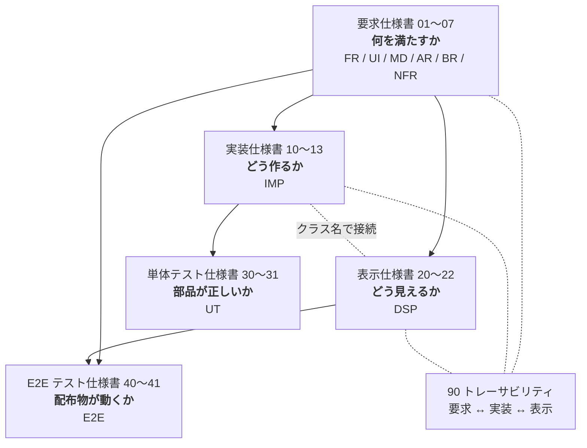

# MarkView 仕様書

MarkView は、Markdown ファイルの**閲覧に特化した**軽量デスクトップアプリケーションである。
本ディレクトリは MarkView の仕様一式であり、実装・レビュー・受け入れ判定の一次情報源とする。

| 項目 | 内容 |
| --- | --- |
| プロダクト名 | MarkView |
| 実行ファイル名 | `MarkView`（Windows: `MarkView.exe`） |
| リポジトリ | <https://github.com/kznagamori/go_MarkView> |
| 作成者 | kznagamori |
| ライセンス | MIT |
| 文書バージョン | 4.17.0 |
| 最終更新 | 2026-09-03 |

## 文書構成

仕様書は 5 つの層に分かれる。上位の層が下位の層を規定し、下位が上位と矛盾する場合は**上位を正とする**。2 つのテスト仕様書は、要求と実装の双方を根拠として「満たせたと言えるか」を定める。

2 つのテストは代替関係にない。単体テストは部品の境界値を、E2E テストは組み上がった配布物の動作を見る（E2E-001）。

### 要求仕様書 — 何を満たすか

利用者から見た振る舞いと、満たすべき性質を定める。実装手段には踏み込まない。

| # | 文書 | 内容 | ID |
| --- | --- | --- | --- |
| 01 | [概要・コンセプト](01-overview.md) | 目的、ターゲット利用者、ユースケース、スコープ、用語定義 | — |
| 02 | [機能要求](02-functional.md) | 表示・ファイル操作・アウトライン・ファイルツリー・リンク遷移・コピー | `FR` |
| 03 | [画面・操作仕様](03-ui.md) | ウィンドウ構成、ツールバー、ペイン、ショートカット、設定の永続化 | `UI` |
| 04 | [Markdown 描画仕様](04-markdown.md) | 対応する Markdown 文法、GitHub 準拠の描画規則、Mermaid・PlantUML・数式 | `MD` |
| 05 | [アーキテクチャ](05-architecture.md) | 技術構成、モジュール構成、採用ライブラリ、データフロー | `AR` |
| 06 | [ビルド・配布](06-build-release.md) | ビルド手順、GitHub Actions による CI/CD、リリース成果物 | `BR` |
| 07 | [非機能要求](07-nonfunctional.md) | 性能・サイズ・メモリ・安全性・互換性・保守性の目標値 | `NFR` |

### 実装仕様書 — どう作るか

要求を実現する手段を、型定義・関数シグネチャの粒度まで定める。実際のソースコードではなく、実装者が迷わず着手するための設計である。

| # | 文書 | 内容 | ID |
| --- | --- | --- | --- |
| 10 | [全体構成と規約](10-impl-overview.md) | ディレクトリ構成、パッケージ依存、エラー処理、ログ、並行性、テスト方針 | `IMP-0xx` |
| 11 | [Go 側](11-impl-backend.md) | mdfile / document / renderer / filetree / watcher / config / assetsrv / opener / buildinfo / App | `IMP-1xx` |
| 12 | [フロントエンド側](12-impl-frontend.md) | DOM 構造、モジュール分割、遅延ロード、検索、コピー、ショートカット | `IMP-2xx` |
| 13 | [Go ↔ フロントエンド インターフェース](13-impl-interface.md) | バインドメソッド、イベント、DTO、エラーの受け渡し | `IMP-3xx` |

### 表示仕様書 — どう見えるか

配色・寸法・書体・状態遷移を具体値で定める。実装仕様書が定めたクラス名に対して見た目を与える。

| # | 文書 | 内容 | ID |
| --- | --- | --- | --- |
| 20 | [デザイン基礎](20-display-foundation.md) | カラートークン、タイポグラフィ、寸法、重なり順、モーション | `DSP-0xx` |
| 21 | [コンポーネント](21-display-components.md) | ツールバー、ペイン、本文、コードブロック、Alerts、ダイアログ | `DSP-1xx` / `DSP-2xx` |
| 22 | [状態と遷移](22-display-states.md) | 画面の状態、ペインの組み合わせ、スクロール位置、検索、ウィンドウ幅への追随 | `DSP-3xx` |

### 単体テスト仕様書 — 満たせたと言えるか

要求と実装に対して、何をどう検証するかを定める。**有効なテストを書くこと**と、**有効でないテストを書かないこと**の両方を扱う。

| # | 文書 | 内容 | ID |
| --- | --- | --- | --- |
| 30 | [方針と禁止事項](30-test-policy.md) | テストの目的、有効なテストの指針、**禁止事項**、命名・配置、カバレッジの扱い、レビュー観点 | `UT-0xx` |
| 31 | [テストケース](31-test-cases.md) | パッケージごとの入力・期待値、要求とテストの対応表 | `UT-090`, `UT-1xx`〜`UT-9xx` |

対象は **`internal/` 配下のパッケージ**に限る。`main.go` と `app.go` は Wails に依存するため対象外とし、判断を伴うロジックは `internal/session` へ切り出す（UT-002, IMP-012）。フロントエンドは開発ホストに Node.js を要求しない方針（BR-001）から対象外とし、描画スモークテスト（BR-054）と手動確認で担保する（UT-002）。

### E2E テスト仕様書 — 配布物が動くか

ビルドされた配布物に対して、**利用者が受け取る形のまま**動作を確かめる。自動実行と手動実行を分けて定める。

| # | 文書 | 内容 | ID |
| --- | --- | --- | --- |
| 40 | [方針と自動テスト](40-e2e-auto.md) | 自動と手動の分担、検証環境、検証用データ、**CI で自動実行するケース**、要求 ↔ E2E の対応表 | `E2E-0xx` / `E2E-1xx` |
| 41 | [手動テスト](41-e2e-manual.md) | 実施の単位、環境コード、優先度、**人が操作して確認するケース 67 件** | `E2E-2xx` / `E2E-3xx` |

自動テストは **WebView の UI を操作しない範囲**（配布物の構成、起動と終了、CLI 出力、依存ライブラリ、描画スモーク）に限る。UI の操作を伴う確認は手動テストに委ねる（E2E-002）。

**要求がどのケースで確かめられるかは 40 章 40.5 の対応表**（E2E-030）にある。単体テストの対応表（31 章 31.10）と対をなし、**両方を合わせて網羅性を追う**（E2E-032, UT-902）。

手動テストの実施記録は、41 章から生成する Excel（`docs/tests/results/MarkView_手動テスト結果_v<version>.xlsx`）に記入し、そのままコミットする。生成は `docs/tests/gen_manual_test_xlsx.py` が行い、**ケースの定義は 41 章が正**である（E2E-200）。未記入の雛形はリポジトリに置かず、検証するバージョンごとに生成する。

### 横断

| # | 文書 | 内容 |
| --- | --- | --- |
| 90 | [トレーサビリティ](90-traceability.md) | 要求 ↔ 実装 ↔ 表示 の ID 対応表（正引き・逆引き・カバレッジ）。要求 ↔ 単体テストの対応は [31 章 31.10](31-test-cases.md)、**要求 ↔ E2E テストの対応は [40 章 40.5](40-e2e-auto.md)** にある |

## 目的別の読み方

| 知りたいこと | 読む順序 |
| --- | --- |
| このアプリが何であるか | [01](01-overview.md) → [02](02-functional.md) |
| ある機能をこれから実装する | [90](90-traceability.md) で対応 ID を引く → 該当の `FR`/`UI` → `IMP` → `DSP` |
| 画面を作る | [12](12-impl-frontend.md)（構造）→ [20](20-display-foundation.md)〜[22](22-display-states.md)（見た目） |
| Markdown の変換部分を作る | [04](04-markdown.md)（規則）→ [11](11-impl-backend.md) 11.3 節（実装） |
| Go とフロントの受け渡しを知る | [13](13-impl-interface.md) |
| ビルドとリリースを設定する | [06](06-build-release.md) → [10](10-impl-overview.md) 10.4 節 |
| テストを書く | [30](30-test-policy.md)（書き方と**書いてはいけないもの**）→ [31](31-test-cases.md)（対象パッケージの節） |
| テストをレビューする | [30](30-test-policy.md) 30.6 節のチェックリスト |
| リリース前に確認する | [41](41-e2e-manual.md) の E2E-205（検証手順）→ [40](40-e2e-auto.md)（自動テストの結果）→ `docs/tests/results/` の Excel（手動確認） |
| 仕様を変更する | 要求仕様を直す → [90](90-traceability.md) で影響する `IMP`/`DSP` を、[31 章 31.10](31-test-cases.md) で影響する `UT` を特定 → 該当箇所を直す |

## ID の体系

各仕様には一意の ID を付与し、実装・テスト・レビューから参照できるようにする。

| 接頭辞 | 層 | 意味 | 定義文書 |
| --- | --- | --- | --- |
| `FR-nnn` | 要求 | 機能要求（Functional Requirement） | [02](02-functional.md) |
| `UI-nnn` | 要求 | 画面・操作要求（User Interface） | [03](03-ui.md) |
| `MD-nnn` | 要求 | Markdown 描画要求 | [04](04-markdown.md) |
| `AR-nnn` | 要求 | アーキテクチャ上の決定・制約 | [05](05-architecture.md) |
| `BR-nnn` | 要求 | ビルド・リリース要求 | [06](06-build-release.md) |
| `NFR-nnn` | 要求 | 非機能要求 | [07](07-nonfunctional.md) |
| `IMP-nnn` | 実装 | 実装仕様（Implementation） | [10](10-impl-overview.md)〜[13](13-impl-interface.md) |
| `DSP-nnn` | 表示 | 表示仕様（Display） | [20](20-display-foundation.md)〜[22](22-display-states.md) |
| `UT-nnn` | テスト | 単体テスト仕様（Unit Test） | [30](30-test-policy.md)〜[31](31-test-cases.md) |
| `E2E-nnn` | テスト | E2E テスト仕様（End-to-End Test） | [40](40-e2e-auto.md)〜[41](41-e2e-manual.md) |

`IMP` の番号帯は以下のとおり。

| 帯 | 対象 |
| --- | --- |
| `IMP-001`〜`042` | 全体構成・規約・テスト方針 |
| `IMP-100`〜`104` | `internal/document` |
| `IMP-105` | `internal/mdfile`（拡張子判定。依存なしの葉パッケージ） |
| `IMP-110`〜`119` | `internal/renderer` |
| `IMP-130`〜`133` | `internal/filetree` |
| `IMP-140`〜`142` | `internal/watcher` |
| `IMP-150`〜`153` | `internal/config` |
| `IMP-160`〜`162` | `internal/assetsrv` |
| `IMP-170`〜`172` | `internal/opener` |
| `IMP-180`〜`181` | `internal/buildinfo` |
| `IMP-190`〜`194` | `app.go`（状態管理・起動・終了） |
| `IMP-200`〜`295` | `frontend/` |
| `IMP-300`〜`331` | Go ↔ フロントエンドの境界 |

`UT` の番号帯は以下のとおり。

| 帯 | 対象 |
| --- | --- |
| `UT-001`〜`070` | 方針・禁止事項・命名・カバレッジ・レビュー観点 |
| `UT-090` | ケース表の読み方 |
| `UT-1xx` | `internal/document` |
| `UT-2xx` | `internal/renderer` |
| `UT-3xx` | `internal/filetree` |
| `UT-4xx` | `internal/watcher` |
| `UT-5xx` | `internal/config` |
| `UT-6xx` | `internal/assetsrv` |
| `UT-7xx` | `internal/opener` / `internal/ostheme` |
| `UT-8xx` | `internal/buildinfo` / `internal/session` / `internal/applog` |
| `UT-900`〜`902` | 要求とテストの対応、テストを持たない要求の扱い、網羅性 |

`E2E` の番号帯は以下のとおり。

| 帯 | 対象 |
| --- | --- |
| `E2E-001`〜`032` | 方針・環境・検証用データ・自動テストの禁止事項・**要求との対応**（E2E-030 系） |
| `E2E-100`〜`109` | 自動テストのケース |
| `E2E-200`〜`205` | 手動テストの運用・記録項目 |
| `E2E-211`〜`345` | 手動テストのケース（G1〜G14） |

必須度は RFC 2119 に準じ、次の語で表す。

- **MUST**（必須）: 満たさない場合はリリース不可。
- **SHOULD**（推奨）: 合理的な理由がない限り満たす。
- **MAY**（任意）: 実装してもよい。将来拡張の候補を含む。

## 主要な設計判断（サマリ）

本仕様の骨格を決めている判断を以下に集約する。詳細と根拠は各文書を参照。

| 判断 | 内容 | 詳細 |
| --- | --- | --- |
| GUI 方式 | OS 標準 WebView（Windows: WebView2 / Linux: WebKitGTK）を Wails v2 で駆動 | [05](05-architecture.md) |
| 描画資産 | Mermaid・KaTeX・PlantUML・CSS をすべてバイナリに埋め込み、**完全オフライン動作** | [05](05-architecture.md) |
| 遅延ロード | Mermaid・KaTeX・PlantUML は該当記法を含む文書を開いたときのみ読み込む | [07](07-nonfunctional.md) |
| 変換の場所 | Markdown → HTML とシンタックスハイライトは**すべて Go 側**。JS のパーサを積まない | [11](11-impl-backend.md) |
| ウィンドウ数 | アプリは終始 1 つのウィンドウのみ。情報ダイアログも状態画面もその内部に描画する | [12](12-impl-frontend.md) |
| 左ペイン | ファイルツリーとアウトラインは**独立した 2 ペイン**として横に並べる | [03](03-ui.md) |
| 設定の保存先 | OS/ユーザのテンポラリディレクトリ。**ウィンドウ位置・倍率・最大化状態は保存しない**（サイズ・テーマ・ペイン・エディタのみ保存） | [03](03-ui.md) |
| 履歴 | 開いたファイルの履歴・パスは一切保存しない | [07](07-nonfunctional.md) |
| リンク | `.md` リンクは**同一ウィンドウ**で開き、`Alt+←` で戻る。外部 URL は既定ブラウザに委譲 | [02](02-functional.md) |
| UI 言語 | ツールバーはアイコンのみ。**ツールチップだけ英日併記**（`Open / 開く`）、他はすべて英語 | [03](03-ui.md) |
| ウィンドウタイトル | `<ファイル名> - MarkView` | [03](03-ui.md) |
| 埋め込み資産 | Mermaid / KaTeX / PlantUML はリポジトリで管理。**タグ付与を契機に CI が最新版へ自動更新**し、スモークテスト通過後にリリース。**取得した版のライセンスを検査する**（PlantUML は古い版が GPL） | [06](06-build-release.md) |
| 画像 | 文書内の画像は本文に表示する。画像への**リンク**は OS の既定ビューアに委ねる | [02](02-functional.md) |
| 編集 | アプリ内に編集機能を持たない。**押すたびに選択ウィンドウを出して**利用者の選んだエディタへ渡す（設定画面を持たないため） | [02](02-functional.md) |
| サイズ検査 | 目標値の超過は**警告に留め、ビルドもリリースも止めない** | [06](06-build-release.md) |
| 配布 | Windows: zip / Linux: tar.gz、いずれも amd64・arm64。インストーラと `.md` 関連付けは提供しない | [06](06-build-release.md) |

## 本仕様のスコープ外

MarkView は**ビューア**であり、以下は本バージョンのスコープに含めない（[01-overview.md](01-overview.md) 参照）。

- Markdown の編集・保存機能（**アプリ内**。外部エディタへ渡す操作は持つ。[FR-090](02-functional.md)）
- PDF・HTML 等へのエクスポート
- 印刷
- タブによる複数文書の同時表示
- プラグイン機構、ユーザ定義 CSS の読み込み
- UI の多言語化・ロケール切り替え（ツールチップの英日併記で代替）
- アプリ内の画像ビューア（OS の既定ビューアに委ねる）
- `.md` のファイル関連付け
- macOS 対応

## 改訂履歴

| 版 | 日付 | 内容 |
| --- | --- | --- |
| 1.0.0 | 2026-08-30 | 初版（要求仕様書 8 文書、要求 150 件） |
| 1.1.0 | 2026-08-30 | 未確定事項を解決し、UI 表示言語（UI-024）、ウィンドウタイトル（UI-013）、埋め込み資産のバージョン運用（BR-042, BR-043, BR-054）、ファイル関連付けの不提供（BR-071）を確定。文書間リンクの挙動を明確化し、ツリールート外への遷移（FR-052）を追加 |
| 1.2.0 | 2026-08-30 | レビューにより、画像リンクの表示先（FR-053）、大きなファイルの確認画面（FR-016, UI-052）、サイズ超過時の CI の扱い（BR-060, NFR-021）を確定。UI 文言の英語化漏れ、起動時間の測定条件、CI の二重実行、SVG 配信の防御を修正 |
| 1.3.0 | 2026-08-30 | 文書横断レビュー。引数なし起動の探索順を「カレント → 実行ファイルの場所」に変更（FR-013）。メモリ目標と測定用文書の矛盾、エラー通知先の不統一、情報ウィンドウとウィンドウ数の整合、参照 ID の誤り 3 件、用語ゆれを修正。要求 160 件で確定 |
| 2.0.0 | 2026-08-30 | **実装仕様書（10〜13、`IMP` 95 件）と表示仕様書（20〜22、`DSP` 65 件）を追加。** 本索引を 3 層構成に再編し、要求 ↔ 実装 ↔ 表示のトレーサビリティ（90）を追加 |
| 2.1.0 | 2026-08-30 | アプリケーションアイコン（`assets/icon.ico` / `icon.png`）の仕様を追加（UI-025, BR-013, IMP-032, DSP-017）。実装・表示仕様のレビューにより、SVG シンボルの不足 8 種、UI 文言の不足、確認待ち状態の保持漏れ、ツールチップの重なり順を修正 |
| 2.2.0 | 2026-08-30 | 実装・表示仕様の横断レビュー。狭いウィンドウでのペイン自動非表示を要求へ昇格（UI-026, IMP-246）。Alerts のアイコンがサニタイズと衝突する問題を IMP-112 / IMP-225 で解消。`ScrollDTO` に `keep` を追加、起動時の大きなファイル・ウィンドウサイズ取得・KaTeX の描画方式・ツールチップのキー二重管理を修正 |
| 3.0.0 | 2026-08-30 | **単体テスト仕様書（30〜31、`UT` 84 件）を追加。** 有効なテストの指針（UT-010 系）と、有効でないテストを防ぐ禁止事項（UT-030 系）を定め、パッケージごとの入力・期待値と、要求 ↔ テストの対応表を整備。カバレッジは数値目標を置かず、要求 ID ごとのテストの有無で網羅性を追跡する方針とした |
| 4.0.0 | 2026-08-31 | **E2E テスト仕様書（40〜41、`E2E` 76 件）を追加。** 自動実行（WebView を起動しない範囲）と手動実行（59 ケース）を分けて定義。手動テストの実施記録用に `tests/MarkView_手動テスト仕様書.xlsx` を 41 章から生成する運用とし、生成スクリプトを `scripts/` に置いた |
| 4.1.0 | 2026-08-31 | E2E テスト仕様の横断レビュー。手動テストの検証フローを「プレリリースタグで成果物を作り、それを検証してから本タグを打つ」形に確定（E2E-205）。これに伴い、埋め込み資産の自動更新をプレリリース時のみとし（BR-043）、rc で検証した内容がそのまま配布されることを保証。未知のオプションの扱い（FR-012）、検証用データの重複、節参照の誤りを修正 |
| 4.2.0 | 2026-08-31 | 手動テストの記録用 Excel を `docs/tests/results/` へ移し、生成を PowerShell + Excel COM から Python（openpyxl）へ移行（E2E-200）。未記入の雛形を持たず、バージョンごとに記録用ファイルを生成する運用に変更。E2E テスト仕様のレビューにより、成果物を要する手動テストを PR で行うとしていた矛盾（E2E-201）、配布物に同梱される README との食い違い（E2E-211）、rc 検証と噛み合わないバージョン確認（E2E-301）、`MD-020〜MD-026` の範囲表記が実際の確認内容と一致していなかった点（E2E-231）を修正 |
| 4.3.0 | 2026-09-03 | **多重起動（UI-115）と WebView のユーザデータ領域（AR-004）を新設。** 設定ファイルは全インスタンスで共有され保存が構造体まるごとの後勝ちになるため、**表示倍率とウィンドウの最大化状態を UI-110 から UI-111 へ移した**（ウィンドウごとに変えて使う値であり、後勝ちが利用者の意図と食い違う 2 項目）。あわせて WebView2 のユーザデータ領域を `%APPDATA%\MarkView.exe` から `%TEMP%\MarkView\webview2` へ移し、NFR-031 / NFR-033 に例外を明記（Linux は指定手段が無く既定に従う）。手動テストに E2E-315（多重起動）を追加し、E2E-104 / E2E-312 / E2E-313 の確認内容を拡張。要求 165 件、E2E 83 件 |
| 4.4.0 | 2026-09-03 | **未解決だった 3 件を仕様として確定。** (1) `NewLogger()` の置き場所を `internal/applog`（依存を持たない葉パッケージ）に定め、**`MARKVIEW_DEBUG` を読むのはそこだけ**とした（IMP-011, IMP-012, IMP-023, UT-806, UT-807）。(2) 画像の読み込み失敗の表示（DSP-123）を実装できる形にし、`img.is-broken` を 12 章と 21 章の接続点として定義（IMP-226）。**CSS だけでは書けないことと、配線時にすでに失敗しているものを拾う必要があることを明記。** (3) 見出しのアンカーアイコン（MD-020 の SHOULD）を実装すると決め、既存のフラグメント経路（IMP-223）に載せた（IMP-227, DSP-023, `icon-link`）。E2E-231 / E2E-236 の確認内容を拡張。実装 103 件、表示 67 件、単体テスト 88 件 |
| 4.5.0 | 2026-09-03 | **リリースノートの「変更点」の基準を BR-051 に定めた。** プレリリースは直前のタグ（rc を含む）、本リリースは直前の本リリース（rc を除く）を基準とする。本タグで rc を基準にすると、E2E-205 が「rc と本タグの間に別の変更を入れない」と定めているため変更点が空になる。**基準の選択に `git describe` を使うことを禁じた。** `vendor-update`（BR-043）が作る資産更新のコミットは既定ブランチへ取り込めないことがあり、その場合タグが本流から外れた枝に残って到達できなくなる。実際に `v0.1.0-rc.2` で基準が `specs-4.2.0` に落ち、変更点へ全履歴が並んだ。E2E-205 の手順 3 に、リリースノートの変更点を人が確かめる項目を加えた |
| 4.6.0 | 2026-09-03 | **外部エディタで開く機能を新設**（FR-090, FR-091, UI-103, UI-116, NFR-035, IMP-171, IMP-172, IMP-252, IMP-309, IMP-331, DSP-172, UT-704, UT-705, E2E-341〜344）。ツールバーに 7 つ目のボタンを置き、表示中のファイルを利用者が選んだエディタへ渡す。**編集機能は依然として持たない**（画像を OS の既定ビューアへ委ねる FR-053 と同じ委譲。NFR-031 は無傷）。**MarkView は設定画面を持たないため、押すたびに選択ウィンドウを出す**（UI-103）。エディタの指定は「操作した結果」が自然に定まらず尋ねる場面が要るところ、それを開く操作と一体にすることで設定画面を作らずに済ませ、変更手段が常に見えている状態にした。指定は絶対パスで `config.json` に保存し（UI-116）、テンポラリのままとして NFR-033 を保った。**この製品で唯一「任意の実行ファイルを起動する」経路**になるため、起動の制限を NFR-035 に 6 項目で定めた（利用者が選んだものだけ・引数は絶対パス 1 つだけ・フロントにパスを通さない・シェル非経由・絶対パス限定・自己起動の拒否）。**設定ファイルの `0700` / `0600`（UI-112）が、閲覧の秘匿だけでなく任意コード実行の防止にも効くことになった**ため、根拠を書き足した。41 章にグループ G14 を追加したことで後続の節番号がずれるため、**記録用 Excel の生成が節番号ではなく見出しでケース一覧を探すよう改めた**（E2E-200）。要求 170 件、実装 108 件、表示 68 件、単体テスト 90 件、E2E 87 件 |
| 4.7.0 | 2026-09-03 | **仕様書 20 文書の横断レビュー。** FR-090 の「状態画面を表示している間もエディタで開ける」が実装できない状態だったのを直した。渡すのは「表示中の文書」ではなく**画面がいま対象にしているファイル**とし、`App` に `target` を持たせる（IMP-190, IMP-192, IMP-193, IMP-310, IMP-331, NFR-035）。状態画面を出している間 `current` は**前に開いていた文書のまま残る**ため、そちらを渡すと利用者が見ているのと違うファイルが静かに開く。回帰を捕まえるため E2E-345（状態画面からエディタで開く）を新設した。あわせて UI-021 が `welcome` まで活性としていた矛盾を解消（対象は `confirm-large` / `too-large` / `render-error` の 3 つ）。**本索引の記述 8 件を訂正**（単体テストの対象に `app.go` を含めていた UT-002 との矛盾、手動ケース件数、ID 帯 5 件、スコープ外の但し書き）。4.6.0 の反映漏れを 13 件（UI-010 の図、03 章の節番号、IMP-202 の `btn-edit`、UI-060 / DSP-151 の情報レベル、DSP-015 / DSP-030 / DSP-032、21.10 節の見出し、DSP-182 の副次スタイル、E2E-204 ほか）、以前からの取り残しを 5 件（AR-011 の `applog` 欠落、IMP-040 のテスト対象表、11 章の並び順の注記、DSP-123 の変数名、UT-703 の表 7 行の破損）直した。要求 170 件、実装 108 件、表示 68 件、単体テスト 90 件、E2E 88 件 |
| 4.8.0 | 2026-09-03 | **外部エディタで開く機能（FR-090, FR-091）を実装し、実装しながら見つかった食い違いを仕様へ戻した。要求・実装・表示・テストの ID は 1 件も増やしていない。** (1) **IMP-171 の表が壊れていた。** 4.7.0 で足した段落（`path` は `App.target` である、の一文）が表の行 4 と行 5 の間に入り、`Start()` の成功が表から外れて素の文字列になっていた。段落を表の後ろへ移し、あわせて**「相対パスは、実在していても拒む」**ことと、**`opener` からは `session.SamePath` を呼べない**（IMP-012 が `internal/` 同士の依存を 2 系統に限るため、同じ規則を非公開の `samePath` として持つ）ことを明記した。 (2) **IMP-172 に「絶対パスでない候補を採らない」を OS 別に追加。** Windows は `%PROGRAMFILES(X86)%` などが空の環境で連結すると相対パスになるため候補ごと落とし、Linux は `$PATH` に相対パスの項目があると `exec.LookPath` が相対パスを返すため採らない。**どちらも作業ディレクトリに置かれた実行ファイルを起動しうる**（NFR-035 の 5）。UT-705 にケース 7〜9 を足し、**「ケース 3 だけでは探索順を検証できない」**ことを IMPORTANT で明記した（存在する候補が 1 件では、先に見つかったものを採る実装と後に見つかったものを採る実装が同じ結果になる）。UT-704 のシンボリックリンクのケースが Windows では常にスキップされ、CI の Linux ジョブで実際に走ることも注記。 (3) **UI-103 と IMP-252 が食い違っていた**（`Other...` を「常に選択できる」対「`Browse` まで選択できない」）。上位を正とし、**行は常に選べる／`Open` の活性は「選ばれていて、かつ `Available`」の 1 つの式で決める**とした。行まで選べなくすると、`Browse` はその行の中にあるため辿り着けない。 (4) **IMP-310 に 2 項目追加。** `ListEditors` は確定前の候補を捨てる（`Browse` して閉じた候補が次に開いたときも残ると、FR-091 の「閉じた場合は何も保存しない」が破れて見える）。**`OpenInEditor("custom")` は候補が無ければ設定に保存されたエディタを使う**（UI-116）。後者が無いと、一覧では選択済みとして出るのに `Open` が必ず `editor-failed` になる。**手動テストで実際に発生した。** 用いてよいかの判定は `EditorDTO.Available`（IMP-309）と同じ条件とし、**「一覧で選べる行」と「起動できる行」を一致させる。** (5) **IMP-251 と IMP-244 の矛盾を解消。** ダイアログ表示中でも `Enter` / `Shift+Enter` は**既定の動作を残す**。`Enter` の既定は「フォーカスしている操作要素の実行」であり、背後ではなくダイアログ自身の操作である。抑止すると UI-103 の「ボタンと `Enter` の 2 操作で開ける」が成立しない。**これも手動テストで発生し、情報ダイアログの `Close` も同じ経路で閉じられなかった。** (6) IMP-331 の図で `設定へ保存` と `Start()` の順が本文と逆だったのを直し、**保存は起動できたあとに行う**ことを明記。あわせて、対象が無いときに呼ばない判定をフロントエンドの 1 か所に置くことを定めた（ボタンは淡色で防げるが `Ctrl+E` は止まらない）。 (7) IMP-310 の「回復したパニックは `render-error`」に**エディタの 3 つの例外**（`editor-failed`）を追加。この結果はステータス領域に出るものであり、`Failed to render this document.` は状況と合わない。 (8) **IMP-200 に `editors.js` を追加**し、IMP-252 に分割の理由（`overlay.js` が 400 行の目安を大きく超える。IMP-011）と**循環参照の禁止**を明記。API の 3 つは `overlay.js` に残す。 (9) DSP-172 の `Browse` の位置を図に合わせ（表は「`Other...` の行の右端」だったが、21 章と 03 章の図はどちらも 1 段下）、**`Open` の無効時の見た目**を定めた。DSP-101 の「無効」は背景が透明であり、塗りつぶしの主スタイル（DSP-182）に当てるとボタンが消えたように見える。 (10) IMP-252 に「一覧が作れないときはウィンドウを出さない」「`Browse` が失敗したら描き直さず、いま出ている一覧を保つ」を追加。 (11) **E2E-342 / E2E-343 の穴を塞いだ。** 前者は手順に「`Enter` だけで開く」がありながら確認内容がフォーカス位置しか見ておらず、後者は `Other...` が初期選択になることは見るのに**そのまま `Open` を押す手順が無かった。** 上記 (4)(5) の 2 件は、この穴のせいで手動ケースを通り抜けていた。 要求 170 件、実装 108 件、表示 68 件、単体テスト 90 件、E2E 88 件（いずれも変更なし） |
| 4.9.0 | 2026-09-03 | **PlantUML 対応を新設した**（FR-024, MD-083, MD-084, MD-085, IMP-119, IMP-233, DSP-272, UT-215, UT-216, E2E-239, E2E-240）。言語指定 `plantuml` / `puml` のコードブロックを、Mermaid と同じ経路（Go 側で取り出して `data-source` を付け、描画はフロントエンド）で描画する。 **方式は `@plantuml/core`（PlantUML を TeaVM で Java → JavaScript へ移植したものと、Graphviz を WebAssembly で持つ Viz.js）のフル同梱とした。** 当初指定された `plantuml/plantuml.js` は **CheerpJ のランタイムを外部ホストから取得する実装であり、NFR-032（外部へ通信しない）と NFR-051（再配布可能なライセンス）の両方に反するため採らなかった。** (1) **描けないものを名指しで仕様にした**（MD-083）。**標準ライブラリ（`!include <C4/...>` 等。C4 モデル図）・`salt`・`ditaa`・4096 px を超える図**は描けない。同梱するのが PlantUML 本体ではなく JavaScript へ移植された実装であり、**利用者が基準にする Java 版との差分が実在する**ためである。「埋め込んだ版がサポートするすべて」とした Mermaid（MD-080）とは書き方を分けている。 (2) **取り込みのプリプロセッサ指令を Go 側で弾く**（MD-084, IMP-119, NFR-032）。対象は `!include` / `!includeurl` / `!includesub` / `!import` と `from` を伴う `!theme`。**同梱する版が実際には通信しないことは実測で確かめている**（記録用サーバへのアクセス 0 件）が、`XMLHttpRequest` の経路がバンドルに残っており、**資産は BR-043 で自動更新される**ため上流の変化を待たず入力側で塞ぐ。UT-216 は**拒んではいけないもの**（`from` の無い `!theme plain`、行頭でない `!include`、コメント行）を境界として先に置いている。 (3) **NFR-021 の実行ファイルを 25 MB から 30 MB へ引き上げた。** 同梱する資産は 5.09 MiBで、実測 21.87 MB の実行ファイルが約 27.2 MB になる。**残りは 2.8 MB しかない。** 配布アーカイブ（12 MB）は変えていない。 (4) **NFR-011 の描画目標を「1 枚あたり」に変えた**。Graphviz を要する図は 1 枚 400〜700 ms かかり（実測: 5 枚 2,136 ms、10 枚 7,104 ms）、既存の「図表入り文書で 1.5 秒」は 3 枚で破れる。**文書単位の秒数にすると測定用文書の定義を変えるたびに目標値が動く**ため、枚数を目標に織り込まない形へ改めた。描画中も UI は固まらない（メインスレッドの最大停止 4 ms）。 (5) **性能の基準環境を Windows 11 / amd64 と明記した**（7.1, NFR-010）。**性能要求には対象環境の記述が 1 つも無く、Linux にも同じ目標を課す読みになっていた。** Linux は測らず目標も課さないが、**描けることは同等とする**（NFR-061）。E2E-239 の環境に L1 を含め、描けなければ不具合として扱うことを確認内容に入れた。 (6) **EPL-2.0 を NFR-051 の許容ライセンスに加えた。** `viz-global.js` は Viz.js（MIT）だけでなく **Graphviz（EPL-2.0）と Expat（MIT）をオブジェクトコードで含む**。EPL-2.0 のコピーレフトは**ファイル単位**であり、改変しなければ本体の MIT 配布に伝播しない。**その条件は BR-042 の「改変は一切行わない」が既に担保しているが、裏を返せばこれは破ってはいけない条件になった**（サイズ削減のための再圧縮・結合・先頭の著作権表示の削除を禁じた）。 (7) **BR-040 に「全文を別途用意する」を追加した。** **Viz.js / Graphviz / Expat のライセンス全文はどちらのバンドルにも入っていない**（先頭にあるのは短い告知だけであり、`Eclipse Public License` の文字列すら無い）。あわせて、`@plantuml/core` の `LICENSE` が **「IGY distribution (Install GraphViz by Yourself)」——Graphviz を利用者が自分で入れる版の文面**であり、Viz.js を同梱する JS ビルドの実態と食い違うことを明記した。 (8) **BR-043 にライセンスの検査を加えた。** `@plantuml/core` は **1.2026.5 以前が GPL-3.0-or-later、1.2026.6 以降が MIT** である。自動更新は通常版を上げる方向へ動くため即座の危険は無いが、**検査が無いと上流のライセンス変更が黙って入る。** Mermaid / KaTeX には無かった問題である。 (9) **IMP-233 に描画処理系の癖を 4 つ書いた。** `render()` が Promise を返さない（完了は DOM 監視で待つ）、出力先を要素の id で指定する、`renderToString` が使えない、**Graphviz を要する図を Graphviz 無しで描こうとすると処理系ごと止まり、以降のすべての描画が返ってこなくなる**。最後の 1 つのため、`viz-global.js` の読み込みに失敗したら**PlantUML の描画を一切行わない**と定めた（IMP-230）。BR-054 のスモークテストで **Graphviz 系と非 Graphviz 系の両方**を見るのも、片方だけだとこの壊れ方を見落とすためである。 (10) **構文エラーの見せ方を Mermaid と分けた**（FR-024, DSP-272）。PlantUML は構文エラーを例外ではなく**エラーを描いた図**として返し、その図は行番号と該当行を含む。こちらで書き直さずそのまま出す。**「エラー図が出ている」と「描画をやめて理由を併記している」は別の状態**であることをDSP-272 に明記した。 手動テストは 65 件から **67 件**へ。**41 章を改訂したため、前回の結果は引き継がない**（E2E-201）。要求 174 件、実装 110 件、表示 69 件、単体テスト 92 件、E2E 90 件 |
| 4.10.0 | 2026-09-03 | **仕様書 20 文書の横断レビュー。ID は 1 件も増減していない**（要求 174 / 実装 110 / 表示 69 / 単体テスト 92 / E2E 90）。**36 件の ID を直し、4.9.0 で新設した DSP-272 と E2E-240 の内容も見直した。** ID を持たない箇所（01 章の 1.3.2 / UC-04 / 1.5.1、07 章の 7.1 / 7.9.2）も直している。 (1) **NFR-035 の表と本文が正面から矛盾していた。** 表の「引数」列が**「表示中の文書の絶対パス」**であり、その直下の項目 2 の**「『表示中の文書』を渡してはならない」**と反対のことを述べていた。4.7.0 で `App.target` を導入したときに本文だけを直し、表を残したものである。**ここは制限の根拠であり、表だけを見て実装すると FR-090 の不具合がそのまま戻る。** あわせて UI-020 / UI-090 の表記も「画面が対象にしているファイル」へ揃えた。 (2) **サニタイズの許可リスト（IMP-116）に PlantUML の属性が無かった。** `data-plantuml` と `data-puml-error` は変換パイプラインの最後段で落ちるため、**描画対象も拒んだブロックもフロントエンドから見えなくなる**（IMP-119, IMP-233）。あわせて、許可する `class` の接頭辞を「`math-` など」と濁していたのをやめ、`mermaid-source` / `plantuml-source` を含めて**自前で出力するものをすべて列挙**した。UT-209 に確認を 2 件足している。 (3) **検索の走査除外（IMP-241）の根拠が Mermaid だけになっていた。** PlantUML の出力も SVG であり、**図の中の文字が大量にヒットする。** 同じ理由で IMP-243 / DSP-370（テーマ切り替えの再描画）も、IMP-210 / IMP-220 / IMP-221 / IMP-321（状態・描画手順・コピー対象・再描画）も揃えた。 (4) **`document.Document`（IMP-100）と goldmark の拡張リスト（IMP-111）に PlantUML が無かった。** `renderer.Result` と `DocumentDTO` には 4.9.0 で入れたが、**その間を中継する型が抜けていた。** IMP-011 のディレクトリ構成に `plantuml.go` を足し、IMP-290 に図を描かなかった理由の文言 3 件を加えた（**DSP-272 が「理由を併記する」と定めていながら、その文言がどこにも無かった**。IMP-290 は全文言の集約を定めている）。 (5) **DSP-272 の「理由 3 種」を判定できる形へ直した。** 旧版は「大きすぎる図」と「描画の失敗」を分けていたが、**フロントエンドには図種別を見分ける手段がない。** 判定を「**SVG が得られたか**」だけに絞り、取り込み指令 / 処理系が図を返さなかった / 描画が完了しなかったの 3 種とした。`salt` のように版によってエラー図を返したり例外テキストを返したりするものはどちらの見え方にもなりうるため、E2E-240 の確認内容も**「どちらでもよいが、空白にならず他の図を止めない」**へ改めた。 (6) **NFR-021 を 30 MB へ上げた後も「25 MB」が 4 か所に残っていた**（01 章 1.3.2、AR-033 の NOTE、BR-060 の閾値、E2E-107 の警告判定）。**BR-060 と E2E-107 は CI の警告判定そのもの**であり、放置すると同梱直後から常に警告が出続ける。AR-033（chroma を絞らない判断）には、**余裕が 2.8 MB になり再検討の契機が近づいた**ことを追記した。 (7) **BR-043 / BR-050 / BR-051 の自動更新の手順が 2 資産のままだった。** 取り出すファイル、「一部だけの更新をしない」の件数、3 つのジョブ図、リリースノートに載せる版を揃えた。**`emoji.js` と `openiconic.js` は取らない**ことも明記している（AR-020 の資産表と揃えるため）。 (8) **E2E-334（arm64 の起動確認）に Graphviz の確認を加えた。** Viz.js の Graphviz は WebAssembly で動くため、**この製品で唯一 arm64 の差が出うる箇所**である。E2E-302（ライセンス表示）にも **Graphviz の EPL-2.0 全文が入っていること**を確認項目として加えた（BR-040, NFR-051）。 (9) **31.10 の NFR-032 を `— (ABSENCE)` から UT-216 へ改めた。** 「通信しないことの証明は困難」は今も真であるが、**取り込み指令を弾くことは検証できる**ようになった（IMP-119）。あわせて MD-083 の行の誤字（「挿る舞い」）を直した。 (10) **IMP-011 の `ostheme` の注記を直した。** 「依存を持たない葉パッケージ」という、IMP-012 の例外 3 つ（`mdfile` / `localurl` / `applog`）と**同じ言い回しを使っていた**。例外は「任意のパッケージが依存してよい」という意味であり、`ostheme` は `app.go` からしか使わない。 なお、AR-002（方式選定の比較表）と NFR-072（ドッグフーディング）の Mermaid の記述は**意図的に残している。** 前者は 2026-08-30 時点の選定の記録であり、後者は仕様書自体が PlantUML を含まないためである |
| 4.11.0 | 2026-09-03 | **Graphviz 系のライセンス処理を Mermaid・KaTeX・PlantUML と同じ扱いに揃えた。ID は増減していない。** **4.9.0 の時点では、`viz-global.js` が同梱する Viz.js / Graphviz / Expat だけが 2 系統のどちらにも収まっていなかった。** 実ファイル（`viz-global.js`）は `frontend/vendor/` にあって BR-042 の管理下にあるのに、**ライセンス全文がその tarball に入っていない**ため、BR-040 が「別途用意して生成スクリプトから参照する」としか書けておらず、**置き場所も、版の記録も、更新の責任も未定義**だった。この状態では BR-041 の鮮度検査も効かない。 (1) **`vendor.json` を全資産共通の形へ拡張した**（BR-042, IMP-181）。従来の名称・バージョン・取得元・取得日に加えて、**ライセンス種別（`spdx`）・全文の位置（`license`）・同梱元（`bundledIn`）**を持つ。**同梱物の中に含まれるものも、最上位の資産とまったく同じ形で並べる。** (2) **BR-040 から決め打ちを外した。** `frontend/vendor/` にあるものは名称・版・種別・全文のすべてを `vendor.json` から引き、**Mermaid・KaTeX・PlantUML と Viz.js・Graphviz・Expat が同じ経路で一覧に載る。** 生成スクリプトが定義を持つのは `frontend/vendor/` に無いもの（`github-markdown-css` と Octicons）だけとした。**`license` の指す全文が読めなければ生成を失敗させる**（空欄のまま出力しない）。 (3) **全文の入手方法を決めた**（利用者の判断）。`frontend/vendor/plantuml/licenses/` にコミットして管理し、**改変しない**。**自動更新（BR-043）は取りに行かない。** EPL-2.0 と MIT の本文は版に依存せず、毎回取得する意味がないためである。 (4) **代わりに `viz-global.js` の告知を機械で照合する**（BR-043）。**告知が名指しするプロジェクトが `vendor.json` の記録と過不足なく一致すること**と、**告知の著作権表示が全文に含まれること**を確かめ、食い違えば**リリースを中止する**。Viz.js の版は告知から `vendor.json` へ書き戻す。**この照合が、全文を取りに行かないことの代償を埋めている。** 同時に、**この方法で捕まえられないもの**（同じ 3 件のまま上流が全文だけを差し替えた場合）も明記した。 (5) **版が分からないものの扱いを定めた。** `viz-global.js` の告知は Viz.js の版しか持たず、Graphviz と Expat の版は現れない。**`version` を空とし、一覧では `—` と表示する。版が無いことを理由に記録から落とさない**——再頒布の条件は**名称・ライセンス種別・全文**の 3 つであり、版は条件ではない（NFR-051）。UT-801 にこの観点のケースを 4 件足した（**「版が無いものを捨てる」実装は `Bundled` 行では正しく見えるのに、ライセンス一覧から Graphviz が消える**）。 (6) **`Bundled` 行の範囲を明記した**（UI-100, FR-100, IMP-306）。**同梱物の中に含まれるものはここに出さない。** 版を持たないものがあり並べても役に立たないためで、**表示しないだけで記録からは外さず**、`Third-party licenses` に全文とともに現れる。絞り込みは `buildinfo.Bundled()` の 1 か所に置き、フロントエンドで絞らない。 (7) **NFR-051 の判定を機械化した。** `vendor.json` の `spdx` を許容一覧と突き合わせる。BR-043 が求めていた「取得した版のライセンスを確かめる」に、読むべき値ができた。 あわせて AR-011 / IMP-011 のディレクトリ構成、AR-020 の資産表、E2E-301 / E2E-302 の確認内容を揃えた。要求 174 件、実装 110 件、表示 69 件、単体テスト 92 件、E2E 90 件（いずれも変更なし） |
| 4.12.0 | 2026-09-03 | **仕様書 20 文書の横断レビュー。ID は増減していない。10 件の ID を直した。** (1) **見出しスラッグの規則（MD-021, IMP-117）が GitHub と食い違い、本仕様書自身のアンカーが解決しない状態だった。** 旧規則は「英数字・`-`・`_`・**非 ASCII 文字**以外を除去する」であり、**全角の括弧・中黒・矢印（`（` `）` `・` `→`）まで残る。** GitHub 側はこれらを除去するため、同じ見出しに対して違うアンカーが生まれる。**機械的に確かめたところ、90 章が持つ 3 本のリンク**（`#903-正引き要求--実装表示` ほか）**が MarkView 上で解決しない。** 仕様書は MarkView で読む対象でもある（NFR-072, E2E-238）。規則を「**Unicode で「文字」または「数字」に分類される文字だけを残す**」へ改め、UT-202 にケースを 2 件、E2E-263 に手順を 1 つ足した（**検証には 90 章の 3 本のリンクがそのまま使える**）。 (2) **同じ MD-021 で、連続する空白の扱いが書かれていなかった。** IMP-117・UT-202・UT-014 の 3 か所は「連続する空白は 1 つのハイフン」で一致しているのに、**上位の要求だけが黙っていた。** 明記して揃えた。 (3) **MD-010 の本文フォントスタックが DSP-020 と食い違っていた。** MD-010 は 「`… Arial, sans-serif` に加え、日本語向けに `"Yu Gothic UI" …` を続ける」と書いており、**そのとおりに書くと `sans-serif` が必ず解決するため、日本語フォントの指定に到達しない。** DSP-020 の 1 本のスタック（日本語フォントを `sans-serif` より前に置く）へ揃え、理由も残した。 (4) **DSP-301 の状態遷移図に `confirm-large` → `render-error` が無かった。** `Open anyway` を押した結果が変換エラーになる経路は実際に起こる。図に足したうえで、**この図は主な経路であって遷移を制限する表ではない**ことを明記した。 (5) **MD-030 の「サーバ側（Go）で行い」という表現を「Go 側」へ改めた。** MarkView は内部アセットサーバ（AR-040）を持つが、変換とハイライトはそれとは無関係である。根拠も NFR-011（性能）から **AR-031**（変換の場所を定める要求）へ直した。 (6) **4.11.0 の反映漏れを 3 件。** AR-011 の `vendor.json` の説明が旧形式のまま、NFR-034 が「バージョンは情報ウィンドウで確認できる」としていた点（同梱物の中に含まれるものは `Bundled` 行に出ない。UI-100）、BR-042 の開発時の更新手順に**告知の照合**（BR-043）が入っていなかった点。 要求 174 件、実装 110 件、表示 69 件、単体テスト 92 件、E2E 90 件（いずれも変更なし） |
| 4.13.0 | 2026-09-03 | **単体テスト・E2E テスト仕様書のレビュー。E2E に網羅性の追跡を新設した**（E2E-030, E2E-031, E2E-032）。**新設 3 件・改訂 28 件。** (1) **E2E には、単体テストの 31.10 に相当する対応表が無かった。** UT-061 / UT-902 は「全要求を 1 行ずつ並べ、テストの無い要求に分類記号を付す」と定めているのに、**E2E 側には対応する規定が無く、要求を足しても E2E の漏れが検出できない**状態だった。40 章に **40.5 節「要求と E2E テストの対応」**を置き、全 174 要求を 1 行ずつ並べた（**133 件がケースに対応、41 件が分類記号**）。記号は UT-901 とは別に定める——あちらの `GUI`（画面だから単体テストにしない）は**こちらではむしろ主題**であり、代わりに `INTERNAL`（外から観測できない）と `VISUAL` を置いた。**2 つの表は互いを埋め合う関係にある**ことを両側に明記した。 (2) **各ケースの「関連要求」が体系的に不完全だった。** 集計すると **75 件の要求がどのケースからも参照されていない**状態で、その中には**実際には確かめているのに書かれていないもの**が多数あった（FR-015 は E2E-274 の `F5`、UI-013 は E2E-211 のタイトル確認、UI-024 は E2E-103 の「出力の言語」、MD-072 は E2E-231 の `
` 確認）。手動 24 ケースと自動 3 ケースの関連要求をそろえ、**参照なしを 75 件から 41 件へ**減らした。残る 41 件は分類記号を付けた意図的な不在である。 (3) **表を作る過程で、確認内容そのものの穴が 7 つ見つかった。** **最も重いのは MD-081**——`securityLevel: strict` が効いているか、つまり**図の定義からクリックで遷移や実行が起きないか**を手動テストで一度も確かめていなかった。**文書は任意の第三者から受け取りうる**（NFR-030）。E2E-234 に手順と確認内容を足した。同じく **MD-072 / NFR-030 の「`<script>` と `onclick` が消えること」も手動で確かめていなかった**——サニタイズは単体テスト（UT-209）にはあるが、**配布物で実際に効いているか**は別である。E2E-231 に足した。他に MD-073（Front Matter が本文に出ない）、UI-050（本文の最大幅と中央寄せ）、UI-010 / UI-041（ペインの並び順）を確認内容へ、UI-031（ツリーのキーボード操作）を E2E-242 の手順へ、UI-102（情報ダイアログのリンクで既定ブラウザが開く）を E2E-301 の手順へ足した。 (4) **本索引の `UT-7xx` の帯が `internal/opener` だけになっていた。** 31 章 31.8 は「opener / ostheme」であり、UT-703 は `ostheme` を対象としている。`internal/ostheme` を帯に加えた。 あわせて 30 章 UT-061、90 章 90.1、本索引から 40.5 の対応表へ接続した。要求 174 件、実装 110 件、表示 69 件、単体テスト 92 件、**E2E 93 件**（+3）。手動テストのケース数は 67 件で変わらない |
| 4.14.0 | 2026-09-03 | **P8 の単体テストと自動 E2E テストを先に書き、その過程で見つかった食い違いを直した。ID は増減していない。改訂 5 件。** (1) **4.12.0 のスラッグ規則の修正が半分だけだった。** 全角記号を除去する規則は入れたが、**連続する空白の扱いを直していなかった。** MD-021 / IMP-117 / UT-202 / UT-014 はいずれも「連続する空白は 1 つの `-` にまとめる」としていたが、GitHub は**空白 1 つにつき `-` を 1 つ**書く。記号を除いた跡に空白が並ぶため（`要求 → 実装` は `→` を落とすと空白が 2 つになる）、**まとめると 4.12.0 で根拠に挙げた 90 章の 3 本のアンカーがやはり解決しない。** 実データで両方の規則を突き合わせて確かめた（まとめる: 3 本が解決しない / まとめない: 0 本）。**2 つの規則が両方そろって初めて `#903-正引き要求--実装表示` が解決する。** UT-202 に `a   b` → `a---b` と `a ! b` → `a--b` を置き、UT-014 の例も直した。 (2) **IMP-233 に描画結果のフックの名前を書いた。** `.plantuml-rendered` と `.plantuml-error` とし、Mermaid の `.mermaid-rendered` / `.mermaid-error`（IMP-231）と同じ形にそろえる。**この 2 つは描画スモークテストが見る**（BR-054, E2E-109）。仕様に無いまま実装すると、実装できていても検査が 0 件で落ちる。 |
| 4.15.0 | 2026-09-03 | **P8 の段階 D（同梱資産）の実装で見つかった食い違いを直した。ID は増減していない。改訂 2 件。** (1) **BR-043 の照合 2 が、そのままでは必ず失敗する。** 告知は `Copyright (c) Michael Daines` と年を書かないが、Viz.js のライセンス全文は `Copyright (c) 2014-2018 Michael Daines` と年を持つ（実測）。**行を丸ごと部分文字列として探すと、正しい組み合わせに対して毎回リリースが止まる。** 比べるのは**著作権者の名前**とし、年を取り除くことを明記した。あわせて**照合 1 で数える集合が 3 件である**ことも注記した（告知の 1 行目の `Viz.js` を数え忘れると、やはり正しい告知でリリースが止まる）。 (2) **BR-042 に「更新時は `licenses/` を残す」を足した。** 資産の入れ替えは階層ごと消してから置くため、明記しないと**自動更新が走った瞬間に 3 件のライセンス全文が消える**。NFR-051 の「著作権表示とライセンス全文の保持」に直接触れる。 |
| 4.16.0 | 2026-09-03 | **P8 の段階 E（フロントエンドの描画）の実装で決めたことを反映した。ID は増減していない。改訂 2 件。** (1) **取り込み指令で拒まれたブロックの理由は、資産を読まずに出す。** それらは `needsPlantUML` を立てないため（IMP-119）、**`needsPlantUML` を条件に描画関数を呼ぶと理由が出ない**（DSP-272 が求める `pumlInclude` が永久に表示されない）。描画関数を「描くものが無ければ資産を読まずに戻る」形にし、条件を付けずに呼ぶことを IMP-233 に明記した。NFR-013 は早期の戻りで保たれる。 (2) **SVG 以外が書き込まれたら、タイムアウトを待たずに短い猶予で切り上げる。** 処理系は「描けない」と答えるときも対象要素へ何かを書くが SVG にはならず、**描画は逐次であるため**（IMP-233）、待ち続けると描けない図 1 枚が後続をタイムアウトいっぱい待たせる。実測で `@startditaa` が 1 枚 30 秒を空費していた（猶予を入れて文書全体が 31.4 秒 → 1.9 秒）。 |
| 4.17.0 | 2026-09-03 | **同梱資産の「改変を一切行わない」に、バージョン管理による改行コードの正規化が含まれることを明記した。ID は増減していない。改訂 1 件。** `.gitattributes` の `* text=auto eol=lf` はコミット時に CRLF を LF へ書き換えるため、**取得した資産をそのまま格納する**という BR-042 の条件を静かに破る。実際、PlantUML を加えたときに **`viz-global.js` と `plantuml/LICENSE` の 2 件が書き換わって格納される**ところだった（`git hash-object --no-filters` との比較で確認）。前者は Graphviz（EPL-2.0）をオブジェクトコードで含んでおり、**改変しないことがコピーレフトを伝播させない条件**である（NFR-051）。`frontend/vendor/** -text` で正規化の対象から外し、資産を追加するときの確かめ方も書いた。 |
