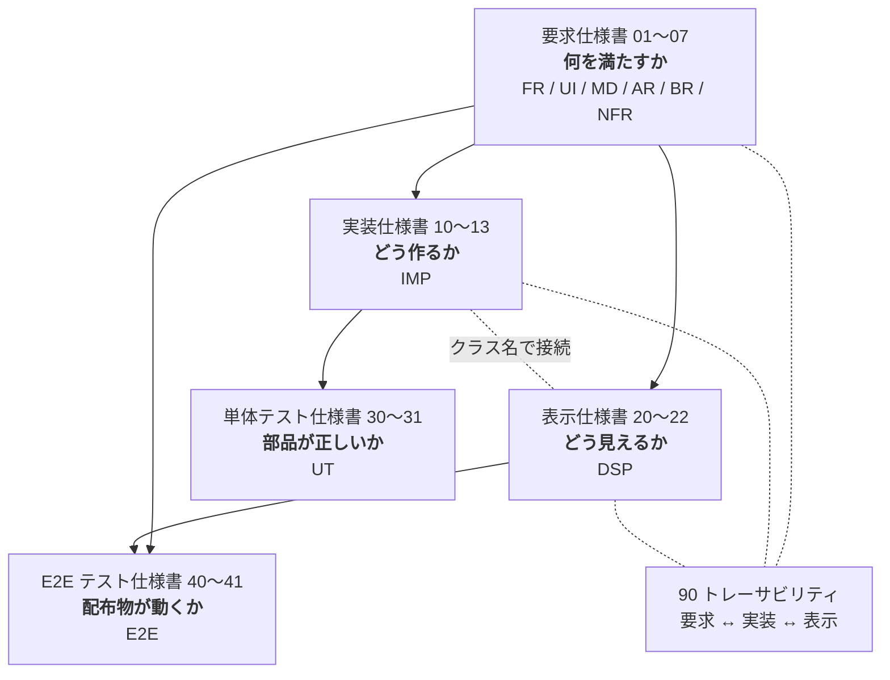

# MarkView 仕様書

MarkView は、Markdown ファイルの**閲覧に特化した**軽量デスクトップアプリケーションである。
本ディレクトリは MarkView の仕様一式であり、実装・レビュー・受け入れ判定の一次情報源とする。

| 項目 | 内容 |
| --- | --- |
| プロダクト名 | MarkView |
| 実行ファイル名 | `MarkView`（Windows: `MarkView.exe`） |
| リポジトリ | <https://github.com/kznagamori/go_MarkView> |
| 作成者 | kznagamori |
| ライセンス | MIT |
| 文書バージョン | 4.69.0 |
| 最終更新 | 2026-09-14 |

## 文書構成

仕様書は 5 つの層に分かれる。上位の層が下位の層を規定し、下位が上位と矛盾する場合は**上位を正とする**。2 つのテスト仕様書は、要求と実装の双方を根拠として「満たせたと言えるか」を定める。

2 つのテストは代替関係にない。単体テストは部品の境界値を、E2E テストは組み上がった配布物の動作を見る（E2E-001）。

### 要求仕様書 — 何を満たすか

利用者から見た振る舞いと、満たすべき性質を定める。実装手段には踏み込まない。

| # | 文書 | 内容 | ID |
| --- | --- | --- | --- |
| 01 | [概要・コンセプト](01-overview.md) | 目的、ターゲット利用者、ユースケース、スコープ、用語定義 | — |
| 02 | [機能要求](02-functional.md) | 表示・ファイル操作・アウトライン・ファイルツリー・リンク遷移・コピーと右クリックメニュー・図と画像の拡大表示・表の並べ替え・編集モード | `FR` |
| 03 | [画面・操作仕様](03-ui.md) | ウィンドウ構成、ツールバー、ペイン、右クリックメニュー、拡大画面、ショートカット、設定の永続化 | `UI` |
| 04 | [Markdown 描画仕様](04-markdown.md) | 対応する Markdown 文法、GitHub 準拠の描画規則、Mermaid・PlantUML・数式 | `MD` |
| 05 | [アーキテクチャ](05-architecture.md) | 技術構成、モジュール構成、採用ライブラリ、データフロー | `AR` |
| 06 | [ビルド・配布](06-build-release.md) | ビルド手順、GitHub Actions による CI/CD、リリース成果物 | `BR` |
| 07 | [非機能要求](07-nonfunctional.md) | 性能・サイズ・メモリ・安全性・互換性・保守性の目標値 | `NFR` |

### 実装仕様書 — どう作るか

要求を実現する手段を、型定義・関数シグネチャの粒度まで定める。実際のソースコードではなく、実装者が迷わず着手するための設計である。

| # | 文書 | 内容 | ID |
| --- | --- | --- | --- |
| 10 | [全体構成と規約](10-impl-overview.md) | ディレクトリ構成、パッケージ依存、エラー処理、ログ、並行性、テスト方針 | `IMP-0xx` |
| 11 | [Go 側](11-impl-backend.md) | mdfile / document（**編集モードの書き込み・取り消し履歴・状態と判断を含む**）/ renderer（**編集・並べ替え・リンクの目印**を含む）/ filetree / watcher / config / assetsrv / opener / ostheme / buildinfo / App と session（**編集モードのバインドメソッド**を含む） | `IMP-1xx` |
| 12 | [フロントエンド側](12-impl-frontend.md) | DOM 構造、モジュール分割、遅延ロード、検索、コピー、ショートカット、**図と画像のボタン・表の並べ替え・右クリックメニュー・拡大画面・編集モード** | `IMP-2xx` |
| 13 | [Go ↔ フロントエンド インターフェース](13-impl-interface.md) | バインドメソッド、イベント、DTO、エラーの受け渡し（**編集モードとクリップボードの読み取りを含む**） | `IMP-3xx` |

### 表示仕様書 — どう見えるか

配色・寸法・書体・状態遷移を具体値で定める。実装仕様書が定めたクラス名に対して見た目を与える。

| # | 文書 | 内容 | ID |
| --- | --- | --- | --- |
| 20 | [デザイン基礎](20-display-foundation.md) | カラートークン、タイポグラフィ、寸法、重なり順、モーション | `DSP-0xx` |
| 21 | [コンポーネント](21-display-components.md) | ツールバー、ペイン、本文（**図と画像のボタン・並べ替えボタン・編集モードの表示**を含む）、コードブロック、Alerts、ダイアログ、**拡大画面**、ドロップオーバーレイ、**右クリックメニュー** | `DSP-1xx` / `DSP-2xx` |
| 22 | [状態と遷移](22-display-states.md) | 画面の状態、ペインの組み合わせ、**編集モードの状態と反映の見え方**、スクロール位置、**再描画で引き継ぐ状態**、検索、ウィンドウ幅への追随 | `DSP-3xx` |

### 単体テスト仕様書 — 満たせたと言えるか

要求と実装に対して、何をどう検証するかを定める。**有効なテストを書くこと**と、**有効でないテストを書かないこと**の両方を扱う。

| # | 文書 | 内容 | ID |
| --- | --- | --- | --- |
| 30 | [方針と禁止事項](30-test-policy.md) | テストの目的、有効なテストの指針、**禁止事項**、命名・配置、カバレッジの扱い、レビュー観点 | `UT-0xx` |
| 31 | [テストケース](31-test-cases.md) | パッケージごとの入力・期待値、要求とテストの対応表 | `UT-090`, `UT-1xx`〜`UT-9xx` |

対象は **`internal/` 配下のパッケージ**と、**`scripts/` のうち合否を判定する検証ロジック**（`scripts/domids` と `scripts/smoke` の判定）に限る。**`package main`（`main.go`）と `desktop` パッケージ（`app.go` / `bind.go` ほか）は Wails に依存するため対象外**とし、判断を伴うロジックは `internal/session`（編集モードの判断は `internal/document`。IMP-109）へ切り出す（UT-002, IMP-012）。フロントエンドは開発ホストに Node.js を要求しない方針（BR-001）から対象外とし、描画スモークテスト（BR-054）と手動確認で担保する（UT-002）。

### E2E テスト仕様書 — 配布物が動くか

ビルドされた配布物に対して、**利用者が受け取る形のまま**動作を確かめる。自動実行と手動実行を分けて定める。

| # | 文書 | 内容 | ID |
| --- | --- | --- | --- |
| 40 | [方針と自動テスト](40-e2e-auto.md) | 自動と手動の分担、検証環境、検証用データ、**CI で自動実行するケース**、要求 ↔ E2E の対応表 | `E2E-0xx` / `E2E-1xx` |
| 41 | [手動テスト](41-e2e-manual.md) | 実施の単位、環境コード、優先度、**人が操作して確認するケース 86 件**（v1.1.0 の図と画像の拡大表示・表の並べ替え・右クリックメニュー・編集モードを含む） | `E2E-2xx` / `E2E-3xx` |

自動テストは **WebView の UI を操作しない範囲**（配布物の構成、起動と終了、CLI 出力、依存ライブラリ、描画スモーク）に限る。UI の操作を伴う確認は手動テストに委ねる（E2E-002）。

**要求がどのケースで確かめられるかは 40 章 40.5 の対応表**（E2E-030）にある。単体テストの対応表（31 章 31.10）と対をなし、**両方を合わせて網羅性を追う**（E2E-032, UT-902）。

手動テストの実施記録は、41 章から生成する Excel（`docs/tests/results/MarkView_手動テスト結果_v<version>.xlsx`）に記入し、そのままコミットする。生成は `docs/tests/gen_manual_test_xlsx.py` が行い、**ケースの定義は 41 章が正**である（E2E-200）。未記入の雛形はリポジトリに置かず、検証するバージョンごとに生成する。

### 横断

| # | 文書 | 内容 |
| --- | --- | --- |
| 90 | [トレーサビリティ](90-traceability.md) | 要求 ↔ 実装 ↔ 表示 の ID 対応表（正引き・逆引き・カバレッジ）。要求 ↔ 単体テストの対応は [31 章 31.10](31-test-cases.md)、**要求 ↔ E2E テストの対応は [40 章 40.5](40-e2e-auto.md)** にある |

## 目的別の読み方

| 知りたいこと | 読む順序 |
| --- | --- |
| このアプリが何であるか | [01](01-overview.md) → [02](02-functional.md) |
| ある機能をこれから実装する | [90](90-traceability.md) で対応 ID を引く → 該当の `FR`/`UI` → `IMP` → `DSP` |
| 画面を作る | [12](12-impl-frontend.md)（構造）→ [20](20-display-foundation.md)〜[22](22-display-states.md)（見た目） |
| Markdown の変換部分を作る | [04](04-markdown.md)（規則）→ [11](11-impl-backend.md) 11.3 節（実装） |
| Go とフロントの受け渡しを知る | [13](13-impl-interface.md) |
| ビルドとリリースを設定する | [06](06-build-release.md) → [10](10-impl-overview.md) 10.4 節 |
| テストを書く | [30](30-test-policy.md)（書き方と**書いてはいけないもの**）→ [31](31-test-cases.md)（対象パッケージの節） |
| テストをレビューする | [30](30-test-policy.md) 30.6 節のチェックリスト |
| リリース前に確認する | [41](41-e2e-manual.md) の E2E-205（検証手順）→ [40](40-e2e-auto.md)（自動テストの結果）→ `docs/tests/results/` の Excel（手動確認） |
| 仕様を変更する | 要求仕様を直す → [90](90-traceability.md) で影響する `IMP`/`DSP` を、[31 章 31.10](31-test-cases.md) で影響する `UT` を特定 → 該当箇所を直す |

## 単位の表記

**サイズの `MB` / `KB` / `GB` は 2 進接頭辞として解釈する**（`1 MB = 1,048,576 バイト`）。
厳密さを要する箇所では `MiB` と書くことがあるが、**同じ値である。**

| 表記 | バイト数 |
| --- | --- |
| 1 KB | 1,024 |
| 1 MB | 1,048,576 |
| 1 GB | 1,073,741,824 |

この約束は**すべての文書に及ぶ**。FR-016 の閾値（IMP-101）、NFR-021 と BR-060 のサイズ目標、
AR-020 の資産表、DSP-181 の画面表示のいずれも同じ解釈とする。

> [!IMPORTANT]
> **10 進（`1 MB = 1,000,000`）と混ぜない。** 混ざると、同じファイルが文書によって違う大きさに
> 書かれる。実際に `plantuml.js` と `viz-global.js` の合計が、AR-020 で `3.7 + 1.4 MB`、
> NFR-021 で `+5.34 MB` と食い違っていた（4.19.0 で 2 進へ統一）。

## ID の体系

各仕様には一意の ID を付与し、実装・テスト・レビューから参照できるようにする。

| 接頭辞 | 層 | 意味 | 定義文書 |
| --- | --- | --- | --- |
| `FR-nnn` | 要求 | 機能要求（Functional Requirement） | [02](02-functional.md) |
| `UI-nnn` | 要求 | 画面・操作要求（User Interface） | [03](03-ui.md) |
| `MD-nnn` | 要求 | Markdown 描画要求 | [04](04-markdown.md) |
| `AR-nnn` | 要求 | アーキテクチャ上の決定・制約 | [05](05-architecture.md) |
| `BR-nnn` | 要求 | ビルド・リリース要求 | [06](06-build-release.md) |
| `NFR-nnn` | 要求 | 非機能要求 | [07](07-nonfunctional.md) |
| `IMP-nnn` | 実装 | 実装仕様（Implementation） | [10](10-impl-overview.md)〜[13](13-impl-interface.md) |
| `DSP-nnn` | 表示 | 表示仕様（Display） | [20](20-display-foundation.md)〜[22](22-display-states.md) |
| `UT-nnn` | テスト | 単体テスト仕様（Unit Test） | [30](30-test-policy.md)〜[31](31-test-cases.md) |
| `E2E-nnn` | テスト | E2E テスト仕様（End-to-End Test） | [40](40-e2e-auto.md)〜[41](41-e2e-manual.md) |

`IMP` の番号帯は以下のとおり。

| 帯 | 対象 |
| --- | --- |
| `IMP-001`〜`042` | 全体構成・規約・テスト方針 |
| `IMP-100`〜`104`、`106`〜`109` | `internal/document`（`106`〜`109` は編集モード。`109` は状態と判断） |
| `IMP-105` | `internal/mdfile`（拡張子判定。依存なしの葉パッケージ） |
| `IMP-110`〜`121` | `internal/renderer`（`120` / `121` は目印と書き換え位置の特定） |
| `IMP-130`〜`133` | `internal/filetree` |
| `IMP-140`〜`142` | `internal/watcher` |
| `IMP-150`〜`153` | `internal/config` |
| `IMP-160`〜`162` | `internal/assetsrv` |
| `IMP-170`〜`172` | `internal/opener` |
| `IMP-175` | `internal/ostheme` |
| `IMP-180`〜`181` | `internal/buildinfo` |
| `IMP-190`〜`195` | `app.go`（状態管理・起動・終了）、`open.go`（`192`）、`internal/session`（`191` の表示履歴と `193` の起動時の対象解決）、`editmode.go`（`195`） |
| `IMP-200`〜`295` | `frontend/`（`260`〜`263` は編集モード） |
| `IMP-300`〜`332` | Go ↔ フロントエンドの境界 |

`UT` の番号帯は以下のとおり。

| 帯 | 対象 |
| --- | --- |
| `UT-001`〜`070` | 方針・禁止事項・命名・カバレッジ・レビュー観点 |
| `UT-090` | ケース表の読み方 |
| `UT-1xx` | `internal/document` / `internal/mdfile`（拡張子判定の UT-105） |
| `UT-2xx` | `internal/renderer` |
| `UT-3xx` | `internal/filetree` |
| `UT-4xx` | `internal/watcher` |
| `UT-5xx` | `internal/config` |
| `UT-6xx` | `internal/assetsrv` |
| `UT-7xx` | `internal/opener` / `internal/ostheme` |
| `UT-8xx` | `internal/buildinfo` / `internal/session` / `internal/applog` / `internal/localurl` / **`scripts/domids`**（UT-810）/ **`scripts/smoke` の判定**（UT-811〜UT-815） |
| `UT-900`〜`902` | 要求とテストの対応、テストを持たない要求の扱い、網羅性 |

`E2E` の番号帯は以下のとおり。

| 帯 | 対象 |
| --- | --- |
| `E2E-001`〜`032` | 方針・環境・検証用データ・自動テストの禁止事項・**要求との対応**（E2E-030 系） |
| `E2E-100`〜`109` | 自動テストのケース |
| `E2E-200`〜`205` | 手動テストの運用・記録項目 |
| `E2E-211`〜`388` | 手動テストのケース（G1〜G18） |

必須度は RFC 2119 に準じ、次の語で表す。

- **MUST**（必須）: 満たさない場合はリリース不可。
- **SHOULD**（推奨）: 合理的な理由がない限り満たす。
- **MAY**（任意）: 実装してもよい。将来拡張の候補を含む。

## 主要な設計判断（サマリ）

本仕様の骨格を決めている判断を以下に集約する。詳細と根拠は各文書を参照。

| 判断 | 内容 | 詳細 |
| --- | --- | --- |
| GUI 方式 | OS 標準 WebView（Windows: WebView2 / Linux: WebKitGTK）を Wails v2 で駆動 | [05](05-architecture.md) |
| 描画資産 | Mermaid・KaTeX・PlantUML・CSS をすべてバイナリに埋め込み、**完全オフライン動作** | [05](05-architecture.md) |
| 遅延ロード | Mermaid・KaTeX・PlantUML は該当記法を含む文書を開いたときのみ読み込む | [07](07-nonfunctional.md) |
| 変換の場所 | Markdown → HTML とシンタックスハイライトは**すべて Go 側**。JS のパーサを積まない | [11](11-impl-backend.md) |
| ウィンドウ数 | アプリは終始 1 つのウィンドウのみ。情報ダイアログもエディタ選択ウィンドウも状態画面も、**拡大画面と右クリックメニューも**その内部に描画する | [12](12-impl-frontend.md) |
| 左ペイン | ファイルツリーとアウトラインは**独立した 2 ペイン**として横に並べる | [03](03-ui.md) |
| 文書の id | 見出し・脚注・生 HTML の `id` は**すべて `user-content-` で始める**（GitHub と同じ）。画面と同梱資産の id と名前空間を分け、**文書が画面の要素を乗っ取らないようにする**（[BUG-011](../bugs/2026-09-14-bug-011-document-id-collision.md)） | [05](05-architecture.md) |
| 生 HTML と変換結果の区別 | サニタイズを通った HTML では、生 HTML で書いた属性と、Go 側が変換で付けた属性を**形で区別できない。** 書き換え・並べ替えの対象、書かれたとおりのリンク先、**図として描く原文とコピーボタンがコピーする原文**は、**変換のたびに作る乱数の鍵**と目印を照合して決める。フロントエンドで鍵を読むのは `js/refs.js` だけ（[BUG-014](../bugs/2026-09-14-bug-014-diagram-marker-spoofing.md)） | [07](07-nonfunctional.md) |
| 設定の保存先 | OS/ユーザのテンポラリディレクトリ。**ウィンドウ位置・倍率・最大化状態は保存しない**（サイズ・テーマ・ペイン・エディタのみ保存） | [03](03-ui.md) |
| 履歴 | 開いたファイルの履歴・パスは一切保存しない | [07](07-nonfunctional.md) |
| リンク | `.md` リンクは**同一ウィンドウ**で開き、`Alt+←` で戻る。外部 URL は既定ブラウザに委譲 | [02](02-functional.md) |
| UI 言語 | ツールバーはアイコンのみ。**ツールチップだけ英日併記**（`Open / 開く`）、他はすべて英語 | [03](03-ui.md) |
| ウィンドウタイトル | `<ファイル名> - MarkView` | [03](03-ui.md) |
| 埋め込み資産 | Mermaid / KaTeX / PlantUML はリポジトリで管理。**プレリリースタグ（rc）の付与を契機に CI が最新版へ自動更新**し（本タグでは更新しない）、スモークテスト通過後にリリース。**取得した版のライセンスを検査する**（PlantUML は古い版が GPL） | [06](06-build-release.md) |
| 画像と図 | 文書内の画像は本文に表示する。画像への**リンク**は OS の既定ビューアに委ねる。**縮小された図・画像は、本文中の原寸表示とウィンドウ内の拡大画面で見られる** | [02](02-functional.md) |
| 編集 | 自由な編集はアプリ内に持たない。**押すたびに選択ウィンドウを出して**利用者の選んだエディタへ渡す（設定画面を持たないため）。**構造を変えない 2 種類（チェックボックス・表のセル）だけは、明示的な編集モードの中で書き込む** | [02](02-functional.md) |
| サイズ検査 | 目標値の超過は**警告に留め、ビルドもリリースも止めない** | [06](06-build-release.md) |
| 配布 | Windows: zip / Linux: tar.gz、いずれも amd64・arm64。インストーラと `.md` 関連付けは提供しない | [06](06-build-release.md) |

## 本仕様のスコープ外

MarkView は**ビューア**であり、以下は本バージョンのスコープに含めない（[01-overview.md](01-overview.md) 参照）。

- Markdown の自由な編集・保存機能（**アプリ内**。外部エディタへ渡す操作は持つ。[FR-090](02-functional.md)。**構造を変えない 2 種類の書き換えだけは編集モードで持つ。**[FR-140](02-functional.md)）
- 表の行・列の追加と削除、並べ替えた順序の保存
- PDF・HTML 等へのエクスポート
- 印刷
- タブによる複数文書の同時表示
- 全文検索（ディレクトリ横断。検索は表示中の文書内に限る）
- 最近開いたファイルの履歴（閲覧したパスを保存しない。[NFR-042](07-nonfunctional.md)）
- 自動更新機能
- プラグイン機構、ユーザ定義 CSS の読み込み
- UI の多言語化・ロケール切り替え（ツールチップの英日併記で代替）
- アプリ内の画像ビューア（回転・編集・前後の画像への移動等。画像ファイルへのリンクは OS の既定ビューアに委ねる。**埋め込み画像と図を大きく見る拡大画面は持つ**。[FR-122](02-functional.md)）
- `.md` のファイル関連付け
- macOS 対応

## 改訂履歴

| 版 | 日付 | 内容 |
| --- | --- | --- |
| 1.0.0 | 2026-08-30 | 初版（要求仕様書 8 文書、要求 150 件） |
| 1.1.0 | 2026-08-30 | 未確定事項を解決し、UI 表示言語（UI-024）、ウィンドウタイトル（UI-013）、埋め込み資産のバージョン運用（BR-042, BR-043, BR-054）、ファイル関連付けの不提供（BR-071）を確定。文書間リンクの挙動を明確化し、ツリールート外への遷移（FR-052）を追加 |
| 1.2.0 | 2026-08-30 | レビューにより、画像リンクの表示先（FR-053）、大きなファイルの確認画面（FR-016, UI-052）、サイズ超過時の CI の扱い（BR-060, NFR-021）を確定。UI 文言の英語化漏れ、起動時間の測定条件、CI の二重実行、SVG 配信の防御を修正 |
| 1.3.0 | 2026-08-30 | 文書横断レビュー。引数なし起動の探索順を「カレント → 実行ファイルの場所」に変更（FR-013）。メモリ目標と測定用文書の矛盾、エラー通知先の不統一、情報ウィンドウとウィンドウ数の整合、参照 ID の誤り 3 件、用語ゆれを修正。要求 160 件で確定 |
| 2.0.0 | 2026-08-30 | **実装仕様書（10〜13、`IMP` 95 件）と表示仕様書（20〜22、`DSP` 65 件）を追加。** 本索引を 3 層構成に再編し、要求 ↔ 実装 ↔ 表示のトレーサビリティ（90）を追加 |
| 2.1.0 | 2026-08-30 | アプリケーションアイコン（`assets/icon.ico` / `icon.png`）の仕様を追加（UI-025, BR-013, IMP-032, DSP-017）。実装・表示仕様のレビューにより、SVG シンボルの不足 8 種、UI 文言の不足、確認待ち状態の保持漏れ、ツールチップの重なり順を修正 |
| 2.2.0 | 2026-08-30 | 実装・表示仕様の横断レビュー。狭いウィンドウでのペイン自動非表示を要求へ昇格（UI-026, IMP-246）。Alerts のアイコンがサニタイズと衝突する問題を IMP-112 / IMP-225 で解消。`ScrollDTO` に `keep` を追加、起動時の大きなファイル・ウィンドウサイズ取得・KaTeX の描画方式・ツールチップのキー二重管理を修正 |
| 3.0.0 | 2026-08-30 | **単体テスト仕様書（30〜31、`UT` 84 件）を追加。** 有効なテストの指針（UT-010 系）と、有効でないテストを防ぐ禁止事項（UT-030 系）を定め、パッケージごとの入力・期待値と、要求 ↔ テストの対応表を整備。カバレッジは数値目標を置かず、要求 ID ごとのテストの有無で網羅性を追跡する方針とした |
| 4.0.0 | 2026-08-31 | **E2E テスト仕様書（40〜41、`E2E` 76 件）を追加。** 自動実行（WebView を起動しない範囲）と手動実行（59 ケース）を分けて定義。手動テストの実施記録用に `tests/MarkView_手動テスト仕様書.xlsx` を 41 章から生成する運用とし、生成スクリプトを `scripts/` に置いた |
| 4.1.0 | 2026-08-31 | E2E テスト仕様の横断レビュー。手動テストの検証フローを「プレリリースタグで成果物を作り、それを検証してから本タグを打つ」形に確定（E2E-205）。これに伴い、埋め込み資産の自動更新をプレリリース時のみとし（BR-043）、rc で検証した内容がそのまま配布されることを保証。未知のオプションの扱い（FR-012）、検証用データの重複、節参照の誤りを修正 |
| 4.2.0 | 2026-08-31 | 手動テストの記録用 Excel を `docs/tests/results/` へ移し、生成を PowerShell + Excel COM から Python（openpyxl）へ移行（E2E-200）。未記入の雛形を持たず、バージョンごとに記録用ファイルを生成する運用に変更。E2E テスト仕様のレビューにより、成果物を要する手動テストを PR で行うとしていた矛盾（E2E-201）、配布物に同梱される README との食い違い（E2E-211）、rc 検証と噛み合わないバージョン確認（E2E-301）、`MD-020〜MD-026` の範囲表記が実際の確認内容と一致していなかった点（E2E-231）を修正 |
| 4.3.0 | 2026-09-03 | **多重起動（UI-115）と WebView のユーザデータ領域（AR-004）を新設。** 設定ファイルは全インスタンスで共有され保存が構造体まるごとの後勝ちになるため、**表示倍率とウィンドウの最大化状態を UI-110 から UI-111 へ移した**（ウィンドウごとに変えて使う値であり、後勝ちが利用者の意図と食い違う 2 項目）。あわせて WebView2 のユーザデータ領域を `%APPDATA%\MarkView.exe` から `%TEMP%\MarkView\webview2` へ移し、NFR-031 / NFR-033 に例外を明記（Linux は指定手段が無く既定に従う）。手動テストに E2E-315（多重起動）を追加し、E2E-104 / E2E-312 / E2E-313 の確認内容を拡張。要求 165 件、E2E 83 件 |
| 4.4.0 | 2026-09-03 | **未解決だった 3 件を仕様として確定。** (1) `NewLogger()` の置き場所を `internal/applog`（依存を持たない葉パッケージ）に定め、**`MARKVIEW_DEBUG` を読むのはそこだけ**とした（IMP-011, IMP-012, IMP-023, UT-806, UT-807）。(2) 画像の読み込み失敗の表示（DSP-123）を実装できる形にし、`img.is-broken` を 12 章と 21 章の接続点として定義（IMP-226）。**CSS だけでは書けないことと、配線時にすでに失敗しているものを拾う必要があることを明記。** (3) 見出しのアンカーアイコン（MD-020 の SHOULD）を実装すると決め、既存のフラグメント経路（IMP-223）に載せた（IMP-227, DSP-023, `icon-link`）。E2E-231 / E2E-236 の確認内容を拡張。実装 103 件、表示 67 件、単体テスト 88 件 |
| 4.5.0 | 2026-09-03 | **リリースノートの「変更点」の基準を BR-051 に定めた。** プレリリースは直前のタグ（rc を含む）、本リリースは直前の本リリース（rc を除く）を基準とする。本タグで rc を基準にすると、E2E-205 が「rc と本タグの間に別の変更を入れない」と定めているため変更点が空になる。**基準の選択に `git describe` を使うことを禁じた。** `vendor-update`（BR-043）が作る資産更新のコミットは既定ブランチへ取り込めないことがあり、その場合タグが本流から外れた枝に残って到達できなくなる。実際に `v0.1.0-rc.2` で基準が `specs-4.2.0` に落ち、変更点へ全履歴が並んだ。E2E-205 の手順 3 に、リリースノートの変更点を人が確かめる項目を加えた |
| 4.6.0 | 2026-09-03 | **外部エディタで開く機能を新設**（FR-090, FR-091, UI-103, UI-116, NFR-035, IMP-171, IMP-172, IMP-252, IMP-309, IMP-331, DSP-172, UT-704, UT-705, E2E-341〜344）。ツールバーに 7 つ目のボタンを置き、表示中のファイルを利用者が選んだエディタへ渡す。**編集機能は依然として持たない**（画像を OS の既定ビューアへ委ねる FR-053 と同じ委譲。NFR-031 は無傷）。**MarkView は設定画面を持たないため、押すたびに選択ウィンドウを出す**（UI-103）。エディタの指定は「操作した結果」が自然に定まらず尋ねる場面が要るところ、それを開く操作と一体にすることで設定画面を作らずに済ませ、変更手段が常に見えている状態にした。指定は絶対パスで `config.json` に保存し（UI-116）、テンポラリのままとして NFR-033 を保った。**この製品で唯一「任意の実行ファイルを起動する」経路**になるため、起動の制限を NFR-035 に 6 項目で定めた（利用者が選んだものだけ・引数は絶対パス 1 つだけ・フロントにパスを通さない・シェル非経由・絶対パス限定・自己起動の拒否）。**設定ファイルの `0700` / `0600`（UI-112）が、閲覧の秘匿だけでなく任意コード実行の防止にも効くことになった**ため、根拠を書き足した。41 章にグループ G14 を追加したことで後続の節番号がずれるため、**記録用 Excel の生成が節番号ではなく見出しでケース一覧を探すよう改めた**（E2E-200）。要求 170 件、実装 108 件、表示 68 件、単体テスト 90 件、E2E 87 件 |
| 4.7.0 | 2026-09-03 | **仕様書 20 文書の横断レビュー。** FR-090 の「状態画面を表示している間もエディタで開ける」が実装できない状態だったのを直した。渡すのは「表示中の文書」ではなく**画面がいま対象にしているファイル**とし、`App` に `target` を持たせる（IMP-190, IMP-192, IMP-193, IMP-310, IMP-331, NFR-035）。状態画面を出している間 `current` は**前に開いていた文書のまま残る**ため、そちらを渡すと利用者が見ているのと違うファイルが静かに開く。回帰を捕まえるため E2E-345（状態画面からエディタで開く）を新設した。あわせて UI-021 が `welcome` まで活性としていた矛盾を解消（対象は `confirm-large` / `too-large` / `render-error` の 3 つ）。**本索引の記述 8 件を訂正**（単体テストの対象に `app.go` を含めていた UT-002 との矛盾、手動ケース件数、ID 帯 5 件、スコープ外の但し書き）。4.6.0 の反映漏れを 13 件（UI-010 の図、03 章の節番号、IMP-202 の `btn-edit`、UI-060 / DSP-151 の情報レベル、DSP-015 / DSP-030 / DSP-032、21.10 節の見出し、DSP-182 の副次スタイル、E2E-204 ほか）、以前からの取り残しを 5 件（AR-011 の `applog` 欠落、IMP-040 のテスト対象表、11 章の並び順の注記、DSP-123 の変数名、UT-703 の表 7 行の破損）直した。要求 170 件、実装 108 件、表示 68 件、単体テスト 90 件、E2E 88 件 |
| 4.8.0 | 2026-09-03 | **外部エディタで開く機能（FR-090, FR-091）を実装し、実装しながら見つかった食い違いを仕様へ戻した。要求・実装・表示・テストの ID は 1 件も増やしていない。** (1) **IMP-171 の表が壊れていた。** 4.7.0 で足した段落（`path` は `App.target` である、の一文）が表の行 4 と行 5 の間に入り、`Start()` の成功が表から外れて素の文字列になっていた。段落を表の後ろへ移し、あわせて**「相対パスは、実在していても拒む」**ことと、**`opener` からは `session.SamePath` を呼べない**（IMP-012 が `internal/` 同士の依存を 2 系統に限るため、同じ規則を非公開の `samePath` として持つ）ことを明記した。 (2) **IMP-172 に「絶対パスでない候補を採らない」を OS 別に追加。** Windows は `%PROGRAMFILES(X86)%` などが空の環境で連結すると相対パスになるため候補ごと落とし、Linux は `$PATH` に相対パスの項目があると `exec.LookPath` が相対パスを返すため採らない。**どちらも作業ディレクトリに置かれた実行ファイルを起動しうる**（NFR-035 の 5）。UT-705 にケース 7〜9 を足し、**「ケース 3 だけでは探索順を検証できない」**ことを IMPORTANT で明記した（存在する候補が 1 件では、先に見つかったものを採る実装と後に見つかったものを採る実装が同じ結果になる）。UT-704 のシンボリックリンクのケースが Windows では常にスキップされ、CI の Linux ジョブで実際に走ることも注記。 (3) **UI-103 と IMP-252 が食い違っていた**（`Other...` を「常に選択できる」対「`Browse` まで選択できない」）。上位を正とし、**行は常に選べる／`Open` の活性は「選ばれていて、かつ `Available`」の 1 つの式で決める**とした。行まで選べなくすると、`Browse` はその行の中にあるため辿り着けない。 (4) **IMP-310 に 2 項目追加。** `ListEditors` は確定前の候補を捨てる（`Browse` して閉じた候補が次に開いたときも残ると、FR-091 の「閉じた場合は何も保存しない」が破れて見える）。**`OpenInEditor("custom")` は候補が無ければ設定に保存されたエディタを使う**（UI-116）。後者が無いと、一覧では選択済みとして出るのに `Open` が必ず `editor-failed` になる。**手動テストで実際に発生した。** 用いてよいかの判定は `EditorDTO.Available`（IMP-309）と同じ条件とし、**「一覧で選べる行」と「起動できる行」を一致させる。** (5) **IMP-251 と IMP-244 の矛盾を解消。** ダイアログ表示中でも `Enter` / `Shift+Enter` は**既定の動作を残す**。`Enter` の既定は「フォーカスしている操作要素の実行」であり、背後ではなくダイアログ自身の操作である。抑止すると UI-103 の「ボタンと `Enter` の 2 操作で開ける」が成立しない。**これも手動テストで発生し、情報ダイアログの `Close` も同じ経路で閉じられなかった。** (6) IMP-331 の図で `設定へ保存` と `Start()` の順が本文と逆だったのを直し、**保存は起動できたあとに行う**ことを明記。あわせて、対象が無いときに呼ばない判定をフロントエンドの 1 か所に置くことを定めた（ボタンは淡色で防げるが `Ctrl+E` は止まらない）。 (7) IMP-310 の「回復したパニックは `render-error`」に**エディタの 3 つの例外**（`editor-failed`）を追加。この結果はステータス領域に出るものであり、`Failed to render this document.` は状況と合わない。 (8) **IMP-200 に `editors.js` を追加**し、IMP-252 に分割の理由（`overlay.js` が 400 行の目安を大きく超える。IMP-011）と**循環参照の禁止**を明記。API の 3 つは `overlay.js` に残す。 (9) DSP-172 の `Browse` の位置を図に合わせ（表は「`Other...` の行の右端」だったが、21 章と 03 章の図はどちらも 1 段下）、**`Open` の無効時の見た目**を定めた。DSP-101 の「無効」は背景が透明であり、塗りつぶしの主スタイル（DSP-182）に当てるとボタンが消えたように見える。 (10) IMP-252 に「一覧が作れないときはウィンドウを出さない」「`Browse` が失敗したら描き直さず、いま出ている一覧を保つ」を追加。 (11) **E2E-342 / E2E-343 の穴を塞いだ。** 前者は手順に「`Enter` だけで開く」がありながら確認内容がフォーカス位置しか見ておらず、後者は `Other...` が初期選択になることは見るのに**そのまま `Open` を押す手順が無かった。** 上記 (4)(5) の 2 件は、この穴のせいで手動ケースを通り抜けていた。 要求 170 件、実装 108 件、表示 68 件、単体テスト 90 件、E2E 88 件（いずれも変更なし） |
| 4.9.0 | 2026-09-03 | **PlantUML 対応を新設した**（FR-024, MD-083, MD-084, MD-085, IMP-119, IMP-233, DSP-272, UT-215, UT-216, E2E-239, E2E-240）。言語指定 `plantuml` / `puml` のコードブロックを、Mermaid と同じ経路（Go 側で取り出して `data-source` を付け、描画はフロントエンド）で描画する。 **方式は `@plantuml/core`（PlantUML を TeaVM で Java → JavaScript へ移植したものと、Graphviz を WebAssembly で持つ Viz.js）のフル同梱とした。** 当初指定された `plantuml/plantuml.js` は **CheerpJ のランタイムを外部ホストから取得する実装であり、NFR-032（外部へ通信しない）と NFR-051（再配布可能なライセンス）の両方に反するため採らなかった。** (1) **描けないものを名指しで仕様にした**（MD-083）。**標準ライブラリ（`!include <C4/...>` 等。C4 モデル図）・`salt`・`ditaa`・4096 px を超える図**は描けない。同梱するのが PlantUML 本体ではなく JavaScript へ移植された実装であり、**利用者が基準にする Java 版との差分が実在する**ためである。「埋め込んだ版がサポートするすべて」とした Mermaid（MD-080）とは書き方を分けている。 (2) **取り込みのプリプロセッサ指令を Go 側で弾く**（MD-084, IMP-119, NFR-032）。対象は `!include` / `!includeurl` / `!includesub` / `!import` と `from` を伴う `!theme`。**同梱する版が実際には通信しないことは実測で確かめている**（記録用サーバへのアクセス 0 件）が、`XMLHttpRequest` の経路がバンドルに残っており、**資産は BR-043 で自動更新される**ため上流の変化を待たず入力側で塞ぐ。UT-216 は**拒んではいけないもの**（`from` の無い `!theme plain`、行頭でない `!include`、コメント行）を境界として先に置いている。 (3) **NFR-021 の実行ファイルを 25 MB から 30 MB へ引き上げた。** 同梱する資産は 5.09 MiBで、実測 21.87 MB の実行ファイルが約 27.2 MB になる。**残りは 2.8 MB しかない。** 配布アーカイブ（12 MB）は変えていない。 (4) **NFR-011 の描画目標を「1 枚あたり」に変えた**。Graphviz を要する図は 1 枚 400〜700 ms かかり（実測: 5 枚 2,136 ms、10 枚 7,104 ms）、既存の「図表入り文書で 1.5 秒」は 3 枚で破れる。**文書単位の秒数にすると測定用文書の定義を変えるたびに目標値が動く**ため、枚数を目標に織り込まない形へ改めた。描画中も UI は固まらない（メインスレッドの最大停止 4 ms）。 (5) **性能の基準環境を Windows 11 / amd64 と明記した**（7.1, NFR-010）。**性能要求には対象環境の記述が 1 つも無く、Linux にも同じ目標を課す読みになっていた。** Linux は測らず目標も課さないが、**描けることは同等とする**（NFR-061）。E2E-239 の環境に L1 を含め、描けなければ不具合として扱うことを確認内容に入れた。 (6) **EPL-2.0 を NFR-051 の許容ライセンスに加えた。** `viz-global.js` は Viz.js（MIT）だけでなく **Graphviz（EPL-2.0）と Expat（MIT）をオブジェクトコードで含む**。EPL-2.0 のコピーレフトは**ファイル単位**であり、改変しなければ本体の MIT 配布に伝播しない。**その条件は BR-042 の「改変は一切行わない」が既に担保しているが、裏を返せばこれは破ってはいけない条件になった**（サイズ削減のための再圧縮・結合・先頭の著作権表示の削除を禁じた）。 (7) **BR-040 に「全文を別途用意する」を追加した。** **Viz.js / Graphviz / Expat のライセンス全文はどちらのバンドルにも入っていない**（先頭にあるのは短い告知だけであり、`Eclipse Public License` の文字列すら無い）。あわせて、`@plantuml/core` の `LICENSE` が **「IGY distribution (Install GraphViz by Yourself)」——Graphviz を利用者が自分で入れる版の文面**であり、Viz.js を同梱する JS ビルドの実態と食い違うことを明記した。 (8) **BR-043 にライセンスの検査を加えた。** `@plantuml/core` は **1.2026.5 以前が GPL-3.0-or-later、1.2026.6 以降が MIT** である。自動更新は通常版を上げる方向へ動くため即座の危険は無いが、**検査が無いと上流のライセンス変更が黙って入る。** Mermaid / KaTeX には無かった問題である。 (9) **IMP-233 に描画処理系の癖を 4 つ書いた。** `render()` が Promise を返さない（完了は DOM 監視で待つ）、出力先を要素の id で指定する、`renderToString` が使えない、**Graphviz を要する図を Graphviz 無しで描こうとすると処理系ごと止まり、以降のすべての描画が返ってこなくなる**。最後の 1 つのため、`viz-global.js` の読み込みに失敗したら**PlantUML の描画を一切行わない**と定めた（IMP-230）。BR-054 のスモークテストで **Graphviz 系と非 Graphviz 系の両方**を見るのも、片方だけだとこの壊れ方を見落とすためである。 (10) **構文エラーの見せ方を Mermaid と分けた**（FR-024, DSP-272）。PlantUML は構文エラーを例外ではなく**エラーを描いた図**として返し、その図は行番号と該当行を含む。こちらで書き直さずそのまま出す。**「エラー図が出ている」と「描画をやめて理由を併記している」は別の状態**であることをDSP-272 に明記した。 手動テストは 65 件から **67 件**へ。**41 章を改訂したため、前回の結果は引き継がない**（E2E-201）。要求 174 件、実装 110 件、表示 69 件、単体テスト 92 件、E2E 90 件 |
| 4.10.0 | 2026-09-03 | **仕様書 20 文書の横断レビュー。ID は 1 件も増減していない**（要求 174 / 実装 110 / 表示 69 / 単体テスト 92 / E2E 90）。**36 件の ID を直し、4.9.0 で新設した DSP-272 と E2E-240 の内容も見直した。** ID を持たない箇所（01 章の 1.3.2 / UC-04 / 1.5.1、07 章の 7.1 / 7.9.2）も直している。 (1) **NFR-035 の表と本文が正面から矛盾していた。** 表の「引数」列が**「表示中の文書の絶対パス」**であり、その直下の項目 2 の**「『表示中の文書』を渡してはならない」**と反対のことを述べていた。4.7.0 で `App.target` を導入したときに本文だけを直し、表を残したものである。**ここは制限の根拠であり、表だけを見て実装すると FR-090 の不具合がそのまま戻る。** あわせて UI-020 / UI-090 の表記も「画面が対象にしているファイル」へ揃えた。 (2) **サニタイズの許可リスト（IMP-116）に PlantUML の属性が無かった。** `data-plantuml` と `data-puml-error` は変換パイプラインの最後段で落ちるため、**描画対象も拒んだブロックもフロントエンドから見えなくなる**（IMP-119, IMP-233）。あわせて、許可する `class` の接頭辞を「`math-` など」と濁していたのをやめ、`mermaid-source` / `plantuml-source` を含めて**自前で出力するものをすべて列挙**した。UT-209 に確認を 2 件足している。 (3) **検索の走査除外（IMP-241）の根拠が Mermaid だけになっていた。** PlantUML の出力も SVG であり、**図の中の文字が大量にヒットする。** 同じ理由で IMP-243 / DSP-370（テーマ切り替えの再描画）も、IMP-210 / IMP-220 / IMP-221 / IMP-321（状態・描画手順・コピー対象・再描画）も揃えた。 (4) **`document.Document`（IMP-100）と goldmark の拡張リスト（IMP-111）に PlantUML が無かった。** `renderer.Result` と `DocumentDTO` には 4.9.0 で入れたが、**その間を中継する型が抜けていた。** IMP-011 のディレクトリ構成に `plantuml.go` を足し、IMP-290 に図を描かなかった理由の文言 3 件を加えた（**DSP-272 が「理由を併記する」と定めていながら、その文言がどこにも無かった**。IMP-290 は全文言の集約を定めている）。 (5) **DSP-272 の「理由 3 種」を判定できる形へ直した。** 旧版は「大きすぎる図」と「描画の失敗」を分けていたが、**フロントエンドには図種別を見分ける手段がない。** 判定を「**SVG が得られたか**」だけに絞り、取り込み指令 / 処理系が図を返さなかった / 描画が完了しなかったの 3 種とした。`salt` のように版によってエラー図を返したり例外テキストを返したりするものはどちらの見え方にもなりうるため、E2E-240 の確認内容も**「どちらでもよいが、空白にならず他の図を止めない」**へ改めた。 (6) **NFR-021 を 30 MB へ上げた後も「25 MB」が 4 か所に残っていた**（01 章 1.3.2、AR-033 の NOTE、BR-060 の閾値、E2E-107 の警告判定）。**BR-060 と E2E-107 は CI の警告判定そのもの**であり、放置すると同梱直後から常に警告が出続ける。AR-033（chroma を絞らない判断）には、**余裕が 2.8 MB になり再検討の契機が近づいた**ことを追記した。 (7) **BR-043 / BR-050 / BR-051 の自動更新の手順が 2 資産のままだった。** 取り出すファイル、「一部だけの更新をしない」の件数、3 つのジョブ図、リリースノートに載せる版を揃えた。**`emoji.js` と `openiconic.js` は取らない**ことも明記している（AR-020 の資産表と揃えるため）。 (8) **E2E-334（arm64 の起動確認）に Graphviz の確認を加えた。** Viz.js の Graphviz は WebAssembly で動くため、**この製品で唯一 arm64 の差が出うる箇所**である。E2E-302（ライセンス表示）にも **Graphviz の EPL-2.0 全文が入っていること**を確認項目として加えた（BR-040, NFR-051）。 (9) **31.10 の NFR-032 を `— (ABSENCE)` から UT-216 へ改めた。** 「通信しないことの証明は困難」は今も真であるが、**取り込み指令を弾くことは検証できる**ようになった（IMP-119）。あわせて MD-083 の行の誤字（「挿る舞い」）を直した。 (10) **IMP-011 の `ostheme` の注記を直した。** 「依存を持たない葉パッケージ」という、IMP-012 の例外 3 つ（`mdfile` / `localurl` / `applog`）と**同じ言い回しを使っていた**。例外は「任意のパッケージが依存してよい」という意味であり、`ostheme` は `app.go` からしか使わない。 なお、AR-002（方式選定の比較表）と NFR-072（ドッグフーディング）の Mermaid の記述は**意図的に残している。** 前者は 2026-08-30 時点の選定の記録であり、後者は仕様書自体が PlantUML を含まないためである |
| 4.11.0 | 2026-09-03 | **Graphviz 系のライセンス処理を Mermaid・KaTeX・PlantUML と同じ扱いに揃えた。ID は増減していない。** **4.9.0 の時点では、`viz-global.js` が同梱する Viz.js / Graphviz / Expat だけが 2 系統のどちらにも収まっていなかった。** 実ファイル（`viz-global.js`）は `frontend/vendor/` にあって BR-042 の管理下にあるのに、**ライセンス全文がその tarball に入っていない**ため、BR-040 が「別途用意して生成スクリプトから参照する」としか書けておらず、**置き場所も、版の記録も、更新の責任も未定義**だった。この状態では BR-041 の鮮度検査も効かない。 (1) **`vendor.json` を全資産共通の形へ拡張した**（BR-042, IMP-181）。従来の名称・バージョン・取得元・取得日に加えて、**ライセンス種別（`spdx`）・全文の位置（`license`）・同梱元（`bundledIn`）**を持つ。**同梱物の中に含まれるものも、最上位の資産とまったく同じ形で並べる。** (2) **BR-040 から決め打ちを外した。** `frontend/vendor/` にあるものは名称・版・種別・全文のすべてを `vendor.json` から引き、**Mermaid・KaTeX・PlantUML と Viz.js・Graphviz・Expat が同じ経路で一覧に載る。** 生成スクリプトが定義を持つのは `frontend/vendor/` に無いもの（`github-markdown-css` と Octicons）だけとした。**`license` の指す全文が読めなければ生成を失敗させる**（空欄のまま出力しない）。 (3) **全文の入手方法を決めた**（利用者の判断）。`frontend/vendor/plantuml/licenses/` にコミットして管理し、**改変しない**。**自動更新（BR-043）は取りに行かない。** EPL-2.0 と MIT の本文は版に依存せず、毎回取得する意味がないためである。 (4) **代わりに `viz-global.js` の告知を機械で照合する**（BR-043）。**告知が名指しするプロジェクトが `vendor.json` の記録と過不足なく一致すること**と、**告知の著作権表示が全文に含まれること**を確かめ、食い違えば**リリースを中止する**。Viz.js の版は告知から `vendor.json` へ書き戻す。**この照合が、全文を取りに行かないことの代償を埋めている。** 同時に、**この方法で捕まえられないもの**（同じ 3 件のまま上流が全文だけを差し替えた場合）も明記した。 (5) **版が分からないものの扱いを定めた。** `viz-global.js` の告知は Viz.js の版しか持たず、Graphviz と Expat の版は現れない。**`version` を空とし、一覧では `—` と表示する。版が無いことを理由に記録から落とさない**——再頒布の条件は**名称・ライセンス種別・全文**の 3 つであり、版は条件ではない（NFR-051）。UT-801 にこの観点のケースを 4 件足した（**「版が無いものを捨てる」実装は `Bundled` 行では正しく見えるのに、ライセンス一覧から Graphviz が消える**）。 (6) **`Bundled` 行の範囲を明記した**（UI-100, FR-100, IMP-306）。**同梱物の中に含まれるものはここに出さない。** 版を持たないものがあり並べても役に立たないためで、**表示しないだけで記録からは外さず**、`Third-party licenses` に全文とともに現れる。絞り込みは `buildinfo.Bundled()` の 1 か所に置き、フロントエンドで絞らない。 (7) **NFR-051 の判定を機械化した。** `vendor.json` の `spdx` を許容一覧と突き合わせる。BR-043 が求めていた「取得した版のライセンスを確かめる」に、読むべき値ができた。 あわせて AR-011 / IMP-011 のディレクトリ構成、AR-020 の資産表、E2E-301 / E2E-302 の確認内容を揃えた。要求 174 件、実装 110 件、表示 69 件、単体テスト 92 件、E2E 90 件（いずれも変更なし） |
| 4.12.0 | 2026-09-03 | **仕様書 20 文書の横断レビュー。ID は増減していない。10 件の ID を直した。** (1) **見出しスラッグの規則（MD-021, IMP-117）が GitHub と食い違い、本仕様書自身のアンカーが解決しない状態だった。** 旧規則は「英数字・`-`・`_`・**非 ASCII 文字**以外を除去する」であり、**全角の括弧・中黒・矢印（`（` `）` `・` `→`）まで残る。** GitHub 側はこれらを除去するため、同じ見出しに対して違うアンカーが生まれる。**機械的に確かめたところ、90 章が持つ 3 本のリンク**（`#903-正引き要求--実装表示` ほか）**が MarkView 上で解決しない。** 仕様書は MarkView で読む対象でもある（NFR-072, E2E-238）。規則を「**Unicode で「文字」または「数字」に分類される文字だけを残す**」へ改め、UT-202 にケースを 2 件、E2E-263 に手順を 1 つ足した（**検証には 90 章の 3 本のリンクがそのまま使える**）。 (2) **同じ MD-021 で、連続する空白の扱いが書かれていなかった。** IMP-117・UT-202・UT-014 の 3 か所は「連続する空白は 1 つのハイフン」で一致しているのに、**上位の要求だけが黙っていた。** 明記して揃えた。 (3) **MD-010 の本文フォントスタックが DSP-020 と食い違っていた。** MD-010 は 「`… Arial, sans-serif` に加え、日本語向けに `"Yu Gothic UI" …` を続ける」と書いており、**そのとおりに書くと `sans-serif` が必ず解決するため、日本語フォントの指定に到達しない。** DSP-020 の 1 本のスタック（日本語フォントを `sans-serif` より前に置く）へ揃え、理由も残した。 (4) **DSP-301 の状態遷移図に `confirm-large` → `render-error` が無かった。** `Open anyway` を押した結果が変換エラーになる経路は実際に起こる。図に足したうえで、**この図は主な経路であって遷移を制限する表ではない**ことを明記した。 (5) **MD-030 の「サーバ側（Go）で行い」という表現を「Go 側」へ改めた。** MarkView は内部アセットサーバ（AR-040）を持つが、変換とハイライトはそれとは無関係である。根拠も NFR-011（性能）から **AR-031**（変換の場所を定める要求）へ直した。 (6) **4.11.0 の反映漏れを 3 件。** AR-011 の `vendor.json` の説明が旧形式のまま、NFR-034 が「バージョンは情報ウィンドウで確認できる」としていた点（同梱物の中に含まれるものは `Bundled` 行に出ない。UI-100）、BR-042 の開発時の更新手順に**告知の照合**（BR-043）が入っていなかった点。 要求 174 件、実装 110 件、表示 69 件、単体テスト 92 件、E2E 90 件（いずれも変更なし） |
| 4.13.0 | 2026-09-03 | **単体テスト・E2E テスト仕様書のレビュー。E2E に網羅性の追跡を新設した**（E2E-030, E2E-031, E2E-032）。**新設 3 件・改訂 28 件。** (1) **E2E には、単体テストの 31.10 に相当する対応表が無かった。** UT-061 / UT-902 は「全要求を 1 行ずつ並べ、テストの無い要求に分類記号を付す」と定めているのに、**E2E 側には対応する規定が無く、要求を足しても E2E の漏れが検出できない**状態だった。40 章に **40.5 節「要求と E2E テストの対応」**を置き、全 174 要求を 1 行ずつ並べた（**133 件がケースに対応、41 件が分類記号**）。記号は UT-901 とは別に定める——あちらの `GUI`（画面だから単体テストにしない）は**こちらではむしろ主題**であり、代わりに `INTERNAL`（外から観測できない）と `VISUAL` を置いた。**2 つの表は互いを埋め合う関係にある**ことを両側に明記した。 (2) **各ケースの「関連要求」が体系的に不完全だった。** 集計すると **75 件の要求がどのケースからも参照されていない**状態で、その中には**実際には確かめているのに書かれていないもの**が多数あった（FR-015 は E2E-274 の `F5`、UI-013 は E2E-211 のタイトル確認、UI-024 は E2E-103 の「出力の言語」、MD-072 は E2E-231 の `
` 確認）。手動 24 ケースと自動 3 ケースの関連要求をそろえ、**参照なしを 75 件から 41 件へ**減らした。残る 41 件は分類記号を付けた意図的な不在である。 (3) **表を作る過程で、確認内容そのものの穴が 7 つ見つかった。** **最も重いのは MD-081**——`securityLevel: strict` が効いているか、つまり**図の定義からクリックで遷移や実行が起きないか**を手動テストで一度も確かめていなかった。**文書は任意の第三者から受け取りうる**（NFR-030）。E2E-234 に手順と確認内容を足した。同じく **MD-072 / NFR-030 の「`<script>` と `onclick` が消えること」も手動で確かめていなかった**——サニタイズは単体テスト（UT-209）にはあるが、**配布物で実際に効いているか**は別である。E2E-231 に足した。他に MD-073（Front Matter が本文に出ない）、UI-050（本文の最大幅と中央寄せ）、UI-010 / UI-041（ペインの並び順）を確認内容へ、UI-031（ツリーのキーボード操作）を E2E-242 の手順へ、UI-102（情報ダイアログのリンクで既定ブラウザが開く）を E2E-301 の手順へ足した。 (4) **本索引の `UT-7xx` の帯が `internal/opener` だけになっていた。** 31 章 31.8 は「opener / ostheme」であり、UT-703 は `ostheme` を対象としている。`internal/ostheme` を帯に加えた。 あわせて 30 章 UT-061、90 章 90.1、本索引から 40.5 の対応表へ接続した。要求 174 件、実装 110 件、表示 69 件、単体テスト 92 件、**E2E 93 件**（+3）。手動テストのケース数は 67 件で変わらない |
| 4.14.0 | 2026-09-03 | **P8 の単体テストと自動 E2E テストを先に書き、その過程で見つかった食い違いを直した。ID は増減していない。改訂 5 件。** (1) **4.12.0 のスラッグ規則の修正が半分だけだった。** 全角記号を除去する規則は入れたが、**連続する空白の扱いを直していなかった。** MD-021 / IMP-117 / UT-202 / UT-014 はいずれも「連続する空白は 1 つの `-` にまとめる」としていたが、GitHub は**空白 1 つにつき `-` を 1 つ**書く。記号を除いた跡に空白が並ぶため（`要求 → 実装` は `→` を落とすと空白が 2 つになる）、**まとめると 4.12.0 で根拠に挙げた 90 章の 3 本のアンカーがやはり解決しない。** 実データで両方の規則を突き合わせて確かめた（まとめる: 3 本が解決しない / まとめない: 0 本）。**2 つの規則が両方そろって初めて `#903-正引き要求--実装表示` が解決する。** UT-202 に `a   b` → `a---b` と `a ! b` → `a--b` を置き、UT-014 の例も直した。 (2) **IMP-233 に描画結果のフックの名前を書いた。** `.plantuml-rendered` と `.plantuml-error` とし、Mermaid の `.mermaid-rendered` / `.mermaid-error`（IMP-231）と同じ形にそろえる。**この 2 つは描画スモークテストが見る**（BR-054, E2E-109）。仕様に無いまま実装すると、実装できていても検査が 0 件で落ちる。 |
| 4.15.0 | 2026-09-03 | **P8 の段階 D（同梱資産）の実装で見つかった食い違いを直した。ID は増減していない。改訂 2 件。** (1) **BR-043 の照合 2 が、そのままでは必ず失敗する。** 告知は `Copyright (c) Michael Daines` と年を書かないが、Viz.js のライセンス全文は `Copyright (c) 2014-2018 Michael Daines` と年を持つ（実測）。**行を丸ごと部分文字列として探すと、正しい組み合わせに対して毎回リリースが止まる。** 比べるのは**著作権者の名前**とし、年を取り除くことを明記した。あわせて**照合 1 で数える集合が 3 件である**ことも注記した（告知の 1 行目の `Viz.js` を数え忘れると、やはり正しい告知でリリースが止まる）。 (2) **BR-042 に「更新時は `licenses/` を残す」を足した。** 資産の入れ替えは階層ごと消してから置くため、明記しないと**自動更新が走った瞬間に 3 件のライセンス全文が消える**。NFR-051 の「著作権表示とライセンス全文の保持」に直接触れる。 |
| 4.16.0 | 2026-09-03 | **P8 の段階 E（フロントエンドの描画）の実装で決めたことを反映した。ID は増減していない。改訂 2 件。** (1) **取り込み指令で拒まれたブロックの理由は、資産を読まずに出す。** それらは `needsPlantUML` を立てないため（IMP-119）、**`needsPlantUML` を条件に描画関数を呼ぶと理由が出ない**（DSP-272 が求める `pumlInclude` が永久に表示されない）。描画関数を「描くものが無ければ資産を読まずに戻る」形にし、条件を付けずに呼ぶことを IMP-233 に明記した。NFR-013 は早期の戻りで保たれる。 (2) **SVG 以外が書き込まれたら、タイムアウトを待たずに短い猶予で切り上げる。** 処理系は「描けない」と答えるときも対象要素へ何かを書くが SVG にはならず、**描画は逐次であるため**（IMP-233）、待ち続けると描けない図 1 枚が後続をタイムアウトいっぱい待たせる。実測で `@startditaa` が 1 枚 30 秒を空費していた（猶予を入れて文書全体が 31.4 秒 → 1.9 秒）。 |
| 4.17.0 | 2026-09-03 | **同梱資産の「改変を一切行わない」に、バージョン管理による改行コードの正規化が含まれることを明記した。ID は増減していない。改訂 1 件。** `.gitattributes` の `* text=auto eol=lf` はコミット時に CRLF を LF へ書き換えるため、**取得した資産をそのまま格納する**という BR-042 の条件を静かに破る。実際、PlantUML を加えたときに **`viz-global.js` と `plantuml/LICENSE` の 2 件が書き換わって格納される**ところだった（`git hash-object --no-filters` との比較で確認）。前者は Graphviz（EPL-2.0）をオブジェクトコードで含んでおり、**改変しないことがコピーレフトを伝播させない条件**である（NFR-051）。`frontend/vendor/** -text` で正規化の対象から外し、資産を追加するときの確かめ方も書いた。 |
| 4.18.0 | 2026-09-03 | **検索バーの「前へ / 次へ」ボタンで移動しない不具合の調査結果を反映した（[報告](../bugs/2026-09-03-search-jump-buttons.md)）。ID は増減していない。改訂 6 件。** (1) **DSP-160 が意図と手段の食い違いを抱えていた。** 「本文ペインの右上」と書きながら `position: absolute` を指定していたが、包含ブロックの本文ペインは `overflow-y: auto` のスクロールする器であり、**絶対配置は内容と一緒に流れて画面外へ出る。** 「本文のスクロールに追従せず、常に右上に留まる」ことと、**包含ブロックがスクロールする器であってはならない**ことを明記した。 (2) **IMP-202 の DOM 骨格を直した。** `#searchbar` を `#viewer` の外（`.viewer-wrap` の直下）へ移す。`#state-screen` は**中に残す**（本文を空にするためスクロールが起きない。条件が違う）。器の外へ出すと `right` の基準が変わり、**スクロールバーの幅だけ右へずれて重なる**（実測 15px）ため、補正が要ることも書いた。 (3) **IMP-241 に 2 つ足した。** 移動はボタンでも起こるので `Enter` と**同じ経路を通す**こと、移動後にフォーカスを操作するときは `focus({ preventScroll: true })` として**スクロールを巻き戻さない**こと。`focus()` は既定で対象を可視域へスクロールし、FR-080 の「移動時は該当箇所までスクロールする」を打ち消す。 (4) **E2E-271 の手順にボタン操作が無かった。** FR-080 は移動手段を 2 つ定めているのに`Enter` しか踏んでおらず、**壊れていた側が素通りした。** ボタンでの移動とスクロール操作を手順へ、「移動のたびに該当箇所までスクロールする」「移動後も検索バーが右上に見えている」を確認内容へ加えた。 (5)(6) **UT-002 と UT-901 が検証手段を言い過ぎていた。** どちらも GUI・フロントエンドの検証を「描画スモークテストと手動確認」とひとまとめに書いていたが、**描画スモークは描画しか見ておらず、クリックもキー入力も行わない。** 「描画はスモーク、**操作は手動テスト**」と分けた。**テストケースは 1 件も増やしていない。** |
| 4.19.0 | 2026-09-03 | **仕様書 20 文書の横断レビュー。ID は 1 件も増減していない**（要求 174 / 実装 110 / 表示 69 / 単体テスト 92 / E2E 93）。**3 件を直した。** (1) **DSP-360 の状態遷移に検索バーのボタンが無かった。** `hits --> hits` の遷移が「`Enter` / `Shift+Enter` で移動」となっており、**FR-080 が定める 2 つ目の経路（バーのボタン）が落ちていた。** 4.18.0 で E2E-271 の同じ欠落は直したが、**状態遷移図が直し漏れていた。**片方だけを書くと、片方だけが壊れている状態を検証で通してしまう。 (2) **IMP-202 の `.viewer-wrap` に、本文ペインとしての伸縮を引き継ぐ記述が無かった**（4.18.0 で新設）。`#viewer` を包んだだけで幅の指定を移さないと、**本文ペインが潰れる**（DSP-120, 22 章 22.2）。 (3) **サイズの `MB` の解釈が文書によって割れていた。** IMP-101（FR-016 の閾値）・DSP-181（画面表示）・AR-020（資産表）は 2 進接頭辞、NFR-021 と AR-033 は 10 進で書かれており、**同じ 2 ファイル（`plantuml.js` + `viz-global.js`）が AR-020 で `3.7 + 1.4 MB`、NFR-021 で `+5.34 MB` と食い違っていた。** README に「単位の表記」を新設して **2 進接頭辞へ統一**し（実装の `<< 20` と一致）、NFR-021 と AR-033 の数値を実測で置き換えた（実行ファイル 27.2 → **26.02 MB**、余裕 2.8 → **3.98 MB**、配布アーカイブは見込み 9.9 → **実測 9.52 MB**）。**AR-033 の「chroma の寄与（3.7 MB）は余裕を上回る」も成り立たなくなった**ため「その大半を占める」へ改めた。 **機械検査はすべて一致**（ID の定義↔参照 543、各章の要求一覧、90 章の正引き 174 / 逆引き 110・69、31.10 と 40.5 の 174、文書間リンク 251 本、手動テスト 67 件、表の列とコードフェンス）。 |
| 4.20.0 | 2026-09-03 | **検索バーの置き方を実測で選び直した（IMP-202）。ID は増減していない。改訂 1 件。** 4.19.0 は `#searchbar` を `#viewer` の外（`.viewer-wrap` の直下）へ出す形にしていたが、**その形では DSP-160 の「上 16px / 右 16px（スクロールバーの内側）」を満たせない。** 器の外では `right` の基準がスクロールバーの**外側**へ移り、その幅だけ内側が詰まる（実測 31px → 16px）。**補正に要るスクロールバーの幅を CSS だけで得る手段が無く、JS で実測して CSS 変数へ渡すことになる。** 代わりに **`#viewer` の中へ高さ 0 の `position: sticky` の受け皿（`.searchbar-anchor`）を置き、その中へ検索バーを入れる**形に改めた。受け皿は `#viewer` の**内容領域**に置かれるため `right` がそのまま「スクロールバーの内側」の意味になり、**補正も JS も要らない。** `sticky` なのでスクロールしても留まり、高さ 0 なので本文を押し下げない（UI-080）。**受け皿に `z-index` を与えない**ことも明記した（与えると重ね合わせ文脈ができ、DSP-015 の値が文書全体で比較できなくなる）。3 通りを実測して選んでいる（`#viewer` の中の絶対配置 / 外の器 / 外の器 + JS 補正 / sticky の受け皿）。 |
| 4.21.0 | 2026-09-03 | **IMP-202 の「受け皿に `z-index` を与えない」が誤りだった。ID は増減していない。改訂 1 件。** 4.20.0 で「与えると新しい重ね合わせ文脈ができるから与えない」と書いたが、**`position: sticky` は `z-index` の指定に関わらず重ね合わせ文脈を作る。** 与えないと受け皿は `z-index: auto` の層に落ち、**中の `.searchbar` の `z-index: 20` は受け皿の中でしか効かない。** 結果として、本文のコードブロック（`position: relative`）やコピーボタン（`z-index: 10`）が検索バーの手前に来る。**実機で「一番上で ∨ ボタンが反応しない」「コードブロックの後ろに回り込む」として現れた**（2026-09-03。E2E-271 の実施で発見）。`z-index: var(--z-search)` を与える形へ直した。 **この誤りは、当たり判定を見ない検証では見つからない。** 使い捨てのハーネスは `element.click()` を使っており、**DOM へ直接イベントを起こすため上に何が重なっていても成功する。** `document.elementFromPoint` で当たり判定を見る検査を足して再現させた。 |
| 4.22.0 | 2026-09-03 | **E2E-271 に「検索バーの下に何が来るか」の確認を足した。ID は増減していない。改訂 1 件。** 検索バーは本文の上に重なるため、**下に来る要素の重なり順で「押せるか」が変わる。** コードブロックは `position: relative`、コピーボタンは `z-index: 10` を持ち（DSP-015）、**1 つ間違えるとクリックが届かなくなる。** 4.20.0 → 4.21.0 の修正で実際に起きており、**利用者の文書にたまたまコードブロックがあったから見つかった。** 前提条件を「コードブロックを含む長い文書」とし、手順に「コードブロックが検索バーの真下に来る位置で ∨ ボタンを押す」を、確認内容に「コードブロックやコピーボタンの上に来ても検索バーが手前にあり、ボタンが押せる」を加えた。**運任せにしない。** |
| 4.23.0 | 2026-09-05 | **`v1.0.0-rc.2` の手動テスト 67 件（OK 57 / NG 7 / 対象外 3）で出た 5 件の不具合を仕様へ戻した。ID は 1 件も増減していない**（要求 174 / 実装 110 / 表示 69 / 単体テスト 92 / E2E 93）。**あわせて、41 章の「確認内容」を手順と同じ番号付きリストへ改めた。** (1) **[BUG-001](../bugs/2026-09-04-bug-001-file-drop-windows.md) — IMP-245 がドロップの配線を 1 つ落としていた。** Go の `runtime.OnFileDrop`（IMP-313）は `wails:file-drop` を**購読するだけ**であり、Windows では**フロントエンドが `window.runtime.OnFileDrop()` を呼ばないと `drop` リスナが付かず、パスが Go へ届かない。** Linux は GTK のシグナルで直接届くため**この差が仕様から漏れていた。** IMP-245 に JS 側の登録を必須条件として加え、`--wails-drop-target` の宣言が **Go 側のコールバックの条件ではない**ことも正した（検査を通るのは JS 側のコールバックだけ）。**オーバーレイの表示とパスの受け取りは別の配線であり、後者だけを欠くと「案内は出るのに無反応」になる。** (2) **[BUG-002](../bugs/2026-09-04-bug-002-filetree-reload-on-show.md) — FR-035 の 3 契機のうち 2 つに担当 ID が無かった。** 90 章で FR-035 に紐づくのは `IMP-131` / `IMP-310` / `DSP-330` の 3 つで、**そのすべてが「読む処理」であり「いつ呼び直すか」を持っていない。** 実装されていたのは DSP-330 が拾った「折りたたみ→再展開」だけだった。IMP-240 に契機 1（ペインの再表示）と契機 2（FR-015 の再読み込み）を割り当て、**`panes.js` から `filetree.js` を呼ばず契機の判断を `main.js` に置く**ことも定めた。**箇条書きが複数ある要求では、対応表の 1 行が「全部見た」に見える**ことを UT-061 に IMPORTANT として残した。 (3) **[BUG-003](../bugs/2026-09-04-bug-003-outline-auto-hide.md) — UI-026 は幅の組み合わせによっては原理的に発火しない。** `640 - 160 - 160 = 320 > 240` であり、**両ペインが下限にあるとき最小ウィンドウ幅でも本文は 320px ある。** DSP-380 の作例 3 行が**既定幅（240 / 260）前提**であることが書かれておらず、E2E-246 も前提条件で幅を固定していなかった。**直前の E2E-245 が幅を極端に変える**ため、続けて実施すると再現しない。UI-026 / DSP-380 に成立条件と検算表を加え、E2E-246 の前提条件で幅を固定し、**「下限幅では隠れない。それが正しい」ことを確認内容に足した**（閾値を下げる修正を防ぐ）。 (4) **[BUG-004](../bugs/2026-09-04-bug-004-search-collapsed-details.md) — 閉じた `
` の中のヒットへ移動できない。** MD-026 で折りたたみを通すと決めた時点で「本文の一部が非表示になりうる」状態が生まれたが、**その影響が FR-041 / FR-050 / FR-080 のどこにも書かれていなかった。** 閉じた要素はレイアウトボックスを持たず、**`scrollIntoView` はエラーも出さずに何もしない。** ハイライトも件数も現在位置の強調も成功するため、実装は「移動できている」と誤認する。FR-080 に「折りたたみを開いてから移動し、閉じ直さない」を、UI-080 に「件数は折りたたみの中も含む」を加え、MD-026 に影響範囲の表を置いた。**同じ構造の問題が IMP-223（アンカー）と IMP-224（アウトライン）にもある**ため、3 か所で同じ関数を使うことを定めた。 (5) **[BUG-005](../bugs/2026-09-04-bug-005-about-webview-version.md) — IMP-181 が「取得できない」という誤った前提で省略規定を置いていた。** Wails v2 の公開ランタイムは返さないが、**`go-webview2/webviewloader` は公開パッケージであり、既に依存関係に入っている。** その結果「例外的な救済」が**常に通る唯一の経路**になり、UI-100 が MUST で求める WebView の版が一度も表示されなかった。取得手段を OS 別に明記し、**空文字は取得に失敗したときだけ**であることを定めた。**単体テストは両方の枝が緑であり、`Environment("")` を検証するテストがむしろ不具合を見えにくくしていた**（UT-801 に IMPORTANT として記録し、ケース 8〜10 を追加）。 (6) **41 章の確認内容を番号付きリストへ変更**（E2E-200, E2E-204）。**不具合の指摘を「確認内容 3 が NG」と番号で行えるようにするため**であり、文言の写し間違いを防ぐ。E2E-223 で「オーバーレイは OK・ドロップは NG」が 1 つの結果欄に混ざったことが動機である。生成スクリプト（`gen_manual_test_xlsx.py`）のパーサと Excel の書き出しも同じ変更で番号付きに揃え、**折り返しで 2 行に分けると項目が途中で切れる**（実際に E2E-236 で 1 件切れていた）ことを E2E-200 に明記した。 (7) **E2E-020（自動テストで行わないこと）に、その禁止が「自動では見つからない不具合の範囲」を定めていることを書いた。** 今回の 5 件はすべてその範囲にあり、**自動テストが緑であることはこの範囲について何も述べていない。** |
| 4.24.0 | 2026-09-05 | **仕様書 20 文書の横断レビュー。単体テストを 1 件（UT-808）新設したほかは ID を増減していない**（要求 174 / 実装 110 / 表示 69 / 単体テスト **93** / E2E 93）。**機械的に検査できる不整合を先に潰した。** (1) **90 章の正引きと逆引きが 69 か所で食い違っていた。** 正引きが述べる対応が逆引きに無いもの 13 件、逆引きが述べる対応が正引きに無いもの 56 件である。**どちらの表も単体では正しく見えており、2 つを突き合わせて初めて分かる。** 両者を一致させ、90.1.1 に**「正引きと逆引きは同じ対応関係を向きを変えて並べたものであり、必ず一致する」**ことを IMPORTANT で明記し、90.6.4 の検査項目に加えた。**横断的な仕様（重なり順 DSP-015、骨格 DSP-030、イベント一覧 IMP-320 など）を正引きから省かない**ことも定めている——検索バーが押せなくなった不具合（4.21.0）は重なり順の誤りであり、`UI-080` の行に `DSP-015` が無いままでは実装者がそこへ辿り着けない。集計（155 / 96 / 12）は変わっていない。 (2) **単体テストの対象外を「`main.go` と `app.go`」から「`package main` 全体」へ改めた**（UT-002, IMP-012, 本索引）。ルート直下は責務ごとに 11 ファイルへ分割されており（IMP-011）、**2 ファイルだけを名指しする書き方では、`bind.go` や `editor.go` が暗黙に対象へ入ったように読める。** 境界はファイル名ではなくパッケージで引く。あわせて、**呼び出し側の誤りがここに落ちる**ことを UT-002 に IMPORTANT で残した（[BUG-005](../bugs/2026-09-04-bug-005-about-webview-version.md) は呼ばれる側のテストが両方の枝とも緑のまま通り抜けた）。 (3) **`internal/localurl` に単体テストの仕様が無かった。** 実装にはテストが 3 件あり（`localurl_test.go`）、IMP-011 にもファイルが載っているのに、31 章にケースが無く IMP-040 の表からも落ちていた。**UT-808 を新設**し、31.10 の AR-040 行と 31.9 節の見出し、本索引の `UT` 番号帯（`UT-1xx` に `mdfile`、`UT-8xx` に `localurl`）を揃えた。**このパッケージは「組み立てる側と解く側が互いに依存できないが規則は一致していなければならない」ために置かれており**（IMP-012）、逆変換の対を確かめるテストがその唯一の担保である。 (4) **IMP-011 のルート直下の一覧に 5 ファイルが欠けていた**（`editor.go` / `console_windows.go` / `console_other.go` と、4.23.0 で定めた `webview_windows.go` / `webview_other.go`）。`console_*.go` は IMP-193 の注記がその存在を前提にしていながら、構成の表には無かった。 (5) **AR-011 の `app.go` の説明が「Wails にバインドする API の定義」のままだった。** IMP-011 / IMP-012 は `app.go` を「状態とライフサイクル」、バインドメソッドを `bind.go` / `editor.go` / `link.go` と定めており、正面から食い違う。**AR-011 は全体像であり実装単位の正は IMP-011 である**ことを明記したうえで、記述を揃えた（`frontend/icons/` の欠落も補った）。 (6) **BR-050 のジョブ表に `e2e` ジョブが無かった。** 図には「自動 E2E テスト」の箱があり、下の表にも「成果物をまたぐ E2E の置き場は `e2e` ジョブ」と書きながら、**ジョブ一覧は 5 行しかなかった**（実際は 6 つ）。 (7) **40 章に ID の並び順の注記が無かった。** 対応表（E2E-030 系）が自動テストのケース（E2E-1xx）より後にあり、番号順ではない。03 / 06 / 11 / 21 章と同じ形の NOTE を置いた。 (8) **4.23.0 で入れた誤りを 1 件修正。** IMP-245 のイベント名が `tree:rootChanged` になっていた（正しくは `tree:root-changed`。IMP-320）。 (9) NFR-021 の「+5.09 MB」が実測の差（26.02 − 20.86 = 5.16 MB）と合っていなかったため、**資産そのものの大きさ（5.09 MiB）と実行ファイルの増分（5.16 MB）を書き分けた。** なお、ID の定義と参照（544 件）、各章末尾の要求一覧、31.10 / 40.5 の対応表（いずれも 174 行）、節番号と文書間リンクは**いずれも食い違いが無いことを機械的に確認している。** |
| 4.25.0 | 2026-09-05 | **不具合を直す前に、書けるテストを先に書いた。単体テストを 1 件（UT-306）新設**（要求 174 / 実装 110 / 表示 69 / 単体テスト **94** / E2E 93）。 (1) **`UT-306` 再読み込みで最新になること**（`filetree.ReadDir`）。[FR-035](02-functional.md) は再読み込みの契機を 3 つ定めているが、**そのどれもが「呼べば最新が返る」ことを前提にしている。** 前提が崩れれば 3 契機が同時に無意味になり、**症状は「たまに古い」という形でしか出ない。** 契機の側（いつ呼び直すか）はフロントエンドにあり UT-002 の対象外であるため、**ここで固定できるのは土台だけ**であることを 31.10 の備考にも書いた。性能のためにキャッシュを入れたときに落ちる。 (2) **`UT-808` を実装と結び付けた。** ケースは 31 章にあり実装にもテストがあったが、**テスト側に UT の ID が無く**（UT-010 違反）、機械的な突き合わせで対応が取れなかった。3 つのテスト関数へケース番号を明記した。これで **31 章の 58 ケースすべてが実装から参照される**（`E2E-1xx` の 10 ケースも `scripts/` から参照されていることを確認済み）。 (3) **E2E-020 に、`v1.0.0-rc.2` の 5 件を層ごとに当てはめた表を追加した。** **5 件とも自動テストに落とす手立てが現時点では無い**——UT-002（`internal/` のみ）・E2E-020（ウィンドウを操作しない）・AR-050 / BR-001（Node.js を入れない）の 3 つが重なった結果であり、**書き忘れではなく手段が存在しない状態**である。したがって**この範囲の修正は手動テストが唯一の検証**になり、**自動テストが緑であることを根拠にしてはならない。** 範囲を広げるなら E2E-020 / E2E-002 / IMP-042 / BR-054 を同じ変更で改訂する、と条件も明記した（4.21.0 で使い捨てのハーネスを書いた実績があり、**技術的に不可能なのではなく常設していないだけ**である）。 |
| 4.26.0 | 2026-09-05 | **[BUG-005](../bugs/2026-09-04-bug-005-about-webview-version.md) の実装に伴う追随。ID の増減は無い**（要求 174 / 実装 110 / 表示 69 / 単体テスト 94 / E2E 93）。**AR-032 の採用ライブラリに `github.com/wailsapp/go-webview2` を加えた。** 情報ウィンドウへ WebView2 の版を出すため `package main` の `webviewVersion()` から `webviewloader.GetAvailableCoreWebView2BrowserVersionString("")` を呼ぶようになり、`go.mod` の `// indirect` が外れて**直接依存になった**（実体は Wails 自身が使っているものと同じで、モジュールは 1 つも増えていない。`licenses/THIRD_PARTY.md` にも既に載っており差分は出ない）。**仕様の内容は 4.23.0 で反映済みであり**（IMP-181 / IMP-310 / IMP-011 / UT-801 / E2E-301）、本改訂は依存関係の記述を実装に合わせるものである。あわせて `bind.go` と `internal/buildinfo/vendor.go` に残っていた**「Wails から取得できない」という誤ったコメントを訂正**した（NFR-071。誤った説明が残っていると、次に読んだ人が同じ判断をする）。 |
| 4.27.0 | 2026-09-05 | **不具合修正の途中で見つかった 2 件（[BUG-006](../bugs/2026-09-05-bug-006-status-id-collision.md) / [BUG-007](../bugs/2026-09-05-bug-007-viewer-focus-on-open.md)）を仕様へ戻した。ID の増減は無い**（要求 174 / 実装 110 / 表示 69 / 単体テスト 94 / E2E 93）。 **(1) BUG-006: 同梱している `plantuml.js` が `document.getElementById('status')` を決め打ちで探し、見つけた要素の `textContent` を自分のログで上書きする。** `index.html` の `<footer id="status">` と完全に一致していたため、**PlantUML を含む文書を開くとステータス領域の 3 要素が DOM から消え、以降のすべての通知（FR-110）が出なくなっていた**（`v1.0.0-rc.2` にも同じ不具合がある）。IMP-202 の骨格を **`id="statusbar"` へ改名**し、IMP-230 に**「同梱資産は渡した要素の外にも書くことがある」**という前提を、IMP-233 の表に**5 番目の振る舞い**として実例を明記した。**資産は改変できない**（BR-042。EPL-2.0 のファイル単位のコピーレフト、および BR-043 の自動更新で消える）ため、**避けるのはこちら側である。** 再発防止として **BR-042 / BR-043 に「資産が決め打ちする DOM の id と `index.html` の id が交差しないこと」の検査**を定めた（違反は `dom-id-collision` としてリリースを中止する）。**この検査はウィンドウを開かないため E2E-002 / E2E-020 に抵触しない。** 手動側は E2E-239 / E2E-240 に**「図を描いた後もステータス領域が正しい」**を足した（**図が描けた後に見る**。開いた直後は正しい）。 **(2) BUG-007: 文書を開いてもフォーカスが本文ペインへ移らず、`PageUp` / `PageDown` が効かない。** `html, body` が `overflow: hidden` であるため（UI-050）、**スクロールする器は本文ペインだけ**であり、**フォーカスが外にあるとキーは届いても動かせる器が無い。** UI-051 にこの前提を明記し、**IMP-220 の処理順序に手順 11（本文ペインへフォーカスを移す）と 3 つの条件**（`preventScroll` を付ける / 検索入力中は奪わない / 状態画面・ダイアログでは奪わない）を定め、IMP-202 の `tabindex="-1"` の目的を 2 つに、IMP-295 に文書表示時の記述を加えた。**90 章で `UI-051` の実装欄が `—` のままだったことが根本原因である**（割り当てられていた `DSP-350` はスクロール**位置**しか扱っていない）。**BUG-002 とまったく同じ構図**であり、90.6.4 の検査に**「MUST で実行時の振る舞いを定めているのに実装 ID を持たない行が無いこと」**を追加した。手動側は **E2E-253 を「スクロール連動とキーボード操作」へ改め、優先度を 高 に上げ、「マウスに一度も触れずに `PageDown`」を手順 1 に置いた**——本文ペインは `tabindex="-1"` を持つため、**先にクリックするとフォーカスが入って不具合が消える。** 旧版の手順は「本文をゆっくりスクロールする」から始まっており、**症状を踏まないようにできていた。** **(3) 31.10 の UI-051 / UI-060 と 40 章 E2E-020 の表を更新した**（UT-061）。E2E-020 の 5 件の表を **7 件**にし、**「症状は手動でしか見えないが、BUG-006 の原因（id の衝突）は機械で防げる」**ことを明記した。**この 2 つを混同しない。** |
| 4.28.0 | 2026-09-05 | **仕様書 20 文書の横断レビュー。ID の増減は無い**（要求 174 / 実装 110 / 表示 69 / 単体テスト 94 / E2E 93）。**4.27.0 で入れた記述の誤りを含め、5 件を直した。** (1) **IMP-220 の手順 11 に付けた条件が、同じ IMP-220 の手順 0 と両立していなかった。** 「検索バーの入力欄にフォーカスがあるときは奪わない」と書いたが、**手順 0 が `closeSearch()` を呼ぶ**（FR-080 の「切り替え・再描画時は検索状態をリセットする」）ため、手順 11 に達した時点で検索は閉じており**奪う相手が居ない**。さらに `closeSearch` は入力欄にフォーカスがあれば自分で本文へ戻す（IMP-241）。同様に「状態画面」も、あれは `renderDocument` ではなく `showStateScreen`（IMP-250）が出すため成立しない。**条件を 2 つ**（`preventScroll` / ダイアログ表示中は奪わない）に整理し、**なぜ検索と状態画面への配慮が要らないのかを NOTE に残した。** **同じ文書の中で完結する矛盾であり、横断レビューを待たずに気づけたはずである。** (2) **`F5`（手動の再読み込み）でスクロール位置が維持されることを確かめるケースが、どこにも無かった。** DSP-350 は 12 の契機ごとに位置を定めているが、41 章で確認しているのは自動反映（E2E-226）・履歴（E2E-262）・テーマ切り替え（E2E-281）の 3 つだけで、**FR-015 の「維持」が抜けていた。** E2E-274 に確認内容 4 と前提条件（中ほどまでスクロールしておく）を足した。**IMP-220 の手順 11 が `preventScroll` を欠くと、真っ先に壊れる箇所である。** (3) **E2E-253 の NOTE が挙げるケース名が誤っていた**（`F5` を E2E-226 としていたが、あちらは FR-014 の自動反映である）。契機とケースの対応表へ改めた。 (4) **G5 の名称を「アウトライン」から「アウトラインと本文のスクロール」へ改めた。** E2E-253 が本文のキーボード操作を見るようになり、グループ名が実態と合わなくなっていた。 (5) **AR-011 のディレクトリ構成にルート直下の OS 別ファイルが載っていなかった**（`console_*.go` / `webview_*.go`）。同節は「ファイル単位まで挙げていない」と断っているが、12 ファイル中 8 つを列挙しており網羅的に読めるため補った。**IMP-011 の 12 ファイルは実際のルート直下と一致している**（機械的に確認）。 なお、**ID の定義と参照（545）、各章末尾の要求一覧、90 章の正引き↔逆引き（範囲表記を展開して 0 件のずれ）、90.6.1 の集計、31.10 / 40.5 の対応表（いずれも 174 行）、表の列ずれ、手動テスト生成スクリプト（67 ケース）は、いずれも食い違いが無いことを機械的に確認している。** |
| 4.29.0 | 2026-09-05 | **[BUG-006](../bugs/2026-09-05-bug-006-status-id-collision.md) の再発防止を自動検査として実装し、仕様へ戻した。単体テストを 1 件（UT-810）新設**（要求 174 / 実装 110 / 表示 69 / 単体テスト **95** / E2E 93）。 **`scripts/domids` を新設。** 同梱資産の `getElementById('<literal>')` を全部取り出し、`frontend/index.html` が定義する id と**交差しないこと**を検査する。交差があれば終了コード 1 で、**どのファイルが原因か**を出す。 **置き場所を `scripts/vendorupdate` の中から独立コマンドへ改めた**（4.27.0 からの変更）。**衝突は資産の側からも `index.html` の側からも生まれる**ため、資産の更新時にしか走らない形では`index.html` の編集で持ち込んだ衝突に気づけない。**CI の毎回の検証（BR-052）とリリース時の資産更新の直後（BR-043）の両方で実行する。** あわせて `vendorupdate` の `reason` から `dom-id-collision` を外した。 **UT-002 の対象範囲に「`scripts/` のうち合否を判定する検証ロジック」を加えた。** 生成物を作るスクリプトは**出力そのものを CI が突き合わせる**（BR-041）ためテストを持つ意味が薄いが、**判定するものは、甘くなっても出力が「OK」のままで何も起きない。** **通ったことが証拠にならない検査を CI に置かない**という線引きである。 **UT-810 は 9 ケース。** 要は**過検出の 2 件**（変数を渡す `getElementById(name)` を拾わない、`data-id="status"` を id と誤らない）である。**衝突していないのにリリースが止まる誤りは「検査が厳しすぎる」で片づけられ、やがて検査ごと外される。** **実物のリポジトリを見るテストは書かない**——`index.html` を直した瞬間に意味が変わるため、実物への検査はコマンド自身と CI が受け持つ。**「関数が正しく動くこと」と「実物が正しいこと」は別**であり、両方に手当てが要る（BUG-005 の教訓）。 なお、**実装は 4 通りに壊してすべて検出することを確認済み**（UT-033）。**実物に対して走らせると、いま BUG-006 を検出して赤くなる**（`id="status"` ← `plantuml.js`）。**これは正しい状態であり、`index.html` を直せば緑になる。** |
| 4.30.0 | 2026-09-05 | **E2E-244 の手順が噛み合っていなかったのを直した。ID の増減は無い**（要求 174 / 実装 110 / 表示 69 / 単体テスト 95 / E2E 93）。 **手順 5 が「ルート直下に `.md` を追加する」、手順 6 が「ディレクトリノードを折りたたんでから開き直す」となっており、この 2 つは噛み合わない。** 3 番目の契機（折りたたみ直し）が読み直すのは**そのディレクトリだけ**であり（DSP-330。`filetree.js` の `expand` が `readDir(item.dataset.path)` を呼ぶ）、**ルート直下に足したファイルは、サブディレクトリを開き直しても現れない。** さらに**ツリールートは折りたためるノードではない**——ルート名はペインの見出しとして出て（UI-030）、直下の項目は一覧に並ぶ。**折りたためるのはサブディレクトリだけである。** **手順どおりに実施すると確認内容 3 が必ず NG になり、実施者が「実装の不具合」と誤って記録しうる形であった。** 手順 5 を「展開しているサブディレクトリの直下」、手順 6 を「そのサブディレクトリ」に改め、前提条件に「サブディレクトリを 1 つ展開しておく」を足し、理由を IMPORTANT に残した。 あわせて **確認内容 5（`Ctrl+Shift+E` でも手順 2 と同じ結果になる）を新設**した——IMP-240 は「ツールバーのボタンとショートカットの両方が同じ関数を通る」ことを定めているが、**それを確かめる手順がどのケースにも無かった。** **優先度を 低 から 中 へ上げた。** FR-035 は MUST であり 3 つの契機を定めているのに、**実装されていたのは 3 番目だけだった**（[BUG-002](../bugs/2026-09-04-bug-002-filetree-reload-on-show.md)）。低のままでは時間が無いときに飛ばされる。 **この誤りは実施者の問いで見つかった**（「手順 5 でつくるファイルの位置はどこ？」）。**手順を実際に踏むまで気づけない種類の食い違いである。** |
| 4.31.0 | 2026-09-05 | **[BUG-004](../bugs/2026-09-04-bug-004-search-collapsed-details.md) を実装し、その過程で分かった「理由の誤り」を全文書で直した。ID の増減は無い**（要求 174 / 実装 110 / 表示 69 / 単体テスト 95 / E2E 93）。 **(1) 共通関数 `openAncestorDetails` を `util.js` に置き、4 か所から使うようにした**（検索の移動 IMP-241 / 同一文書内のアンカー IMP-223 / 開いた直後のアンカー復元 IMP-302 の `anchor` / アウトラインの移動 IMP-224）。シグネチャを IMP-241 に明記した。 **(2) 仕様が述べていた理由が事実と違っていた。** 「閉じた `
` の中身は**レイアウトボックスを持たない**」と 6 か所（02 / 04 / 12 / 41 章と調査報告と `util.js` のコメント）に書いていたが、**実測すると大きさも位置も持つ**（Edge 152 で 723×35、`top=1277`）。**それでも `scrollIntoView` は何もせず**（`scrollTop` は 0 のまま）、**`
` が自動で開くこともない**。**開いてから呼べば動く**（同じ条件で `scrollTop` が 1161 になり、器の中に入る）。**症状も修正も従来どおりだが、理由の言い方を「`scrollIntoView` の対象にならない」へ改めた。** **この違いは実害がある**——「大きさを持っているか」で問題を検知しようとすると、**持っているので見落とす。** 判定できるのは「祖先に閉じた `
` があるか」だけである。 **(3) 実測は使い捨ての検査で行った**（`workspace/tmp/_detailscheck/`）。本物の `frontend/` を配り、ヘッドレス Edge で `util.js` を import して 11 項目を確かめる（入れ子の開閉、既に開いているものを閉じない、`
` の外や `null` で落ちない、**閉じたままではスクロールせず開けばスクロールする**）。**前提を検査に書いたことで、前提そのものの誤りが見つかった。** |
| 4.32.0 | 2026-09-06 | **[BUG-008](../bugs/2026-09-06-bug-008-broken-image-alt-webkitgtk.md) を仕様へ反映した。ID の増減は無い**（要求 174 / 実装 110 / 表示 69 / 単体テスト 95 / E2E 93）。 **読み込みに失敗した画像の代替テキストが Linux で表示されていなかった。** **(1) 原因は仕様の誤りである。** DSP-123 の NOTE と IMP-226 が「**代替テキストの描画はブラウザ既定の `alt` 表示に任せる**」と定めていたが、**その既定はエンジンごとに違う。** Blink（WebView2）は `alt` を インラインで流し込むが、**WebKitGTK は自前の壊れ画像アイコン（□＋`?`）を描き、`alt` を描かない。** **枠（こちらが CSS で描くもの）は両環境で出ており、中身（エンジンに任せたもの）だけが欠けていた。** `FR-022`（MUST）の「代替テキストと破損を示すプレースホルダを表示する」のうち、**片方しか満たしていなかった。** **実装は仕様どおりに書かれており、実装だけを見ても誤りが見つからない。** **(2) 表示と実装を「自前で描く」へ改めた。** フックを `img.is-broken` から **`span.img-broken`** へ変え、`` を置き換えて `textContent` に `alt` を入れる（IMP-220 は守られる）。**`::after { content: attr(alt) }` は採らない**——`` は置換要素であり、擬似要素が描かれるかどうかがエンジンに依存する。**エンジン既定に委ねるのと同じ誤りを別の場所で繰り返すことになる。** `load` で戻す経路は持たない（同じ `src` で `error` の後に `load` は来ない）。**`alt` が検索に当たるようになる**ことを IMP-226 に注記した。 **(3) NFR-061 に「描画エンジンの既定の振る舞いに、要求の充足を委ねない」を規約として書いた。** 比較対象の一覧に「読み込みに失敗した画像のプレースホルダと代替テキスト」を足した。**従来の一覧は「こちらが CSS で値を決めているもの」ばかりで、「エンジンの既定に委ねているもの」が 1 つも入っていなかった。差が出るのは後者である。** **(4) なぜ自動テストで見つからなかったかを 40 章に書いた。** **描画スモークテスト（BR-054, E2E-109）は Chromium 系ブラウザしか起動しない**——Linux で実行しても WebKitGTK は一度も使われず、**エンジン差は原理的に見えない。** E2E-020 の表を 7 件から **10 件**へ拡張し、E2E-109 に IMPORTANT を足した。31.10 の FR-022 / NFR-061 の備考にも同じことを書いた（UT-061）。 **(5) 手動ケースを直した。** E2E-236 の確認内容を 7 項目から **9 項目**へ（5: 枠の中に `alt` が読める、6: W1 と L1 で同じ）。**枠と中身を別の番号にしたのは、この 2 つが別々に壊れるからである。** E2E-231 / E2E-236 の前提条件に「**W1 と L1 の両方で実施する**」を明記し、E2E-231 には「画像はここで見ない（E2E-236 が受け持つ）」を注記した。 **(6) 90 章で NFR-061 の実装欄が `—` だったのを IMP-226 で埋めた。** 表示欄にも DSP-011 / DSP-121 / DSP-123 を足し、逆引きと対称にした。 **rc.2 の手動テストは 64 件すべて W1 で実施しており、L1 は rc.3 が最初の機会だった。** **「rc.2 で OK だった」はこの不具合について何も述べていない。** |
| 4.33.0 | 2026-09-06 | **[BUG-009](../bugs/2026-09-06-bug-009-task-checkbox-size-webkitgtk.md) を「許容差」として決着させた。コードは変更しない。ID の増減は無い**（要求 174 / 実装 110 / 表示 69 / 単体テスト 95 / E2E 93）。 **タスクリストのチェックボックスが Linux で 1px 小さい**（GitHub / W1: 13px、L1: 12px）。**原因は仕様の不足である。** DSP-121 は「読み取り専用であること」しか定めておらず、**寸法をエンジンの既定に委ねている。** `github-markdown-css`（DSP-001）も定めていないため、**どこにも値が書かれていない。** `markdown.css` の負のマージンの定数 `1.1667` も**Chromium の既定 13.33px から逆算した値**であり、コメントにその出自が明記されている。 **(1) 利用者の判断により、寸法を明示する案を採らず、許容差として閉じた。** NFR-061 に**「対象」と「幅」を数字で書いた表**を新設した（チェックボックスの寸法と左位置のずれ／**2px 以内**）。**「細部の差異は許容する」だけでは、次に別の差が出たときにまた判断が要る。手動テストの実施者が数字を見てその場で OK と判定できる形にしておく。** **(2) BUG-008 を許容差にできない理由を同じ場所に書いた。** あちらは 1px の見た目の差ではなく、**`FR-022`（MUST）の「代替テキストを表示する」が欠けている。** **判断の基準は「見た目がどれだけ違うか」ではなく「要求が満たされているか」である。** **(3) E2E-231 の確認内容 4 の直し方を逆向きにした。** 当初案は「W1 と L1 で大きさが同じ」だったが、**許容すると決めた以上それでは NG が再発する。** 「**2px 以内の差を許容する**」と書き、**次の実施者が同じ NG を上げない形**にした。 **(4) DSP-121 と 31.10 の MD-022 にも同じことを書いた。** 90 章では DSP-011 / DSP-121 と NFR-061 を相互に結んだ——**DSP-011 は「OS が描く部品は色を CSS で指定できない」と既に認識していながら、対処したのは色だけで、寸法は委ねたままだった。** **(5) 実測を 1 つ記録した。** チェックボックスは**倍率 50 %〜300 % のいずれでも 13px のまま**であり、**倍率に追随していない**（負のマージンだけが `--md-em` 基準で動く）。**ただし W1 でも L1 でも同じであり、NFR-061 の対象ではない。** DSP-021 もフォームコントロールに触れていないため、**現状は仕様に反していない。** |
| 4.34.0 | 2026-09-06 | **[BUG-010](../bugs/2026-09-06-bug-010-plantuml-4096-testdata.md) を仕様と検証用データへ反映した。ID の増減は無い**（要求 174 / 実装 110 / 表示 69 / 単体テスト 95 / E2E 93）。 **E2E-240 の「4096 px を超える図」が、大きさの制限ではなく構文エラーになっていた。** **(1) 原因は検証用データの誤りである。アプリケーションの実装は正しい。** `testdata/e2e/plantuml-limits.md` の 6 節が `A0 --> A1 --> A2` の**連鎖**を使っており、**これは class 図の文法違反**であるため 23 行目で解析が止まっていた（エラー図に出る `line 23` がこの行である）。**大きさは 430×560 px であり、制限の 1/7 にも達していなかった。** **(2) `skinparam dpi 300` はこの移植版では大きさに影響しない。** 40 クラスの連結で `dpi` の有無とも `72x4276` であった。**6 節が大きさを稼ぐために置いていた仕掛けは、そもそも効いていなかった。** MD-083 に明記した。 **(3) 6 節を差し替えた。** クラス 40 個・関係を 1 行 1 本・`dpi` なし。**実測で `Diagram too large for browser rendering: 72x4276 (max 4096)` に到達する**（30 個では 3196 px で届かない）。**差し替え後のファイルから読み出したブロックで再確認している。** 書き方の理由をデータ側の IMPORTANT に残した——**次に読む人が「冗長だ」と縮めると、また届かなくなる。** **(4) 確認内容 3 を 2 つに分けた**（全 9 項目）。**6 節は「図にならず理由と元のソースが出る」と断定して書く。** `salt` / `ditaa`（7・8 節）は**同梱資産の版で返し方が変わりうる**ため「どちらでもよい」を維持する。**断定すると、資産が自動更新される（BR-043）たびに手動テストが誤って NG になる。** **従来は 3 が「どちらでもよい」と書かれており、6 節が壊れていることを見分けられなかった**——**rc.2 では OK が付いている。** **表示仕様が「どちらでもよい」と定めること（DSP-272。正しい）と、テストの確認内容が「どちらでもよい」と書くこと（検証の放棄）は別である。** **(5) 4096 px の拒否は例外を投げない。** `render()` は正常に戻り、**出力先へ例外のテキストが書かれる**——`waitForPlantUML` の `"other"` 経路に入る。**DSP-272 と IMP-233 は正しく書けており、誤っているのは `frontend/js/lazy.js` の `catch` のコメント 1 行だけである**（表示は同じ `pumlUnsupported` であり、**利用者に見える不具合ではない**）。IMP-233 に返り方を明記した。**コメントの修正は実装の作業に回す。** **(6) E2E-240 の環境は W1 のみに留めた。** 4096 px の判定は処理系の内部でありエンジンに依存しない。**Linux で PlantUML が描けることは E2E-239 が W1 / L1 の両方で見ている。** **(7) この誤りは 41 章の確認内容に番号を振ったから見つかった**（4.28.0 の改訂。E2E-200, E2E-204）。**1 項目ずつ照合する形になったことで、「3 番は本当に何を見ればよいのか」が問われた。** |
| 4.35.0 | 2026-09-06 | **仕様書 20 文書の横断レビュー。ID は 1 件も増減していない**（要求 174 / 実装 110 / 表示 69 / 単体テスト 95 / E2E 93）。**8 件を直した。** **(1) `DSP-021` の記述が事実と違っていた。**「画像・Mermaid 図・PlantUML 図は本文幅（`max-width: 100%`）に従うため、**結果として倍率に追随する**」と書いていたが、**実測すると追随しない**（倍率 100 % と 300 % で、400px の画像は 400px のまま、600px の図は 600px のまま、本文の器は 980px のまま。変わるのは文字だけで 16px → 48px）。**本文幅そのものが 980 論理ピクセルの固定値（UI-050）である以上、「本文幅に従う」ことは「倍率に追随する」ことにならない。** 前提から結論が出ていない、[BUG-004](../bugs/2026-09-04-bug-004-search-collapsed-details.md) と同じ形の誤りである。記述を実態へ改め、**実測表を IMPORTANT に残した。** **(2) `E2E-273` に確認内容 8 と手順 5 を新設した。**(1) を直すだけでは**「追随しないこと」を確かめるケースがどこにも無い。** 記述を実態へ合わせたら、その実態を検証するケースを置く。関連要求に `UI-050` を足し、40.5 の該当行も直した。 **(3) `MD-071` の「読み込みのタイムアウトは 10 秒とし、それを超えた場合は失敗として扱う」を削除した。** **この条項を実装している箇所は一度も存在しなかった**（`IMP-118` は URL を書き換えるだけ、`IMP-226` は `error` を見るだけ）。ブラウザは `` に秒数を指定する手段を持たない。**MUST に書かれているのに実装 ID を持たない条項**であり、`UI-051` と同じ形である（90.6.4）。**無い機能を仕様が約束している状態を消した。** あわせて「失敗の判定をブラウザへ委ねること」が `NFR-061` の「エンジンの既定に要求の充足を委ねない」と矛盾しないことを明記した——**委ねているのは「いつ失敗と判定するか」であり、「失敗したときに何を描くか」は自前で持っている。** **(4) `NFR-061` の検証ケースが 3 か所で食い違っていた。** 40.5 は `E2E-239` のみ、31.10 の備考は `E2E-231 / E2E-236`、ケース側の関連要求には `NFR-061` が無い、という状態だった（4.32.0 / 4.33.0 の取りこぼし）。**`E2E-231, E2E-236, E2E-239` の 3 つでそろえた。** **(5) `90.6.1` の集計が実際と食い違っていた。** 「実装仕様に対応があるもの」が **156** のままで、実際は **157**（4.32.0 で `NFR-061` の実装欄を `—` から `IMP-226` へ埋めた分）。**表を書き換えたら集計も数え直す。** **(6) `BR-054`（描画スモークテスト）に「描画エンジン間の差を検出できない」ことを明記した。** `NFR-061` と `E2E-109` と 40 章には書いたのに、**根拠となる BR-054 だけが黙っていた。**BR-054 だけを読んだ人は「スモークが緑なら Linux も大丈夫」と読めてしまう。 **(7) `E2E-002` の記述が rc.2 で止まっていた。** 「5 件 + 2 件」のままだったので、**rc.3 で出た 3 件（BUG-008 / 009 / 010）を加え、「10 件のうち 9 件がこの範囲」**とした。 **(8) `README` の「最終更新」が 2026-09-05 のままだった**（4.32.0〜4.34.0 は 2026-09-06）。あわせて 40.5 の注記に、**`BR-043` の 1 行だけが実施ケースではなく運用ケース（E2E-205）を指す**例外であることを書いた。 **検査**: ID の定義↔参照 **546 / 546**、90 章の正引き↔逆引き **0 件のずれ**（範囲表記を展開）、31.10 / 40.5 **174 行**、40.5 ↔ ケースの関連要求 **食い違い 0**（BR-043 の既知の 1 行を除く）、各章の見出し↔要求一覧 **一致**、表の列ずれ **0 件**、41 章 **67 ケースの手順・確認内容とも連番**、記録用 Excel **67 ケースで生成できる**。 **`FR` / `UI` / `MD` の MUST で実装 ID を持たない行は 4 件**（UI-012 / MD-010 / MD-011 / MD-033）だが、いずれも**静的な体裁を CSS だけで実現する要求**であり、90.6.4 が言う「実行時の振る舞い」ではない。 |
| 4.36.0 | 2026-09-06 | **描画スモークテスト（BR-054）を広げ、単体テストを 2 件新設した**（要求 174 / 実装 110 / 表示 69 / **単体テスト 97** / E2E 93）。**コードの実装より先にテストを書いた。** **(1) スモークテストを 2 部構成にした。** `testdata/smoke.md`（同梱資産と画像）と `testdata/e2e/plantuml-limits.md`（PlantUML の制限）を順に描く。**どちらもウィンドウを一度も操作しない**ため E2E-002 に抵触しない。 **(2) 画像の検査を足した**（BUG-008）。読み込みに失敗した画像が `` へ置き換わり、**代替テキストが本文として読める**ことを見る。**正常な画像を置き換えないこと**（過検出）も見る。**実行すると、いまは赤になる**——修正が入っていないためであり、**修正が入れば緑になる。** ハーネスは本番の `viewer.js` を**動的に**読む（静的 import ではページごと死んで結果が返らない）。 **(3) PlantUML の制限の検査を足した**（BUG-010）。6 節が図にならず理由が出ることを見る。**検証用データを BUG-010 の状態へ戻すと実際に落ちることを確かめた**（UT-033）。ブロックの識別のため `plantuml-limits.md` の各ブロックへ `@startuml <名前>` を付けた——**どれも先頭行が `@startuml` のままでは機械が区別できない。** **(4) `salt` / `ditaa` は「どちらでもよい」を維持した。** 返し方は同梱資産の版で変わりうるため（BR-043）、断定すると**自動更新のたびに誤って落ちる。** **実測では `salt` が図、`ditaa` が理由**であり、41 章の書き分け（4.34.0）が正しかったことが裏づけられた。 **(5) 判定に単体テストを付けた**（**UT-811**: 画像 9 ケース / **UT-812**: PlantUML の制限 11 ケース）。**判定は純関数へ切り出した**——ブラウザを起動する部分と混ぜると判定そのものを試せない（UT-038）。**過検出のケースを必ず入れた**（代替テキストが空でよい／正常な画像を置き換えない／`salt` と `ditaa` はどちらでもよい）。**正しいのに落ちる誤りは「検査が厳しすぎる」で片づけられ、やがて検査ごと外される。** **実装を 4 通り壊して 4 件とも検出することを確認した**（UT-033）。 **(6) `UT-002` の対象に `scripts/smoke` を加えた。** 合否を判定するものにはテストが要る——**判定が甘くなっても出力は「OK」のままであり、何も起きない。** **(7) CI のスモーク起動条件を広げた**（`frontend/js/viewer.js` / `frontend/css/markdown.css` / `testdata/e2e/plantuml-limits.md`）。**広げないと、直した本人のところで走らない。** **この検査はエンジン差を見ていない。** Chromium 系でしか走らないため（NFR-061）、**BUG-008 の症状そのものは手動テスト（E2E-236）だけが検証手段である。** 見ているのは「**自前で描いているか**」であり、**修正が消えたら落ちる。** |
| 4.37.0 | 2026-09-06 | **`IMP-248`（ツリーのキーボード操作）を新設した**（要求 174 / **実装 111** / 表示 69 / 単体テスト 97 / E2E 93）。**コードより先に書いた。** **`UI-031`（SHOULD）を担う実装 ID が無かった。** `IMP-295` は `role="tree"` / `role="treeitem"` / `aria-expanded` までしか定めておらず、**キーボードで操作できるようにする規定はどこにも無かった。** `BUG-002`（FR-035 の 3 契機）や `BUG-007`（UI-051）と**まったく同じ構図**である——90.6.4 が「MUST で実行時の振る舞いを定めているのに実装 ID を持たない行が無いこと」を求めているのは、この形を繰り返さないためであった。**`UI-031` は SHOULD のため、その検査には掛からなかった。** **(1) roving tabindex とした。** `tabindex` は `role="treeitem"` を持つ `li.tree-item` に置く（`.tree-row` に置かない。**フォーカスを受ける要素と役割を持つ要素を分けない**）。`0` を持つのは選択中の項目、無ければ先頭。**切り詰めの行（`role="none"`）はフォーカスを受けない。** **(2) キーは `#tree` の 1 か所で受ける。** ノードごとに購読すると展開のたびに登録と解除が要る（クリックと同じ考え方）。`↑` `↓` `→` `←` `Enter` で `preventDefault()` する——**`↑` / `↓` は既定でページをスクロールする。** **(3) `Enter` はクリックと同じ扱いにした。** ファイルなら開き、ディレクトリなら展開・折りたたみを切り替える。**同じ操作を 2 通りに分けない。** **(4) `Enter` で開いた後のフォーカスを決めた。** **本文ペインへ移す**（UI-051, IMP-220 の手順 11）。**IMP-220 が「ツリーのキーボード操作を実装するときに改めて判断する」と保留していた点であり、ここで決めた。** 経路ごとに分けない——**契機ごとの分岐は DSP-350 と同じ形の表をもう 1 つ増やす。** さらにこの製品は閲覧に特化しており、**開いた直後にしたいことは読むことである。**フォーカスがツリーに残ると `PageUp` / `PageDown` が効かず、**利用者から見れば BUG-007 と同じ症状になる。** ツリーへは `Shift+Tab` で戻れる（**新しいショートカットを増やさない**。UI-090）。 **(5) 要求を超えて実装しない。** WAI-ARIA の木のパターンは「閉じた項目で `←` を押すと親へ移る」と定めているが、**`UI-031` は「`←` で折りたたみ」としか書いていない。** `Home` / `End` も足さない。**広げるなら、まず `UI-031` を改訂する。** **(6) フォーカスリングの位置を `DSP-330` に明記した。** `.tree-item:focus-visible > .tree-row` に出す——**`li` に出すと、展開中は配下の木全体が囲まれる。** あわせて 90 章（正引き・逆引き・集計）と 31.10 の `UI-031` の備考を直した。**備考には「rc.3 では未実装のまま OK が付いていた」ことも書いた**——**確認内容に番号を振った後でも見落とされた**という事実を残すためである |
| 4.38.0 | 2026-09-06 | **BUG-008 と UI-031 を実装し、実装で分かったことを仕様へ書き戻した。ID の増減は無い**（要求 174 / 実装 111 / 表示 69 / 単体テスト 97 / E2E 93）。 **(1) `E2E-242` の確認内容を 5 項目から 12 項目へ広げた。** 従来の 5 番は「キーボードだけでノードを移動・展開・選択できる」の 1 行であり、**未実装のまま rc.3 で OK が付いた。** 手順も 3 つから 8 つへ増やし、**`Tab` でツリーへ入る**ところから始める形にした。 **(2) 「壊していないか」を見る確認内容を 2 つ足した。** **確認内容 10**（`Enter` で開いた直後に `PageDown` が効くか）は、フォーカスがツリーに残っていないかを見る——残ると**利用者から見れば BUG-007 と同じ症状になる**。**確認内容 11**（`Alt+←` で戻れるか）は、履歴のショートカット（UI-090）をツリーが奪っていないかを見る。**キーボード操作を足すと、既にあるキーとぶつかりうる。** **(3) 手順 5 に「一度展開して畳んでから `↓` を押す」を足した。** ツリーは遅延展開であり（FR-032）、**一度も開いていないディレクトリの群は空である。** そのため「畳んだ中へ入ってしまう」誤りは、**展開してから畳んだ後でなければ現れない。** **実装の検査でも、この 1 ケースが無いと壊しても赤くならなかった**（UT-033）。 **(4) `IMP-248` の `preventDefault` の書き方を締めた**（「上の 4 つ」→「上の表の 4 行すべて。キーとしては 5 つ」）。**それ以外のキーは素通りさせる**ことも明記した。 実装との乖離は無い——`IMP-248` は**コードより先に書き**、実装中に補った 2 点（着地点はフォーカス中の項目を優先／修飾キーでは何もしない）も**その場で仕様へ戻している** |
| 4.39.0 | 2026-09-13 | **`v1.1.0` に向けて、4 つの機能の要求を先に追加した**（**要求 189** / 実装 111 / 表示 69 / 単体テスト 97 / E2E 93）。**実装・表示・テストの仕様はまだ書いていない**——要求を確かめてから次の段階で書く。新設した 15 件は 3 つの対応表で `TBD` とし、**一覧を 90.6.5 に置いた**（`TBD` は `—` と違い「まだ書いていない」を意味する。UT-901 / E2E-031 に記号を足した）。 **(1) 編集モード（FR-140〜FR-144, UI-055）。** **1.3.2 の「アプリ内に編集系の機能は一切持たない」と NFR-031 の「表示中のファイルを書き換える経路を持たない」を改訂した。** 書き換えは**構造を変えない 2 種類——タスクリストのチェックボックスと表のセルの文字——に限り、明示的な編集モードの中でだけ**行う。起動時は常に編集モードでなく、**表示する文書が変わったら自動的に終える**（リンク先の文書が書き換えられる状態で開かないように）。**操作ごとに即座に書き込み**、未保存の状態を作らない——作ると文書を切り替えるときに保存を尋ねる必要があり、モーダルダイアログを使わない方針（FR-110）とぶつかる。**書き込む前にファイルが変わっていないことを確かめ、変わっていれば書き込まない**（他者の変更を黙って上書きしない）。**書き換える箇所以外の 1 バイトも変えない**（BOM・改行コード・Front Matter を含む）。取り消し・やり直しは**メモリ上の履歴で複数回**（上限 100）。**生 HTML の `input` と `<table>` は対象にせず、由来を描画後の属性から判断しない**——書き手が対象を偽装できるため（NFR-030, MD-072）。**書き換える位置を求めるのは Go 側**であり、フロントは Markdown を解析しない（AR-031）。ツールバーに `Edit mode / 編集モード (Ctrl+Shift+M)` を足し、**紛らわしくなる既存の `Edit / 編集` を `Open in editor / エディタで開く` へ改名した**（UI-020, UI-024）。 **(2) 図と画像の拡大表示（FR-120〜FR-122, UI-053, UI-104）。** Mermaid / PlantUML の図と、**縮小表示中の埋め込み画像**について、**本文中の原寸表示**（枠の中で横スクロール）と、**ウィンドウ内の拡大画面**（全体が収まる倍率で開き、10 %〜1000 %、ホイール・ドラッグ・キー）の両方を持つ。**呼び出しは右上のボタン**とし、クリックには割り当てない。**Wails v2 は 2 つ目の OS ウィンドウを持てず（AR-001）、別プロセスへ図を渡すには一時ファイルが要り NFR-031 / NFR-035 に反する**ため、ウィンドウ内に描く。**FR-053（画像へのリンクは OS のビューアで開く）は変えていない。** 1.5.2 の「アプリ内の画像ビューア」は、回転・編集・前後の移動を持たないという意味へ絞った。 **(3) 右クリックメニュー（FR-063, UI-085）。** **WebView の標準メニューは無効のまま**（AR-060）、自前のメニューを出す。`Copy` / `Select all` / `Copy link address` と、入力欄の `Cut` / `Copy` / `Paste` / `Select all`。**`Copy` は `Ctrl+C` と同じ内容**（書式付き）、**リンク先は書かれたとおり**（絶対パスにしない。利用者の環境のパスを漏らさない）。 **(4) 表の表示上の並べ替え（FR-130, UI-054。SHOULD）。** ファイルは書き換えない。昇順 → 降順 → 元の順、数値は数値として、空のセルは常に末尾。**編集による再描画では並べ替えを保つ**（直した行を見失わないように）。 **既存の要求の改訂**: FR-014 / FR-053 / FR-060 / FR-062 / FR-080 / FR-090 / FR-110、UI-010 / UI-020 / UI-021 / UI-024 / UI-090 / UI-105 / UI-111、MD-022 / MD-024 / MD-071 / MD-072 / MD-080 / MD-083、AR-031 / AR-060 / AR-061 / AR-062、NFR-012 / NFR-030 / NFR-031 / NFR-042 / NFR-061、7.9.1 に決定 4 件、01 章に UC-06 / UC-07 と用語 3 件。03 章は右クリックメニューと拡大画面の節を足したため **3.9 以降の節番号が 2 つずつ繰り下がった**。 **下位の仕様は 4.38.0 の要求のまま残っている**——**DSP-121 はチェックボックスに `pointer-events: none` を与え、IMP-290 の `tipEdit` は `Edit / 編集` のまま**である。**追随が要る箇所を 90.6.5 の IMPORTANT に表で残した。** 上位が正であり、次の段階で必ず直す |
| 4.40.0 | 2026-09-14 | **v1.1.0 の要求（4.39.0）を横断レビューし、食い違いを直した。ID の増減は無い**（要求 189 / 実装 111 / 表示 69 / 単体テスト 97 / E2E 93）。**利用者の判断 9 件**（書き込みは一時ファイル＋リネーム、編集による再描画では並べ替えの行を動かさない、リンク先の書かれた形は Go 側が渡す、編集モードの印は枠線＋右下のラベル、原寸表示も再描画で保つ、拡大画面はステータス領域を覆わない、本文中のボタンに英語のツールチップ ほか）と、**独立したレビューの 17 件**を反映した。 **(1) 用語を 3 つ定めた**（1.7）。**「文書の切り替え」「同じファイル」（実体のパスで比べる）「同じ文書の再描画」**（自動検知・再読み込み・開き直し）。機能ごとに解除の契機がばらばらだったのを、この語で揃えた。 **(2) ファイル監視だけに頼らない**（FR-014）。書き込みの直後は再描画を直接呼ぶ——**共有フォルダでは監視のイベントが届かないことがある。** 監視のイベントで読み直した内容が同じなら再描画しない。**同じ文書の再描画では、開いていた折りたたみとチェックボックスのフォーカスを同じ順番のものへ引き継ぐ**（`Space` で続けて消し込めるように）。 **(3) 書き込みの規則を締めた**（FR-143）。**指示はそれを作った描画に対してだけ有効**（その間に文書が切り替わっていれば、画面に無い文書を書き換える）、**ただし自分の書き込みの直後の再描画では有効なまま**（続けてクリックした 2 つ目を拒まない）。**読み直しと書き込みは 1 つずつ順に行う**（自分の書き込みを外部の変更と取り違えない）。**一時ファイル＋リネームで置き換え、読み取り専用のファイルは置き換えない。** 履歴は差分とハッシュで持ち、文書の写しを持たない（FR-144, NFR-020）。 **(4) セルの編集欄**（FR-142）。右クリックメニューを開いた間とウィンドウがフォーカスを失った間は「外れた」に数えない（`Paste` の前に消えない）。編集欄の `Enter` は検索の移動に使わない。**IME の変換中の `Enter` / `Esc` で確定・取り消しをしない。** セルの中のボタンの上のダブルクリックでは編集を始めない。 **(5) 状態の引き継ぎを揃えた。** 原寸表示も再描画で保つ（FR-121）。「同じ対象」は描画の成否に関わらず順番で数え、図の描画が終わってから判断する（FR-120）。 **(6) その他。** AR-060 の標準の右クリックメニューの無効化を **MUST** に上げた（FR-063 が依拠する）。FR-022 に原寸表示の例外。MD-072 の `style` の MAY から「配置」を外した（生 HTML をチェックボックスに重ねてクリックを横取りできるため）。UI-090 に `Esc` を 1 回で 1 つだけに働かせる順序と、ドロップはダイアログ・拡大画面・メニューの表示中も受け付けることを足した。UI-104 の表に `Tab` / `Enter` / `Space`。UI-115 に「編集で書く Markdown ファイルも共有される資源であり、FR-143 が調停する」。AR-070 に「シンボリックリンクは実体のディレクトリを監視する」。NFR-031 / NFR-033 に一時ファイルの位置。AR-010 / AR-011 に書き込みの部品。 |
| 4.41.0 | 2026-09-14 | **v1.1.0 の実装仕様と表示仕様を書いた。対応表（90 章）の `TBD` を解消した**（要求 189 / **実装 127** / **表示 78** / 単体テスト 97 / E2E 93）。**単体テスト（31.10）と E2E（40.5）の `TBD` 15 件は残っている**（90.6.5）。 **実装 16 件を新設**: IMP-106（書き換え位置と生バイト列の対応）、IMP-107（置き換えによる書き込み）、IMP-108（取り消し履歴）、IMP-120（目印）、IMP-121（書き換え位置の特定）、IMP-195（編集モードの処理）、IMP-228（図と画像のボタンと原寸表示）、IMP-229（表の並べ替え）、IMP-249（右クリックメニュー）、IMP-253（拡大画面）、IMP-260〜IMP-263（編集モード）、IMP-316（編集モードの DTO）、IMP-332（呼び出しの流れ）。**表示 9 件を新設**: DSP-124〜DSP-127、DSP-140、DSP-173、DSP-320、DSP-321、DSP-352。 **要点**: **(1) 生 HTML と GFM を区別する唯一の手段を「変換ごとの乱数の鍵」にした**（IMP-120）。サニタイズ後の HTML では両者を見分けられず、属性の形で判断すると書き手が同じ属性を書くだけで偽装できる。鍵は変換のたびに作るため書き手は知りようがない。**フロントは鍵の合う目印だけを扱い、Go 側も書き込みのたびに照合する**（FR-141, FR-063, NFR-030）。 **(2) 書き換え処理は `internal/document` に置く**（IMP-012 の依存の 2 系統のうち `renderer` を呼べるのは `document` だけ。**`internal/editor` を作らない**）。**`Render` と `Locate` は同じ数え方の関数を共有する**——2 か所に書くと別のセルを書き換える。位置は書き込みのたびに求め直す。 **(3) 状態の正は Go 側**（IMP-195）。`DocumentDTO` に `sameDocument` / `trigger` / `refKey` / `editable` / `editMode` を足し（IMP-302）、**フロントにパスの比較や編集モードの判断をさせない。** **(4) 読み直しと書き込みを `ioMu` で直列化**し（IMP-190）、自分の書き込みの直後の読み直しだけが鍵を引き継ぐ（IMP-102, IMP-195）。 **(5) 右クリックの `Copy` は `document.execCommand('copy')`**（`Ctrl+C` と同じ内容。Go のクリップボードはプレーンテキストのみ）。`Paste` は Go の `ReadClipboard`（IMP-310）。 **(6) 拡大画面は要素を複製せず移す**（Mermaid の `id` の重複と、ローカル画像の取り直しを避ける）。**倍率は `transform: scale()` ではなく器の大きさで掛ける**（SVG の輪郭をぼやけさせない。実機で確かめる）。 **(7) 再描画で引き継ぐ状態を DSP-352 の 1 つの表にまとめた**（4.40.0 で原寸表示だけが違っていた反省）。 **(8) DSP-015 の重なり順に右クリックメニューの層（60）を入れ、ドロップオーバーレイを 70、ツールチップを 80 へ動かした**（中間値を足さない）。 **既存の改訂**: IMP-011 / IMP-012 / IMP-021 / IMP-024 / IMP-040、IMP-100 / IMP-102 / IMP-110 / IMP-111 / IMP-116 / IMP-141 / IMP-190 / IMP-192 / IMP-193、IMP-200〜IMP-203 / IMP-210 / IMP-211 / IMP-220 / IMP-221 / IMP-223 / IMP-230 / IMP-241〜IMP-245 / IMP-247 / IMP-251 / IMP-290 / IMP-295、IMP-300 / IMP-302 / IMP-308 / IMP-310 / IMP-315 / IMP-320 / IMP-321、DSP-015 / DSP-021 / DSP-030 / DSP-032 / DSP-050、DSP-100 / DSP-102 / DSP-121〜DSP-123 / DSP-251 / DSP-270 / DSP-272、DSP-301 / DSP-350 / DSP-361 / DSP-370。**`tipEdit` は `tipOpenInEditor` へ改名した**（古いキーを残さない）。 **実装の段階で実機で確かめると決めたもの**を 90.6.5 に表で残した（Octicons の名前、`execCommand('copy')` の戻り値、拡大画面の輪郭、ショートカットの横取り、開発ビルドの標準メニュー）。 **検査**: ID の定義↔参照 **591 / 591**、各章の見出し↔要求一覧が一致（番号順の章は番号順）、90.3 / 31.10 / 40.5 が **189 行**、**90.3 に `TBD` が無い**、31.10 と 40.5 の `TBD` 15 件が 90.6.5 と一致、**正引き↔逆引き 639 組が一致**（範囲表記を展開）、逆引きの行が IMP 127 / DSP 78 の定義と一致、90.6.1 の集計が実数と一致、表の列ずれ **0 件**、02 / 03 / 12 / 21 / 22 章の節番号が連番、リンクとアンカーの切れ **0 件**、追加した図の枠の桁が揃っている、仕様書に CRLF が混じっていない |
| 4.42.0 | 2026-09-14 | **実装仕様と表示仕様を横断レビューし、4.41.0 の食い違いを直した**（要求 189 / **実装 128** / 表示 78 / 単体テスト 97 / E2E 93）。**実装 1 件を新設**: IMP-109（編集モードの判断。`internal/document/editsession.go`）。 **要点**: **(1) 編集モードの判断を `package main` から `internal/document` の `EditSession` へ移した**（IMP-109）。開始の可否・読み込みの後の扱い・鍵の照合・内容の一致の確かめを単体テストの対象にするためである（IMP-012, UT-002）。`editmode.go`（IMP-195）は錠・読み書きの呼び出し・イベント送出だけにした。 **(2) `ioMu` を二重に取って止まる手順を直した。** 書き込みの途中の読み直しは、錠を取らない `openLocked` を呼ぶ（IMP-190, IMP-192, IMP-195）。`openRequest` に鍵を渡す欄（`refKey`）が無かったので足し、`fromWatcher` は `trigger` に揃えて外した。`SetEditMode` と削除の受け取りも `ioMu` を取る。 **(3) 編集モードの状態に版番号（`EditSeq` / `Seq`）を載せた**（IMP-302, IMP-316, IMP-260）。イベントと戻り値の到着順は決まっておらず、古い `document:changed` がボタンを OFF に戻しうるためである。 **(4) サニタイズで `type` の無い `input` が文字の入力欄として残る穴を塞いだ**（IMP-116。bluemonday v1.0.27 で実測。`<input disabled>` は v1.0.0 から残っており、`data-ref` を許可すると有効な入力欄になる）。 **(5) 右クリックの `Paste` を要求どおりにした**——入力欄で開くときに `ReadClipboard` を呼び、テキストが無ければ淡色にする（IMP-249, FR-063）。 **(6) フロントエンドの抜けを埋めた**: `state.doc` を差し替える位置（IMP-220 の手順 0b。鍵が変わる再描画で、フォーカスの復帰か並べ替えのどちらかが壊れていた）、状態画面へ移るときの後始末（IMP-250 の `leaveDocument`）、編集モードが終わったときの編集欄の取り消し（IMP-260）、画像の読み込み失敗を拡大画面へ知らせる経路（IMP-226, IMP-228, IMP-253）、`Esc` を 1 か所で扱う（IMP-244, IMP-262）、拡大画面の範囲の端を `aria-disabled` にし、ステータス領域を `inert` にする（IMP-253）、取り消しの `stale`（IMP-263）、`#viewer-frame` の寸法（IMP-202）。 **(7) ライブラリの実際の振る舞いに合わせた**（goldmark v1.8.5 / bluemonday v1.0.27 / Wails v2.15.0 と現行のコードで確認）: `AutoLink` のリンク先は `Label`（`URL` は `www.` に `http://` を足す）、`Destination` は山括弧が外れエスケープは残る（IMP-120）。閉じの無い YAML は前処理が 1 バイト足す、空のセルの位置は閉じる `|`（IMP-121）。`Event.Path` は `Watch` に渡したパス、実体の監視は v1.0.0 では未実装（IMP-141）、デバウンスは種類を問わず掛け直す（IMP-142）。`scripts/smoke` も `Render` を呼ぶ（IMP-110）。本番ビルドの Wails のランタイムが先に `preventDefault()` するため、`defaultPrevented` で判定しない（IMP-249）。 **(8) 表示仕様の食い違いを直した**: ドロップオーバーレイの重なり順が 60 のままだった（DSP-190 → 70。4.41.0 の (8) は DSP-015 だけを直していた）。再描画中のフォーカスとツリーの展開状態（DSP-352）、検索の遷移図（DSP-360）、横スクロールバーには効かない `scrollbar-gutter`（DSP-124）、並べ替えボタンの位置と余白の計算（DSP-125）、影の用途（DSP-010, DSP-040）、クラス名の接続点（DSP-125, DSP-127, DSP-140, DSP-173）、枠の重なり順と位置の基準（DSP-015, DSP-126）。 **(9) 編集できるセルに、編集モードの間は常に弱い印（破線）を出す**ことにした（DSP-126, UI-055。ホバーするまで区別できなかった）。チェックボックスのホバーは、フォーカスリングと紛れない帯にした。 **既存の改訂**: IMP-011 / IMP-012 / IMP-021 / IMP-024、IMP-110 / IMP-116 / IMP-120 / IMP-121 / IMP-141 / IMP-142 / IMP-190 / IMP-192 / IMP-195、IMP-200 / IMP-202 / IMP-210 / IMP-220 / IMP-226 / IMP-228 / IMP-229 / IMP-244 / IMP-249 / IMP-250 / IMP-253 / IMP-260 / IMP-262 / IMP-263、IMP-302 / IMP-310 / IMP-316 / IMP-332、DSP-001 / DSP-010 / DSP-015 / DSP-016 / DSP-030 / DSP-040、DSP-100 / DSP-124〜DSP-127 / DSP-140 / DSP-173 / DSP-190、DSP-301 / DSP-320 / DSP-352 / DSP-360。**12 章の節見出し 12.6 の位置を直した**（IMP-248 / IMP-249 は操作の節に属する。IMP-248 は v1.0.0 の時点で 12.6 の見出しの後ろにあった）。90 章の正引きに、要求を成り立たせる実装の抜けを 14 行分足し、90.6.5 の追随の一覧を更新した。本表の番号帯に `IMP-175` と `IMP-190`〜`195` の置き場所を補い、4.41.0 の行の `DSP-300` を `DSP-301` に直した。 **検査**: ID の定義↔参照 **592 / 592**、各章の見出し↔要求一覧が一致、90.3 / 31.10 / 40.5 が **189 行**、31.10 と 40.5 の `TBD` 15 件が 90.6.5 と一致、**正引き↔逆引き 682 組が一致**（範囲表記を展開）、逆引きの行が IMP 128 / DSP 78 の定義と一致、90.6.1 の集計が実数と一致、表の列ずれ **0 件**、節番号が連番、リンクとアンカーの切れ **0 件**、図の枠の桁が揃っている、CRLF が混じっていない |
| 4.43.0 | 2026-09-14 | **v1.1.0 の単体テスト仕様と E2E テスト仕様を書き、3 つの対応表から `TBD` を無くした。あわせて、4.42.0 のレビューで範囲外として見つけた不具合を [BUG-011](../bugs/2026-09-14-bug-011-document-id-collision.md) として記録し、対策を要求まで入れた**（要求 **190** / 実装 128 / 表示 78 / 単体テスト **114** / E2E **111**）。 **要求 1 件を新設**: AR-053（文書の id と画面の id の分離）。**単体テスト 17 件を新設**: UT-107〜UT-116（生バイト列の位置の対応・目印の解読・チェックボックスとセルの書き換え・`Patch`・置き換えによる書き込み・取り消し履歴・`EditSession` の開始と読み込み後の扱い・書き込みの判断・読み込みの要約と鍵）、UT-217〜UT-219（目印の属性・書き換え位置の特定・文書の id の接頭辞）、UT-407（シンボリックリンクの実体の監視）、UT-813〜UT-815（描画スモークの新しい判定）。**E2E 18 件を新設**: G15 図と画像の拡大表示（E2E-351〜E2E-354）、G16 表の並べ替え（E2E-361, E2E-362）、G17 右クリックメニュー（E2E-371〜E2E-373）、G18 編集モード（E2E-381〜E2E-388）、G12 に E2E-327（文書の id）。**手動テストは 67 件から 85 件になった。** **利用者への質問 5 件**（範囲外の問題の扱い、id の衝突の防ぎ方、手動テストの分け方、編集モードの検証用データ、描画スモークの拡張）の回答に沿って書いた。 **要点**: **(1) BUG-011 — 文書の中の id が画面と同梱資産の id を乗っ取る**（v1.0.0 から）。`document.getElementById` は文書の順で最初の要素を返し、フロントエンドは画面の要素をそのつど id で引いているため、**`## Tooltip` という見出しでツールチップの文言が見出しに書き込まれ、`## Editor open` でエディタ選択ウィンドウの `Open` が押せなくなる。** `# Status` と PlantUML では見出しがログで上書きされる。**GitHub と同じく、文書から生まれる id をすべて `user-content-` で始める**（AR-053、MD-021 / MD-050 / MD-072 / FR-050、IMP-111 / IMP-116 / IMP-117 / IMP-202 / IMP-223 / IMP-224 / IMP-227 / IMP-302）。**スラッグの規則は変えない**ため、`#見出し` のリンクはそのまま動く。**本文の要素は `findInDocument` で本文の中だけを探す。** **Mermaid の図のラベルに書いた `id` は Go 側では直らない**ため、`mermaid.initialize` に `dompurifyConfig: { SANITIZE_NAMED_PROPS: true }` を渡す（IMP-231。headless Chrome で実測）。`scripts/domids` に接頭辞の検査を足した（BR-043, BR-052, UT-810）。 **(2) 描画スモークを 3 つ広げた**（BR-054, E2E-109）。本文の id の名前空間（`Status` の見出しが PlantUML の描画後も変わらないこと）、表の並べ替えの比較（本番の `tablesort.js`。期待値は UT-814 の表）、目印の照合（生 HTML の偽の目印を対象にしないこと）。**いずれもクリックしない。** JS は単体テストの対象外であり、広げなければ手動テストでしか見られなかった。スモークも**実行のたびに作った鍵**で変換する（IMP-110）。 **(3) 編集モードの検証用データは `gentestdata -edit` が `generated/edit/` に作る**（E2E-012）。**書き換えるたびに作り直せ、BOM・CRLF・CR を Git の設定に左右されずに作れる。** **1 バイトも変えないこと（FR-143）はバイト単位の比較で見る**（E2E-385。期待値は `gentestdata` に人が書いたリテラルで持つ）。 **(4) 単体テストの対象は、4.42.0 で `internal/document` へ移した編集モードの判断**（UT-114, UT-115）。**鍵の引き継ぎと錠は `package main` にあり単体テストでは見えない**ことを 31.10 と UT-115 に書き、**それを見る唯一のケース**（E2E-383 の確認内容 5。表示の更新を待たずに続けてクリックする）を置いた。 **(5) 外部の変更との衝突（FR-143）を手動で起こせるようにした。** 書き足しを 50 ms ごとに続けている間は監視の待ちが明けず、読み直す前のクリックを作れる（E2E-386）。 **(6) 独立したレビュー 3 本（単体テスト・E2E・BUG-011。goldmark と同梱資産で実験）の指摘を反映した。** 主なもの: **表のセルの縦棒のエスケープ（IMP-106）が goldmark と食い違っていた**——goldmark は縦棒の直前の 1 文字しか見ず、`\` の個数を数える規則は誤りだった。規則を改め、**書き換えた結果を `Locate` で解き直して表の形が変わらないことを確かめる**ことにした（IMP-106, UT-110 のケース 21）。描画スモークの id の検査が PlantUML の器（`plantuml-svg-N`）で必ず落ちる形だった（AR-053 の表と UT-813 を改めた）。`Load` が鍵を `Render` へ渡すことを見るテストが無かった（UT-116 のケース 8・9）。`EditSession` の `seq`・`Removed`・種類の食い違う指示の扱いを決めた（IMP-109）。並べ替えの行の元の順を `data-sort-row` で持つ（縦棒だけの行は `data-ref` を持たない。IMP-229）。`#user-content-` で始まる見出しへのアンカーの探し方の順（IMP-223）と、空のスラッグの見出し（IMP-117）を決めた。手動テストでは、`Cut` の後にクリップボードを入れ直していない手順、PowerShell で `fc` が別のコマンドになる手順、確かめたいことを確かめられない手順（`sample.png` は本文幅を超えたまま、履歴が空のまま `Ctrl+Z` を押す等）を直し、`Esc` の順序・拡大画面の表示中のショートカット・ツールバーのツールチップ・読み直しで不正なバイト列を含んだときの確認を足した。**BUG-011 の報告書の症状表を実測で直した**（`Ctrl+F` は開かないのではなく状態画面の表示中でも開く、`editor-open` と CSS の id セレクタの漏れ、など）。 **既存の改訂**: FR-050、MD-021 / MD-050 / MD-072、BR-043 / BR-052 / BR-054、IMP-110 / IMP-111 / IMP-116 / IMP-117 / IMP-202 / IMP-223 / IMP-224 / IMP-227 / IMP-230 / IMP-302、UT-002、UT-209 / UT-214 / UT-401 / UT-810、31.10、E2E-012 / E2E-020 / E2E-109 / E2E-204、40.5、E2E-226 / E2E-231 / E2E-236 / E2E-263 / E2E-274 / E2E-283 / E2E-293 / E2E-302 / E2E-313 / E2E-324 / E2E-342 / E2E-345、90.3 / 90.4 / 90.6.1 / 90.6.5（**`TBD` の一覧が空になり、実装の段階で追随させるものの一覧に改めた**）。 **検査**: ID の定義↔参照 **628 / 628**、要求 190 / IMP 128 / DSP 78 / UT 114 / E2E 111、各章の見出し↔要求一覧が一致（30 / 31 / 40 / 41 章を含む）、90.3 / 31.10 / 40.5 が **190 行**、**3 表とも `TBD` 0 件**、正引き↔逆引き **697 組**が一致、90.6.1 の集計が実数と一致、**40.5 の E2E の列がケースの「関連要求」から作った表と一致**（例外は BR-043 の 1 行）、表の列ずれ 0 件、節番号、リンクとアンカーの切れ 0 件、図の枠の桁、CRLF 無し、**記録用 Excel が 85 ケースで生成できる**（scratchpad に出して確かめた） |
| 4.44.0 | 2026-09-14 | **仕様書 21 文書と関連文書（調査報告・CLAUDE.md・検証用データ・生成スクリプト）を横断レビューし、食い違いを直した。v1.0.0 から残る不具合 3 件をコードを読んで見つけ、[BUG-012](../bugs/2026-09-14-bug-012-state-screen-previous-document.md) / [BUG-013](../bugs/2026-09-14-bug-013-link-open-failure-state-screen.md) / [BUG-014](../bugs/2026-09-14-bug-014-diagram-marker-spoofing.md) として記録し、対策を仕様に入れた**（要求 190 / 実装 128 / 表示 78 / 単体テスト **115** / E2E **112**）。**単体テスト 1 件を新設**: UT-809（`session.SameFile`）。**E2E 1 件を新設**: E2E-328（生 HTML で偽装した図とコードブロック。手動テストは **86 件**）。**利用者の判断 7 件**（図のブロックにも変換ごとの鍵を使う、確認して開いた大きな文書は同じ文書の再描画で確認し直さない、セルの編集欄から開いた右クリックメニューを外のクリックで閉じたら編集を取り消す、WebView のキャッシュは許容して明記する、不具合 3 件を調査報告にする、許容しないライセンスの版を掴んだらリリースを中止する、状態画面の間の再読み込みは画面の対象を読み直す）。 **(1) BUG-014: 生 HTML で図のブロックの目印を偽装できた。** `class="code-block"` と `data-plantuml` / `data-source` はサニタイズを通るため、**PlantUML の取り込み指令の検査（MD-084）を通らない原文が描画へ回り**、**コピーボタンが画面に見えていない文字列をコピーした**。図のブロックに `data-ref="<鍵>:mermaid:<n>"` / `"<鍵>:plantuml:<n>"` を付け（IMP-115 / IMP-119 / IMP-120 / IMP-116）、フロントは鍵の合うブロックだけを描き、その `data-source` だけをコピーする（`js/refs.js` の `isOwnRef` / `ownSource`。IMP-260 / IMP-221 / IMP-230 / IMP-233）。NFR-030 に偽装してはならない対象の表を置いた。 **(2) BUG-012: 状態画面の間、ステータス領域のパスとツリーの強調が前の文書のまま残り、前の文書の監視も続いていた**（前の文書を外部で保存すると確認画面が消える。`F5` も前の文書を読み直す）。`ErrorDTO` に `DisplayPath` / `OutsideTree`（IMP-307）、状態画面へ移るときに監視を外して `showing` を偽に（IMP-190 / IMP-192）、監視のイベントを画面の対象と照合、`Reload` は `target` を読み直す（IMP-310, FR-015）、フロントは `state.target`（IMP-250）。 **(3) BUG-013: リンク先を既定のアプリで開けないと、分類できないエラーとして `render-error` の状態画面になり本文が消えていた。** 種別 `open-failed`（IMP-315）と FR-110 の 2 行を足した。 **(4) 10 MB 超の文書に編集モードで書き込むと、読み直しが確認待ちになり、裏で編集モードが黙って終わる穴があった。** 確認して開いた文書は同じ文書の再描画で確認し直さない（FR-016, IMP-192 の同意の引き継ぎ）。 **(5) 4.43.0 の実装仕様の穴を塞いだ**: `id` の数で後処理の走査を省く条件は、bluemonday が中身ごと捨てる要素で数を合わせると接頭辞の無い `id` が残るため削った。自己終了タグも走査する（IMP-116。UT-219 / UT-209 に攻撃のケース）。書き込みの直後の読み直しは、読んだ内容の要約が書き込んだ内容と一致するときだけ鍵を引き継ぐ（`LoadOptions.ExpectDigest`。IMP-102）。監視の通知チャネルと `ioMu` でデッドロックしうるため、通知はバッファ 1 の上書きにし `Watch` を錠の外で呼ぶ（IMP-140 / IMP-024）。削除の後に同じ内容で戻ると編集を始められなくなる、遅れて届いた `EditModeDTO` が状態画面の後に ON を戻す、表の形の検査で拒んだ入力が黙って消える、を直した（IMP-109 / IMP-192 / IMP-260 / IMP-320 / IMP-315）。同じファイルの判定を `package main` から `internal/session` へ移した（`session.SameFile`。IMP-191）。 **(6) フロントエンドの穴を塞いだ**: アウトラインとスクロール連動は見出しを完全な id で探す（`findHeading`。`findInDocument` は接頭辞を補うため `## user-content-foo` の見出しに当たる。IMP-222 / IMP-224, AR-053）、チェックボックスにフォーカスを戻した直後の `Ctrl+Z` が効かない（IMP-244 の入力欄の判定を狭めた）、前の描画の図の知らせが拡大画面を閉じる（描画の世代。IMP-230 / IMP-228）、`leaveDocument` を `viewer.js` に置くと循環参照になる（`js/docswitch.js`。IMP-250）、右クリックメニューの `Enter` が検索の移動になる（IMP-244 / IMP-249）ほか。IMP-290 の文言を出荷済みの `strings.js` に合わせた。 **(7) 要求と E2E の食い違い**: セルの編集欄から開いたメニューのフォーカス（FR-142 / UI-085 / IMP-249 / IMP-262）、背後の操作を受け付けない画面でのドロップの例外（FR-122 / UI-100 / UI-103）、1.7 の同じ文書の再描画に書き込み直後の読み直しを含める、`license-rejected` を中止に揃えた（BR-043 の IMPORTANT が「継続」と書いていた。NFR-051）、BR-080 に手動テストの記録だけは例外と、rc のタグの付け替えの取り込みと `git diff` の確認（E2E-205）、BR-052 のスモークの契機を広げた、AR-053 の処理系の id を名前空間（SVG）で判定する（シーケンス図の `actor0` などが `mermaid-svg-N` で始まらない。UT-813）、UI-050 の余白を DSP-030 の `clamp(16px, 4vw, 32px)` に合わせた、NFR-042 に WebView のキャッシュを対象外と明記、サイズの数値を実物で測り直した（MD-085 / AR-020）。 **(8) テスト仕様**: UT-110 のケース 21 が正しい実装で落ちる期待になっていた。E2E-322 を状態画面の周辺表示・監視・再読み込み・同意の引き継ぎへ広げ、E2E-264 に L1 の手順を足した。E2E-234 に検証用データ `mermaid.md`、E2E-328 に `markers.md` を新設。E2E-353 の前提が確認内容を空振りさせていた、E2E-352 / E2E-362 のツリーに別の文書が無かった、E2E-351 の 16px の余裕に対してペイン幅を固定していなかった、ほか。40.5 を関連要求から作り直した。 **(9) 対応表**: 再描画で状態を引き継ぐ条項・鍵の生成・編集モードのイベントと通知など、**担当の ID が正引きに無かった組を 105 組足した**（697 → **802 組**）。90.2 の図を表から集計し直し、90.6.5 に実装の段階で追随させるもの（4.44.0 で見つけた既存のコード・ワークフローの誤りを含む）をまとめた。 **既存の改訂**: 01〜07 / 10〜13 / 20〜22 / 30 / 31 / 40 / 41 / 90 章のすべて、BUG-006 / BUG-011 の報告、CLAUDE.md。 **検査**: ID の定義↔参照 **630 / 630**、各章の見出し↔要求一覧が一致、90.3 / 31.10 / 40.5 が **190 行**、`TBD` 0 件、**正引き↔逆引き 802 組が一致**、逆引きの行が IMP 128 / DSP 78 の定義と一致、90.6.1 の集計が実数と一致、40.5 が各ケースの関連要求と一致、ケース内の手順・確認内容の番号の参照が実在、表の列ずれ **0 件**、節番号が連番、リンクとアンカーの切れ **0 件**、CRLF が混じっていない、記録用 Excel が 86 件で生成できる |
| 4.45.0 | 2026-09-14 | **テストの先行実装で見つけた、テスト仕様と E2E の説明の食い違い 2 件を、書いたテストに合わせて直した**（利用者の判断）。**(1)** 40 章 40.1 と BR-054 の `smoke.md` の説明は、偽装した図のブロックを「別の鍵の `data-ref` と、鍵なし」としか書いていなかったが、UT-815 のケース 9 は図のブロックにも 4 種類の由来（`raw-bad-shape` を含む）を求めていた。**説明に「形の崩れた目印」を足した**（`testdata/smoke.md` は形の崩れた Mermaid のブロックを持つ）。90.6.5 の `scripts/smoke` の行も揃えた。 **(2)** UT-815 の判定の表に「本体が 2 行以上の GFM の表に並べ替えのボタンが無い」ときの失敗の行が無かった（ケース 1 の合格条件の裏返し）。**ケース 18 を足し、IMPORTANT にケース 7・8 と対であることを書いた。** 件数は変わらない（要求 190 / 実装 128 / 表示 78 / 単体テスト 115 / E2E 112）。**既存の改訂**: 06 / 31 / 40 / 90 章 |
| 4.46.0 | 2026-09-15 | **実装の段階で見つけたテストの穴を塞いだ**（利用者の判断）。`EditSession` の実装（IMP-109）を壊して確かめたところ、**`Discard`（履歴だけを捨て、把握している内容と `Seq` を変えない）と `Deleted`（削除の印）を壊しても、UT-114 と UT-115 はどれも落ちなかった。** どちらも `package main` が使う判断である（`Discard` は IMP-195 の 4、`Deleted` は IMP-192 の監視のイベント）。**UT-114 にケース 19（`Discard` の後も `On` と `Seq` と把握している内容が変わらず、取り消しの履歴だけが消える）と 20（`Deleted` が `Removed` で立ち、`Left` では残り、`Loaded` で消える）を足し**、IMPORTANT に理由を書いた。件数は変わらない（要求 190 / 実装 128 / 表示 78 / 単体テスト 115 / E2E 112）。**既存の改訂**: 31 章 |
| 4.47.0 | 2026-09-15 | **実装の段階で見つけたテストの穴を塞いだ**（4.46.0 と同じ方針）。IMP-140 は監視の通知チャネルを「バッファ 1、受け手が取り出す前に次のイベントが出たら新しい値で置き換え、送信で止まらない」と定めるが、**それを見る単体テストが無かった**（v1.0.0 はバッファの無いチャネルで送っており、UT-401〜UT-407 はどれも落ちない）。**UT-404 にケース 3（取り出さないうちに削除すると `Removed` が 1 件だけ届く）、UT-405 にケース 4（取り出さないまま書き込みを重ねても `Watch` が戻る）を足し**、UT-405 の後に IMPORTANT で理由を書いた——**止まる筋書きは fsnotify v1.10.1 の Windows 実装にある**（送信のバッファ 50 件が埋まると読み取りのゴルーチンが止まり、`Add` / `Remove` も同じゴルーチンが処理する）。件数は変わらない（要求 190 / 実装 128 / 表示 78 / 単体テスト 115 / E2E 112）。**既存の改訂**: 31 章 |
| 4.48.0 | 2026-09-15 | **実装の段階で見つけた、実装仕様に書かれていない場面 2 つの扱いを決めた**（利用者の判断）。**(1) 確認待ちでないパスで `OpenConfirmed` を呼んだときの拒否**は、IMP-314 が「拒否する」とだけ定めており、v1.0.0 は分類できないエラーとして `render-error` を返していた。`Open anyway` の二度押しでは、1 回目で出た本文が 2 回目の結果で状態画面に置き換わり、Go 側は文書を表示中のまま食い違う（BUG-012 と同じ形）。**拒否は「何も起きなかった」として返す**（IMP-308 の表に 1 行、IMP-314 に理由）。**(2) 文書を開くバインドメソッドで回復したパニック**は、IMP-310 が `render-error` を返すと定める一方で Go 側の状態を定めておらず、フロントエンドは状態画面を出すのに Go 側は前の文書を表示中のまま残っていた（監視のイベントや `F5` で状態画面が前の文書に戻る）。**Go 側も IMP-192 の「状態画面を出した」と同じく状態画面へ移し、対象が分からなければ `target` を空にする**（IMP-310）。件数は変わらない（要求 190 / 実装 128 / 表示 78 / 単体テスト 115 / E2E 112）。**既存の改訂**: 13 章（IMP-308 / IMP-310 / IMP-314） |
| 4.49.0 | 2026-09-16 | **フロントエンドのモジュール構成を実装に合わせた**（利用者の判断を含む）。**(1) `main.js` から `navigate.js` を分けた**（利用者の判断）——`main.js` が 400 行の目安（IMP-011）を超え、編集モード・右クリックメニュー・拡大画面の配線でさらに増えるため、文書を開く経路と結果の反映（状態画面を出すことを含む）を移した。IMP-250 の「状態画面を出すのは `main.js` だけ」を「`navigate.js` の `enterStateScreen` だけ」に、`leaveDocument` を呼ぶ側と `recordScroll` の置き場所を `navigate.js` に改めた。**(2) `lazy.js` から `puml.js` と `drawing.js` を分けた**（実装の段階で決めた。`lazy.js` が再 export し、呼び出し側は変えない）。描画の世代（IMP-230）を Mermaid と PlantUML で共有するため、連番と世代を葉の `drawing.js` に置く。IMP-200 のファイル一覧に 3 つを足した。件数は変わらない（要求 190 / 実装 128 / 表示 78 / 単体テスト 115 / E2E 112）。**既存の改訂**: 12 章（IMP-200 / IMP-250）、90 章（90.6.5） |
| 4.50.0 | 2026-09-17 | **表の並べ替えを実装し、書き足りなかった 3 点を実装に合わせた**（件数は変わらない。要求 190 / 実装 128 / 表示 78 / 単体テスト 115 / E2E 112）。**(1) 並べ替えの状態を空にする関数 `clearSort()` を `tablesort.js` の公開関数に足した**（IMP-229）。IMP-250 は `leaveDocument` が「並べ替えの状態を空にする」と定めていたが、IMP-229 の関数の一覧に空にする手段が無かった。`restoreSort(null)` で代用すると、手順 6c の当て直しと状態画面への移行が同じ関数の別の意味になるため、分けた。**(2) 表の番号（`table:<t>` の `t`）は目印の番号を読まずに、鍵の合う表を文書の順に数えた位置で求める**と明記した（IMP-229）。鍵を読むのは `refs.js` だけである（IMP-260）。IMP-220 の手順 0a のチェックボックスの順番と同じ求め方である。**(3) 並べ替えのボタンの位置 13px と見出しセルの余白 37px は倍率 100 % の値であり、セルのパディング（`--md-13`）に追随し、ボタンの 20px と間隔の 4px は追随しない**と明記した（DSP-125。DSP-021 / DSP-031 の「導いた値」）。**既存の改訂**: 12 章（IMP-229 / IMP-250）、21 章（DSP-125） |
| 4.51.0 | 2026-09-17 | **`viewer.js` から本文の飾り付けを `decorate.js` へ分けた**（利用者の判断。件数は変わらない。要求 190 / 実装 128 / 表示 78 / 単体テスト 115 / E2E 112）。`viewer.js` が表の並べ替え（IMP-229 の手順 6c）で 400 行の目安（IMP-011）を超え、図と画像のボタン（手順 5a / 6b）・編集モード（手順 6d）・拡大画面の判定でさらに増えるため、**手順の順序を持たない後処理**——Alerts のアイコン（IMP-225）・読み込みに失敗した画像（IMP-226）・見出しのアンカー（IMP-227）——を移した。呼ぶ順序は引き続き `renderDocument`（IMP-220）が決める。**`viewer.js` は `markBrokenImages` を再 export する。** 描画スモーク（BR-054）は `viewer.js` を動的に読み、その連結の失敗を 1 件の失敗として捉えている（UT-811 のケース 8）ため、読む先を変えない。**既存の改訂**: 12 章（IMP-200 のファイル一覧と import の約束、IMP-225 / IMP-226 / IMP-227 のコードの置き場所） |
| 4.52.0 | 2026-09-17 | **図と画像のボタンと原寸表示を実装し、書き足りなかった 5 点を実装に合わせた**（件数は変わらない。要求 190 / 実装 128 / 表示 78 / 単体テスト 115 / E2E 112）。**(1) 状態を空にする `clearMedia()` を足した**（IMP-228。4.50.0 の `clearSort()` と同じ理由）。あわせて `naturalWidth` を公開した（IMP-253 の拡大画面も使う）。**(2) 図の番号は目印の番号を読まずに、鍵の合う同じ種類のブロックを文書の順に数えた位置で求める**と改めた（IMP-228 の表）。4.51.0 までは「`data-ref` の番号」と書いており、`media.js` が鍵を読むことになっていた（IMP-260 に反する）。**(3) `captureMedia` は当て直しを待つ鍵も含める**（IMP-228）。図の描画を待つ間に次の再描画が来ると、まだ当て直していない原寸表示が落ちていた。**(4) 手順の順序と、捨てる時点を合わせた**（IMP-220 の手順 6b、IMP-228）。4.51.0 は「画像の鍵は `numberImages` の時点で捨てる」と書いていたが、手順 5a は待つ集合を置く 6b より前に来るため、その時点では捨てるものが無い。`restoreMedia` を `attachImageButtons` より前に呼び、置いた写しから画像の数以上と既に失敗した番号を捨てる。**(5) `onAllDiagramsSettled` を呼ぶ入口を `lazy.js` の `drawDiagrams` / `redrawDiagrams` にした**（IMP-230, IMP-220 の手順 8, IMP-200）。Mermaid と PlantUML は並行して描くため、どちらか一方の関数の中では「両方を出し終えた」が分からない。あわせて、`media.js` が import しないモジュール・描画スモークでの既定の依存・描き直しでボタンを作り直さないことを IMP-228 に書いた。**既存の改訂**: 12 章（IMP-200 / IMP-220 / IMP-228 / IMP-230） |
| 4.53.0 | 2026-09-17 | **拡大画面を実装し、書き足りなかった 6 点を実装に合わせた**（件数は変わらない。要求 190 / 実装 128 / 表示 78 / 単体テスト 115 / E2E 112）。**(1) `media.js` の本来の幅の関数を `naturalSize`（幅と高さ）にした**（IMP-228, IMP-253）。拡大画面は高さも要り、同じ規則を 2 か所に書かないためである。**(2) 方向キーの向きをスクロールと同じ（`→` で右側が見える）と決めた**（IMP-253）。4.52.0 までは「40px 移動する」とだけ書いていた。**(3) 「開いている鍵の知らせがまだ届いていない」を `onImagesNumbered` から数える**と書いた（IMP-253）。開いた時点で他の図が描画中だと、その描画の `onAllDiagramsSettled` で誤って閉じるためである。**(4) 拡大画面の表示中も `Enter` / `Shift+Enter` の既定の動作を残す**と書いた（IMP-244）。4.52.0 は「止めるときは既定の動作も抑止する」とだけ書いており、そのとおりにすると操作バーのボタンを `Enter` で押せない（IMP-253 と食い違っていた）。**(5) 代わりの要素の縦の揃えを既定の `baseline` とし、中身の枠を `outline` にした**（DSP-173）。DOM 検査で、`vertical-align: top` の代わりの要素が本文を 5.7px 縮めることを見つけた。**(6) import の約束**（`expand.js` が import しないモジュール、`shortcuts.js` / `zoom.js` が `expand.js` を直接 import すること）と、**拡大画面へ移している対象を `media.js` が判定し直さない**ことを書いた（IMP-253, IMP-228）。**既存の改訂**: 12 章（IMP-228 / IMP-244 / IMP-253）、21 章（DSP-173） |
| 4.54.0 | 2026-09-17 | **右クリックメニューを実装し、書き足りなかった 7 点を実装に合わせた**（件数は変わらない。要求 190 / 実装 128 / 表示 78 / 単体テスト 115 / E2E 112）。**(1) キーボードから開いたかを、座標ではなく直前の右ボタンの `pointerdown` の有無で見分ける**と書いた（IMP-249）。4.53.0 は「WebView は座標を 0 にすることがある」とだけ書いており、見分け方が無かった。**(2) `href` も鍵の合う `data-link` も持たない `<a>` では `Copy link address` を出さない**（IMP-249）。4.53.0 の「`closest('a')` があるとき」のままだと、`<a name>` で空の文字列をコピーする行が出る。**(3) `deps.copyText` / `deps.readClipboard` の形を `api.js` の関数に合わせた**（`readClipboard` は `{ text, error }`。IMP-249, IMP-310）。4.53.0 は「空でない文字列が返れば」と書いており、`api.js`（T17-7）の形と食い違っていた。**(4) 項目の `mousedown` も止め、扱ったキーは `stopPropagation()` する**（IMP-249）。後者は、`Enter` で実行するとメニューが閉じ、`window` の `keydown` から見て `Enter` が検索の移動へ回るためである。**(5) 実行の順序（閉じてフォーカスを戻してから処理する）と、入力欄の `Cut` で `execCommand` が効かなかったときの代わりの経路を書いた**（IMP-249）。**(6) 手順 0a でメニューを控えるより前に閉じる**と書いた（IMP-220）。閉じるとフォーカスがチェックボックスへ戻り、その順番を控えられる。**(7) 選んだ項目は `:hover` と `:focus-visible` で塗り、`:focus` では塗らない。右端の近くでも幅が縮まないのは項目の `white-space: nowrap` による**と書いた（DSP-140, IMP-249）。マウスで開いても最初の項目へフォーカスを移すため、`:focus` で塗ると選んでいない項目が選ばれて見える。**あわせて `tokens.css` の重なり順を DSP-015 の 9 段階にした**（4.41.0 で仕様だけ改めていた。`--z-contextmenu` 60、`--z-dropzone` 70、`--z-tooltip` 80）。**既存の改訂**: 12 章（IMP-220 / IMP-249）、21 章（DSP-140） |
| 4.55.0 | 2026-09-17 | **編集モードのフロントエンドを実装し、書き足りなかった 8 点を実装に合わせた**（件数は変わらない。要求 190 / 実装 128 / 表示 78 / 単体テスト 115 / E2E 112）。**(1) `refs.js` に `ownRef(element, kind)` を足した**（IMP-260）。チェックボックスとセルは `data-ref` の値そのものを Go へ渡す（IMP-316）が、4.54.0 までは読み方を書いておらず、呼び出し側で `getAttribute('data-ref')` を読むと「`data-ref` を読むのは `refs.js` だけ」が崩れる。照合を通ったものだけを返す関数にした。**(2) `editmode.js` に `leaveEditMode()` を足した**（IMP-260, IMP-250）。`leaveDocument()` と `document:removed` の購読の 2 か所が「偽にして画面へ写す」を行うため、1 つの関数にした。**(3) `toggleEditMode` / `undoEdit` / `redoEdit` は呼んだら応答を待たずに `true` を返す**（IMP-260, IMP-263）。IMP-244 は戻り値が `false` でなければ既定の動作を止める。**(4) `applyEditMode` は版が古くて値を写さないときも、差し替えた本文にチェックボックスの有効化とセルの印を付け直す**。ボタン・枠・ラベル・印は 1 つの関数で切り替える（IMP-260, DSP-320）。**(5) セルのソースの応答が、後のダブルクリックより遅れて届いたら開かない**（IMP-262）。**(6) IME の変換中の判定に `keyCode` 229 を足した**（IMP-262, NFR-061）。**(7) 確定したときの `.cell-pending` はセルの先頭に置き、本文ペインへのフォーカスは応答を待つ前に移す。カーソルは `setSelectionRange` で末尾へ明示して置く**（IMP-262）。**(8) 編集欄のパディングをセルのパディングの変数から引き、倍率に追随させた**（DSP-127）。4.54.0 の `4px 11px` の固定値では、倍率を上げると文字の位置がセルとずれる。**既存の改訂**: 12 章（IMP-250 / IMP-260 / IMP-261 / IMP-262 / IMP-263）、21 章（DSP-127） |
| 4.56.0 | 2026-09-17 | **再描画と文書の切り替えで引き継ぐ状態（DSP-352 の表の全行）とテーマの切り替えで維持する状態（DSP-370）を 1 つの DOM 検査で確かめ、見つけた食い違い 3 つを直した**（件数は変わらない。要求 190 / 実装 128 / 表示 78 / 単体テスト 115 / E2E 112）。**(1) 図の資産を初めて読み込んでいる間にテーマを切り替えると、図が原文のまま残っていた**（IMP-230, IMP-231, IMP-233）。4.44.0 で定めた描画の世代により、読み込みを待っていた文書の描画は世代が変わると描かずに戻る。一方、テーマの切り替えによる描き直しは「読み込み済みでなければ戻る」形だった（v1.0.0 には世代が無く起きなかった）。描き直しは読み込みの有無を条件にせず、**読み込み中の資産はその読み込みを待つ**（`drawing.js` の `loadScript` / `loadStyle` が同じ資産の約束を共有する）ことにした。あわせて、読み込み中に文書を切り替えると同じ資産を 2 度読み込んでいた（`viz-global.js` を含む）点も直した。読み込めなかった資産は、次の文書の描画で読み直す。**(2) テーマの切り替えで図を描き直す間、図の領域の高さを確保していなかった**（DSP-370）。v1.0.0 から、描き終えるまで原文の `<pre>` の高さの分だけ図より下の本文が動いていた。描き直す直前の高さに固定し、原文は見せず、地は図のままとした。**(3) テーマの切り替えで、描けなかった図も描き直していた**（IMP-231, IMP-233, DSP-370）。PlantUML は描けないまま原文の `<pre>` を器に置き換えるため、理由が出るまで本文が動き、**原文の中の検索のハイライトが外れていた**（件数は残る。v1.0.0 から）。描けなかった図（理由を添えたブロック）は描き直さないことにした。読み込めなかった資産は次の文書の描画（`F5` を含む）で読み直す。**既存の改訂**: 12 章（モジュール構成の `drawing.js`、IMP-230 / IMP-231 / IMP-233）、22 章（DSP-370） |
| 4.57.0 | 2026-09-17 | **フロントエンドの 400 行の目安（IMP-011）を超えていた 2 つのモジュールを分け、スタイルシートを目安の対象外とした**（利用者の判断。件数は変わらない。要求 190 / 実装 128 / 表示 78 / 単体テスト 115 / E2E 112）。**(1) `overlay.js`（509 行。v1.0.0 から）から情報ダイアログの中身を `about.js` へ分けた**（IMP-200, IMP-251）。v1.0.0 でエディタ選択ダイアログの中身を `editors.js` へ分けたのと同じ形で、`about.js` は `overlay.js` を import せず、閉じる処理とリンクの処理を引数で受け取る。API（`showAbout` / `hideAbout` / `isAboutOpen` / `initOverlay`）は `overlay.js` に残した。**(2) `filetree.js`（412 行。BUG-012 の対策で v1.0.0 の 402 行から増えた）から、項目の要素の組み立てと項目の中を読む関数を `treenodes.js` へ分けた**（IMP-200, IMP-248）。`treenodes.js` は DOM だけを扱い、`filetree.js` を import しない。振る舞いは変えていない。**(3) スタイルシートは IMP-011 の 400 行の目安の対象外とした**（利用者の判断）。規則の効き方が並び順（カスケード）で決まり、分けると `<link>` の順序が要件になるため。代わりに表示仕様の ID ごとの節で区切る（`components.css` 1290 行・`markdown.css` 662 行）。**既存の改訂**: 10 章（IMP-011）、12 章（IMP-200 のモジュール構成と注記、IMP-248、IMP-251） |
| 4.58.0 | 2026-09-17 | **`gentestdata -edit` を実装し、`carry.md` の置き方と E2E-388 の手順 2 のクリックする段落を明確にした**（件数は変わらない。要求 190 / 実装 128 / 表示 78 / 単体テスト 115 / E2E 112 / 手動 86）。4.57.0 までの E2E-388 の手順 2 は「本文の段落をクリックし、`Tab` で折りたたみの中のチェックボックスへ」だったが、折りたたみより前の段落をクリックすると、最初の `Tab` は `
` に止まり、確認内容 1 を誤って NG にしうる。**`carry.md` は折りたたみの中のタスクの前に段落を置き**（E2E-012）、手順 2 はその段落（`Click this paragraph` で始まる）をクリックすると書いた。**既存の改訂**: 40 章（E2E-012 の `generated/edit/` の表の `carry.md`）、41 章（E2E-388 の手順 2） |
| 4.59.0 | 2026-09-17 | **BUG-015 を直した——Mermaid の図の中のリンクを押すと WebView の中で遷移し、戻れなくなっていた**（利用者の判断を含む。件数は変わらない。要求 190 / 実装 128 / 表示 78 / 単体テスト 115 / E2E 112 / 手動 86）。T19-2 で作った `mermaid.md` を本物のフロントエンドで開いて見つけ、利用者が v1.0.0 の実機で「リンクジャンプが発動してアプリケーションがリンク先になって戻れなくなる」ことを確かめた。**原因**: 同梱の Mermaid 11.17.2 は `securityLevel: 'strict'` でも `click` で URL を指定したノードを SVG の `<a xlink:href>` で包み、本文のリンクの捕捉（IMP-223）は `href` 属性しか見ていなかった。MD-081 は「`click` によるリンクジャンプは無効」を `strict` で満たせると見ていた。**(1) MD-081 を改めた**（利用者の判断）: 図の中のリンク（`click` の URL・ラベルに書いた HTML のリンク）は本文中のリンクと同じく FR-050 の規則で扱い（既定のブラウザで開く）、WebView の中では遷移させない。コールバックは実行しない。**(2) 拡大画面の中では、図の中のリンクを押しても何もしない**（利用者の判断。UI-104, FR-050）。**(3) IMP-223 のリンク先の求め方を `util.js` の `linkHref`（HTML は `href`、SVG は `xlink:href`）にし、`#expand-view` にも既定の動作を止めるリスナを置いた**。右クリックメニューの `Copy link address` も同じ関数を使う（IMP-249）。**(4) E2E-234 の手順と確認内容を、ブラウザで開くこと・ウィンドウが遷移しないこと・コールバック・拡大画面に分けた**。E2E-012 の `mermaid.md` の 1 節にラベルのリンクを足した。**既存の改訂**: 02 章（FR-050）、03 章（UI-104）、04 章（MD-081）、12 章（IMP-223 / IMP-231 / IMP-249 / IMP-253）、40 章（E2E-012、40.5 の FR-050 / FR-122 / UI-104 / MD-081 / AR-060）、41 章（E2E-234）、90 章（MD-081 / UI-104 / IMP-223） |
| 4.60.0 | 2026-09-17 | **Wails との境界を、ルート直下の `package main` から `desktop/` の `package desktop` へ移した**（利用者の判断。件数は変わらない。要求 190 / 実装 128 / 表示 78 / 単体テスト 115 / E2E 112 / 手動 86）。v1.1.0 の実装で責務ごとに分けたファイル（`editmode.go` / `watch.go` / `recover.go` ほか 9 つ）がルートに増え、ルートに Go のファイルが 21 並んでいた。**Go は 1 つのディレクトリが 1 つのパッケージであり、`App` のメソッドを持つファイルだけを別のディレクトリへ移すことはできない**ため、`App` とバインドメソッド・境界の型・エラーの分類・監視・ドロップ・回復・WebView の版の取得の 18 ファイルをまとめて移し、ルートには `main.go`（CLI・`go:embed`・`wails.Run`）と `console_*.go` だけを残した（IMP-011）。`desktop` を `internal/` の下に置かないのは、`internal/` が Wails に依存しないという規則をディレクトリで読み取れるようにするため（IMP-012）。**`App` の公開メソッドはすべてフロントエンドから呼べる**——Wails は起動オプションに渡された関数だけを関数名で照合してバインドから外すため、ライフサイクルの関数を公開メソッドにして `main.go` で包むと JavaScript から呼べるメソッドになる（`wails generate module` で確かめた）。非公開のまま `desktop.LifecycleOf` で取り出す（11.11 の前書き、13.3 の前書き）。ライセンス一覧は `desktop.NewApp` へ引数で渡す（IMP-030。`go:embed` はディレクトリより上を参照できない）。JavaScript から見える名前は `window.go.main.App` から `window.go.desktop.App` に変わり、`api.js` の読み込み先を直した（生成されるメソッドは 25 のまま同じ）。**IMP-011 の一覧に、v1.1.0 の実装で分けた 8 ファイルが載っていなかった**のもあわせて直した。AR-010 / AR-011 / IMP-011 / IMP-012 / IMP-021 / IMP-022 / IMP-030 / IMP-109 / IMP-181 / 11.11 / IMP-191 / IMP-195 / 13.3 / UT-002 / UT-114 / UT-115 / UT-801 / UT-809 / 31.10 / E2E-020 / 40.5 / E2E-383 / 90.6.5 の「`package main`」を `desktop` に改めた（v1.0.0 の原因を述べる箇所は「v1.0.0 の `package main`」と残した） |
| 4.61.0 | 2026-09-18 | **[BUG-016](../bugs/2026-09-17-bug-016-link-middle-click.md) を直した——リンクをマウスの中ボタンで押すと、W1 では Markdown へのリンクが既定のブラウザへ回って表示されず、L1 では MarkView のウィンドウがリンク先に置き換わって戻れなくなっていた**（利用者の判断を含む。件数は変わらない。要求 190 / 実装 128 / 表示 78 / 単体テスト 115 / E2E 112 / 手動 86）。T19-7 の DOM 検査で見つけ、利用者が v1.0.0 の W1 / L1 の実機で確かめた。**原因**: 本文のリンクの捕捉（IMP-223）が `click` だけを受けていた。中ボタンなど左ボタン以外のクリックは `auxclick` で届き、リンクをたどる処理はその既定の動作である（Chromium も WebKit も、右ボタン以外の `click` と `auxclick` でリンクをたどる）。**利用者の判断: 中ボタンでは何もしない**（候補だった「左クリックと同じく Go へ渡す」は採らなかった）。**AR-060** に「左ボタン以外で押しても何もしない」を足し、**FR-050** に「リンクを開くのは左クリックとキーボードだけ」を足した。**IMP-223** は `#markdown` と `#expand-view` で `auxclick` を受けて既定の動作だけを止め、`click` でも `event.button` を見る——**WebKit の `auxclick` は 2024 年 7 月（WebKitGTK 2.46）からであり、それより前の版は中ボタンでも `click` を出す**。**E2E-264** に手順 4（3 つのリンクを中ボタンで押す。W1 / L1）と確認内容 5 を足した。40.5 の FR-050 と AR-060 の行に備考を足した |
| 4.62.0 | 2026-09-18 | **CI に脆弱性の検査を足し、ビルドに使う Go の版を `go.mod` の `toolchain` で固定した。描画スモークの契機にスモークの画像を足した**（利用者の判断を含む。件数は変わらない。要求 190 / 実装 128 / 表示 78 / 単体テスト 115 / E2E 112 / 手動 86）。**BR-052** に「依存の既知の脆弱性」の行を足した——`govulncheck` を Linux と Windows の両方で実行し、**呼んでいる関数に届く脆弱性があれば失敗**（利用者の判断）。ビルド制約で片方の OS にしか入らない依存があるため両方で走らせる。**足す前に CI と同じ Go 1.25.0 で走らせると、標準ライブラリの脆弱性が 33 件見つかった**（`net/http`・`crypto/tls`・`html/template` ほか。どれも 1.25.13 までに修正済み）。`go.mod` に `toolchain` が無く、`setup-go` が `go` の行の 1.25.0 をそのまま入れていたためであり、**v1.0.0 の配布物も同じ版でビルドされた見込み**。**BR-001 / IMP-010** に「`toolchain` で CI とリリースがビルドに使う Go の版を固定する」を足し、`toolchain go1.26.8` とした（利用者の判断。手元の開発とこれまでの検証と同じ版。0 件）。**NFR-034** の「v1.0.0 の CI にはまだ入っていない」を改めた。**BR-052** の描画スモークの契機に `testdata/e2e/docs/img/sample.png` を足した（`testdata/smoke.md` の読める画像。利用者の判断）。`ci.yml` の契機のパスを表に揃え、サイズの警告を 30 MB にした（BR-060 / NFR-021 どおり。今までは 25 MiB で毎回警告が出ていた） |
| 4.63.0 | 2026-09-18 | **リリース CI を BR-043 / BR-051 に揃え、BR-043 の「版を固定して打ち直す」を実態に合わせた**（件数は変わらない。要求 190 / 実装 128 / 表示 78 / 単体テスト 115 / E2E 112 / 手動 86）。**`release.yml`**: `scripts/vendorupdate` の `reason` が `license-rejected` / `notice-mismatch` のとき `vendor-update` ジョブを失敗させ、ビルドもリリースも作らない（それまでは理由を見ずに先へ進んでいた）。リリースノートと資産更新のコミットに **PlantUML の更新前後の版**を載せた（`vendorupdate` は出力していたが渡していなかった）。**BR-043**: 止まったときの対処を「`vendor.json` の版を固定したうえで打ち直す」と書いていたが、**`vendorupdate` は常に `latest` を取りに行き、版を固定する手段が無い**——「人が原因を確かめ、コードと仕様を新しい版に合わせてから打ち直す」に改めた（固定の手段を作るかは利用者の判断で見送った）。**あわせて、次の rc で取り込まれる版（Mermaid 12.0.0 / KaTeX 0.18.7 / PlantUML 1.2026.8）で描画スモークを試したところ、PlantUML 1.2026.8 が 4096 px を超える図を拒まずに描き、limits 部が失敗した**（MD-083 と E2E-240 の前提が崩れる。仕様はまだ直していない） |
| 4.64.0 | 2026-09-18 | **PlantUML の図の大きさの上限（4096 px）を、MarkView が処理系へ明示して渡すことにした**（利用者の判断。件数は変わらない。要求 190 / 実装 128 / 表示 78 / 単体テスト 115 / E2E 112 / 手動 86）。4.63.0 で、次の rc で取り込まれる `@plantuml/core` 1.2026.8 では描画スモークの limits 部が失敗すると分かっていた。`plantuml.js` を読むと、制限が無くなったのではなく、**既定が 8192 px に上がり、`render()` の第 3 引数の `maxSvgSize` で変えられる**ようになっていた（`0` で検査を外す。拒否の文言にも `override via the maxSvgSize option` が加わった）。4096 px は MarkView が決めた値ではなく、移植版の処理系の制限だった。**候補は「4096 を明示して今と同じ」「8192 を明示して広げる」「外す」の 3 つで、利用者は 4096 を選んだ**——検証用データ・描画スモーク・利用者向け文書を変えずに済み、1.2026.7（指定を無視する）と 1.2026.8 で振る舞いがそろう。**MD-083** に「上限は MarkView が明示する」と版ごとの既定を、**IMP-233** に `maxSvgSize: 4096` を省かないこと、**DSP-272** の表に上限の行、**FR-024 / E2E-240 / 31.10（MD-083）** に値の出どころを足した。`puml.js` の `render()` の呼び出しに `maxSvgSize` を足し、**1.2026.8 の資産でも描画スモーク 2 部が通る**ことを確かめた（上限を 8192 に書き換えると limits 部が失敗する）。1.2026.8 のほかのブラウザ版の変更（`!theme` の対応、背景の塗り、`viz-global.js` が無いときに Smetana へ切り替える、標準ライブラリの取り込み）は、MarkView の既定の描き方と取り込みの拒否（MD-084）では振る舞いを変えないことを見た |
| 4.65.0 | 2026-09-18 | **記録用 Excel の生成で、コードスパンの中の `**` が消えていたのを直した**（件数は変わらない。要求 190 / 実装 128 / 表示 78 / 単体テスト 115 / E2E 112 / 手動 86）。`docs/tests/gen_manual_test_xlsx.py` の `strip_markup` が先に太字（`**…**`）を落としてからバッククォートを落としていたため、**E2E-384 の手順 1 と確認内容 1 の `` `**fresh**` ``（利用者が入力する記法そのもの）が `fresh` になり、確かめる値が変わっていた**（90.6.5 に載せていたもの）。コードスパンを印に置き換えてから太字を落とし、中身へ戻す形にした（CommonMark と同じく、2 連のバッククォートのコードスパンと両端の空白も扱う）。**E2E-200** に「コードスパンの中は書かれたとおりに残す」を足した。生成した Excel の全 1026 セルを直す前と比べ、変わったのは E2E-384 の 2 セルだけだった |
| 4.66.0 | 2026-09-18 | **400 行の目安を超えていた開発用スクリプト 6 つを責務で分け、`scripts/` と `docs/tests/` も目安の対象と IMP-011 に書いた**（利用者の判断。件数は変わらない。要求 190 / 実装 128 / 表示 78 / 単体テスト 115 / E2E 112 / 手動 86）。`scripts/smoke/main.go` 785 → 376 行（判定を `check.go`、出力を `print.go`）、`harness.js` 486 → 219 行（集める関数を `collect.js`。本番のモジュールは引数で受ける）、`scripts/e2e/binary.go` 503 → 310 行（E2E-104 を `startup.go`）、`scripts/vendorupdate/main.go` 479 → 357 行（`manifest.go` / `files.go`）、`scripts/genlicenses/main.go` 470 → 304 行（Go モジュールの側を `modules.go`）、`docs/tests/gen_manual_test_xlsx.py` 510 → 281 行（読み取りと照合を `manual_cases.py`）。**振る舞いは変えていない**——描画スモークの出力・単体テスト 83 件・`genlicenses` の生成物・`vendorupdate` の出力と `vendor.json`・配布物の自動 E2E・記録用 Excel の全セルが分ける前と同じ。**AR-011** と **41 章の生成物の表**に `manual_cases.py` を、**IMP-233 の注意**（描画結果の class 名を変えるときに直すもの）を `collect.js` に改めた |
| 4.67.0 | 2026-09-18 | **実装中に「仕様への反映は後で判断する」と持ち越した 9 件を、すべて仕様へ反映した**（利用者の判断。件数は変わらない。要求 190 / 実装 128 / 表示 78 / 単体テスト 115 / E2E 112 / 手動 86）。実装と食い違っていた 6 件: **IMP-011 / AR-011** に `internal/document/editcell.go`、**IMP-230** の描画の世代（`drawing.js` の `startDrawing` を描画を始める側が 1 回だけ呼び、Mermaid と PlantUML に渡す）、**IMP-220** の手順 0a のチェックボックスの順番（鍵の合うチェックボックスの中での位置。目印の値を読まない。IMP-260）、**IMP-120** の図のブロックの番号（変換器が振り、描画器が書く）、**IMP-111** の構成の例に `rawHTMLTransformer`、**IMP-107** の失敗の写し方（存在しないものは `ErrNotFound`、権限の無いものは `ErrPermission`）。書かれていなかった 3 件: **IMP-121** の `Between` が越えるもの（半角空白とタブだけ。行の内容の先頭と行末で止まる）、**IMP-194** の終了時に取れた `ioMu` を解かないこと、**UT-107** のケース 7 に 3 バイトの不正な並び。**90.6.5 の「下位の文書の追随」の表から済んだ行を外し**（利用者の判断）、「修正の前に実際に起きる」の行に結果を書き、BUG-015〜BUG-017 の行を足した。**[BUG-017](../bugs/2026-09-18-bug-017-search-hits-before-rendering.md)（図や数式を描く前に検索すると、描き終えた後に件数だけが残る。v1.0.0 から）を記録した**（利用者の判断: 実機で症状を確かめてから直す） |
| 4.68.0 | 2026-09-18 | **[BUG-017](../bugs/2026-09-18-bug-017-search-hits-before-rendering.md) の修正前の確認の結果を 90.6.5 に書いた**（v1.0.0 の W1 で **NG**。2026-09-18。件数は変わらない）。確認に使う文書は `testdata/e2e/generated/slow-plantuml.md`（描き終わるまで十数秒かかる。修正のときに `scripts/gentestdata` へ入れる） |
| 4.69.0 | 2026-09-18 | **[BUG-017](../bugs/2026-09-18-bug-017-search-hits-before-rendering.md) を直した**（図や数式を描く前に検索すると、描き終えた後に件数だけが残り、移動しても何も起きない。v1.0.0 から。件数は変わらない）。**FR-080**: 図と数式を描き終えたら、件数とハイライトを画面の実際の内容に合わせる（消えたものは件数から除き、原文が戻った図は探し直す。**スクロールしない**。現在位置が消えたら、その後ろに残っている最初のヒットへ移す——利用者の判断）。**IMP-241**: `search.js` に `syncHits(root)` を足した（外れた `<mark>` を落とす・原文が戻ったブロックだけ包み直す・文書の順に並べ直す・現在位置のクラスを付け替える）。**IMP-230 / IMP-232**: 図を 1 つ描き終えたとき（PlantUML は描き始めにも）と数式を描いたときに `syncHits` を呼ぶ。**E2E-012**: `slow-plantuml.md`（描き終えるまで十数秒かかる PlantUML。`scripts/gentestdata` が作る）を足した。**E2E-271**: 手順 11〜13 と確認内容 15〜18 を足した |
