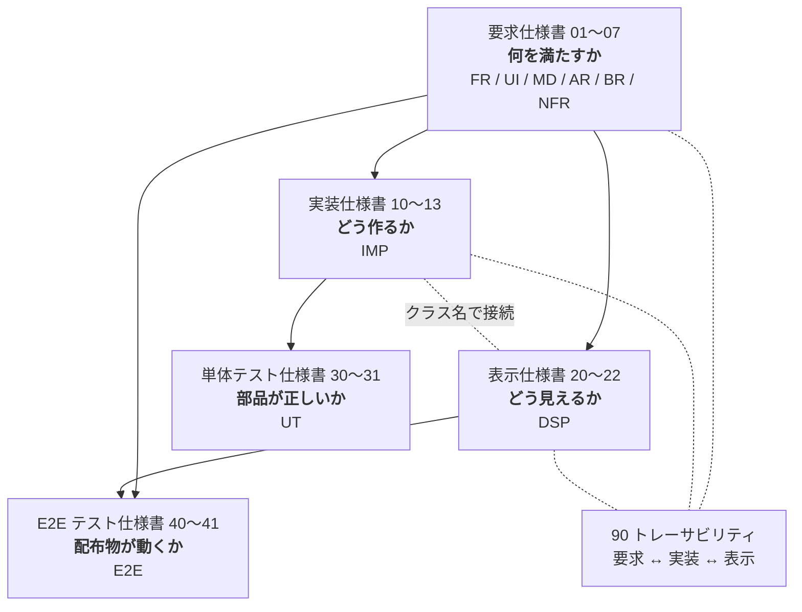

# MarkView 仕様書

MarkView は、Markdown ファイルの**閲覧に特化した**軽量デスクトップアプリケーションである。
本ディレクトリは MarkView の仕様一式であり、実装・レビュー・受け入れ判定の一次情報源とする。

| 項目 | 内容 |
| --- | --- |
| プロダクト名 | MarkView |
| 実行ファイル名 | `MarkView`（Windows: `MarkView.exe`） |
| リポジトリ | <https://github.com/kznagamori/go_MarkView> |
| 作成者 | kznagamori |
| ライセンス | MIT |
| 文書バージョン | 4.4.0 |
| 最終更新 | 2026-09-03 |

## 文書構成

仕様書は 5 つの層に分かれる。上位の層が下位の層を規定し、下位が上位と矛盾する場合は**上位を正とする**。2 つのテスト仕様書は、要求と実装の双方を根拠として「満たせたと言えるか」を定める。

2 つのテストは代替関係にない。単体テストは部品の境界値を、E2E テストは組み上がった配布物の動作を見る（E2E-001）。

### 要求仕様書 — 何を満たすか

利用者から見た振る舞いと、満たすべき性質を定める。実装手段には踏み込まない。

| # | 文書 | 内容 | ID |
| --- | --- | --- | --- |
| 01 | [概要・コンセプト](01-overview.md) | 目的、ターゲット利用者、ユースケース、スコープ、用語定義 | — |
| 02 | [機能要求](02-functional.md) | 表示・ファイル操作・アウトライン・ファイルツリー・リンク遷移・コピー | `FR` |
| 03 | [画面・操作仕様](03-ui.md) | ウィンドウ構成、ツールバー、ペイン、ショートカット、設定の永続化 | `UI` |
| 04 | [Markdown 描画仕様](04-markdown.md) | 対応する Markdown 文法、GitHub 準拠の描画規則、Mermaid・数式 | `MD` |
| 05 | [アーキテクチャ](05-architecture.md) | 技術構成、モジュール構成、採用ライブラリ、データフロー | `AR` |
| 06 | [ビルド・配布](06-build-release.md) | ビルド手順、GitHub Actions による CI/CD、リリース成果物 | `BR` |
| 07 | [非機能要求](07-nonfunctional.md) | 性能・サイズ・メモリ・安全性・互換性・保守性の目標値 | `NFR` |

### 実装仕様書 — どう作るか

要求を実現する手段を、型定義・関数シグネチャの粒度まで定める。実際のソースコードではなく、実装者が迷わず着手するための設計である。

| # | 文書 | 内容 | ID |
| --- | --- | --- | --- |
| 10 | [全体構成と規約](10-impl-overview.md) | ディレクトリ構成、パッケージ依存、エラー処理、ログ、並行性、テスト方針 | `IMP-0xx` |
| 11 | [Go 側](11-impl-backend.md) | mdfile / document / renderer / filetree / watcher / config / assetsrv / opener / buildinfo / App | `IMP-1xx` |
| 12 | [フロントエンド側](12-impl-frontend.md) | DOM 構造、モジュール分割、遅延ロード、検索、コピー、ショートカット | `IMP-2xx` |
| 13 | [Go ↔ フロントエンド インターフェース](13-impl-interface.md) | バインドメソッド、イベント、DTO、エラーの受け渡し | `IMP-3xx` |

### 表示仕様書 — どう見えるか

配色・寸法・書体・状態遷移を具体値で定める。実装仕様書が定めたクラス名に対して見た目を与える。

| # | 文書 | 内容 | ID |
| --- | --- | --- | --- |
| 20 | [デザイン基礎](20-display-foundation.md) | カラートークン、タイポグラフィ、寸法、重なり順、モーション | `DSP-0xx` |
| 21 | [コンポーネント](21-display-components.md) | ツールバー、ペイン、本文、コードブロック、Alerts、ダイアログ | `DSP-1xx` / `DSP-2xx` |
| 22 | [状態と遷移](22-display-states.md) | 画面の状態、ペインの組み合わせ、スクロール位置、検索、ウィンドウ幅への追随 | `DSP-3xx` |

### 単体テスト仕様書 — 満たせたと言えるか

要求と実装に対して、何をどう検証するかを定める。**有効なテストを書くこと**と、**有効でないテストを書かないこと**の両方を扱う。

| # | 文書 | 内容 | ID |
| --- | --- | --- | --- |
| 30 | [方針と禁止事項](30-test-policy.md) | テストの目的、有効なテストの指針、**禁止事項**、命名・配置、カバレッジの扱い、レビュー観点 | `UT-0xx` |
| 31 | [テストケース](31-test-cases.md) | パッケージごとの入力・期待値、要求とテストの対応表 | `UT-090`, `UT-1xx`〜`UT-9xx` |

対象は Go 側（`internal/` と `app.go`）に限る。フロントエンドは開発ホストに Node.js を要求しない方針（BR-001）から対象外とし、描画スモークテスト（BR-054）と手動確認で担保する（UT-002）。

### E2E テスト仕様書 — 配布物が動くか

ビルドされた配布物に対して、**利用者が受け取る形のまま**動作を確かめる。自動実行と手動実行を分けて定める。

| # | 文書 | 内容 | ID |
| --- | --- | --- | --- |
| 40 | [方針と自動テスト](40-e2e-auto.md) | 自動と手動の分担、検証環境、検証用データ、**CI で自動実行するケース** | `E2E-0xx` / `E2E-1xx` |
| 41 | [手動テスト](41-e2e-manual.md) | 実施の単位、環境コード、優先度、**人が操作して確認するケース 59 件** | `E2E-2xx` / `E2E-3xx` |

自動テストは **WebView の UI を操作しない範囲**（配布物の構成、起動と終了、CLI 出力、依存ライブラリ、描画スモーク）に限る。UI の操作を伴う確認は手動テストに委ねる（E2E-002）。

手動テストの実施記録は、41 章から生成する Excel（`docs/tests/results/MarkView_手動テスト結果_v<version>.xlsx`）に記入し、そのままコミットする。生成は `docs/tests/gen_manual_test_xlsx.py` が行い、**ケースの定義は 41 章が正**である（E2E-200）。未記入の雛形はリポジトリに置かず、検証するバージョンごとに生成する。

### 横断

| # | 文書 | 内容 |
| --- | --- | --- |
| 90 | [トレーサビリティ](90-traceability.md) | 要求 ↔ 実装 ↔ 表示 の ID 対応表（正引き・逆引き・カバレッジ）。要求 ↔ 単体テストの対応は [31 章 31.10](31-test-cases.md)、E2E テストの根拠要求は各ケースの「関連要求」にある |

## 目的別の読み方

| 知りたいこと | 読む順序 |
| --- | --- |
| このアプリが何であるか | [01](01-overview.md) → [02](02-functional.md) |
| ある機能をこれから実装する | [90](90-traceability.md) で対応 ID を引く → 該当の `FR`/`UI` → `IMP` → `DSP` |
| 画面を作る | [12](12-impl-frontend.md)（構造）→ [20](20-display-foundation.md)〜[22](22-display-states.md)（見た目） |
| Markdown の変換部分を作る | [04](04-markdown.md)（規則）→ [11](11-impl-backend.md) 11.3 節（実装） |
| Go とフロントの受け渡しを知る | [13](13-impl-interface.md) |
| ビルドとリリースを設定する | [06](06-build-release.md) → [10](10-impl-overview.md) 10.4 節 |
| テストを書く | [30](30-test-policy.md)（書き方と**書いてはいけないもの**）→ [31](31-test-cases.md)（対象パッケージの節） |
| テストをレビューする | [30](30-test-policy.md) 30.6 節のチェックリスト |
| リリース前に確認する | [41](41-e2e-manual.md) の E2E-205（検証手順）→ [40](40-e2e-auto.md)（自動テストの結果）→ `docs/tests/results/` の Excel（手動確認） |
| 仕様を変更する | 要求仕様を直す → [90](90-traceability.md) で影響する `IMP`/`DSP` を、[31 章 31.10](31-test-cases.md) で影響する `UT` を特定 → 該当箇所を直す |

## ID の体系

各仕様には一意の ID を付与し、実装・テスト・レビューから参照できるようにする。

| 接頭辞 | 層 | 意味 | 定義文書 |
| --- | --- | --- | --- |
| `FR-nnn` | 要求 | 機能要求（Functional Requirement） | [02](02-functional.md) |
| `UI-nnn` | 要求 | 画面・操作要求（User Interface） | [03](03-ui.md) |
| `MD-nnn` | 要求 | Markdown 描画要求 | [04](04-markdown.md) |
| `AR-nnn` | 要求 | アーキテクチャ上の決定・制約 | [05](05-architecture.md) |
| `BR-nnn` | 要求 | ビルド・リリース要求 | [06](06-build-release.md) |
| `NFR-nnn` | 要求 | 非機能要求 | [07](07-nonfunctional.md) |
| `IMP-nnn` | 実装 | 実装仕様（Implementation） | [10](10-impl-overview.md)〜[13](13-impl-interface.md) |
| `DSP-nnn` | 表示 | 表示仕様（Display） | [20](20-display-foundation.md)〜[22](22-display-states.md) |
| `UT-nnn` | テスト | 単体テスト仕様（Unit Test） | [30](30-test-policy.md)〜[31](31-test-cases.md) |
| `E2E-nnn` | テスト | E2E テスト仕様（End-to-End Test） | [40](40-e2e-auto.md)〜[41](41-e2e-manual.md) |

`IMP` の番号帯は以下のとおり。

| 帯 | 対象 |
| --- | --- |
| `IMP-001`〜`042` | 全体構成・規約・テスト方針 |
| `IMP-100`〜`104` | `internal/document` |
| `IMP-105` | `internal/mdfile`（拡張子判定。依存なしの葉パッケージ） |
| `IMP-110`〜`118` | `internal/renderer` |
| `IMP-130`〜`133` | `internal/filetree` |
| `IMP-140`〜`142` | `internal/watcher` |
| `IMP-150`〜`153` | `internal/config` |
| `IMP-160`〜`162` | `internal/assetsrv` |
| `IMP-170` | `internal/opener` |
| `IMP-180`〜`181` | `internal/buildinfo` |
| `IMP-190`〜`194` | `app.go`（状態管理・起動・終了） |
| `IMP-200`〜`295` | `frontend/` |
| `IMP-300`〜`330` | Go ↔ フロントエンドの境界 |

`UT` の番号帯は以下のとおり。

| 帯 | 対象 |
| --- | --- |
| `UT-001`〜`070` | 方針・禁止事項・命名・カバレッジ・レビュー観点 |
| `UT-090` | ケース表の読み方 |
| `UT-1xx` | `internal/document` |
| `UT-2xx` | `internal/renderer` |
| `UT-3xx` | `internal/filetree` |
| `UT-4xx` | `internal/watcher` |
| `UT-5xx` | `internal/config` |
| `UT-6xx` | `internal/assetsrv` |
| `UT-7xx` | `internal/opener` |
| `UT-8xx` | `internal/buildinfo` と `app.go` |
| `UT-900`〜`902` | 要求とテストの対応、テストを持たない要求の扱い、網羅性 |

`E2E` の番号帯は以下のとおり。

| 帯 | 対象 |
| --- | --- |
| `E2E-001`〜`021` | 方針・環境・検証用データ・自動テストの禁止事項 |
| `E2E-100`〜`109` | 自動テストのケース |
| `E2E-200`〜`204` | 手動テストの運用・記録項目 |
| `E2E-211`〜`334` | 手動テストのケース（G1〜G13） |

必須度は RFC 2119 に準じ、次の語で表す。

- **MUST**（必須）: 満たさない場合はリリース不可。
- **SHOULD**（推奨）: 合理的な理由がない限り満たす。
- **MAY**（任意）: 実装してもよい。将来拡張の候補を含む。

## 主要な設計判断（サマリ）

本仕様の骨格を決めている判断を以下に集約する。詳細と根拠は各文書を参照。

| 判断 | 内容 | 詳細 |
| --- | --- | --- |
| GUI 方式 | OS 標準 WebView（Windows: WebView2 / Linux: WebKitGTK）を Wails v2 で駆動 | [05](05-architecture.md) |
| 描画資産 | Mermaid・KaTeX・CSS をすべてバイナリに埋め込み、**完全オフライン動作** | [05](05-architecture.md) |
| 遅延ロード | Mermaid・KaTeX は該当記法を含む文書を開いたときのみ読み込む | [07](07-nonfunctional.md) |
| 変換の場所 | Markdown → HTML とシンタックスハイライトは**すべて Go 側**。JS のパーサを積まない | [11](11-impl-backend.md) |
| ウィンドウ数 | アプリは終始 1 つのウィンドウのみ。情報ダイアログも状態画面もその内部に描画する | [12](12-impl-frontend.md) |
| 左ペイン | ファイルツリーとアウトラインは**独立した 2 ペイン**として横に並べる | [03](03-ui.md) |
| 設定の保存先 | OS/ユーザのテンポラリディレクトリ。**ウィンドウ位置は保存しない**（サイズのみ保存） | [03](03-ui.md) |
| 履歴 | 開いたファイルの履歴・パスは一切保存しない | [07](07-nonfunctional.md) |
| リンク | `.md` リンクは**同一ウィンドウ**で開き、`Alt+←` で戻る。外部 URL は既定ブラウザに委譲 | [02](02-functional.md) |
| UI 言語 | ツールバーはアイコンのみ。**ツールチップだけ英日併記**（`Open / 開く`）、他はすべて英語 | [03](03-ui.md) |
| ウィンドウタイトル | `<ファイル名> - MarkView` | [03](03-ui.md) |
| 埋め込み資産 | Mermaid / KaTeX はリポジトリで管理。**タグ付与を契機に CI が最新版へ自動更新**し、スモークテスト通過後にリリース | [06](06-build-release.md) |
| 画像 | 文書内の画像は本文に表示する。画像への**リンク**は OS の既定ビューアに委ねる | [02](02-functional.md) |
| サイズ検査 | 目標値の超過は**警告に留め、ビルドもリリースも止めない** | [06](06-build-release.md) |
| 配布 | Windows: zip / Linux: tar.gz、いずれも amd64・arm64。インストーラと `.md` 関連付けは提供しない | [06](06-build-release.md) |

## 本仕様のスコープ外

MarkView は**ビューア**であり、以下は本バージョンのスコープに含めない（[01-overview.md](01-overview.md) 参照）。

- Markdown の編集・保存機能
- PDF・HTML 等へのエクスポート
- 印刷
- タブによる複数文書の同時表示
- プラグイン機構、ユーザ定義 CSS の読み込み
- UI の多言語化・ロケール切り替え（ツールチップの英日併記で代替）
- アプリ内の画像ビューア（OS の既定ビューアに委ねる）
- `.md` のファイル関連付け
- macOS 対応

## 改訂履歴

| 版 | 日付 | 内容 |
| --- | --- | --- |
| 1.0.0 | 2026-08-30 | 初版（要求仕様書 8 文書、要求 150 件） |
| 1.1.0 | 2026-08-30 | 未確定事項を解決し、UI 表示言語（UI-024）、ウィンドウタイトル（UI-013）、埋め込み資産のバージョン運用（BR-042, BR-043, BR-054）、ファイル関連付けの不提供（BR-071）を確定。文書間リンクの挙動を明確化し、ツリールート外への遷移（FR-052）を追加 |
| 1.2.0 | 2026-08-30 | レビューにより、画像リンクの表示先（FR-053）、大きなファイルの確認画面（FR-016, UI-052）、サイズ超過時の CI の扱い（BR-060, NFR-021）を確定。UI 文言の英語化漏れ、起動時間の測定条件、CI の二重実行、SVG 配信の防御を修正 |
| 1.3.0 | 2026-08-30 | 文書横断レビュー。引数なし起動の探索順を「カレント → 実行ファイルの場所」に変更（FR-013）。メモリ目標と測定用文書の矛盾、エラー通知先の不統一、情報ウィンドウとウィンドウ数の整合、参照 ID の誤り 3 件、用語ゆれを修正。要求 160 件で確定 |
| 2.0.0 | 2026-08-30 | **実装仕様書（10〜13、`IMP` 95 件）と表示仕様書（20〜22、`DSP` 65 件）を追加。** 本索引を 3 層構成に再編し、要求 ↔ 実装 ↔ 表示のトレーサビリティ（90）を追加 |
| 2.1.0 | 2026-08-30 | アプリケーションアイコン（`assets/icon.ico` / `icon.png`）の仕様を追加（UI-025, BR-013, IMP-032, DSP-017）。実装・表示仕様のレビューにより、SVG シンボルの不足 8 種、UI 文言の不足、確認待ち状態の保持漏れ、ツールチップの重なり順を修正 |
| 2.2.0 | 2026-08-30 | 実装・表示仕様の横断レビュー。狭いウィンドウでのペイン自動非表示を要求へ昇格（UI-026, IMP-246）。Alerts のアイコンがサニタイズと衝突する問題を IMP-112 / IMP-225 で解消。`ScrollDTO` に `keep` を追加、起動時の大きなファイル・ウィンドウサイズ取得・KaTeX の描画方式・ツールチップのキー二重管理を修正 |
| 3.0.0 | 2026-08-30 | **単体テスト仕様書（30〜31、`UT` 84 件）を追加。** 有効なテストの指針（UT-010 系）と、有効でないテストを防ぐ禁止事項（UT-030 系）を定め、パッケージごとの入力・期待値と、要求 ↔ テストの対応表を整備。カバレッジは数値目標を置かず、要求 ID ごとのテストの有無で網羅性を追跡する方針とした |
| 4.0.0 | 2026-08-31 | **E2E テスト仕様書（40〜41、`E2E` 76 件）を追加。** 自動実行（WebView を起動しない範囲）と手動実行（59 ケース）を分けて定義。手動テストの実施記録用に `tests/MarkView_手動テスト仕様書.xlsx` を 41 章から生成する運用とし、生成スクリプトを `scripts/` に置いた |
| 4.1.0 | 2026-08-31 | E2E テスト仕様の横断レビュー。手動テストの検証フローを「プレリリースタグで成果物を作り、それを検証してから本タグを打つ」形に確定（E2E-205）。これに伴い、埋め込み資産の自動更新をプレリリース時のみとし（BR-043）、rc で検証した内容がそのまま配布されることを保証。未知のオプションの扱い（FR-012）、検証用データの重複、節参照の誤りを修正 |
| 4.2.0 | 2026-08-31 | 手動テストの記録用 Excel を `docs/tests/results/` へ移し、生成を PowerShell + Excel COM から Python（openpyxl）へ移行（E2E-200）。未記入の雛形を持たず、バージョンごとに記録用ファイルを生成する運用に変更。E2E テスト仕様のレビューにより、成果物を要する手動テストを PR で行うとしていた矛盾（E2E-201）、配布物に同梱される README との食い違い（E2E-211）、rc 検証と噛み合わないバージョン確認（E2E-301）、`MD-020〜MD-026` の範囲表記が実際の確認内容と一致していなかった点（E2E-231）を修正 |
| 4.3.0 | 2026-09-03 | **多重起動（UI-115）と WebView のユーザデータ領域（AR-004）を新設。** 設定ファイルは全インスタンスで共有され保存が構造体まるごとの後勝ちになるため、**表示倍率とウィンドウの最大化状態を UI-110 から UI-111 へ移した**（ウィンドウごとに変えて使う値であり、後勝ちが利用者の意図と食い違う 2 項目）。あわせて WebView2 のユーザデータ領域を `%APPDATA%\MarkView.exe` から `%TEMP%\MarkView\webview2` へ移し、NFR-031 / NFR-033 に例外を明記（Linux は指定手段が無く既定に従う）。手動テストに E2E-315（多重起動）を追加し、E2E-104 / E2E-312 / E2E-313 の確認内容を拡張。要求 165 件、E2E 83 件 |
| 4.4.0 | 2026-09-03 | **未解決だった 3 件を仕様として確定。** (1) `NewLogger()` の置き場所を `internal/applog`（依存を持たない葉パッケージ）に定め、**`MARKVIEW_DEBUG` を読むのはそこだけ**とした（IMP-011, IMP-012, IMP-023, UT-806, UT-807）。(2) 画像の読み込み失敗の表示（DSP-123）を実装できる形にし、`img.is-broken` を 12 章と 21 章の接続点として定義（IMP-226）。**CSS だけでは書けないことと、配線時にすでに失敗しているものを拾う必要があることを明記。** (3) 見出しのアンカーアイコン（MD-020 の SHOULD）を実装すると決め、既存のフラグメント経路（IMP-223）に載せた（IMP-227, DSP-023, `icon-link`）。E2E-231 / E2E-236 の確認内容を拡張。実装 103 件、表示 67 件、単体テスト 88 件 |
