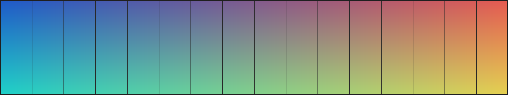

# MarkView E2E 検証用データ

このディレクトリは **E2E テスト（40 章・41 章）で使う入力一式**です（E2E-012）。
自動テストと手動テストで同じものを使い、用途ごとに別のデータを用意しません。

`MarkView testdata/e2e` で起動すると、ディレクトリ指定の規則（FR-013）によって
このファイルが自動で開きます（E2E-214）。

## 置いてあるもの

| 場所 | 用途 |
| --- | --- |
| `README.md` | このファイル。起動時に自動表示される（FR-013） |
| `docs/design.md` | 相対リンクの遷移先（E2E-261）。アンカー付きリンクの対象（E2E-263） |
| `docs/img/sample.png` | ローカル画像（1600 x 300）。本文幅を超えるため縮小される（E2E-236） |
| `outside/external.md` | ツリールート外への遷移先（FR-052, E2E-265） |
| `broken/invalid-utf8.md` | 不正な UTF-8 を含む（FR-021, E2E-323） |
| `node_modules/` `vendor/` `.hidden/` | **ツリーに出てはいけない**ディレクトリ（FR-031, E2E-241） |
| `notes.txt` | Markdown ではないファイル。**ツリーに出てはいけない**（FR-031） |
| `generated/` | 巨大ファイルなど。`go run ./scripts/gentestdata` で作る。コミットしない |

`testdata/showcase.md`（BR-053）は**複製しません**。記法の網羅はあちらが担い、
ここは「ファイルとディレクトリの関係」を確かめるためのものです。

## 生成が要るもの

12 MB / 60 MB のファイル（E2E-322）と、極端に深い入れ子・巨大な表（E2E-323）は
リポジトリに含めません。検証の直前に作ります。

```bash
go run ./scripts/gentestdata          # testdata/e2e/generated/ に作る
go run ./scripts/gentestdata -clean   # 消す
```

## ファイルツリーの確認

ツリーのルートをこのディレクトリにすると、以下のようになるはずです（E2E-241）。

- ディレクトリが**先**、ファイルが**後**に並ぶ
- `node_modules` `vendor` `.hidden` は**出ない**
- `notes.txt` と `docs/img/sample.png` も**出ない**（Markdown ではないため）
- `generated` は**出る**。除外の対象ではなく、中身も Markdown だからである。
  ここから `large-12mb.md` を選んで E2E-322 を実施できる

`.git` も同じ規則で除外されます。名前が `.` で始まるディレクトリはすべて対象です。

## 見出しの入れ子

アウトライン（FR-040）とスクロール連動（FR-042）を確かめるため、
ここから下は見出しを深くしていきます。

### レベル 3 の見出し

本文です。アウトラインの階層表示を確認してください。

#### レベル 4 の見出し

本文です。

##### レベル 5 の見出し

本文です。

###### レベル 6 の見出し

本文です。ここまでで 6 段になります。

## 日本語の見出しへのリンク

見出しアンカーは GitHub 互換の規則で作ります（MD-021）。
日本語の見出しでも機能することを確かめてください（E2E-263）。

- [同じ文書の「置いてあるもの」へ](#置いてあるもの)
- [同じ文書の「ファイルツリーの確認」へ](#ファイルツリーの確認)
- [同じ文書の「レベル 3 の見出し」へ](#レベル-3-の見出し)

## 画像

### 相対パスのローカル画像

`docs/img/` に置いた画像です。**本文幅より広い**ため、縮小されて収まるはずです。



### 存在しない画像

次の画像はファイルがありません。alt テキストとプレースホルダになり、
**これ以降の描画が止まらない**ことを確かめてください（E2E-236）。


### リモート画像

ネットワークに接続した状態でのみ表示されます（MD-071）。
切断時は上と同じくプレースホルダになります。


## リンク

### 画像へのリンク

画像を**開く**リンクです。クリックすると OS の既定の画像ビューアに委譲されます（FR-053, E2E-264）。

- [図を既定のビューアで開く](./docs/img/sample.png)

### 外部リンク

既定のブラウザで開き、**MarkView のウィンドウ内では遷移しません**（AR-060, E2E-264）。

- <https://github.com/kznagamori/go_MarkView>
- [Markdown の仕様（CommonMark）](https://commonmark.org/)

### 壊れたファイルへのリンク

- [不正な UTF-8 を含むファイル](./broken/invalid-utf8.md)

## 途中まで読み進めたところ

ここは文書の中ほどです。**`Alt+←` で戻ったときにこの位置へ復元されるか**を
確かめるための目印です（FR-051, E2E-262）。

次のリンクをクリックしてから戻ってきてください。

- [docs/design.md を開く](./docs/design.md)
- [docs/design.md の「設計の方針」へ直接飛ぶ](./docs/design.md#設計の方針)

## 検索用の繰り返し

検索（FR-080, E2E-271）で複数のヒットを作るため、同じ語を散らしてあります。
`marker` という語がこの節に 5 回出てきます。

1 つ目の marker です。
2 つ目の marker です。
3 つ目の marker です。
4 つ目の marker です。
5 つ目の marker です。

## 長さを稼ぐ本文

スクロール位置の保存（FR-051）と、アウトラインの現在位置追従（FR-042）を
確かめるには、ウィンドウ 1 画面に収まらない長さが要ります。

### 段落 1

MarkView は Markdown の**閲覧に特化した**軽量デスクトップアプリケーションです。
編集機能を持たず、書くための道具は既にあるものを使います。

### 段落 2

変換とシンタックスハイライトは Go 側で行います（AR-031）。
フロントエンドで実行するのは Mermaid と KaTeX だけです。

### 段落 3

開いたファイルのパス・ツリールート・表示履歴・検索語は、
**ディスクのどこにも書きません**（NFR-042）。

### 段落 4

設定の保存先はテンポラリのみです。`%APPDATA%` や `~/.config`、
レジストリには書きません（UI-112, NFR-033）。

### 段落 5

ネットワークへは接続しません（AR-020）。リモート画像だけが例外で、
それも WebView が直接取得します。

### 段落 6

ここが文書の末尾です。ここまでスクロールしたとき、アウトラインの
「段落 6」が現在位置として強調されているはずです（FR-042）。
