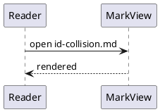
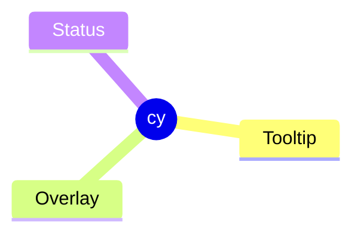
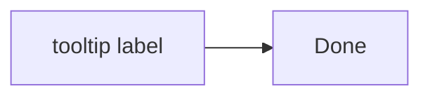

このファイルは **E2E-327（文書の id が画面の要素を乗っ取らない）を実施するための検証用データ**です（E2E-012, [BUG-011](../../docs/bugs/2026-09-14-bug-011-document-id-collision.md)）。
利用者に見せる文書ではありません。**アプリと同梱資産が使う id と同じ名前の見出し・生 HTML の `id`・Mermaid のラベルの `id` を、意図して置いています。**

**見出しの順番を変えないでください。** E2E-327 の手順と確認内容がこの順番を前提にしています。
特に `Status` の見出しは、生 HTML の `
` より**前**に置く必要があります。
逆にすると、修正の前でも同梱の PlantUML のログが div の方へ書かれ、症状が出ません。
そのため、このファイルには題名の見出しを置いていません。

`Status` の見出しは、同梱の `plantuml.js` が決め打ちで探す `#status` と同じ id になり、直後の PlantUML の図を描くとログが書き込まれます。
`cy` の見出しは、同梱の Mermaid が mindmap の配置に探す `#cy` と同じ id になります。どちらも見出しの直後に図を置いています。

## App

画面全体の器（`#app`）と同じ id になる見出しです。

## Tooltip

ツールチップ（`#tooltip`）と同じ id になる見出しです。

## State screen

状態画面（`#state-screen`）と同じ id になる見出しです。

## Status message

ステータス領域の通知（`#status-message`）と同じ id になる見出しです。

## Status path

ステータス領域のパス（`#status-path`）と同じ id になる見出しです。

## Status meta

ステータス領域の文字コードと行数（`#status-meta`）と同じ id になる見出しです。

## Overlay

情報ダイアログとエディタ選択ウィンドウの暗幕（`#overlay`）と同じ id になる見出しです。

## Dropzone

ドロップの案内（`#dropzone`）と同じ id になる見出しです。

## Editor open

エディタ選択ウィンドウの `Open` と同じ名前になる見出しです。

## Contextmenu

右クリックメニュー（`#contextmenu`）と同じ id になる見出しです。

## Expand view

拡大画面（`#expand-view`）と同じ id になる見出しです。

## Editmode badge

編集モードのラベル（`#editmode-badge`）と同じ id になる見出しです。

## Viewer frame

本文ペインの枠（`#viewer-frame`）と同じ id になる見出しです。

## Status

## cy

次の flowchart は、ラベルに `id='tooltip'` を持つ HTML を書いています（Mermaid のラベルの `id`。IMP-231）。

次は生 HTML の `id="status"` です。中身の文字が変わらないことを見ます（MD-072）。

raw html status

脚注の参照です[^1]。

[^1]: 脚注の本文です。`#user-content-fn:1` のリンクでここへ移ります。

## リンク

- [→ Tooltip](#tooltip)
- [→ Overlay](#user-content-overlay)
- [→ 脚注](#user-content-fn:1)
- [→ 画面の id](#statusbar)

## スクロール用の本文

以下は本文をスクロールできる長さにするための段落です。リンクで見出しへ移ったときに、本文が動いたことを見分けられるようにしています。

段落 1。MarkView は Markdown の閲覧に特化した軽量なデスクトップアプリケーションです。見出しへのリンクを押すと、その見出しの位置まで本文が移動します。

段落 2。文書の中の id は、画面の要素の id と重ならないように `user-content-` で始まります。重なると、画面の要素の代わりに文書の要素が見つかります。

段落 3。ツールチップ・通知・ダイアログ・状態画面・右クリックメニュー・拡大画面・編集モードのラベルは、どれも画面の id を持っています。

段落 4。同梱の PlantUML は、描画のたびに `status` という id の要素へログを書き込みます。これは資産の側の決め打ちであり、変えることができません。

段落 5。同梱の Mermaid は、mindmap の配置に `cy` という id の要素を探します。これも資産の側の決め打ちです。

段落 6。生 HTML で書いた `id` も、文書から生まれる id です。見出しと同じく、接頭辞が付いていなければ画面の要素を乗っ取ります。

段落 7。Mermaid のラベルに書いた HTML の `id` は、Go 側の変換を通りません。描画処理系の設定で接頭辞を付けます。

段落 8。アウトラインは見出しを完全な id で探します。接頭辞を補って探すと、接頭辞で始まる見出しに当たることがあるためです。

段落 9。リンクのフラグメントは、接頭辞の無い形でも、接頭辞の付いた形でも、同じ見出しへ移ります。

段落 10。画面の id を指すフラグメントでは本文が動かず、リンク先が見つからないことが通知されます。

段落 11。この段落と以降の段落は、スクロールの余白を作るためだけにあります。

段落 12。この段落と以降の段落は、スクロールの余白を作るためだけにあります。

段落 13。この段落と以降の段落は、スクロールの余白を作るためだけにあります。

段落 14。この段落と以降の段落は、スクロールの余白を作るためだけにあります。

段落 15。この段落と以降の段落は、スクロールの余白を作るためだけにあります。

段落 16。この段落と以降の段落は、スクロールの余白を作るためだけにあります。

段落 17。この段落と以降の段落は、スクロールの余白を作るためだけにあります。

段落 18。この段落と以降の段落は、スクロールの余白を作るためだけにあります。

段落 19。この段落と以降の段落は、スクロールの余白を作るためだけにあります。

段落 20。この段落と以降の段落は、スクロールの余白を作るためだけにあります。

段落 21。この段落と以降の段落は、スクロールの余白を作るためだけにあります。

段落 22。この段落と以降の段落は、スクロールの余白を作るためだけにあります。

段落 23。この段落と以降の段落は、スクロールの余白を作るためだけにあります。

段落 24。この段落と以降の段落は、スクロールの余白を作るためだけにあります。

段落 25。この段落と以降の段落は、スクロールの余白を作るためだけにあります。

段落 26。この段落と以降の段落は、スクロールの余白を作るためだけにあります。

段落 27。この段落と以降の段落は、スクロールの余白を作るためだけにあります。

段落 28。この段落と以降の段落は、スクロールの余白を作るためだけにあります。

段落 29。この段落と以降の段落は、スクロールの余白を作るためだけにあります。

段落 30。本文の終わりです。
