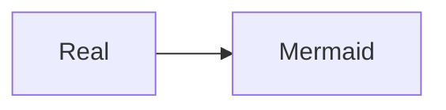
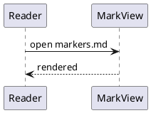

# 生 HTML で偽装した図とコードブロック（E2E-328）

このファイルは **E2E-328 を実施するための検証用データ**です（E2E-012, [BUG-014](../../docs/bugs/2026-09-14-bug-014-diagram-marker-spoofing.md)）。
利用者に見せる文書ではありません。**Go 側の変換が付ける図とコードブロックの目印を、生 HTML で偽装しています。**

> [!IMPORTANT]
> **実施の前にネットワークを切断してください。** 3 節の偽装したブロックは外部の取り込み指令を含みます。
> 描画へ回った場合に外部を取りに行く経路が開いていると、結果が回線の状態で変わります（NFR-032）。

**1 節と 2 節の本物の図を消さないでください。** 偽装への対策が本物の図まで止める実装を捕まえるために置いています。

## 1. 本物の Mermaid の図

## 2. 本物の PlantUML の図

## 3. 生 HTML で偽装した PlantUML のブロック

`class="code-block"` と `data-plantuml` と `data-source` を生 HTML で書き、**変換ごとの鍵と違う鍵**の目印を付けています。原文には外部の取り込み指令を含めています。
**図にならず、`fake plantuml` の文字がそのまま残るのが正しい表示です。**

<pre class="plantuml-source">fake plantuml</pre>

## 4. 生 HTML で偽装した Mermaid のブロック

`class="code-block"` と `data-mermaid` と flowchart の `data-source` を生 HTML で書き、目印は付けていません。
**図にならず、`fake mermaid` の文字がそのまま残るのが正しい表示です。**

<pre class="mermaid-source">fake mermaid</pre>

## 5. `data-source` を偽装したコードブロック

見えている中身は `npm install` ですが、`data-source` に別の文字列を書いています。
**コピーボタンで貼り付けられるのは `npm install` でなければなりません。** `curl` で始まる文字列が貼り付けられたら NG です。

<pre><code>npm install</code></pre>

