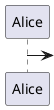
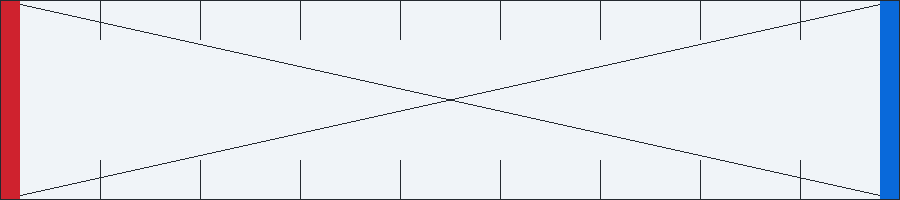
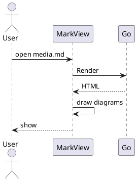

# 図と画像の拡大表示

このファイルは **図と画像の原寸表示・拡大画面**（G15。E2E-351〜E2E-354）の検証用です（E2E-012）。
節の番号は手動テストの手順が参照します。**節を足したり並べ替えたりしないでください。**

- **Mermaid のブロックは 1 節と 2 節の 2 つだけです。** E2E-354 は 1 節を消した後に残る Mermaid が、描画に失敗する 2 節だけであることを前提にしています
- 画像はこのファイルからの相対パス（`docs/img/`）で参照します。**複写して使うときは `docs/img/` ごと複写します**（E2E-352, E2E-354）

## 1. 横に広い Mermaid の図

ノードを横に 20 個並べた flowchart です。本来の幅が本文幅（980 論理ピクセル）を超えるため、縮小表示になり、右上に原寸表示と拡大画面のボタンが出ます（FR-120）。


## 2. 描画に失敗する Mermaid

構文エラーです。エラーの内容とソースが出て、**原寸表示と拡大画面のボタンは出ません**（コピーボタンは出ます。FR-120）。

```mermaid
flowchart LR
  A[開始 --> B
```

## 3. PlantUML の構文エラー

PlantUML は構文エラーでもエラーを描いた図を返します（FR-024）。**図として扱い、拡大画面のボタンが出ます**（FR-120）。



## 4. 縮小表示される画像

1600 x 300 の画像です。本文幅を超えるため縮小表示になり、ボタンが出ます。


## 5. 小さな画像

段落の中の 80 x 20 のバッジ  です。縮小されないため、**ボタンが出ません**（FR-120）。

## 6. 読み込みに失敗する画像

ファイルがありません。破線の枠と代替テキストになり、**ボタンが出ません**（FR-120, DSP-123）。


## 7. リンクで囲んだ画像

画像全体がリンクです。**拡大画面のボタンを押してもリンク先へ移りません**（MD-071, UI-053）。画像そのものをクリックするとリンク先（`docs/design.md`）へ移ります。

[](docs/design.md)

## 8. 幅 900 の画像

900 x 200 の画像です。初期サイズのウィンドウ（1280 x 860。ファイルツリーは閉じ、アウトラインは既定の幅）では本文幅に収まり、ボタンが出ません。**ウィンドウを狭めると縮小表示になり、ボタンが出ます**（「縮小表示中」の判定を幅が変わるたびにやり直す。FR-120）。



## 9. 描画に成功する PlantUML の図

sequence 図です。拡大画面のボタンが出ます。E2E-353 の手順 16 では、この図が本文ペインの中ほどに見えるまでスクロールしてから開きます。



## 10. 取り込み指令を含み描画しない PlantUML

`!include` を含むため、Go 側が描画の対象から外します（MD-084）。理由が出て、**ボタンは出ません**（コピーボタンは出ます）。

```plantuml
@startuml
!include https://example.com/styles.puml
Alice -> Bob: hello
@enduml
```

## 11. スクロールのための本文

9 節の図を本文ペインの中ほどまでスクロールできるよう、後ろに本文を置いています。

この段落はスクロールのためのものです。拡大画面を閉じたとき、本文のスクロール位置が開く前のまま保たれることを確かめるのに使います（FR-122）。

この段落はスクロールのためのものです。拡大画面を開いている間、本文は動きません（DSP-350）。

この段落はスクロールのためのものです。原寸表示を切り替えても、押したボタンの画面上の位置は保たれます（IMP-228）。

この段落はスクロールのためのものです。テーマを切り替えると図が描き直され、原寸表示は描き直した図に当て直されます（DSP-370）。

この段落はスクロールのためのものです。外部のエディタで保存すると、同じ文書の再描画として原寸表示が保たれます（DSP-352）。

この段落はスクロールのためのものです。別の文書を開いてから戻ると、原寸表示は解けています（文書の切り替え。DSP-352）。

この段落はスクロールのためのものです。倍率を変えても、画像と図の大きさは変わりません（DSP-021）。

この段落はスクロールのためのものです。ここが文書の末尾です。
