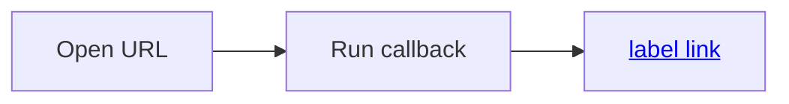
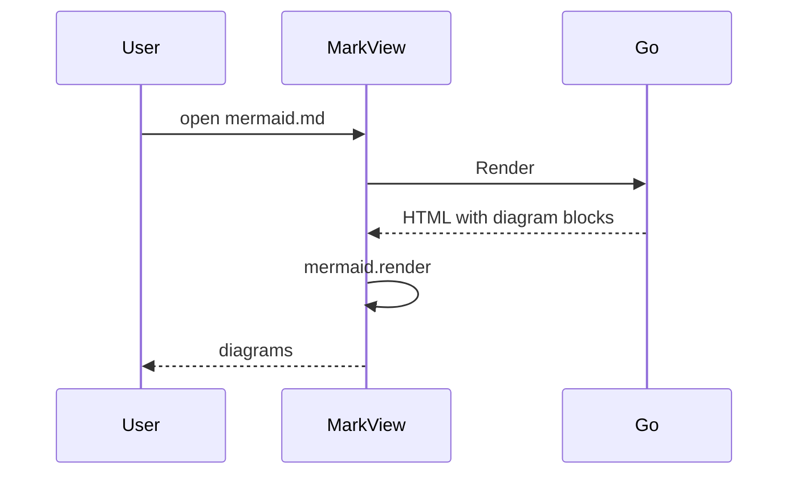
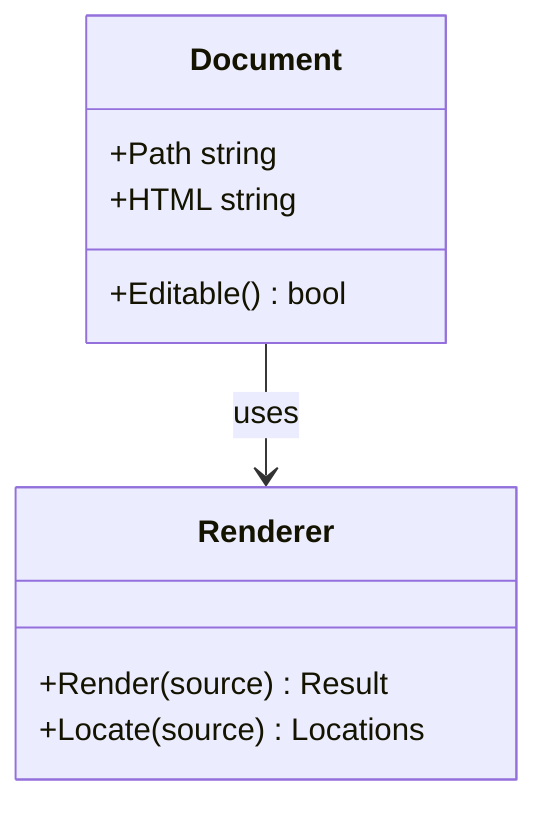
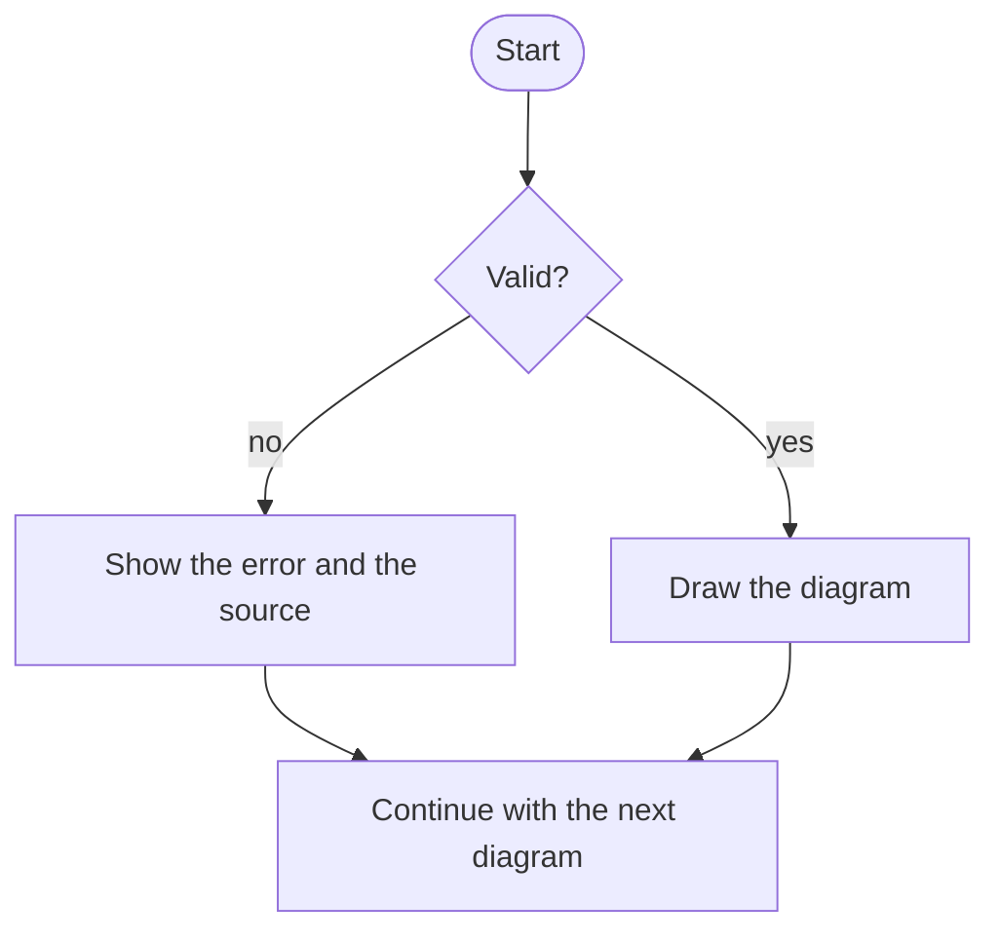

# Mermaid 図

このファイルは **Mermaid 図の描画**（E2E-234）の検証用です（E2E-012）。
節の番号は手動テストの手順が参照します。**ネットワークを切断してから開きます。**

`testdata/showcase.md` と分けているのは、あちらが GitHub と並べて目で比べる文書（MD-002）であり、描画に失敗する図を混ぜないためです。

## 1. `click` とラベルのリンクを定義した flowchart

`Open URL` のノードには `click` で URL へのリンクを、`Run callback` のノードには `click` でコールバックを定義しています。`label link` のノードは、ラベルに HTML のリンクを書いています。

- **`Open URL` と `label link` を押すと、既定のブラウザでリンク先を開きます**（本文のリンクと同じ。FR-050, MD-081）。**MarkView のウィンドウの中では遷移しません**（AR-060）。ネットワークを切断していれば、開けない旨はブラウザの側に出ます
- **`Run callback` を押しても何も起きません**（コールバックは実行しない。`securityLevel: 'strict'`）
- **拡大画面では、どれを押しても何も起きません**（UI-104）

v1.0.0 では、`Open URL` を押すと MarkView のウィンドウの中身がリンク先に置き換わり、戻れなくなりました（BUG-015）。



## 2. sequenceDiagram



## 3. classDiagram



## 4. 構文エラーの Mermaid

エラーの内容とソースがコードブロックのまま出ます（FR-023）。**後ろの 5 節の図の描画を妨げません。**

```mermaid
sequenceDiagram
  User->>: missing target
  this line is not valid
```

## 5. 4 節の後ろの正常な flowchart

4 節の構文エラーの後ろにあっても、**この図は描画されます**。


