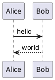
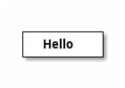

# PlantUML の描けないもの（E2E-240）

このファイルは **E2E-240（PlantUML の制限）を実施するための検証用データ**です（E2E-012）。
利用者に見せる文書ではなく、「描けないものが、理由とともに示されるか」を人が確かめるために、
**失敗する記法だけを集めて**あります。

`showcase.md`（BR-053）と分けているのは、あちらが **GitHub と並べて目視比較する**ための文書
（MD-002）であり、失敗例を混ぜると比較する側が読みにくくなるためです。

> [!IMPORTANT]
> **実施の前にネットワークを切断してください。** 取り込み指令（`!include` 系）で
> 外部への接続試行が起きないことも、このケースの確認対象です（NFR-032）。

## 1. 正常な図（対照）

**この図だけは描けます。** 以下の失敗が、他の図の描画を妨げていないことを確かめるために置いています。



## 2. 構文エラー

**PlantUML のエラー図がそのまま出ます**（FR-024）。行番号と該当行を含むため、こちらで書き直しません。
Mermaid（FR-023）とは見え方が違いますが、これは処理系の返し方が違うためです。

```plantuml
@startuml syntaxerror
Alice -> : missing target
this is not plantuml at all
@enduml
```

## 3. 取り込み指令（`!include`）

**図にならず、理由と元のソースが出ます**（MD-084, IMP-119）。Go 側で検査して描画対象から外すため、
処理系には渡りません。

```plantuml
@startuml include
!include shared/common.puml
Alice -> Bob : hi
@enduml
```

## 4. 取り込み指令（`!includeurl`）

外部の URL を指す形です。**ここで待たされたら、それ自体が不具合**です（NFR-032）。

```plantuml
@startuml includeurl
!includeurl http://example.invalid/theme.puml
Alice -> Bob : hi
@enduml
```

## 5. 標準ライブラリ（C4 モデル）

`!include <C4/...>` は取り込み指令の一種であり、**同梱した処理系は標準ライブラリを持ちません**（MD-083）。
**C4 モデル図は描けません。**


## 6. 4096 px を超える図

処理系が描画を拒みます（MD-083）。**Java 版の PlantUML には無い制限**です。

> [!IMPORTANT]
> **このブロックの書き方には理由があります**（[BUG-010](../../docs/bugs/2026-09-06-bug-010-plantuml-4096-testdata.md)）。
>
> - **関係は 1 行に 1 本だけ書きます。** `A0 --> A1 --> A2` の**連鎖は class 図の文法違反**であり、
>   その行で解析が止まって**エラー図になります**。大きさの制限には決して到達しません
> - **クラスは 40 個必要です。** 30 個では 3196 px にしかならず、制限（4096）に届きません
> - **`skinparam dpi` は使いません。** この移植版では**出力の大きさに影響しません**
>   （40 個の連結で `dpi 300` の有無とも `72x4276`）
>
> **実測値**: `java.lang.RuntimeException: Diagram too large for browser rendering: 72x4276 (max 4096)`
>
> **`@startuml toolarge` の名前を消さないでください。** 描画スモークテスト（BR-054）が**ブロックを名前で見分けます**。どのブロックも先頭行が `@startuml` のままでは、機械が区別できません。

```plantuml
@startuml toolarge
class A0
class A1
class A2
class A3
class A4
class A5
class A6
class A7
class A8
class A9
class A10
class A11
class A12
class A13
class A14
class A15
class A16
class A17
class A18
class A19
class A20
class A21
class A22
class A23
class A24
class A25
class A26
class A27
class A28
class A29
class A30
class A31
class A32
class A33
class A34
class A35
class A36
class A37
class A38
class A39
A0 --> A1
A1 --> A2
A2 --> A3
A3 --> A4
A4 --> A5
A5 --> A6
A6 --> A7
A7 --> A8
A8 --> A9
A9 --> A10
A10 --> A11
A11 --> A12
A12 --> A13
A13 --> A14
A14 --> A15
A15 --> A16
A16 --> A17
A17 --> A18
A18 --> A19
A19 --> A20
A20 --> A21
A21 --> A22
A22 --> A23
A23 --> A24
A24 --> A25
A25 --> A26
A26 --> A27
A27 --> A28
A28 --> A29
A29 --> A30
A30 --> A31
A31 --> A32
A32 --> A33
A33 --> A34
A34 --> A35
A35 --> A36
A36 --> A37
A37 --> A38
A38 --> A39
@enduml
```



## 7. `salt`（UI モック）

同梱した処理系が対応していない図種別です（MD-083）。

```plantuml
@startsalt
{
  Login    | "         "
  Password | "         "
  [Cancel] | [  OK   ]
}
@endsalt
```



## 8. `ditaa`

同上（MD-083）。



---

## 確認の観点（E2E-240）

- 1 の図は**描けている**。以降の失敗が他の図を止めていない
- 2 は **PlantUML のエラー図が図として出る**（行番号を含む）
- 3・4・5 は**図にならず**、理由と元のソースが英語で出る
- **6 は図にならず、理由と元のソースが出る。** **`Syntax Error?` の図が出たら不具合**です——大きさの制限に達する前に、ソースが文法違反で弾かれています（BUG-010）
- 7・8 は、**エラー図が出るか、理由と元のソースが出るかのどちらか**である（判定は「SVG が得られたか」だけで行うため。DSP-272）。**どちらであっても空白にならない**
- 描けなかったブロックのコピーボタンから、**元の PlantUML ソース**が取れる
- **待たされる箇所がない**（外部への接続試行がない。NFR-032）
