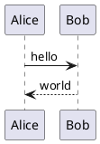
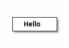

# PlantUML の描けないもの（E2E-240）

このファイルは **E2E-240（PlantUML の制限）を実施するための検証用データ**です（E2E-012）。
利用者に見せる文書ではなく、「描けないものが、理由とともに示されるか」を人が確かめるために、
**失敗する記法だけを集めて**あります。

`showcase.md`（BR-053）と分けているのは、あちらが **GitHub と並べて目視比較する**ための文書
（MD-002）であり、失敗例を混ぜると比較する側が読みにくくなるためです。

> [!IMPORTANT]
> **実施の前にネットワークを切断してください。** 取り込み指令（`!include` 系）で
> 外部への接続試行が起きないことも、このケースの確認対象です（NFR-032）。

## 1. 正常な図（対照）

**この図だけは描けます。** 以下の失敗が、他の図の描画を妨げていないことを確かめるために置いています。



## 2. 構文エラー

**PlantUML のエラー図がそのまま出ます**（FR-024）。行番号と該当行を含むため、こちらで書き直しません。
Mermaid（FR-023）とは見え方が違いますが、これは処理系の返し方が違うためです。

```plantuml
@startuml
Alice -> : missing target
this is not plantuml at all
@enduml
```

## 3. 取り込み指令（`!include`）

**図にならず、理由と元のソースが出ます**（MD-084, IMP-119）。Go 側で検査して描画対象から外すため、
処理系には渡りません。

```plantuml
@startuml
!include shared/common.puml
Alice -> Bob : hi
@enduml
```

## 4. 取り込み指令（`!includeurl`）

外部の URL を指す形です。**ここで待たされたら、それ自体が不具合**です（NFR-032）。

```plantuml
@startuml
!includeurl http://example.invalid/theme.puml
Alice -> Bob : hi
@enduml
```

## 5. 標準ライブラリ（C4 モデル）

`!include <C4/...>` は取り込み指令の一種であり、**同梱した処理系は標準ライブラリを持ちません**（MD-083）。
**C4 モデル図は描けません。**


## 6. 4096 px を超える図

処理系が描画を拒みます（MD-083）。**Java 版の PlantUML には無い制限**です。

```plantuml
@startuml
skinparam dpi 300
class A0
class A1
class A2
class A3
class A4
class A5
class A6
class A7
class A8
class A9
class B0
class B1
class B2
class B3
class B4
class B5
class B6
class B7
class B8
class B9
A0 --> A1 --> A2 --> A3 --> A4 --> A5 --> A6 --> A7 --> A8 --> A9
B0 --> B1 --> B2 --> B3 --> B4 --> B5 --> B6 --> B7 --> B8 --> B9
A9 --> B0
@enduml
```

## 7. `salt`（UI モック）

同梱した処理系が対応していない図種別です（MD-083）。

```plantuml
@startsalt
{
  Login    | "         "
  Password | "         "
  [Cancel] | [  OK   ]
}
@endsalt
```



## 8. `ditaa`

同上（MD-083）。



---

## 確認の観点（E2E-240）

- 1 の図は**描けている**。以降の失敗が他の図を止めていない
- 2 は **PlantUML のエラー図が図として出る**（行番号を含む）
- 3・4・5 は**図にならず**、理由と元のソースが英語で出る
- 6・7・8 は、**エラー図が出るか、理由と元のソースが出るかのどちらか**である（判定は「SVG が得られたか」だけで行うため。DSP-272）。**どちらであっても空白にならない**
- 描けなかったブロックのコピーボタンから、**元の PlantUML ソース**が取れる
- **待たされる箇所がない**（外部への接続試行がない。NFR-032）
