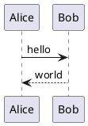
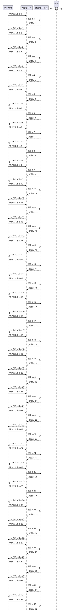
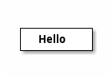
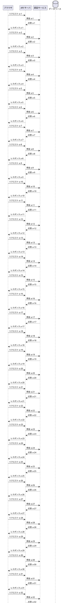

# PlantUML の描けないもの（E2E-240）

このファイルは **E2E-240（PlantUML の制限）を実施するための検証用データ**です（E2E-012）。
利用者に見せる文書ではなく、「描けないものが、理由とともに示されるか」を人が確かめるために、
**失敗する記法だけを集めて**あります。**描ける図は対照として 2 つだけ**置いています（1 節の小さな図と、9 節の上限のすぐ下の大きな図）。

`showcase.md`（BR-053）と分けているのは、あちらが **GitHub と並べて目視比較する**ための文書
（MD-002）であり、失敗例を混ぜると比較する側が読みにくくなるためです。

> [!IMPORTANT]
> **実施の前にネットワークを切断してください。** 取り込み指令（`!include` 系）で
> 外部への接続試行が起きないことも、このケースの確認対象です（NFR-032）。

## 1. 正常な図（対照）

**この図だけは描けます。** 以下の失敗が、他の図の描画を妨げていないことを確かめるために置いています。

```plantuml
@startuml normal
Alice -> Bob : hello
Bob --> Alice : world
@enduml
```

## 2. 構文エラー

**PlantUML のエラー図がそのまま出ます**（FR-024）。行番号と該当行を含むため、こちらで書き直しません。
Mermaid（FR-023）とは見え方が違いますが、これは処理系の返し方が違うためです。

```plantuml
@startuml syntaxerror
Alice -> : missing target
this is not plantuml at all
@enduml
```

## 3. 取り込み指令（`!include`）

**図にならず、理由と元のソースが出ます**（MD-084, IMP-119）。Go 側で検査して描画対象から外すため、
処理系には渡りません。

```plantuml
@startuml include
!include shared/common.puml
Alice -> Bob : hi
@enduml
```

## 4. 取り込み指令（`!includeurl`）

外部の URL を指す形です。**ここで待たされたら、それ自体が不具合**です（NFR-032）。

```plantuml
@startuml includeurl
!includeurl http://example.invalid/theme.puml
Alice -> Bob : hi
@enduml
```

## 5. 標準ライブラリ（C4 モデル）

`!include <C4/...>` は取り込み指令の一種であり、**同梱した処理系は標準ライブラリを持ちません**（MD-083）。
**C4 モデル図は描けません。**

```plantuml
@startuml stdlib
!include <C4/C4_Container>
Person(user, "User")
System(app, "MarkView")
Rel(user, app, "reads")
@enduml
```

## 6. 上限（100,000 px）を超える図

処理系が描画を拒みます（MD-083）。**Java 版の PlantUML には無い制限**です。上限の値は MarkView が処理系へ渡しており、
v1.2.0-rc.1 までは 4096 px でした（[BUG-030](../../docs/bugs/2026-11-11-bug-030-plantuml-size-limit.md)）。

> [!IMPORTANT]
> **このブロックの書き方には理由があります**（[BUG-010](../../docs/bugs/2026-09-06-bug-010-plantuml-4096-testdata.md)、BUG-030）。
>
> - **繰り返しは処理系の `!while` と `!procedure` で書きます。** メッセージを何千行も書かずに、上限を超える
>   高さの図を作れます。どちらも取り込み指令ではないため、拒まれません（MD-084）
> - **区間あたり 130 回（メッセージ 4,160 本）にしてあります。** 図の高さはフォントで変わり、**Linux の CI（Chrome）
>   では Windows より 1 割ほど低くなります**（9 節の図が Windows 90,120 px・Linux 79,212 px）。110 回では Windows
>   116,520 px に対して Linux は約 102,500 px と上限に近く、フォントや処理系の版が少し変わると上限に届かなくなる
>   おそれがあったためです（v1.2.0-rc.2 の前の CI で気づいた）
> - **処理系は配置を計算し終えてから大きさを確かめます。** このブロックは、理由が出るまでに数秒かかります
>   （その間は画面が止まります。BUG-030）
>
> **実測値**: 上限を外して描くと 420 × 137,640 px（PlantUML 1.2026.9。Windows の Chromium）。Linux の CI では
> 約 121,000 px の見込みです。拒まれるときの処理系の英文は `Diagram too large for browser rendering: <幅>x<高さ> (max 100000; …)`
> の形です
>
> **`@startuml toolarge` の名前を消さないでください。** 描画スモークテスト（BR-054）が**ブロックを名前で見分けます**。どのブロックも先頭行が `@startuml` のままでは、機械が区別できません。

```plantuml
@startuml toolarge
participant "ブラウザ" as A
participant "API サーバ" as B
participant "認証サービス" as C
database "データベース" as D
!procedure $calls($n, $tag)
!$i = 1
!while $i <= $n
A -> B : リクエスト $tag-$i
B -> C : 照会 $tag-$i
C --> B : 応答 $tag-$i
B --> A : レスポンス $tag-$i
!$i = $i + 1
!endwhile
!endprocedure
$calls(130, "a")
opt 条件 1
$calls(130, "b")
end
$calls(130, "c")
opt 条件 2
$calls(130, "d")
end
$calls(130, "e")
opt 条件 3
$calls(130, "f")
end
$calls(130, "g")
opt 条件 4
$calls(130, "h")
end
@enduml
```

## 7. `salt`（UI モック）

同梱した処理系が対応していない図種別です（MD-083）。

```plantuml
@startsalt
{
  Login    | "         "
  Password | "         "
  [Cancel] | [  OK   ]
}
@endsalt
```

## 8. `ditaa`

同上（MD-083）。

```plantuml
@startditaa
+--------+
| Hello  |
+--------+
@endditaa
```

---

## 確認の観点（E2E-240）

- 1 の図は**描けている**。以降の失敗が他の図を止めていない
- 2 は **PlantUML のエラー図が図として出る**（行番号を含む）
- 3・4・5 は**図にならず**、理由と元のソースが英語で出る
- **6 は図にならず、理由と元のソースが出る。** **`Syntax Error?` の図が出たら不具合**です——大きさの制限に達する前に、ソースが文法違反で弾かれています（BUG-010）
- 7・8 は、**エラー図が出るか、理由と元のソースが出るかのどちらか**である（判定は「SVG が得られたか」だけで行うため。DSP-272）。**どちらであっても空白にならない**
- 描けなかったブロックのコピーボタンから、**元の PlantUML ソース**が取れる
- **待たされる箇所がない**（外部への接続試行がない。NFR-032）

## 9. 上限のすぐ下の図（描ける。6 節の対照）

**この図は描けます。** 縦に長いシーケンス図（参加者 4 人・`opt` 4 つ）で、高さは約 8〜9 万 px です（フォントで変わります）。
上限（100,000 px）のすぐ下の大きさでも描けることと（MD-083。[BUG-030](../../docs/bugs/2026-11-11-bug-030-plantuml-size-limit.md)）、
**描いている間も元のソースが出ていて、図の場所が空白にならないこと**（DSP-272）を確かめるために置いています。

> [!IMPORTANT]
> **区間あたり 85 回（メッセージ 2,720 本）で、高さは Windows の Chromium で 90,120 px、Linux の CI の Chrome で
> 79,212 px です**（実測。PlantUML 1.2026.9。フォントの違いで Linux は 1 割ほど低い）。上限との間に 1 割ほどの余裕を
> 残しています。処理系の版でメッセージの間隔が変わっても、上限を超えないためです。描画スモークテストが見るのは
> 「高さ 60,000 px 以上の図が出ること」です（どちらの環境でも 2 割以上の余裕がある。4096 px や 8192 px の上限なら
> 描かれない）。
>
> **`@startuml nearlimit` の名前を消さないでください。** 描画スモークテスト（BR-054）が、この図が描けたこと（上限が
> 4096 px のままになっていないこと）を名前で見分けて確かめます。

```plantuml
@startuml nearlimit
participant "ブラウザ" as A
participant "API サーバ" as B
participant "認証サービス" as C
database "データベース" as D
!procedure $calls($n, $tag)
!$i = 1
!while $i <= $n
A -> B : リクエスト $tag-$i
B -> C : 照会 $tag-$i
C --> B : 応答 $tag-$i
B --> A : レスポンス $tag-$i
!$i = $i + 1
!endwhile
!endprocedure
$calls(85, "a")
opt 条件 1
$calls(85, "b")
end
$calls(85, "c")
opt 条件 2
$calls(85, "d")
end
$calls(85, "e")
opt 条件 3
$calls(85, "f")
end
$calls(85, "g")
opt 条件 4
$calls(85, "h")
end
@enduml
```
