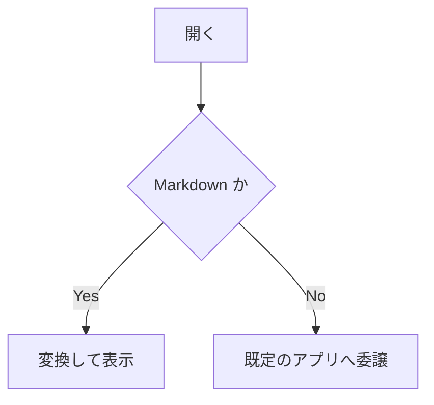
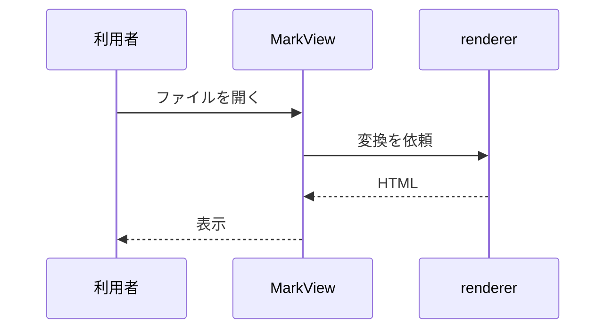

# MarkView Showcase

このファイルは **MarkView が対応するすべての Markdown 記法**を 1 枚に集めたものです（BR-053）。
用途は 2 つあります。

1. `renderer` のゴールデンテスト（UT-214）で、意図しない描画変化を機械的に検出する。
2. GitHub 上の表示と MarkView の表示を目視で並べて比較する（MD-002）。

そのため **GitHub でもそのまま読める内容**にしてあります。

---

## 見出し（MD-020）

### レベル 3

#### レベル 4

##### レベル 5

###### レベル 6

Setext 形式の見出し
===================

Setext 形式のレベル 2
---------------------

## アンカー（MD-021）

見出しのアンカーは GitHub 互換の規則で作ります。

## アンカー（MD-021）

同じ見出しが 2 回現れた場合、2 つ目には連番が付きます。

### What's New?

### 1. はじめに

### foo_bar-baz

## リスト（MD-022）

- 順序なしリスト
- 2 つ目の項目
  - 入れ子の項目
    - さらに入れ子
- 3 つ目の項目

1. 順序付きリスト
2. 2 つ目
   1. 入れ子の順序付き
   2. その 2
3. 3 つ目

- [x] 完了したタスク
- [ ] 未完了のタスク
- [ ] チェックボックスは読み取り専用

用語
: 定義リストは CommonMark の範囲外のため、対応しません。

## 引用（MD-023）

> 引用です。
>
> 段落を分けた引用。

> 引用の中の入れ子
>
> > さらに内側の引用

> 引用の中のリスト
>
> - 項目 1
> - 項目 2

## 表（MD-024）

| 左寄せ | 中央寄せ | 右寄せ | 既定 |
| :--- | :---: | ---: | --- |
| a | b | c | d |
| `code` | **強調** | [リンク](https://example.com) | 100 |
| セル内の \| | ~~打消し~~ | *斜体* | — |

## 水平線・段落・改行（MD-025）

段落は空行で区切ります。

行末に空白を 2 つ置くと  
その位置で改行します。

バックスラッシュでも\
改行できます。

***

___

## 折りたたみ（MD-026）

<details>
<summary>クリックで開く</summary>

折りたたみの中にも Markdown を書けます。

- 項目 1
- 項目 2

</details>

## コードブロック（MD-030, MD-031, MD-032）

```go
package main

import "fmt"

func main() {
	fmt.Println("hello")
}
```

```python
def greet(name: str) -> None:
    print(f"hello, {name}")
```

```diff
- 削除された行
+ 追加された行
  変わらない行
```

```
言語指定のないコードブロック
ハイライトは適用されません
```

```nosuchlanguage
未知の言語もエラーにせず、ハイライトなしで表示します
```

    インデント形式のコードブロック
    4 スペースで始めます

~~~
チルダ 3 つのフェンスも使えます
~~~

インラインコードは `fmt.Println("x")` のように書きます（MD-033）。
バッククォートを含む場合は `` ` `` のように囲みを増やします。

## GitHub Alerts（MD-040）

> [!NOTE]
> 補足情報です。

> [!TIP]
> 知っていると役立つ情報です。

> [!IMPORTANT]
> 見落とすと困る情報です。

> [!WARNING]
> 注意が必要な情報です。

> [!CAUTION]
> 危険を伴う情報です。

> [!SOMETHING]
> 種別として認識できない場合は、通常の引用として描画します。

## 脚注（MD-050）

脚注への参照です[^1]。もう 1 つ[^note]。

[^1]: 1 つ目の脚注。
[^note]: 名前付きの脚注。**強調**も使えます。

## 絵文字（MD-051）

ショートコードは :sparkles: :rocket: :warning: のように書きます。
絵文字そのもの 🎉 も表示できます。

## 数式（MD-060）

インライン数式は $E = mc^2$ のように書きます。
下付き文字を含む $x_1 + x_2 = y$ も、強調として解釈されません。

通貨表記の $100 と $200 は数式になりません。

ブロック数式:

$$\int_{0}^{\infty} e^{-x^2} dx = \frac{\sqrt{\pi}}{2}$$

コードブロック形式のブロック数式:

```math
\sum_{i=1}^{n} i = \frac{n(n+1)}{2}
```

## リンク（MD-070）

- インラインリンク: [GitHub](https://github.com)
- タイトル付き: [GitHub](https://github.com "GitHub のトップページ")
- 参照リンク: [参照形式][ref]
- 自動リンク: https://example.com
- 山括弧の自動リンク: <https://example.com>
- メールアドレス: <someone@example.com>
- 相対リンク: [同じディレクトリの文書](./other.md)
- アンカーリンク: [foo_bar-baz の節へ](#foo_bar-baz)

[ref]: https://example.com "参照リンクの定義"

## 画像（MD-071）

ローカル画像（1x1 の透明 PNG のため、ほぼ見えません）:


リモート画像（存在しない URL のため、代替テキストが表示されます）:


画像をリンクで囲んだもの:

[](https://example.com)

## 生 HTML（MD-072）

キーボード操作は <kbd>Ctrl</kbd> + <kbd>C</kbd> のように書きます。

化学式 H<sub>2</sub>O、指数 x<sup>2</sup>、<mark>ハイライト</mark>、<ins>挿入</ins>、<abbr title="HyperText Markup Language">HTML</abbr>。

<table>
<thead><tr><th>生 HTML の表</th><th>2 列目</th></tr></thead>
<tbody><tr><td>a</td><td>b</td></tr></tbody>
</table>

<script>alert('このスクリプトは除去されます')</script>

<div class="attacker-defined" style="color: red" onclick="alert(1)">
許可されていないクラス・style 属性・イベントハンドラは除去されます。
</div>

## Mermaid（MD-080）




