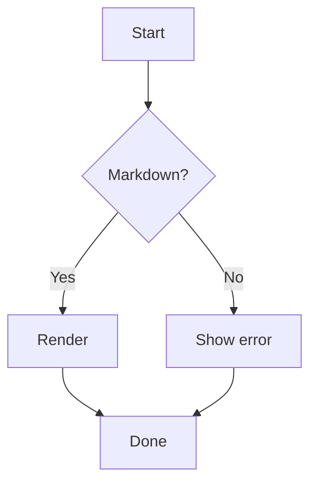
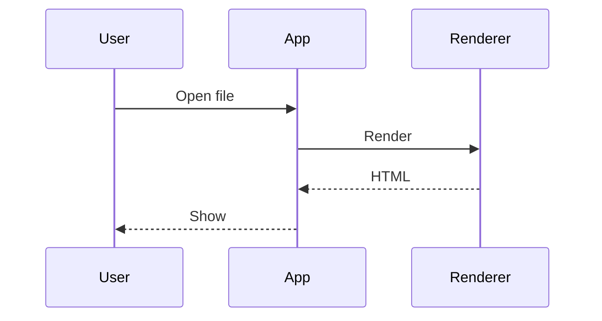
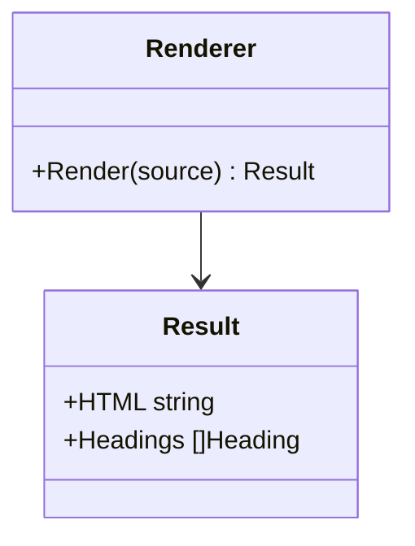
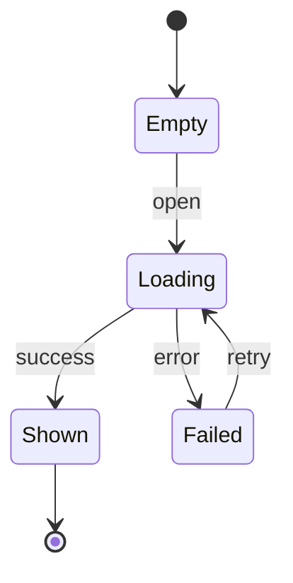
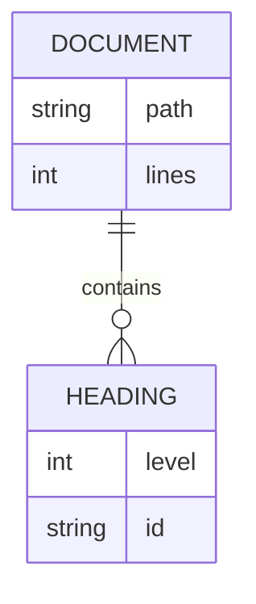
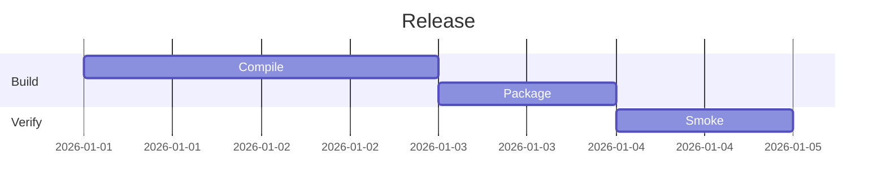
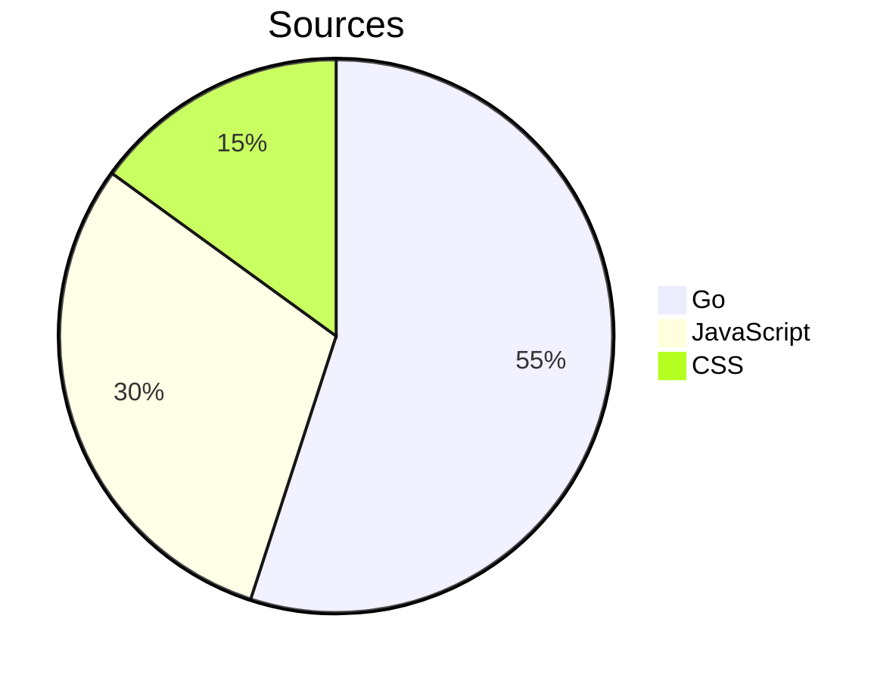
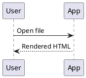
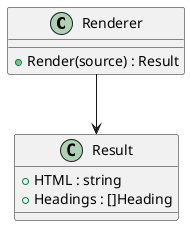

# 描画スモークテスト用の文書（BR-054）

このファイルは **`scripts/smoke` が読み込む検証用の文書**です。人が読むためのものではなく、
Mermaid の 7 種類の図、PlantUML の 2 種類の図、KaTeX の 3 通りの数式が「実際に描画できるか」を
機械的に確かめるために、最小限の内容だけを並べています。

`showcase.md`（BR-053）と分けているのは、あちらが **GitHub と並べて目視比較する**ための文書
（MD-002）であり、Mermaid を 2 種類しか含まないためです。BR-054 が求める 7 種類を足すと
比較する側が読みにくくなります。BR-054 は共用を許していますが、必須とはしていません。

> [!IMPORTANT]
> **図の種類を減らさないこと。** `scripts/smoke` は 7 種類がすべて揃っていることを検査します。
> 種類を増やしたときは `scripts/smoke/main.go` の `mermaidKinds` にも足してください。

> [!IMPORTANT]
> **数式に色を指定する記法（`\color` など）を書かないこと。** KaTeX は解釈できない
> コマンドを `errorColor` で着色して描き切るため、`scripts/smoke` は「出力に色が付いていたら
> 失敗」と判定します（`harness.js` の `KATEX_FAILURE`）。自分で色を付けると区別できなくなります。

## Mermaid（MD-080）

### flowchart



### sequenceDiagram



### classDiagram



### stateDiagram



### erDiagram



### gantt



### pie



## PlantUML（MD-083）

> [!IMPORTANT]
> **`@startuml` に名前を付けること。** `scripts/smoke` は `data-source` の 1 行目
> （`@startuml sequence` / `@startuml class`）で種別を見分けます。名前を外すと
> どちらも `@startuml` になり、検査が「図が文書に見つからない」で落ちます。

> [!IMPORTANT]
> **2 種類とも減らさないこと。** Graphviz を要する図（class）と要さない図
> （sequence）を分けているのは、`viz-global.js` の読み込みに失敗しても
> **要さない図だけは描けてしまう**ためです（IMP-233 の 4）。片方だけでは
> この壊れ方を見落とします。

### sequence（Graphviz を要さない）



### class（Graphviz を要する）



## 数式（MD-060）

インライン数式は $E = mc^2$ と $x_1 + x_2 = y$ の 2 つを置いています。

ドル記号による囲みのブロック数式:

$$\int_{0}^{\infty} e^{-x^2} dx = \frac{\sqrt{\pi}}{2}$$

コードブロック形式のブロック数式:

```math
\sum_{i=1}^{n} i = \frac{n(n+1)}{2}
```
